# Jarvis 日报 · 2026-09-02

候选 699 → 过滤后 349 → 入选 18。图例：⭐ 核心方向 · 🌐 全领域热点 · ✅ 已掌握前置 · 🔲 需补前置

## 📄 论文 · 核心方向

### 1. ⭐ 📄 EmbodiedSkills: A Unified Framework for Orchestrating, Training, and Deploying VLA Agents
arXiv [2609.01281](https://arxiv.org/abs/2609.01281) · Wei Wang, Wenqiao Zhang, Yutong Lin 等 · [PDF](https://arxiv.org/pdf/2609.01281)

**一句话**：用 executable skill 约束 VLA agent，RoboTwin 2.0 平均 86.20%
**为什么值得你看**：适合看“机器人 agent 不是只会出动作”

**核心架构**：反直觉点在于：长程操作失败时，问题常不在 action prediction 本身，而在“这一步现在能不能做、做完有没有真的成功”。现有 end-to-end VLA 把中间决策吞进黑箱，LLM 式机器人 agent 又会提出看似合理但对当前物理状态不合法的技能。EmbodiedSkills 的关键改动是把每个 skill decision 当成 execution proposal：skill 有 typed I/O 和 prerequisites，runtime 先做 preflight check 再执行，之后用 verifier 写回结果；这样阻断的是“过期观测、缺参数、阶段不匹配、非法状态迁移”直接变成物理动作。最直接的证据是它在 AgentLoop 里把 planning、verification、recovery 都记录成 structured trajectories，低层 policy 可替换但 loop 不变；作者报告 task-adapted low-level VLA 在 RoboTwin 2.0 50 个任务上 86.20%，LIBERO 四套 97.40%，而 RMBench 记忆依赖任务只有 12.5%，说明这个框架对可执行技能有效，但对需要长时记忆/更强状态推理的任务还不够。新意主要在系统组织层，不是新视觉策略。

- 最强证据是预检+后验验证的闭环，不是单次动作精度
- RMBench 12.5% 说明记忆依赖场景仍脆弱
- 复现难点在真实机器人闭环与 verifier 设计
**精读价值**：值得精读，重点看它怎么把技能接口变成闭环约束
**关联**：[[ReAct]]、[[Sutton et al. 1999]]
#vla #agent #planning #infrastructure · 难度：中等 · 建议：建议精读
前置：🔲 [[vision-language-action]] · 🔲 [[planning]] · 🔲 [[memory]] · 🔲 [[ReAct]]

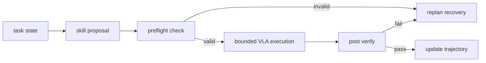
打分理由：VLA长程框架：前提检查/结果验证，强可落地（core 10 / wide 7）

### 2. ⭐ 📄 Facet-0: A Robotic Foundation Model for Contact-Rich Precise Manipulation
arXiv [2609.01596](https://arxiv.org/abs/2609.01596) · Haoyuan Deng, Haichao Liu, Wenkai Guo 等 · [PDF](https://arxiv.org/pdf/2609.01596)

**一句话**：用 action-wrench 联合建模做精密装配，5 任务 82%
**为什么值得你看**：适合看机器人后训练和接触建模怎么接上

**核心架构**：反直觉点在于，精密装配里两个看起来几乎一样的运动，可能一个顺利插入、一个直接卡死；只看视觉或末端位姿不够。Facet-0 把“接触后果”变成 policy 要预测和评价的对象：先把 causal wrench history 和视觉-语言、kinematic state 对齐，再用 flow matching 一次生成 action chunk 和它将引起的 future wrist-wrench profile；这阻断的是“几何上对齐但物理上会 jam”的错误。部署时又用 distributional Action-Wrench Critic 评估 proposed action + anticipated wrench，把相似进度但不同接触结果分开；phase-aware reward 和 contact-selective credit 只把更新压到决定性接触上。最直接支撑的是消融：semantic-contact alignment 仅 16%，value-guided refinement 到 38%，再加 bounded local adaptation 到 82%，说明提升主要来自把 contact consequence 纳入表示与价值学习，而不只是更大数据。新意在组件层加了 wrench 预测头和接触 critic，也在实证层给了 1000 小时 force-synchronized corpus。

- 82% vs 最强基线 15%，且给出 0.5 mm 和 50 ms
- 16%→38%→82% 的消融最能说明关键机制
- 复现门槛高：真实制造数据和力同步采集
**精读价值**：值得精读，核心是把接触当成可预测的后果而不是观测
**关联**：[[RT-1]]、[[Act3D]]
#vla #robotics #foundation-model #rl · 难度：硬核 · 建议：建议精读
前置：🔲 [[vision-language-action]] · 🔲 [[flow matching]] · ◽ reinforcement learning · 🔲 [[diffusion model]]

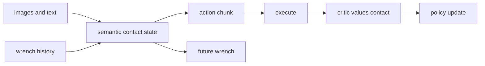
打分理由：接触丰富操作的机器人基础模型，重磅方向（core 10 / wide 8）

### 3. ⭐ 📄 Defense-as-Skill: Evolving Runtime Guard Skill for Skill-Augmented Agents
arXiv [2609.01487](https://arxiv.org/abs/2609.01487) · Xiaofang Yang, Ziqi Miao, Dianbo Sui 等 · [PDF](https://arxiv.org/pdf/2609.01487)

**一句话**：把 runtime guard 做成 skill，SCOPE-R 上 ID ASR 降到 0.104
**为什么值得你看**：适合看 agent 安全和 skill 系统的 runtime 防护

**核心架构**：反直觉点在于，技能越可复用，越可能把恶意指令变成长期驻留的 steering channel；而且真正危险的动作常在“任务和 workspace 状态刚好合适”时才出现，预装扫描抓不住。Defense-as-Skill 的关键改变是把 guard 本身做成一个 installable skill：SkillSonar 和普通任务技能并行运行，但每个敏感 action 都先按用户 task boundary 过一遍 allow / replan / confirmation。它阻断的是“动作在语义上看似合理、在安全上却越界”的 runtime 失败，而不是安装时的静态文件问题。最直接证据是 SCOPE-R：206 个 attack-confirmed malicious instances、43 个 benign tasks；在 repeated GLM-5 runs 上，SkillSonar 把 ID ASR 从 0.482 降到 0.104、OOD ASR 从 0.606 降到 0.115，同时还测了对 held-out risk families 和 adaptive attackers 的迁移。新意主要在系统组织层和实证层：把安全责任做成 skill-native artifact，并用 MCTS 在 rollout 上进化它。

- SCOPE-R 只保留 attack-success-confirmed 样本，证据更硬
- ID/OOD ASR 都明显下降，但依赖显式调用护栏技能
- 复现难点在 agent harness 和对抗式 rollout 生成
**精读价值**：值得精读，尤其适合做 agent 安全方向面试谈资
**关联**：[[Prompt Injection]]、[[ReAct]]
#agent #security #rlhf · 难度：中等 · 建议：建议精读
前置：🔲 [[prompt injection]] · 🔲 [[ReAct]] · 🔲 [[planning]] · 🔲 [[multi-agent]]

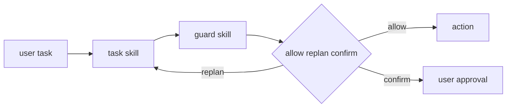
打分理由：防御-as-skill保护技能体，强贴合agent安全（core 10 / wide 8）

### 4. ⭐ 📄 ZimaBlue: Evolving Generalizable World Action Models through Scalable Video Pre-training
arXiv [2609.00188](https://arxiv.org/abs/2609.00188) · HF 🔥 38 · Xionghao Wu, Yijun Yang, Shiyang Zhou 等 · [PDF](https://arxiv.org/pdf/2609.00188) · [代码](https://github.com/ZimaBlue-WAM/ZimaBlue) ★3

**一句话**：用 120k 小时视频预训练 WAM，零样本成功率 36.1%→77.8%
**为什么值得你看**：做具身/RL 方向面试很有谈资

**核心架构**：反直觉点在于：机器人最缺的是动作标注，但最容易扩大的却是第一人称视频；直接拿视频生成器接控制又会卡在“看起来对、动作不对”。ZimaBlue 的关键改变是把学习拆成三段：先用 causal embodied video pre-training 学“会发生什么”的时空/物理先验，再用 unified action representation 把多种机器人轨迹对齐到同一动作语义，最后针对目标机器人做 post-training，阻断“只记住单一机体动作格式”的失败。真正支撑这个设计的证据不是视频预测，而是 zero-shot manipulation：从仅目标机器人数据到加入 120,000 小时视频，成功率按作者报告从 36.1% 升到 77.8%；再配合 Slow-Fast dual-system，把高容量 world model 和轻量 fast branch 解耦，闭环延迟降到 33 ms、能在 RTX 4090 上 30 Hz 出动作。新意主要在系统组织层：不是单个更强 policy，而是数据来源分工 + 异步控制架构。

- 最强证据是零样本任务成功率随视频规模单调上升
- 没证明通用到所有机器人；强依赖统一动作表示
- 复现难在大规模视频与多 embodiment 数据管线
**精读价值**：值得精读，核心是视频如何变成可控世界模型
**关联**：[[DreamZero]]、[[LingBot-VA]]
#world-model #video #embodiment · 难度：硬核 · 建议：建议精读
前置：🔲 [[vision-language-action]] · ◽ world model · 🔲 [[diffusion model]] · 🔲 [[KV cache]]

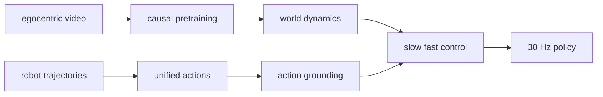
打分理由：视频驱动世界/动作模型，具身泛化强相关（core 9 / wide 6）

### 5. ⭐ 📄 LightNav-0: Eliciting VLM Spatial Intelligence for Generalist Embodied Navigation
arXiv [2608.30935](https://arxiv.org/abs/2608.30935) · HF 🔥 26 · Shaoan Wang, Aocheng Luo, Fei Huang 等 · [PDF](https://arxiv.org/pdf/2608.30935) · [代码](https://github.com/lightorigins/LightNav-0) ★253

**一句话**：用 Qwen3-VL 做统一导航骨干，10 个公开设置拿到 SOTA
**为什么值得你看**：适合看 VLM 如何落到 embodied navigation

**核心架构**：问题不是“导航模型不够大”，而是现有系统把感知、推理、动作拆成任务头和专用模块，换场景或换机器人就断。LightNav-0 的关键改法是让 pretrained VLM 直接承担空间推理，再用 dual-channel pointing 先产出“空间意图”：affordance point 负责可走方向或中继点，object point 负责目标定位，随后再由 residual VQ action tokenizer 把这个意图压成具体轨迹，阻断“任务间动作接口不兼容”的失败；temporal history compression 则阻断“长历史塞爆上下文”。最直接的证据是 LightNav-ER 先在 8 个 embodied-reasoning benchmark 上拿到最高 complete-set average，再初始化 LightNav-0 后，在 10 个公开导航模拟环境上做到 SOTA，且真实机器人上能跨 embodiment、静态/动态目标零样本泛化。新在系统组织层：把导航统一成 token 接口，而不是再堆一个 waypoint head。

- 最强证据是 10 个公开导航设置的统一提升
- 没证明离开 monocular RGB 后仍稳定
- RVQ + action decoder 让精度和 token 效率做了取舍
**精读价值**：值得通读，能看清 VLM 导航接口怎么统一
**关联**：[[NaVid]]、[[NavFoM]]
#vlm #navigation #embodied · 难度：中等 · 建议：值得通读 (20 min)
前置：🔲 [[VLM]] · ◽ visual grounding · 🔲 [[planning]] · ◽ tokenization

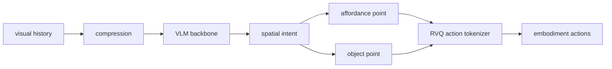
打分理由：VLM空间智能到导航，开源且高相关（core 9 / wide 8）

### 6. ⭐ 📄 CAST: Critique-Aware Supervision for Training Reliable Long-Horizon Tool-Calling Agents
arXiv [2608.30147](https://arxiv.org/abs/2608.30147) · HF 🔥 6 · Amir Saeidi, Zehua Zhang, Rishitosh Singh 等 · [PDF](https://arxiv.org/pdf/2608.30147)

**一句话**：用 critique supervision 训练工具调用代理，Retail pass^4 提升 10%+
**为什么值得你看**：很适合面试讲 agent reliability 和 RLHF 式训练

**核心架构**：悖论是：长链路 agent 最致命的错往往不是最终答案，而是中间一步看似合理的工具调用；但多数训练只看终局 reward，critic 也常在事后才看得到更多信息。CAST 的关键改变是把稀疏轨迹结果转成 action-level verification rationales：先跑 teacher 收集多次轨迹，再让 agentic verification 生成“这一步在当时是否有效”的结构化 critique，训练出 CAST-Critic；再用这个 critic 去给新交互打标，构造 critique-enriched 数据训练 CAST-Policy，阻断“中间动作缺乏可验证监督”的失败。最直接的证据是四个动态工具调用域里，Qwen3 微调后在 in-domain Retail 上相对 base 提升 22.6% pass^1、12.94% pass^4，out-of-domain 平均也有 3.7%/5.1% 提升，而且比重型 agentic 框架更省 token 和延迟。新意在实证层 + 训练层：把可靠性定义成跨 trial 一致性，并把 critique 变成可训练信号。

- 最强证据是 pass^4 提升，说明重复试验一致性变好
- 没解决超长链路下的事实外泄，critic 仍依赖生成质量
- 复现难在多轮轨迹标注和 critique 生成管线
**精读价值**：值得精读，核心是把可靠性做成可监督对象
**关联**：[[Reflexion]]、[[Self-Refine]]
#agent #tool-use #rlhf #safety · 难度：硬核 · 建议：建议精读
前置：🔲 [[tool use]] · ◽ critique · 🔲 [[reward model]] · 🔲 [[GRPO]]

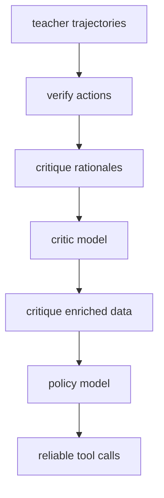
打分理由：面向长程工具调用可靠性，研究与可面试化强（core 9 / wide 6）

### 7. ⭐ 📄 WebWorld: The Browser as a World Model for Self-Improving Web Code
arXiv [2608.30530](https://arxiv.org/abs/2608.30530) · HF 🔥 5 · Jiajun Wu, Jian Yang, Yaxin Du 等 · [PDF](https://arxiv.org/pdf/2608.30530)

**一句话**：WebWorld 用浏览器当 world model，让自改 Web code 的 VLM 只学被证实的修复；HTMLBench-400 +5.3、MiniAppBench-Val +14.9。
**为什么值得你看**：适合看 agent / web code 的闭环训练怎么避免自骗。

**核心架构**：反直觉点在于：页面截图看起来更好，不代表按钮真的能点、旧功能没被改坏。传统 critique-and-rewrite 让同一个 VLM 同时当 proposer 和 judge，判断还停留在 screenshot space，所以“看起来对”很容易把坏修复选进去。WebWorld 把关键改动换成浏览器可验证的 interaction contract：VLM 先提 critique，planner 把它编成带 target predicate、preserve set、evidence path 的 typed contract；browser 重新执行候选，只在目标进展成立且所有已验证能力都保住时发 acceptance certificate；只有 certified transitions 进入 quality ratchet 和 SFT export。最直接的证据是 9B ablation：拿掉 certificate 后，增益几乎消失，说明提升主要来自 browser-backed admission，不是更会写 prompt。新意在系统组织层：把“生成-筛选”改成“假设-证明”分离。

- 最强证据是 9B 去证书后几乎无增益
- 没证什么：只对 HTML/交互式页面有效
- 复现难点在浏览器证据与契约编译
**精读价值**：值得精读，核心是把自改 agent 的监督改成可证据化。
**关联**：[[ReAct]]、[[SWE-bench]]
#agent #world-model #browser #self-improve · 难度：硬核 · 建议：建议精读
前置：🔲 [[VLM]] · ◽ agent · 🔲 [[planning]] · 🔲 [[memory]]

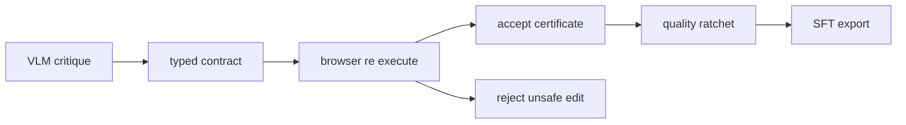
打分理由：浏览器作为world model监督，VLM自进化闭环（core 9 / wide 7）

### 8. ⭐ 📄 mzCache: On-Device LLM Memory Management under Multitasking
arXiv [2609.01338](https://arxiv.org/abs/2609.01338) · Hongseung Yu, Minsung Kim, Jongseok Park 等 · [PDF](https://arxiv.org/pdf/2609.01338)

**一句话**：mzCache 让手机端 LLM 在多任务抢内存时还能零等待恢复；相比 storage-backed partial offload，TTFT 降 2.1–5.5×。
**为什么值得你看**：适合补训练/推理系统里 KV cache 和移动端内存管理。

**核心架构**：痛点不是单次推理慢，而是手机一切换 app，OS 会把模型权重和 KV cache 挤出内存；等用户回来时，要么慢读存储，要么重算整段 cache，TTFT 从 0.8 秒拖到 16 秒。mzCache 的关键改法是 restoration-oriented memory management：把 weights/KV cache 切成细粒度 shared buffers，利用 mobile SoC unified memory 让 GPU 可先跑、CPU 并行恢复；再用 hybrid swap 和 backward-out eviction，把可恢复路径和淘汰顺序设计成“无论从哪种部分驱逐状态回来，都能尽快恢复”。最直接的证据是作者在真实手机上测到：相对 storage-backed partial offload，TTFT 提升 2.1–5.5×；而且正文明确说通用压缩的 zRAM 基本压不动 KV cache，所以系统不是靠更强压缩，而是靠恢复路径和驱逐策略。新意在系统组织层和运行时机制层。

- 最强证据是商业手机上的 TTFT 测试
- 没证明通用桌面/服务器场景收益
- 依赖 unified memory 与具体 SoC 结构
**精读价值**：值得通读，能补上 on-device LLM 的系统短板。
**关联**：[[KV cache]]、[[Speculative decoding]]
#inference #kv-cache #systems #on-device · 难度：中等 · 建议：值得通读 (20 min)
前置：🔲 [[KV cache]] · 🔲 [[quantization]] · 🔲 [[vLLM]] · 🔲 [[KV cache]]

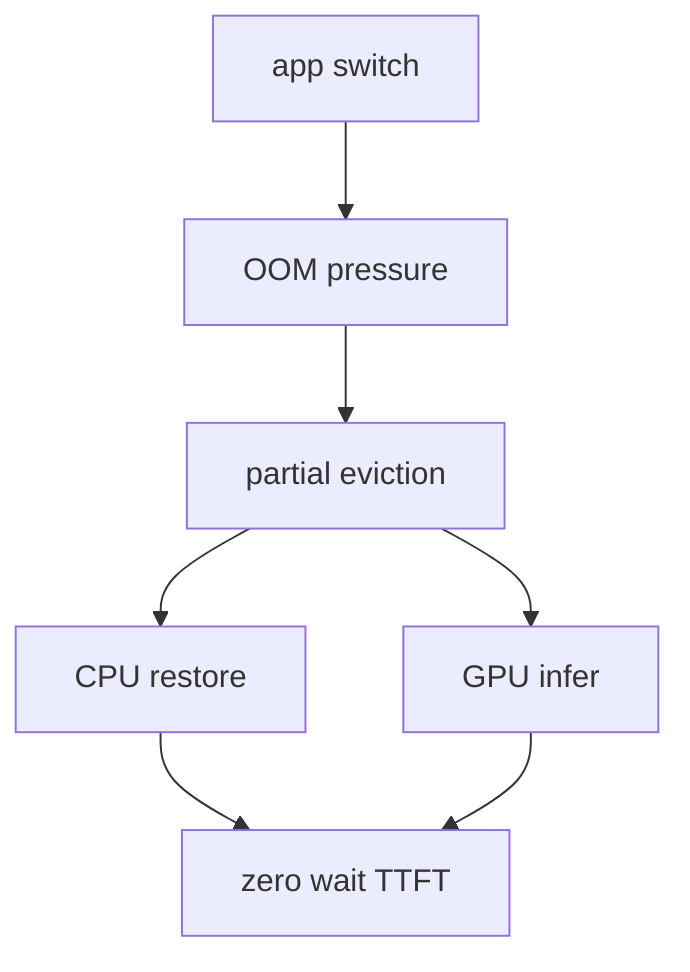
打分理由：移动端并发的KV/内存管理，系统工程强相关（core 9 / wide 8）

## 🧰 项目 · 核心方向

### 9. ⭐ 🧰 calesthio/OpenMontage
[GitHub](https://github.com/calesthio/OpenMontage) ★55,576 (+5232 本周) · Trending weekly · Python

**一句话**：OpenMontage 把“做视频”拆成 agentic pipeline，靠 12 条生产流水线和 100+ tools 自动脚本、找素材、剪辑、渲染；星标 55,576。
**为什么值得你看**：适合看 agent 工程化：多工具编排、内容生产闭环。

**核心架构**：它解决的是“想做一条完整视频，但脚本、素材、配音、剪辑、合成都要人手搓”的痛点。核心搭法不是单一聊天框，而是生产系统：用户给一句话或参考视频，agent 先分析 transcript、pacing、scene、keyframes，再产出分化概念、tool path、cost estimate；中间的 Backlot 作为可见运行时，把脚本、scene card、asset generation、provider decision 和花费逐步写出来，必要时还把资产生成暂停成 approval gate，等你逐镜头确认后再 render。成熟度信号比较强：README 明确给了 Quick Start、pipelines、Agent Guide、Replay Run，还展示了多条可复现作品和成本；但原文未明确 release 版本和测试覆盖，更多是“能跑、能展示、能回放”的产品态。和同类比，它差在不是简单的视频 prompt 工具，而是把生成、审阅、回放做成一套 agentic production system。

- 最强证据是有 Backlot、Replay Run、approval gate
- 没证明：成本和质量在所有题材都稳定
- 复现门槛取决于外部模型与素材供应
**为什么现在上榜**：作者报告 stars +5232 today；原文未明确正式 release。
**精读价值**：看项目速览就够，价值主要在 agent 生产管线设计。
**关联**：[[ReAct]]、[[model context protocol]]
#agent #agentic #video · 难度：中等 · 建议：看速览即可
前置：◽ agent · 🔲 [[planning]] · 🔲 [[memory]] · 🔲 [[multi-agent]]

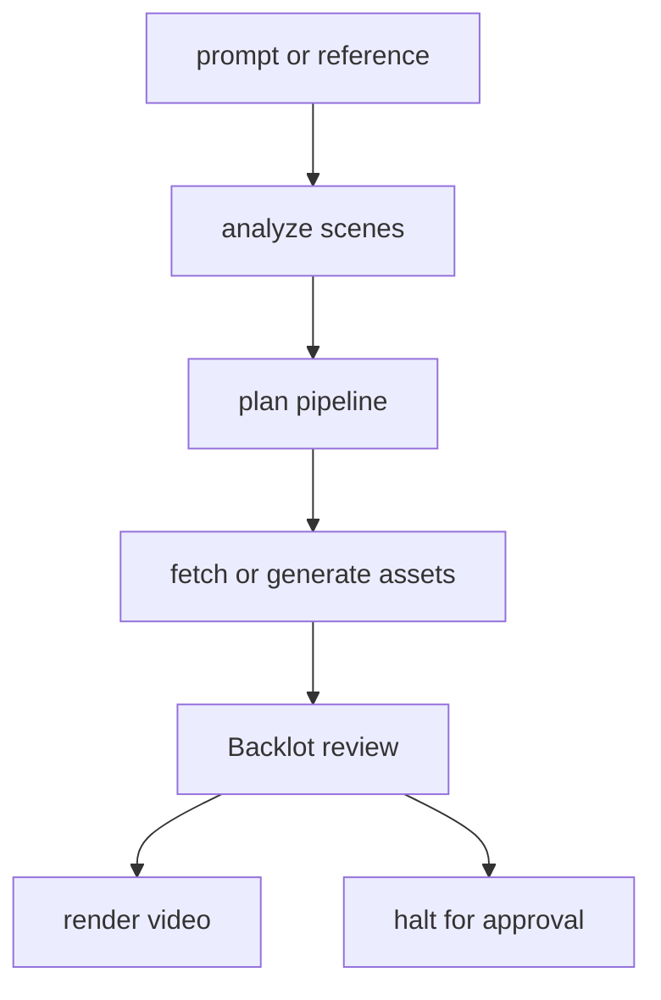
打分理由：启发式打分（无 API key）（core 9 / wide 9）

### 10. ⭐ 🧰 Osmantic/ODS
[GitHub](https://github.com/Osmantic/ODS) ★5,869 (+1144 本周) · Trending weekly · Python

**一句话**：一键把本机变成 AI server，装好本地推理/UI/Agent/RAG；v2.6.0 加远程 provider 和 Model Switchboard。
**为什么值得你看**：看本地 AI 栈怎么做成可装、可回滚的系统

**核心架构**：它解决的不是“能不能跑模型”，而是“本地 AI 环境每次都要手搓一串服务”的悖论：模型、UI、RAG、语音、自动化各自能装，但一旦混到桌面/服务器/不同 GPU 平台，安装、端口、权限、回滚就变成主要失败点。ODS 的关键改变是把它做成一个部署系统：安装器负责选模型、拉起服务、写入配置，dashboard 负责统一管理，Model Switchboard 负责在不同 LLM 应用间稳定路由并把 context 传过去，GPU reassignment rollback 负责把硬件切换失败恢复掉。最直接的证据是 2.6.0 的 release 验证说明：remote provider、Windows/macOS 原生运行时、Linux rootless 修复、GPU 重分配回滚都被纳入稳定线，说明它关注的是“可恢复地上线”。新意主要在系统组织层，不是新模型。

- 2.6.0 把远程 provider 和路由稳定化
- release 强调验证和回滚，不只是功能
- 本质是 local AI deployment system，不是单点工具
**为什么现在上榜**：v2.6.0 已是 stable release。
**精读价值**：适合想看本地 AI 栈工程化的人精读。
**关联**：[[Ollama]]、[[Open WebUI]]
#llm #agent #rag · 难度：中等 · 建议：值得通读 (20 min)
前置：◽ LLM inference · ◽ RAG · 🔲 [[KV cache]] · ◽ Docker

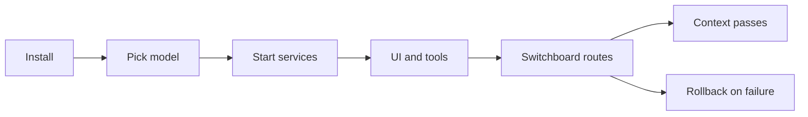
打分理由：启发式打分（无 API key）（core 9 / wide 8）

### 11. ⭐ 🧰 TencentCloud/TencentDB-Agent-Memory
[GitHub](https://github.com/TencentCloud/TencentDB-Agent-Memory) ★25,679 (+15686 本月) · Trending monthly · TypeScript

**一句话**：把 Agent 经验拆成四类可复用资产，2.0.1 新增多客户端接入和会话内操作。
**为什么值得你看**：面试 Agent memory 和团队协作设计时很能讲

**核心架构**：它直击的痛点是：Agent 做过的事、读过的文档、踩过的坑，下一次还要重新讲一遍。现有做法常把 memory 当成聊天摘要或向量库，结果是“能检索但不能复用、能记但不能治理”。这里的关键概念改变是把经验拆成四种资产：Chat Memory 记偏好和决策，Skill 记可执行流程，LLM-Wiki 记文档知识，Code-Graph 记代码关系；再通过 Memory Hub 统一治理，通过 Proxy 让不同 framework 只改 base URL 就能接入，阻断“框架锁死导致记忆割裂”。最直接的支撑是 2.0.1 的 release：新增 OpenCode、dsh、Codex CLI、WorkBuddy 接入，并把会话重置、任务创建、绑定持久化、技能检索盲区修掉，说明它在真实多客户端场景里已经在跑。新意在系统组织层和产品化成熟度。

- 四类资产不是简单摘要，强调可治理和可共享
- Proxy 只改 base URL，主打零代码接入
- release 暗示已在多客户端场景验证过
**为什么现在上榜**：作者报告 2.0.1 于 2026-08-25 发布。
**精读价值**：值得看，尤其适合 Agent memory 方向面试。
**关联**：[[ReAct]]、[[retrieval-augmented generation]]
#llm #agent #memory · 难度：中等 · 建议：值得通读 (20 min)
前置：🔲 [[memory]] · 🔲 [[multi-agent]] · 🔲 [[retrieval-augmented generation]] · 🔲 [[model context protocol]]

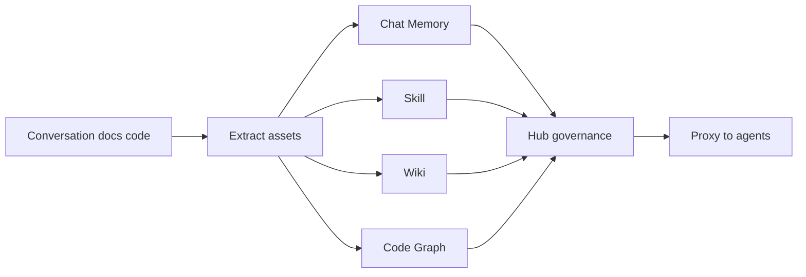
打分理由：启发式打分（无 API key）（core 9 / wide 10）

### 12. ⭐ 🧰 volcengine/OpenViking
[GitHub](https://github.com/volcengine/OpenViking) ★35,128 (+7321 本月) · Trending monthly · Python

**一句话**：把 Agent 上下文做成 viking:// 文件系统，L0-L2 分层加载；0.3.22 在 LoCoMo 上提到 80–83%。
**为什么值得你看**：很适合看 context database 和长上下文替代方案

**核心架构**：它解决的是一个反直觉问题：Agent 记忆越多，不一定越聪明，反而更容易在向量库里“搜到但读不对”。传统 memory/RAG 把上下文当黑盒检索，难以判断为什么命中、该读到多深。OpenViking 的关键改变是把 memories、resources、skills 统一成 `viking://` 目录树，先在写入时生成 L0 abstract、L1 overview、L2 details，再按任务深度按需加载；目录递归检索先找最高分目录，再逐层下钻，阻断“命中碎片但丢上下文”的失败。最直接的证据是它报告在 LoCoMo 上三种 agent 集成都到 80–83% accuracy，同时 token 和 latency 明显下降；这是对“分层加载 + 目录式检索”是否真省上下文的实证支撑。新意在组件层加系统组织层：既是数据结构，也是检索运行时。

- 把 context 做成可浏览文件系统，而不是黑盒向量库
- 分层加载主打省 token，但依赖写入时先处理好层级
- 复现难点在于需要完整的目录检索和层级生成管线
**为什么现在上榜**：作者报告 0.4.17.1 于 2026-08-31 发布。
**精读价值**：如果你关心 Agent memory / 长上下文，建议精读。
**关联**：[[graph RAG]]、[[retrieval-augmented generation]]
#agent #rag #memory · 难度：硬核 · 建议：建议精读
前置：🔲 [[retrieval-augmented generation]] · 🔲 [[embedding]] · 🔲 [[reranker]] · 🔲 [[long context]]

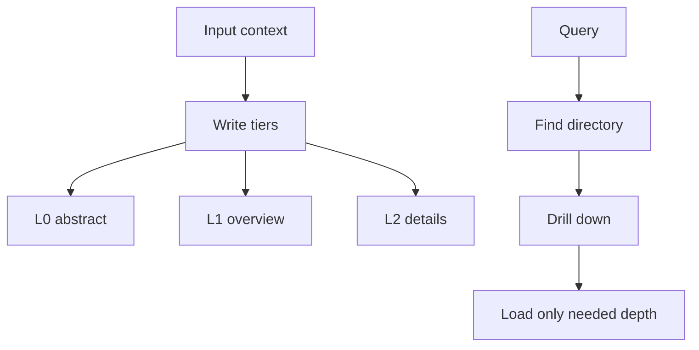
打分理由：启发式打分（无 API key）（core 9 / wide 10）

### 13. ⭐ 🧰 tt-a1i/archify
[GitHub](https://github.com/tt-a1i/archify) ★43,359 (+25469 本周) · Trending weekly · JavaScript

**一句话**：Archify用typed JSON IR+deterministic render把系统描述变成可验证HTML图，输出PNG/SVG/WebM
**为什么值得你看**：做Agent/RAG架构汇报和面试图，能直接拿来用

**核心架构**：它解决的是一个反直觉问题：同一套系统图，作者想强调的方向、边界和路径，到了别的工具里常被重排成“看起来对、事实却不对”的图。普通 diagram 工具要么靠手工拖拽，要么把生成图交给模型自由发挥，都会在方向、路径和引用来源上失真。Archify 的关键改变是把“图”拆成 typed JSON IR，再由 deterministic compiler 固定成 HTML/SVG：IR 负责约束结构，编译器负责阻断幻觉拓扑和不稳定渲染；验证层负责拦住未证实边、重复边、错误路由。最直接的证据不是宣传页，而是它公开的 traced repository case：对 `mco-org/mco` 做源码追踪后生成 checked map，并提供 Before/Delta/After、upstream/downstream reach、route probe 这些可核验视图。新意主要在系统组织层，不是单一绘图库，而是“生成—验证—交互—导出”一体的 agent skill。

- 源码追踪后还能保留 authored direction 和 exact route
- 自带验证 receipts，但原文未明确覆盖到哪些错误类型
- 复现门槛低，核心是理解 IR schema 和渲染约束
**精读价值**：适合精读：看它怎么把可验证图谱做成 agent skill
**关联**：[[Mermaid]]、[[D3.js]]
#agent · 难度：中等 · 建议：值得通读 (20 min)
前置：◽ agent · ◽ typed JSON · ◽ deterministic rendering · 🔲 [[graph RAG]]

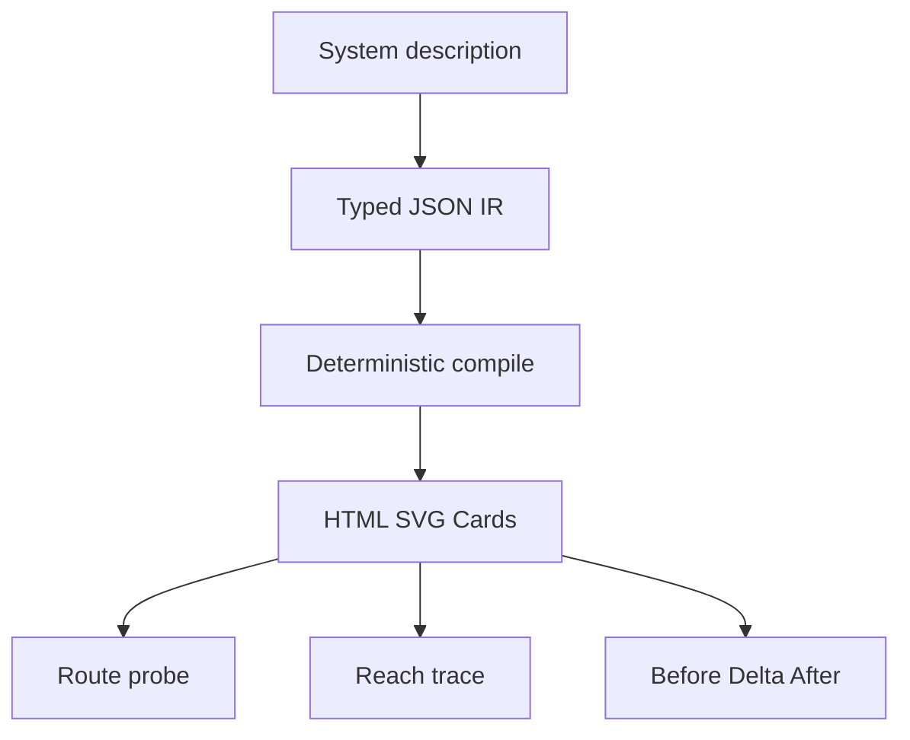
打分理由：启发式打分（无 API key）（core 8 / wide 10）

### 14. ⭐ 🧰 diegosouzapw/OmniRoute
[GitHub](https://github.com/diegosouzapw/OmniRoute) ★60,195 (+23410 本月) · Trending monthly · TypeScript

**一句话**：OmniRoute用一个免费网关接352个providers，作者报告约1.51B free tokens/月
**为什么值得你看**：LLM 工程里常见的多模型路由、降本和 MCP 接入都对口

**核心架构**：它解决的是“免费额度分散到几十家 provider、还会随时失效”的现实痛点。单纯把所有 API 拼成一个转发层，问题会变成：不知道哪个模型真有额度、哪个池子共享同一预算、哪个请求该降级到别的后端。OmniRoute 的关键设计是把 provider 目录、quota-aware scheduling、telemetry 和 compression 绑在同一个 gateway 里：检测到额度紧张就走 Quota-Share/auto-fallback，检测到上下文太长就先做 RTK+Caveman compression，再把请求发到可用后端。作者报告 v3.8.50 有 352 providers、1312 model IDs，并新增 vision/audio/video bridge、radar free catalog、live quota telemetry；这是成熟度信号，因为它不只是列表页，而是有 release、cycle stats、MCP/CLI 兼容和持续审计。和常见 proxy 相比，它差在“路由+配额感知+压缩+多模态桥”是一体的运行时机制，而不只是 API 代理。

- 作者报告 352 providers、1312 model IDs
- 最强证据是 release cycle 统计，未见独立基准
- 价值在降本路由；是否稳定取决于各 provider 配额变动
**为什么现在上榜**：最近 release：v3.8.50（2026-08-26），并新增 Quota-Share 与 live telemetry
**精读价值**：值得看项目成熟度和网关编排，不必深挖全部文档
**关联**：[[OpenRouter]]、[[LiteLLM]]
#dpo · 难度：中等 · 建议：值得通读 (20 min)
前置：🔲 [[model context protocol]] · 🔲 [[quantization]] · 🔲 [[speculative decoding]] · 🔲 [[KV cache]]

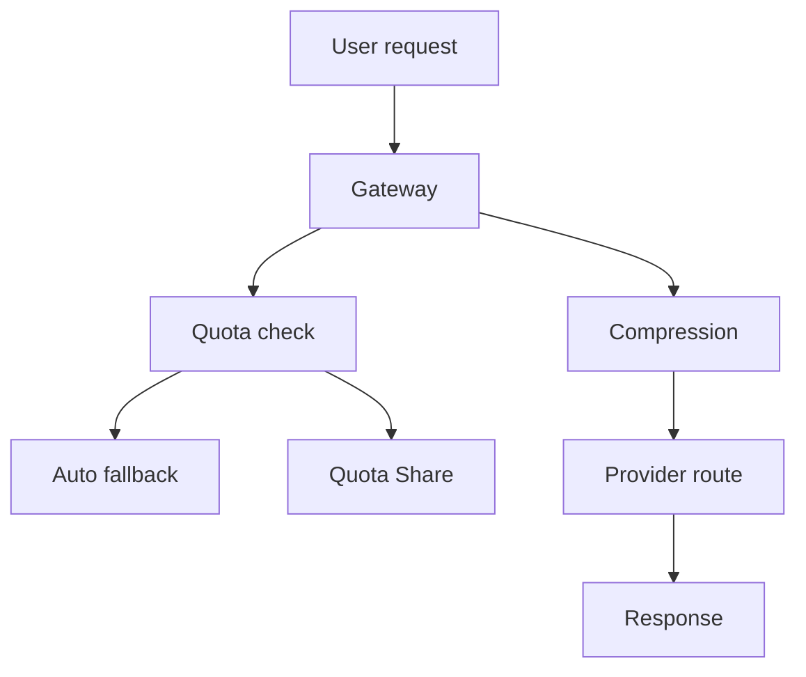
打分理由：启发式打分（无 API key）（core 8 / wide 10）

## 🌐 全领域热点

### 15. 🌐 🧰 public-apis/public-apis
[GitHub](https://github.com/public-apis/public-apis) ★474,478 (+21253 本月) · Trending monthly · Python

**一句话**：public-apis是一个社区维护的免费 API 索引，收录跨领域接口入口
**为什么值得你看**：适合做产品原型和数据源备忘，但不算研究热点

**核心架构**：它解决的是“想找一个现成 API 时，信息散在各处、质量参差”的检索痛点。这个仓库本质上不是运行时系统，而是人工整理的目录：把按领域分类的 free APIs、文档入口和示例链接集中起来，降低发现成本。正文里能看到它与 APILayer 套件的推广内容混在一起，说明它更像生态型索引页而非技术架构项目；原文未明确自动验证、版本化审计或运行时机制。对于想快速接入天气、股票、地理编码、搜索等外部能力的人，它的价值在于覆盖面和长期维护，而不是质量控制或统一协议。相较同类列表，它差异主要在规模和社区维护历史；但它不提供你真正需要的工程承重组件。

- 核心是目录，不是工具链或 SDK
- 未见自动测试、验证或统一接口层
- 适合找 API，不适合判断接口质量
**为什么现在上榜**：原文未明确
**精读价值**：看速览即可，适合作为资源索引而非精读对象
**关联**：[[RapidAPI]]、[[Awesome lists]]
难度：入门 · 建议：看速览即可
前置：◽ API · ◽ REST · ◽ Postman

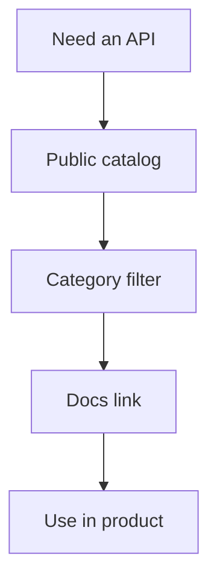
打分理由：启发式打分（无 API key）（core 7 / wide 10）

### 16. 🌐 🧰 openai/codex
[GitHub](https://github.com/openai/codex) ★120,933 (+18251 本月) · Trending monthly · Rust

**一句话**：OpenAI 终端 coding agent，本地跑；作者主打 CLI/IDE/桌面三入口。
**为什么值得你看**：你关心 agent 工程和 coding workflow，这类工具会进面试谈资。

**核心架构**：它解决的悖论是：真正能改代码的 agent，往往卡在“要进编辑器、要云端、要复杂配置”这三道门，结果使用门槛比能力更高。Codex 的关键改变不是新规划算法，而是把 coding agent 做成本地可执行的入口层：CLI 直接在终端跑，IDE 插件和桌面端把同一能力挂到不同工作流上，阻断“模型能做事但用户接不住”的失败。正文里最直接的证据是它的安装与启动路径：Mac/Linux/Windows 都有一行安装，且支持 ChatGPT 账号或 API key 两种认证；这说明它优先解决分发与接入，而不是先展示复杂推理链。新意主要在系统组织层。

- 作者报告：Stars 120933，today +18251
- 原文未明确公开评测与任务成功率
- 复现门槛低，但核心 agent 逻辑未展开
**精读价值**：看速览即可，更多是产品化入口，不是方法论文。
**关联**：[[ReAct]]、[[SWE-bench]]
#agent · 难度：入门 · 建议：看速览即可
前置：◽ agent · 🔲 [[planning]] · 🔲 [[model context protocol]]

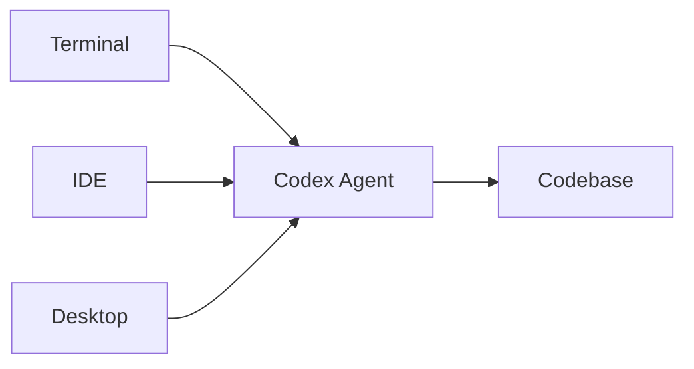
打分理由：启发式打分（无 API key）（core 8 / wide 10）

### 17. 🌐 🧰 bilawalsidhu/gods-eye-view
[GitHub](https://github.com/bilawalsidhu/gods-eye-view) ★15,683 (+12042 本周) · Trending weekly · JavaScript

**一句话**：浏览器里做实时地球情报：光学球体+公开数据+语音代理，v0.1.1 修可靠性。
**为什么值得你看**：适合看 agent+多模态+地理可视化的产品化整合。

**核心架构**：它解决的不是“有没有数据”，而是“公开信号太散，难以形成可操作态势图”的问题。作者把世界信号收进一个 photorealistic 3D globe：前端负责地球、轨迹、检测框、语音控制，后端/数据层拉飞行、船只、卫星、地震、交通和公开视频源，核心取舍是把“浏览器里的情报浏览器”做成单一空间界面，而不是一堆 tab。关键机制是按信号类型自动落到不同可视化：例如 live contacts、camera handoff、trail、share link，把“看见”直接变成“跟踪/切换/回放”。最直接的证据是 v0.1.1 的修复集中在 one-click setup 和 live-data ingestion：Pinokio 安装状态、macOS 无 key 启动、Active Fires 批次保留、GBFS 响应大小按字节限制，说明它已经在处理真实数据流的边界条件。新意主要在系统组织层。

- 作者报告：#1 on GitHub Trending, stars +12042 today
- 修复点集中在安装和实时摄取稳定性
- 原文未明确完整测试覆盖与回归范围
**为什么现在上榜**：v0.1.1（2026-09-01）
**精读价值**：值得看一眼产品整合，但速览已够判断成熟度。
**关联**：[[Google Earth Studio]]、[[ArcGIS]]
难度：中等 · 建议：看速览即可
前置：🔲 [[VLM]] · ◽ agent · 🔲 [[multi-agent]]

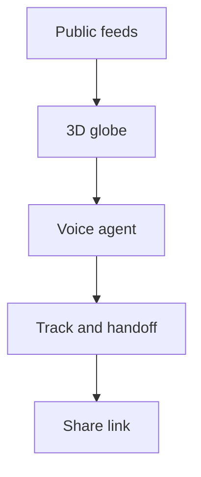
打分理由：启发式打分（无 API key）（core 7 / wide 10）

### 18. 🌐 🧰 ayghri/i-have-adhd
[GitHub](https://github.com/ayghri/i-have-adhd) ★26,612 (+11429 本月) · Trending monthly · Python

**一句话**：给 coding agent 加输出约束，强制先给行动项、编号步骤、少废话。
**为什么值得你看**：很适合面试里讲 agent 交互层与提示规范设计。

**核心架构**：它解决的场景很具体：模型明明已经找到答案，却把关键动作埋在长段解释里，导致用户看完仍不知道下一步。这个 skill 不改模型推理，而是改输出协议：先给 next action，再把多步任务编号，限制列表长度，最后必须落一个 concrete next step。它阻断的是“答案存在但不可执行”的失败，尤其适合 coding agent 的交互回路。最直接的证据是 README 里的 Before/After 对照：同一个代码修复建议，改造后从解释式段落变成“先改哪一行、先跑什么测试、失败后贴哪一行”。新意在系统组织层与交互层，不在模型层；它更像一个可复用的 agent output policy。

- 作者展示了明确 Before/After 对照
- 没有模型评测，只是交互规范
- 复现几乎零成本，主要看约束是否适配你的 agent
**为什么现在上榜**：v0.1.0/0.1.1 未提供；原文未明确
**精读价值**：看速览即可，价值在可直接套用的输出约束。
**关联**：[[ReAct]]、[[self-instruct]]
#agent · 难度：入门 · 建议：看速览即可
前置：◽ agent · 🔲 [[planning]] · 🔲 [[prompt injection]]

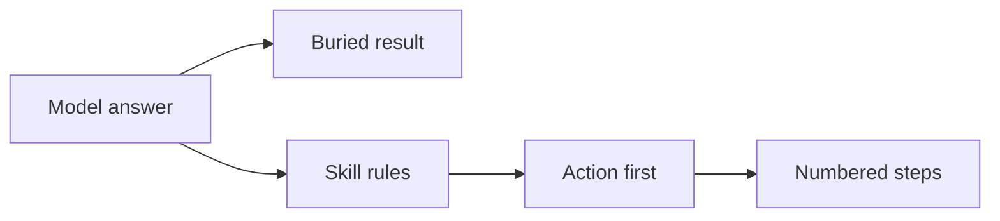
打分理由：启发式打分（无 API key）（core 8 / wide 10）

---
想精读哪一篇？在 Claude 里说：`精读 2026-09-02 第 N 条`，Jarvis 会按你的 known.md 只讲你不会的部分。