# Jarvis 日报 · 2026-09-02

候选 699 → 过滤后 349 → 入选 18。图例：⭐ 核心方向 · 🌐 全领域热点 · ✅ 已掌握前置 · 🔲 需补前置

## 📄 论文 · 核心方向

### 1. ⭐ 📄 CAST: Critique-Aware Supervision for Training Reliable Long-Horizon Tool-Calling Agents
arXiv [2608.30147](https://arxiv.org/abs/2608.30147) · HF 🔥 6 · Amir Saeidi, Zehua Zhang, Rishitosh Singh 等 · [PDF](https://arxiv.org/pdf/2608.30147)

**一句话**：CAST 用 critique supervision 训工具代理，Retail pass^4 提升超 10%
**为什么值得你看**：适合看 agent 可靠性和后训练怎么做

**核心架构**：反直觉点在于：长链工具调用里，任务最终成功不等于每一步都可靠，单次跑通的模型也会在重复试验里翻车；而现有 prompt-based critique 只能“事后点评”，训练时又拿不到可学习的逐步验证理由。CAST 的关键变化是把稀疏轨迹结果转成 action-level critique supervision：先用同一任务多次 rollout 收集轨迹，再由 agentic verification 生成“当前动作在当下信息下是否有效”的结构化理据，训练出 CAST-Critic；再让这个 critic 回头给新轨迹打细粒度验证标签，构造 critique-enriched 数据去优化 policy。最直接的证据是动态 tool-calling 基准上，Qwen3 细调后在 Retail 的 pass^4 比 GPT-OSS-120B 高出 10%+，并且 Telehealth 还有额外 9% 的 OOD 提升，说明改的是跨步一致性而不只是单次命中率。新意主要在组件层和系统组织层：把“批注模型”变成可训练、可复用的数据生成中间件。

- 最强证据是 pass^4 跨域提升，不只是单次 pass^1
- 没证明通用到所有 agent 形态；依赖动态工具环境
- 复现门槛在于要有多轮 rollout 和高质量 critique 生成
**精读价值**：值得精读，核心是把稀疏结果变成逐步监督
**关联**：[[Reflexion]]、[[Self-Refine]]
#agent #tool-calling #reliability #rlhf · 难度：中等 · 建议：值得通读 (20 min)
前置：🔲 [[ReAct]] · 🔲 [[planning]] · 🔲 [[memory]] · ◽ tool-calling

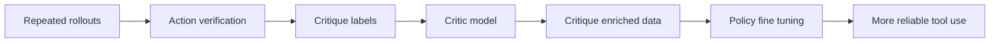
打分理由：面向长程工具调用可靠性的监督/训练，直击痛点（core 10 / wide 5）

### 2. ⭐ 📄 Facet-0: A Robotic Foundation Model for Contact-Rich Precise Manipulation
arXiv [2609.01596](https://arxiv.org/abs/2609.01596) · Haoyuan Deng, Haichao Liu, Wenkai Guo 等 · [PDF](https://arxiv.org/pdf/2609.01596)

**一句话**：Facet-0 用动作加 wrench 预测做精密装配，82% 成功率
**为什么值得你看**：对 VLA、robot RL 和具身面试都很对口

**核心架构**：这里的悖论是：两个动作在视觉上看起来几乎一样，落到装配末端却可能一个顺利插入、一个直接卡死；只学 motion 会把“看起来对”误当成“物理上对”。Facet-0 的关键改法是把 contact 当成动作的未来后果来建模：先把 causal wrench history、视觉语言语义和 kinematic state 融合成 semantic-contact representation，再用 flow matching 同时生成 action chunk 和它预期引发的 future wrist wrench；部署 rollout 里再训练 distributional Action-Wrench Critic，专门区分“几何进度相近但接触结果不同”的动作，并用 phase-aware reward 把 credit 只压到关键接触步骤。最直接的证据是消融：只做 semantic-contact alignment 仅 16%，加 value-guided refinement 到 38%，再加 bounded local adaptation 才到 82%，说明性能主要来自把 contact 变成可预测、可估值、可在本体上局部适配的对象。新意主要在组件层和系统层组织：不是单纯换 action head，而是把 wrench 引进表示、生成、价值三处闭环。

- 最强证据是 16%→38%→82% 的分段消融
- 没证明离开装配类接触任务还能同样收益
- 复现难点在 force-synchronized 数据和真实机器人 rollout
**精读价值**：值得精读，接触建模和 RL 组织方式都很有信息量
**关联**：[[RT-1]]、[[Diffusion Policy]]
#robotics #vla #foundation-model · 难度：硬核 · 建议：建议精读
前置：🔲 [[vision-language-action]] · 🔲 [[flow matching]] · 🔲 [[diffusion model]] · ◽ reinforcement learning

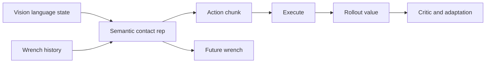
打分理由：机器人接触型基础模型，系统性强（core 10 / wide 7）

### 3. ⭐ 📄 Defense-as-Skill: Evolving Runtime Guard Skill for Skill-Augmented Agents
arXiv [2609.01487](https://arxiv.org/abs/2609.01487) · Xiaofang Yang, Ziqi Miao, Dianbo Sui 等 · [PDF](https://arxiv.org/pdf/2609.01487)

**一句话**：Defense-as-Skill 把运行时防护做成 skill，GLM-5 ASR 降到 0.104
**为什么值得你看**：适合看 agent safety 和 skill 系统边界

**核心架构**：反直觉点在于：危险不一定发生在技能安装时，而是等用户任务和工作区状态“凑齐”后才出现，所以静态审计和预安装筛查都抓不到。它的关键变化是把防守本身做成一个可安装、可编辑、可检查的 skill：SkillSonar 不改 agent runtime，只在执行时盯住敏感动作，把每个 tool call、文件操作、shell 命令映射成 allow、replan 或 confirmation。再往前一步，作者把 guard 的优化也做成 skill-native 的 MCTS 演化：在真实 rollouts 上按 attack success、task utility、confirmation burden 和 token cost 迭代 guard 文件，而不是只训一个外部 classifier。最直接的证据是 repeated GLM-5 runs 上 ID ASR 从 0.482 降到 0.104、OOD ASR 从 0.606 降到 0.115，同时还报告能保持 benign utility，说明它挡的是运行时、任务条件下的攻击而不是泛化成“全拒绝”。新意主要在系统组织层：把安全中间件纳入 skill 分发与演化范式。

- 最强证据是 ID/OOD ASR 都显著下降
- 没证明在所有 agent runtime 都同样好接入
- 复现难点在于要有带攻击确认的 task-conditioned 数据
**精读价值**：值得精读，安全中间件做成 skill 这个切法很新
**关联**：[[Reflexion]]、[[SWE-bench]]
#agent #safety #guardrails · 难度：硬核 · 建议：建议精读
前置：🔲 [[prompt injection]] · 🔲 [[ReAct]] · 🔲 [[planning]] · 🔲 [[memory]]

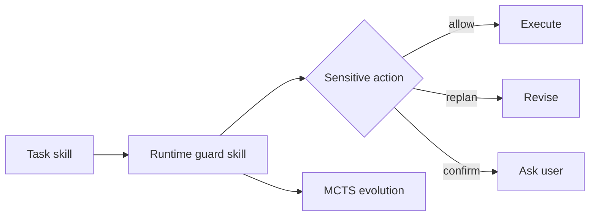
打分理由：agent运行时防护新范式，贴合防越权。（core 10 / wide 7）

### 4. ⭐ 📄 UI-Venus-2 Technical Report
arXiv [2609.00028](https://arxiv.org/abs/2609.00028) · HF 🔥 52 · Venus Team, Zhuohan Cai, Haoxing Chen 等 · [PDF](https://arxiv.org/pdf/2609.00028)

**一句话**：UI-Venus-2 用统一闭环 GUI agent 覆盖 170+ 应用，靠验证器稳住 RL 信号
**为什么值得你看**：做 Agent / GUI 自动化的人，最该看它怎么把训练信号做实

**核心架构**：反直觉点在于：GUI agent 真正卡住的往往不是“下一步点哪”，而是环境覆盖太窄、任务生成不实、reward 验证不可信，结果一旦进真实 app 就会在未见状态、半完成态和奖励漏洞里崩掉。UI-Venus-2 的关键变化不是再堆一个 action head，而是把 agent 组织成统一的 closed-loop reasoning-action：组件上，环境扩到 170+ multilingual mobile apps 和 desktop OS，任务生成用 deep-research 做 function-grounded instruction，验证器同时看 trace-level 和 sample-level，并用 visual keypoints + multi-model voting 阻断“表面进展被当成完成”和单一 judge 偏置。最直接的支撑是作者报告：加入大规模 video-like 轨迹不相关，这里 RL 信号变稳后，GUI bench 上 9B/27B 都能对强基线给出更可靠的端到端表现；正文里最像关键证据的是对 verification 的消融与 CAPTCHA/真实环境任务。新意主要在系统组织层，而不是单个模型结构。

- 最强证据在 verification 设计，直接防 reward hacking
- 没证明跨平台泛化的上限，原文未明确真实大规模部署
- 复现难点在环境、任务、judge 三套基础设施
**精读价值**：值得精读，核心价值在可训练、可验证的 GUI agent 组织方式
**关联**：[[UI-Venus]]、[[UI-Venus-1.5]]
#agent #multimodal #gui · 难度：中等 · 建议：建议精读
前置：◽ agent · 🔲 [[planning]] · 🔲 [[memory]] · 🔲 [[reward model]]

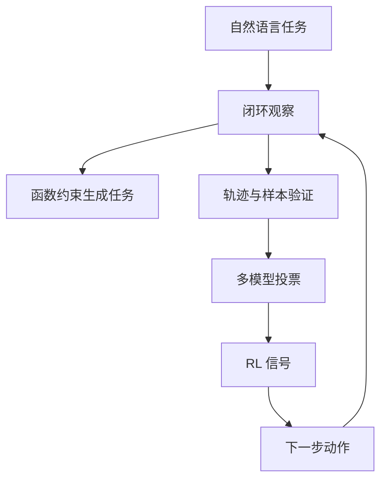
打分理由：通用GUI智能体闭环框架，贴合工程与评测（core 9 / wide 7）

### 5. ⭐ 📄 ZimaBlue: Evolving Generalizable World Action Models through Scalable Video Pre-training
arXiv [2609.00188](https://arxiv.org/abs/2609.00188) · HF 🔥 38 · Xionghao Wu, Yijun Yang, Shiyang Zhou 等 · [PDF](https://arxiv.org/pdf/2609.00188) · [代码](https://github.com/ZimaBlue-WAM/ZimaBlue) ★3

**一句话**：ZimaBlue 用 12 万小时视频预训练 WAM，零样本成功率从 36.1% 到 77.8%
**为什么值得你看**：做具身 / VLA 的人，能直接看懂它怎么补“物理经验”

**核心架构**：反直觉点在于：机器人泛化差，瓶颈不只是 policy 不够大，而是动作标注轨迹太贵，导致模型学不到足够广的物理和接触先验。ZimaBlue 的关键改法是把学习拆成三段：先用 large-scale egocentric video 做 causal embodied video pre-training，让模型先从无动作标注视频里学未来视觉变化与因果动态；再用 heterogeneous robot trajectories 做 video-action mid-training，并用 unified action representation 把不同 embodiment 的状态/动作对齐，阻断“只会某台机器人”；最后对目标机器人 post-training，校准到具体动作空间。最直接的证据是数据规模曲线：从 300 小时目标机器人数据到 6,000 小时多 embodiment 数据，再加到 60,000/120,000 小时视频，零样本成功率单调升到作者报告的 77.8%。新意在训练范式层和运行时系统层并进，后者是 Slow-Fast 双系统把闭环延迟压到 33 ms。

- 最强证据是数据规模单调提升到 77.8%
- 没证明所有任务都受益，原文未明确脆弱边界
- 复现难在 12 万小时视频与统一动作表示
**精读价值**：值得精读，核心是把视频变成可控机器人先验
**关联**：[[DreamZero]]、[[LingBot-VA]]
#video #embodied #world-model · 难度：硬核 · 建议：建议精读
前置：🔲 [[vision-language-action]] · 🔲 [[diffusion model]] · ◽ world-model · ◽ behavior cloning

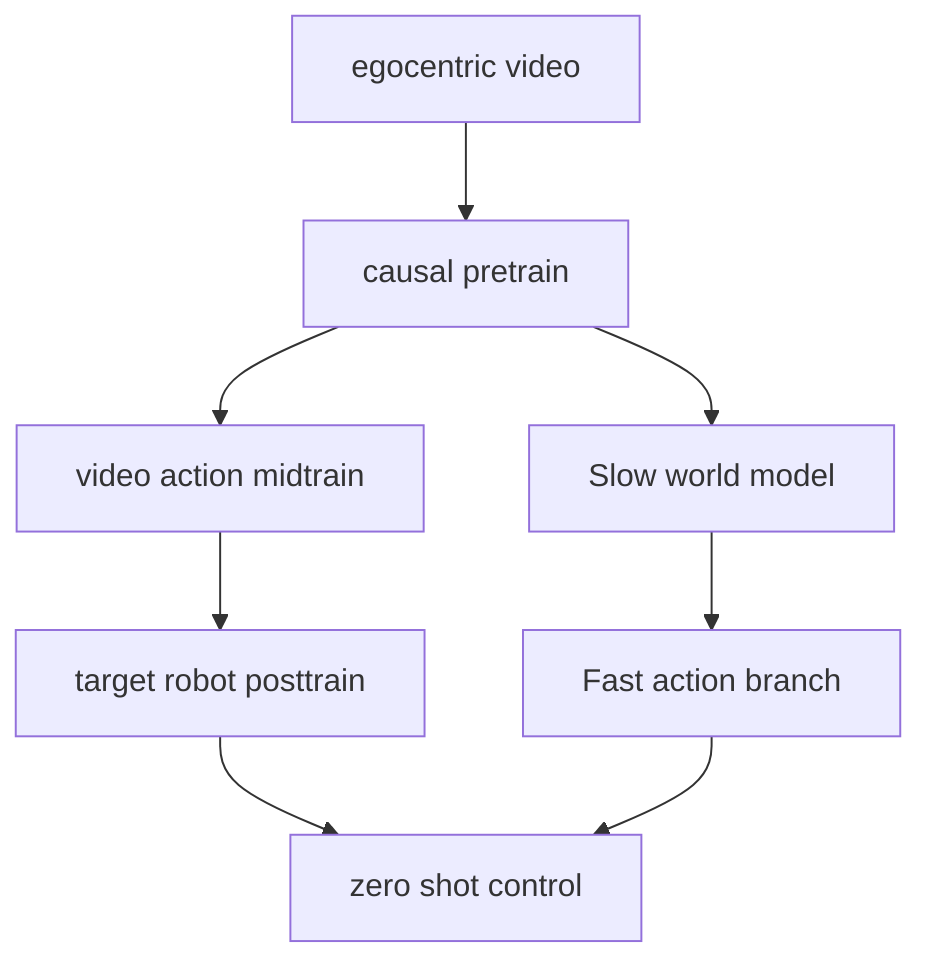
打分理由：视频预训练学习World Action Models，具身迁移强（core 9 / wide 7）

### 6. ⭐ 📄 LightNav-0: Eliciting VLM Spatial Intelligence for Generalist Embodied Navigation
arXiv [2608.30935](https://arxiv.org/abs/2608.30935) · HF 🔥 26 · Shaoan Wang, Aocheng Luo, Fei Huang 等 · [PDF](https://arxiv.org/pdf/2608.30935) · [代码](https://github.com/lightorigins/LightNav-0) ★253

**一句话**：LightNav-0 用 VLM 空间智能做通用导航，10 个设置都拿到 SOTA
**为什么值得你看**：做 VLM/具身导航的人，能直接看懂“统一接口”怎么落地

**核心架构**：反直觉点在于：导航并不一定要为每个任务单独做 waypoint、map 或 action head；这些额外结构虽然好调参，却把跨任务和跨 embodiment 的能力切碎了。LightNav-0 的关键改变是把 pretrained VLM 直接当共享 reasoning backbone，再用一个统一 token interface 承接导航：dual-channel pointing 先把“目标在哪”和“可走哪”拆成通用空间意图，residual vector-quantized action tokenizer 再把这个意图解码成具体平台轨迹，从而阻断“语义懂了但动作落不下去”。最直接的证据是作者报告：LightNav-ER 初始化在 8 个 embodied-reasoning benchmark 上拿到最高 complete-set average，LightNav-0 在 10 个公开模拟设置上拿到 monocular SOTA，且真机零样本跨 embodiment 也能泛化。新意主要在系统组织层：不是换更大 backbone，而是用 token 化接口把空间推理与控制接回同一个模型。

- 最强证据是 10 个模拟设置的统一 SOTA
- 没证明重度遮挡或长时地图场景必然稳
- 复现依赖双通道标注和 RVQ 解码细节
**精读价值**：值得精读，适合看 VLM 如何被真正“拉去做导航”
**关联**：[[NaVid]]、[[NavFoM]]
#vlm #embodied-navigation #agent · 难度：中等 · 建议：建议精读
前置：🔲 [[VLM]] · 🔲 [[vision transformer]] · 🔲 [[self-attention]] · 🔲 [[planning]]

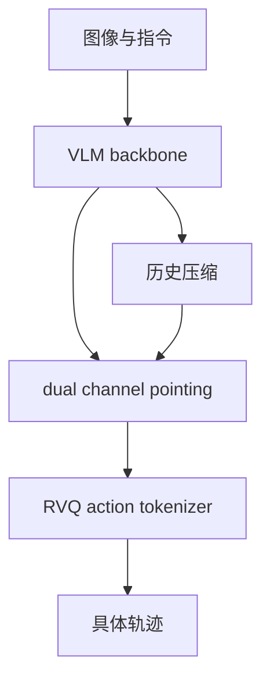
打分理由：VLM空间智能到导航控制，且开源（core 9 / wide 8）

### 7. ⭐ 📄 WebWorld: The Browser as a World Model for Self-Improving Web Code
arXiv [2608.30530](https://arxiv.org/abs/2608.30530) · HF 🔥 5 · Jiajun Wu, Jian Yang, Yaxin Du 等 · [PDF](https://arxiv.org/pdf/2608.30530)

**一句话**：WebWorld 用浏览器当 world model，自证式筛选修复，27B 在 HTMLBench-400 提升 5.3 分
**为什么值得你看**：适合看 agent 自我改进和 web 交互评测

**核心架构**：反直觉点在于：网页“看起来对”不代表“真能用”，尤其是按钮失灵、交互回归这种故障，VLM 自己看截图很容易把伪进步当进步。传统 critique-and-rewrite 还是同一个模型在提议和裁决，判断空间也停留在视觉表象，闭环就会把坏修复送进训练集。WebWorld 的关键改动是把“判断权”交给浏览器：VLM 只负责提 critique，planner 把它编成 typed interaction contract，browser 重新执行后只在“目标推进 + 已验证能力都保住”时发 acceptance certificate，certified transition 才能进入 SFT。最直接的证据是 9B 消融：去掉 certificate 后增益几乎消失，说明涨点主要来自浏览器背书而不是更会说的 critique。新意在系统组织层：把监督样本改成可证明的 state transition。

- 9B 消融显示无证书时增益几乎没了
- 只证明交互正确，不保证生成更优雅
- 复现要有可执行浏览器与证书门控
**精读价值**：适合精读，核心是“浏览器当裁判”的训练闭环
**关联**：[[ReAct]]、[[self-instruct]]
#vlm #agent #web #world-model · 难度：中等 · 建议：建议精读
前置：🔲 [[VLM]] · ◽ agent · 🔲 [[planning]] · 🔲 [[self-attention]]

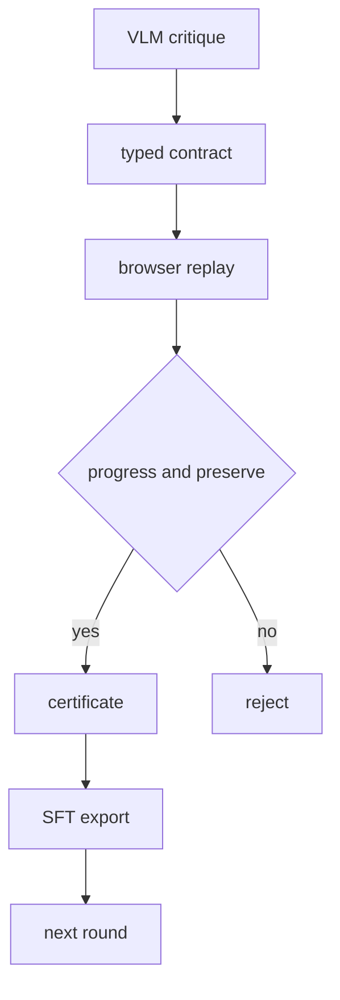
打分理由：浏览器作为世界模型，自改善web代码闭环很对口（core 9 / wide 7）

### 8. ⭐ 📄 mzCache: On-Device LLM Memory Management under Multitasking
arXiv [2609.01338](https://arxiv.org/abs/2609.01338) · Hongseung Yu, Minsung Kim, Jongseok Park 等 · [PDF](https://arxiv.org/pdf/2609.01338)

**一句话**：mzCache 用可恢复式内存管理，把手机 LLM 冷启动 TTFT 降了 2.1–5.5 倍
**为什么值得你看**：对 on-device LLM 和 KV cache 这块很对口

**核心架构**：问题不是单次推理慢，而是手机多任务切换时，LLM 的 weights 和 KV cache 会被系统挤掉；等用户回来，要么读慢存储、要么整段重算 KV cache，TTFT 直接爆掉。mzCache 的关键改变是把目标从“尽量少占内存”改成“任何被驱逐状态都能快速恢复”：它把 LLM memory 切成细粒度 shared buffers，让 CPU 可并行恢复、GPU 先开算；再用 hybrid swap 和 backward-out eviction，把可恢复路径设计成对任意 eviction state 都低延迟。最直接的证据是它在 Android 上落地后，对比 storage-backed partial offload，TTFT 降 2.1–5.5 倍，说明收益来自恢复路径而不是单纯压缩。新意在系统层，不是新模型。

- 解决的是多任务下的恢复，而非纯 offload
- KV cache 压缩只能做第二恢复通道
- 依赖 mobile SoC unified memory 条件
**为什么现在上榜**：原文未明确
**精读价值**：值得看，适合做 mobile inference / KV cache 系统面试题
**关联**：[[FlashAttention]]、[[speculative decoding]]
#inference #kv-cache #on-device #memory · 难度：硬核 · 建议：值得通读 (20 min)
前置：🔲 [[KV cache]] · 🔲 [[quantization]] · 🔲 [[vLLM]] · 🔲 [[gradient checkpointing]]

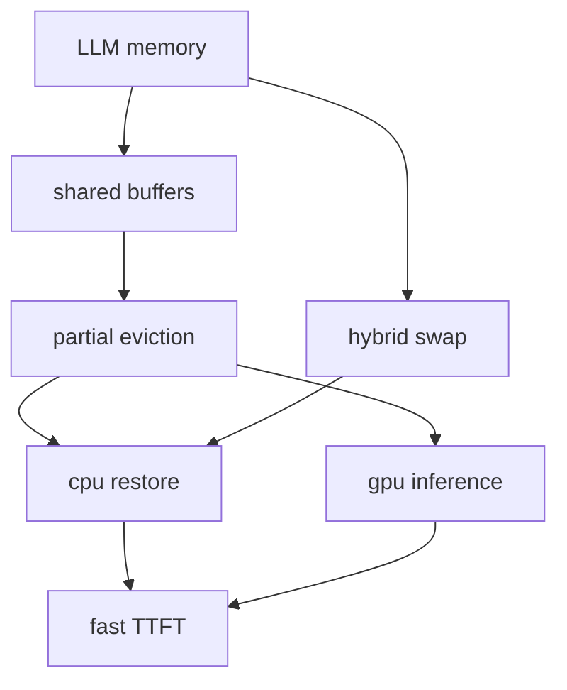
打分理由：端侧多任务KV/内存管理，系统工程价值高（core 9 / wide 6）

## 🧰 项目 · 核心方向

### 9. ⭐ 🧰 TencentCloud/TencentDB-Agent-Memory
[GitHub](https://github.com/TencentCloud/TencentDB-Agent-Memory) ★25,680 (+15686 本月) · Trending monthly · infra · TypeScript

**一句话**：TencentDB Agent Memory 把会话、文档和代码沉淀成四类团队记忆，2.0.1 新增多客户端接入
**为什么值得你看**：适合看 Agent 记忆层怎么做成可共享基础设施

**核心架构**：它解决的不是“给 Agent 加一个聊天记录”，而是团队里重复解释上下文、重复读文档、重复摸代码这些耗时回路。这个项目的承重组件是一个共享 memory server：把 Chat Memory、Skill、LLM-Wiki、Code-Graph 变成可治理、可共享、可装配的资产，客户端只要把 base URL 指过去就能接入，不需要 hook 或 MCP。核心机制是“抽取—治理—注入”闭环：对话和任务先被抽成记忆/技能，文档和代码被结构化成 Wiki 和 CodeGraph，再按团队与 Agent 绑定回灌到后续会话。成熟度信号比较强：有明确 2.0.1 release，支持 OpenCode、DeepSeek Harness、Codex CLI、WorkBuddy，多客户端接入和会话内指令说明它已从概念走到可用产品。相比普通 RAG，它差在把经验做成可复用资产，而不只是检索片段。

- 2.0.1 有明确 release 和多客户端接入
- 强项是团队级资产治理，不只是检索
- README 说 zero-code integration，需看实际适配质量
**为什么现在上榜**：最近 release：v2.0.1（2026-08-25）
**精读价值**：适合速览；像产品基础设施，重点看架构和接入形态
**关联**：[[RAG]]、[[graph RAG]]
#agent #memory #rag · 难度：中等 · 建议：值得通读 (20 min)
前置：🔲 [[retrieval-augmented generation]] · 🔲 [[embedding]] · 🔲 [[reranker]] · 🔲 [[model context protocol]]

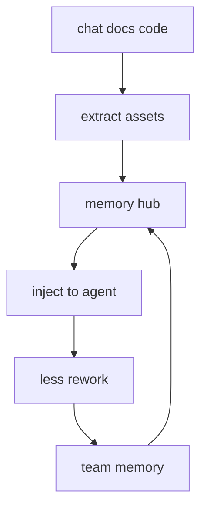
打分理由：企业级 agent memory 多资产治理与复用（core 8 / wide 7）

### 10. ⭐ 🧰 volcengine/OpenViking
[GitHub](https://github.com/volcengine/OpenViking) ★35,130 (+7321 本月) · Trending monthly · infra · Python

**一句话**：用 viking:// 统一 Agent 上下文，LoCoMo 准确率到 80–83%
**为什么值得你看**：适合看 Agent memory / RAG 架构取舍

**核心架构**：反直觉点在于：Agent 真正的上下文管理，不是“查到相似向量就塞回去”，而是“同一份记忆要能像文件系统一样被确定性浏览、分层读取、还能追踪每次检索路径”。传统黑盒 vector store 解决不了调试和按需加载：你只能看到返回了什么，看不到为什么走到这条路径，也很难把“目录级语义”保住。OpenViking 的关键改变是把 memories/resources/skills 统一成 `viking://` 虚拟文件系统：URI 负责稳定定位，L0/L1/L2 负责把写入时就压缩好的不同粒度内容拆开，递归检索先命中目录再向下钻，阻断“检索命中但上下文碎掉”和“全量读入导致 token 爆炸”两类失败；会话提交后异步抽取长期记忆，则把短期交互闭环进长期上下文。最直接的证据是 LoCoMo：同样的 agent integrations 接到 OpenViking 后到 80–83%，同时输入 token 和延迟明显下降；这比单纯涨分更能说明“分层加载 + 目录式检索”确实在控成本。新东西主要在系统组织层，不是新 embedding 模型。

- LoCoMo 80–83%，token 与延迟同步下降
- 未证明跨任务泛化边界
- 复现依赖其目录语义与分层处理管线
**精读价值**：值得精读，尤其看上下文组织层设计
**关联**：[[MemGPT]]、[[Graph RAG]]
#agent #memory #rag · 难度：中等 · 建议：建议精读
前置：🔲 [[retrieval-augmented generation]] · 🔲 [[embedding]] · 🔲 [[reranker]] · 🔲 [[memory]]

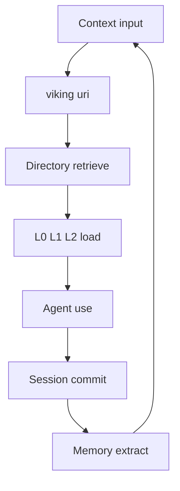
打分理由：自进化上下文数据库，契合 agent 记忆方向（core 8 / wide 9）

### 11. ⭐ 🧰 NousResearch/hermes-agent
[GitHub](https://github.com/NousResearch/hermes-agent) ★239,894 (+529 今日) · Trending daily · tool · Python

**一句话**：用内置学习环让 agent 自建技能，v0.21.0 强化多人协作与记忆
**为什么值得你看**：适合看 agent 循环、MCP 与多端编排

**核心架构**：这个项目解决的是“agent 能跑，但每次都像新手”的痛点：工具会调用，任务做完却不会把经验变成可复用能力。Hermes 的关键不是再堆一个聊天壳，而是把 agent 做成循环系统：任务中可创建 skill，结束后把轨迹压成可复用技能；会话和历史被持续搜索，记忆被定期 nudges 促进沉淀；再叠加 cron、subagents、MCP，把单次对话扩成可持续执行的工作流。它把失败模式从“每次从零开始”改成“经验可回流到后续任务”。最直接的支持来自 release 文案：v0.21.0 明确把 Bot Mode、group chats、cron memory/continuity、live steering、MCP command center 放进同一版，说明核心重心已经从单机聊天迁到多 agent 组织与持续记忆。新意主要在系统组织层和产品成熟度，不是单点算法。

- v0.21.0 规模很大，且明确引入 Bot Mode
- 未给出系统级基准，只能看功能与 release 信号
- 复现门槛在多端集成和持续运行配置
**为什么现在上榜**：v2026.8.31；release 文案明确强调 Bot Mode、group chats、cron memory
**精读价值**：看你关心 agent 组织与产品化，值得速读后再选点精读
**关联**：[[ReAct]]、[[AutoGen]]
#agent #multi-agent #reasoning · 难度：中等 · 建议：值得通读 (20 min)
前置：🔲 [[planning]] · 🔲 [[memory]] · 🔲 [[multi-agent]] · 🔲 [[model context protocol]]

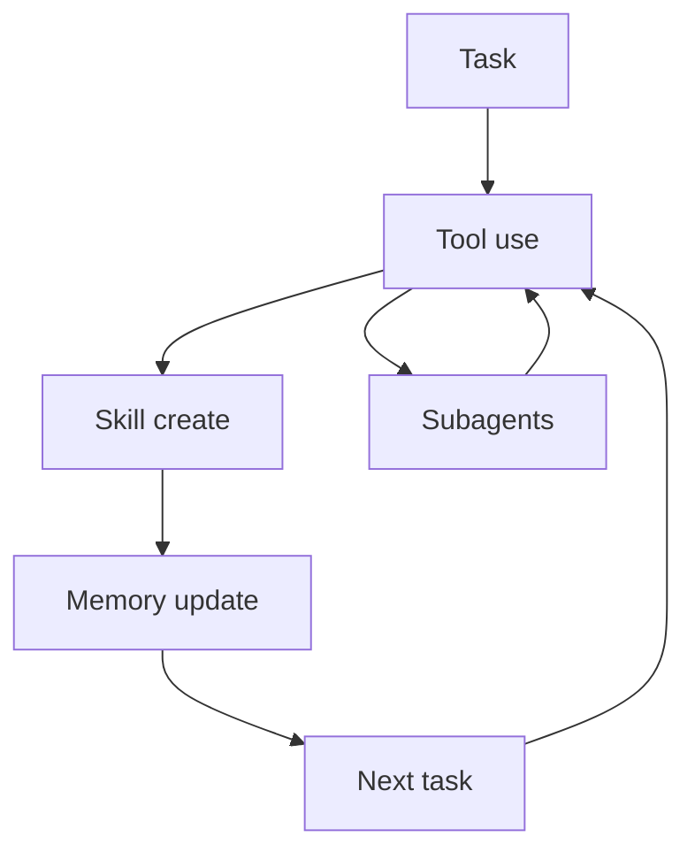
打分理由：高关注agent开源，适合讨论记忆/规划/评测（core 8 / wide 8）

### 12. ⭐ 🧰 rohitg00/agentmemory
[GitHub](https://github.com/rohitg00/agentmemory) ★27,937 (+519 本周) · Trending weekly · infra · TypeScript

**一句话**：用统一 memory server 让多 agent 共享记忆，npx 一步装好
**为什么值得你看**：适合看 agent memory 工程与 MCP 集成

**核心架构**：它解决的是“同一个人换了 Claude Code、Cursor、Codex 之后，记忆又断了”的真实痛点。现在很多 agent memory 只绑单一客户端，或者把长期记忆做成黑盒索引，迁移和调试都差。agentmemory 的承重组件是一个共享 memory server，再通过 hooks、MCP、REST 接入不同 agent；核心取舍是 keyless 时先用 BM25 保底检索，有 embedding 时再做语义回忆，知识图谱按需补强结构匹配。检测条件到处理动作很明确：捕获到会话/观察/技能信号就写入，`AGENTMEMORY_AUTO_COMPRESS=true` 才启用 LLM 压缩；`memory_recall` 走 BM25，`memory_smart_search` 才融合图结构。成熟度信号不错：README 给了 npx 直装、Windows/WSL/Docker 路径、benchmarks、connectors 和多语言文档，但它更像横向集成平台，不是单一模型论文。和同类相比，它的差异在于“跨 agent 共享”和“hooks 级自动捕获”而不是只做一个向量库。

- 新增 connect 和 hooks，偏集成平台
- keyless 可用但语义召回要依赖 embedding
- 复现成本主要在各客户端适配与权限配置
**为什么现在上榜**：最近 release 到 v0.9.29，新增 Cursor/Devin 连接器与更多 hooks
**精读价值**：值得看项目成熟度与多 agent 共享记忆方案
**关联**：[[Mem0]]、[[MemGPT]]
#agent #memory #benchmark · 难度：中等 · 建议：值得通读 (20 min)
前置：🔲 [[retrieval-augmented generation]] · 🔲 [[embedding]] · 🔲 [[knowledge distillation]] · 🔲 [[model context protocol]]

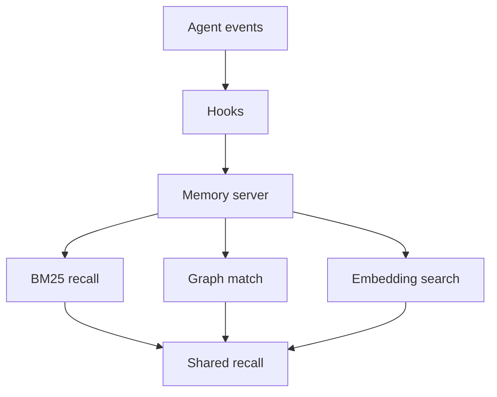
打分理由：持久记忆专注agent，且基于真实基准（core 8 / wide 7）

### 13. ⭐ 🧰 2akouwu/reverify
[GitHub](https://github.com/2akouwu/reverify) ★542 · tool · Python

**一句话**：用 deterministic RE 工具验模型猜测，64 测试把结论分成 VERIFIED/REFUTED/INCONCLUSIVE
**为什么值得你看**：适合做 agent 可靠性与二进制分析谈资

**核心架构**：反直觉点是：二进制 RE 里，LLM 最容易“编”出偏移、字段和控制流，而这类错误比源码场景更致命，因为你很难靠肉眼看出它是不是在胡说。Reverify 的关键改变不是再加一个更强的模型，而是把模型降级成 proposer，把纯 Python 的解析、disasm、pattern scan、micro-emulation 变成 judge：claim 只有在真实字节、真实指令序列或真实执行结果上对上，才会被报成 VERIFIED；对不上直接 REFUTED，证据不足则 INCONCLUSIVE。最直接的支撑是 `verify` CLI 和 `re_verify_claim` MCP tool：同一套 claim 可以批量跑，任何一个被 refute 都能让 CI 或 agent 退出非零，说明它不是 demo，而是把“可检查性”嵌进闭环。新意主要在系统组织层：不是做更多 RE 功能，而是把 RE 过程改造成可门控的 verification loop。

- 最强证据是 claim 级三态判定
- 只覆盖作者列出的 7 类 claim
- 纯 Python 但重度依赖工具完备性
**精读价值**：值得看，核心是 agent 可靠性闭环
**关联**：[[Ghidra]]、[[Frida]]
#agent #verified-re #binary-analysis · 难度：中等 · 建议：值得通读 (20 min)
前置：🔲 [[prompt injection]] · 🔲 [[ReAct]] · 🔲 [[MCP]]

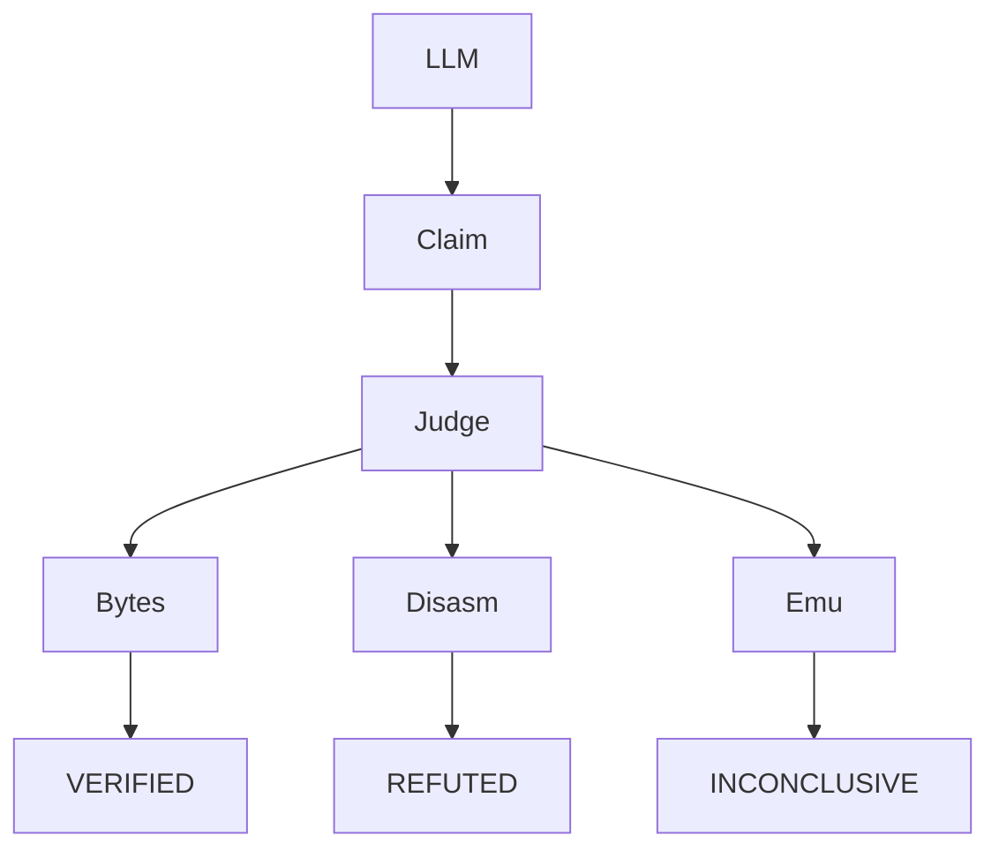
打分理由：把 AI 结果用确定性工具复核，符合可靠性方向（core 8 / wide 6）

### 14. ⭐ 🧰 JordyZomer/lemmalog
[GitHub](https://github.com/JordyZomer/lemmalog) ★257 · infra · Rust

**一句话**：用 Datalog 做 agent memory，靠 450 随机程序和增量维护把查询延迟压到约100µs
**为什么值得你看**：面试里讲 agent memory 比 vector store 更硬

**核心架构**：一个典型悖论是：agent 越跑越久，记忆越多，但每次都把全部历史塞回上下文，既贵又容易把旧信息重新“想一遍”。Lemmalog 的关键改变是把 memory 明确定义成 deductive database：LLM 只负责在 ingestion boundary 产出 base facts，Datalog 负责从事实里机械推出 closure、时间投影、冲突候选和 relevance diffusion，且每个 fact 都带 provenance，查询时不再“回忆”，而是 `ask`/`why` 在可追溯的事实图上求值。最能说明这点的是它把 per-turn 更新做成 seminaive / scoped recompute，并给出 point lookups 在 4M facts 规模下约100µs、再加上 450 个随机程序对 naive fixpoint oracle 的 differential testing，证明这不是概念稿，而是维护了增量正确性。新意在系统组织层，外加实证层：把 agent memory 从 prompt 技巧变成可维护的数据系统。

- 最强证据是增量查询和 differential testing
- 没证明通用 LLM 记忆一定优于向量库
- 规则增多时仍依赖索引和分层约束
**精读价值**：值得精读，能学到 agent memory 的数据系统化
**关联**：[[Neo4j]]、[[RAG]]
#agent-memory #kg #mcp · 难度：硬核 · 建议：建议精读
前置：◽ Datalog · 🔲 [[embedding]] · 🔲 [[retrieval-augmented generation]] · 🔲 [[MCP]]

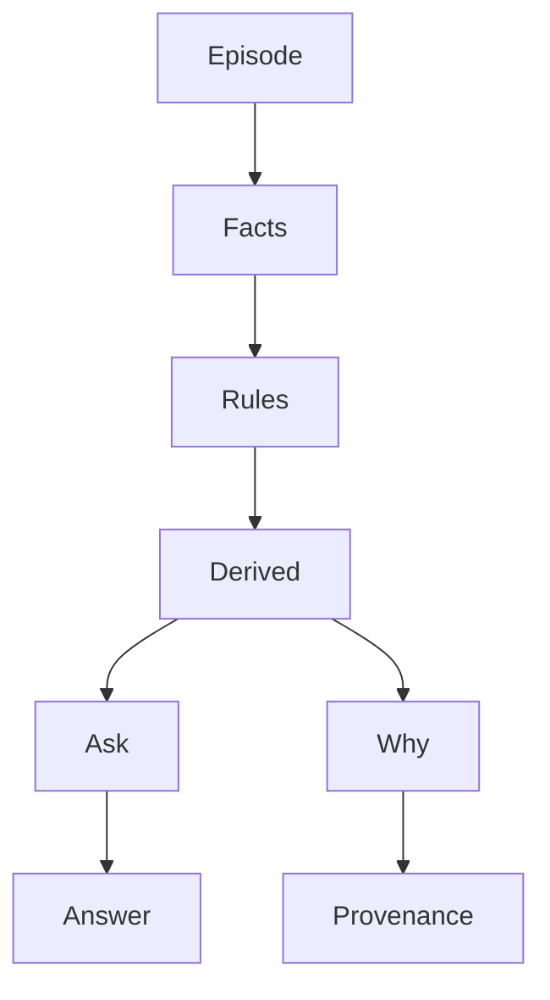
打分理由：代理记忆的 datalog 推理与可验证溯源（core 8 / wide 7）

## 🌐 全领域热点

### 15. 🌐 🧰 unslothai/unsloth
[GitHub](https://github.com/unslothai/unsloth) ★75,483 (+6327 本月) · Trending monthly · infra · Python

**一句话**：用桌面端把训练、推理和 MCP 接起来，作者报告 Qwen3.8-Flash-Next 可快 2x
**为什么值得你看**：适合跟踪本地训练、量化和 agent 工具链

**核心架构**：它解决的是本地部署和训练太碎：要么只能调模型，要么只会跑 UI，要么得自己拼推理、微调、RAG 和 agent 工具。Unsloth 的承重点不是单一算法，而是把模型训练、推理、数据处理和 agent 接口做成一套桌面/Studio/Core 体系：用户可以从 desktop 或 CLI 起服务，走 OpenAI-compatible API、MCP、LAN/HTTPS 访问，再把 LoRA、QLoRA、GRPO、DPO、GGUF、量化和多 GPU 规划串起来。最直接的证据是它最新 release 把 MTP 默认打开，并报告在 Qwen3.8-Flash-Next 和 GLM-5.3-Flash 上可到 2x 提速，同时还有 170+ training/chat/performance 改进，说明它的价值更多来自工程打包和运行时整合而不是单点论文式创新。新意主要在系统组织层：把“模型实验室”做成可装、可连 agent、可部署的产品化栈。

- 作者报告 Qwen3.8-Flash-Next 可快 2x
- release 强调 MCP、MTP、multi-GPU 改进
- 更像集成型平台，不是单一新算法
**为什么现在上榜**：最近 release：v0.1.806-beta、v0.1.805-beta、v0.1.804-beta
**精读价值**：看速览即可，主要价值是工程整合
**关联**：[[vLLM]]、[[bitsandbytes]]
#finetune #llmops #quantization · 难度：中等 · 建议：看速览即可
前置：🔲 [[LoRA]] · 🔲 [[quantization]] · 🔲 [[GRPO]] · 🔲 [[MCP]]

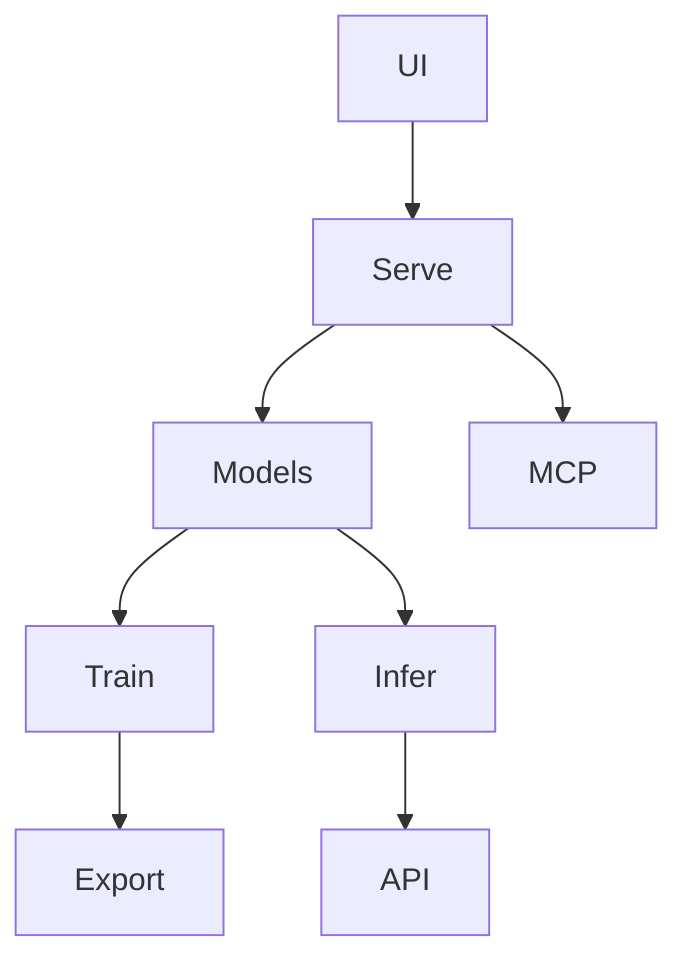
打分理由：本地训练与微调工具，行业热且可直接用（core 7 / wide 9）

### 16. 🌐 🧰 modular/modular
[GitHub](https://github.com/modular/modular) ★29,465 (+2891 本月) · Trending monthly · infra · Mojo

**一句话**：用 Mojo+MAX 做统一 AI 平台，作者报告新增 M1/M5 GPU 支持与 TTFT 加速
**为什么值得你看**：看它理解推理系统与编译器协同

**核心架构**：它解决的不是“再做一个推理框架”，而是同一套 AI 平台里编译器、GPU kernel、serve、benchmark 各自割裂，导致能力复用差、硬件适配慢。关键改变是把 GPU 编程 API 从 Mojo stdlib 挪到顶层 max 包，并把这些 API 直接并入 MAX accelerator library：组件 → 它阻断“语言库和加速库分叉”这个失败；同时保留 AI kernels、serve-model、profile-model 等工作流，让模型上线、压测、评估和 profiling 共享同一运行底座。最直接的证据是作者报告 M5 上加入 hardware-MMA flash-attention prefill 以降低 TTFT，同时把 Apple silicon GPU 支持回扩到 M1，说明它在真实硬件覆盖和首 token 延迟上都在继续打通。新东西主要在系统组织层，不是单个 kernel。

- 作者报告：M1 回扩、M5 prefill 降 TTFT
- 没看到公开基准对比，收益边界原文未明确
- 要复现得碰编译器、kernel、serve 三层
**精读价值**：适合看平台边界怎么划，不必只当推理框架看
**关联**：[[vLLM]]、[[flash attention]]
#moe #training #platform · 难度：硬核 · 建议：值得通读 (20 min)
前置：🔲 [[KV cache]] · 🔲 [[flash attention]] · 🔲 [[mixture of experts]] · 🔲 [[speculative decoding]]

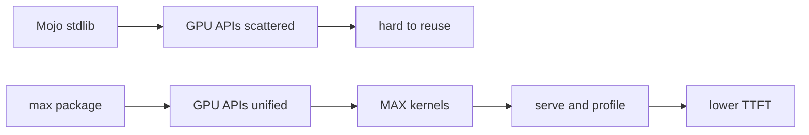
打分理由：训练/架构平台化，热度高且体系完整（core 7 / wide 9）

### 17. 🌐 🧰 openai/codex
[GitHub](https://github.com/openai/codex) ★120,934 (+18251 本月) · Trending monthly · tool · Rust

**一句话**：用本地终端 coding agent 跑代码与改文件，作者报告 v0.153.0-alpha.6 仍在高频发布
**为什么值得你看**：你做 agent 工程/评测时可直接对照

**核心架构**：它解决的是“LLM 会写代码，但离真正改仓库还差一层执行闭环”。原文的关键点不是聊天，而是 Codex CLI 作为本地 coding agent 直接在终端跑，且同时提供 IDE、desktop、web 三种入口。核心机制是把模型输出接到本地执行环境和仓库上下文里：检测到用户要开发时，agent 在本地运行、读写代码、再把结果回到终端；这阻断了纯对话式 agent 容易停在建议、不触碰文件系统的失败。最直接的证据是 README 明确把产品拆成 local CLI、IDE 插件、desktop app 和 cloud web 四种形态，说明它的重心是交互和部署形态，而不是单一模型能力。新在系统组织层：把 coding agent 的入口、鉴权和安装链路产品化。

- 作者报告：0.153.0-alpha.6 持续发版
- README 直接给本地/IDE/云端多入口
- 原文未给 agent 成败率或 SWE-bench 数字
**为什么现在上榜**：作者报告最新 release 是 2026-09-02 的 alpha 版本
**精读价值**：值得看它把 coding agent 产品化到哪一步
**关联**：[[ReAct]]、[[SWE-bench]]
#agent #tool-use #coding · 难度：中等 · 建议：值得通读 (20 min)
前置：🔲 [[planning]] · 🔲 [[ReAct]] · 🔲 [[model context protocol]] · 🔲 [[SWE-bench]]

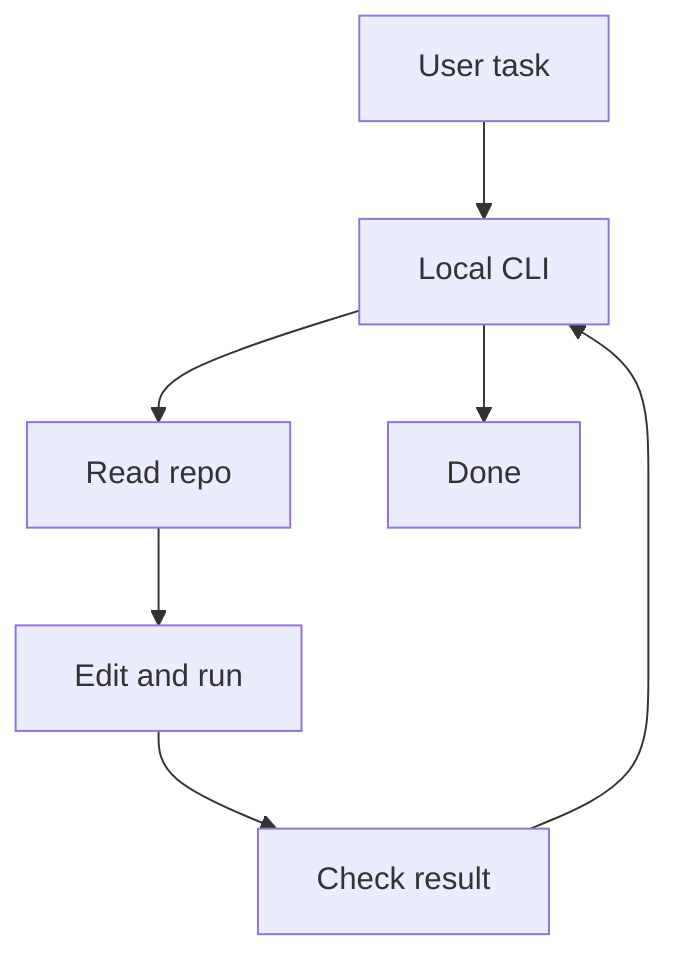
打分理由：终端coding agent，和agent方向高度相关（core 7 / wide 8）

### 18. 🌐 🧰 titanwings/distilly
[GitHub](https://github.com/titanwings/distilly) ★24,275 (+3718 本月) · Trending monthly · tool · Python

**一句话**：用 source-grounded workflow 把人物材料蒸馏成可复用 Skill，作者报告已过 20K ⭐
**为什么值得你看**：适合看 agent memory / persona 层怎么产品化

**核心架构**：它解决的是“人走了、上下文散了，agent 只能记零碎对话”的问题。Distilly 的关键改变不是做聊天机器人，而是把 messages、docs、interviews、public sources 变成一个可安装的 Person Profile，再打包成 Agent Skill；组件 → 它阻断“人物知识停留在原始材料里、无法被 host 复用”的失败。它还按 colleague、relationship、celebrity 三类来源结构分别处理，这说明它不是一套通吃抽象，而是按材料类型切不同分析维度。最直接的证据是 README 明确写出 source material → Person Profile → Agent/Bot 的单向产物链，并列出 Lark、Slack、WeChat、PDF、EML 等输入源和 8 个 host 的本地 Skill discovery。新在项目组织层：把 persona 建模和 skill 分发接起来。

- 作者报告：2026-08-13 过 20K ⭐
- 输入源和 host 覆盖都写得很具体
- 没看到生成质量评测，效果边界原文未明确
**为什么现在上榜**：作者报告 2026-08-13 已超过 20K ⭐，且 2026-08-24 补了多 host 本地发现
**精读价值**：值得看它怎么把 persona 变成可分发 skill
**关联**：[[ReAct]]、[[memory]]
#agent #distillation #skills #reusability · 难度：中等 · 建议：值得通读 (20 min)
前置：🔲 [[memory]] · 🔲 [[multi-agent]] · 🔲 [[prompt injection]] · 🔲 [[self-instruct]]

打分理由：把思维蒸馏成可复用 agent skills，方向契合（core 7 / wide 8）

---
想精读哪一篇？在 Claude 里说：`精读 2026-09-02 第 N 条`，Jarvis 会按你的 known.md 只讲你不会的部分。