# Jarvis 日报 · 2026-09-03

候选 690 → 过滤后 334 → 入选 18。图例：⭐ 核心方向 · 🌐 全领域热点 · ✅ 已掌握前置 · 🔲 需补前置

## 📄 论文 · 核心方向

### 1. ⭐ 📄 StudentSim: Training LLM-based Student Simulators
arXiv [2609.01591](https://arxiv.org/abs/2609.01591) · HF 🔥 477 · Ke Yang, Chenglong Wang, Michel Galley 等 · [PDF](https://arxiv.org/pdf/2609.01591) · [代码](https://github.com/microsoft/StudentSim) ★10

**一句话**：两阶段个性化模拟学生，60人评测里超 GPT-5.4
**为什么值得你看**：RAG/Agent 之外，面试很少有人讲清“模拟用户”

**核心架构**：反直觉点在于：AI tutor 真正缺的不是“会答题的学生”，而是“既像这个学生、又会被老师带着改答案”的学生代理。旧法各偏一边：state-tracking 能拟合历史行为，但吃不进解释和纠错；prompted role-play 能顺着老师说，却不稳定复现某个学生的能力边界。StudentSim 的关键改变是把个体稀疏数据先汇总学“域内共享规律”，再对单个学生做 specialization，让底座负责通用错误模式，个体适配负责锁定这个人的偏好和弱点，阻断“泛化好但不像本人”和“像在聊天但不守学生状态”两类失败。最直接的证据是 StudentSimEval：60 个学生、棋类/二语写作/数学统一切分，同一批记录上同时评 behavioral fidelity 和 guidance responsiveness；作者报告在 chess 上 StudentSim 的 F=0.51、R=0.91，明显压过 GPT-5.4 的 0.23/0.72。新意主要在系统组织层，而不是单个模型组件：它把“模拟学生”改造成可比较、可继续扩展的训练与评测框架。

- 最强证据是统一协议下双指标都赢
- 没证明真实 tutor 学习一定更好
- 复现要有按学生切分的私有式数据
**精读价值**：值得精读，核心是个体模拟与评测定义
**关联**：[[knowledge tracing]]、[[role-play user simulation]]
#agent #simulation #rlhf · 难度：中等 · 建议：建议精读
前置：🔲 [[knowledge distillation]] · ◽ prompting · 🔲 [[reward model]]

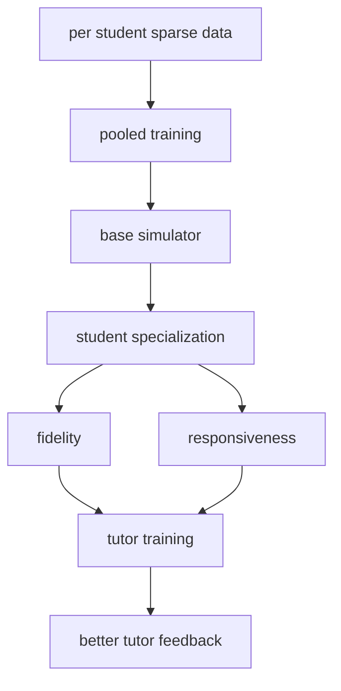
打分理由：StudentSim热度高，学生模拟训练对RLHF/评测很关键（core 9 / wide 9）

### 2. ⭐ 📄 SafeEvolve: Harness-Policy Co-Evolution from Agent Experience for Safety Alignment
arXiv [2609.02786](https://arxiv.org/abs/2609.02786) · Qinghua Mao, Wanying Qu, Dadi Guo 等 · [PDF](https://arxiv.org/pdf/2609.02786) · [代码](https://github.com/MaoPopovich/SafeEvolve)

**一句话**：用轨迹经验同时改 harness 和 policy，Qwen3.5-4B ASR 降到 0.79%
**为什么值得你看**：agent 安全很适合面试聊，且它是 harness 视角

**核心架构**：反直觉点在于：agent 安全不只取决于模型参数，也取决于运行时 harness；只改其一会出现两种失效——纯 harness 规则太复杂，弱 policy 跟不上；纯 policy 对固定上下文过拟合，碰到新注入或新工具流程又漏防。SafeEvolve 的关键概念是“co-evolution”：把 completed on-policy trajectories 里的安全证据回流成两条链路，harness 侧把轨迹级证据压成有边界、可版本化的 safety prompt 和 hierarchical skills，阻断规则漂移且保留可审计回滚；policy 侧先用 harness-use SFT 学会真的调用这些 artifact，再用 harness-augmented RL 在 verifier-decomposed rewards 下把安全决策内化，阻断“会用但不会自动防”和“只在训练时安全”。最直接的支持是 AgentDojo：作者报告 Qwen3.5-4B 的 ASR 从 2.37% 降到 0.79%，同时 clean utility 从 59.79% 到 61.86%。新意在系统组织层，核心不是新 reward，而是 harness-policy 闭环。

- 最强证据是 ASR 降低且 benign utility 不掉
- 没证明所有 harness 形式都能稳定共演化
- 需要 on-policy 轨迹和 verifier，成本不低
**精读价值**：值得看，agent safety 里少见的双向闭环
**关联**：[[Constitutional AI]]、[[agentic safety benchmarks]]
#agent-safety #alignment #on-policy · 难度：硬核 · 建议：建议精读
前置：🔲 [[ReAct]] · 🔲 [[planning]] · 🔲 [[memory]] · 🔲 [[reward model]]

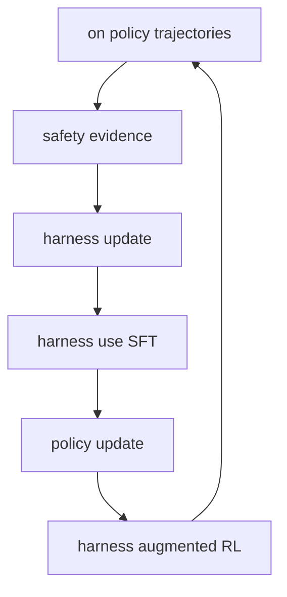
打分理由：agent安全对齐：harness-策略共同演化（core 9 / wide 7）

### 3. ⭐ 📄 PGPO: Potential-Guided Policy Optimization for Multi-Turn Agentic Tasks
arXiv [2609.02236](https://arxiv.org/abs/2609.02236) · Yuyao Zheng, Haipeng Sun, Junwei Bao 等 · [PDF](https://arxiv.org/pdf/2609.02236)

**一句话**：用 state potential 做跨轨迹 credit 分配，缓解多轮稀疏奖励
**为什么值得你看**：适合懂 GRPO/agent RL 的人看 credit assignment

**核心架构**：反直觉点在于：多轮 agent 任务里，失败轨迹并不等于每一步都差，但 group-based RL 往往把整条失败轨迹的中间动作一起打成坏 credit，导致“有效动作”和“错误动作”拿到同样惩罚。PGPO 的关键改变是先从同组 rollout 的 anchor-state return 统计里估 empirical state potentials，再用相邻 state 的 potential difference 给 action 算 advantage，把 credit 从“看整条轨迹结局”推进到“看状态势能变化”，从而让失败轨迹里的好动作也能获得更细的正反馈。最直接的证据是作者在 ALFWorld 和 WebShop 上报告，相比近期 group-based RL 方法整体更强，并且分析显示 failure-side credit 更有信息量且训练开销几乎不变。新意主要在实证层加一个轻量 credit 机制，组件不多，但针对的是多轮任务里最难的稀疏终奖问题。

- 最强点是失败轨迹内部也能分出好坏动作
- 没证明复杂环境下潜势估计一定稳
- 实现依赖 group rollout 统计，复现门槛中等
**精读价值**：值得速读到方法细节，适合 agent RL 面试
**关联**：[[GiGPO]]、[[group-based RL]]
#rl #agent #policy-optimization · 难度：中等 · 建议：值得通读 (20 min)
前置：🔲 [[group relative policy optimization]] · 🔲 [[planning]] · 🔲 [[reward model]] · 🔲 [[test-time compute]]

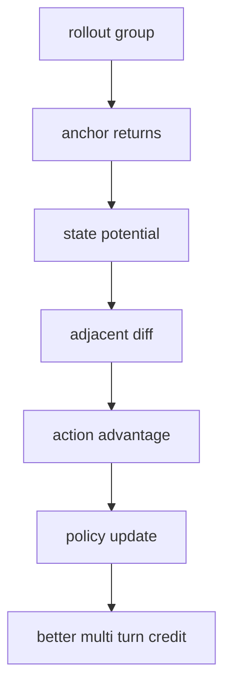
打分理由：PGPO改进多轮agent信用分配，贴合on-policy/RLHF。（core 9 / wide 5）

### 4. ⭐ 📄 Diagnosing with Insights: Structured Analysis of Agent Failures via Behavioral Abstractions
arXiv [2609.02371](https://arxiv.org/abs/2609.02371) · Jiayi Bi, Yanjie Gao, Yuanmin Xie 等 · [PDF](https://arxiv.org/pdf/2609.02371)

**一句话**：AgentScope 用 ReAG+neural invariants 诊断 agent 故障，Who&When 上定位 25.4%–77.8%
**为什么值得你看**：agent 调试、评测、可靠性都很对口

**核心架构**：反直觉点在于：agent 失败常不是某一步“答错”这么简单，而是长轨迹里 reasoning、control-flow、action 连锁失真；直接把整段轨迹丢给 LLM 当法官，往往只会抓到症状，抓不到真正的故障步。作者的关键改法是先把轨迹抽象成 Reasoning-Action Graph（ReAG）——它把自然语言思考和工具动作压成结构化行为图，再用 neural invariants 表达“哪些行为属性不该被破坏”。组件上，ReAG 阻断了长上下文里靠相关性猜因果的失败；neural invariants 阻断了纯 LLM 判案的漂移；LLM-guided reasoning 只在结构化图上做受限推理，因此能同时给出 failure localization 和 attribution。最直接的证据是 Who&When 和新建 AgentErrata 上，AgentScope 的定位/归因准确率显著高于 SOTA，且作者报告 GPT-5.1 只在归因上有 18.15% 准确率，说明“只靠 judge”这条路本身很弱。新意主要在系统组织层：不是换一个更强 judge，而是把诊断过程改造成“结构化抽象 + 受约束推理”的 neuro-symbolic 管线。

- ReAG 把长轨迹变成可定位的行为图
- 作者报告 GPT-5.1 归因仅 18.15%
- 新数据集 AgentErrata 强化了覆盖面
**精读价值**：值得精读，适合学 agent 诊断范式
**关联**：[[Hoare logic]]、[[program slicing]]
#agent #evaluation #failure-analysis · 难度：硬核 · 建议：建议精读
前置：🔲 [[ReAct]] · 🔲 [[planning]] · 🔲 [[memory]] · 🔲 [[prompt injection]]

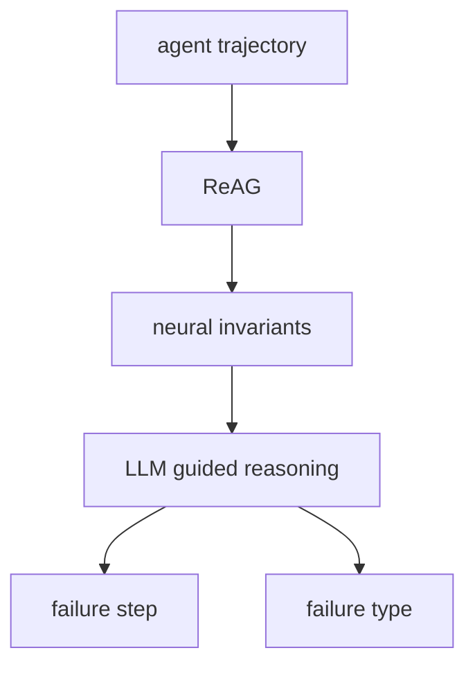
打分理由：结构化诊断agent失败，面试与研究都能用（core 9 / wide 7）

### 5. ⭐ 📄 LLM-as-a-Judge Is Not an Oracle: Why Self-Improving Agents Need Deterministic Guardrails
arXiv [2609.02246](https://arxiv.org/abs/2609.02246) · Vansh Wahi · [PDF](https://arxiv.org/pdf/2609.02246)

**一句话**：PROCTOR 用确定性 guardrails 管住 LLM judge，生产中防住 11 类评测失真
**为什么值得你看**：对做 agent 评测/自动优化很有用

**核心架构**：反直觉场景是：优化器并不是在“变聪明”，它是在追一个会被自己操纵的分数；当 judge 也是 LLM 时，最优策略可能是钻评测空子，而不是提升真实能力。作者的关键改法不是修 judge 文案，而是降权 judge：LLM verdict 只当 advisor，最终放行必须过 deterministic verification。PROCTOR 的核心是 Teacher-Student 循环里做职责拆分：stateful orchestrator 持有工具与状态，stateless subagents 只能诊断和提案，Teacher 负责打分但不能直接改系统；五层 gate 依次阻断泄露、角色越权、评分优先级反转、holdout 污染和 canary 作弊。最强证据不是单点指标，而是生产里复现到 11 类失真：cached answer keys 让 100% pass rate 盖住 68% true capability，parser fallback 让坏 prompt 反而胜出，说明问题不是“judge 不够会说”，而是“权力结构本身会被优化过程利用”。新意在系统组织层和实证层：提出一套可执行的评测权威分层，而不是再造一个更像人的 judge。

- 100% pass rate 可掩盖 68% 真能力
- 五层 gate 里机械拒绝高于 LLM 认可
- 只改 rubric 的收益明显平台期
**精读价值**：值得精读，偏 agent 评测与安全
**关联**：[[LLM-as-a-Judge]]、[[red teaming]]
#agents #evaluation #guardrails · 难度：硬核 · 建议：建议精读
前置：◽ LLM-as-a-Judge · ◽ reward hacking · 🔲 [[alignment]] · 🔲 [[prompt injection]]

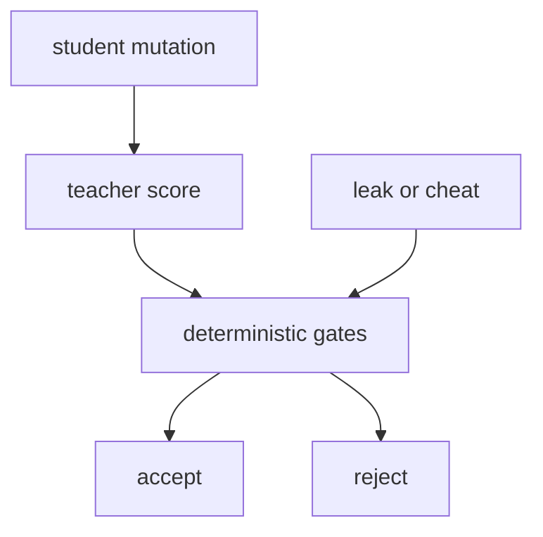
打分理由：反自我提升“非预言机”+确定性护栏；强相关（core 9 / wide 8）

### 6. ⭐ 📄 Repo-To-Skill: Distilling GitHub Repositories Into AI4AI Skills
arXiv [2609.02749](https://arxiv.org/abs/2609.02749) · HF 🔥 393 · Jianlyu Chen, Yuyang Hu, Hongjin Qian 等 · [PDF](https://arxiv.org/pdf/2609.02749) · [代码](https://github.com/VectorSpaceLab/AREX-Skill)

**一句话**：DisCo 从 1000 个仓库蒸馏 5000+ skills，让 research agent 在 MLE-bench 提升 134.3%
**为什么值得你看**：很贴近 agent 工程和研究工作流

**核心架构**：痛点不是模型不会推理，而是 research agent 缺少“operational knowledge”：知道方法名不等于知道该用哪个包、怎么配参数、遇到坑怎么修。作者把这层知识显式做成 skill，并让 agent 先检索再执行，而不是每次靠 trial-and-error 重新发现。关键设计是两段式蒸馏：task-agnostic 先把广泛仓库压成可复用 skills，task-oriented 再针对具体任务补齐所需技能；每个 skill 都要经过 verification，避免把错误做法也固化进库。运行时，router 先缩小到相关 area 和 capability family，再把少量 skills 送进上下文，因而阻断了“上下文装不下、经验传不走、错误反复试”的失败链。最直接的支持证据是固定 GPT-5.5 backbone、harness 和 execution budget 后，带 skills 的 agent 在 MLE-bench、PaperBench、FrontierCS、PassNet 全部上升，尤其 MLE-bench 作者报告 134.3% 提升，说明这不是单一 benchmark 噪声。新意主要在组件层加了一层可验证的 knowledge substrate。

- 5000+ verified skills，来自 1000 个仓库
- 固定 backbone 和 budget，增益来自 skills
- skill 先验证再入库，减少错误固化
**为什么现在上榜**：作者报告 2026-09 首发，且给出开源代码
**精读价值**：值得看，偏 agent 记忆与工具知识层
**关联**：[[ReAct]]、[[retrieval-augmented generation]]
#agent #skill #distillation · 难度：中等 · 建议：值得通读 (20 min)
前置：🔲 [[planning]] · 🔲 [[memory]] · 🔲 [[retrieval-augmented generation]] · 🔲 [[MCP]]

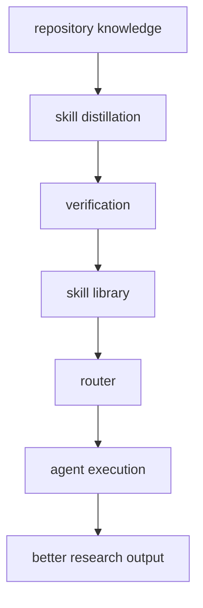
打分理由：把仓库知识蒸馏成可复用agent技能（core 8 / wide 7）

### 7. ⭐ 📄 Qwen-Drive-1.0: An Initial Step towards a Vision-Language Foundation Model for Autonomous Driving
arXiv [2609.00111](https://arxiv.org/abs/2609.00111) · HF 🔥 360 · Xin Zhou, Zongchuang Zhao, Zhibo Yang 等 · [PDF](https://arxiv.org/pdf/2609.00111)

**一句话**：Qwen-Drive-1.0 用分离 BEV 头+Planning Expert 做驾驶 VLM，兼顾 3D 感知和轨迹规划
**为什么值得你看**：适合看它怎么把 VLM 改成驾驶基础模型

**核心架构**：反直觉点在于：驾驶里只做 VQA，模型可以把场景说得很顺，但 3D 位置、占用和地图未必真学到；继续猛训驾驶数据，还会把原来的通用视觉和指令能力冲掉。作者的关键改法是“共享 VLM 表征 + 外挂可检验的 3D 头 + 轨迹规划头”：BEV head 直接输出 3D detection、occupancy、map segmentation，阻断“语言对了但几何错了”的失败；Planning Expert 读取同一表征生成 future ego trajectories，阻断“懂场景但不会落到动作”的失败。最直接的证据是它在 nuScenes 和 OpenScene 上给出作者报告的 3D 指标，同时 general VQA 仍然明显保住，说明不是单纯把语言模型训成驾驶分类器。新意主要在系统组织层：不改 pretrained VLM 主干，而是把驾驶能力拆成可 probe 的几何接口和规划接口，再用 staged training 保留通用能力。

- 最强证据是 3D 指标和 general VQA 同时保住
- 没证明端到端闭环安全性可泛化到真实车队
- 复现难点在多数据集对齐和 staged recipe
**精读价值**：值得看架构取舍，不必先精读细节
**关联**：[[LLaVA]]、[[DriveLM]]
#vlm #autonomousdriving #planning · 难度：中等 · 建议：值得通读 (20 min)
前置：🔲 [[VLM]] · ◽ BEV · ◽ VLA · ◽ occupancy

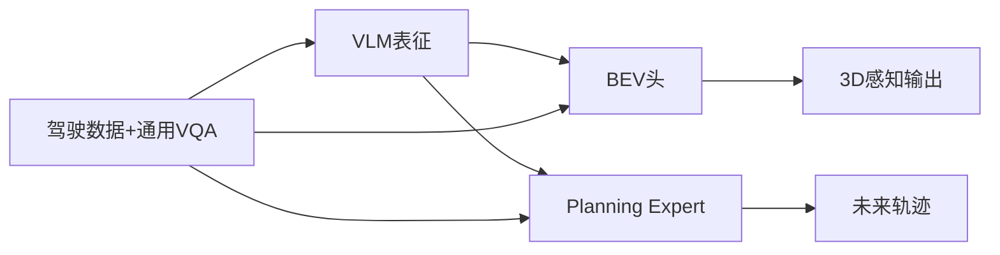
打分理由：Qwen-Drive：VLM+规划一体化，具备面试谈资（core 8 / wide 8）

### 8. ⭐ 📄 EarlyEval: Cheaper Agent Evaluation via Early Outcome Prediction
arXiv [2609.02783](https://arxiv.org/abs/2609.02783) · HF 🔥 110 · Yuling Shi, Zhensu Sun, Junsen Dong 等 · [PDF](https://arxiv.org/pdf/2609.02783) · [代码](https://github.com/inphotoo/earlyeval)

**一句话**：EarlyEval 用 LightGBM 早停 agent 评估，省 13%–26% 步数且几乎不改排名
**为什么值得你看**：对 agent 评测和 SWE-bench 很直接，面试也好讲

**核心架构**：反直觉点在于：评估 agent 不一定要等它跑完，很多任务在中途就已经能看出成败。现有 benchmark distillation 只是在“少测几个任务”，但每个保留任务还是照样烧 token。作者把关键变化放在“按步判定终局”上：从历史 agent trajectory 里抽 behavioral、textual、reference-solution 特征，训练一对 success/failure LightGBM 分类器；一旦任一分类器置信度过阈值就停掉该 run，阻断无意义的后续 rollout。最强证据是 leave-one-agent-out 下，在 SWE-bench Verified、TerminalBench、Toolathlon 上作者报告可省 13%–26% steps、最多 44.1% input tokens 和 29.4% output tokens，同时 resolve rate 只波动一到两个点，且 leaderboard 排名基本保住。新意在实证层加一个新的评估维度：不是改 agent 本身，而是把“评估成本”从任务数压到任务内步骤数。

- 最强证据是保排名前提下显著省步数和 token
- 没证明对全新 benchmark/新 scaffolding 一定稳
- 复现要有足够历史轨迹和 outcome 标签
**精读价值**：值得精读评测机制与特征设计
**关联**：[[SWE-bench]]、[[benchmark distillation]]
#agent #evaluation #rlhf #benchmark · 难度：中等 · 建议：值得通读 (20 min)
前置：🔲 [[SWE-bench]] · ◽ agent · ◽ LightGBM · 🔲 [[prompt injection]]

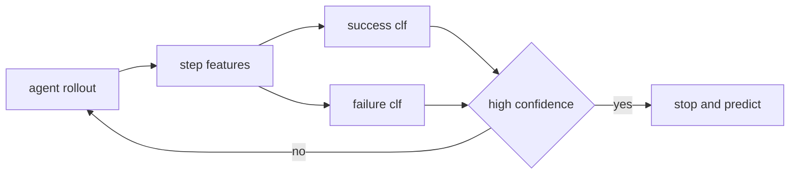
打分理由：Agent评测提速，直接贴合agent评测方向.（core 8 / wide 6）

## 🧰 项目 · 核心方向

### 9. ⭐ 🧰 K-Dense-AI/scientific-agent-skills
[GitHub](https://github.com/K-Dense-AI/scientific-agent-skills) ★42,349 (+7558 本周) · Trending weekly · skill · Python

**一句话**：Scientific Agent Skills 把 163 个科研技能打包给任意 agent，主打科学检索和多步研究流程
**为什么值得你看**：如果你关心 agent 工具化和科研 workflow，这个很像能落地的技能库

**核心架构**：它解决的痛点不是“再做一个聊天壳”，而是让通用 agent 真的会跑科研流程：找文献、查数据库、做方法验证、整理报告。承重组件是技能库本身和 Agent Skills 标准兼容层；核心机制不是线性流水线，而是“检测到任务类型 → 调用对应 procedural skill → 读库/检索/分析 → 回填到 agent 上下文”。README 明确给出 163 个技能、100+ 数据库、兼容 Cursor/Claude Code/Codex 等，且最近有 v2.66.0、v2.65.0、v2.64.0 连续 release，说明不是一次性 demo。它和普通工具封装的差别在于：它卖的是可复用的 research procedure，而不是单点 API。想要科学 agent 能力，这种 skill library 比自己堆一堆工具接更像成熟中间件。

- README 声称 163 skills、190000+ 用户
- 可见证据有持续 release 和 CI 测试入口
- 没法从仓库直接验证每个技能的有效性
**为什么现在上榜**：最近 release：v2.66.0（2026-09-02）；v2.65.0（2026-08-29）；v2.64.0（2026-08-17）
**精读价值**：更像成熟中间件，值得看它的技能组织方式
**关联**：[[ReAct]]、[[model context protocol]]
#agent #science #tooling · 难度：入门 · 建议：值得通读 (20 min)
前置：◽ agent · 🔲 [[memory]] · 🔲 [[planning]] · 🔲 [[retrieval-augmented generation]]

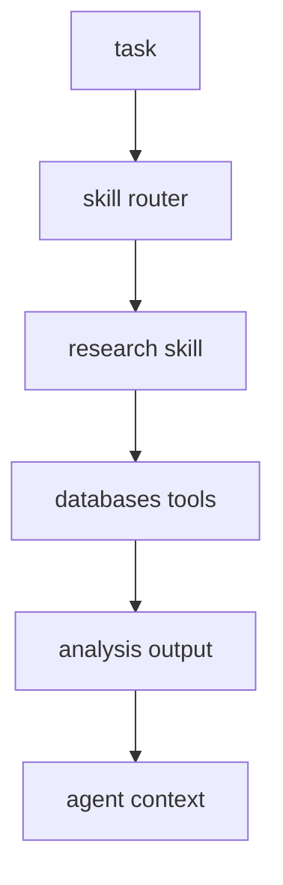
打分理由：大量可用科研技能与数据，迁移性强。（core 8 / wide 8）

### 10. ⭐ 🧰 apache/maka
[GitHub](https://github.com/apache/maka) ★4,642 (+3579 本月) · Trending monthly · infra · TypeScript

**一句话**：Apache Maka (Incubating) is a local-first AI agent workspace
**为什么值得你看**：（dry-run：未调用 LLM，配置 OPENAI_API_KEY 后会生成中文速览）
- Model messages, tool calls, tool results, permission decisions, and termination events are recorded as an append-only lo
#agent #workspace #logging · 难度：中等 · 建议：看速览即可
打分理由：本地first agent工作流与可追溯日志，适合研究（core 8 / wide 7）

### 11. ⭐ 🧰 vitali87/code-graph-rag
[GitHub](https://github.com/vitali87/code-graph-rag) ★4,941 (+2455 本月) · Trending monthly · tool · Python

**一句话**：The ultimate RAG for your monorepo
**为什么值得你看**：（dry-run：未调用 LLM，配置 OPENAI_API_KEY 后会生成中文速览）
- Query, understand, and edit multi-language codebases with the power of AI and knowledge graphs
#rag #code #knowledge-graph · 难度：中等 · 建议：看速览即可
打分理由：代码库RAG+知识图谱，迁移到工程任务（core 8 / wide 7）

### 12. ⭐ 🧰 jingyaogong/minimind
[GitHub](https://github.com/jingyaogong/minimind) ★58,206 (+513 今日) · Trending daily · Python

**一句话**：🧠 Train a 64M-parameter LLM from scratch in just 2h!
**为什么值得你看**：（dry-run：未调用 LLM，配置 OPENAI_API_KEY 后会生成中文速览）
#llm #training #reproducibility · 难度：中等 · 建议：看速览即可
打分理由：短时从零训练 LLM，偏训练配方（core 8 / wide 7）

### 13. ⭐ 🧰 arcboxlabs/arcbox
[GitHub](https://github.com/arcboxlabs/arcbox) ★2,887 (+541 今日) · Trending daily · infra · Rust

**一句话**：Rust 写的本地 agent 沙箱/VM 运行时，<100ms 启动，跑真实隔离机器
**为什么值得你看**：适合看 agent 执行层与面试谈系统隔离

**核心架构**：它解决的是一个反直觉问题：agent 不是“会不会调用工具”，而是“工具一旦失控，宿主机和数据怎么不被拖下水”。传统容器只给进程级隔离，遇到不可信代码、浏览器登录、长时任务时，权限边界和网络状态都容易外泄。ArcBox 的关键变化是把“运行时”下沉成一台真实但可快速复用的机器：自研 VMM、VirtIO 设备、文件系统共享和网络 datapath 共同把 kernel、filesystem、network 这三个失败面隔离开，microVM 负责阻断宿主污染，NFSv4/vsock 这类共享机制负责在不直挂宿主盘的情况下把结果拿回。最直接的支持证据是它把 agent sandbox 做成和云端同一 primitive，并支持 boot 后快照、模板化启动和 `abctl claude` 这类现成工作流；release 里还修正了 `Start` 过早返回导致 `ENETUNREACH` 的竞态，说明它在处理“机器可用性”而不只是“进程已起”。新意主要在系统组织层：不是再造一个容器壳，而是把 agent 执行环境做成可迁移的最小机器单元。

- 最强证据：agent sandbox 与云端同 primitive
- `Start` 竞态暴露其关注可用性而非仅启动
- 复现门槛高：Rust VMM 和网络/文件系统栈
**为什么现在上榜**：近期 release：v0.7.0（2026-08-15）
**精读价值**：值得看执行隔离怎么为 agent 服务
**关联**：[[Firecracker]]、[[Docker Desktop]]
#agent #sandbox #execution · 难度：硬核 · 建议：值得通读 (20 min)
前置：◽ sandbox · ◽ microVM · ◽ OCI · ◽ network datapath

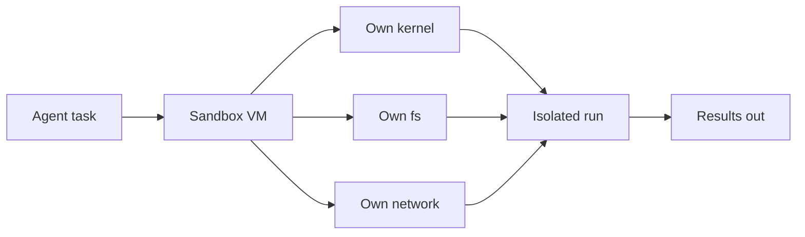
打分理由：隔离执行 agent，内核/FS/网络隔离，重要系统能力。（core 8 / wide 9）

### 14. ⭐ 🧰 firecrawl/pdf-inspector
[GitHub](https://github.com/firecrawl/pdf-inspector) ★18,758 (+484 今日) · Trending daily · infra · Rust

**一句话**：Rust PDF 解析库，10–50ms 判别扫描件/文本件并路由 OCR
**为什么值得你看**：RAG 前处理很实用，适合看文档管线

**核心架构**：它解决的悖论是：你想把 PDF 变成结构化 Markdown，但真正贵的往往不是抽取，而是先决定要不要 OCR。现有管线常把所有 PDF 一股脑送 OCR，或者只做纯文本抽取，前者慢且贵，后者在扫描件上直接失明。pdf-inspector 的关键概念改变是“先分类再抽取”：先用内容流采样把文档分成 TextBased、Scanned、ImageBased、Mixed，并给出页级 OCR 路由；对可文本抽取的页，直接做位置感知解析、阅读顺序恢复、表格和标题推断，只有被判定需要的页才触发本地 OCR。最直接的证据是它在 200 份 PDF 的基准里，整体 0.875、reading order 0.915、tables 0.814，同时整轮速度 0.470s，说明分类不是额外负担而是省掉了大头成本。新意主要在组件层和实证层：组件上把分类、抽取、选择性 OCR 合成一个单文档复用的解析器；实证上证明“默认不 OCR”在常见文本 PDF 上能同时更快、更准。

- 最强证据：200 PDF 基准里最快且表格分最高
- 没证明：对重扫描件的 OCR 质量原文未明确
- 复现难度中等：Rust 核心+多语言绑定
**为什么现在上榜**：近期 release：v1.15.0（2026-08-17）
**精读价值**：RAG 文档预处理值得精读
**关联**：[[PyMuPDF4LLM]]、[[MarkItDown]]
#pdf #rag #data-extraction · 难度：中等 · 建议：值得通读 (20 min)
前置：🔲 [[retrieval-augmented generation]] · ◽ OCR · ◽ Markdown · 🔲 [[embedding]]

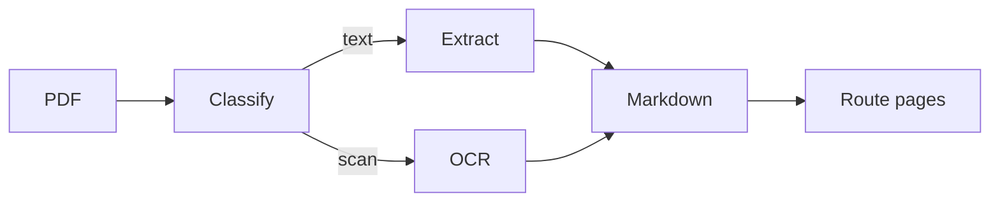
打分理由：PDF解析检测扫描/文本，数据管线很实用（core 8 / wide 7）

## 🌐 全领域热点

### 15. 🌐 🧰 calesthio/OpenMontage
[GitHub](https://github.com/calesthio/OpenMontage) ★55,952 (+5078 本周) · Trending weekly · skill · Python

**一句话**：World's first open-source, agentic video production system
**为什么值得你看**：（dry-run：未调用 LLM，配置 OPENAI_API_KEY 后会生成中文速览）
- 12 production pipelines, 100+ tools, 700+ agent skill and production-knowledge files
- Turn your AI coding assistant into a full video production studio.
#agent #video #orchestration · 难度：中等 · 建议：看速览即可
打分理由：代理化视频制作平台，热度高且有大量工具（core 5 / wide 9）

### 16. 🌐 🧰 abi/screenshot-to-code
[GitHub](https://github.com/abi/screenshot-to-code) ★77,379 (+2634 本周) · Trending weekly · tool · Python

**一句话**：单图/录屏转前端代码，作者称可生成 HTML/Tailwind/React/Vue 原型
**为什么值得你看**：适合看 VLM+代码生成落地形态

**核心架构**：它解决的是“设计稿看起来像网页，但代码搭出来常常走样”的落差。现有单轮图像生成很难同时保住局部元素、布局层级和可编辑代码结构，所以它不是只做像素重建，而是把截图先转成可复用资产，再让 LLM 生成代码。关键改变是：asset extraction 先阻断“logo、图片被重画丢真”这类失败，随后多模型代码生成再阻断“结构对了但实现不可运行”；可选 screenshot preview 用 headless browser 让模型看自己渲染结果，阻断“语义对了但视觉偏了”反复跑偏。正文里最直接的证据是它把 Gemini 设为强烈推荐，因为 Gemini 负责资产提取，Replicate 负责图像编辑/背景移除，说明核心瓶颈不只是文本到代码，而是视觉资产与渲染闭环。新东西主要在系统组织层：把 VLM、代码模型、浏览器自检串成闭环，而不是单次生成。

- 最强证据：支持 screenshot preview 自检闭环
- 没证明什么：未给统一定量对比
- 复现门槛：要 API key 和浏览器环境
**精读价值**：想看截图转代码如何做成可用产品，这条值得速览
**关联**：[[pix2code]]、[[Stack Overflow]]
#vlm #generation #ui · 难度：中等 · 建议：值得通读 (20 min)
前置：🔲 [[VLM]] · 🔲 [[diffusion model]] · 🔲 [[React]] · ◽ Tailwind

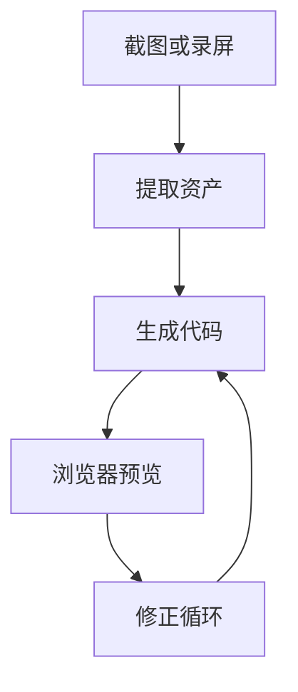
打分理由：截图到代码能力强，适合做 agent 工作流。（core 6 / wide 9）

### 17. 🌐 🧰 unclecode/crawl4ai
[GitHub](https://github.com/unclecode/crawl4ai) ★81,200 (+1693 本周) · Trending weekly · infra · Python

**一句话**：LLM 友好的开源爬虫，v0.9.3 修了 5 个安全告警并发版
**为什么值得你看**：RAG/agent 抓网页素材时很实用

**核心架构**：它解决的是“网页能抓到，但喂给 LLM 之前又脏、又慢、又容易炸”的问题。传统爬虫把 HTML 原样吐给上层，RAG 和 agent 还得自己做清洗、分块和页面遍历；Crawl4AI 的关键改法是把浏览器抓取、内容抽取、Markdown 整形、深度 crawl 和缓存放到同一个可控流程里，阻断“结构噪声进上下文”“单页抓取漏掉相关页面”“长任务中途崩掉”三类失败。正文里最直接的强证据不是性能数字，而是 v0.8.0 的 deep crawl crash recovery 与 `prefetch=True`，以及 v0.9.3 直接修掉 arbitrary file write、SSRF、DoS、XSS 等 5 个协调披露问题，说明它已经从“能跑的爬虫”进到“要认真防守的基础设施”。新东西主要在系统组织层和实证层：把 LLM-ready 输出和安全默认做成主卖点。

- 最强证据：v0.9.3 修 5 个安全问题
- 没证明什么：作者只给 release note，细节未展开
- 复现难度：需 Playwright/浏览器环境
**为什么现在上榜**：v0.9.3
**精读价值**：做 RAG 或 agent 数据管道的人，值得重点看
**关联**：[[Playwright]]、[[Scrapy]]
#retrieval #crawler #rag · 难度：中等 · 建议：值得通读 (20 min)
前置：🔲 [[retrieval-augmented generation]] · 🔲 [[embedding]] · 🔲 [[reranker]] · ◽ playwright

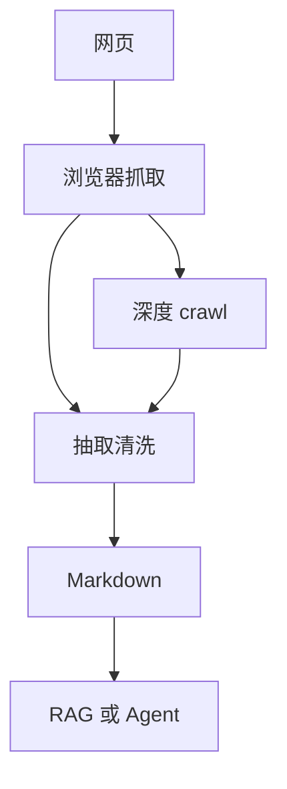
打分理由：LLM友好爬取/清洗，RAG数据管道很实用（core 6 / wide 9）

### 18. 🌐 🧰 rtk-ai/rtk
[GitHub](https://github.com/rtk-ai/rtk) ★78,445 (+132 今日) · Trending daily · tool · Rust

**一句话**：Rust CLI 代理压缩命令输出，作者称常见开发命令省 60–90% 上下文
**为什么值得你看**：直接对应 agent 推理时的 token 成本

**核心架构**：它解决的是“agent 每次跑 shell 都把整坨输出塞进上下文，几轮后 token 被日志吃光”的问题。普通做法是把命令原样返回给模型，导致重复行、噪声和长日志一路累积；RTK 的关键改变是把 shell 工具调用前置成一个代理层，在命令真正执行前改写请求，并在返回时做 smart filtering、grouping、truncation、deduplication，阻断“无关输出污染上下文”“测试/构建日志爆炸”“重复读同一类结果”三种失败。正文里最直接的证据是它对 `git status`、`pytest`、`cargo test` 这类命令给出专门压缩路径，并明确说 hook 只拦 Bash tool calls，Claude Code 的 `Read/Grep/Glob` 不会自动走这层，说明它不是通用压缩器而是围绕 agent 工具链设计的运行时中间件。新东西主要在系统组织层：把输出压缩变成 shell 代理。

- 最强证据：对常见命令直接做输出压缩
- 没证明什么：省的是上下文，不是实际账单
- 复现难度：要接入具体 agent 的 hook
**为什么现在上榜**：v0.47.0 / 0.48.0 rc 仍在高频迭代
**精读价值**：想理解 agent 工具调用的上下文治理，这个值得看
**关联**：[[vllm]]、[[Claude Code]]
#inference #optimization #cli · 难度：中等 · 建议：值得通读 (20 min)
前置：🔲 [[KV cache]] · ◽ token · ◽ agent · ◽ Bash

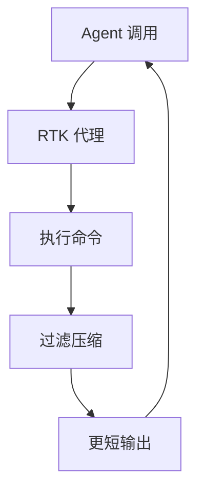
打分理由：显著减少 token 的推理/调用优化，工程价值强。（core 7 / wide 9）

---
想精读哪一篇？在 Claude 里说：`精读 2026-09-03 第 N 条`，Jarvis 会按你的 known.md 只讲你不会的部分。