# Jarvis 日报 · 2026-09-04

候选 691 → 过滤后 331 → 入选 18。图例：⭐ 核心方向 · 🌐 全领域热点 · ✅ 已掌握前置 · 🔲 需补前置

## 📄 论文 · 核心方向

### 1. ⭐ 📄 HarnessDev: Can LLMs Create and Evolve Their Own Agent Harness?
arXiv [2609.01437](https://arxiv.org/abs/2609.01437) · HF 🔥 236 · Yuhao Wu, Jingyuan Zhang, Jiajun Shi 等 · [PDF](https://arxiv.org/pdf/2609.01437)

**一句话**：HarnessDev用基准逼LLM自己造agent harness，测到创建/演化都不稳
**为什么值得你看**：适合看agent评测与自改基础设施怎么定义

**核心架构**：反直觉点在于：同一模型权重不变，只换 harness，Terminal-Bench 2.1 结果都能从 35.2% 跳到 49.6%；所以问题不只是“模型会不会做任务”，而是“它会不会搭出让自己更会做任务的执行底座”。HarnessDev把评测单位从 task output 改成 runnable infrastructure：Creation 让模型从弱但可运行的 seed 起步，补成完整执行系统；Evolution 则让它基于自身 harness 的执行反馈反复改写。这个改变阻断的失败是“只会局部修 bug，不会沉淀成可复用能力”，因为 harness 会影响后续观察、规划、恢复与验证。最直接的证据是 Creation/Evolution 都按 held-out downstream task success 和 execution-token cost 双轴测，发现写出来的 harness 在 code、search、research 上仍明显落后人类参考，且 Evolution 的收益不稳定、对不同执行模型迁移很差。新意主要在系统组织层，不是新模型，而是把“开发 harness”本身变成可测对象。

- 最强证据：Evolution 对 held-out 只部分转移
- 不证明能超人类工程化 harness
- 复现难点在长链执行与双模型评测
**精读价值**：值得精读，尤其看它如何定义 harness 评测
**关联**：[[Terminal-Bench]]、[[Qwen-Agent]]
#agent #benchmark #evaluation · 难度：中等 · 建议：建议精读
前置：◽ agent harness · 🔲 [[planning]] · 🔲 [[memory]] · ◽ execution trace

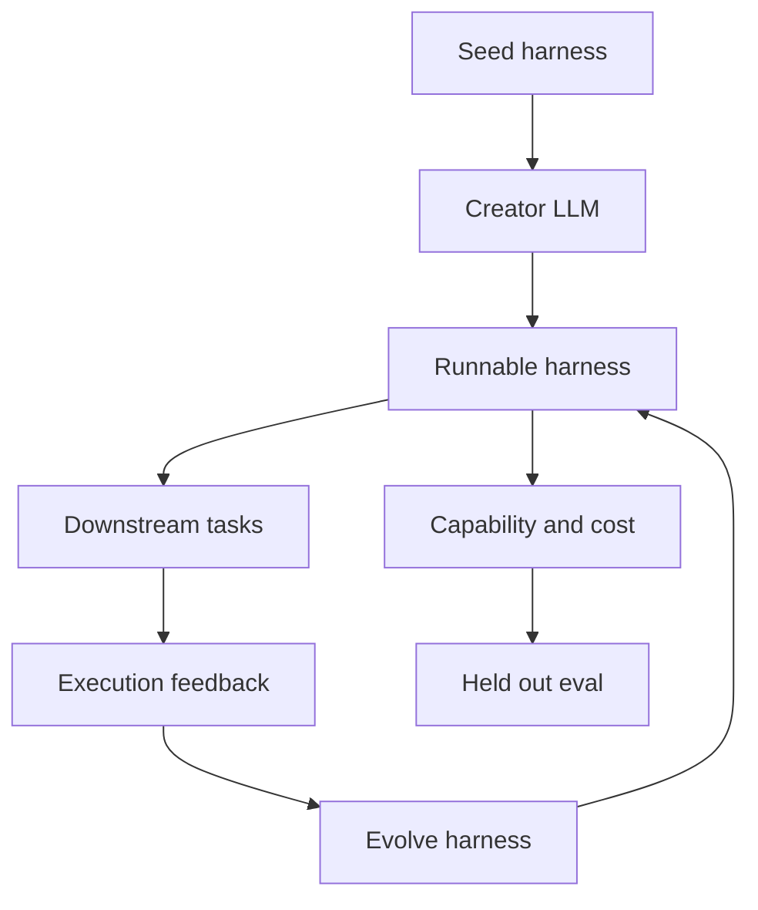
打分理由：agent harness自生成评测，强相关且重要（core 9 / wide 9）

### 2. ⭐ 📄 Aspire: Can Models Self-Evolve from Vague Goals?
arXiv [2608.31111](https://arxiv.org/abs/2608.31111) · HF 🔥 210 · Yuhao Wu, Jingyuan Zhang, Jiajun Shi 等 · [PDF](https://arxiv.org/pdf/2608.31111)

**一句话**：ASPIRE让LLM只拿到模糊目标，测其自定数据与更新后仅少量稳增
**为什么值得你看**：适合看自我进化与目标操作化怎么评

**核心架构**：反直觉点在于：人类常用“提高研究能力”这种模糊目标学习，但现有 self-evolution 多半已经被人先翻译成明确任务和指标，模型只是在优化现成目标。ASPIRE把这一步也交给模型：只给自然语言能力方向，隐藏正式评测，要求它自己决定学什么数据、用什么 update、何时做验证。关键概念是 target operationalization，意思是把宽目标变成可训练对象、学习信号和验证标准；它阻断的失败是模型只会做局部优化，却不知道自己到底该优化什么。作者最直接的证据是 RQ1：把 explicit task 换成 vague goal 后，搜索会转向目标解释与操作化，但总体结果更差；RQ2/RQ3 里，模型能跑完整训练和 harness-editing loop，但 weight-level 提升稀少且不稳，最强 evolved harness 也低于 engineered Qwen-Agent。新意在系统组织层：把“选目标”纳入自演化闭环，而不是只测给定目标上的改进。

- 最强证据：模糊目标改变搜索分配
- 没证明模型能稳定保留权重增益
- 隐藏评测下很易被代理指标骗过
**精读价值**：值得看，核心是“目标如何被操作化”
**关联**：[[PostTrainBench]]、[[SEAL]]
#agent #self-improvement #benchmark · 难度：中等 · 建议：建议精读
前置：◽ self-evolution · 🔲 [[planning]] · 🔲 [[memory]] · ◽ training

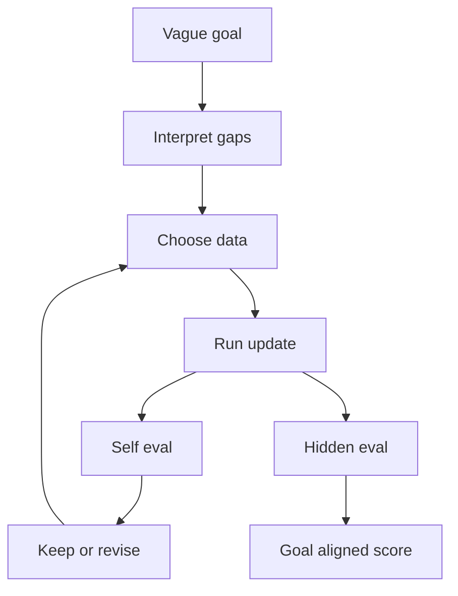
打分理由：模糊目标自进化基准，贴合自我学习路线（core 9 / wide 8）

### 3. ⭐ 📄 LatentPress: Context Compression Beyond Text and Vision
arXiv [2609.01507](https://arxiv.org/abs/2609.01507) · HF 🔥 101 · Zhengze Zhou, Hejian Sang · [PDF](https://arxiv.org/pdf/2609.01507)

**一句话**：LatentPress把长上下文压成软token，4-16倍压缩且读入更快
**为什么值得你看**：适合看长上下文/记忆接口怎么省算力

**核心架构**：反直觉点在于：长对话或长文档里，大部分历史对当前回答没用，但常规系统还是得先把它们还原成文本再喂给模型，白白浪费 token 和延迟。LatentPress把上下文切成 Write / Read 两段：Writer 只训练一个很小的 adapter，把文本写成连续 memory tokens，Frozen decoder 直接从 input-embedding 接口读这些软 token，不走文本重建。这个设计阻断的失败是“压缩后还要再解码回文本”，因为那会把信息损失、延迟和读写开销一起放大。最直接的证据是 LongMemEval 上 7.70x 压缩还能到 0.504 accuracy，略高于未压缩证据 0.490，且显著优于 text summary 和 OCR 式压缩；写入 43ms、读取比 raw context 快 5-9x。新意在组件层：不是再造一个 memory manager，而是定义了机器可读的 soft-token context interface。

- 最强证据：压缩后还能不输 raw evidence
- 16x 在 LongBench-QA 上开始掉点
- 难点是 writer 与 frozen reader 对齐
**精读价值**：值得看，尤其是软 token 接口设计
**关联**：[[Gist]]、[[ICAE]]
#context #compression #inference · 难度：中等 · 建议：值得通读 (20 min)
前置：🔲 [[long context]] · 🔲 [[KV cache]] · 🔲 [[input-embedding]] · ◽ frozen decoder

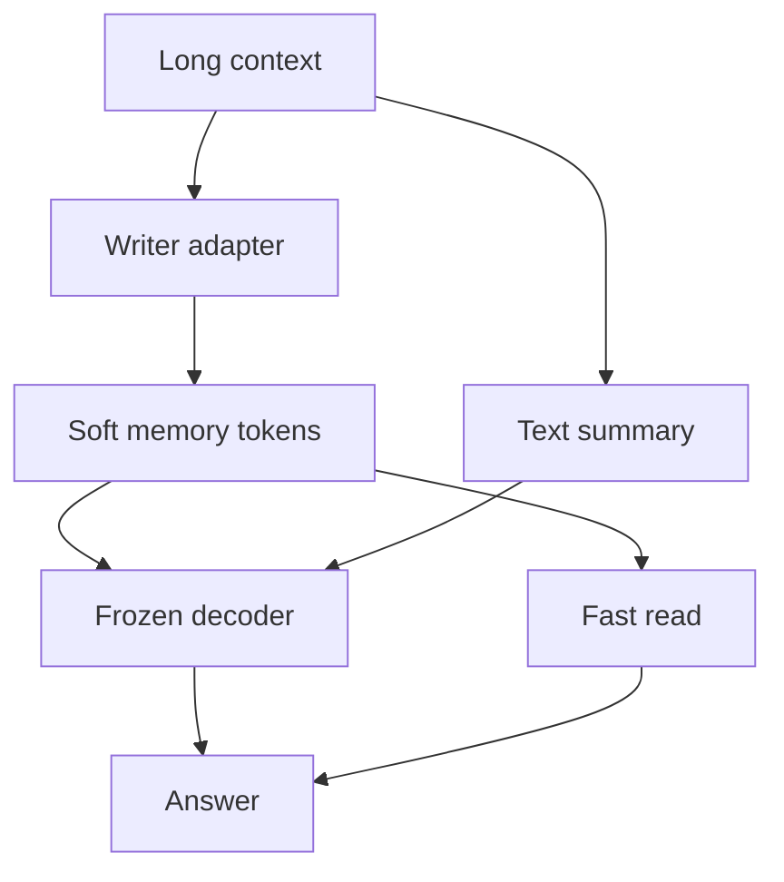
打分理由：上下文压缩到连续记忆token；方法迁移价值高.（core 9 / wide 7）

### 4. ⭐ 📄 Beyond Shallow Alignment: How Post-Training Methods Determine Refusal Circuits And Steering Robustness
arXiv [2609.03887](https://arxiv.org/abs/2609.03887) · Hoang Cuong Nguyen, Mark Dras, Usman Naseem · [PDF](https://arxiv.org/pdf/2609.03887) · [代码](https://github.com/hoangcuongnguyen2001/Beyond-Shallow-Alignment.)

**一句话**：用 Ra-SFT/ORPO 比较拒答电路，发现三模型上 3 种对齐目标都不同时满足
**为什么值得你看**：偏对齐/可解释性，适合面试讲机制而非只讲指标。

**核心架构**：反直觉点在于：同样是“学会拒答”，SFT、Ra-SFT、ORPO 不只是行为上差别，模型内部的拒答计算方式也会被训练目标改写。原来很多工作只看固定模型里的 refusal circuit，这篇把问题改成“训练目标会不会重塑电路”。关键改变是把 post-training 看成在决定 refusal 被谁承担：Ra-SFT 让模型在 reasoning chain 里先形成安全判断，再把拒答分散到不同组件；ORPO 则把偏好信号直接压进参数更新，结果更容易出现集中、脆弱的拒答路径。最直接的证据不是单个最大涨幅，而是跨 Llama-3.1-8B、Gemma-2-9B、Qwen3-8B 都能复现：Ra-SFT 稳定地产生一类不同的内部拒答计算，而没有任何方法同时做到分布式编码、可分离的 safety/capability、以及小编辑可修正。新意在组件层和系统组织层：前者识别拒答电路，后者比较不同 post-training 目标如何改变电路组织。

- Ra-SFT 跨三模型都改写拒答计算
- 最强证据是三目标三者不可兼得
- 需电路分析与 steering 实验，复现偏硬核
**精读价值**：值得精读，能讲清对齐不是只有行为层。
**关联**：[[Arditi et al. 2024]]、[[Yeo et al. 2025]]
#alignment #post-training #steering · 难度：硬核 · 建议：建议精读
前置：🔲 [[reward model]] · 🔲 [[direct preference optimization]] · 🔲 [[chain-of-thought]] · ◽ steering

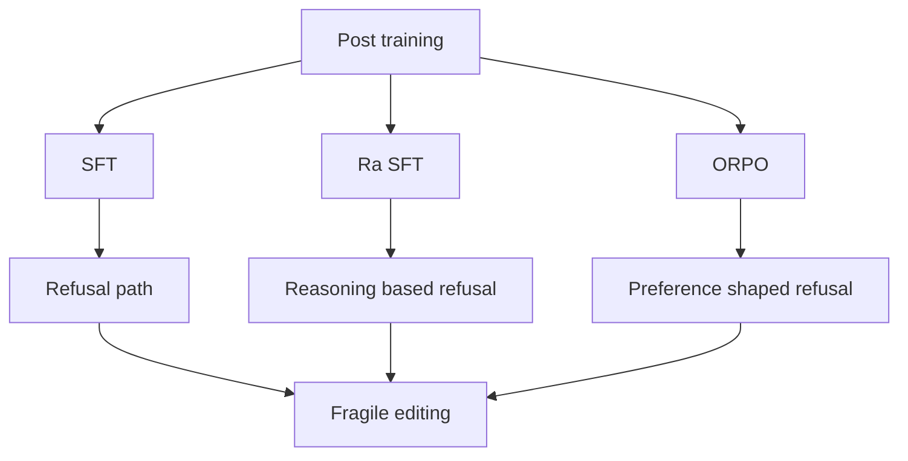
打分理由：拒绝电路受后训练影响，和你核心高度重合（core 9 / wide 6）

### 5. ⭐ 📄 SWE-Gate: Passing Functional Tests Is Not Enough for Software Engineering Agents
arXiv [2609.04167](https://arxiv.org/abs/2609.04167) · Xin He, Yanlin Wang, Mingwei Liu 等 · [PDF](https://arxiv.org/pdf/2609.04167) · [代码](https://github.com/DeepSoftwareAnalytics/SWE-Gate.)

**一句话**：SWE-Gate 用 303 个仓库级样本证明：过测试不等于过 review，644 中 221 个会翻车
**为什么值得你看**：SWE-Bench 相关很适合面试谈评测缺口。

**核心架构**：反直觉点在于：代码 agent 把函数测试跑过了，真实 PR 仍可能被 reviewer 拒掉，因为“修好 bug”和“满足维护者约束”是两条可分离的标准。现有 repo-level benchmark 只测 functional tests，默认这就够了，但它忽略了 backward compatibility、接口约定这类 review-derived acceptance constraints。SWE-Gate 的关键概念是把这些约束变成单独可执行的 constraint tests，于是一个样本同时有 issue 解决能力和 review compliance 两个维度。最直接的证据是作者报告：303 个实例、75 个 Python 仓库、四个 LLM 后端；在 644 次通过 functional tests 的修复里，有 221 次没过约束。新意在实证层和评测组织层：不是新模型，而是把“仓库级修复”拆成可验证的双维度评测。

- 303 个实例，75 个仓库
- 644 个功能通过里 221 个不合规
- 只证明 benchmark 缺口，不证明 agent 训练收益
**精读价值**：值得看，能补 SWE-Bench 视角盲区。
**关联**：[[SWE-bench]]、[[SWE-Agent]]
#agent #benchmark #software · 难度：中等 · 建议：值得通读 (20 min)
前置：🔲 [[SWE-bench]] · ◽ code review · ◽ functional test · ◽ repository-level code generation

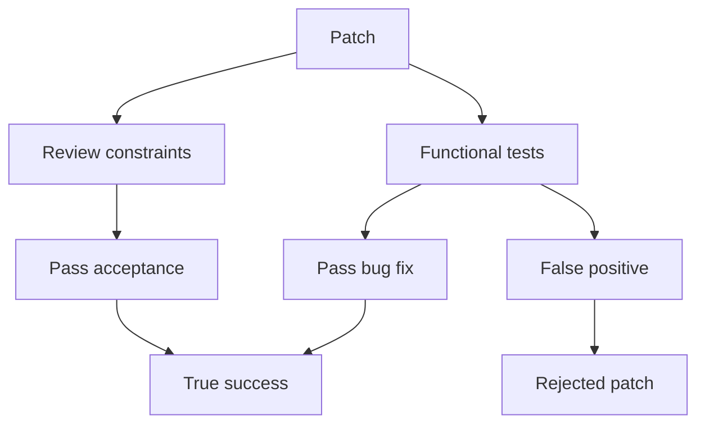
打分理由：SWE-Gate：评测加入review约束，很契合工程agent（core 9 / wide 6）

### 6. ⭐ 📄 Terminal-Universe: Turning Agent Trajectories into Scalable Terminal Environments
arXiv [2609.04148](https://arxiv.org/abs/2609.04148) · HF 🔥 207 · Jie Wu, Zhenru Zhang, Beichen Zhang 等 · [PDF](https://arxiv.org/pdf/2609.04148)

**一句话**：Terminal-Universe 把 trajectory 反向还原成环境，Qwen3.5-27B 提升 11.9 和 13.8 分
**为什么值得你看**：适合看 agent 训练数据怎么从“轨迹”升级到“环境”。

**核心架构**：反直觉点在于：agent 训练里最缺的不是演示轨迹，而是可重复、可验证、能重新提问的 executable environment；轨迹只是一次冻结过的解，不够拿来持续 post-training。Terminal-Universe 的关键改变是反向利用 tool-execution history：先 replay 文件操作，把 workspace 还原到 agent 修改前，再用 completion agent 补齐缺失文件和依赖，得到可执行的部分环境；随后在同一 workspace 上重新生成任务，并把它扩展成跨 workspace 的 breadth 或多轮 user feedback 的 depth。最直接的证据是作者报告：公开 terminal trajectories 被转成 k 个 task-sufficient environments；用这些数据训练 Qwen3.5-27B 后，Terminal-Bench 2.1 单轮提升 11.9 分，EvoCode-Bench v2 MT@4 提升 13.8 分。新意在系统组织层：不是改 agent 本身，而是把轨迹重建成环境并扩任务分布。

- 轨迹反演成可重用环境
- 单轮与多轮都提升
- 环境补全质量决定上限，原文未明示失败率
**为什么现在上榜**：HF upvotes 207；原文未明确是否有正式 release。
**精读价值**：值得看，agent 数据管线思路很新。
**关联**：[[SWE-bench]]、[[Terminal-Bench]]
#agent #environment #evaluation · 难度：中等 · 建议：值得通读 (20 min)
前置：🔲 [[planning]] · 🔲 [[memory]] · ◽ terminal-based code agents · 🔲 [[SWE-bench]]

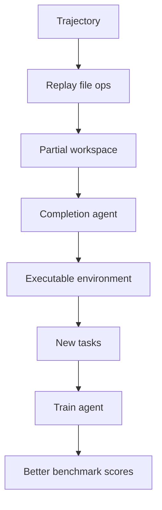
打分理由：Agent轨迹到可扩展终端环境；贴合评测与后训练.（core 8 / wide 6）

### 7. ⭐ 📄 Random Attention: Rethinking KV Cache Eviction for Efficient Reasoning
arXiv [2609.03430](https://arxiv.org/abs/2609.03430) · HF 🔥 103 · Heng Wang, Jielin Qiu, Wenting Zhao 等 · [PDF](https://arxiv.org/pdf/2609.03430)

**一句话**：用随机丢 KV 缓存解决长 CoT 内存瓶颈，4 模型 6 任务持平强基线
**为什么值得你看**：面试常问 KV cache/推理加速的反直觉结论

**核心架构**：反直觉点是：长推理时，大家都在给缓存 token 打分挑“最重要的”，但作者发现分数几乎不决定压缩后准确率。Random Attention 的核心改法不是更准地排序，而是先把问题的 prefill 全保住，再把其余 token 在每个 attention head 内均匀随机保留；这样阻断的是“把唯一出现的输入细节误删掉”的失败，而不是试图精确识别每个中间状态。最直接的证据是四个模型、六个 reasoning 任务里，它在和最强 evictor 对比时总体持平，且在 vLLM 里因不做 scoring pass，吞吐比最强基线高 32–43%。作者进一步用受控实验说明：真正脆弱的是 prompt；而 reasoning trace 会在文本里自我复述、又在多个 head 里冗余存储，所以只要 prompt 安全，随机保留通常就够了。这一工作新在系统组织层：把 eviction 研究从“更好的打分器”转成“先保护什么、再随机散射什么”。

- 最强证据：4 模型 6 任务持平强基线
- 没证明：长 prompt 受限时仍可能崩
- 复现难点：要有 vLLM eviction 集成
**精读价值**：值得精读，核心结论会改你对 eviction 的直觉
**关联**：[[StreamingLLM]]、[[H2O]]
#inference #kv-cache #efficiency · 难度：中等 · 建议：值得通读 (20 min)
前置：🔲 [[KV cache]] · ◽ attention head · 🔲 [[vLLM]] · ◽ reasoning

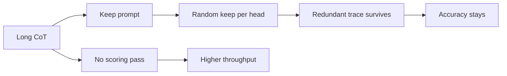
打分理由：随机KV淘汰提升推理吞吐；与长推理系统强相关.（core 8 / wide 5）

### 8. ⭐ 📄 It Takes Two to Match: Co-Evolving Generative Retriever with Reinforcement Learning
arXiv [2609.00638](https://arxiv.org/abs/2609.00638) · HF 🔥 69 · Runpeng Dai, Kaili Huang, Changsung Kang 等 · [PDF](https://arxiv.org/pdf/2609.00638)

**一句话**：用双侧 LLM 生成关键词做检索，RL 后在 WANDS 上提升 F1
**为什么值得你看**：RAG/检索面试里，生成式 retriever 很好讲

**核心架构**：这里的痛点是：传统 LLM 辅助检索多只增强 query 侧，最后仍靠一个独立 retriever 做匹配，生成和匹配是断开的。CoGR 的关键改法是让 query LLM 和 item LLM 都直接生成一小组 keywords，检索时只做 inverted index overlap，再用 BM25 排序；这样阻断的是“生成表征和最终匹配目标不一致”的失败。训练上先用 SFT 把两侧 keyword space 对齐，再用 GRPO 做 co-evolving RL：query 侧直接拿 retrieval F1 奖励，item 侧拿 counterfactual marginal reward，衡量它改了 query 侧检索结果多少。最直接的证据是它在内部 APP Marketplace 和公开 WANDS 上都超过 10 个 sparse/dense/generative baseline，且训练过程中两侧 keyword space 越来越对齐。新在系统组织层：不是单侧 query expansion，而是把 retriever 本身改成双侧可学习的生成匹配器。

- 最强证据：10 个基线里双数据集最优
- 没证明：对非 keyword 场景可迁移性有限
- 复现难点：双侧 RL 和 counterfactual reward
**精读价值**：值得通读，适合补检索系统与 GRPO 结合思路
**关联**：[[BM25]]、[[generative retrieval]]
#retrieval #rl #rag · 难度：硬核 · 建议：建议精读
前置：🔲 [[retrieval-augmented generation]] · 🔲 [[embedding]] · 🔲 [[reranker]] · 🔲 [[GRPO]]

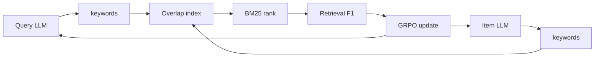
打分理由：生成式检索器与RL联合，RAG相关性高（core 8 / wide 7）

## 🧰 项目 · 核心方向

### 9. ⭐ 🧰 Tencent/AI-Infra-Guard
[GitHub](https://github.com/Tencent/AI-Infra-Guard) ★6,139 (+1778 本月) · Trending monthly · infra · Python

**一句话**：用一站式红队平台扫 Agent、MCP、Skill 风险，v4.6.0 新增 API poisoning
**为什么值得你看**：做 Agent/MCP 项目和安全面试都能直接聊

**核心架构**：它解决的是 AI 系统上线前“工具、技能、MCP、提示词、基础设施风险各自分散，没法一套跑完”的痛点。承重结构是分域扫描器：Agent-Scan、MCP-Scan、Skill-Scan、AI Infra scan 和 jailbreak evaluation 共用一套平台和规则库；运行时不是单次检测，而是按目标类型分流到对应扫描器，再把结果汇总成统一报告。关键取舍是既保留 CLI/本地部署，也提供 Web 界面和 Docker 一键启动，适合内网红队或 CI/CD。成熟度信号很强：README 给出 Docker、源码安装、单命令脚本，且最近 release 到 v4.6.0，新增 API Checker、LLM API poisoning detection、Agent-Scan v5.0.0 重构，说明还在快速迭代。相对同类，它强在覆盖面和 release 活跃度，不是单点的 prompt injection 或 MCP 扫描器。

- 最强证据：v4.6.0 明确加了 poisoning 检测
- 没证明：public 网络部署不安全，原文也警告了
- 复现难点：需要 Docker 与较完整环境
**为什么现在上榜**：最近 release：v4.6.0（2026-08-26），新增 API poisoning detection 和 Agent-Scan 重构
**精读价值**：值得上榜，适合做 AI 安全/Agent 红队工具箱
**关联**：[[OWASP Top 10 for LLM Applications]]、[[ReAct]]
#red-teaming #agent-safety #eval · 难度：中等 · 建议：值得通读 (20 min)
前置：🔲 [[prompt injection]] · 🔲 [[model context protocol]] · ◽ agent · 🔲 [[jailbreak]]

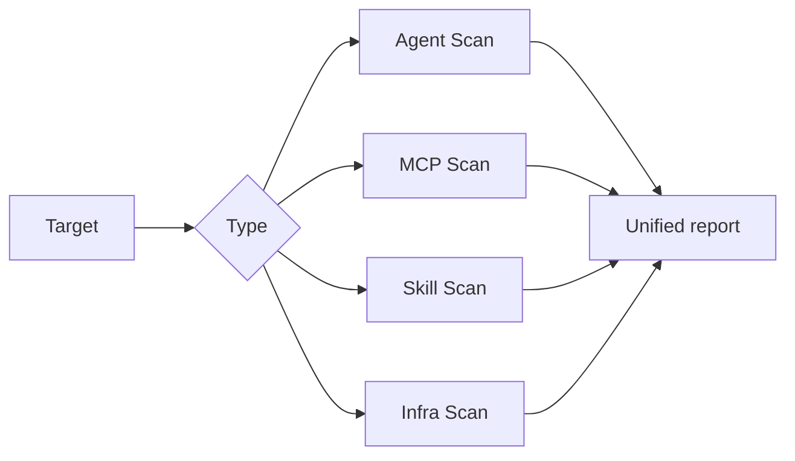
打分理由：Agent/LLM 安全评测平台，覆盖面强且可用（core 9 / wide 8）

### 10. ⭐ 🧰 semantica-agi/semantica
[GitHub](https://github.com/semantica-agi/semantica) ★11,982 (+10058 本月) · Trending monthly · infra · Python

**一句话**：用 Context Graph 把 LLM 上下文变成可追溯知识图，作者称可审计且无 LLM 依赖
**为什么值得你看**：适合做 RAG/Agent 的可解释与审计层

**核心架构**：反直觉点是：企业 Agent 真正难的不是“答得像”，而是“每个答案都得说清数据从哪来、规则怎么推出来、冲突怎么处理”。Embedding 只能给相似度，无法表达关系、约束和证据链，所以一旦遇到合规质疑就断掉。Semantica 的关键改变是把上下文做成 Context Graph/KG：ingest 后抽实体、关系、事件，靠 ontology 和 controlled vocabulary 约束语义；再用 deterministic reasoning、SHACL、PROV-O 把“事实→规则→决策”串成可查询的因果链，阻断黑盒检索和不可审计推理。最直接的证据是 v0.6.7 把 reasoning Action layer、`run_shacl_validation`、Markdown round-trip persistence 和 LangChain integration 一起补上，说明它不只是存图，而是在补“可写、可校验、可接入”的执行闭环。新意主要在系统组织层：把 context、knowledge、reasoning、provenance 合成一层基础设施，而不是单点图数据库。

- 作者强调无 LLM 也能建图和推理
- PROV-O/SHACL 是强审计证据
- 复现要懂 RDF/OWL/SHACL 体系
**精读价值**：值得看架构层，尤其是 Agent 审计链
**关联**：[[RDF]]、[[SHACL]]
#graph #infrastructure #accountable-ai · 难度：硬核 · 建议：建议精读
前置：🔲 [[retrieval-augmented generation]] · 🔲 [[embedding]] · 🔲 [[planning]] · 🔲 [[model context protocol]]

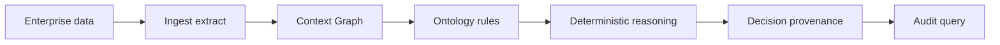
打分理由：图原生上下文/可问责 AI 基建，方向匹配度高（core 8 / wide 8）

### 11. ⭐ 🧰 cactus-compute/needle
[GitHub](https://github.com/cactus-compute/needle) ★10,253 (+6855 本月) · Trending monthly · model · Python

**一句话**：用 45M 模型和 14MB 引擎做工具调用，作者称整轮会话约 28MB RAM
**为什么值得你看**：适合关注端侧 agent、超小模型和量化

**核心架构**：这个项目解决的是“手机/穿戴设备上也要可靠工具调用，但常规 LLM 太大、工具输出又必须结构化”的矛盾。Needle 的核心不是把大模型硬压小，而是把输出通道和工具选择都收紧：byte-level grammar 先把可生成空间限制到 schema，tool retrieval 先从大工具表里筛出 top five，再用 confidence head 决定直接执行还是升级；而 256-token sliding window + KV sinks 把长会话内存固定住，阻断端侧推理时显存/内存失控。最直接的证据是它同时给出工具调用、structured extraction、confidence gating 和离线包部署，说明闭环已经到可用层。新意主要在组件层：Hadamard MLP、GQA、engram memory、constrained decoding 组合成一个可落地的 tiny-model 方案。

- 14MB 引擎、约 28MB RAM 是核心卖点
- 结构化输出靠 schema 约束，不是纯 prompt
- 45M 参数小，泛化边界要看工具设计
**为什么现在上榜**：作者报告近期开源 Needle 2，并给出 v2 引擎、LoRA fine-tuning 和 playground
**精读价值**：想看端侧工具调用，这个值得通读
**关联**：[[FunctionGemma]]、[[LFM2.5]]
#efficient-llm #tiny-devices #multimodal · 难度：中等 · 建议：值得通读 (20 min)
前置：🔲 [[LoRA]] · 🔲 [[quantization]] · 🔲 [[KV cache]] · 🔲 [[speculative decoding]]

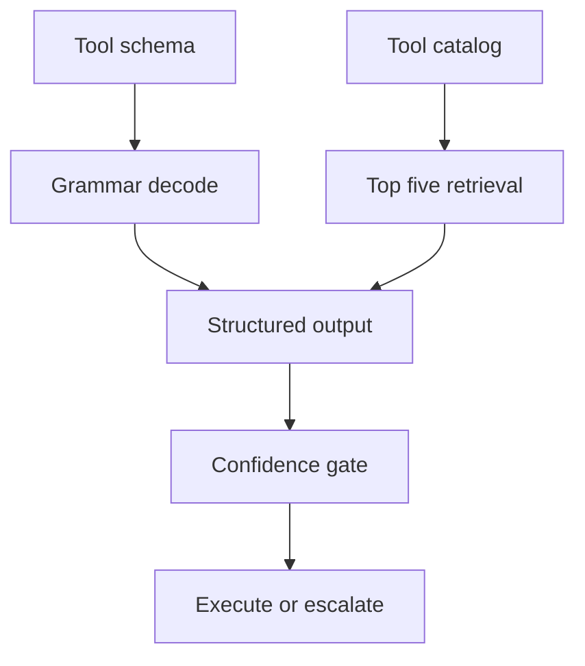
打分理由：面向小设备的基础模型，适合压缩/部署研究（core 8 / wide 7）

### 12. ⭐ 🧰 sgl-project/sglang
[GitHub](https://github.com/sgl-project/sglang) ★35,446 (+664 今日) · Trending daily · infra · Python

**一句话**：用高性能 serving 框架跑 LLM 和多模态，最近 v0.5.18 新增 710 PR 级更新
**为什么值得你看**：和推理加速、serving 面试高度相关

**核心架构**：它解决的是“模型越来越杂，serving 还得同时扛吞吐、延迟和新模型支持”的现实问题。传统框架常在 prefill、decode、speculative decoding、diffusion 或 TPU 适配里各自碎片化，结果是新模型一来就得重写路径。SGLang 的关键改变是把 serving 做成可扩展运行时：围绕 batch scheduler、cache-aware load balancing、structured outputs、PD disaggregation、expert parallelism 和 diffusion backend，尽量让新模型落到同一套执行骨架上，阻断“每个模型一套特化代码”的维护崩溃。最直接的证据不是某个单点 benchmark，而是它在近几个 release 里连续补了 DeepSeek、Kimi、TPU、Diffusion、speculative decoding 等支持，说明架构确实在吃新范式。新意主要在系统组织层和实证层：不是单个 kernel 优化，而是 serving runtime 的通用化。

- 连续 release 说明维护活跃度高
- 覆盖 LLM、VLM、diffusion、TPU
- 单纯看榜分不够，要看 workload 适配
**为什么现在上榜**：作者在 2026/08 发布 v0.5.18；正文同时列出 2026/07-08 的连续 release 和 day-0 支持事件
**精读价值**：做推理系统方向，值得精读 release 设计
**关联**：[[vLLM]]、[[TensorRT-LLM]]
#inference #serving #performance · 难度：硬核 · 建议：建议精读
前置：🔲 [[KV cache]] · 🔲 [[flash attention]] · 🔲 [[speculative decoding]] · 🔲 [[mixture of experts]]

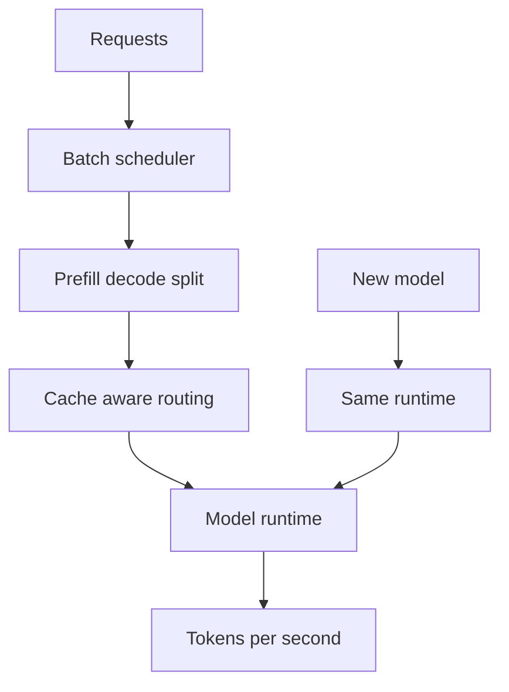
打分理由：高性能推理框架，工程与面试都强（core 8 / wide 9）

### 13. ⭐ 🧰 mlc-ai/web-llm
[GitHub](https://github.com/mlc-ai/web-llm) ★18,976 (+345 本周) · Trending weekly · infra · TypeScript

**一句话**：用 WebGPU 把模型塞进浏览器，零服务器跑 OpenAI 兼容 LLM
**为什么值得你看**：做端侧/隐私/离线 Agent 很实用

**核心架构**：反直觉点是：浏览器里跑 LLM 不是“把推理搬过去”这么简单，而是要同时解决模型下载、GPU 调度、API 兼容和前端阻塞；单纯的 WASM 方案通常卡在速度和交互性上。WebLLM 的关键改变是把推理引擎做成浏览器内的 WebGPU runtime，并把 `MLCEngine` 设计成 OpenAI API 的兼容层，这样上层应用不必改调用方式，底层却能在本地完成 streaming、JSON mode、function calling 等流程。它阻断的失败是“前端能接模型但不好接业务”：worker/service worker 把长任务从 UI 线程移走，结构化生成放在模型库的 WASM 部分，减少前端 glue code。最直接的证据是仓库明确支持多模型、OpenAI 兼容和浏览器端硬件加速，且最近 release 还在补跨域存储、artifact 完整性校验、kv state-aware function registration，说明它在往可部署、可缓存、可扩展的 runtime 细化。新东西主要在系统组织层：不是新模型，而是把“浏览器 = 运行时 + API 适配器 + 缓存/校验”合成一个可用栈。

- 最强证据：OpenAI API 兼容且全在浏览器执行
- 没证明什么：复杂大模型的极限吞吐原文未给
- 复现门槛：依赖 WebGPU 和模型首次下载缓存
**精读价值**：想做端侧 LLM/浏览器 Agent，值得看项目结构
**关联**：[[vLLM]]、[[MLC LLM]]
#inference #llm #edge · 难度：中等 · 建议：值得通读 (20 min)
前置：◽ webgpu · 🔲 [[KV cache]] · ◽ OpenAI API

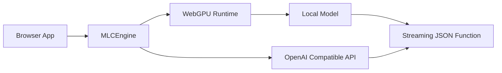
打分理由：Web 端高性能 LLM 推理引擎，工程价值高（core 8 / wide 8）

### 14. ⭐ 🧰 langgenius/dify
[GitHub](https://github.com/langgenius/dify) ★154,451 (+117 今日) · Trending daily · tool · TypeScript

**一句话**：用可视化工作流串起 RAG 和 Agent，直接走向生产
**为什么值得你看**：LLM 应用平台/Agent 编排面试常被问

**核心架构**：它解决的是真实痛点：原型能跑，但一旦要接检索、工具、日志、部署和权限，团队就会开始重搭胶水层。Dify 的核心不是“功能多”，而是把 workflow、RAG pipeline、agent、model management、observability 绑在同一套协作工作台里，让应用从 prompt demo 直接进入可运维状态。关键设计取舍是：workflow 作为编排骨架，RAG 作为数据通路，agent 通过 Function Calling 或 ReAct 接工具，LLMOps 记录线上日志和标注，BaaS 再把这些能力以 API 暴露出去；它阻断的是“每个项目都重新实现一遍中台”。最近 release 里最能说明成熟度的是 agent runtime 新增 E2B sandbox、home snapshots 和 skill management：sandbox backend 可切换，published agent 会恢复发布时的 home 状态，说明它在解决可复现执行环境而不只是对话外壳。新在哪一层是系统组织层，不是单点算法。

- 最强证据：published agent 可恢复 home snapshot
- 没证明什么：复杂评测提升或检索质量原文未给
- 成熟度信号：有 cloud/self-host、文档、连续 release
**为什么现在上榜**：最近 1.17.0 / 1.16.x 持续加 Agent runtime 能力
**精读价值**：做 LLM 应用栈或 Agent 平台，值得看它怎么组织系统
**关联**：[[LangChain]]、[[LlamaIndex]]
#rag #agent #workflow #orchestration · 难度：中等 · 建议：值得通读 (20 min)
前置：🔲 [[retrieval-augmented generation]] · 🔲 [[ReAct]] · 🔲 [[planning]] · 🔲 [[memory]]

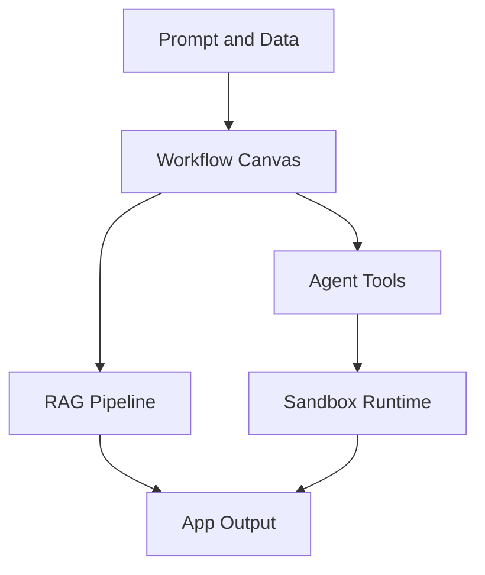
打分理由：开源Agent+RAG工作流，工程可用且热门。（core 8 / wide 8）

## 🌐 全领域热点

### 15. 🌐 🧰 cloudflare/computer
[GitHub](https://github.com/cloudflare/computer) ★9,022 (+8938 本月) · Trending monthly · tool · TypeScript

**一句话**：把虚拟文件系统和执行后端放进 Durable Object，给 agent 一台电脑
**为什么值得你看**：agent 工程和 browser automation 方向很对口

**核心架构**：它解决的不是“能不能执行代码”，而是 agent 在浏览器/Workers 里反复改文件、跑命令、切后端时，状态怎么不丢。Cloudflare Computer 的核心概念是把 Workspace 做成 Durable Object 里的权威状态，文件系统由 SQLite 持久化，再通过 `workspace.runtime.exec` 统一调度不同 backend；也就是说，`fs` 和 `runtime` 分离，后端只是执行面，状态始终在 DO。这个设计阻断的失败是“执行环境和持久状态脱钩导致的同步地狱”：Container 后端用 FUSE 把状态投到 sandbox，Isolate shell 直接通过 Workers RPC 访问同一份 Workspace，Isolate JavaScript 则在新 Worker 里执行模块但仍回写到 workspace-backed `node:fs/promises`。最直接的证据是仓库把容器、Worker shell、Worker JS、MCP、artifacts 等示例都摆出来，而且 README 明确写了 preview only，API unstable，说明当前价值在架构试验而非生产落地。新东西在架构层：不是再造一个 shell，而是统一状态语义和多执行后端。

- 最强证据：single execution entrypoint 统一多 backend
- 没证明什么：README 明说 preview only，不适合生产
- 复现门槛：要理解 Durable Object、FUSE、Workers RPC
**为什么现在上榜**：最近 0.2.0/0.2.1 刚发，且 stars 短期暴涨
**精读价值**：看它怎么给 agent 做“可持久的电脑”，架构味很重
**关联**：[[MCP]]、[[Playwright]]
#agent #browser-automation #computer-use · 难度：硬核 · 建议：建议精读
前置：🔲 [[planning]] · 🔲 [[memory]] · 🔲 [[model context protocol]]

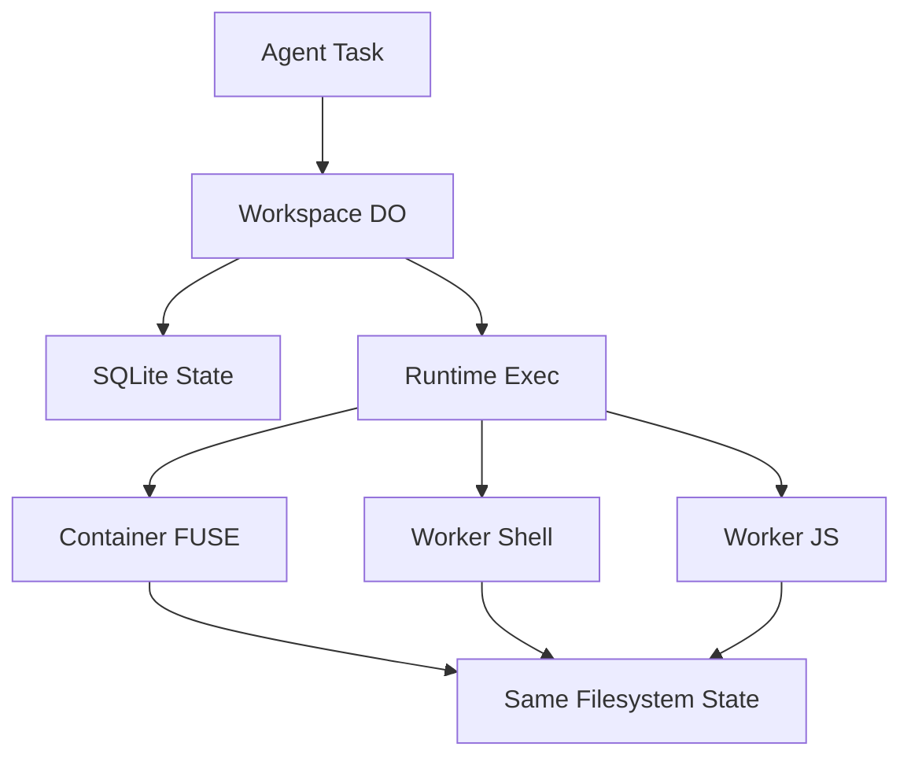
打分理由：给 agent 提供“电脑”能力，贴近新交互范式（core 7 / wide 8）

### 16. 🌐 🧰 browser-use/video-use
[GitHub](https://github.com/browser-use/video-use) ★24,002 (+2403 本周) · Trending weekly · infra · Python

**一句话**：Edit videos with coding agents
**为什么值得你看**：（dry-run：未调用 LLM，配置 OPENAI_API_KEY 后会生成中文速览）
#agent #video #tool-use #coding · 难度：中等 · 建议：看速览即可
打分理由：视频编辑用coding agents，热度高且实用。（core 7 / wide 8）

### 17. 🌐 🧰 abhigyanpatwari/GitNexus
[GitHub](https://github.com/abhigyanpatwari/GitNexus) ★47,009 (+1157 本周) · Trending weekly · infra · TypeScript

**一句话**：GitNexus: The Zero-Server Code Intelligence Engine - GitNexus is a client-side knowledge graph creator that runs entirely in your browser
**为什么值得你看**：（dry-run：未调用 LLM，配置 OPENAI_API_KEY 后会生成中文速览）
- Drop in a git repository (Github, Gitlab, Azure, Local) or ZIP file, and get an interactive knowledge graph with a built
- Perfect for code exploration
#rag #graph #agent · 难度：中等 · 建议：看速览即可
打分理由：浏览器端代码知识图谱+Graph RAG Agent（core 7 / wide 8）

### 18. 🌐 🧰 anomalyco/opencode
[GitHub](https://github.com/anomalyco/opencode) ★203,964 (+314 今日) · Trending daily · tool · TypeScript

**一句话**：The open source coding agent.
**为什么值得你看**：（dry-run：未调用 LLM，配置 OPENAI_API_KEY 后会生成中文速览）
#agent #coding #tool-use · 难度：中等 · 建议：看速览即可
打分理由：开源 coding agent，热点且可复现（core 7 / wide 8）

---
想精读哪一篇？在 Claude 里说：`精读 2026-09-04 第 N 条`，Jarvis 会按你的 known.md 只讲你不会的部分。