# Jarvis 日报 · 2026-09-05

候选 451 → 过滤后 127 → 入选 18。图例：⭐ 核心方向 · 🌐 全领域热点 · ✅ 已掌握前置 · 🔲 需补前置

## 📄 论文 · 核心方向

### 1. ⭐ 📄 Rethinking On-Policy Distillation of Large Language Models II: One Training Example
arXiv [2609.04172](https://arxiv.org/abs/2609.04172) · HF 🔥 73 · Zixuan Fu, Bingxiang He, Yuxin Zuo 等 · [PDF](https://arxiv.org/pdf/2609.04172) · [代码](https://github.com/Thinking-Space/One-Shot-OPD) ★36

**一句话**：单问OPD仍训数百步，复现全量OPD大部分收益
**为什么值得你看**：适合看OPD/后训练效率与数据设计

**核心架构**：反直觉点在于：OPD 看起来依赖大量训练样本，但作者把数据压到 1 个 query 后，模型仍能持续提升数百步，说明瓶颈不在“样本数够不够”，而在“算法吸收得够不够快”。关键概念是 state coverage：它不是统计题目数，而是统计 student rollout 真的走到、因此 teacher 真的给到 token 监督的 state 子空间。1 个 query 已覆盖 full-data OPD 访问状态的 71.5%，16 个语义不同 query 到 98.9%，这解释了为什么少量数据能吃到大部分收益；但 alignment 下降速度在单问和全量数据下几乎一样，说明训练慢是 OPD 机制本身的步效率问题，不是数据供给问题。最直接的证据是单问曲线能持续改善到数百步，并在多域、多模型上复现，且 16 个 query 的覆盖率和验证精度一起上升直至追平全量训练。新意主要在实证层：把 OPD 的“数据是否足够”改写成“诱导了哪些 states”，并把数据与算法两个因素拆开测。

- 1 query 覆盖 full-data states 的 71.5%
- alignment 变慢不随数据量改变
- 16 queries 可追平 full-data OPD
**精读价值**：值得精读，核心是重写 OPD 的数据/算法分工
**关联**：[[Agarwal et al. 2024]]、[[one-shot RLVR]]
#distillation #on-policy #rl · 难度：中等 · 建议：建议精读
前置：🔲 [[on-policy distillation]] · 🔲 [[reward model]] · 🔲 [[knowledge distillation]] · 🔲 [[self-attention]]

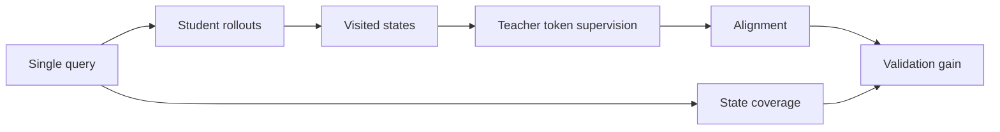
<sub>打分理由：on-policy distillation数据最小化，面试可讲清细节（core 9 / wide 6）</sub>

### 2. ⭐ 📄 VeriPhy: Agentic Physical Reasoning for World Model Evaluation and Refinement
arXiv [2609.03153](https://arxiv.org/abs/2609.03153) · HF 🔥 12 · Wenzhuo Xu, Yuchen Zhu, Chongjian Ge 等 · [PDF](https://arxiv.org/pdf/2609.03153)

**一句话**：VeriPhy把视频物理判定编成可审计证据链
**为什么值得你看**：适合看 agent 编排与视频 world model 评测

**核心架构**：问题不是“能不能打分”，而是“一个视频到底违反了哪条物理约束、在什么时间点坏掉”。单一标量分数回答不了这个，因为物理失败常分散在对象、轨迹、接触窗和音画时序上。VeriPhy 的关键改变是把 prompt 先编译成 typed physical obligations，再让 text-only planner 产出经静态验证的执行计划；执行时只调用已声明的 frozen experts，像 segmentation、tracking、depth、OCR、audio-event detection 和 11 个轨迹测量。每次动作都返回带 provenance 的 evidence record，再由固定 resolver 把记录合成 supported / contradicted / unknown，最终映射成 plausible / implausible / abstain。这样阻断的是“黑盒问答式评测”常见的证据缺失和责任不清：一旦某个依赖证据拿不到，结论就保持 unknown 而不是硬猜。最直接的支持是 149 片核心集上，它对 304 条 flaw records 的 recall 为 228，高于同 backbone 的 question-decomposition evaluator 的 164；而且单纯 monolithic prompt recall 也有 222，说明提升不主要来自更强模型，而来自证据链组织。新在系统组织层。

- 证据带 provenance，结论可逐条追溯
- 缺证据时输出 unknown 或 abstain
- 149 片核心集上 recall 228
**精读价值**：值得精读，agent 组织方式本身就是贡献
**关联**：[[AV-Phys Agent]]、[[question decomposition]]
#agent #worldmodel #verification · 难度：硬核 · 建议：建议精读
前置：◽ agent · 🔲 [[planning]] · 🔲 [[memory]] · 🔲 [[vision transformer]]

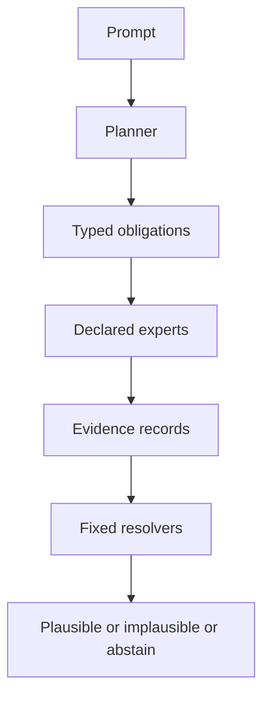
<sub>打分理由：面向物理可靠性的 agent 化评测与可审计验证（core 9 / wide 7）</sub>

### 3. ⭐ 📄 Compile by Training: Turning Natural-Language Specifications into Local Neural Functions
arXiv [2609.04199](https://arxiv.org/abs/2609.04199) · HF 🔥 281 · Yuntian Deng, Pengyu Nie, Stuart Shieber · [PDF](https://arxiv.org/pdf/2609.04199) · [代码](https://github.com/programasweights/compile-by-training) ★4

**一句话**：Compile by Training把自然语言规范编成本地神经函数，FuzzyBench-Hard达83.6%
**为什么值得你看**：适合看 LoRA+编译式工作流与产品化架构

**核心架构**：痛点是很多文本规则既不像代码那样好写，也不值得每次都把请求发给大模型；作者把它改成“编译一次、运行很多次”的神经函数。关键概念是 compile by training：先用 teacher models 生成任务例子，再用这些监督去训练共享 frozen interpreter 上的轻量 LoRA adapter，最后把 adapter 和 run-time scaffold 打包成可版本化的 .paw artifact。它阻断的是每次推理都依赖远程模型的成本、延迟和供应商耦合，也避免为每个规范训练整模型的存储爆炸。最直接的证据是它在 FuzzyBench-Hard 上达到 83.6% semantic accuracy，而 fast compiler 在同一子集上没有 exact matches；代价是编译时间从秒级变成约 1 分钟。这个结果说明它不是单纯更快，而是把 LLM 从 runtime dependency 变成 compile-time tool。新意在系统组织层：把适配、缓存、版本控制这些软件工程语义真正落到神经函数上。

- FuzzyBench-Hard 上 83.6% semantic accuracy
- 编译约 1 分钟，换来本地可复用函数
- .paw 可缓存、版本化、组合
**为什么现在上榜**：原文未明确
**精读价值**：值得看，偏系统与产品化思路
**关联**：[[Program-as-Weights]]、[[LoRA]]
#compilation #program-as-weights #inference · 难度：中等 · 建议：值得通读 (20 min)
前置：🔲 [[LoRA]] · 🔲 [[quantization]] · ◽ compile by training · ◽ program merging


<sub>打分理由：把自然语言规格编译为可复用本地神经函数。（core 8 / wide 6）</sub>

### 4. ⭐ 📄 Knowing When Not to Reuse: Conditional Experience Transfer in Autonomous LLM Post-Training
arXiv [2608.26730](https://arxiv.org/abs/2608.26730) · HF 🔥 149 · Tingyun Li, Wenfeng Feng, Weiqing Li 等 · [PDF](https://arxiv.org/pdf/2608.26730)

**一句话**：BCIT 用条件授权复用经验，4B 模型跨三任务少放行害更新并提质
**为什么值得你看**：适合看自治后训练如何避免“错把旧证据当许可”

**核心架构**：反直觉点在于：某个 update 在旧 parent 上有效，不代表换了 parent 还能直接继续烧 full-training compute；parent、数据混合、训练阶段一变，旧成功可能转成误导，甚至把后续轨迹带歪。BCIT 的关键改法是把“经验”从通用记忆改成带来源上下文的授权记录：每条证据绑定 source context，再用 applicability conditions 和 named hard conflicts 先做拒绝；如果条件不够，先做 bounded current-parent trial 取当前状态证据，只有 frozen rule 过关才允许 full training。这样组件不是在“找相似例子”，而是在阻断 context-free reuse、无谓验证和 harmful promotion 三类失败。最直接的证据是 matched candidate–context 下的 authorization audit：BCIT 放行更少有害候选，同时在 equal-budget final quality 上优于 validation-intensive 和 same-evidence 对照。新意主要在系统组织层：它把“何时能复用经验”提升成自治后训练里的独立控制问题，而不是单纯的 transferability 打分。

- 最强证据是授权审计，不只是最终分数
- 没证明通用适配器，强依赖硬冲突规则
- 复现难：要有连续 parent、候选和反馈链
**精读价值**：值得精读，核心是把经验复用做成可审计控制问题
**关联**：[[Taskonomy]]、[[LEEP]]
#rlhf #dpo #posttraining · 难度：硬核 · 建议：建议精读
前置：🔲 [[direct preference optimization]] · 🔲 [[group relative policy optimization]] · 🔲 [[planning]] · 🔲 [[memory]]

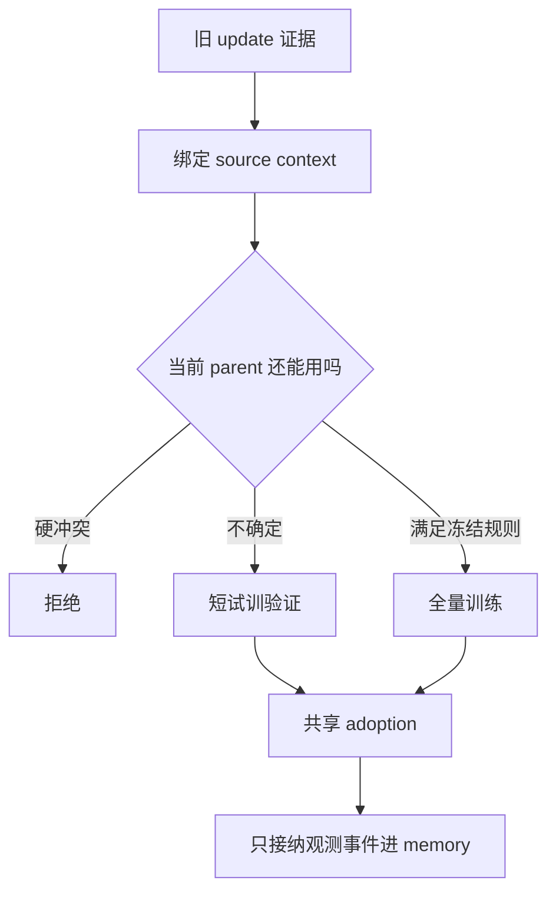
<sub>打分理由：自主后训练的经验复用边界，直接影响Agent训练（core 8 / wide 7）</sub>

### 5. ⭐ 📄 Beyond Retrieval: Progressive Latent Memory Evolution for Streaming Video Understanding
arXiv [2609.04131](https://arxiv.org/abs/2609.04131) · HF 🔥 29 · Hongyu Qu, Guangming Yao, Ling Xing 等 · [PDF](https://arxiv.org/pdf/2609.04131)

**一句话**：LatentStream 把流视频记忆从检索外挂改成内化到固定 latent memory
**为什么值得你看**：适合看 streaming video 的记忆组织和 test-time 机制

**核心架构**：典型悖论是：流式视频里检索到的历史越多，推理上下文越长，但模型真正能“记住并持续用”的状态却没变，最后只是把外部证据越堆越大。LatentStream 把问题改成 retrieve-and-internalize：先用 Query-agnostic Hierarchical Streaming Memory 在固定预算下把长历史压成短中长三层，阻断外部 bank 无上限膨胀；再让 Hierarchical Latent Memory Evolution 把 latent memory tokens 分组、逐步扩展 receptive field，按范围取证并把证据吸进固定长度 latent state，阻断“证据来了但没被状态吸收”；最后用 Progressive Confidence-guided Latent Memory Optimization，用 group-wise predictive entropy 做分层 progression reward，阻断内化后推理置信度不升反降。最强证据是它在五个 online/offline benchmark 上都做到 SOTA 或 highly competitive，且是 test-time optimization，不改 Video-LLM 参数，直接证明收益来自记忆组织而不是训练更大模型。新意在系统组织层和推理层：把外部检索与内部记忆更新做成迭代闭环。

- 最强点是固定长度 latent state 仍能逐步吸收历史
- 没证明适用于任意 Video-LLM，依赖 test-time 优化
- 复现难：三层记忆、分组 token、熵奖励都要调
**精读价值**：值得通读，记忆从外部检索转内化这点很像新范式
**关联**：[[RAG]]、[[flash attention]]
#video #memory #inference · 难度：硬核 · 建议：建议精读
前置：🔲 [[VLM]] · 🔲 [[long context]] · 🔲 [[memory]] · 🔲 [[test-time compute]]

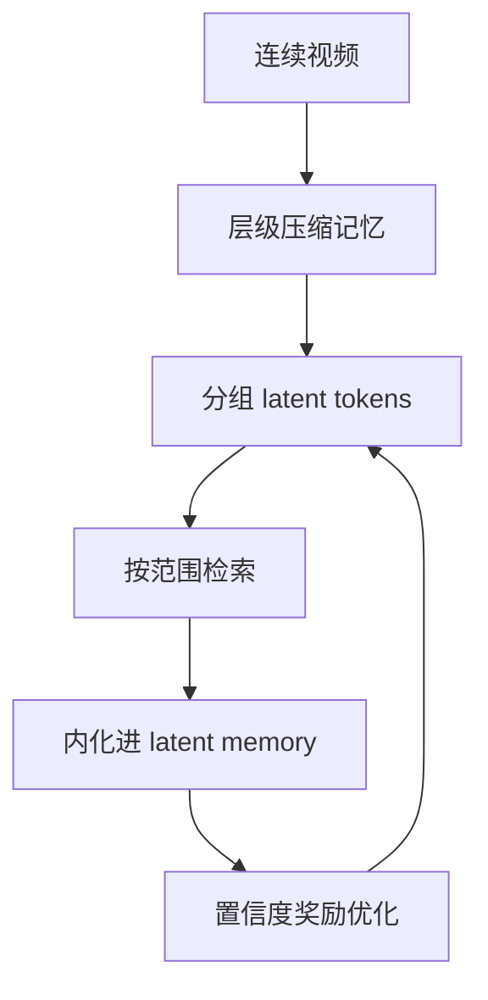
<sub>打分理由：流式视频理解的潜变量记忆，贴Agent推理（core 8 / wide 6）</sub>

### 6. ⭐ 📄 LLaDA-Image: Building Strong Image Generators with Fully Open Training Recipes
arXiv [2609.03796](https://arxiv.org/abs/2609.03796) · HF 🔥 215 · Chuyan Chen, Haoxing Chen, Kun Chen 等 · [PDF](https://arxiv.org/pdf/2609.03796)

**一句话**：LLaDA-Image 用 220M 数据和 6B DiT 做出开源 SOTA 图像生成
**为什么值得你看**：适合看开放训练 recipe 和 image generation 的系统配方

**核心架构**：它解决的是开源图像生成里最现实的矛盾：想要高保真、可编辑、还能少步数推理，但一开始就靠大规模图文对齐，往往把最贵的监督放在最不稳的训练阶段。LLaDA-Image 的关键改法是先把视觉先验和语言对齐拆开：先用 image-only pre-training / mid-training 让 6B DiT 学到强视觉分布，再接 frozen VLM 提供条件，把理解、生成、编辑接到同一单流路径里；编辑时再叠加 reference signals 保住未改内容，最后用 TwinFlow 把多步生成蒸馏到 2–4 步。这里的组件关系很清楚：image-only 先阻断“caption 质量和分辨率损失拖慢早期学习”，冻结理解骨干阻断“生成与理解参数互相干扰”，蒸馏阻断“质量好但太慢”。最直接的证据是 Qwen-Image-Bench 英文/中文双轨都报开源 SOTA，且作者同步放出权重、代码和 recipe。新意在系统组织层：它把训练阶段、单流架构和蒸馏串成可复用 recipe，而不只是单点模型改良。

- 最强证据是开源双语 benchmark SOTA
- 没证明所有组件最优，作者也不这么 claim
- 复现门槛高：220M 数据与完整训练栈都要跟上
**精读价值**：值得精读，重点看开放 recipe 如何组织训练阶段
**关联**：[[DiT]]、[[distribution-matching distillation]]
#diffusion #dit #multimodal · 难度：中等 · 建议：值得通读 (20 min)
前置：🔲 [[diffusion model]] · 🔲 [[Diffusion Transformer]] · 🔲 [[VLM]] · ◽ distillation

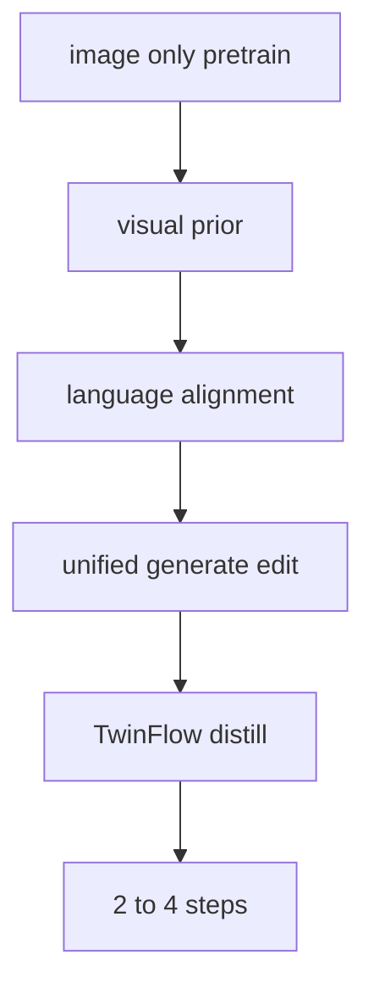
<sub>打分理由：开训配方+可复现图像生成思路，和VLM/系统相关（core 7 / wide 6）</sub>

### 7. ⭐ 📄 Why Gated DeltaNet Survives 4-Bit Quantization: NVFP4 W4A4 for the Recurrent Half of a Hybrid 27B LLM
arXiv [2609.04098](https://arxiv.org/abs/2609.04098) · HF 🔥 73 · Sergii Kozyrev, Davyd Maiboroda · [PDF](https://arxiv.org/pdf/2609.04098)

**一句话**：Minima 用 NVFP4 W4A4 量化 GDN 全部线性层，32K PPL 贴近 BF16，checkpoint 17.5 GiB。
**为什么值得你看**：量化+长上下文推理，面试很常问。

**核心架构**：反直觉点是：大家默认 recurrence 会把 4-bit 误差一路放大，所以 GDN 的 gate 和 state 一直被留在 8/16 bit；作者直接验证这个前提是错的。关键改变不是“更大精度保守一点”，而是把 GDN 也纳入 NVFP4 W4A4 的统一量化，并用机制分析解释为何误差不累积：16-element block scaling 先把残差流里的离群值局部化，阻断全层传播；gate 的 softplus/exponential 和 sigmoid 再把 GEMM 误差压成更小的输出误差；delta-rule recurrence 不是盲目累加，而是用当前 key 方向覆盖旧 state，所以注入噪声停在平台而非指数增长。最直接的证据是 32K 位置分解下，Minima 的 perplexity gap 反而随上下文增长而缩小，同时 64K RULER 保持满分。新意在组件层和实证层：不只是做出一个 4-bit checkpoint，而是证明 hybrid LLM 里“最怕量化的 recurrent half”其实更容易量化。

- 32K/64K 上 GDN 也可 W4A4，未劣化到 BF16 之外
- 强证据是位置越长 gap 越小，反驳误差累积假设
- 复现依赖精确 serving，global-scale mismatch 会假装更差或更好
**精读价值**：值得精读，因它改写了混合 LLM 量化直觉。
**关联**：[[Gated DeltaNet]]、[[vLLM]]
#quantization #moe #inference · 难度：硬核 · 建议：建议精读
前置：🔲 [[quantization]] · ◽ NVFP4 · 🔲 [[KV cache]] · 🔲 [[linear attention]]

```mermaid
graph TD
A4bit输入-->B块缩放
B块缩放-->C离群值局部化
C离群值局部化-->D门控误差压缩
D门控误差压缩-->Edelta rule recurrence
Edelta rule recurrence-->F噪声平台化
F噪声平台化-->G长上下文PPL稳定
```
<sub>打分理由：4bit量化下线性/递归模块稳定性，偏系统重要（core 7 / wide 6）</sub>

### 8. ⭐ 📄 Puffin-World: Scaling a Unified Multimodal Model with Native 3D World States
arXiv [2609.04196](https://arxiv.org/abs/2609.04196) · HF 🔥 65 · Kang Liao, Yihang Luo, Xiao-Ming Wu 等 · [PDF](https://arxiv.org/pdf/2609.04196)

**一句话**：Puffin-World 用 native 3D world states 统一生成与重建，配 1,500 万 triplets 和 100 万轨迹。
**为什么值得你看**：VLM/世界模型/具身都能对上，适合看架构。

**核心架构**：问题不是“能不能生成 3D 图”，而是同一模型要同时知道相机在真实世界里的位置、场景几何和最终看到的外观，否则闭环里一换视角就漂。作者的关键改法是把 3D world modeling 拆成 native world states：physics 负责把观测锚定到绝对重力和朝向，geometry 负责可见结构，appearance 负责像素表面；再用 Omni-Camera 把绝对物理量和相对 ray 结合，阻断“只能相对控制、没有全局锚点”的失败。physics propagation 则把已知的绝对空间知识沿未来帧控制信号传下去，避免长序列里视角稳定性塌掉。最直接的证据是 camera-to-world understanding 的 AUC 和 median error 都做到 public benchmark 最优，同时 free-viewpoint simulation 和 3D reconstruction 能在闭环任务里一起跑。新意在系统组织层：不是单做一个生成器，而是把 perception、generation、reconstruction 合成一个共享世界状态的闭环模型。

- 最强证据是 camera-to-world 指标和闭环任务同时成立
- 没证明通用 3D world model 之外的泛化边界
- 训练数据量大，复现门槛高，且依赖新数据集 Puffin-16M
**精读价值**：值得通读，适合看 3D world model 的组织方式。
**关联**：[[NeRF]]、[[Latent Diffusion]]
#3d #multimodal #world-model · 难度：中等 · 建议：值得通读 (20 min)
前置：🔲 [[VLM]] · 🔲 [[vision transformer]] · 🔲 [[diffusion model]] · 🔲 [[NeRF]]

```mermaid
graph TD
A输入视角-->BOmni Camera
BOmni Camera-->Cphysics
BOmni Camera-->Dgeometry
BOmni Camera-->Eappearance
Cphysics-->Ffuture propagation
Dgeometry-->G3D reconstruction
Eappearance-->Hnew view synthesis
Ffuture propagation-->Hnew view synthesis
```
<sub>打分理由：原生3D世界状态建模，有VLA/具身潜力（core 7 / wide 6）</sub>

## 🧰 项目 · 核心方向

### 9. ⭐ 🧰 radixark/miles
[GitHub](https://github.com/radixark/miles) ★2,627 (+158 今日) · Trending daily · infra · Python

**一句话**：Miles 是面向前沿后训练的 RL 框架，v0.1.0 主打全异步 RL 和 NVFP4/MXFP8。
**为什么值得你看**：LLM 后训练与推理系统结合紧，面试和项目都能用。

**核心架构**：真实痛点不是“能不能跑 RL”，而是 rollout、training、router、权重更新这几条链路一同步就被卡成同步训练，吞吐和稳定性都差。Miles 的承重设计是把 rollout 和 training 完全解耦成 fully asynchronous RL，再用 SGLang 做高吞吐 rollout、Megatron-LM 做可扩展训练；检测到 MoE 路由会因 rollout/training 数值差异漂移时，用 R3 把 rollout 期间记录的 expert routing 在 trainer forward 里 replay，阻断路由不一致导致的发散。TITO 保证多轮 agent session 在 rollout 和 training 间不发生 detokenize/retokenize，避免 token 对不上的隐性错误。成熟度信号很强：有 versioned release v0.1.0、文档、博客、代码和明确的 production-ready 声明；release 还给出 GLM-5.2 744B 的参考 run、96% prefix-cache hit rate 和 4.5 分钟级 step。若只看“能训练什么”，它和普通 RL 框架差在大模型级异步、MoE 正确性和 low-precision RL 的工程闭环。

- 最强证据是 v0.1.0 版和大模型参考 run 已公开
- 它没证明通用 RL 算法更优，重点是系统可运行性
- 复现门槛高，依赖 SGLang/Megatron 和大规模 GPU 集群
**为什么现在上榜**：最近 release：v0.1.0（2026-08-18）
**精读价值**：值得看项目判断，偏基础设施而非算法创新。
**关联**：[[slime]]、[[Megatron-LM]]
#rl #llm-posttraining #rlhf · 难度：中等 · 建议：值得通读 (20 min)
前置：🔲 [[GRPO]] · 🔲 [[PPO]] · 🔲 [[LoRA]] · 🔲 [[MoE]]

```mermaid
graph TD
Arollout-->Bscheduler
Bscheduler-->Ctraining
Ctraining-->Dweight update
Dweight update-->Arollout
Arollout-->ETITO
Arollout-->FR3 replay
FR3 replay-->Ctraining
Arollout-->GNVFP4 RL
```
<sub>打分理由：面向 LLM/VLM 后训练的强化学习框架（core 9 / wide 6）</sub>

### 10. ⭐ 🧰 ruvnet/ruflo
[GitHub](https://github.com/ruvnet/ruflo) ★70,626 (+127 今日) · Trending daily · infra · TypeScript

**一句话**：用 CLI/MCP harness 统筹多 agent swarm，作者称可接入 100+ agents
**为什么值得你看**：做 agent 编排/记忆架构面试很对口

**核心架构**：它要解决的反直觉点是：模型会写代码，但不会稳定“干活”——一旦任务变长、要跨会话记忆、还要协调多个子 agent，纯 prompt 方案会丢上下文、失去控制。Ruflo 的关键变化不是再做一个 agent，而是把 Agent 定义成 Model + Harness：CLI/MCP 负责入口，Router 决定任务分发，Swarm 负责多 agent 协同，Memory 负责跨会话保留状态，Learning Loop 依据成功轨迹回写策略，Federation 让多机器上的 agent 安全通信。最直接的证据是它把“桥重启后 memory 不可读”的 bug 单独修掉，说明它把持久化和运行时 registry 真的拆开在管，而不是只有概念层。新在系统组织层：它把 agent 系统做成循环 + 中间件，而不是线性流水线。

- 最强证据是跨会话 memory 修复
- 没证明在复杂任务上更稳
- TypeScript harness，复现偏重工程环境
**为什么现在上榜**：v3.38.21（2026-09-02）
**精读价值**：想看 agent orchestration 取舍，值得通读
**关联**：[[Claude Code]]、[[AutoGPT]]
#agent #rag #orchestration · 难度：中等 · 建议：值得通读 (20 min)
前置：🔲 [[ReAct]] · 🔲 [[planning]] · 🔲 [[memory]] · 🔲 [[MCP]]

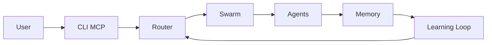
<sub>打分理由：agent swarm/记忆/RAG 工具链（core 8 / wide 7）</sub>

### 11. ⭐ 🧰 NVIDIA/SkillSpector
[GitHub](https://github.com/NVIDIA/SkillSpector) ★16,258 (+160 今日) · Trending daily · infra · Python

**一句话**：用静态+LLM 扫描 agent skills，作者称可发现 26.1% 漏洞
**为什么值得你看**：做 agent 安全和 prompt injection 很值得看

**核心架构**：它解决的场景是：agent skill 默认带执行权限，安装前很难判断里面有没有 prompt injection、数据外泄或 supply-chain 风险。SkillSpector 的关键改变是把“是否安全”拆成两阶段：先做静态规则、AST、taint 和依赖版本分析，再按需用 LLM 补语义判断；同时用 baseline 抑制已知告警，让复扫只突出新风险。作者报告的最直接支持是 2.11.0 版本把 `package-lock.json`/`npm-shrinkwrap.json` 里的精确直接和传递依赖版本纳入漏洞分析，说明它不是只看文本模式，而是在补 supply-chain 的可见性。新在实证层和系统层：它把 skill 安全审计做成可落地的安装前门禁，而不是单点规则集。

- 作者报告 26.1% skills 有漏洞
- baseline 机制能控误报漂移
- LLM 语义层依赖外部模型，离线能力受限
**为什么现在上榜**：v2.11.0（2026-08-28）
**精读价值**：做 agent 生态安全，值得精读
**关联**：[[OpenSSF Scorecard]]、[[CodeQL]]
#agent #security #prompt-injection · 难度：中等 · 建议：建议精读
前置：🔲 [[prompt injection]] · ◽ taint tracking · 🔲 [[MCP]] · ◽ supply chain

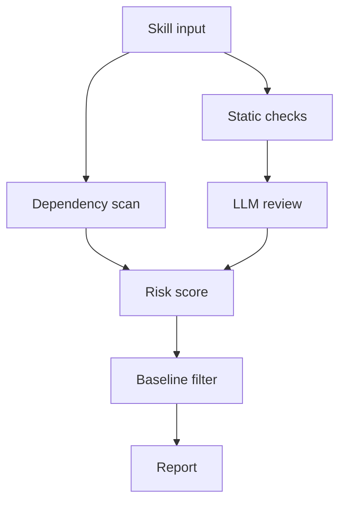
<sub>打分理由：agent 安全扫描，贴合安全面试（core 8 / wide 7）</sub>

### 12. ⭐ 🧰 PrimeIntellect-ai/prime-agent
[GitHub](https://github.com/PrimeIntellect-ai/prime-agent) ★19,939 (+19927 本月) · Trending monthly · skill · TypeScript

**一句话**：用 RLM + Continual Harness 做自改进 agent，作者称支持长期后台任务
**为什么值得你看**：适合看长任务 agent 和 harness 设计

**核心架构**：它面对的悖论是：长任务里最值钱的不是一次回答，而是让 agent 在几小时甚至几天内持续推进；但传统 chat 把上下文当常量，工具调用又常被包成固定流程，任务一长就断。Prime Agent 的关键概念是 RLM：把上下文当变量、把子 agent 当函数调用放进 persistent Python REPL；再用 Continual Harness 存补充 prompt、memory、skill 描述和 subagent 规格，允许 `/refine` 做小步、可回滚的状态更新。最直接的证据是它把 daemon、worker、kernel、heartbeat、schedule、autonomous mode 都写成可重连的运行时边界，而不是只在 README 里讲“持续工作”。新在系统组织层：它把 agent 的持久性、可恢复性和可改进性做进了运行时。

- 长期任务靠 daemon 和 reattach 支撑
- 不证明自改进一定提升任务成功率
- 执行 model-generated code，安全边界弱
**为什么现在上榜**：v0.9.1（2026-09-01）
**精读价值**：看长任务 agent 架构，值得通读
**关联**：[[AutoGPT]]、[[OpenDevin]]
#agent #rl #autonomous · 难度：中等 · 建议：值得通读 (20 min)
前置：🔲 [[planning]] · 🔲 [[memory]] · 🔲 [[multi-agent]] · 🔲 [[ReAct]]

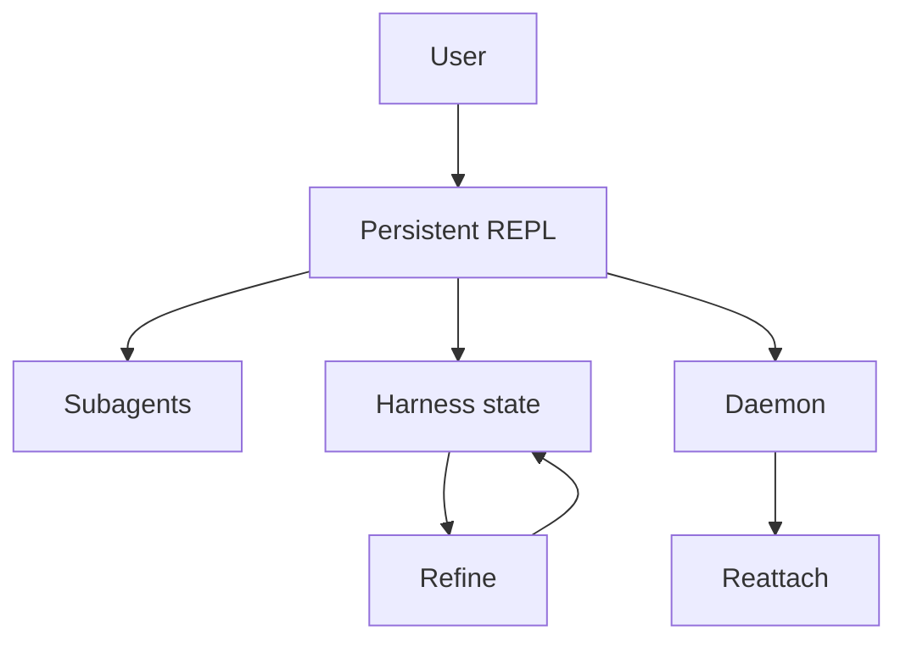
<sub>打分理由：自改善长任务 agent，贴合主方向（core 7 / wide 7）</sub>

### 13. ⭐ 🧰 affaan-m/ECC
[GitHub](https://github.com/affaan-m/ECC) ★249,527 (+1325 今日) · Trending daily · infra · JavaScript

**一句话**：ECC 把 agent 的计划-测试-复盘固化成 68 agents、286 skills、94 commands
**为什么值得你看**：看它怎么把 agent 工程化，适合面试讲 tool-use 与 harness 设计

**核心架构**：反直觉点在于：LLM 会写代码，不代表它会稳定交付；真正失败常发生在上下文漂移、重复犯错和工具权限混乱，而不是单次生成能力不够。ECC 的关键改变是把“提示词里的工作流”升级成“装进 harness 的循环+中间件”：plan/test/implement/review/verify 不是线性流程，而是由 agents、skills、hooks、memory 和 AgentShield 共同阻断失败——规划 agent 防止直接开写，review/verify 阻断带 bug 合并，memory 把一次次修正沉淀成可复用技能，安全扫描拦住 prompt injection、危险 hooks 和秘密泄露。最直接的证据是仓库明确给出 68 agents、286 skills、94 commands，并且 2.2 版把 Claude Code、Codex、Kimi 的 guided install 收敛成“一次检查后整体写入”，再用 Linux/macOS/Windows 的 lifecycle tests 卡住 npm 归档，说明它在做可分发、可约束的工程系统，而不是脚本集合。新东西主要在系统组织层：把 agent 能力做成可安装、可审计、可跨 harness 迁移的运行时。

- 最强证据是多 harness 安装与生命周期测试
- 没证明通用自治提升，只证明工程化约束更强
- 复现门槛中等，依赖特定 harness 与插件体系
**为什么现在上榜**：2026-08-28 发布 v2.2.0，新增 guided installer 与更严格发布链路
**精读价值**：值得看它的 harness 组织方式，不必当成算法论文
**关联**：[[ReAct]]、[[model context protocol]]
#agent #harness #optimization · 难度：中等 · 建议：值得通读 (20 min)
前置：🔲 [[planning]] · 🔲 [[memory]] · 🔲 [[prompt injection]] · 🔲 [[model context protocol]]

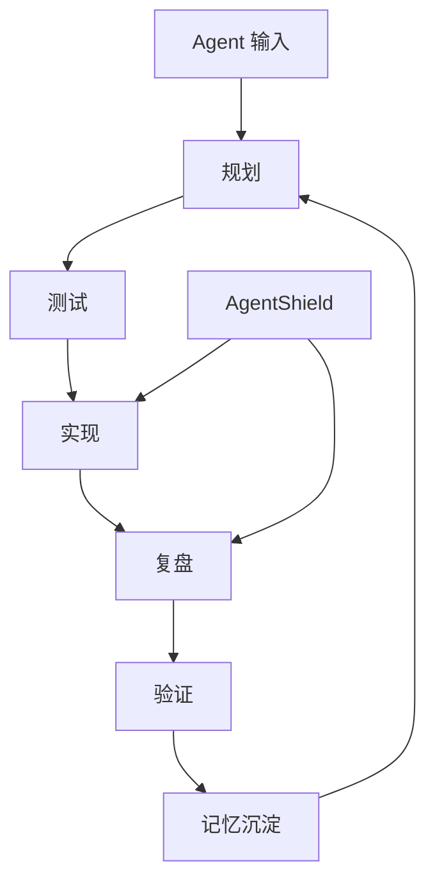
<sub>打分理由：agent harness/安全与记忆优化框架（core 7 / wide 7）</sub>

### 14. ⭐ 🧰 ChromeDevTools/chrome-devtools-mcp
[GitHub](https://github.com/ChromeDevTools/chrome-devtools-mcp) ★51,031 (+1067 本周) · Trending weekly · infra · TypeScript

**一句话**：ChromeDevTools MCP 让 agent 直接操控浏览器，做调试与性能分析
**为什么值得你看**：MCP 工具链热点，面试里好讲 tool-use、browser automation

**核心架构**：这个项目解决的不是“会不会点网页”，而是 agent 在真实浏览器里经常卡在三类失败：看不见页面状态、动作结果不可验证、性能问题没法定位。它的核心做法是把 Chrome DevTools 包成一个 MCP server，让 agent 通过工具直接拿到 trace、console、network、screenshot，再用 puppeteer 做自动等待，阻断“命令发出但页面还没稳定”的失败。最直接的证据是 README 里把性能分析、源码映射后的 console stack traces、网络请求与截图作为主能力，并明确提供 slim/headless 模式；这说明它不是单纯浏览器遥控器，而是把调试与自动化统一进同一套工具协议。新东西主要在系统组织层：用 MCP 把浏览器能力标准化成 agent 可调用的运行时接口；在实证层，仓库持续发版并扩展到 heapsnapshot、PWA automation 等工具，说明这套接口在向更完整的浏览器操作面延伸。

- 强证据是 trace、console、network 一体化
- 没证明复杂网页任务的成功率上限
- 复现难度低，npx 即可接入现有 MCP client
**为什么现在上榜**：2026-08-25 发布 v1.8.0，继续补 browser tooling 与 PWA automation
**精读价值**：值得看，尤其适合补 agent 浏览器工具栈
**关联**：[[puppeteer]]、[[model context protocol]]
#agent #mcp #tool-use · 难度：中等 · 建议：值得通读 (20 min)
前置：🔲 [[model context protocol]] · 🔲 [[planning]] · ◽ tool-use · 🔲 [[KV cache]]

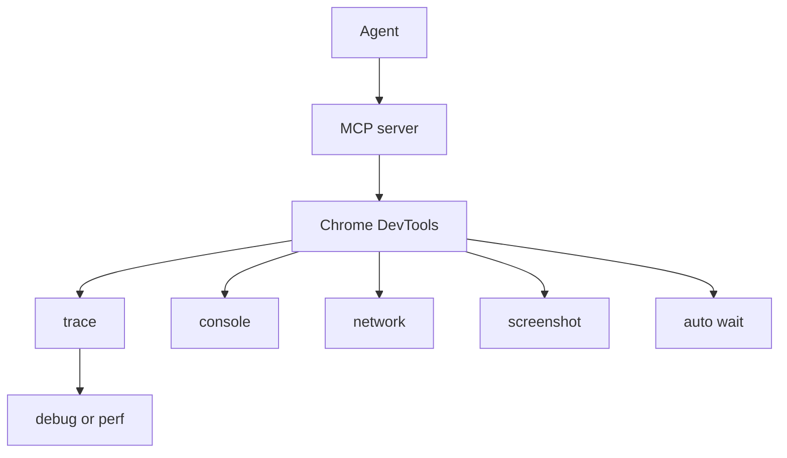
<sub>打分理由：面向coding agent的DevTools/MCP接口（core 7 / wide 7）</sub>

## 🌐 全领域热点

### 15. 🌐 🧰 openclaw/openclaw
[GitHub](https://github.com/openclaw/openclaw) ★388,953 (+164 今日) · Trending daily · tool · TypeScript

**一句话**：OpenClaw 用单个 Gateway 把模型、工具、消息渠道和设备动作连起来
**为什么值得你看**：适合看 agent 平台怎么做统一控制面，偏系统设计面试谈资

**核心架构**：它解决的场景不是单机聊天，而是“同一个助手要跨聊天渠道、设备和团队协作持续做事”，这时最容易崩的是状态分裂、权限混乱和执行环境不可信。OpenClaw 的关键设计是把 Gateway 作为本地控制平面，把 sessions、tools、events、channels 统一收口，再把真正执行动作放到可选的 companion apps / nodes 里；这相当于用“trusted gateway, untrusted execution, deterministic policy”阻断把所有能力堆进一个进程带来的安全和一致性问题。最直接的证据是 README 明确区分 Gateway、Control UI、CLI、channels、platforms，并强调 inbound messages 视为不可信、工具默认跑在 host 上、要先读 sandboxing guide，说明它在安全边界上有明确工程约束。新东西主要在系统组织层：不是单个 agent，而是面向个人/团队的多通道 agent 平台。

- 最强证据是 Gateway 控制面与频道解耦
- 没证明大规模多租户可靠性上限
- 复现需要接受其完整平台栈与安全模型
**为什么现在上榜**：2026-09-03 发布 v2026.9.1，新增聊天图渲染与一键安装路径
**精读价值**：值得看平台架构，不是纯聊天机器人项目
**关联**：[[model context protocol]]、[[ReAct]]
#agent #tool-use #autonomy · 难度：中等 · 建议：值得通读 (20 min)
前置：🔲 [[planning]] · 🔲 [[memory]] · 🔲 [[multi-agent]] · 🔲 [[model context protocol]]

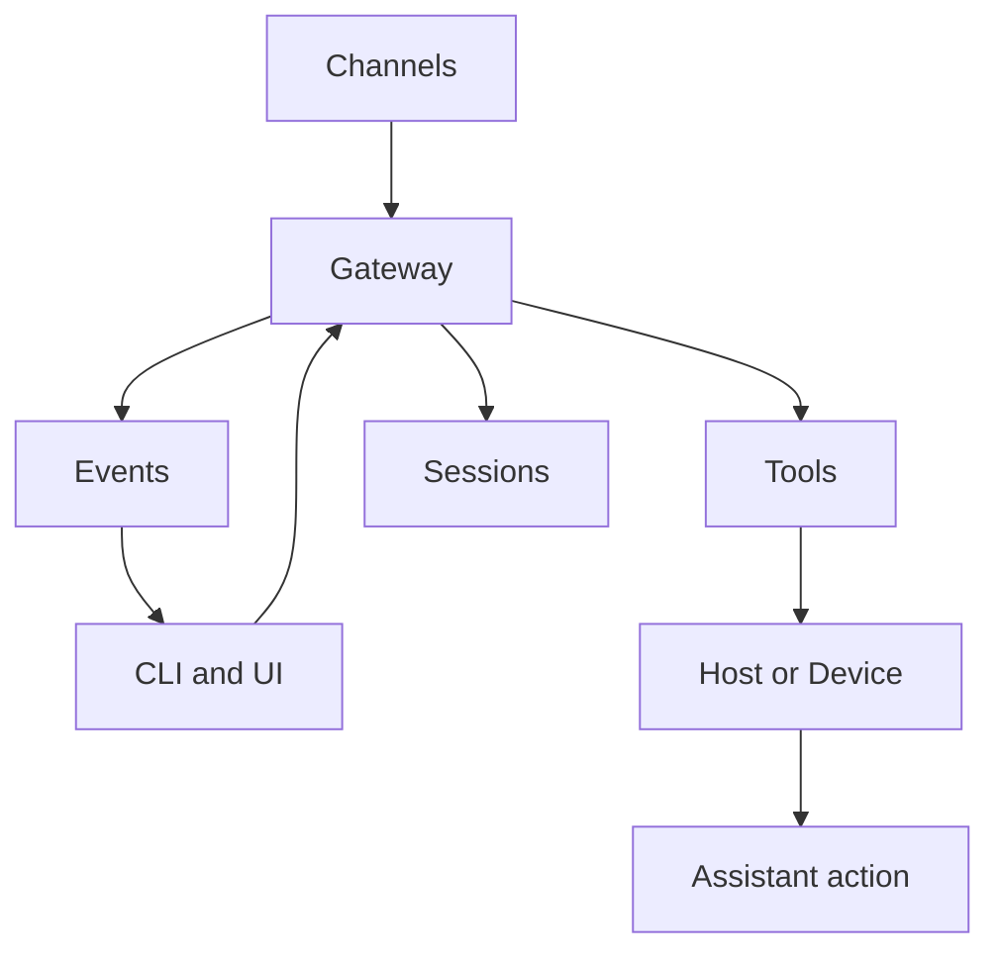
<sub>打分理由：高热度但信息不足，偏“能做事”应用（core 3 / wide 9）</sub>

### 16. 🌐 🧰 Significant-Gravitas/AutoGPT
[GitHub](https://github.com/Significant-Gravitas/AutoGPT) ★187,152 (+42 今日) · Trending daily · tool · Python

**一句话**：用可视化 agent builder + 平台化运行，做通用工作流自动化；已 18.7 万星
**为什么值得你看**：适合看 agent 编排与产品化边界

**核心架构**：它解决的不是“能不能对话”，而是“对话后怎么稳定把事做完”。AutoGPT 早期版本的悖论是：agent 一旦接上工具和长任务，就会卡在权限、失败重试、状态分叉和人工审批上；纯 chat 流程只能生成计划，不能承重执行。这里的关键变化是把 agent 变成平台运行时：AutoPilot 把自然语言转成可运行 agent，Build 允许拖拽/分支/检查步骤，Agents 负责把运行、成本、动作暴露出来，Marketplace 提供可复用 agent 模板。作者在新版里尤其强调连接、失败和审批的归属要落到“实际执行的 engine / server”上，避免把失败和权限语义散在前端。最直接的支持证据是管理平台与 self-host 并行：同一仓库既能托管跑，也能本地 Docker 跑，说明它的新价值不只是 demo，而是把 agent 运行时、集成和运维抽成了产品层。新意主要在系统组织层，不在单个模型技巧。

- 最强证据是平台化 UI 与 self-host 同仓库
- 没证明通用 agent 可靠完工，复杂任务仍依赖人工
- 复现门槛中等，真正难在接模型与集成
**精读价值**：更像 agent 平台样板，适合看架构取舍
**关联**：[[ReAct]]、[[model context protocol]]
#agent #autonomy #orchestration · 难度：中等 · 建议：值得通读 (20 min)
前置：🔲 [[planning]] · 🔲 [[memory]] · 🔲 [[model context protocol]] · 🔲 [[ReAct]]

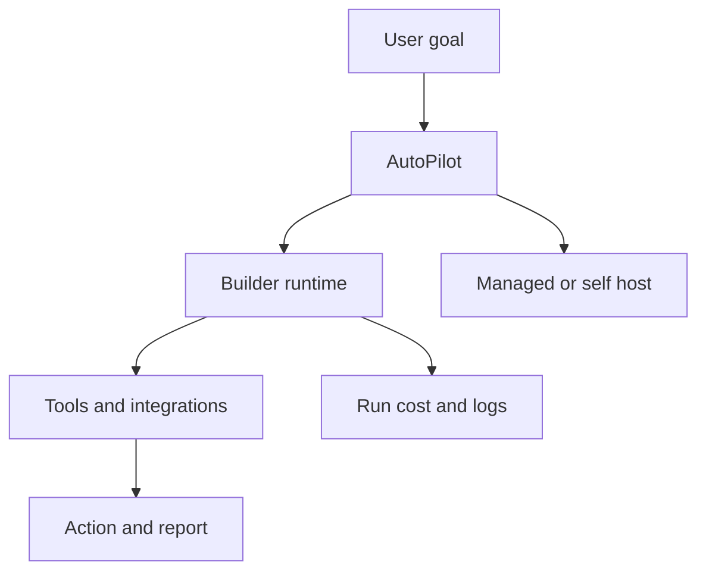
<sub>打分理由：历史性 agent 框架，热度高但新范式不足（core 5 / wide 8）</sub>

### 17. 🌐 🧰 cloudflare/cloudflare-os
[GitHub](https://github.com/cloudflare/cloudflare-os) ★9,676 (+9642 本月) · Trending monthly · infra · TypeScript

**一句话**：用 Workers + sandbox + Gatekeepers 做公司级 AI OS；8 月发布 v2
**为什么值得你看**：适合看企业 agent 安全与隔离设计

**核心架构**：它解决的是企业里最难的反直觉问题：让员工把敏感系统交给 agent 用，同时又不能把权限开到“自动驾驶失控”。传统做法是聊天机器人加一堆 connector，结果权限、审批、审计都散在各处，最后只能靠人工同步卡审批。Cloudflare OS 的关键改变是把“每个文件/应用都变成用户自己的 gadget”，并用 Gatekeepers 给每个外部服务包一层 capability-based 中间件：它既做代理和 OAuth，也把访问范围收窄到单一资源、记录动作，并在有副作用时先模拟执行，让 agent 继续往下跑，之后再批量或逐条审批。这样阻断的失败模式是“审批把任务卡死”和“过宽权限造成泄露”。最直接的证据是作者明确说 v2 是重写，并在 August 2026 release 里仍处于 early access，说明这不是概念稿，而是正在落地的系统；但原文也承认粗糙边缘不少。新意主要在系统组织层和安全机制层。

- 最强机制是先模拟再审批，避免 agent 卡在同步确认
- 原文已承认 early access，成熟度还不是生产定型
- 差异点在安全中间件，不只是聊天界面
**为什么现在上榜**：原文明确：August 2026 release，v2 重写后进入 early access。
**精读价值**：值得看安全编排，尤其是企业 agent 落地
**关联**：[[model context protocol]]、[[ReAct]]
#agent #infra #workers · 难度：硬核 · 建议：建议精读
前置：◽ agent · 🔲 [[planning]] · 🔲 [[memory]] · 🔲 [[model context protocol]]

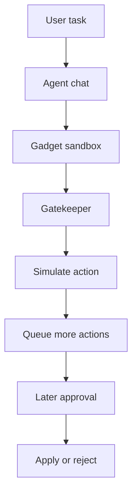
<sub>打分理由：Cloudflare Workers agent工作区，系统性较强（core 6 / wide 7）</sub>

### 18. 🌐 🧰 mvanhorn/last30days-skill
[GitHub](https://github.com/mvanhorn/last30days-skill) ★61,305 (+1276 本周) · Trending weekly · skill · Python

**一句话**：用多源抓取 + 代理打分，生成“最近 30 天真相”简报；3.2.3 周更
**为什么值得你看**：适合看 web research 型 agent skill 的工程拼装

**核心架构**：它解决的是信息不是不会搜，而是“各平台都搜得到，拼起来就失真”。传统搜索会被单一搜索引擎和静态摘要限制：Reddit、X、YouTube、Hacker News、Polymarket 各自代表不同信号，但单独看都会偏。这个 skill 的关键改变是把“搜索”改成并行采集 + 交叉排序 + agent 归纳：先从多个平台拉取内容，再按 upvotes、likes、真钱赔率、转录文本等人类反馈做代理分数，最后由 AI agent judge 合成 grounded summary。它阻断的失败是“只看到单平台回音室”和“只靠语言模型臆测热点”。最直接的支持证据是 README 直接把支持源列成十几种，而且最近 release 连续更新，说明维护重点落在抓取器、cookie 解析和平台适配这种脆弱环节；它没证明的是跨平台分数真的可比，尤其在各平台采样偏差不一致时。新意主要在系统组织层，核心是把社交/内容平台当作检索源而不是文本网页。

- 最强证据是多源并行和 agent judge 的组合
- 没证明不同平台的分数可直接同尺度比较
- 复现难点在各站 cookies、反爬和接口脆弱性
**为什么现在上榜**：最近 release：v3.23.0（2026-09-01），v3.22.0（2026-08-31），v3.21.1（2026-08-18）。
**精读价值**：看它怎么把 web research 做成可跑管道
**关联**：[[retrieval-augmented generation]]、[[ReAct]]
#agent #summarization #web-research · 难度：中等 · 建议：值得通读 (20 min)
前置：🔲 [[retrieval-augmented generation]] · 🔲 [[embedding]] · 🔲 [[reranker]] · 🔲 [[planning]]

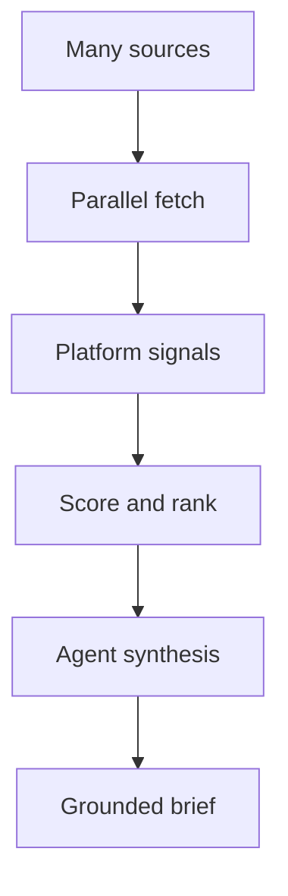
<sub>打分理由：可落地的多源研究型agent skill（core 6 / wide 7）</sub>

---
想精读哪一篇？在 Claude 里说：`精读 2026-09-05 第 N 条`，Jarvis 会按你的 known.md 只讲你不会的部分。