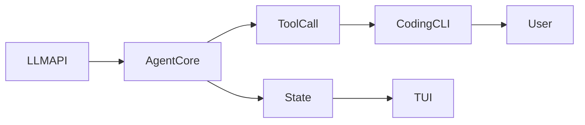
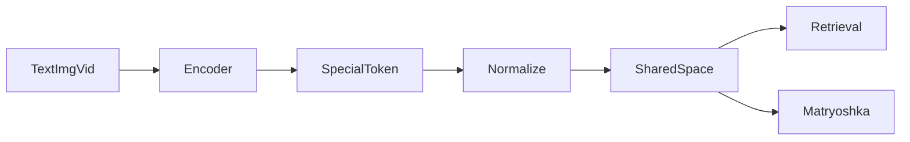
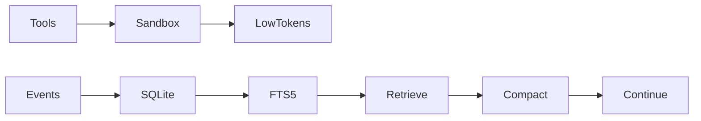
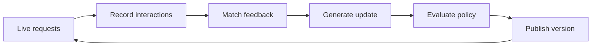
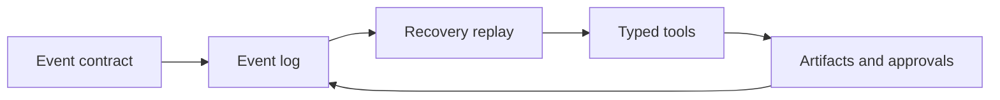
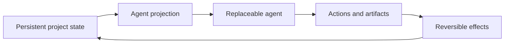
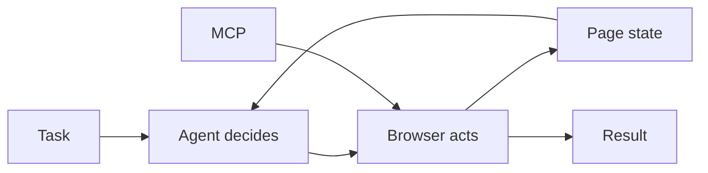
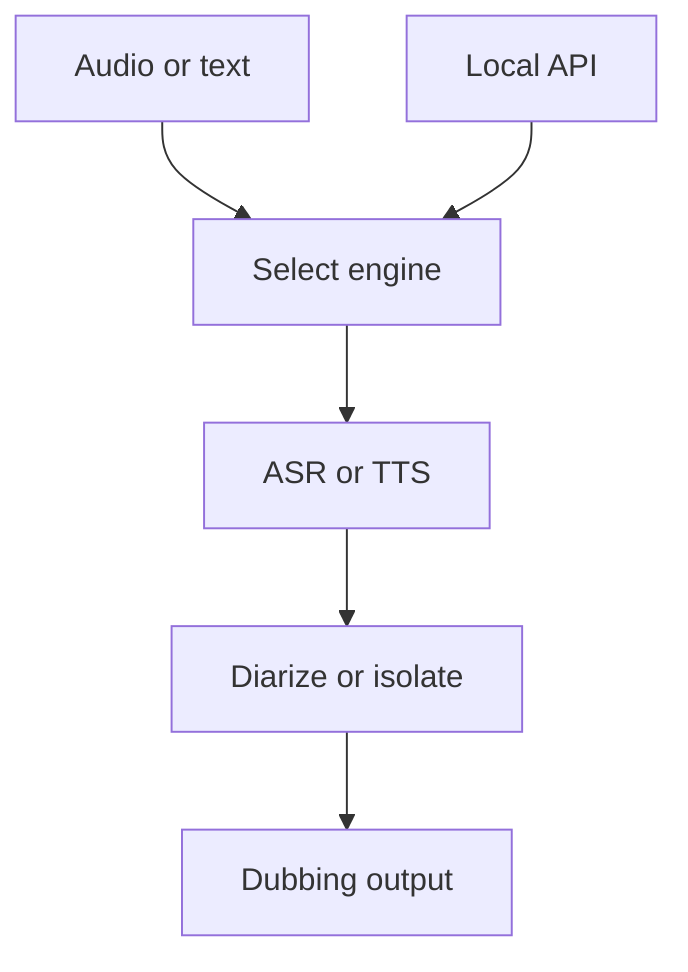
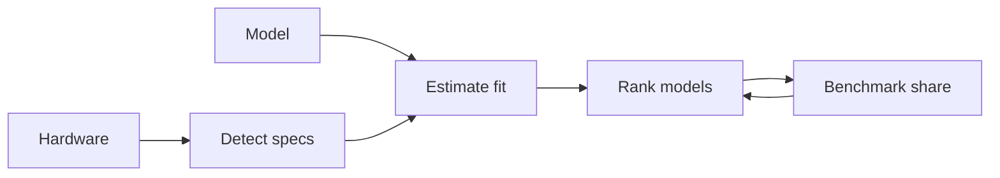
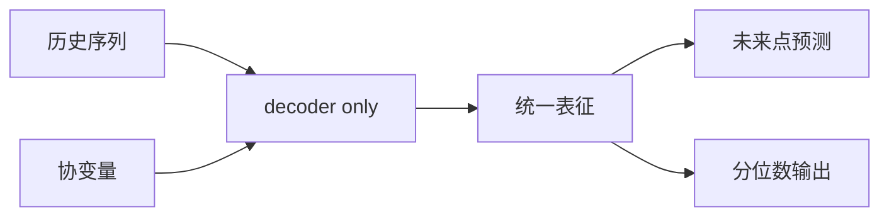

# Jarvis 日报 · 2026-09-06

候选 435 → 过滤后 107 → 入选 10。图例：⭐ 核心方向 · 🌐 全领域热点 · ✅ 已掌握前置 · 🔲 需补前置

## 🧰 项目 · 核心方向

### 1. ⭐ 🧰 earendil-works/pi
[GitHub](https://github.com/earendil-works/pi) ★102,358 (+18400 本月) · Trending monthly · tool · TypeScript

**一句话**：用统一 LLM API+agent loop+CLI 做编码代理，作者称已支持 GPT-6 Astra
**为什么值得你看**：适合看 agent runtime 和工具调用架构

**核心架构**：它瞄准的悖论很具体：编码 agent 要接多家模型、跑工具、存状态，但一旦把这些都塞进单体脚本，provider 差异、状态机和 TUI 会互相缠住。Pi 的关键改变是把系统拆成三层：`pi-ai` 统一多 provider 调用，`pi-agent-core` 负责 tool calling 和 state management，`pi-coding-agent` 只做交互层；这样每一层都阻断一种失败——模型接入碎片化、agent loop 状态散乱、前端和运行时耦合。最直接的支持证据不是某个榜单，而是仓库把 coding agent、runtime、API、TUI 明确分包，并给出 `./test.sh`、`npm run check`、release source/binary 构建和 supply-chain hardening，说明它已经按可发布系统组织而不是 demo。新意主要在系统组织层，不是新算法；另外它公开强调没有内置权限隔离，反而把 sandbox 交给外部容器，这也说明边界划分是设计的一部分。

- 强证据：分包到 runtime/API/TUI，已可独立发布
- 没证明：agent 效果本身，原文未给任务指标
- 复现不难，但要补 provider key 和 sandbox
**精读价值**：看它的工程分层，比看单个功能更有价值
**关联**：[[Claude Code]]、[[OpenHands]]
#agent #mcp #tool-use · 难度：中等 · 建议：值得通读 (20 min)
前置：🔲 [[ReAct]] · 🔲 [[planning]] · 🔲 [[memory]] · 🔲 [[model context protocol]]

打分理由：热门agent工具链，易用于LLM/RAG系统集成（core 8 / wide 8）

### 2. ⭐ 🧰 Tencent/WeMM-Embedding
[GitHub](https://github.com/Tencent/WeMM-Embedding) ★1,325 · model · Python

**一句话**：用统一多模态 embedding 做检索，2B 在 MMEB-v2 平均 77.9
**为什么值得你看**：适合看多模态检索和 embedding 设计

**核心架构**：它解决的是检索系统里常见的怪问题：同一套召回要同时吃文本、图像、视频和视觉文档，但传统单模态 embedding 一碰到跨模态就得拆模型，维护和召回空间都碎。WeMM 的关键概念是“统一多模态 embedding”：把不同模态映射到同一向量空间，再用最后层 hidden state 的专用 token 位置取向量并做 L2 normalize；`Matryoshka` 维度则让同一个向量前缀可直接裁剪成不同长度，阻断“高维好但线上太贵”的失败。最直接的证据是 MMEB-v2 和 v3 上的系统表：2B/4B/9B 都压过 Qwen3-VL-Embedding、VLM2Vec、GME 等基线，且官方明确写出 2B 在 256 维仍保留 98.7% full-dim 图片和视频性能，这比单纯报最大分数更能证明它的压缩设计有效。新意在组件层和实证层：一是统一表征头，二是把可裁剪维度当成产品约束一起设计。

- 强证据：MMEB-v2/v3 多模态检索表均领先
- 没证明：音频不支持，原文明确未覆盖
- 复现门槛中等，需按指定 transformers 版本和预处理
**精读价值**：值得精读，主要看统一表征和 Matryoshka 怎么落地
**关联**：[[VLM2Vec]]、[[GME]]
#embedding #retrieval #multimodal · 难度：中等 · 建议：值得通读 (20 min)
前置：🔲 [[retrieval-augmented generation]] · 🔲 [[embedding]] · 🔲 [[reranker]] · 🔲 [[VLM]]

打分理由：腾讯多模态通用embedding，适合RAG与检索（core 8 / wide 7）

### 3. ⭐ 🧰 mksglu/context-mode
[GitHub](https://github.com/mksglu/context-mode) ★20,478 (+88 今日) · Trending daily · infra · TypeScript

**一句话**：用 MCP+hooks 截断工具回显，作者称上下文占用降 98%
**为什么值得你看**：适合看 coding agent 的上下文管理

**核心架构**：它针对的是编码 agent 的老毛病：工具越多，raw output 越把 context window 吃满，等到 compaction 时又把正在编辑的文件、任务状态和用户决定一起冲掉。Context Mode 的关键改变不是再做一个 agent，而是把“数据去哪儿”这件事前置到 MCP 路由层：工具输出先进 sandbox，不直接进对话；会话事件落 SQLite，再进 FTS5 索引，压缩后只按相关性取回；`ctx_execute` 让模型改写成“写脚本算结果”，从根上减少多轮读文件。最直接的证据是仓库自己给出的前后对比：315 KB 变 5.4 KB、98% reduction，以及在 release 里把本地 `ctx stats` 和 Insight 平台的 savings/cost 归因对齐，说明它不仅是概念而是在修报表和路由。新意主要在系统组织层：MCP + hooks + 持久索引 + sandbox 组成循环中的中间件，不是线性流水线。

- 强证据：98% context reduction，且有 release 持续修正
- 没证明：主要是工程收益，未见通用 agent 指标
- 复现需对应平台 hooks；Claude Code 最完整
**为什么现在上榜**：v1.0.169（2026-06-29）
**精读价值**：值得看架构，尤其是上下文路由和持久记忆
**关联**：[[ReAct]]、[[OpenHands]]
#agent #context #mcp · 难度：中等 · 建议：值得通读 (20 min)
前置：🔲 [[model context protocol]] · 🔲 [[memory]] · 🔲 [[planning]] · 🔲 [[prompt injection]]

打分理由：上下文优化+会话路由，贴近agent/RAG工程（core 7 / wide 7）

### 4. ⭐ 🧰 Human-Agent-Society/reef
[GitHub](https://github.com/Human-Agent-Society/reef) ★569 · infra · Python

**一句话**：用 Reef 把 agent 交互闭环成可持续学习，作者报告 v0.0.2。
**为什么值得你看**：适合看 agent 训练闭环和 harness 演化

**核心架构**：最反直觉的是：agent 不是先训练完再上线，而是边用边学；但普通 RL 框架只管训练，不管线上请求、反馈归因、版本发布，所以交互、更新、交付会断在不同系统里。Reef 的关键改变是把“Serve→Observe→Grow→Commit”做成一条可追踪的学习回路：service/runtime 负责记录请求与 artifact，records/processors 把反馈匹配回具体 interaction，recipe/train 生成候选更新，evaluation/artifact/surface 再按策略验收并发布，阻断的是“学到了却无法安全上线”这类失败。最直接的证据是它把 live traffic、weights training、version management、stays live through updates、skills/harness evolution 放进同一栈，并用 SAO 示例把一次 score/report 真的接到训练步。新意主要在系统组织层：不是新 RL 算法，而是把 continual learning 变成 agent infra。

- 最强证据是四段式学习回路已跑通
- 没证明通用收敛，依赖可用反馈和 recipe
- 复现门槛高：GPU 栈、SGLang/Slime、反馈设计
**精读价值**：想做 self-improving agent，值得精读
**关联**：[[RLHF]]、[[DPO]]
#agent #continual-learning #inference · 难度：硬核 · 建议：建议精读
前置：◽ reinforcement learning · 🔲 [[reward model]] · 🔲 [[test-time compute]] · 🔲 [[model context protocol]]

打分理由：连续学习/自改进agent基础设施，核心相关（core 7 / wide 4）

### 5. ⭐ 🧰 useagenthq/useagent
[GitHub](https://github.com/useagenthq/useagent) ★283 · tool · TypeScript

**一句话**：用统一事件契约把多模型 agent 变成可恢复的云同事，作者报告 v0.0.3。
**为什么值得你看**：适合看 agent 系统和生产化架构

**核心架构**：最麻烦的场景不是 agent 不会干活，而是它跑到一半挂了、换了 engine、或权限链路断了，结果线程、artifact、记忆全散。useAgent 的关键设计是把 engine 视为 plug：Claude Code、Codex、OpenCode 只要说同一 canonical event contract，就能挂到同一 session 语法上；再把每次 run 记成 Postgres 里的 event log，靠重放和恢复保证重启后继续，而不是失败退出；敏感能力不进 sandbox，统一经 trusted gateway 以 typed tools 访问，阻断的是 credential 外泄和不可审计调用。最直接的支持证据是 release 里明确给出 canonical event/session contract、restart-safe recovery、bounded transcripts、revision-bound artifact attestation。新意在系统组织层和运行时机制层：不是做一个聊天 UI，而是把 agent coworker 做成可恢复、可审计的执行底座。

- 最强证据是稳定多-harness release
- 原文未明确完整故障注入测试
- 复现难度中高：Postgres、sandbox、provider 适配
**为什么现在上榜**：v0.0.3，2026-08-31
**精读价值**：做 agent 平台的人值得看
**关联**：[[DeepSeek Harness]]、[[AutoGen]]
#agent #workflow #tool-use · 难度：中等 · 建议：值得通读 (20 min)
前置：🔲 [[multi-agent]] · 🔲 [[memory]] · 🔲 [[planning]] · 🔲 [[model context protocol]]

打分理由：团队级agent工作流，工程落地强（core 7 / wide 6）

### 6. ⭐ 🧰 acryldev/acryl
[GitHub](https://github.com/acryldev/acryl) ★237 · infra · TypeScript

**一句话**：用持久项目上下文接住可替换 coding agents，作者报告 v0.1.31。
**为什么值得你看**：适合看 coding agent 的 continuity 层

**核心架构**：最容易崩的不是模型能力，而是换 agent 后上下文丢失、工作区漂移、历史操作不可逆。ACRYL 把“project context persistent，agent sessions disposable”定成核心约束：canonical state 作为唯一真源，agent-specific context 只是 projection；能力通过 Cordis 这类可热插拔 runtime 管理，做到插件可替换、作用可回滚、事件可拦截，阻断的是单个 agent 绑定导致的上下文碎裂和不可恢复副作用。README 直接给出 Desktop/TUI/CLI 三个 surface、统一 project model、版本化能力与审计/可测试性原则，这是比“有个壳”更强的架构信号。新意主要在系统组织层：把 agent continuity 做成独立于任意编码模型的工作台。

- 最强证据是多 surface 共享同一 project model
- 没看到完整自动化测试披露
- 复现难度中：TypeScript 体系+本地桌面组件
**为什么现在上榜**：v0.1.31，2026-09-02
**精读价值**：想看 coding agent 工作台架构，值得翻
**关联**：[[DeepSeek Harness]]、[[useAgent]]
#agent #context #mcp · 难度：中等 · 建议：值得通读 (20 min)
前置：🔲 [[planning]] · 🔲 [[memory]] · 🔲 [[model context protocol]] · ◽ knowledge base

打分理由：Agent context relay/工作空间，偏系统基础（core 7 / wide 5）

## 🌐 全领域热点

### 7. 🌐 🧰 browser-use/browser-use
[GitHub](https://github.com/browser-use/browser-use) ★112,644 (+191 今日) · Trending daily · tool · Python

**一句话**：用浏览器工具层让 agent 直接点网页，87.4% 排名第一
**为什么值得你看**：Agent/RAG 面试常问网页工具调用

**核心架构**：它解决的是一个反直觉问题：LLM 会写步骤，但一到真实网页就卡在登录、弹窗、动态 DOM 和多页跳转上，单纯 prompt 不能把“会说”变成“会操作”。Browser Use 的关键改变是把浏览器当成可循环调用的工具环境：Agent 负责决定下一步，浏览器中间件把页面状态、元素可操作性和失败信号回灌给模型，阻断“只看文本、不知道自己点到了什么”的失配；MCP/CLI 则把同一套浏览器能力暴露给外部 agent 或脚本，阻断工具接入碎片化。最直接的证据是它公开的 100 个真实网页任务基准和 Odysseys 87.4% leaderboard 成绩，说明这套闭环在长程 web task 上不是只会 demo。新意主要在系统组织层：不是发明新模型，而是把浏览器交互、模型适配和工具协议整合成可复用执行栈。

- 87.4% 是公开 leaderboard 成绩，非自报单点 demo
- 真实难点在网页状态回传，不在点击 API 本身
- 复现主要受页面变化、账号环境和反爬影响
**精读价值**：值得看架构，能补 agent 工具层认知
**关联**：[[ReAct]]、[[model context protocol]]
#agent #browser #tooluse · 难度：中等 · 建议：值得通读 (20 min)
前置：🔲 [[ReAct]] · 🔲 [[planning]] · 🔲 [[model context protocol]] · ◽ browser automation

打分理由：面向AI agent的网页自动化，贴近可用方向（core 6 / wide 8）

### 8. 🌐 🧰 debpalash/VoiceStudio
[GitHub](https://github.com/debpalash/VoiceStudio) ★19,666 (+6761 本周) · Trending weekly · tool · Python

**一句话**：用本地多引擎 TTS/ASR 做全流程配音，覆盖 646 语言
**为什么值得你看**：多模态/语音工程和本地部署都相关

**核心架构**：它解决的是创作链条被切成多段的问题：克隆声音、转写、翻译、分角色、合成、导出通常要在多个工具间来回搬文件。VoiceStudio 的核心不是单个模型，而是把 TTS、ASR、speaker diarization、vocal isolation 和 dubbing 编排成一个本地工作台，检测到不同工作流就走不同引擎，处理动作都落到本机存储、桌面 UI、REST/SSE/WebSocket、OpenAI-compatible audio API 和 MCP Server 这些统一接口上，阻断“模型能跑但流程接不起来”的失败。最直接的成熟度信号是它把 release、跨平台安装、诊断、自检、Docker、云/本地路径都写全了，并明确警告 active beta，说明能用但还在快速修 bug。相对同类，它的差异不在单点 TTS 品质，而在把 voice cloning、dubbing、dictation 和 audiobook 做成可切换的本地流水线。

- 作者报告 16 TTS、11 ASR、646 语言
- 有 release、自检、Docker，成熟度高于纯 demo
- 质量取决于所选 engine，不是统一端到端模型
**为什么现在上榜**：recent release v0.5.1（2026-08-28）
**精读价值**：看项目组织价值更大，适合评估本地语音栈
**关联**：[[Whisper]]、[[Demucs]]
#speech #tts #voice-cloning · 难度：中等 · 建议：值得通读 (20 min)
前置：🔲 [[VLM]] · 🔲 [[diffusion model]] · ◽ speaker diarization · ◽ ASR

打分理由：本地语音/克隆工具，音频方向有用（core 3 / wide 7）

### 9. 🌐 🧰 AlexsJones/llmfit
[GitHub](https://github.com/AlexsJones/llmfit) ★34,962 (+3882 本月) · Trending monthly · tool · Rust

**一句话**：用硬件探测和量化估算，帮你一键找出能跑的模型
**为什么值得你看**：推理部署和面试里很实用

**核心架构**：它解决的是一个很常见但容易被误判的场景：模型卡上写着参数量和上下文长度，但你真正能不能在这台机器上顺跑，还取决于 CPU、RAM、VRAM、统一内存、量化格式和后端。llmfit 的关键概念是把“能否运行”拆成硬件探测 + 模型兼容性打分：先识别设备，再根据参数规模、context、GGUF/AWQ/GPTQ/EXL2 等格式估算内存占用和 tokens-per-second，最后把质量、速度、fit、context 排序；benchmark&share 机制再把本机实测 tok/s 回填成“verified”数值，阻断纯估算漂移。最直接的支持来自它的 benchmark 设计：每台机器都能先本地保存结果，再提交 PR 进入下一版，说明它的新意主要在实证层，而不是新的推理内核。

- 把估算和实测分开，避免纸面可跑但实际掉速
- 对多 GPU、统一内存、不同量化格式都有显式路径
- 复现难点主要在硬件差异，算法本身较轻
**为什么现在上榜**：recent release v1.1.14（2026-09-03）
**精读价值**：适合快速判断推理部署栈，不必精读代码细节
**关联**：[[llama.cpp]]、[[vLLM]]
#inference #routing #quant · 难度：入门 · 建议：值得通读 (20 min)
前置：🔲 [[quantization]] · 🔲 [[KV cache]] · 🔲 [[speculative decoding]] · 🔲 [[MoE]]

打分理由：强推理/模型兼容工具，但核心研究关联一般（core 3 / wide 7）

### 10. 🌐 🧰 google-research/timesfm
[GitHub](https://github.com/google-research/timesfm) ★31,553 (+2968 本周) · Trending weekly · model · Python

**一句话**：TimesFM 3.0 用 decoder-only 模型做时间序列预测，支持多变量与协变量，开源权重已更新
**为什么值得你看**：做 LLM/RAG 之外的 foundation model 选题，面试也好讲

**核心架构**：这类项目的反直觉点是：时间序列不是固定长度分类，而是不同频率、不同跨度、还常带外生变量的连续预测；传统 per-dataset 模型一换场景就要重训或改特征。TimesFM 的关键变化是把 forecasting 直接建模成 decoder-only next-token prediction：输入历史片段和 covariates，输出未来值分布，把“每个任务单独设计特征工程”阻断成“统一的预训练表示 + 推理时条件化”。TimesFM 3.0 进一步把 native multivariate forecasting、past-only / past-and-future covariate support 放进同一个接口，解决的是多通道与动态协变量不能靠后处理拼接的问题。最直接的证据是作者报告 3.0 在 fev-bench、TIME Benchmark、GIFT-Eval 都是 foundation model 第一，并且 2.5 后补了 16k context、quantile head、LoRA 微调示例和 unit tests，说明它不只是论文原型而是持续工程化。新东西主要在系统组织层：从“单变量零样本预测器”推进到“可带协变量的通用 forecasting foundation model”。

- 作者报告三大基准第一，支持多变量与协变量
- 不商用默认 3.0 权重；生产可用性受限
- 复现门槛中等，需看 checkpoint 与评测协议
**为什么现在上榜**：原文明确：v3.0.0 2026-08-28 发布，新增 TimesFM 3.0 权重
**精读价值**：如果你关心 foundation model 落地，值得通读
**关联**：[[PatchTST]]、[[Chronos]]
#time-series #forecasting #foundation · 难度：中等 · 建议：值得通读 (20 min)
前置：🔲 [[pretraining]] · 🔲 [[next-token prediction]] · 🔲 [[long context]] · 🔲 [[quantization]]

打分理由：时间序列FM，虽不在核心但质量高（core 2 / wide 7）

---
想精读哪一篇？在 Claude 里说：`精读 2026-09-06 第 N 条`，Jarvis 会按你的 known.md 只讲你不会的部分。