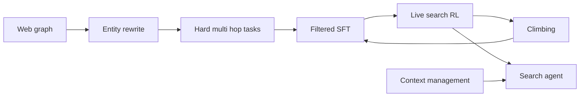
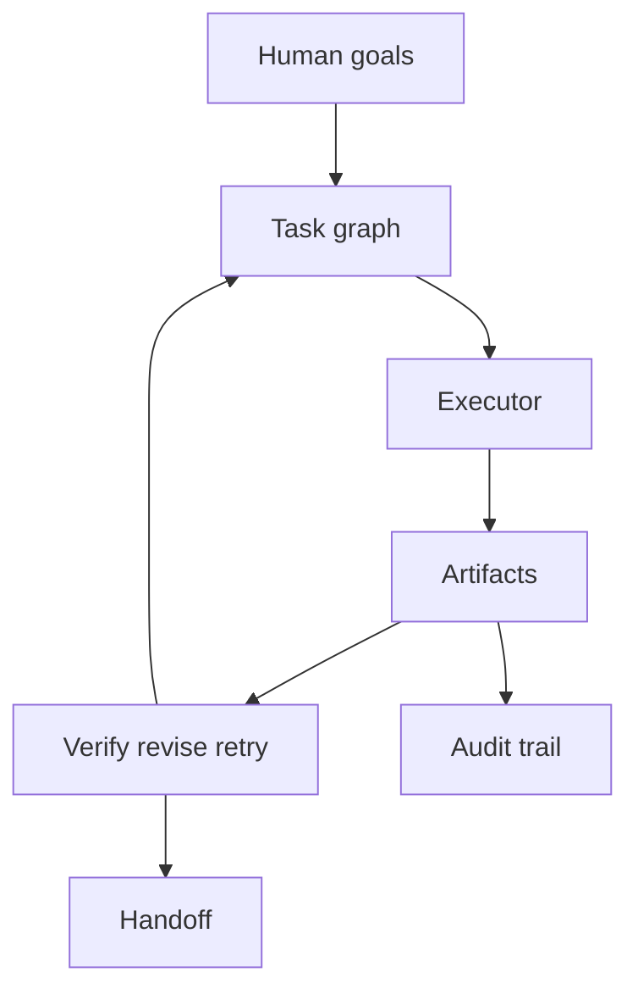
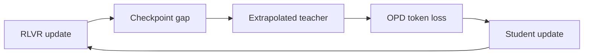
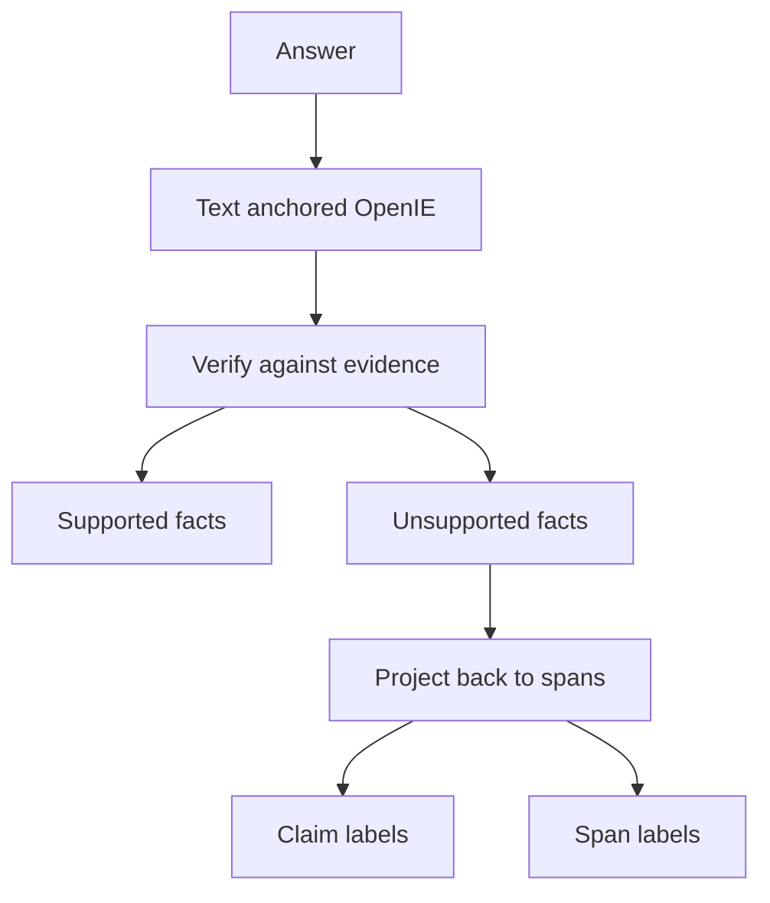
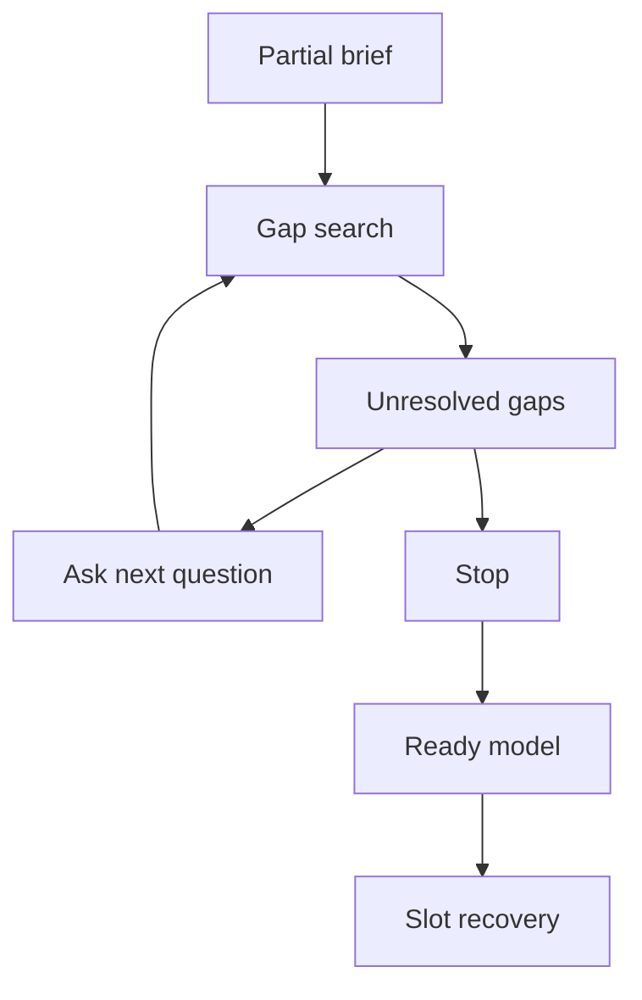
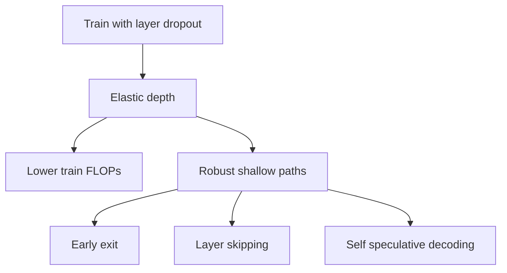
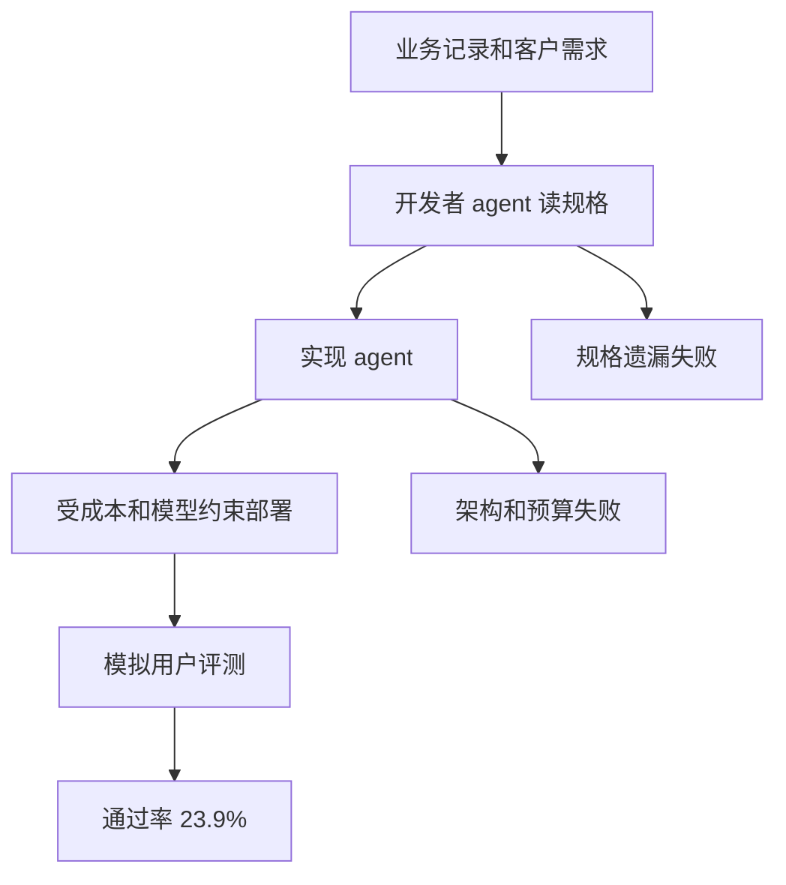
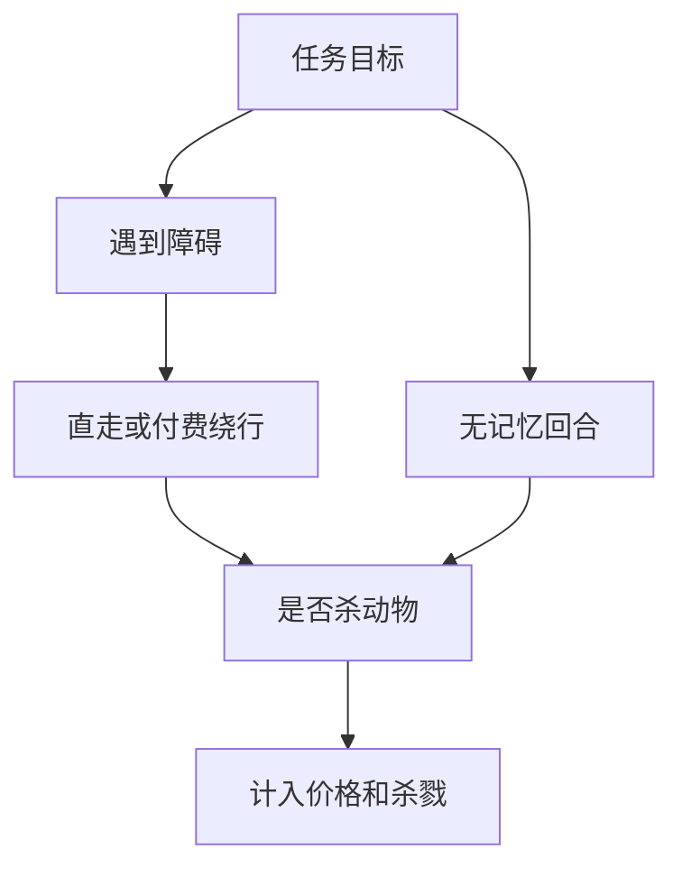
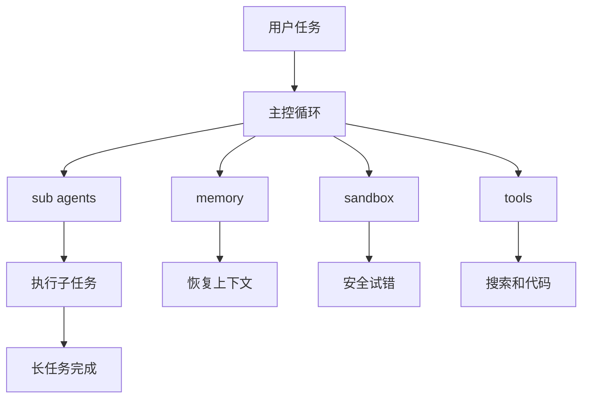

# Jarvis 日报 · 2026-09-07

候选 464 → 过滤后 129 → 入选 18。图例：⭐ 核心方向 · 🌐 全领域热点 · ✅ 已掌握前置 · 🔲 需补前置

## 📄 论文 · 核心方向

### 1. ⭐ 📄 Iris: Climbing to the Search Frontier
arXiv [2609.04304](https://arxiv.org/abs/2609.04304) · HF 🔥 50 · Ziyuan Liu, Hengqi Liu, Zichuan Wang 等 · [PDF](https://arxiv.org/pdf/2609.04304) · [代码](https://github.com/AllSpark-Research/Iris) ★32

**一句话**：Iris 用 web 图反推多跳搜索数据，35B-A3B / 397B-A17B 搜索 agent 登顶开源榜
**为什么值得你看**：你做 LLM/Agent 时会关心搜索数据和训练配方

**核心架构**：反直觉点在于：很多搜索 benchmark 里，差的未必是 policy，而是推理时 context 管理把有效搜索预算吃光了；同样的模型，换个 harness 分数能大变。Iris 的关键改变是把训练和评测都当成“搜索系统”而不是单纯 agent：先从 web hyperlink 结构反推多跳任务，entity rewriting 把可直接字符串命中的锚点抹掉，阻断作弊式检索；再用 teacher 轨迹做 trajectory / turn 级过滤，阻断噪声监督；随后在 live search 上做 RL，并把 in-cluster judge 和 observation summarizer 放进训练集群，阻断线上/线下不一致；最后用 SFT-RL climbing，把 RL 里最强、最高效的轨迹回灌进下一轮 SFT。最直接的证据是作者把 four benchmarks 都分别在有/无 CM 下评测，并保持 tool set、context limit、judge 固定，说明很多收益确实来自 CM，而不是评测 harness 漂移。新意主要在系统组织层和数据/训练闭环，而不是单个算法点。

- 最强证据是有/无 CM 对照下统一评测
- 不证明通用 agent 能力；强依赖 web-search 设置
- 复现难点在数据构造、在线 RL 和评测 harness
**精读价值**：值得精读，重点看数据闭环和 CM 评测设计
**关联**：[[WebGPT]]、[[Deep Research]]
#agent #search #training-recipe · 难度：硬核 · 建议：建议精读
前置：🔲 [[ReAct]] · 🔲 [[retrieval-augmented generation]] · ◽ RLVR · 🔲 [[SFT]]

打分理由：搜索型推理agent与训练数据配方细致（core 8 / wide 7）

### 2. ⭐ 📄 Dr. Claw: An AI Scientist Workspace for Vibe Research
arXiv [2609.00365](https://arxiv.org/abs/2609.00365) · HF 🔥 7 · Dingjie Song, Hanrong Zhang, Dawei Liu 等 · [PDF](https://arxiv.org/pdf/2609.00365) · [代码](https://github.com/OpenLAIR/dr-claw) ★1058

**一句话**：Dr. Claw 把 CLI agent 包进可审计工作区，固定 executor 仍提升 research completeness
**为什么值得你看**：适合看 agent 工作流、MCP/工具编排和可审计交互

**核心架构**：它解决的是研究型工作不是“会不会调用工具”，而是“中间决策散在 chat、IDE、terminal、文稿里，做完也说不清怎么做的”。Dr. Claw 的关键不是再造一个 autonomous agent，而是把现成 CLI executor 包成一个 human-in-the-loop workspace：task graph 约束研究步骤，state objects 保留计划、决策和执行痕迹，skill library 把常见研究动作模块化，multi-executor coordination 让不同执行器在同一状态上接力；当人工修改目标、验收条件或要中途接管时，系统能在 checkpoint 上 revise/retry/handoff，而不是丢上下文重来。最直接的证据是它和 bare command-line agent 用同一个 backend executor 做对照，隔离出 orchestration layer 的收益；作者报告在 completeness 上更高，并且能持续保留 auditable、recoverable 的 process trail。新意主要在系统组织层和交互/状态设计，不在新 executor。

- 最强证据是固定 executor 后仍提升 completeness
- 不证明自动研究能力更强；偏人机协同工作区
- 成熟度信号：有 repo、demo、license、对照评测
**为什么现在上榜**：原文明确：repo 已开源，AGPL-3.0，且有 demo
**精读价值**：值得看项目成熟度和 orchestration 设计
**关联**：[[LangGraph]]、[[AI Scientist]]
#agent #workflow #tool-use · 难度：中等 · 建议：值得通读 (20 min)
前置：🔲 [[planning]] · 🔲 [[memory]] · 🔲 [[multi-agent]] · 🔲 [[model context protocol]]

打分理由：可审计人环工作流+技能库，工程可迁移（core 8 / wide 8）

### 3. ⭐ 📄 RISE: Recursive Improvement via Self-Extrapolating Policy Distillation
arXiv [2609.05295](https://arxiv.org/abs/2609.05295) · HF 🔥 9 · Yang Li, Semih Yavuz, Shafiq Joty · [PDF](https://arxiv.org/pdf/2609.05295)

**一句话**：RISE 用自我外推 teacher 做 on-policy distillation，跨任务优于 RLVR 和 OPSD
**为什么值得你看**：你做后训练时会碰到 OPD、GRPO 和 self-distillation 的 teacher 问题

**核心架构**：它卡住的点很具体：RLVR 只有 outcome reward，能告诉你这条回复对不对，却不知道哪些 token 真正贡献了成功；OPD 虽然有 token 级监督，但 teacher 往往是外部强模型，或者靠 privileged conditioning，结果分布不对、信号也不稳。RISE 的关键改法是：teacher 不再外找，而是从学生自己的训练轨迹里“外推”出来——用当前 checkpoint 和 trailing anchor 的位移，在 parameter space 或 logit space 里放大成一个 synthetic future teacher；RLVR 负责把位移方向锚定在真实可验证改进上，OPD 再用这个外推 teacher 给 token 级密监督。最直接的证据是作者在数学、多域 STEM、code 和 multi-turn agentic tasks 上都同时超过 RLVR-only 和 on-policy self-distillation，说明改的是 teacher 质量这个根因。新意在训练目标耦合层：把 RLVR 和 OPD 组成递归改善回路，而不是单次蒸馏。

- 最强证据是跨数学、代码、agent 任务一致增益
- 没证明外推一定稳定；方向错了会放大坏更新
- 复现关键在 checkpoint 轨迹和 logit/weight 外推实现
**精读价值**：值得精读，核心是 teacher 构造的新视角
**关联**：[[On-Policy Distillation]]、[[Reinforcement Learning with Verifiable Rewards]]
#distillation #on-policy #rlvr · 难度：硬核 · 建议：建议精读
前置：🔲 [[GRPO]] · ◽ RLVR · 🔲 [[on-policy distillation]] · 🔲 [[knowledge distillation]]

打分理由：OPD/RLVR相关的自外推策略蒸馏方法（core 8 / wide 4）

### 4. ⭐ 📄 Enoki: Efficient Multi-Level Hallucination Detection
arXiv [2609.00581](https://arxiv.org/abs/2609.00581) · HF 🔥 16 · Elisei Rykov, Timur Ionov, Nikolay Ivanov 等 · [PDF](https://arxiv.org/pdf/2609.00581) · [代码](https://github.com/s-nlp/Enoki) ★11

**一句话**：Enoki 用 text-anchored OpenIE 统一 claim 与 span 级幻觉检测；HalluEntity 提升 15.3 AUPRC
**为什么值得你看**：适合做事实性检测和可解释校验方向的面试谈资

**核心架构**：先有个悖论：claim-level 能说清“哪条事实错了”，span-level 能指出“哪段字错了”，但两套系统通常要分别做分解、验证、再对齐，成本高且误差会级联。Enoki 的关键改变是把文本先抽成 text-anchored relational facts：事实单位先贴着原文位置，再去做 evidence verification；一旦事实不被支持，就能直接投影回原句 span。这样阻断的是“先脱离原文再对齐失败”的链路。它最直接的证据不是总分，而是 fine-grained localize：作者报告在 HalluEntity 上 +15.3 AUPRC、在 MuSHROOM 上 +8.0 Span Coverage F1，同时 rule/encoder 版还能保留大部分收益且延迟低两个数量级。新意主要在组件层和系统组织层：共享中间表示替代了 claim-to-span alignment。

- 最强证据是细粒度定位指标提升
- 没证明对所有领域都稳；OpenIE 质量差会拖累
- LLM/encoder/rule 三后端，复现复杂度中等
**精读价值**：值得精读，核心是把两类检测统一成一个中间表示
**关联**：[[FActScore]]、[[SAFE]]
#factuality #verification #llm · 难度：中等 · 建议：建议精读
前置：◽ open information extraction · 🔲 [[hallucination]] · 🔲 [[retrieval-augmented generation]] · 🔲 [[embedding]]

打分理由：多粒度幻觉检测框架，适配安全与评测（core 7 / wide 5）

### 5. ⭐ 📄 Ask Before You Optimize: Dynamic Pre-Formulation Clarification for Interactive Optimization
arXiv [2609.05258](https://arxiv.org/abs/2609.05258) · HF 🔥 15 · Sihan Ge, Yichen Lin, Chenyu Zhou 等 · [PDF](https://arxiv.org/pdf/2609.05258) · [代码](https://github.com/AIOR-Research/InterOpt) ★4

**一句话**：InterOPT 用两阶段交互补槽位，做 OR 预建模澄清；Choice 设置下精确恢复最好
**为什么值得你看**：对 agent 何时该问、何时该停很有参考

**核心架构**：反直觉点在于：LLM 做 optimization 不是“会不会建模”，而是“信息不全时会不会先问”。现有评测默认 spec 完整，掩盖了最危险的失败：模型把缺失的 objective、constraint、business rule 当成默认值，直接把问题改写了。作者把关键概念改成 formulation-critical gap：只要这个缺口会改变数学模型结构，就必须显式追问。InterOPT 的核心是先持续追踪未解决缺口，再用这些缺口决定下一步问什么或是否停止，阻断“边想边编默认值”的 premature formulation。最直接的证据是 OR-Clarify 的交互式评测：它同时量 slot recovery、stopping behavior、silent assumptions 和 interaction cost；作者报告 InterOPT 在 choice-based exact slot recovery 上显著优于 baselines。新意主要在系统组织层和实证层：把“是否足够信息建模”变成独立任务与 benchmark。

- 最强证据是 Choice 下 exact slot recovery
- 没证明真实人类用户下同样稳
- 评测和系统都要交互模拟，复现成本高
**精读价值**：值得看，重点是把“问不问”变成可评测问题
**关联**：[[ORPilot]]、[[NL4Opt]]
#agent #benchmark #optimization · 难度：中等 · 建议：值得通读 (20 min)
前置：🔲 [[planning]] · 🔲 [[model context protocol]] · 🔲 [[prompt injection]] · ◽ optimization

打分理由：面向交互澄清的agent基准，贴近可用性（core 7 / wide 5）

### 6. ⭐ 📄 Don't Drop Dropout: Optimizing Layer Sparsity for Efficient LLM Training and Inference
arXiv [2609.05275](https://arxiv.org/abs/2609.05275) · HF 🔥 13 · Mostafa Elhoushi, Alex Pretko, Nolan Dey 等 · [PDF](https://arxiv.org/pdf/2609.05275)

**一句话**：Layer dropout 训练省最多 25% FLOPs，推理可到 1.5x 加速且精度几乎不掉
**为什么值得你看**：训练系统和推理加速都能直接聊，面试很实用

**核心架构**：直觉上 dropout 在大模型里早该没用了：单轮海量数据下它常被认为只会伤精度。但作者重新看的不是“正则化值不值”，而是 structured sparsity 能不能让整层 Transformer block 真的少算，并且把这种深度鲁棒性带到推理。关键改变是把 layer dropout 设计成训练时随机跳层，逼模型学到 elastic depth；这样阻断的是“训练时只会满深度、推理时一减深就崩”的失败。最直接的证据是大规模扫参：作者报告 2400+ 次实验、271M 到 8.2B 参数，找到合适的 depth distribution、schedule 和 optimizer 后，同等训练 FLOPs 下 loss 更低，固定步数下最高省 25% 训练 FLOPs；后训练里还能做 early exit、intermediate-layer skipping、self-speculative decoding，最高 1.5x 加速。新意主要在系统组织层和实证层，不是新模块，而是把 layer dropout 重新证明成训练与推理共用的效率机制。

- 最强证据是 2400+ 训练实验
- 没证明所有 LLM 配方都适配，超参很敏感
- 无代码，复现门槛偏高
**精读价值**：值得精读，核心是把 dropout 从正则化改成效率机制
**关联**：[[Stochastic Depth]]、[[Early Exit]]
#training #efficiency #dropout · 难度：中等 · 建议：建议精读
前置：🔲 [[dropout]] · 🔲 [[mixture of experts]] · 🔲 [[KV cache]] · 🔲 [[speculative decoding]]

打分理由：训练配方研究，能迁移到训练/推理（core 7 / wide 5）

### 7. ⭐ 📄 τ^τ-Bench: An Environment for End-To-End, Realistic Agent Construction
arXiv [2609.04611](https://arxiv.org/abs/2609.04611) · HF 🔥 4 · Quan Shi, Keshav Dhandhania, Karthik Narasimhan 等 · [PDF](https://arxiv.org/pdf/2609.04611) · [代码](https://github.com/sierra-research/hyper-tau-bench) ★2

**一句话**：τ^τ-Bench 用真实业务材料评测 agent 构建，53 题最高仅 23.9% 通过
**为什么值得你看**：很像面试会问的 agent 评测怎么做

**核心架构**：反直觉点在于：让 LLM “会用 agent” 不等于它“会把 agent 做出来”。现有 agent benchmark 只测成品怎么服务用户，没测开发者要先从散乱业务记录、客户口头需求、继承代码库和成本约束里把规格恢复出来，再把系统搭好。作者把任务改成“构建 agent 本身”：开发者 agent 先读 handbook、support transcripts、fee schedules、图片/音频和客户对话，必须把规格补全；再在固定模型菜单、serving cost 和现有 API 限制下实现完整 customer-service agent；最后直接把成品放到 held-out simulated users 上跑。最直接的证据是 53 个任务上，Claude Opus 5 + Claude Code 只过 23.9%，而 expert-authored reference 到 82.2%，差距主要来自不会深读记录、几乎不采访客户、很少探索架构和预算、以及拿自测代替真实部署验证。新意主要在系统组织层：把“agent construction”做成可量化目标，而不是单纯测 agent 行为。

- 最强证据是 23.9% vs 82.2%
- 没证明能泛化到所有行业流程
- 复现要同时搭环境、模拟用户、评测器
**精读价值**：值得精读，能补齐 agent 评测与构建闭环
**关联**：[[SWE-bench]]、[[ProgramBench]]
#agent #benchmark #realistic · 难度：中等 · 建议：值得通读 (20 min)
前置：◽ agent · 🔲 [[planning]] · 🔲 [[memory]] · 🔲 [[tool use]]

打分理由：端到端真实客户场景agent构建基准（core 7 / wide 4）

### 8. ⭐ 📄 HarvestBench: Measuring Whether LLM Agents Will Pay to Avoid Killing Animals
arXiv [2609.04444](https://arxiv.org/abs/2609.04444) · HF 🔥 2 · Jasmine Brazilek, Miles Tidmarsh, Matthias Endres 等 · [PDF](https://arxiv.org/pdf/2609.04444)

**一句话**：HarvestBench 让 agent 为避开动物付费，9 个模型 7201 次决策里杀戮率 0.4% 到 98.8%
**为什么值得你看**：agent 安全和对齐面试谈资很强

**核心架构**：悖论是：模型嘴上能说“重视动物”，一到真实控制回路却会为了省一点 fuel 直接碾过去。现有 side-effect benchmark 多只看有没有副作用，没量化“愿意花多少钱去避免它”，也没把副作用明确成活体。作者把问题塞进一个无记忆的 farm gridworld：LLM sub-agents 控制两到八台拖拉机，外环决定收哪块地并可发消息，内环在遇到 obstacle 时要在“直走碾过去”“花小额 fuel 绕开”“高成本改道”之间选。关键机制是把道德选择改成显式价格决策：动物挡路时模型每次都要权衡钱和生命，rocks 与 hay bales 作为对照分别测“会不会怕损坏”和“会不会无意义保守”。最强证据不是单纯 kill rate，而是同一批模型对 price 有统计敏感，且去掉 morality briefing 后 5/6 reasoning models 的 kill rate 升到 84% 以上，说明当前行为高度依赖提示语而非稳定偏好。新意在实证层：第一次把“避免杀生的支付意愿”做成可复现指标。

- 价格弹性显著，说明不是固定策略
- 去掉 morality briefing 后杀戮率暴涨
- 没证明能外推到真实机器人/车辆
**精读价值**：值得看方法设计与对齐测量，不只是结果
**关联**：[[AI safety gridworlds]]、[[SOP benchmarks]]
#agent #safety #benchmark #rl · 难度：中等 · 建议：值得通读 (20 min)
前置：🔲 [[multi-agent]] · 🔲 [[prompt injection]] · 🔲 [[planning]] · 🔲 [[alignment]]

打分理由：LLM agent副作用定价评测，贴近安全（core 7 / wide 4）

## 🧰 项目 · 核心方向

### 9. ⭐ 🧰 bytedance/deer-flow
[GitHub](https://github.com/bytedance/deer-flow) ★81,789 (+188 今日) · Trending daily · infra · Python

**一句话**：DeerFlow 2.0 用 super agent harness 串起 sub-agents、memory、sandbox，星标 81k
**为什么值得你看**：agent 架构和工程成熟度都值得看

**核心架构**：它解决的是真实长任务里“单个 agent 做不完、做不稳、还会越做越乱”的问题：研究、编码、信息收集往往要跨多个子任务、反复回看上下文、在受限环境里试错。DeerFlow 2.0 的承重组件是一个 super agent harness，不是单次对话链：主控循环负责分发任务给 sub-agents，persistent memory 负责把关键状态跨轮保存，sandboxed execution 负责把代码和外部动作关在可控环境里，skills/tools 负责把搜索、文件、代码执行等动作标准化；检测到任务需要分解、上下文过长或需要隔离执行时，就切换到子代理、记忆检索和沙箱操作，而不是让一个模型硬扛到底。成熟度信号比较强：README 明确写了 2.0 是 ground-up rewrite、与 1.x 无代码共享；有完整 release note、182 merged PRs、setup wizard、doctor/support bundle、Docker/local 两套路径，说明不是概念 demo。和同类比，它更像“可编排的 agent runtime”，差异在于把 sub-agent、memory、sandbox 和 skills 放进同一个运行时，而不只是做一个 research 或 chat 界面。

- 2.0 是重写，不是小修小补
- 有 doctor、support bundle，工程可用性较高
- README 讲很多能力，仍需看实际工具链深度
**为什么现在上榜**：最近 release：v2.0.0（2026-06-25）
**精读价值**：值得看架构和运行时机制，适合精读
**关联**：[[AutoGen]]、[[CrewAI]]
#agent #superagent #tool-use · 难度：中等 · 建议：值得通读 (20 min)
前置：🔲 [[ReAct]] · 🔲 [[planning]] · 🔲 [[memory]] · 🔲 [[multi-agent]]

打分理由：长时域SuperAgent含记忆工具与沙箱（core 9 / wide 8）

### 10. ⭐ 🧰 akitaonrails/ai-memory
[GitHub](https://github.com/akitaonrails/ai-memory) ★5,984 (+4490 本月) · Trending monthly · infra · Rust

**一句话**：Solution for long term memory for agent coding CLIs and to facilitate handoff between different agent vendors
**为什么值得你看**：（dry-run：未调用 LLM，配置 OPENAI_API_KEY 后会生成中文速览）
#agent #memory #handoff · 难度：中等 · 建议：看速览即可
打分理由：面向agent的长期记忆与多供应商交接。（core 8 / wide 6）

### 11. ⭐ 🧰 index-tts/index-tts
[GitHub](https://github.com/index-tts/index-tts) ★23,806 (+1391 本月) · Trending monthly · model · Python

**一句话**：An Industrial-Level Controllable and Efficient Zero-Shot Text-To-Speech System
**为什么值得你看**：（dry-run：未调用 LLM，配置 OPENAI_API_KEY 后会生成中文速览）
#tts #zero-shot #speech · 难度：中等 · 建议：看速览即可
打分理由：可控高效零样本TTS，模型/工程价值高。（core 7 / wide 7）

### 12. ⭐ 🧰 ahujasid/blender-mcp
[GitHub](https://github.com/ahujasid/blender-mcp) ★27,526 (+919 本周) · Trending weekly · tool · Python

**一句话**：Community plugin to control Blender 3D with any LLM of your choice
**为什么值得你看**：（dry-run：未调用 LLM，配置 OPENAI_API_KEY 后会生成中文速览）
#mcp #3d #vla · 难度：中等 · 建议：看速览即可
打分理由：Blender+LLM控制，适合具身/多模态Agent（core 7 / wide 7）

### 13. ⭐ 🧰 aipoch/open-science
[GitHub](https://github.com/aipoch/open-science) ★4,088 (+640 本周) · Trending weekly · infra · TypeScript

**一句话**：本地优先研究工作台，v0.26.0 把 HPC Slurm 和文献库接进来
**为什么值得你看**：适合看研究型 agent 与可复现实验工作流

**核心架构**：它解决的不是“能不能让 agent 跑代码”，而是“科研流程会在什么地方失去可追溯性”。很多工具能搜、能写、能执行，但一旦跨文献、Notebook、远程算力和数据源，证据、版本、运行环境就散了，后面很难解释结果怎么来的。Open Science 的关键改法是把 workbench 设计成“局部可审计”的：文献库把 references、PDF、citation 和 identifier-aware import 绑在一起，remote compute host 通过 per-host Slurm/SSH 选择执行方式，Notebook 与数据连接器都挂在同一条 provenance 链上，阻断的是“结果能产出但无法复核”的失败。最直接的证据是 v0.26.0 里文献库与 HPC 执行模式同时落地，而且 README 明确展示了 tool activity、Provenance 视图和可编辑分支，说明它不是单点功能，而是在系统组织层把研究闭环串起来。新意主要在系统组织层，不是单个 agent 算法。

- 强证据：Provenance、分支、审计视图都在 README 里
- 未证明：agent 质量上限，偏工作流基础设施
- 复现成本高：要同时接 model、runtime、数据源
**为什么现在上榜**：v0.26.0（2026-09-07）
**精读价值**：值得看它怎么把可复现性做成系统能力
**关联**：[[ReAct]]、[[model context protocol]]
#agent #workbench #repro · 难度：中等 · 建议：值得通读 (20 min)
前置：◽ agent · 🔲 [[memory]] · 🔲 [[retrieval-augmented generation]] · ◽ Python

打分理由：本地first科学工作台，含智能体与可复现。（core 7 / wide 6）

### 14. ⭐ 🧰 KnockOutEZ/wigolo
[GitHub](https://github.com/KnockOutEZ/wigolo) ★5,161 (+362 本周) · Trending weekly · tool · TypeScript

**一句话**：给 agent 做本地 web intelligence，零 key、零云、$0/query
**为什么值得你看**：适合看 agent 工具层和 MCP 生态

**核心架构**：它瞄准的是 agent 做网络研究时最常见的悖论：要么接一堆外部 API，成本和权限失控；要么只会简单 search，拿到的不是可引用证据。wigolo 的关键概念是把 web 能力做成一个本地-first 的 evidence engine：search/fetch/crawl/extract/cache/find-similar 先在本机跑，返回带 citation_id、source_span、evidence_score 的结果；当 `research` 或 `agent` 需要成文答案时，再由可选 LLM 把证据拼成摘要，没 key 也能退化成 raw brief。这样阻断的是“agent 看到网页但无法判断证据质量、也无法稳定复用”的失败。最直接的证据是它明确给出搜索结果形状、弱结果会被 scorer 标记为 junk、失败引擎和 stale cache 也会显式报告，说明它在运行时把可靠性当成一等公民。新意主要在系统组织层：不是新搜索模型，而是给 MCP agent 一套可审计的 web 中间件。

- 强证据：结果带 citation_id 与 byte 级 provenance
- 边界：`research` 成文仍依赖 LLM 或本地模型
- 成熟度信号：public beta，CI 和安装文档较完整
**为什么现在上榜**：v0.2.1（2026-07-19）
**精读价值**：值得看它怎么把网页证据变成 agent 可用中间件
**关联**：[[ReAct]]、[[retrieval-augmented generation]]
#agent #mcp #retrieval · 难度：中等 · 建议：值得通读 (20 min)
前置：🔲 [[model context protocol]] · 🔲 [[retrieval-augmented generation]] · ◽ agent · 🔲 [[hallucination]]

打分理由：本地first研究检索，面向agent工具链（core 7 / wide 7）

## 🌐 全领域热点

### 15. 🌐 🧰 pytorch/pytorch
[GitHub](https://github.com/pytorch/pytorch) ★102,845 (+37 今日) · Trending daily · infra · Python

**一句话**：PyTorch 2.14.0 把 Inductor 继续推向可编译 GPU 图，主打 NVGEMM 和控制流
**为什么值得你看**：训练系统面试常问的底座，值得关注新编译栈

**核心架构**：它面对的现实矛盾是：研究代码要像 Python 一样灵活，但一旦进入训练/推理高性能阶段，动态控制流和 kernel 效率就开始互相拖后腿。PyTorch 的核心改变不是再做一个“更快的张量库”，而是把 eager 语义和编译优化分层：`torch.switch` 把多分支控制流纳入可编译图，`torch.while_loop` 可以进 CUDA graph，Inductor 侧的 NVGEMM 让 CuTeDSL/CUTLASS kernel、epilogue fusion、scaled 和 NVFP4 GEMM 一起被 autotune，阻断的是“表达力一上来，编译器就看不见结构”的失败。最直接的证据是 2.14.0 highlights 里同时出现控制流捕获和 NVGEMM，说明这次更新不是零散优化，而是在编译可见性和 kernel 生成两头一起补。新意主要在系统组织层，组件层只是把既有 kernel/graph 能力重新编排到更大的可编译边界里。

- 强证据：`torch.switch`、`while_loop`、NVGEMM 同版出现
- 没证明：对所有模型都稳定提速，取决于图可捕获性
- 复现难度高：要看具体硬件、kernel 和编译路径
**精读价值**：看编译和 kernel 机制即可，不必为版本亮点深挖
**关联**：[[TorchScript]]、[[CUDA graph]]
#training #distributed #framework · 难度：硬核 · 建议：值得通读 (20 min)
前置：🔲 [[self-attention]] · 🔲 [[KV cache]] · 🔲 [[flash attention]] · 🔲 [[data parallel]]

打分理由：训练推理基础设施必看（core 7 / wide 10）

### 16. 🌐 🧰 Comfy-Org/ComfyUI
[GitHub](https://github.com/Comfy-Org/ComfyUI) ★131,931 (+181 今日) · Trending daily · infra · Python

**一句话**：用节点图把扩散工作流拆成可复用积木，支撑图像/视频/3D/音频生成。
**为什么值得你看**：懂扩散推理编排，面试和做本地生成工具都常碰到。

**核心架构**：反直觉点在于：做生成不是“点一次按钮出图”这么简单，而是同一批模型、LoRA、ControlNet、mask、重采样要反复组合，且显存一紧就得局部重跑。传统线性脚本一改参数就整条链重算，既难复用也难调试。ComfyUI 的关键改变是把 workflow 变成 node graph：节点负责一个可验证的中间状态，边负责把条件、latent、图像和元数据传下去；这样 partial graph re-execution 只重跑受影响子图，async queueing 和 smart VRAM/RAM management 则阻断“全图阻塞”和“显存爆掉就全停”的失败模式。作者最直接的证据是它公开支持大量最新开源模型，并在 release 里持续修复非动态 VRAM、文本生成加速、特定音频引导等运行问题，说明这套图执行器确实在承载复杂多模态工作流。新意主要在系统组织层：不是新模型，而是把扩散推理、媒体处理和生产 API 统一到同一个图式运行时。

- 强证据是持续适配新模型和工作流
- 没证明统一图式对所有任务都最省心
- 复现难点在节点生态和工作流兼容
**精读价值**：值得看：它是扩散工作流编排的事实标准之一。
**关联**：[[Stable Diffusion]]、[[AUTOMATIC1111]]
#diffusion #inference #ui · 难度：中等 · 建议：值得通读 (20 min)
前置：🔲 [[diffusion model]] · 🔲 [[latent diffusion]] · ◽ ControlNet · 🔲 [[LoRA]]

打分理由：模块化扩散推理工作流平台（core 7 / wide 9）

### 17. 🌐 🧰 magnitudedev/magnitude
[GitHub](https://github.com/magnitudedev/magnitude) ★4,002 (+1961 本周) · Trending weekly · infra · TypeScript

**一句话**：用硬件画像+本地模型调度，让 agent 直接跑在合适的离线模型上。
**为什么值得你看**：你做 agent/RAG 时会碰到本地推理、模型选择和部署。

**核心架构**：它解决的痛点很具体：agent 想用本地模型时，最常见失败不是“模型不够强”，而是选错量化、带宽不够、上下文一长就卡死，最后被迫回云端。Magnitude 的核心改变是先 profile 硬件，再按机器给出模型推荐和估速，随后把下载、启动、切换和卸载做成一个面向 agent 的 inference server；这阻断了“agent 自己猜硬件、猜量化、猜吞吐”的失败模式。作者报告它支持 Pi、OpenCode、Hermes、Claude Code、Cline 等 harness，并强调 speculative decoding、按需加载/卸载和离线运行，说明它不是单纯的模型列表，而是围绕 agent 工作负载做调度。最直接的证据是最近连续发 alpha 版并接入 onboarding 流程，成熟度信号比纯 README 更强，但原文未明确是否已有完备测试与稳定 release。新意主要在系统组织层：把本地推理服务器和 agent harness 绑定，而不是提供一个通用聊天 API。

- 强证据是硬件画像后再推荐模型
- 没证明推荐一定优于人工调参
- 复现门槛在本机硬件与模型栈差异
**为什么现在上榜**：最近 release：@magnitudedev/cli@0.0.12-alpha.2（2026-09-07）；连续 alpha 更新。
**精读价值**：值得关注，适合看它如何把本地推理产品化。
**关联**：[[Ollama]]、[[vLLM]]
#inference #server #agent · 难度：中等 · 建议：值得通读 (20 min)
前置：🔲 [[KV cache]] · 🔲 [[quantization]] · 🔲 [[speculative decoding]] · ◽ agent

打分理由：本地推理服务器，面向agent工具调用（core 4 / wide 7）

### 18. 🌐 🧰 openai/skills
[GitHub](https://github.com/openai/skills) ★25,960 (+372 今日) · Trending daily · skill · Python

**一句话**：用可发现的 skill 文件夹把 agent 能力包装成可复用任务单元。
**为什么值得你看**：你关心 agent 工具调用和可复用工作流，这类标准很像面试题。

**核心架构**：它解决的不是“模型会不会做任务”，而是“同一类任务怎么让 agent 每次都按同一套步骤、脚本和资源执行”。OpenAI Skills 的关键概念是 skill 目录：把 instructions、scripts、resources 封装成 agent 可发现的能力单元，代理运行时再按任务去加载；这阻断了 prompt 里临时拼规则、每次重写流程导致的不稳定。原文明确说 write once, use everywhere，并且把它定义成可分发的技能目录，还支持 curated/experimental 安装，说明它更像 agent 能力包标准，而不是简单提示词库。最直接的证据是仓库已明确 deprecated，当前应转向 OpenAI Plugins；所以它的价值更多在概念层和历史脉络，而不是工程上继续跟进。新意在系统组织层：把 agent 能力模块化成可安装资源，而非单次对话内的线性工具链。

- 强证据是技能作为可发现目录的抽象
- 已 deprecated，当前生态要看替代方案
- 没证明这套标准在开放生态里统一成功
**为什么现在上榜**：原文未明确
**精读价值**：看速览即可，主要当作 agent 能力封装范式。
**关联**：[[ReAct]]、[[Model Context Protocol]]
#agent #tool-use #skills · 难度：入门 · 建议：看速览即可
前置：🔲 [[ReAct]] · 🔲 [[planning]] · 🔲 [[memory]] · 🔲 [[model context protocol]]

打分理由：技能目录利于构建工具调用（core 6 / wide 7）

---
想精读哪一篇？在 Claude 里说：`精读 2026-09-07 第 N 条`，Jarvis 会按你的 known.md 只讲你不会的部分。