# Jarvis 日报 · 2026-09-08

候选 467 → 过滤后 134 → 入选 18。图例：⭐ 核心方向 · 🌐 全领域热点 · ✅ 已掌握前置 · 🔲 需补前置

## 📄 论文 · 核心方向

### 1. ⭐ 📄 Bilevel Coordinated Reflection: A Game-Theoretic Approach to Multi-Agent LLM Systems
arXiv [2609.02750](https://arxiv.org/abs/2609.02750) · HF 🔥 125 · Yihang Chen, Yuxiang Chen, Yuxuan Huang 等 · [PDF](https://arxiv.org/pdf/2609.02750) · [代码](https://github.com/YihangChen9/Bilevel-Coordinated-Reflection) ★8

**一句话**：用 bilevel coordination + SRMA 解释多智能体反思，SWE-bench 解出 500 题
**为什么值得你看**：做 Agent/RAG 研究和面试都很对口

**核心架构**：这篇先解决一个反直觉点：多智能体系统明明能靠 orchestrator 分工、再靠 reflection 迭代，为什么常常只是“看起来在变好”，却不保证协调真的稳定、记忆真的在进步。作者把 orchestrator-worker 过程改写成 bilevel coordination game：上层负责分解和节奏，下层 worker 的局部更新在 bounded coupling 下近似 potential game，分解质量直接变成 equilibrium slack，等于把“任务切得好不好”变成可分析的协调误差。再往下，reflection 不再被当成泛化的自我改写，而是语义记忆状态上的随机游走；最关键的改变是加入 environment-grounded gate，SRMA 只有在 grounded evaluation risk 下降时才提交记忆，专门阻断“只看 transcript 也许自洽、但实际在漂移”的失败。最直接的证据是作者在 hidden-cap contest、Overcooked 和 SWE-bench 上同时验证协调、漂移和 gated 收敛规律；在 SWE-bench 上完整 Kimi 系统对 500 题给出解答，支撑的是机制层解释而不只是分数。新意主要在系统组织层：把 multi-agent loop、反思记忆和外部 verifier 放进同一套可证明框架。

- 最强证据：SWE-bench 500 题 + 可控环境三线验证
- 只靠 transcript 的 gate 有不可避免的信息不完备
- SRMA 复现难点在 grounded verifier 和记忆状态设计
**精读价值**：值得精读，适合补齐 multi-agent 机制理解
**关联**：[[AutoGen]]、[[Reflexion]]
#multi-agent #game-theory #reasoning · 难度：硬核 · 建议：建议精读
前置：🔲 [[multi-agent]] · 🔲 [[planning]] · 🔲 [[memory]] · 🔲 [[SWE-bench]]

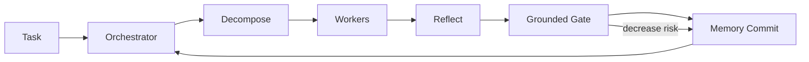
打分理由：多智能体反思的理论框架，且有代码可跟（core 9 / wide 7）

### 2. ⭐ 📄 One Symptom, Three Levers: A Critical Review of On-Policy Self-Distillation
arXiv [2608.25936](https://arxiv.org/abs/2608.25936) · HF 🔥 10 · Justin Robert, Raheel Qader · [PDF](https://arxiv.org/pdf/2608.25936)

**一句话**：梳理 OPSD 三个旋钮，解释 collapse 为什么会发生
**为什么值得你看**：补齐后训练与 on-policy distillation 这条线

**核心架构**：这篇不是新方法，而是把一个已经热起来的训练范式拆成可讨论的结构：OPSD 用“自己当 teacher、但给 teacher privileged information”来保留 on-policy 的同时拿到 token-level dense signal。悖论在于，这个信号越密，模型越容易把 reasoning path 收窄，最后 collapse。作者把问题收束成三个 levers：signal applied where、teacher sees what、guidance changes when；也就是 token 权重怎么放、teacher 能看到多少额外信息、以及 guidance 是否随训练衰减或切换。真正有价值的是它把不同论文里分散的失败现象统一成同一症状框架，而不是再发明一个训练配方。文中最直接支持这一点的是对数学推理场景的结构化回顾：它对哪些机制已被证实、哪些还在争议，给出明确边界，但不做新实验。新意在实证层的结构整理，不在组件层。

- 最强证据：把 collapse 统一成三旋钮问题
- 没做新实验，结论来自文献结构化归纳
- 主要约束在数学推理，泛化到多模态原文未明确
**精读价值**：看速览即可，适合当综述索引
**关联**：[[DeepSeek-R1]]、[[MiniLLM]]
#rlhf #distillation #on-policy #llm · 难度：中等 · 建议：看速览即可
前置：🔲 [[on-policy distillation]] · 🔲 [[reward model]] · 🔲 [[GRPO]] · 🔲 [[knowledge distillation]]

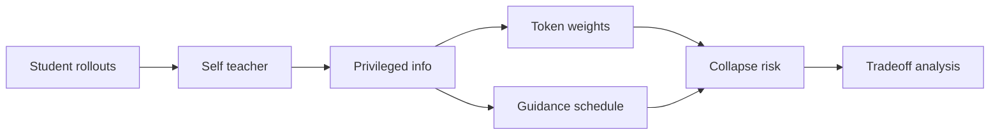
打分理由：On-policy 自蒸馏关键综述，方法面试可讲。（core 9 / wide 6）

### 3. ⭐ 📄 Unlocking Lossless Speedups in LLMs via Discrete Diffusion
arXiv [2609.04010](https://arxiv.org/abs/2609.04010) · HF 🔥 65 · Subham Sekhar Sahoo, Lingjie Chen, Khiem Pham 等 · [PDF](https://arxiv.org/pdf/2609.04010) · [代码](https://github.com/ifm-ai/uno) ★50

**一句话**：用 discrete diffusion 给 AR LLM 做无损加速，最高快 3 倍
**为什么值得你看**：直击推理加速，和 KV cache/ speculative decoding 同赛道

**核心架构**：它解决的是一个很现实的悖论：AR LLM 的质量强，但生成天生是逐 token 串行，吞吐被 next-token prediction 的顺序依赖卡死。作者没有改掉 AR 分布本身，而是把模型拆成两套权重：AR weights 继续负责标准 NTP 训练，轻量 diffusion weights 负责一次并行生成多个 token；再用 Diffusion Distillation 把这部分几乎无额外成本地学出来。核心机制是 Ψ-Spec：在固定 context length 下做 lossless acceleration 和 inference-time scaling，意思是加速只改变采样路径，不改底层 AR 分布的质量。它阻断的失败是“并行了就掉点”或“快了但换模型语义”的常见加速代价。作者报告 Uno 在评测里比主流 speculative decoding 方法吞吐更高，最高对 base AR 模型到 3×；并且不需要单独 draft model。新意主要在组件层和推理层组织：把 diffusion 变成 AR 的加速外挂，而不是替代架构。

- 最强证据：无损加速 + 固定 context length
- 不需要 draft model，少一个推理组件
- 与 d-LLM 的差别在不牺牲底座 AR 质量
**精读价值**：值得通读，推理加速方向很有价值
**关联**：[[speculative decoding]]、[[d-LLM]]
#llm #diffusion #inference · 难度：硬核 · 建议：值得通读 (20 min)
前置：🔲 [[next-token prediction]] · 🔲 [[diffusion model]] · 🔲 [[speculative decoding]] · 🔲 [[KV cache]]

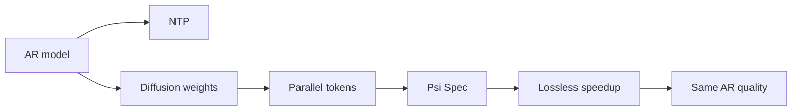
打分理由：并行离散扩散加速，推理范式新且可读（core 8 / wide 6）

### 4. ⭐ 📄 MaxKernel: Agentic Kernel Generation for TPUs
arXiv [2609.04523](https://arxiv.org/abs/2609.04523) · HF 🔥 12 · Shangkun Wang, Nina Cai, Charles Hoong 等 · [PDF](https://arxiv.org/pdf/2609.04523) · [代码](https://github.com/AI-Hypercomputer/accelerator-agents) ★66

**一句话**：MaxKernel用多智能体+编译反馈自动写 TPU kernel，JaxBench 平均提速 1.58×
**为什么值得你看**：做推理加速/系统面试很对口

**核心架构**：反直觉点是：kernel 写对了不等于跑快，TPU 上还会被内存层级、DMA pipeline、tiling 和编译器报错卡死。MaxKernel 的关键改动不是“更会写代码”，而是把 kernel 开发拆成闭环：规划、实现、自调试、测试、profiling 由不同 sub-agent 分工，外层再用 HITL、Auto、Graph search 三种编排方式决定人介入多少、搜索铺多宽；其中编译失败和 XProf 指标不是日志，而是下一轮改写的控制信号，直接阻断“生成后就盲目执行”的失败。最直接的证据是它在 JaxBench 50 个 TPU kernel 上做到 1.58× geometric mean speedup，且在 8 个有人工实现的生产 kernel 上达到 2.32×，超过 human-written baseline 的 2.02×。新意主要在系统组织层：把 agentic loop 真正接到 accelerator compiler/profile 工具链里，而不是只做代码补全。

- 强证据：JaxBench 1.58×，生产 kernel 2.32×
- 没证明通用到所有 accelerator；原文主打 TPU
- 复现难点在 TPU 工具链与 profiling 闭环
**精读价值**：值得精读，能学到 agentic 系统怎么接硬件反馈
**关联**：[[Halide]]、[[TVM]]
#agent #tpu #inference #kernel · 难度：硬核 · 建议：建议精读
前置：🔲 [[multi-agent]] · 🔲 [[planning]] · 🔲 [[KV cache]]

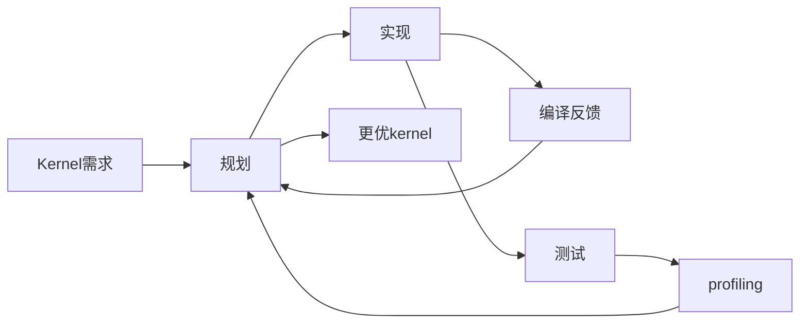
打分理由：面向Agent化生成TPU核，偏系统硬核（core 7 / wide 6）

### 5. ⭐ 📄 EmbodiedSkills: A Unified Framework for Orchestrating, Training, and Deploying VLA Agents
arXiv [2609.01281](https://arxiv.org/abs/2609.01281) · HF 🔥 10 · Wei Wang, Wenqiao Zhang, Yutong Lin 等 · [PDF](https://arxiv.org/pdf/2609.01281) · [代码](https://github.com/DCDmllm/EmbodiedSkills) ★26

**一句话**：EmbodiedSkills用可执行 skill 接口把 VLA 变成闭环机器人 agent，RoboTwin 2.0 达 86.20%
**为什么值得你看**：VLA/机器人 agent 方向值得看

**核心架构**：反直觉点是：VLA 直接输出动作并不等于能完成长程任务，因为当前物理状态可能不允许这个 skill 执行，执行后也未必真的达成子目标。EmbodiedSkills 的核心改动是把每个 skill 定义成“执行提案”：高层 policy 先提议结构化操作，runtime 在执行前检查 prerequisites、phase compatibility、输入是否新鲜、状态转移是否合法，执行后再做 verification 和 recovery；这样阻断的是“模型看起来合理但在当前状态不可执行”的失败。真正关键的不是单次动作精度，而是 shared executable-skill interface 把高层 skill selection、低层 bounded VLA、后验验证放进同一个 AgentLoop，并且把 planning/verification/recovery 轨迹都记成可监督数据。最直接的证据是它在 RoboTwin 2.0 50 个任务上报告 86.20%，在 LIBERO 四个 suite 上 97.40%；但 RMBench 的 memory-dependent 任务只有 12.5%，说明记忆依赖和长时序状态仍会崩。新意主要在系统组织层：用固定接口把 VLA policy 变成可检查、可回放、可训练的闭环 agent。

- 强证据：RoboTwin 2.0 86.20%，LIBERO 97.40%
- RMBench 仅 12.5%，记忆依赖仍弱
- 难点在接口设计和闭环数据记录，不是单点 policy
**精读价值**：值得精读，适合看机器人 agent 的运行时设计
**关联**：[[ReAct]]、[[PaLM-E]]
#vla #agents #robotics · 难度：硬核 · 建议：建议精读
前置：◽ VLA · 🔲 [[planning]] · 🔲 [[memory]] · 🔲 [[ReAct]]

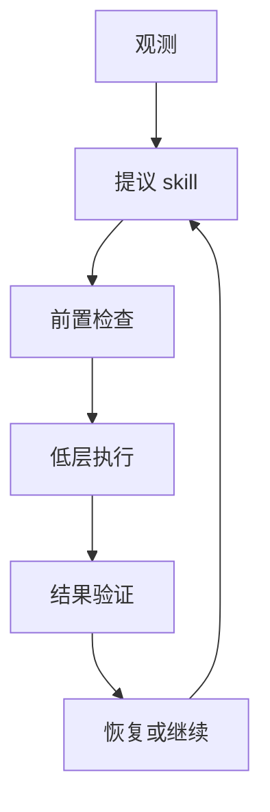
打分理由：VLA 代理的执行/验证框架，适合面试（core 7 / wide 5）

### 6. ⭐ 📄 FlowBalance: Verifier-Grounded Self-Improvement from On-Policy Reasoning Experience
arXiv [2609.03241](https://arxiv.org/abs/2609.03241) · HF 🔥 55 · Zixun Huang, Kishan Panaganti, Haitao Mi 等 · [PDF](https://arxiv.org/pdf/2609.03241) · [代码](https://github.com/alexhuang13/FlowBalance) ★2

**一句话**：FlowBalance用 verifier 校准 on-policy 自训练，Qwen3-8B 在 AIME24 更稳
**为什么值得你看**：后训练 / RLVR 面试很有谈资

**核心架构**：反直觉点是：只靠 verifier 的终局奖励太稀疏，只靠模型自己的 dense guidance 又会把错的自信越训越强。FlowBalance 的关键改动是把“同一个 policy 的 privileged hindsight 打分”先压成 trajectory-level self-guidance，再用 verifier 的 group advantage 决定方向：正优势保留、负优势反转、无偏好就关闭；它阻断的是“模型自己觉得对、结果却被 verifier 判错”的自确认。作者不是再加一个 token imitation loss，而是用 trajectory balance 学一个归一化的 complete-response 分布，这样 dense guidance 只负责细化 verifier 的方向，不会覆盖 outcome 信号。最直接的证据是它在 Qwen3-4B/8B 上相对 FlowRL 拿到更好的整体平均，并且在 Qwen3-8B 上达到 AIME24 验证精度的步数更少、训练更稳定，还避免 direct OPSD 的 response-length collapse。新意主要在方法层：把 verifier-grounded self-improvement 写成分布匹配而不是局部 token 模仿。

- 强证据：比 FlowRL 更稳，且 AIME24 收敛更快
- 没证明能替代外部 verifier；依赖 group advantage
- 数学味重，复现门槛高
**精读价值**：值得精读，适合理解 on-policy 自改进的机制
**关联**：[[FlowRL]]、[[GRPO]]
#rl #self-improvement #reasoning · 难度：硬核 · 建议：建议精读
前置：🔲 [[GRPO]] · 🔲 [[reward model]] · ◽ trajectory balance · ◽ on-policy

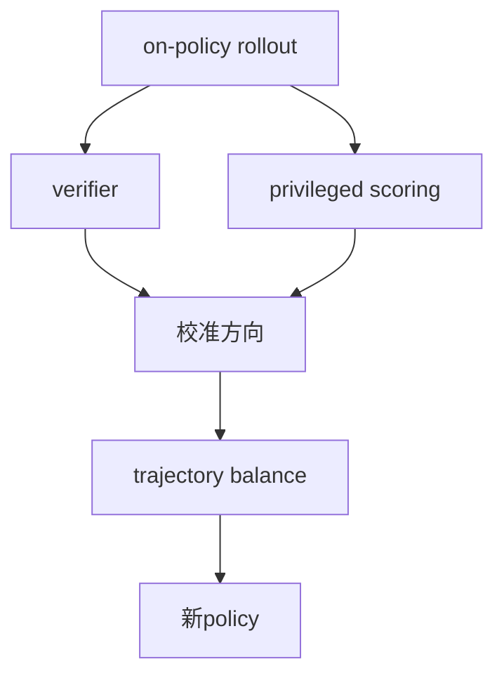
打分理由：基于验证器的自改进，方向贴但代码少（core 6 / wide 4）

### 7. ⭐ 📄 Beneath the Surface of Chains-of-Thought: A Mechanistic Interpretation of Reasoning Operations in LLMs
arXiv [2609.04753](https://arxiv.org/abs/2609.04753) · HF 🔥 13 · Seogyeong Jeong, Jaehui Hwang, Dongyoon Han 等 · [PDF](https://arxiv.org/pdf/2609.04753) · [代码](https://github.com/naver-ai/beneath-cot) ★2

**一句话**：用 hidden state 分离 CoT 操作，证明中层最可分
**为什么值得你看**：面试讲 reasoning 机理很加分

**核心架构**：这篇先打破一个直觉：同样写着“decomposition / recall / deduction”的 CoT，模型内部未必只是按字面词在编码。作者把 reasoning trace 切成有功能的 span，问的是“同一操作在 hidden state 里是否共享几何结构”。关键改变是把 CoT 从文本序列变成 operation chunks，再用 held-out representations 去检验可分性；对应失败被阻断的是 lexical confound 和 positional confound，而 attention-masking 用来检查 chunk 开头的表示是否真依赖前文 reasoning context。最直接的证据是操作向量在中层最可分，且 identical surface tokens 会因所属 operation 不同而落在不同表示区域；掩码掉前文后，chunk onset 的 operation-aligned 表示明显受损。新意主要在实证层：不是再证明 CoT 有用，而是把“语言里的 reasoning 操作”和“内部几何结构”连起来。

- 中层最可分，且非词面或位置伪相关
- 前文 reasoning context 对 chunk onset 有因果作用
- 需要 span 标注与 probing，复现门槛偏高
**精读价值**：值得精读，能补 reasoning 机理直觉
**关联**：[[Chain-of-Thought Prompting]]、[[probing]]
#llm #mechanistic #reasoning · 难度：硬核 · 建议：建议精读
前置：🔲 [[chain-of-thought]] · 🔲 [[self-attention]] · ◽ hidden representations

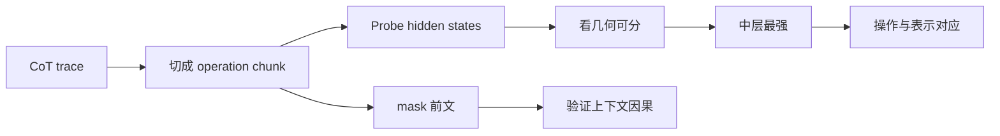
打分理由：推理算子可分解的机理解释，研究可用（core 6 / wide 3）

### 8. ⭐ 📄 Verify Before You Distill: Prompt-Level Teacher Gating for On-Policy Distillation
arXiv [2609.02998](https://arxiv.org/abs/2609.02998) · HF 🔥 8 · Zhiwei Zhang, Zechen Sun, Fei Zhao 等 · [PDF](https://arxiv.org/pdf/2609.02998)

**一句话**：用 verifier 先验门控 OPD，4B/35B 全面胜出
**为什么值得你看**：对 on-policy distillation 和 GRPO 取舍很实用

**核心架构**：这篇解决的是一个反直觉问题：OPD 看起来比 RLVR 更高效，因为 teacher 给的是 dense token-level signal，但如果 teacher 在某个 prompt 上自信地错，reverse KL 会把学生往错误模式上推。作者的关键改动不是换一个损失，而是把“teacher 是否可靠”提升成 prompt-level admission gate：先用少量 verifier-scored teacher probes 估计可靠性，可靠才放行 dense OPD；不可靠就直接切到 verifier-grounded GRPO。这样组件的分工很明确：teacher probes 负责筛掉会放大错误的 prompt，GRPO 负责在 teacher 不可信时提供正确方向。最直接的证据是 4B 和 35B 在数学、代码、指令跟随六个单域设置都优于 Vanilla OPD，且作者报告 teacher-node GPU utilization 从 9.8% 提到 78.9%，说明门控不是白花算力。新意在系统组织层：把两种训练信号做 routing，而不是混合。

- 最强证据是六个单域设置全胜
- teacher 低可靠时，confidence 不能替代 correctness
- 需要 verifier 和异步 teacher 管线，工程依赖较重
**精读价值**：值得精读，适合学 OPD 何时会翻车
**关联**：[[MiniLLM]]、[[DeepSeekMath]]
#distillation #on-policy #alignment · 难度：中等 · 建议：建议精读
前置：🔲 [[on-policy distillation]] · ◽ reverse KL · ◽ verifier · 🔲 [[GRPO]]

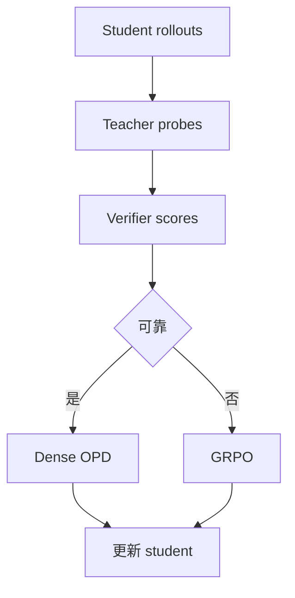
打分理由：Teacher gating 改进OPD，方法细但热度一般（core 6 / wide 4）

## 🧰 项目 · 核心方向

### 9. ⭐ 🧰 okf-memory/okf-agent-memory
[GitHub](https://github.com/okf-memory/okf-agent-memory) ★489 · infra · Go

**一句话**：Git 原生 agent memory，BM25 <300µs，Token 省 80%
**为什么值得你看**：agent / MCP / 长上下文落地很对口

**核心架构**：它解决的是 coding agent 的真实痛点：上下文窗口一关，架构决策、项目事实和操作约定就散了，靠临时 markdown 或黑盒 vector DB 都不稳。这个项目把 memory 直接落在仓库里的 `knowledge/`，核心承重件是纯 Go 的 OKF bundle 解析、校验和 in-memory BM25 搜索，再用 embedded MCP server 把它暴露给 agent；progressive disclosure 的意思是先给索引和摘要，只有命中时才逐层展开，检测条件是检索命中或用户显式展开，处理动作是返回更深层文档，从而压低 token bloat。成熟度信号比较强：有明确 release，README 给出 `make build`、`validate`、`search`、`bootstrap` 和 MCP 配置，还声称有 benchmark 与兼容性文档；但原文未明确是否有外部测试覆盖或真实用户规模。和 Mem0 / Letta 这类方案比，它更偏 Git-native、零外部依赖和规范化 bundle，而不是单纯的记忆服务。

- 作者报告 token bloat 降 80%，BM25 <300µs
- 有 recent release、MCP、benchmark，成熟度较高
- 更像仓库内存层，不是通用向量记忆服务
**为什么现在上榜**：v0.1.4；2026-09-08 持续维护
**精读价值**：值得试用，适合关注 agent memory 基建
**关联**：[[Mem0]]、[[Letta]]
#agent-memory #bm25 #mcp · 难度：中等 · 建议：值得通读 (20 min)
前置：🔲 [[retrieval-augmented generation]] · 🔲 [[embedding]] · 🔲 [[reranker]] · 🔲 [[model context protocol]]

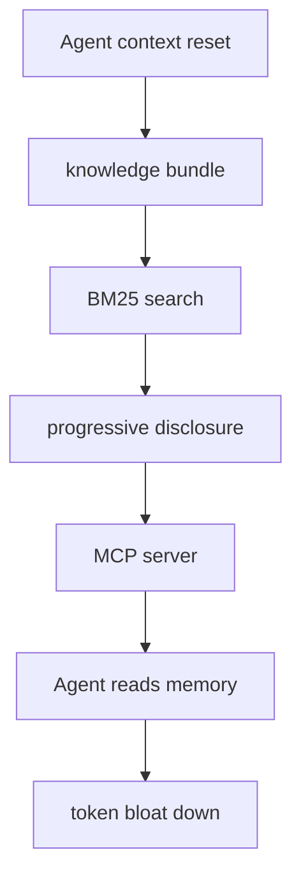
打分理由：agent持久记忆，BM25+token省，工程可复现（core 9 / wide 7）

### 10. ⭐ 🧰 vercel-labs/agent-browser
[GitHub](https://github.com/vercel-labs/agent-browser) ★42,213 (+515 本周) · Trending weekly · tool · Rust

**一句话**：用原生 Rust CLI 给 agent 做浏览器操作，快照+ref 点击。
**为什么值得你看**：你做 agent/RAG 时会碰到网页执行与评测。

**核心架构**：这类工具最反直觉的点是：agent 真正卡住的不是“会不会点”，而是页面状态一变，selector 立刻失效、点击还会被弹窗/遮罩拦住。agent-browser 的关键改法不是再堆一层自然语言接口，而是把浏览器交互收敛成“snapshot 产出 accessibility tree + ref，后续 click/fill 直接按 ref 执行”。这样它阻断的是动态 DOM 和覆盖层导致的脆弱 selector 失败；命中遮挡时会早失败并要求先处理 covering element，再重新 snapshot，避免把错误动作悄悄打到错误控件上。最直接的证据是它在示例里明确展示了 snapshot→click @e2→fill @e3 的闭环，以及“click fails early when another element covers the target”的失败处理。新意主要在系统组织层：它把 agent 浏览器控制做成 native CLI + daemon + API 子集，而不是单纯脚本封装。

- 最强证据是 ref-based 闭环和早失败遮挡检测
- 原文未明确大规模 benchmark 或稳定性边界
- 复现门槛低，核心是 Chrome/CDP 与 accessibility tree
**为什么现在上榜**：2026-09-08 有 v0.37.1 / v0.37.0 连续 release。
**精读价值**：值得看，适合补 agent 浏览器控制的工程底座。
**关联**：[[Playwright]]、[[Selenium]]
#agent #browser #automation · 难度：中等 · 建议：值得通读 (20 min)
前置：🔲 [[ReAct]] · 🔲 [[planning]] · 🔲 [[prompt injection]] · 🔲 [[model context protocol]]

打分理由：AI浏览器自动化，agent工程高相关。（core 8 / wide 8）

### 11. ⭐ 🧰 hpcaitech/Open-Sora
[GitHub](https://github.com/hpcaitech/Open-Sora) ★29,699 (+212 今日) · Trending daily · model · Python

**一句话**：Open-Sora 2.0 以 11B 开源视频模型，对标 HunyuanVideo/Step-Video。
**为什么值得你看**：你关注视频生成、diffusion 和大模型训练配方。

**核心架构**：视频生成最难的悖论是：想要更长、更清晰、更稳定的片段，算力和显存却会先爆掉，很多开源项目只能停在短分辨率 demo。Open-Sora 的关键思路不是只换一个更大的 backbone，而是沿着“视频压缩→Transformer 架构→多阶段训练→条件控制”一起改，去阻断时序冗余、训练不稳和长视频退化这三类失败。这里的 upgraded video compression 是把输入视频先压到更紧凑的表示，减少生成端负担；Enhanced ST-DiT 负责在压缩表征上建模时空依赖；multi-stage training 则避免一次性学长高分辨率导致优化崩掉。作者最直接的支持证据是 2025-03-12 的 2.0：报告称 11B checkpoint 和 training code 完全开源，且在 VBench 与 Human Preference 上对标 11B HunyuanVideo 和 30B Step-Video。新意主要在系统组织层和实证层：不是单点结构 trick，而是可复现的视频生成训练栈。

- 作者报告 11B 在 VBench 和 Human Preference 上对标更大模型
- 1.3 引入 upgraded VAE、ST-DiT、3D-VAE、rectified flow
- 原文未明确详细消融，工程复现成本仍高
**精读价值**：值得精读，适合看视频生成训练栈怎么拼起来。
**关联**：[[Stable Diffusion]]、[[DiT]]
#video #diffusion #generation · 难度：硬核 · 建议：建议精读
前置：🔲 [[diffusion model]] · 🔲 [[latent diffusion]] · 🔲 [[flow matching]] · 🔲 [[vision transformer]]

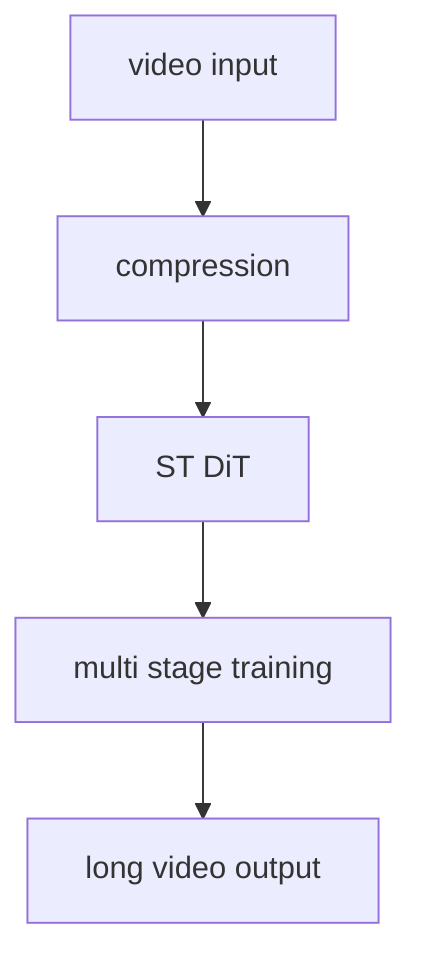
打分理由：高质量开源视频生成，和多模态方向强相关。（core 8 / wide 8）

### 12. ⭐ 🧰 carloslfu/slotstream
[GitHub](https://github.com/carloslfu/slotstream) ★323 · infra · Swift

**一句话**：用 SSD 流式供权重，让 48GB Mac 跑 125B MoE，约 12 tok/s。
**为什么值得你看**：你关心推理加速、KV cache、量化和本地大模型部署。

**核心架构**：这类系统解决的是真实痛点：125B MoE 即使 4-bit 后也远超很多 Mac 的内存，传统做法不是跑不动就是得把整模型常驻 RAM。slotstream 的核心取舍是把“模型权重常驻内存”改成“专家权重按需从 SSD 流式加载”，让运行时只保留当前 decode 真正需要的部分；再配合 4-bit 量化和 speculative decode，可把 105GB 级模型塞进 48GB Mac。它阻断的是两种失败：一是内存爆掉，二是下载/安装时损坏或中断导致不可用，所以 pull 里做了断点续传、hash 校验、压缩包恢复原模型、并发连接自适应。作者报告 48GB M5 Pro 上 warm decode 约 12 tok/s，且 2026-09-06 的 release 重点修了 Hugging Face mirror 下载与校验流程。新意主要在运行时机制层：不是换模型，而是把 MoE 权重搬运、校验和 API 封装做成可用的本地推理栈。

- 作者报告 48GB Mac 上 warm decode 约 12 tok/s
- 核心证据是 SSD 流式专家与 4-bit 组合
- 对磁盘、带宽和 Mac 型号依赖强，非通用推理方案
**为什么现在上榜**：2026-09-06 连续 release，且下载格式与 mirror 方案刚更新。
**精读价值**：值得看，适合学本地大模型推理系统的承重设计。
**关联**：[[llama.cpp]]、[[vLLM]]
#llm-inference #moe #quantization · 难度：硬核 · 建议：值得通读 (20 min)
前置：🔲 [[mixture of experts]] · 🔲 [[quantization]] · 🔲 [[speculative decoding]] · 🔲 [[KV cache]]

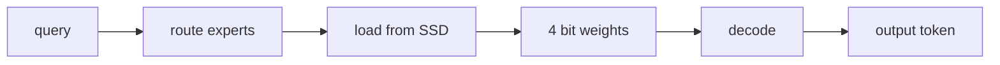
打分理由：MoE专家流式SSD推理，工程系统相关（core 8 / wide 6）

### 13. ⭐ 🧰 advaitpaliwal/feynman
[GitHub](https://github.com/advaitpaliwal/feynman) ★9,215 (+268 今日) · Trending daily · tool · TypeScript

**一句话**：用多代理研究循环做检索与核验，给出可引用的研究简报
**为什么值得你看**：对 Agent/RAG 面试很对口，能看 harness 设计

**核心架构**：反直觉点是：做研究最容易卡在“信息很多但结论不稳”，单轮检索只能堆材料，不能保证每个判断都能追到来源。Feynman 的关键改变不是再加一个聊天壳，而是把研究拆成循环式 workflow：先并行搜索与读文献，再把候选发现交给 synthesis 和 verification，必要时继续追问或补证据。组件的作用不是“提供功能清单”，而是分别阻断幻觉、遗漏引用和只看表面摘要这三类失败。最直接的证据是 `deepresearch`/`rank`/`paper --fetch-full-text` 这些命令：它们把 citation、full-text、critique、synthesis 分层加入评分与产出流程，说明系统不是只做搜索，而是把“可审计证据链”作为主输出。新意主要在系统组织层：用 agent loop + provenance + local/remote knowledge graph 组织研究，而不是单点检索。

- `rank`可加 full-text 和 citation 证据
- 输出会标注来源 session / paper
- 本质是研究工作台，不是纯聊天入口
**精读价值**：值得看，重点学它怎么把研究 agent 做成可审计循环
**关联**：[[ReAct]]、[[SWE-bench]]
#agent #research #tool-use · 难度：中等 · 建议：值得通读 (20 min)
前置：🔲 [[ReAct]] · 🔲 [[retrieval-augmented generation]] · 🔲 [[multi-agent]] · 🔲 [[embedding]]

打分理由：开源AI研究agent，贴近agent工程（core 7 / wide 7）

### 14. ⭐ 🧰 huggingface/funes
[GitHub](https://github.com/huggingface/funes) ★318 (+68 今日) · Trending daily · tool · Rust

**一句话**：给 agent 会话做持久记忆，跨工具可检索还能发布到 Hub
**为什么值得你看**：和记忆型 agent、RAG 很贴近，适合看工程化记忆层

**核心架构**：痛点是 agent 每次开新会话就失忆：Claude Code、Codex、pi、Hermes 各自积累的决策和排错记录分散，切模型后上下文也断。funes 的关键设计是把会话轨迹索引成可搜索 memory，并让 recall 在任务中自动被调用；同时用 pinned embeddings + reranker 保证“先找回相关经历，再把它交给当前模型”。它还把 memory 当 dataset 处理，能 push 到 Hugging Face Hub，阻断了“记忆只在本机、无法共享/迁移”的失败。最强证据是它已经支持跨 agent 统一索引、`funes add` 自动挂 hook、`funes recall/ask/push` 这些完整闭环，而且 release 里还在持续强化 remote memory、session listing 和 digest。新意主要在系统组织层，外加一点实证层：把 agent memory 做成可发布的数据资产，而不是单机缓存。

- 跨 Claude Code/Codex/pi/Hermes 统一记忆
- 有自动 hook 与 publish 流程
- 但公开摘要未给出检索效果基准
**为什么现在上榜**：v1.3.0（2026-09-01）
**精读价值**：适合看它怎么把 memory 做成可迁移基础设施
**关联**：[[retrieval-augmented generation]]、[[graph RAG]]
#agent #memory #rag · 难度：中等 · 建议：值得通读 (20 min)
前置：🔲 [[retrieval-augmented generation]] · 🔲 [[embedding]] · 🔲 [[reranker]] · 🔲 [[memory]]

打分理由：Agent 会话可检索记忆，贴近RAG/agent（core 7 / wide 6）

## 🌐 全领域热点

### 15. 🌐 🧰 shareAI-lab/learn-claude-code
[GitHub](https://github.com/shareAI-lab/learn-claude-code) ★76,345 (+82 今日) · Trending daily · skill · Python

**一句话**：用 Bash 搭一个 Claude Code 风格 agent harness 教程
**为什么值得你看**：偏工程入门，但能快速建立 agent harness 心智模型

**核心架构**：它解决的是真实工程痛点：很多人把“agent”写成一串 prompt 和 if-else，却不知道模型、工具、上下文、权限到底怎么分工。这个项目把核心论点讲得很直白：agency 来自模型训练，代码层做的是 harness，也就是 tools、knowledge、observation、action、permissions 的承重结构。关键设计取舍是把工具做成原子动作、把知识按需加载、把观察信号和权限边界显式化，避免把所有东西塞进一条线性流水线。成熟度信号很强：stars 很高、README 细到解释 CLI/loop/ctx 的组织方式，但它更像教学型框架，不是一个强调 benchmark 或 production SLA 的系统。想要的是“能搭 agent 壳”的能力，它比通用教程更偏 Claude Code 语境，比研究型 agent 更偏 harness 组织。

- 核心是 harness 而非新模型
- 更像教学框架，不是研究系统
- README 结构化，适合快速上手
**为什么现在上榜**：原文未明确
**精读价值**：速览够了；除非你要补 agent harness 基础
**关联**：[[ReAct]]、[[model context protocol]]
#agent #tool-use #prompting · 难度：入门 · 建议：看速览即可
前置：🔲 [[planning]] · ◽ tool-use · 🔲 [[memory]] · 🔲 [[ReAct]]

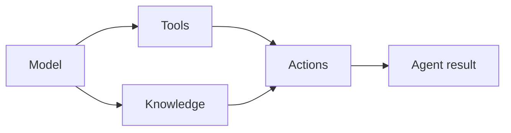
打分理由：agent harness类，热度高且具可复用性（core 4 / wide 8）

### 16. 🌐 🧰 can1357/oh-my-pi
[GitHub](https://github.com/can1357/oh-my-pi) ★30,176 (+7509 本月) · Trending monthly · tool · TypeScript

**一句话**：⌥ Coding agent with the IDE wired in
**为什么值得你看**：（dry-run：未调用 LLM，配置 OPENAI_API_KEY 后会生成中文速览）
#coding-agent #ide #agent · 难度：中等 · 建议：看速览即可
打分理由：IDE内coding agent，能用于工程实践（core 4 / wide 6）

### 17. 🌐 🧰 OpenBMB/MiniCPM
[GitHub](https://github.com/OpenBMB/MiniCPM) ★10,598 (+239 今日) · Trending daily · model · Jupyter Notebook

**一句话**：MiniCPM5: SOTA on-device LLMs, small yet powerful.
**为什么值得你看**：（dry-run：未调用 LLM，配置 OPENAI_API_KEY 后会生成中文速览）
#vlm #on-device #small-llm · 难度：中等 · 建议：看速览即可
打分理由：开源小模型路线，与压缩/部署方向相关（core 6 / wide 6）

### 18. 🌐 🧰 datawhalechina/zero-to-sglang
[GitHub](https://github.com/datawhalechina/zero-to-sglang) ★549 · tutorial · Python

**一句话**：面向大模型开发者的 SGLang 系统化开源教程：从推理基础与环境搭建开始，逐步学习模型部署、结构化生成、服务开发和性能优化，   结合实战案例带你从 0 到 1 掌握 SGLang，构建高性能 LLM 推理应用
**为什么值得你看**：（dry-run：未调用 LLM，配置 OPENAI_API_KEY 后会生成中文速览）
#inference #infra #kv-cache · 难度：中等 · 建议：看速览即可
打分理由：推理部署与SGLang细节强，贴训练/系统方向（core 7 / wide 6）

---
想精读哪一篇？在 Claude 里说：`精读 2026-09-08 第 N 条`，Jarvis 会按你的 known.md 只讲你不会的部分。