# Jarvis 日报 · 2026-09-09

候选 695 → 过滤后 305 → 入选 18。图例：⭐ 核心方向 · 🌐 全领域热点 · ✅ 已掌握前置 · 🔲 需补前置

## 📄 论文 · 核心方向

### 1. ⭐ 📄 NeoHorse-1: Towards Recursive Self-Improvement via Agentic Post-Training with Routing Harness
arXiv [2609.08183](https://arxiv.org/abs/2609.08183) · HF 🔥 338 · NeoHorse Team, Guoliang Cao, Guohao Dai 等 · [PDF](https://arxiv.org/pdf/2609.08183) · [代码](https://github.com/TokenRhythm/NeoHorse) ★70

**一句话**：NeoHorse-1 用 routing harness 做 agentic post-training，4B 均分 58.94→64.87
**为什么值得你看**：适合看 RSI 和 agent post-training 怎么闭环

**核心架构**：它解决的悖论是：agent 已经在真实执行里暴露“会什么/不会什么”，但传统 post-training 只把轨迹当静态监督，学不到“下一轮该学什么”。NeoHorse-1 的关键改动是把 routing harness 里的三类信号——预测能力需求、实际服务层级、后续交互——变成训练分配依据；再把交互切成保留 reasoning、tool calls、harness context 的 user-turn 样本，用结构校验、六维语义评估和 subscene 标注筛掉脏样本。更关键的是，它把 routing 信号同时喂给三阶段 curriculum SFT 和 routing-guided on-policy distillation，前者阻断“难度分布混乱”，后者阻断“离策略分布偏移”。最直接的证据是 4B/9B 在十个基准上的 macro-average 都上升，且 4B 从 58.94 到 64.87，明显缩小和 9B base 的总差距。新意主要在系统组织层：不是单纯新模型，而是 evaluation-selection-update 的闭环。

- 最强证据是 4B 总分抬升且逼近 9B base
- 没证明 RSI 会稳定跨轮次成立
- 复现难点在 routing 记录和样本切分
**精读价值**：想看 agent 自举训练链路，值得精读
**关联**：[[Agentic Routing]]、[[FireAct]]
#agent #rlhf #post-training · 难度：硬核 · 建议：建议精读
前置：🔲 [[on-policy distillation]] · ◽ curriculum learning · 🔲 [[planning]] · 🔲 [[tool use]]

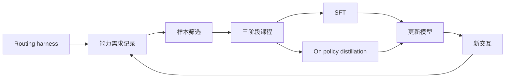
<sub>打分理由：agent化后训练+路由记录，RSI范式很对口（core 9 / wide 7）</sub>

### 2. ⭐ 📄 Miles v0.1: Production-Level Post-Training
arXiv [2609.08368](https://arxiv.org/abs/2609.08368) · HF 🔥 44 · RadixArk, Tom Chen, Mao Cheng 等 · [PDF](https://arxiv.org/pdf/2609.08368) · [代码](https://github.com/radixark/miles) ★2696

**一句话**：Miles v0.1 把 frontier post-training 做成全栈系统，64 卡跑 263 秒步时
**为什么值得你看**：适合看 RL post-training 工程化怎么落地

**核心架构**：它解决的痛点是：agentic RL 已经不是“生成一段答案再更新”了，而是多轮 rollout、tool use、异步环境和超大 MoE 同时出现，容易把吞吐、精度和权重同步一起拖垮。Miles 的关键改变是把整条 RL loop 拆成可验证、可替换的三段：rollout 侧用 SGLang 扛多轮生成，并用 affinity 把同一 session 固定到持有 KV cache 的引擎，阻断“换机重算前缀”导致的吞吐塌陷；trainer 侧用 Megatron-LM 或 FSDP 吃完整 trajectory groups，阻断 rollout 与更新的数值/并行栈割裂；weight sync 侧在 in-flight rollout 尽量不停顿地回传新权重，阻断训练和采样互相等。最直接的证据是它给出一个端到端 case study：GLM-5.2 744B-A40B、64 张 GB300、前 30 步中位 step time 263 秒。新意主要在系统组织层和运行时机制，不是单个算法点。

- 最强证据是端到端异步 agentic RL case study
- 没证明所有精度格式和同步路径都成熟
- 复现门槛高，依赖 SGLang 和大规模集群
**精读价值**：做 RL 系统或训练平台，值得通读
**关联**：[[slime]]、[[vLLM]]
#rl #post-training #infra · 难度：硬核 · 建议：值得通读 (20 min)
前置：🔲 [[GRPO]] · 🔲 [[KV cache]] · ◽ SGLang · 🔲 [[FSDP]]

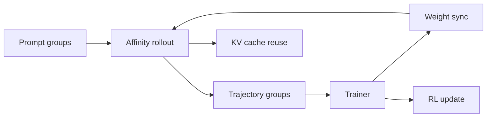
<sub>打分理由：生产级post-training系统+RL训练细节（core 9 / wide 7）</sub>

### 3. ⭐ 📄 Graph-Based Personalized Memory for LLM Agents: Representation, Evolution, Retrieval, and Evaluation
arXiv [2609.08599](https://arxiv.org/abs/2609.08599) · Dac Duy Anh Nguyen, Zhangchi Qiu, Shigeng Chen 等 · [PDF](https://arxiv.org/pdf/2609.08599)

**一句话**：图记忆综述：把 LLM agent 个性化 memory 拆成表示、演化、检索、评测
**为什么值得你看**：适合补 agent memory 设计空间，面试好讲

**核心架构**：它解决的不是一个单点算法，而是一个长期场景里的结构性矛盾：个人助手要跨会话记住偏好、关系和变化，但纯 context window 装不下，flat log 又说不清事实之间怎么连、怎么变、怎么追溯证据。作者把 graph-based personalized memory 定义为“存放在模型外、以显式图组织的用户状态”，并用生命周期视角重排整个领域：representation 负责把事实、时间、关系、经历编码成可连接结构；evolution 负责把新证据并入图、修订旧结论；retrieval 负责沿多跳关系找回与当前请求相关的用户上下文；evaluation 负责判断图是否真支持个性化而不只是存了数据。最直接的支撑不是实验涨幅，而是它把已有工作按这四层对齐，指出现有评测常忽略 graph quality、user control 和 lifecycle validity。新意主要在实证/综述层：给出统一设计坐标系。

- 最强价值是统一了 fragmented 的 memory 设计空间
- 没证明哪种图结构一定最好
- 对真实长期个性化评测仍不充分
**精读价值**：想做长期 personalized agent，建议精读
**关联**：[[GraphRAG]]、[[MemGPT]]
#agent #memory #evaluation · 难度：中等 · 建议：值得通读 (20 min)
前置：🔲 [[memory]] · 🔲 [[retrieval-augmented generation]] · 🔲 [[graph RAG]] · 🔲 [[planning]]

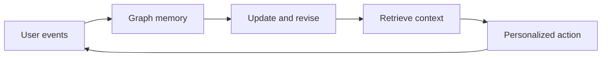
<sub>打分理由：图结构个性化记忆，覆盖表示/检索/评测。（core 9 / wide 6）</sub>

### 4. ⭐ 📄 MeClear: Cooperative Game-Theoretic Attribution and Risk-Aware Memory Clearance for Long-Horizon LLM Agents
arXiv [2609.09115](https://arxiv.org/abs/2609.09115) · Boyu Yang, Jiazheng Sun, Zilong Lu 等 · [PDF](https://arxiv.org/pdf/2609.09115)

**一句话**：MeClear 用协同 Shapley 清掉有害记忆，10 个库任务恢复率 82.3%
**为什么值得你看**：适合做 agent memory 和 RAG 可靠性面试谈资

**核心架构**：反直觉点在于：检索命中不等于有用，甚至会把过时、冲突但语义相近的记忆塞进上下文，导致 long-horizon agent 任务失败。单条删除也不够，因为“坏记忆”常被别的冗余证据遮住，删一条看不出变化。MeClear 的关键改动是把 memory maintenance 变成 task-conditioned clearance：先用 LOO 筛掉强正证据，再用 sampled cooperative Shapley 把一组记忆的边际贡献摊开，专门破解 redundant conflict masking；随后只在当前 query 的候选子集里做最小清除，并在清除后的上下文上先验证 task recovery，再决定是否放行输出，避免永久改写记忆库。最直接的证据是作者报告在 10 个 long dialogue memory pools 上，target recall 达 85.9%，overall task recovery rate 达 82.3%，比 LOO 基线高 25.5 个点。新意主要在组件层与系统组织层：不是更强 retriever，而是把“判毒—清除—回收验证”串成可逆流程。

- 最强证据：10 个 memory pools，恢复率 82.3%
- 没证明永久编辑更优，只是检索时清除
- Shapley 近似，复现受采样预算影响
**精读价值**：值得精读，能补 agent memory 失效机理
**关联**：[[Shapley value]]、[[Leave One Out]]
#agent #rag #memory · 难度：硬核 · 建议：建议精读
前置：🔲 [[retrieval-augmented generation]] · 🔲 [[memory]] · ◽ Shapley value · ◽ Leave One Out


<sub>打分理由：长程agent记忆清理与风险抑制，贴合核心方向。（core 9 / wide 6）</sub>

### 5. ⭐ 📄 Q2D-Web: A Large-Scale Benchmark for Retrieval in Agentic RAG Systems
arXiv [2609.08887](https://arxiv.org/abs/2609.08887) · Maximilian Schall, Sedigheh Eslami, Markus Krimmel 等 · [PDF](https://arxiv.org/pdf/2609.08887)

**一句话**：Q2D-Web 用 1.9 亿网页和 7 万 agent 查询评 retriever
**为什么值得你看**：RAG 方向面试很容易被问评测集缺什么

**核心架构**：问题是：生产里的 first-stage retriever 不是在答人写的 query，而是在答 agent 改写后的 query；同时还要在 1.9 亿级网页里把相关文档压过大量“语义像但不相关”的候选。现有 benchmark 要么 corpus 太小，要么 query 太少，要么只测 human-written queries，和 agentic RAG 的分布不一致。Q2D-Web 的核心改动是把评测对象改成“生产采样的 agent reformulation”，再配上 190M-document web corpus 和 70k 多语种 queries，并用三套 relevance judgments 降低 false negatives：agent citations、production rankings、以及合并两者再补 LLM 标注的集合。最直接的支持证据不是单个分数涨幅，而是作者报告：13 个 retrievers 的相对排序在不同 judgment set 下基本稳定，但会随 topic、language、query type 明显变化；另外保留三分之一子语料还能近似 full-corpus ranking，只让 Recall@1000 提升 3–7 点。新在实证层和 benchmark 组织层。

- 最强证据：190M 文档、70k 生产采样 query
- 没证明某类 retriever 最强，只证明排序稳
- 子语料近似全量，降低评测成本
**精读价值**：值得通读，主要看评测设计而非榜单
**关联**：[[MS MARCO]]、[[BrowseComp]]
#benchmark #rag #retrieval · 难度：中等 · 建议：值得通读 (20 min)
前置：🔲 [[retrieval-augmented generation]] · 🔲 [[reranker]] · ◽ dense retrieval · ◽ late interaction


<sub>打分理由：面向agentic RAG的检索基准，评测价值高。（core 9 / wide 7）</sub>

### 6. ⭐ 📄 BIO-MEMART: Biometric-Aware KV Cache Memory for Multi-User LLM Agents
arXiv [2609.08566](https://arxiv.org/abs/2609.08566) · Yanhong Qian, Xuanying He, Qingguo Meng 等 · [PDF](https://arxiv.org/pdf/2609.08566)

**一句话**：Bio-MemArt 给 KV cache 加生物特征门禁，作者报告面部认证 95.71%
**为什么值得你看**：你做 agent 系统时很可能会碰多用户记忆隔离

**核心架构**：问题不是 KV cache 能不能复用，而是共享部署里“相关”不代表“授权”：同一套记忆池里，语义上匹配的 KV block 可能属于另一个物理用户。传统 KV 管理只管搬运、压缩、复用，不管谁能激活它。Bio-MemArt 的关键改动是把 biometric template 挂到每个 KV block 上，查询时先用当前用户的 biometric probe 做身份过滤，只有 cosine similarity 超阈值的块才进入授权候选池，之后才走原始 MemArt 的 latent retrieval、直接 KV reuse 和 decoupled position encoding。这样身份门禁发生在语义检索之前，避免把别人的私有上下文激活出来，同时不破坏低 prefill 成本。最直接的证据是作者报告：face benchmarks 上 owner/non-owner biometric success rates 为 95.71%/0.86%，palmprint 为 97.60%/2.00%，prefill tokens 从 full-context 的 18,781.96 降到 28.57。新意在系统组织层：给 memory substrate 加访问控制。

- 最强证据：Owner/Non-owner 成功率分离极大
- 没证明跨设备泛化，传感器依赖强
- 生物特征门禁在检索前，保留 KV 复用
**精读价值**：值得精读，适合看共享 agent 记忆架构
**关联**：[[MemArt]]、[[KV cache]]
#agent #memory #kv-cache · 难度：中等 · 建议：值得通读 (20 min)
前置：🔲 [[KV cache]] · 🔲 [[memory]] · 🔲 [[retrieval-augmented generation]] · 🔲 [[positional encoding]]


<sub>打分理由：生物特征KV缓存访问控制，长程agent系统价值高。（core 9 / wide 6）</sub>

### 7. ⭐ 📄 ExecCritic: Learn to Test, Test to Improve for Coding Agents
arXiv [2609.09133](https://arxiv.org/abs/2609.09133) · Leitian Tao, Baolin Peng, Haorui Wang 等 · [PDF](https://arxiv.org/pdf/2609.09133) · [代码](https://github.com/MSR-Orchard/execcritic.)

**一句话**：把测试和修复分开训练，SWE-bench Verified 提升到72.6%
**为什么值得你看**：适合看 coding agent 评测与后训练设计

**核心架构**：反直觉点是：同一个 agent 既写 patch 又写 test 时，错误会互相“认证”，一个坏测试能把坏修复伪装成成功。传统 execution feedback 只在测试真能刻画 issue 行为时才有用，但仓库里的自生成测试常漏掉边界条件或把 issue 误读成别的行为。ExecCritic 的关键改动是把循环拆成 test–verify–revise：Test agent 先独立生成仓库原生 test，fail-closed harness 只接受能在 buggy repo 上稳定失败的测试并冻结它，Repair agent 只能看这个固定反馈改源码，不能回头改测试。最强证据是 SWE-bench Verified 上，固定 Repair agent 时，base Test 生成的测试把 resolved rate 从 61.2% 拉到 57.3%，而 GPT-5.6-sol 生成的测试升到 65.3%，直接证明瓶颈不是“有没有反馈”，而是反馈是否刻画了正确行为。新意主要在系统组织层：不是新修一个补丁器，而是用角色隔离+角色特定 RL 约束测试和修复的分工。

- base tests 反而伤害修复，说明反馈质量是瓶颈
- 没证明任意仓库都稳；依赖可执行测试与工具链
- 复现要同时训 Test/Repair，工程量不低
**精读价值**：适合精读：它讲清 coding agent 里反馈为何会失真
**关联**：[[SWE-agent]]、[[Reflexion]]
#agent #coding #execution-feedback · 难度：硬核 · 建议：建议精读
前置：🔲 [[ReAct]] · 🔲 [[planning]] · 🔲 [[reward model]] · 🔲 [[SWE-bench]]

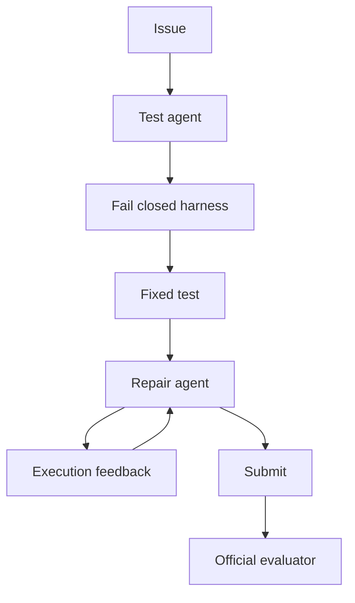
<sub>打分理由：编码智能体端到端改进，安全且贴合你核心（core 9 / wide 7）</sub>

### 8. ⭐ 📄 BeaconKV: Key-Value Cache Compression Guided by Beacon Queries for Efficient Large Reasoning Model Inference
arXiv [2609.04971](https://arxiv.org/abs/2609.04971) · HF 🔥 31 · Janghyeon Kim, Minsoo Kim, Kyuhong Shim 等 · [PDF](https://arxiv.org/pdf/2609.04971) · [代码](https://github.com/aiha-lab/BeaconKV) ★2

**一句话**：用 beacon queries 压缩 KV cache，4个LRM最高省5.8倍显存

**核心架构**：反直觉点是：长 CoT 里，最近几步 query 不一定代表“接下来会看谁”。作者观察到有一类 Thought Revisiting Tokens 会回看很早的计划、约束和中间结论，所以按“最近 query 重要”来淘汰 KV，容易把后面真会被重访的旧上下文删掉。BeaconKV 的关键概念是 beacon queries：它不存完整 query 历史，而是把全局 query 分成少量相似簇，用代表 query 预测哪些 KV 将被远距离重访；再配合 continual FPS 在线选出这些代表，保持小内存的同时尽量保留未来会用到的证据。最直接的证据是作者在 4 个 open-source LRM 上做对比，显示 BeaconKV 在激进压缩下还能接近 full cache accuracy，同时最高做到 5.8x memory reduction 和 4.3x+ throughput。新意主要在组件层：不是换模型，而是改 KV 淘汰的决策依据。

- 核心证据是 TRT 和 query 聚类，不是更复杂打分器
- 对长程重访有效；若未来 attention 更局部，收益会掉
- 训练-free，复现主要卡在推理栈与测评细节
**精读价值**：值得看：把 KV 压缩的失效模式讲得很清楚
**关联**：[[H2O]]、[[StreamingLLM]]
#inference #kv-cache #reasoning · 难度：中等 · 建议：值得通读 (20 min)
前置：🔲 [[KV cache]] · 🔲 [[long context]] · ◽ attention · 🔲 [[sparse attention]]

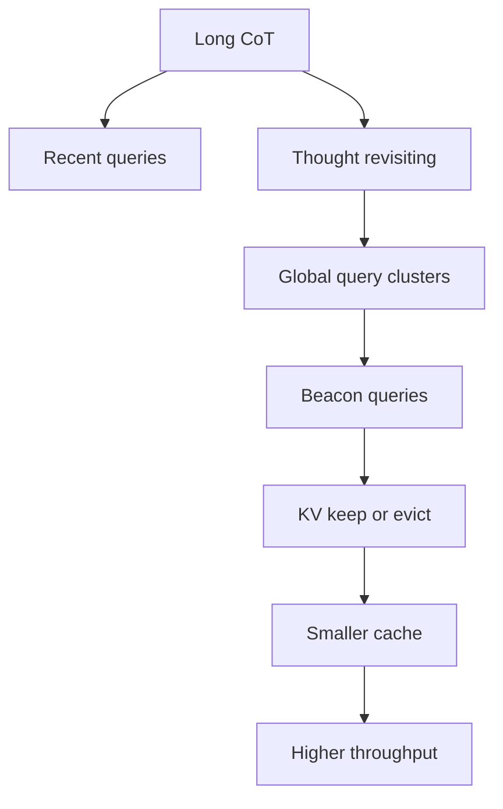
<sub>打分理由：KV压缩面向长推理，推理加速直接可用（core 8 / wide 4）</sub>

## 🧰 项目 · 核心方向

### 9. ⭐ 🧰 FareedKhan-dev/all-agentic-architectures
[GitHub](https://github.com/FareedKhan-dev/all-agentic-architectures) ★4,463 (+126 今日) · Trending daily · tool · Jupyter Notebook

**一句话**：35种 agent 架构可运行教材，283 测试，17项基准
**为什么值得你看**：看 agent 论文时可当对照库，面试也好讲

**核心架构**：它解决的是真实痛点：agent 论文里“反思、检索、多智能体、记忆”常被写成概念图，但很难快速看出每种模式到底如何跑、何时停、和别的模式差在哪。这个仓库把 35 个经典/常见 agentic patterns 包成统一的 `Architecture` 类，每个 pattern 都有可执行 notebook 和同一套 `.run(task)` 接口；承重组件是 LangGraph state machine，再加上 multi-provider LLM 支持，让同一任务能横向切换 Reflection、ReAct、GraphRAG、MemGPT、LATS 等实现。关键设计取舍是 deterministic-picker：当 LLM 只负责输出离散特征，最终决策交给 Python 组合，避免 LLM-as-Scorer 的“平分带”问题。成熟度信号很强：README 明确写 283 tests 通过、17-task leaderboard、最近 release v0.3.0，并且有 PyPI 包和文档站。想要的是“能跑的 agent 架构对照表”，它比教程合集强在统一接口和基准对比。

- 283 tests + PyPI + docs，成熟度高
- 不是单一 agent，而是可比的架构库
- 基准是 17-task，偏教学与对照，不是单点 SOTA
**为什么现在上榜**：最近 release：v0.3.0（2026-05-28）
**精读价值**：值得装，但主要价值是查阅和对照
**关联**：[[LangGraph]]、[[SWE-agent]]
#agent #rag #benchmark · 难度：中等 · 建议：看速览即可
前置：🔲 [[ReAct]] · 🔲 [[planning]] · 🔲 [[memory]] · 🔲 [[graph RAG]]

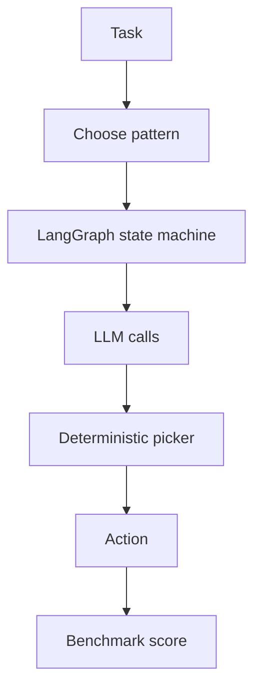
<sub>打分理由：Agent 框架汇总+可运行基准，贴近核心方向。（core 9 / wide 7）</sub>

### 10. ⭐ 🧰 OpenHands/OpenHands
[GitHub](https://github.com/OpenHands/OpenHands) ★87,072 (+208 今日) · Trending daily · tool · TypeScript

**一句话**：OpenHands 用多后端 Agent Canvas 管开发流程，v1.16.0 支持本地/云切换与自动化。
**为什么值得你看**：Agent 编排与代码助手热点，面试常问。

**核心架构**：它解决的不是“会不会写代码”，而是“长任务谁来持续跑”：本地一关机，agent 的会话、后台自动化和工具状态就断了；单一模型后端又把能力锁死在一种部署里。OpenHands 的关键改变是把系统拆成 Agent Canvas + 可切换 backend：前端负责会话与自动化编排，后端可落在本机、Docker、VM、云或 ACP-compatible agent 上，阻断了“模型/环境绑定导致的停机”和“不同 agent 不能共用同一控制面”的失败。release 里最直接的证据是 live phase、LLM provider 选择、LLM-switch toggle、以及 explicit allow-list skills，这些都在把“运行中可见、可切、可控”做成控制面能力，而不是把 agent 当一次性聊天。新意主要在系统组织层，而不是单个 agent 算法。

- 强证据是多后端切换和自动化入口，不是单一 coding demo
- 原文未明确给出任务成功率或基准提升
- 复现门槛主要在后端/沙箱与工具接入
**为什么现在上榜**：v1.16.0（2026-08-27）
**精读价值**：值得看系统组织怎么把 agent 产品化。
**关联**：[[SWE-bench]]、[[Claude Code]]
#agent #coding #workflow · 难度：中等 · 建议：值得通读 (20 min)
前置：🔲 [[ReAct]] · 🔲 [[planning]] · 🔲 [[memory]] · 🔲 [[model context protocol]]

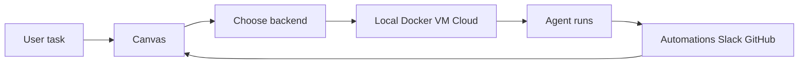
<sub>打分理由：头部开源 AI 开发体，agent 研发价值高。（core 8 / wide 9）</sub>

### 11. ⭐ 🧰 memvid/memvid
[GitHub](https://github.com/memvid/memvid) ★16,531 (+30 今日) · Trending daily · tool · Rust

**一句话**：Memvid 把 agent memory 压成单文件 .mv2，作者报告 LoCoMo +35% 且 P50 0.025ms。
**为什么值得你看**：RAG/长记忆/推理加速三者交叉，很适合面试讲系统设计。

**核心架构**：反直觉点是：做 agent memory 不一定要上“向量库 + 检索管线 + 服务端”，因为最常见的失败不是召回不准，而是系统太重、不可携、写入易坏、还难回看历史状态。Memvid 的关键概念改变是把 memory 组织成 append-only 的 Smart Frames：每个 frame 是带时间戳、校验和和元数据的不可变单元，先保证写入不改旧数据，再在单文件里做索引、压缩和并行读取；这阻断的是 WAL/索引损坏、跨环境迁移困难、以及“只能看当前态不能回放”的失败。最直接的证据是作者报告的 LoCoMo +35% SOTA 和 0.025ms P50/0.075ms P99，并且还给出可复现基准；但它没证明在超大规模在线多租户场景下是否仍能保持同样的延迟与一致性。新意主要在组件层加系统组织层：用视频式分帧来重写 memory 存储模型。

- 作者报告 LoCoMo +35%，但基准场景仍是受控长对话
- 单文件与不可变帧是核心，重建索引是设计前提
- 复现要看 Rust 存储实现与压缩/索引细节
**精读价值**：若你关心 agent memory 架构，这条值得细读。
**关联**：[[RAG]]、[[vector database]]
#agent #memory #rag #inference · 难度：硬核 · 建议：建议精读
前置：🔲 [[retrieval-augmented generation]] · 🔲 [[embedding]] · 🔲 [[reranker]] · 🔲 [[KV cache]]

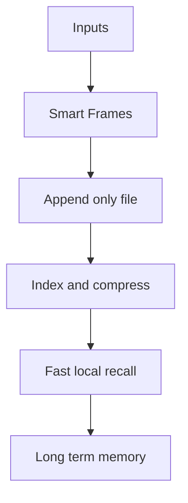
<sub>打分理由：Agent memory/RAG替代流水线，工程可用（core 8 / wide 7）</sub>

### 12. ⭐ 🧰 tigerless-labs/agent-memory
[GitHub](https://github.com/tigerless-labs/agent-memory) ★667 · infra · Python

**一句话**：agent-memory 用 Markdown 作为真源，给 Claude Code 和 Codex 共用本地长记忆。
**为什么值得你看**：很像能落地的 agent memory runtime，适合看工程取舍。

**核心架构**：它解决的场景很具体：agent 一关会话就忘，跨 Claude Code、Codex 和 shell 工具又各存各的，导致记忆分裂、迁移不了、还不便审计。它的核心设计是“文件系统是真源，SQLite 只是可删缓存”：记忆写成可 grep、可 git、可读的 Markdown，旁边的 local index 只负责 ranked retrieval；检索先给 L0 路径和摘要，再按需打开全文，避免把整段文本硬塞进上下文。系统里最关键的机制是边界触发写入和 sleep-time Manage：在会话边界自动整理、按价值遗忘，且删除只能以 proposal 形式进入，阻断的是“靠 agent 自觉写记忆导致漏写”和“索引坏了就丢知识”的失败。成熟度信号很强：有 pytest、ruff、mypy，README 明确写出 `mem recall`/`mem read`/`mem context`，还把 `.index` 说成可重建缓存。和同类相比，它更偏可审计、可迁移的本地 runtime，而不是单纯的向量检索封装。

- 强证据是测试与可重建缓存，而非只写 README
- 原文未明确公开更大规模基准
- 检索返回 path 而不是 pasted text，利于可审计
**为什么现在上榜**：原文未明确
**精读价值**：想看 agent memory 工程化，这个值得装着试。
**关联**：[[Memvid]]、[[RAG]]
#agent-memory #retrieval #storage · 难度：中等 · 建议：值得通读 (20 min)
前置：🔲 [[retrieval-augmented generation]] · 🔲 [[embedding]] · ◽ BM25 · 🔲 [[memory]]


<sub>打分理由：长程agent记忆运行时，方法可借鉴（core 8 / wide 5）</sub>

### 13. ⭐ 🧰 MirroS-Lab/Code-as-World
[GitHub](https://github.com/MirroS-Lab/Code-as-World) ★421 · Python

**一句话**：Code-as-World 用可执行代码建物理世界表征，配套 4B/9B 检查点与 QuantiPhy 评测。
**为什么值得你看**：适合看 agent/world-model 与物理推理怎么落地。

**核心架构**：它抓的是一个反直觉点：像素能“看见”现象，但不直接给出世界的 ontology，所以模型容易学到表面相关，却没法稳定解释和预测物理演化。现有纯视觉或纯文本推理，缺少一个能被执行、被验证的中间世界表示。作者把“code”定义成可执行的世界表示：代码里显式写状态、动力学和机制，外部观察只负责提供证据；系统通过 agentic discovery 在“模拟—验证—修正”的循环里逼近能生成观测的程序。最直接的证据是他们在 QuantiPhy 上发布 4B/9B checkpoint 和官方评测流程，说明改动不是只会讲概念，而是能被同一套基准直接跑出结果。新意主要在系统组织层：不是换一个 backbone，而是把物理监督从像素级重构改成可执行表征的发现流程。

- 最强证据是可直接跑 QuantiPhy 官方评测
- 原文未明确训练数据与搜索细节，复现难在发现循环
- 没证明通用到非物理推理场景
**精读价值**：值得看架构思路，精读看可执行表征怎么搜出来。
**关联**：[[NeRF]]、[[MuJoCo]]
#agent #world-model #reasoning · 难度：硬核 · 建议：建议精读
前置：◽ world model · 🔲 [[VLM]] · ◽ simulation

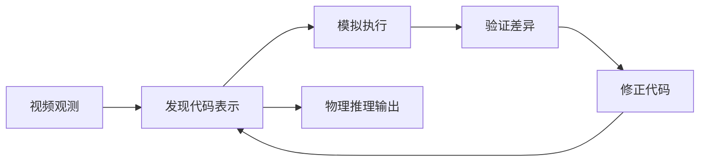
<sub>打分理由：物理推理的可执行世界表征，agent发现范式契合（core 8 / wide 6）</sub>

### 14. ⭐ 🧰 tinyhumansai/openhuman
[GitHub](https://github.com/tinyhumansai/openhuman) ★39,569 (+3709 本月) · Trending monthly · tool · Rust

**一句话**：OpenHuman 用本地优先记忆树和图式编排做个人 AI，v0.63.12 持续更新。
**为什么值得你看**：适合看 agent orchestration、memory、MCP 集成的工程取舍。

**核心架构**：它解决的是“助手知道很多工具，但记不住你、也跑不完长任务”的痛点。OpenHuman 把系统拆成两条承重链：Memory Tree 把邮件、文档、聊天压成本地 SQLite 里的分数化 Markdown 树，再镜像到 Obsidian，阻断的是黑箱 vector store 记忆不可审计的问题；orchestrator 这条链用 durable graph 跑 agent fleet，配合 approval gate、checkpoint 和 root-cause 回传，阻断的是长任务中途卡死后无法恢复的问题。它还加了 TokenJuice 先压缩工具输出，减少大上下文成本。成熟度信号很强：有明确版本 release、安装说明、模型路由、隐私模式和本地/云混合路径；但 README 里很多能力来自文档承诺，原文未明确给出系统测试或崩溃边界。相比一般个人助手，它的差异不在“会聊天”，而在 local-first memory + 可恢复执行图 + 大量 MCP 集成。

- 最强证据是公开 release 与完整安装/运行路径
- 承诺很多，原文未明确测试覆盖与失败边界
- 本地记忆与 durable graph 是核心卖点
**为什么现在上榜**：最近 release：v0.63.12（2026-08-07）；仓库同时强调一周内登顶 GitHub trending 九天。
**精读价值**：值得看项目成熟度和 agent 编排设计，不只看功能。
**关联**：[[ReAct]]、[[SWE-bench]]
#agent #local-first #memory · 难度：中等 · 建议：值得通读 (20 min)
前置：🔲 [[memory]] · 🔲 [[model context protocol]] · 🔲 [[planning]] · 🔲 [[multi-agent]]

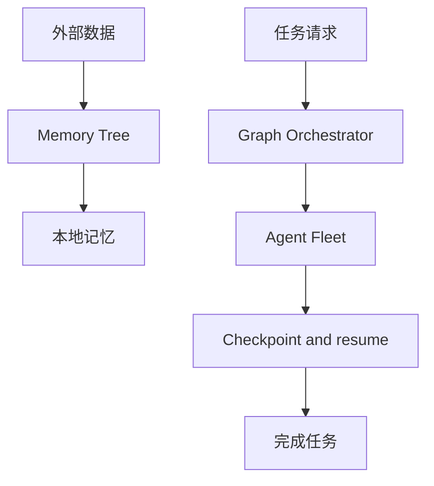
<sub>打分理由：本地first记忆与编排，贴合agent方向（core 7 / wide 6）</sub>

## 🌐 全领域热点

### 15. 🌐 🧰 anthropics/skills
[GitHub](https://github.com/anthropics/skills) ★175,411 (+2337 本周) · Trending weekly · skill · Python

**一句话**：Anthropic Skills 用动态加载的技能包，让 Claude 按任务装载指令和脚本。
**为什么值得你看**：适合看 agent 工具化和 task-specific instruction 的标准化方向。

**核心架构**：它针对的不是“模型不会做”，而是“同一个 agent 面对不同专业任务时，提示词和工具组织太脆”。Skills 的硬定义是：一组可动态加载的文件夹，里面放 instructions、scripts、resources，模型只在任务需要时装载它们，从而把特定流程变成可复用、可分发的能力。关键改变是把能力外置成 skill 包：skill 本身阻断的是临时 prompt 拼接带来的不稳定和不可复用；脚本与资源阻断的是纯文本指令无法可靠执行复杂工作流。最直接的证据不是榜单，而是仓库里公开了 spec、template 和大量示例 skill，并明确支持 Claude Code、Claude.ai 和 API；这说明它已经从概念进入产品化接口层。新意在系统组织层：把 agent 能力做成可安装、可发现、可版本化的“插件式技能”。

- 最强证据是 spec、template、示例和 API 接口齐全
- 它证明了可装载框架，不证明每个 skill 都稳
- 复现难点在生态与分发，不在单个 skill 写法
**精读价值**：看 skill 标准化思路即可，适合了解 agent 生态。
**关联**：[[ReAct]]、[[MCP]]
#agent #tool #instruction · 难度：入门 · 建议：看速览即可
前置：🔲 [[planning]] · 🔲 [[prompt injection]] · 🔲 [[tool use]]

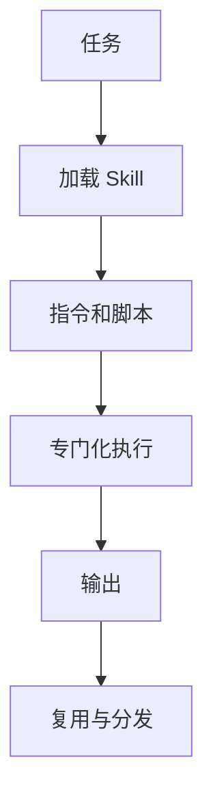
<sub>打分理由：Agent skills库，热度高但偏应用层（core 3 / wide 8）</sub>

### 16. 🌐 🧰 obra/superpowers
[GitHub](https://github.com/obra/superpowers) ★283,920 (+690 今日) · Trending daily · tool · Shell

**一句话**：用自动触发 skills 的 agent 工作流，把编码从先写后改变成先定 spec、再 TDD、再 subagent 执行
**为什么值得你看**：做 agent 框架/代码助手面试时很对口

**核心架构**：它瞄准的是一个反直觉场景：coding agent 一上来就写代码，结果 spec 漏洞、方案漂移、测试缺失一起爆。传统“给更长 prompt”挡不住，因为失败点不在能力不足，而在流程没有把需求澄清、设计确认、实现和复核分开。Superpowers 的关键改变是把“方法论”做成自动触发的 skills：先逼 agent 退回问目标，再把 spec 分块给人确认，之后输出足够保守的实施计划，最后把任务切给 subagent 循环执行和检查。组件的作用不是增功能，而是分别阻断“未对齐就开工”“计划不可执行”“单 agent 自顾自跑偏”三类失败。正文最直接的证据是它的 core workflow 描述和 release 里对 harness support、session-start hook、brainstorming 分级、plan conflict 继续推进的更新，这说明它把流程钉到了启动阶段和执行循环里。新意主要在系统组织层：不是一个 CLI 工具，而是把 agent 开发流程编码成可自动注入的工作法。

- 最强证据：启动即触发、分级脑暴、冲突可继续
- 没证明：并不展示真实代码任务的成功率
- 复现门槛高：依赖具体 harness 与插件生态
**精读价值**：适合看机制，不适合当论文细读
**关联**：[[ReAct]]、[[model context protocol]]
#agent #framework #workflow · 难度：中等 · 建议：值得通读 (20 min)
前置：◽ agent · 🔲 [[planning]] · 🔲 [[memory]] · ◽ TDD

```mermaid
graph TD
A 启动 agent --> B 识别建造任务
B --> C 先问目标
C --> D 分块确认 spec
D --> E 生成实施计划
E --> F subagent 执行
F --> G 检查与继续
G --> H 产出代码
```
<sub>打分理由：agent 技能框架+工程方法论，较可迁移（core 6 / wide 8）</sub>

### 17. 🌐 🧰 TauricResearch/TradingAgents
[GitHub](https://github.com/TauricResearch/TradingAgents) ★103,807 (+367 今日) · Trending daily · infra · Python

**一句话**：用多 agent 分工模拟交易公司，最新 v0.4.0 修掉回测看未来和记忆穿越问题
**为什么值得你看**：多智能体 + 金融回测，面试里很容易被问到

**核心架构**：它解决的是一个常见但容易被忽略的悖论：交易框架看起来决策很多、角色很全，但只要数据层有 look-ahead，回测结果就会比真实交易更乐观，整套多 agent 讨论都变成幻觉。旧做法通常只堆 analyst、trader、risk manager，却没把“什么时候信息变得可知”写进系统。作者这版最关键的改变是把 point-in-time 规则下沉到数据和 memory：FRED 宏观数据按 as-of date pin vintage，社媒内容裁到分析窗口，decision-log 只注入在交易日前已解决的经验，等于用数据时间戳和记忆门控去阻断未来信息泄漏。最直接的支持证据是 v0.4.0 的 changelog：专门修了 FRED、social sentiment、decision-log、OHLCV bar 等时间一致性问题，说明核心 bug 不在模型而在时序契约。新意主要在系统组织层和实证层：不是单纯多 agent，而是给交易代理系统补上可审计的时间边界。

- 最强证据：逐项修复 look-ahead 和记忆泄漏
- 没证明：不等于能稳定赚钱，作者也不这么承诺
- 复现难点：要同时管数据 vintage、缓存、回测时钟
**为什么现在上榜**：v0.4.0（2026-08-31）
**精读价值**：值得看它怎么防时间穿越，不必迷信收益
**关联**：[[ReAct]]、[[model context protocol]]
#agent #multi-agent #finance · 难度：中等 · 建议：看速览即可
前置：🔲 [[multi-agent]] · 🔲 [[memory]] · 🔲 [[retrieval-augmented generation]] · ◽ backtesting

```mermaid
graph TD
A 市场数据 --> B 时间对齐
C 社媒新闻 --> B
D 交易日期 --> E 记忆门控
B --> F 分析 agent
E --> F
F --> G 风控与交易
G --> H 回测与执行
```
<sub>打分理由：多智能体交易框架，工程与评测有参考（core 4 / wide 8）</sub>

### 18. 🌐 🧰 PostHog/posthog
[GitHub](https://github.com/PostHog/posthog) ★39,717 (+54 今日) · Trending daily · infra · Python

**一句话**：用 PostHog 把产品信号接成 self-driving 闭环，v0.61.324 继续加固 agent 安全与事件流
**为什么值得你看**：和 agent observability、MCP、产品闭环都强相关

**核心架构**：它解决的不是“有没有埋点”，而是“产品信号能不能直接驱动修复闭环”。纯 analytics 往往停在看板，真正的难点是把 error、rage click、failed query、session replay、flags、logs 这些异构上下文接到 agent，再让 agent 在受控权限下生成报告、PR 和工作流。PostHog 的关键改变是把 observability、decisioning 和 action 放到同一平台里：signals 进来后，self-driving mode 触发研究和修复；MCP 让 Claude Code、Cursor 等外部 agent 读取上下文；而最近 release 里又补了 agent 事件命名、授权头脱敏、未批准 widget tool call 阻断，说明它把“可操作性”建立在权限边界之上，不只是功能堆叠。最直接的证据是产品文档和最近 desktop / agent-skills release 的安全修复，能看出它在把 agent 运行时从可用推向可控。新意在系统组织层：把观测、分析、执行、审计合在一个闭环。

- 最强证据：self-driving + MCP + 审计/脱敏联动
- 没证明：自动修复仍依赖权限和人工复核
- 同类差异：不只是 observability，更是闭环执行
**为什么现在上榜**：desktop-v0.61.324（2026-09-09）
**精读价值**：适合关心 agent observability 的人看一眼
**关联**：[[model context protocol]]、[[ReAct]]
#observability #agents #analytics · 难度：中等 · 建议：值得通读 (20 min)
前置：🔲 [[model context protocol]] · 🔲 [[prompt injection]] · 🔲 [[memory]] · 🔲 [[planning]]

```mermaid
graph TD
A 产品事件 --> B 观测存储
B --> C agent 研究
C --> D 生成报告
D --> E 人工审核
E --> F PR 或工作流
B --> G 权限与审计
G --> C
```
<sub>打分理由：AI 可观测/实验/诊断平台，面试好用（core 4 / wide 8）</sub>

---
想精读哪一篇？在 Claude 里说：`精读 2026-09-09 第 N 条`，Jarvis 会按你的 known.md 只讲你不会的部分。