# Jarvis 日报 · 2026-09-10

候选 706 → 过滤后 321 → 入选 18。图例：⭐ 核心方向 · 🌐 全领域热点 · ✅ 已掌握前置 · 🔲 需补前置

## 📄 论文 · 核心方向

### 1. ⭐ 📄 Show-Harness: Just a VLM Agent Can Play Robots
arXiv [2609.10522](https://arxiv.org/abs/2609.10522) · HF 🔥 90 · Yanzhe Chen, Zechen Bai, Zhijun Cao 等 · [PDF](https://arxiv.org/pdf/2609.10522) · [代码](https://github.com/showlab/Show-Harness) ★125

**一句话**：Show-Harness 用语义动作接口把 VLM 直接接到机器人，零样本控 frontier 模型并让 2B 模型仅用几 GPU 小时微调也能跑。
**为什么值得你看**：很贴 LLM Agent+具身，面试能讲接口设计。

**核心架构**：反直觉点在于：VLM 明明懂物体、空间和任务分解，但一接机器人就常被迫学成“像素到电机”的黑箱，语义知识反而被压扁。作者的关键改法不是再堆更大 VLA，而是把控制重写成离散语义动作单元：VLM 只负责选“往哪一步、夹爪做什么”，embodiment-specific interpreter 再把这个单元确定性地落到局部机器人动作，阻断“语义先验被连续回归冲掉”的失败；同时 harness 还把多视角、proprioception、执行反馈塞回循环，让模型每步都能基于结果修正。最直接的证据是同一接口下，closed-source frontier VLM 能零样本控制机器人，且小型开源 VLM 只需少量 GPU-hours 微调就能在跨任务、跨 embodiment、跨环境上优于代表性 agentic/VLA 路线。新意主要在系统组织层：不是新 backbone，而是把“语义接口 + 解释器 + 闭环反馈”做成可复用 harness。

- 强证据是同接口覆盖零样本与轻量微调两种模式
- 没证明最优低层控制；离散动作过粗时可能受限
- 复现依赖真实机器人与实现好的解释器
**精读价值**：值得精读，核心是接口而不是模型。
**关联**：[[RT-2]]、[[OpenVLA]]
#vlm #robotics #embodied · 难度：中等 · 建议：建议精读
前置：🔲 [[VLM]] · 🔲 [[vision-language-action]] · 🔲 [[planning]] · 🔲 [[memory]]

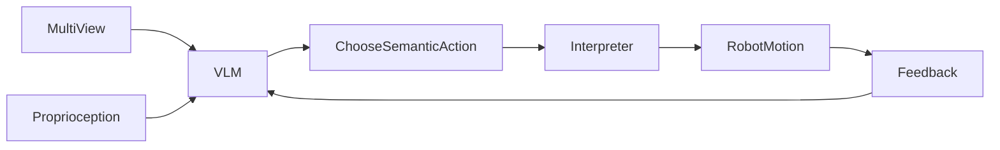
打分理由：VLM到机器人控制，Agent+VLM交叉强（core 9 / wide 7）

### 2. ⭐ 📄 SAEScientist-Bench: Can AI Agents Conduct Autonomous SAE Interpretability Research?
arXiv [2609.09113](https://arxiv.org/abs/2609.09113) · HF 🔥 16 · Yuqiao Tan, Shizhu He, Jun Zhao 等 · [PDF](https://arxiv.org/pdf/2609.09113) · [代码](https://github.com/Trae1ounG/SAEScientist) ★14

**一句话**：SAEScientist-Bench 用 20 个任务测 AI 能否用 SAE 做自动机制发现；最好 agent 也离专家挺远。
**为什么值得你看**：适合你面试讲 interpretability 和 agent eval。

**核心架构**：悖论是：agent 已经会写实验、跑代码，却未必会“做科学”——尤其在机制解释里，能找特征不等于能证明它真是那个概念。作者把问题改成一个可量化的科学任务：给定目标概念，agent 先写 contrastive probes，再在 Gemma Scope 的 131K+ SAE features 里搜索候选，最后用三件事判定好坏：activation rank 看是不是排得靠前，selectivity 看能否压住对照文本，steering 看能否真的因果控制输出。这个设计阻断的是“只会挑看起来相关的特征，却不会排除伪相关、不会做因果验证”的失败。最强证据不是平均分，而是分维度结果：顶级 agent 在 activation selectivity 上接近专家，但在 causal steering 明显掉队，且作者做的行为分析表明它们常误读实验测量。新意在实证层与评测层：把 autonomous mechanistic discovery 变成了可打分、可拆错的 benchmark。

- 强证据是三维评分，尤其 steering 与专家差距最大
- 没证明 agent 已具备稳定科学发现能力
- 复现门槛不低：要跑 SAE、特征字典和多轮 judge
**精读价值**：值得精读，能看清 agent 会不会做“白盒科学”。
**关联**：[[Gemma Scope]]、[[Neuronpedia]]
#agent #safety #evaluation #audit · 难度：硬核 · 建议：值得通读 (20 min)
前置：◽ Sparse Autoencoders · 🔲 [[contrastive learning]] · ◽ causal steering · 🔲 [[alignment]]

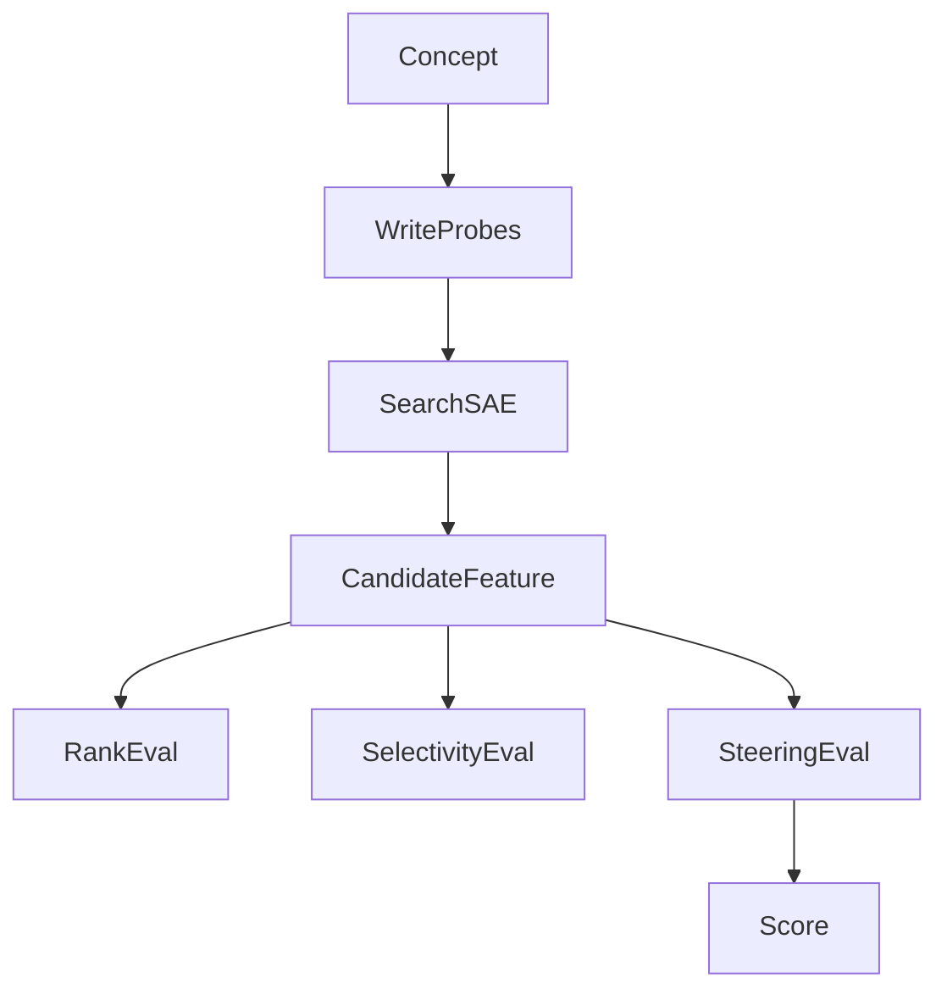
打分理由：面向研究智能体可验证审计协议，强相关。（core 9 / wide 5）

### 3. ⭐ 📄 AgentAudit: An Open, Extensible Framework for Full-Lifecycle Trust Evaluation of AI Agents
arXiv [2609.09875](https://arxiv.org/abs/2609.09875) · Shrey Nag,  Sachita, Abhishek Kumar Singh 等 · [PDF](https://arxiv.org/pdf/2609.09875)

**一句话**：AgentAudit 把 agent 全执行链做成审计框架，能按规划、工具、记忆等环节定位信任失败。
**为什么值得你看**：对 Agent 评测和安全很直接，面试可讲失败归因。

**核心架构**：原问题是：现有 benchmark 多半只看任务成败或安全鲁棒性，最多告诉你“挂了”，却说不清是 planner、tool use、memory 还是 execution integrity 哪一环出错。作者的关键改法是把评测对象从“最终答案”换成“完整 trace”：框架挂在 agent 外面，只读记录到的执行轨迹，不改内部实现，然后按 instruction integrity、planner、memory、tool selection、tool invocation、tool correctness、alignment、tool faithfulness、security、execution integrity 等维度做行为分类和 failure attribution，阻断“单点分数掩盖链路故障”的失败。最直接的证据是他们把五个模型放到九类能力和对抗任务里，能给出不同模型在 trust score 上的分层，并把问题归因到具体阶段。新意在系统组织层：不是再造一个任务集，而是把 agent 的可信性拆成可审计的生命周期框架。

- 强证据是能把失败归到具体 stage
- 没说明 judge model 偏差如何完全消除
- 更适合 trace 可得的 agent，不是纯黑盒 API
**精读价值**：值得通读，尤其关心 agent 安全与诊断。
**关联**：[[AgentBench]]、[[AgentDojo]]
#agent #evaluation #trust · 难度：中等 · 建议：值得通读 (20 min)
前置：🔲 [[planning]] · 🔲 [[memory]] · 🔲 [[ReAct]] · 🔲 [[prompt injection]]

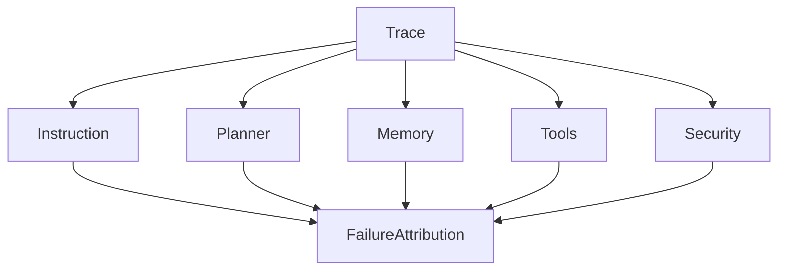
打分理由：全生命周期agent评测与归因，面试/复现价值高（core 9 / wide 6）

### 4. ⭐ 📄 Fortunate Recall: Ontology-Driven Memory Lifecycle Management for Persistent Coherence in LLMs
arXiv [2609.10413](https://arxiv.org/abs/2609.10413) · Ansuman Mullick, Eray Tüzün · [PDF](https://arxiv.org/pdf/2609.10413)

**一句话**：用 10+1 记忆本体论管生命周期，LifecycleBench 达 76.9%
**为什么值得你看**：适合做 agent memory 方向面试谈资

**核心架构**：反直觉点在于：记忆越多，LLM 不一定越稳，很多系统把“当前偏好”和“已过期事实”塞进同一个向量库，结果存储无限长、检索却更容易把旧内容捞上来。FR 的关键改变不是更强检索，而是先给事实做 behavioral ontology，再把生命周期规则写成确定性函数：类别决定衰减、替换、有效期和路由，阻断的是“统一保留策略把不同事实当成同一种失败”。LLM 只负责抽取元数据和少量候选筛选，真正的生命周期决策在纯数学层完成。最直接的证据是 LifecycleBench 上 FR-Bank 76.9%，高于 Mem0 61%、A-MEM 65.3%、Memory-R1 66.9%、MemoryOS 70.5%；更关键的是，长评测 LongMemEval-S 上 75.2% 说明这套规则没有明显牺牲常规检索。新意在组件层与实证层：把“记忆管理”从检索器升级为可组合的生命周期政策层，并证明标签粒度本身带来校准收益。

- LifecycleBench 直接打当前/过期区分
- 去掉 typed layer 后正确率几乎不变
- 代码与 benchmark 在补充材料，复现细节未完全公开
**精读价值**：值得精读，适合补齐 agent memory 的系统视角
**关联**：[[Mem0]]、[[MemoryOS]]
#memory #agent #rlaif · 难度：中等 · 建议：建议精读
前置：🔲 [[retrieval-augmented generation]] · 🔲 [[memory]] · 🔲 [[long context]] · 🔲 [[hallucination]]

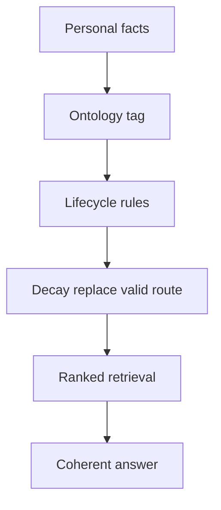
打分理由：面向个人人知的记忆生命周期管理，Agent必看（core 9 / wide 6）

### 5. ⭐ 📄 Kernel-Managed Shared Memory for System-Wide Personalization
arXiv [2609.10144](https://arxiv.org/abs/2609.10144) · Ryan Lum, Yongfeng Zhang · [PDF](https://arxiv.org/pdf/2609.10144)

**一句话**：用 kernel 管共享记忆，1,800 次试验提个性化并降延迟
**为什么值得你看**：多 agent 与系统架构面试很对口

**核心架构**：问题不是“能不能记住”，而是多 agent 里每个 agent 各自管记忆，结果同一用户的偏好、任务上下文和隐私规则被拆成几套逻辑，信息互相看不见。作者的核心改变是把 memory 从 application layer 挪到 agent-system kernel：agent 只写带标签的结构化记忆，kernel 统一负责写顺序、权限过滤、检索、排序和 prompt injection，阻断的是“每个 agent 自己决定见什么、怎么塞上下文”导致的泄露和重复逻辑。实验上最直接的是对比 unmanaged memory backend：在 GPT-4o、Llama-3.1:8B、Qwen-2.5:7B 上，kernel-managed retrieval/injection 的个性化分数提升 2.4–4.0 分，且比全量拼接上下文更短，端到端延迟下降 15–61%。新在系统组织层：不是新 memory 算法，而是把共享记忆定义成 kernel 级能力，并用统一运行时把隐私与注入绑定起来。

- 同底层存储下仍显著优于 Mem0
- 两模型上接近 full context 但更省 token
- 代码未见，成熟度主要靠论文实现描述
**精读价值**：值得看架构取舍，偏系统而非纯算法
**关联**：[[AIOS]]、[[Mem0]]
#memory #multi-agent #infra · 难度：中等 · 建议：值得通读 (20 min)
前置：🔲 [[memory]] · 🔲 [[multi-agent]] · 🔲 [[prompt injection]] · 🔲 [[retrieval-augmented generation]]

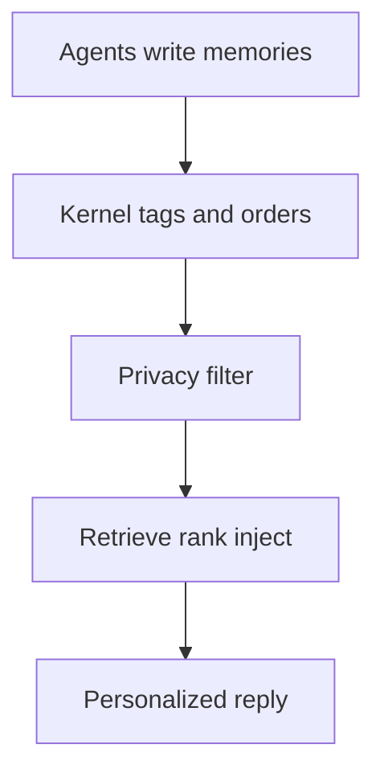
打分理由：内核托管共享记忆，Agent系统级基础设施高价值（core 9 / wide 7）

### 6. ⭐ 📄 Eliciting Weak-to-Strong Generalization with On-Policy Reverse Distillation
arXiv [2609.08798](https://arxiv.org/abs/2609.08798) · HF 🔥 84 · Youngrok Park, Sangmin Bae, Hojung Jung 等 · [PDF](https://arxiv.org/pdf/2609.08798) · [代码](https://github.com/raymin0223/on_policy_reverse_distillation) ★5

**一句话**：用 on-policy reverse distillation，让弱老师提速强学生
**为什么值得你看**：和 GRPO、distillation、post-training 直接相关

**核心架构**：反直觉点在于：弱 teacher 不该被学生“照着抄”，因为老师的最终策略里混着能力上限、参考策略偏置和训练痕迹，直接 matching 会把 ceiling 一起蒸给学生。OPRD 的关键改动是只取 teacher 相对 reference policy 的 policy shift，把学生在 student rollouts 上得到的 verifier-driven gradient 投影到这个 shift 方向并放大，阻断的是“teacher 作为独立目标”对学生优化方向的压制。它保留 stationary points，因为只是把已有梯度的一个分量正向重标定，而不是另起一个匹配损失。最强证据是在 successive model transfer 里：相同 rollout 下，OPRD 比 GRPO 少 33–67% updates 达到老师水平，早期 checkpoint 最高快 22.7 个百分点；在 multi-teacher consolidation 里也能用更少更新把四个小 teacher 合成一个更强 student。新意在优化层：把 distillation 从“拟合 teacher 输出”改成“用 teacher 的 post-training 轨迹加速 verifier RL”。

- 在 weak-to-strong 场景里仍能超过老师
- 改的是梯度方向，不是单纯加 KL 目标
- 有代码，且和 GRPO/MOPD 可直接对照
**精读价值**：值得精读，适合做后训练方法面试题
**关联**：[[GRPO]]、[[On-Policy Distillation]]
#rlhf #distillation #on-policy · 难度：硬核 · 建议：建议精读
前置：🔲 [[group relative policy optimization]] · 🔲 [[knowledge distillation]] · ◽ verifier · ◽ on-policy

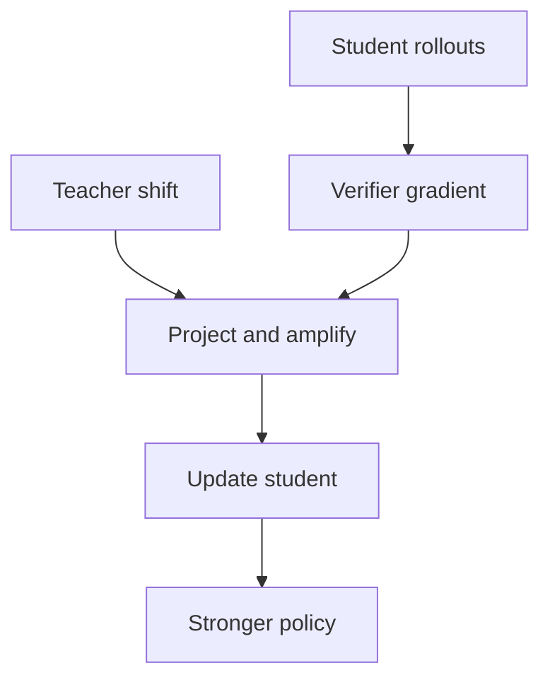
打分理由：on-policy反向蒸馏，weak-to-strong后训练相关（core 8 / wide 6）

### 7. ⭐ 📄 AgentGrad: Intervention-guided Prompt Optimization for Multi Agent Systems
arXiv [2609.08572](https://arxiv.org/abs/2609.08572) · HF 🔥 58 · Jaewon Chu, Jinwoo Seo, Jaewon Cho 等 · [PDF](https://arxiv.org/pdf/2609.08572)

**一句话**：AgentGrad 用 sequential intervention+文本梯度，五个 MAS 基准拿到 SOTA 并减少优化时间
**为什么值得你看**：适合看 MAS 提示优化的可解释改进点

**核心架构**：反直觉点在于：多智能体失败时，真正该改的常不是“总提示词”，而是某一个 agent 的局部行为；但旧 textual gradient 往往先拍脑袋选目标 prompt，再把不同失败原因的梯度硬拼一起，结果越改越泛化差。AgentGrad 的关键变化是两步：先用 sequential intervention 逐个 agent 注入修正，找出“改它才会修好”的 target agent，再用该 agent 的 intervention-adjusted output 作为 agent-level pseudo-label 提梯度；然后把语义相近的梯度聚成 semantic minibatch，再抽象成共享纠错模式，阻断“无关失败混合”。最直接的证据是五个 MAS benchmark 上同时超过 TextGrad 和 GEPA，并且 wall-clock 优化时间更短。新意主要在组件层和系统组织层：把梯度从“任务级反馈”推进到“agent 级归因”，再把聚合从随机拼接改成语义归并。

- 最强证据：5 个 MAS benchmark 上 SOTA
- 没证明通用性：仍依赖可注入的 intervention
- 复现门槛高：要能做 agent 级交互与归因
**精读价值**：值得精读：它补的是 MAS prompt 优化里最缺的归因环节
**关联**：[[TextGrad]]、[[GEPA]]
#multi-agent #optimization #prompt-gradient · 难度：硬核 · 建议：建议精读
前置：🔲 [[multi-agent]] · ◽ prompt optimization · ◽ textual gradient · ◽ agent-level supervision

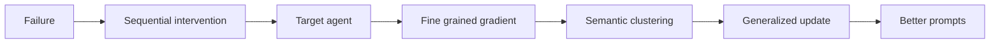
打分理由：多智能体prompt优化，和Agent训练相关（core 8 / wide 6）

### 8. ⭐ 📄 Procedural Graphs: Self-Evolving Execution Structures for LLM Agents
arXiv [2609.09153](https://arxiv.org/abs/2609.09153) · HF 🔥 28 · Yuxing Lu, Yicheng Chen, Shanchan Wu 等 · [PDF](https://arxiv.org/pdf/2609.09153)

**一句话**：Procedural Graph 把 agent 流程显式图化，自演化后优于记忆基线
**为什么值得你看**：适合看 agent 规划结构怎么从文本记忆升级到可编辑图

**核心架构**：反直觉点在于：长程 agent 不是只缺“更多记忆”，而是缺一套能约束“什么步骤能接什么步骤”的程序结构；否则历史越长，越容易顺序错乱、反复试错、目标漂移。Procedural Graph 的硬定义是把 procedural knowledge 组织成 (procedure, relation, procedure) 的有向图：节点是动作/状态/推理步骤，边是允许的转移和条件。在线时，它先根据当前 trajectory 定位 active node，再把局部子图翻译成 step-level guidance，给下一步动作加偏置但不强行决定；离线时，LLM refiner 对比失败与成功轨迹，编辑拓扑和属性，只有在验证集不掉点时才提交，失败编辑保留为负约束，阻断重复犯错。最直接的证据是：从最小 skeleton 起步，也能长成接近或超过手工图的结构，并且自演化还能修复有缺陷的 expert prior。新意主要在系统组织层：把“流程”做成可检索、可编辑、可自我演化的外部结构。

- 最强证据：自演化可追平或超过手工设计图
- 没证明什么：图结构质量依赖验证门控
- 复现难度中高：要实现轨迹定位与图编辑闭环
**精读价值**：值得精读：它把 agent 的 procedural memory 变成了可学习的图
**关联**：[[ReAct]]、[[self-reflection]]
#agent #tool-use #planning-structures · 难度：硬核 · 建议：建议精读
前置：🔲 [[ReAct]] · 🔲 [[planning]] · 🔲 [[memory]] · 🔲 [[multi-agent]]

打分理由：Procedural Graph约束长程工具调用，贴agent核心（core 8 / wide 6）

## 🧰 项目 · 核心方向

### 9. ⭐ 🧰 NVIDIA/Megatron-LM
[GitHub](https://github.com/NVIDIA/Megatron-LM) ★17,839 (+32 今日) · Trending daily · infra · Python

**一句话**：Megatron-LM 是 NVIDIA 的大规模 Transformer 训练底座，持续加 MoE 和并行优化
**为什么值得你看**：看训练系统热点和面试常谈的分布式训练栈

**核心架构**：它解决的是“模型一大，训练就被通信、显存和并行切分卡死”的工程痛点。核心不是功能清单，而是把 Megatron Core 做成可组合的训练积木：Transformer building blocks、TP/PP/DP/EP/CP 并行、BF16/FP8/FP4 混精、以及面向 MoE 的路由和 dispatch 优化。最近 release 里最值得注意的是 Quantile Balancing router，用无辅助损失的 routing bias 做 load balancing；还有 packed-sequence MoE dispatch 和 fused shared-expert MLP，都是在减少 MoE 的路由、拼包和计算碎片。成熟度信号比较强：有连续 release、开发文档、PyPI 安装和 Megatron Bridge 做 HF↔Megatron checkpoint 转换。和同类相比，它更偏“GPU 训练底层实现+性能优化”，而不是纯研究代码。

- 最强证据：持续 release 且覆盖新 MoE/优化器
- 没证明什么：README 主要讲能力，需看 docs 才知边界
- 复现难度高：依赖多卡、通信栈和 NVIDIA 生态
**为什么现在上榜**：最近 release：core_v0.19.0（2026-08-19），并持续加入 DeepSeek-V4、MoE 和新优化器支持
**精读价值**：值得关注：它是训练系统面试和大模型工程的高频底座
**关联**：[[Megatron-LM]]、[[Megatron Core]]
#training #distributed #transformer · 难度：中等 · 建议：值得通读 (20 min)
前置：🔲 [[mixture of experts]] · 🔲 [[data parallel]] · 🔲 [[ZeRO]] · 🔲 [[bf16]]

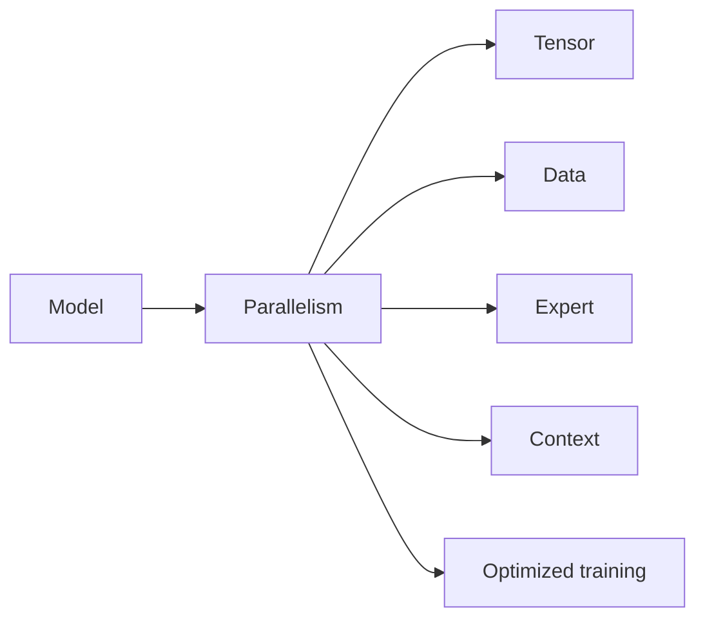
打分理由：大规模训练框架必看，训练系统核心。（core 8 / wide 8）

### 10. ⭐ 🧰 Continuum-AI-Corp/OrcaReplay
[GitHub](https://github.com/Continuum-AI-Corp/OrcaReplay) ★215 · infra · TypeScript

**一句话**：用分层录制/回放复现 agent 运行，做到 byte-for-byte 重放并可从第4步分叉到新模型
**为什么值得你看**：做 agent 调试、评测和 harness 面试很对口

**核心架构**：它解决的反直觉点是：agent 出错时，问题往往不在最后一次模型输出，而在前面某个工具调用、文件写入或 shell 退出码；而传统 observability 只告诉你花了多少 token，不能把“那一条转错的分支”复原。OrcaReplay 的关键改变是把抓取层放到 agent 下面：proxy 看见重发的整段对话，PATH shim 看到命令退出码与流，MCP tee 看到协议边界，shadow git index 记录每步工作区，fetch hook 补住硬编码 origin；每一层都在阻断“运行态信息丢失”，所以 replay 才能 offline 且 byte-for-byte。最直接的证据是 quickstart 里同一录制能在无网络、无模型调用下重放，并从 checkpoint 4 fork 到两个模型后用 `tsc --noEmit` 重新判优。新意主要在系统组织层：不是做一个更好的 trace viewer，而是把 agent debugging 变成可分叉、可回放、可比较的运行记录。

- 最强证据：录制后可离线逐字节重放
- 没证明通用沙箱能力；外部 socket 仍漏
- 复现依赖代理/环境变量/真实 agent
**精读价值**：值得看机制，不只是看界面
**关联**：[[LangSmith]]、[[OpenTelemetry]]
#agent-debugging #tracing #evaluation · 难度：中等 · 建议：值得通读 (20 min)
前置：🔲 [[prompt injection]] · 🔲 [[ReAct]] · 🔲 [[MCP]] · 🔲 [[KV cache]]

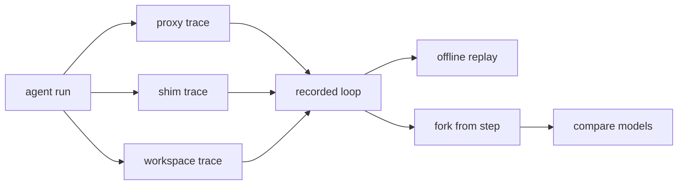
打分理由：agent可回放调试，面试高相关（core 8 / wide 6）

### 11. ⭐ 🧰 NVIDIA-NeMo/Switchyard
[GitHub](https://github.com/NVIDIA-NeMo/Switchyard) ★2,826 (+2617 本月) · Trending monthly · infra · Python

**一句话**：用算法路由层把每次 LLM 调用分给更便宜的模型，v0.2.0 重做为 Rust server + libsy
**为什么值得你看**：LLM 推理系统/网关设计和面试都很对口

**核心架构**：它面对的悖论是：同一个 agent 一会儿只需要便宜模型补全，一会儿又必须上强模型；如果把路由写死在 harness 里，就会把 transport、credentials、retries 和策略耦死。Switchyard 的关键概念是把“选模型”抽成 provider-neutral 的 `Algorithm`：它只决定要调哪些 semantic model target、顺序如何、结果怎么合并；真正的 HTTP 调用仍由你的 gateway 或 proxy 执行，所以可以嵌进 NeMo Relay、LiteLLM，或直接起 standalone proxy。最直接的支持来自 README 的三种接入路径和 v0.2.0 重设计：把 orchestration、protocol translation、model transport、serving 拆开，说明它不是功能堆叠，而是把路由作为独立运行时。它新在系统组织层，组件层则是“决策层”和“执行层”解耦。

- 最强证据：同一策略可嵌入网关或独立代理
- 原文未明确在线评测数据，只强调架构重做
- pre-alpha，API 和配置仍可能变
**为什么现在上榜**：最近 release：v0.2.0（2026-08-10）
**精读价值**：适合看路由架构，不适合直接上生产
**关联**：[[LiteLLM]]、[[vLLM]]
#routing #llm #inference · 难度：中等 · 建议：值得通读 (20 min)
前置：🔲 [[mixture of experts]] · ◽ LLM gateway · ◽ OpenAI API · ◽ Anthropic API

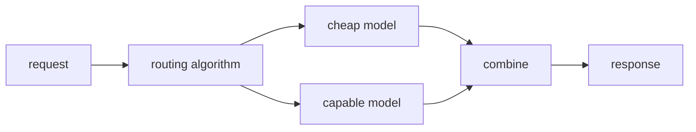
打分理由：模型路由+基准/成本优化，偏LLM系统（core 7 / wide 7）

### 12. ⭐ 🧰 whiteguo233/OpenBiliClaw
[GitHub](https://github.com/whiteguo233/OpenBiliClaw) ★3,278 (+1617 本月) · Trending monthly · tool · Python

**一句话**：用本地多源抓取 + 画像记忆做跨平台内容发现，v0.3.220 已同步三端发布
**为什么值得你看**：Agent/RAG/个性化推荐和本地数据闭环都很贴你的方向

**核心架构**：它解决的场景是：你在不同平台留下的兴趣信号彼此割裂，平台推荐只优化平台目标，最后把你困在单站点信息茧房里。OpenBiliClaw 的关键做法不是“搜更多内容”，而是先在本地把行为、反馈、对话沉淀成持续更新的画像，再用这个画像去跨平台主动找内容；也就是说，画像是驱动检索的控制层，推荐不是被动召回。正文里最能说明机制的是它把 B 站、小红书、抖音、YouTube、X、知乎、Reddit、微博、GitHub 和 Web 都接进同一套本地 SQLite 与插件/桌面端闭环，并且支持把同一后端装进 DeepSeek Harness，让 Agent Bridge 工具参与推荐与反馈回路。成熟度信号较强：有 release、桌面端、浏览器插件、Docker、CI 和多渠道分发；但 README 里“心理画像、MBTI、五层灵魂画像”等核心推断细节原文未明确，更多是产品叙事。它在系统组织层的价值最大，和普通内容聚合器的差别是本地闭环与跨平台画像。

- 最强证据：多端 release 同步，且本地 SQLite 闭环
- 画像推断细节原文未明确，像产品叙事多于方法论文
- 复现依赖各平台接入与账号态，工程面较重
**为什么现在上榜**：最近 release：openbiliclaw-v0.3.220（2026-09-09）
**精读价值**：看作成熟项目速览即可，重点在产品形态
**关联**：[[ReAct]]、[[retrieval-augmented generation]]
#agent #rag #multi-source · 难度：中等 · 建议：值得通读 (20 min)
前置：🔲 [[retrieval-augmented generation]] · 🔲 [[memory]] · 🔲 [[multi-agent]] · 🔲 [[model context protocol]]

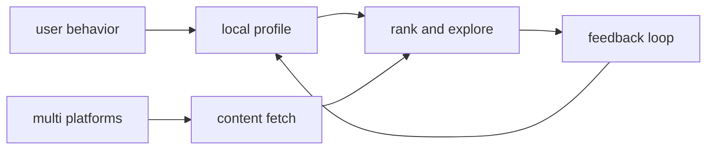
打分理由：本地first内容发现agent，带插件能力（core 7 / wide 6）

### 13. ⭐ 🧰 JustVugg/colibri
[GitHub](https://github.com/JustVugg/colibri) ★27,387 (+130 今日) · Trending daily · infra · C

**一句话**：纯 C 推理引擎把 744B MoE 跑在存储层级上，消费者硬件可用
**为什么值得你看**：和 MoE 推理、KV cache、量化强相关，面试好讲

**核心架构**：它解决的反直觉点是：超大 MoE 不是先把模型塞进显存再谈推理，而是把 VRAM、RAM、NVMe 当成同一套 inference hierarchy。否则 frontier 模型一遇到显存不够就只能拒跑，或者偷偷改精度/路由语义。Colibrì 的关键变化是“重量级权重按需流动”：routing heat 驱动 per-layer LRU、热权重 pin、以及 one-layer-ahead prefetch，用来阻断重复 workload 上的频繁磁盘抖动；I/O 侧用 batched expert unions、`O_DIRECT`、双 SSD striping 和 compute overlap，阻断专家流式加载把 decode 卡死；异构执行把 CPU/CUDA/Metal/NUMA 统一到一个 runtime，阻断不同机器只能跑固定后端。最直接的证据是它在 web dashboard 里把 744B GLM-5.2 跑到 4 tok/s、TTFT 1.6 s、disk 0，说明不是“能启动”而是能把全部专家常驻到更快层。新意主要在系统组织层，不是单个 kernel：它把存储、调度、路由、解码放进同一个可测的推理系统里。

- 最强证据：744B 模型可在 6×RTX 5090 上跑到 4 tok/s
- 没证明通用最优；作者也承认历史预取会过拟合
- 复现门槛高：纯 C、零依赖，但依赖具体硬件与 SSD 行为
**为什么现在上榜**：recent release v1.10.2，修了 1.10.1 里 GLM-5.3-Flash 转换容器被误量化的问题
**精读价值**：值得看系统设计与推理边界，精读可学多层存储思路
**关联**：[[vLLM]]、[[flash attention]]
#moe #inference #engine · 难度：硬核 · 建议：建议精读
前置：🔲 [[MoE]] · 🔲 [[KV cache]] · 🔲 [[quantization]] · 🔲 [[speculative decoding]]

打分理由：纯C稀疏/MoE推理引擎，工程可复现。（core 7 / wide 6）

### 14. ⭐ 🧰 alphaXiv/OpenResearch
[GitHub](https://github.com/alphaXiv/OpenResearch) ★966 (+185 今日) · Trending daily · infra · Rust

**一句话**：用本地工作区并行跑研究 agent，自动做文献 试验 产物
**为什么值得你看**：适合看 agent 编排和研究工作流，面试可讲

**核心架构**：它解决的痛点是：研究 agent 不是只会写一轮计划，而是要同时跑多个方向、保留每次实验的证据链。OpenResearch 的核心是 local-first workspace + 独立 git worktree：每个 research direction 一个隔离会话，避免互相污染；实验树把每次 run 绑定到不可变 commit 归档，阻断“结果出来了但不知道改了什么”；日志、diff、文件、artifact 都挂在同一条 lineage 上，阻断证据散落在聊天记录里。运行时它不是线性流水线，而是“多 agent 并行探索 + 共享实验树”的循环组织：proposal → code change → run → inspect evidence → decide next step。成熟度信号比较清楚：有 CLI、桌面端、文档、release 和可下载二进制，且支持本地、SSH、Slurm、Kubernetes、Ray 等多种 compute。和一般 agent 框架相比，它更强调可追溯实验而不是单次回答。

- 最强证据：支持独立 worktree 与不可变实验归档
- 没证明 agent 智能更强，主要证明工作流更可控
- 复现容易：CLI 和 desktop app 都可直接安装
**为什么现在上榜**：recent release v0.1.122，且 0.1.120 到 0.1.122 连续更新
**精读价值**：值得看 agent 工程化，适合判断能否落地研究工作流
**关联**：[[ReAct]]、[[SWE-bench]]
#agent #research #orchestration · 难度：中等 · 建议：值得通读 (20 min)
前置：🔲 [[planning]] · 🔲 [[memory]] · 🔲 [[multi-agent]] · 🔲 [[model context protocol]]

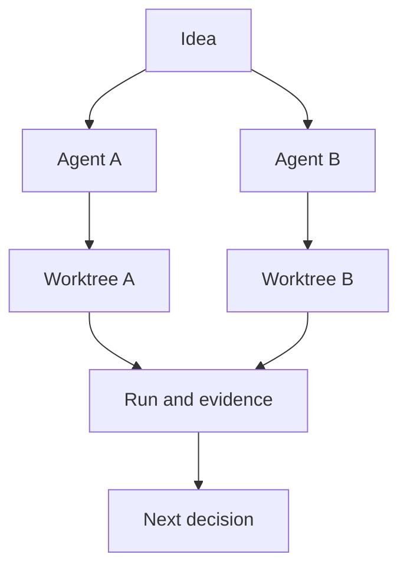
打分理由：多agent并行研究，贴近agent范式（core 7 / wide 6）

## 🌐 全领域热点

### 15. 🌐 📄 What LLM Trading Agents Actually Do in Production: A Six-Month, Population-Scale Record from Two Fleets
arXiv [2609.05663](https://arxiv.org/abs/2609.05663) · HF 🔥 18 · T. J. Barton, Chris Constantakis, Patti Hauseman 等 · [PDF](https://arxiv.org/pdf/2609.05663) · [代码](https://github.com/ProjectDXAI/continuous-record-llm-trading-agents) ★92

**一句话**：用 6 个月生产级记录拆解 LLM 交易 agent，发现收益几乎没有
**为什么值得你看**：agent 评测和生产行为研究，面试很容易问到

**核心架构**：它先指出一个悖论：策略文字写得很漂亮，但在真实交易里，决定行为的往往不是“想法”，而是 slider、候选列表渲染、下单路径这些 operating layer。作者把问题从“模型会不会交易”改成“系统界面怎样塑形行为”：风险 slider、候选榜单边界、订单通路会直接改变杠杆、选标和退出方式，阻断了把失败归因到 prompt 的错误解释；相反，单看策略文本无法解释 60% 以上的方差。最强证据不是某个回测涨幅，而是两个层面：一是 risk slider 对 leverage 的稳定解释、leaderboard cutoff 的 regression discontinuity；二是 416 个 captured production scenarios 的 paired-replay 里，不同 frontier models 的决策质量统计上几乎分不出差别，说明在这个 horizon 上，模型家族不是主导因素。新意主要在实证层和系统层：它把“agent 绩效”拆成可归因的操作层机制，而不是再做一个 leaderboard。

- 最强证据：6 个月、7.5M 次调用、约 30 万 onchain action
- 没证明更强模型就能赚钱；相反各模型决策质量接近
- 条件敏感：这是交易域生产系统，结论不自动外推到通用 agent
**精读价值**：值得精读，能学到生产 agent 评测怎么做
**关联**：[[ReAct]]、[[SWE-bench]]
#agent #production #measurement #tool-use · 难度：硬核 · 建议：建议精读
前置：🔲 [[planning]] · 🔲 [[memory]] · 🔲 [[multi-agent]] · 🔲 [[prompt injection]]

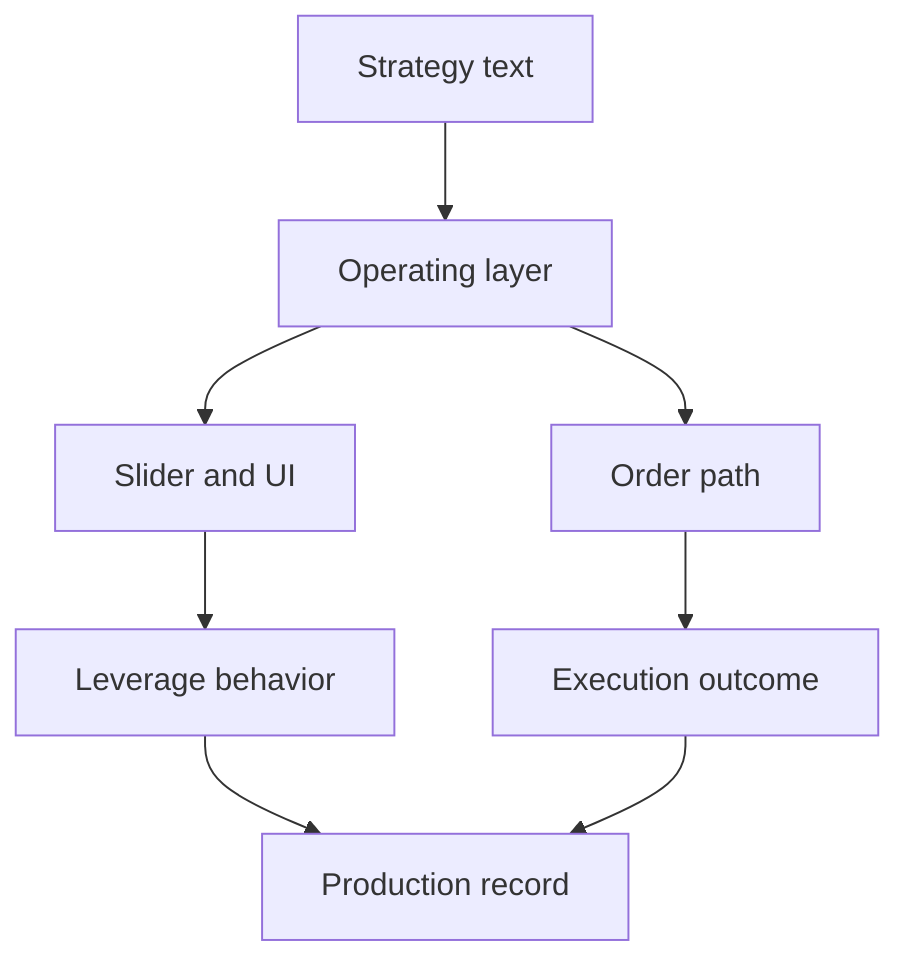
打分理由：生产级LLM交易agent测量，顶级观察数据（core 8 / wide 9）

### 16. 🌐 📄 AuK Technical Report: An Open-Source Foundational Model for Speech Generation and Editing
arXiv [2609.08936](https://arxiv.org/abs/2609.08936) · HF 🔥 198 · Ziyang Ma, Zhikang Niu, Wenming Tu 等 · [PDF](https://arxiv.org/pdf/2609.08936) · [代码](https://github.com/Tencent-Hunyuan/AuK) ★331

**一句话**：AuK 用统一音频指令接口做语音生成与编辑，靠 3.03B 样本和 4 步 AuK-Flash 达到 4.5× 加速。
**为什么值得你看**：覆盖语音生成、编辑与后训练，适合做多模态/语音面试谈资。

**核心架构**：反直觉点在于：语音系统里，‘生成一段说话’和‘按指令改一段音频’通常要两套模型，前者看自然度，后者看编辑保真，目标冲突时还容易互相拖累。AuK 的关键改变是把自然语言指令和音频上下文做成统一入口，再用三层分工阻断不同失败：MLLM 负责语义条件，避免只改声学不改内容；joint-trained VAE 把 speech、general audio、music 压到同一声学表征，避免跨任务特征断裂；hybrid rectified-flow Transformer 先 dual-stream MMDiT 再 single-stream DiT，先保留语义/声学分路，再在生成末端合流，减少编辑时“改过头”或“改不动”。最直接的证据是图 1 里 general speech editing 和 zero-shot/instruction-controlled speech generation 同时领先，而不是只在单一子任务刷高分。新意主要在系统组织层：把生成、编辑、增强/分离、paralinguistic 和 acoustic editing 统一进一套数据、训练和推理框架。

- 作者报告 3.03B 指令-音频样本、1.95M 小时监督
- AuK-Flash 4 步推理且无 CFG，4.5× wall-clock 加速
- 未证明对长音频、极端噪声或跨语种编辑都稳
**精读价值**：值得精读，关键在统一接口如何支撑多任务语音编辑。
**关联**：[[VoiceCraft]]、[[AudioLDM]]
#audio #generation #foundation-model · 难度：硬核 · 建议：建议精读
前置：🔲 [[VLM]] · 🔲 [[diffusion model]] · 🔲 [[flow matching]] · 🔲 [[knowledge distillation]]

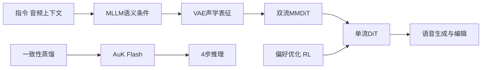
打分理由：语音生成/编辑统一接口，开源权重且热度高（core 6 / wide 8）

### 17. 🌐 🧰 microsoft/markitdown
[GitHub](https://github.com/microsoft/markitdown) ★182,399 (+4549 本周) · Trending weekly · tool · Python

**一句话**：MarkItDown 把 PDF/Office/音频等转成 Markdown，面向 LLM 预处理，近期发到 v0.1.8b1。
**为什么值得你看**：RAG/文档 ingestion 基础件，面试能讲清数据入口。

**核心架构**：它解决的是真实痛点：文档源格式太杂，直接喂给 LLM 会把标题、列表、表格这些结构弄丢，后面检索和切分都变脏。MarkItDown 的承重组件是‘格式适配器 + 结构保留型转 Markdown’：针对 PDF、PPT、Word、Excel、图片、音频、HTML、ZIP 等分别转换，把输出尽量压成 Markdown 的标题、列表、表格和链接，方便下游 text analysis pipelines 用统一文本入口处理；可选插件再把 OCR、Azure Content Understanding 这类能力挂上去，检测到对应格式或外部服务可用时才启用。成熟度信号很强：GitHub stars 18.2万，近期连续 release，README 里给了安装、CLI、插件和安全注意事项，说明不是演示仓库而是可直接落地的 ingestion 工具。想要“把任意文件喂给 LLM”，它比纯 textract 更偏结构保留，比自己堆解析器更省维护。

- 最强证据是多格式 + 插件 + 安全提示齐全
- 没证明高保真还原视觉版式，目标也不是这个
- 复现门槛低，主要是集成与格式覆盖
**为什么现在上榜**：v0.1.8b1（2026-09-04）；v0.1.7（2026-07-29）；v0.1.6（2026-05-26）
**精读价值**：值得看速览，适合当 RAG 入口工具记住。
**关联**：[[textract]]、[[unstructured]]
#document #ingestion #rag · 难度：入门 · 建议：看速览即可
前置：🔲 [[retrieval-augmented generation]] · 🔲 [[embedding]] · 🔲 [[reranker]]

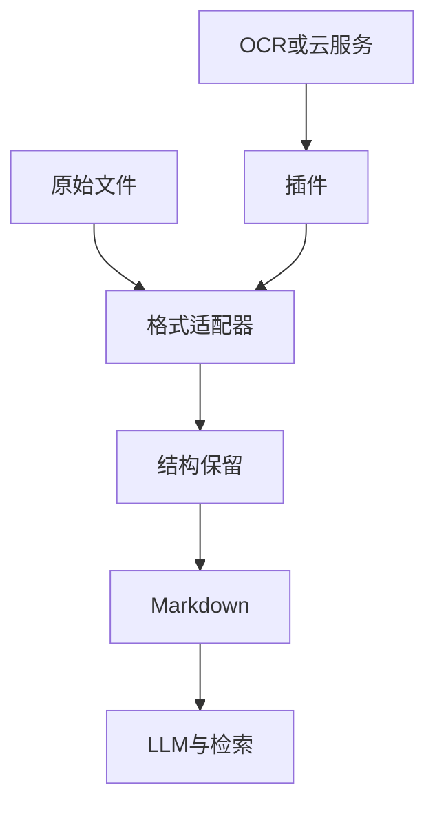
打分理由：文档转Markdown工具，利于RAG数据管线（core 3 / wide 7）

### 18. 🌐 🧰 diegosouzapw/OmniRoute
[GitHub](https://github.com/diegosouzapw/OmniRoute) ★64,084 (+591 今日) · Trending daily · infra · TypeScript

**一句话**：OmniRoute 用单一网关接 352 家模型提供方，做 quota-aware fallback 和 4.5× token 压缩。
**为什么值得你看**：LLM infra 热点，适合讲 routing、MCP 和成本控制。

**核心架构**：它解决的痛点很具体：你在 Claude Code、Cursor、Copilot 这些工具里切模型时，真正卡住的不是‘有没有模型’，而是多个 provider 的配额、价格、上下文和失败重试要手工管理。OmniRoute 的核心是一个 AI gateway：对外暴露统一 endpoint，内部根据模型可用性、免费额度和路由规则做 auto fallback；当 quota 见底或某 provider 不可用时，切到其他后端，避免任务中断。v3.8.50 里又加了 quota-aware scheduling、live telemetry 和 Modality Bridge，把文本、vision、audio、video 统一进同一入口，说明它不是简单代理，而是路由 + 监控 + 多模态适配的运行时。成熟度信号不错：作者给了版本节奏、变更统计、Docker/NPM、兼容多种 CLI，而且强调零配置可用。和同类代理比，它差异在“免费 tier 编排 + 多工具兼容 + 可观测的配额控制”，不是单纯转发请求。

- 作者报告 352 providers、1312 unique chat model IDs
- 新加入 quota-aware scheduling 与 live telemetry
- 没证明低延迟稳定性优于自建直连网关
**为什么现在上榜**：最近 release：v3.8.50（2026-08-26）；radar-export-latest（2026-08-20）；v3.8.49（2026-07-30）
**精读价值**：适合速览，主要看路由和配额编排思路。
**关联**：[[LiteLLM]]、[[OpenRouter]]
#inference #routing #mcp · 难度：中等 · 建议：看速览即可
前置：🔲 [[model context protocol]] · 🔲 [[KV cache]] · 🔲 [[speculative decoding]]

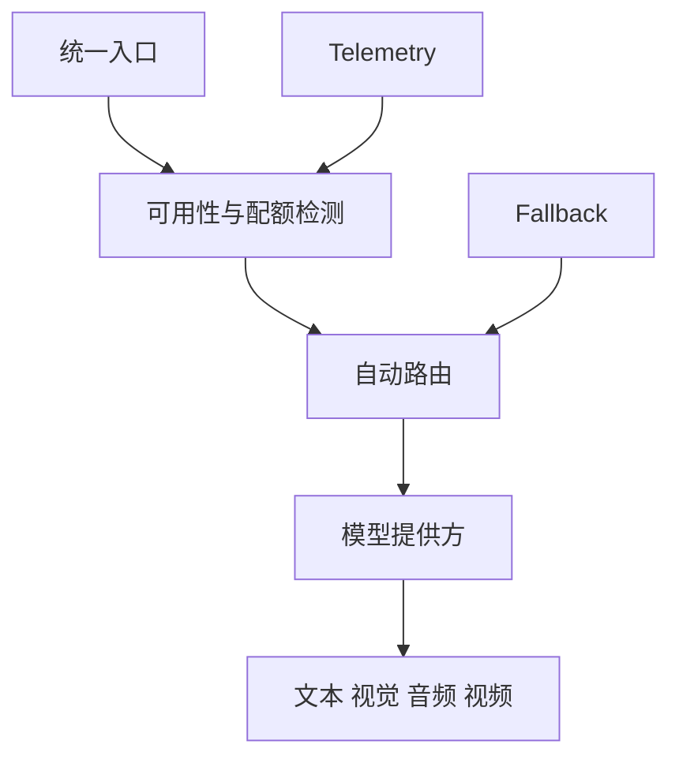
打分理由：多模型网关/路由很热，但偏基础设施整合。（core 2 / wide 7）

---
想精读哪一篇？在 Claude 里说：`精读 2026-09-10 第 N 条`，Jarvis 会按你的 known.md 只讲你不会的部分。