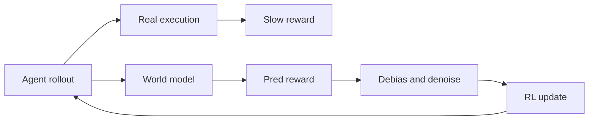
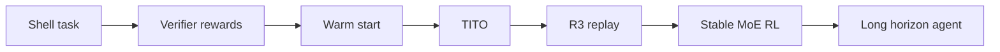
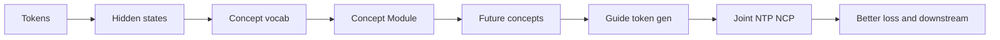
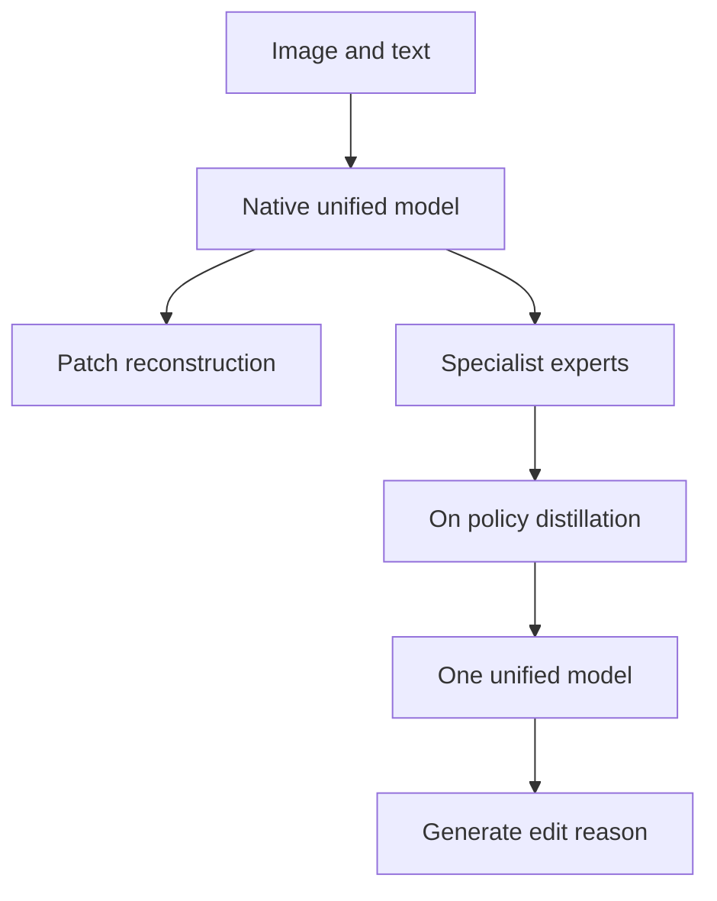
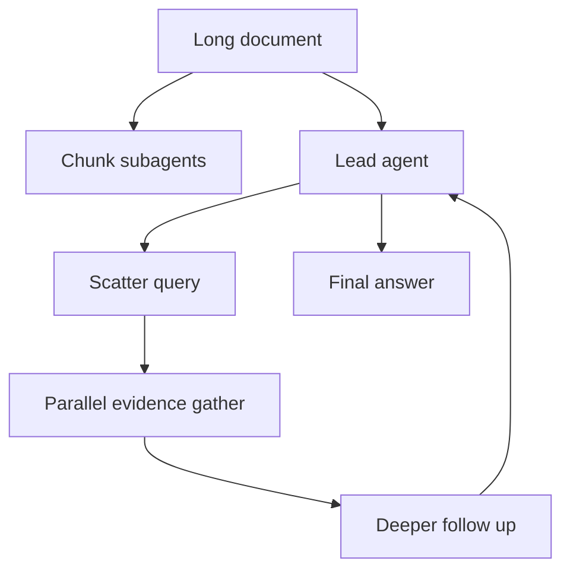
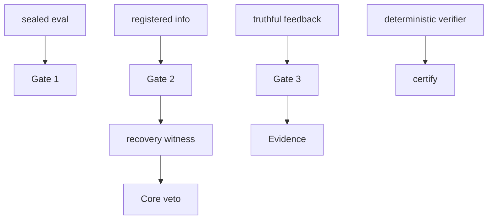
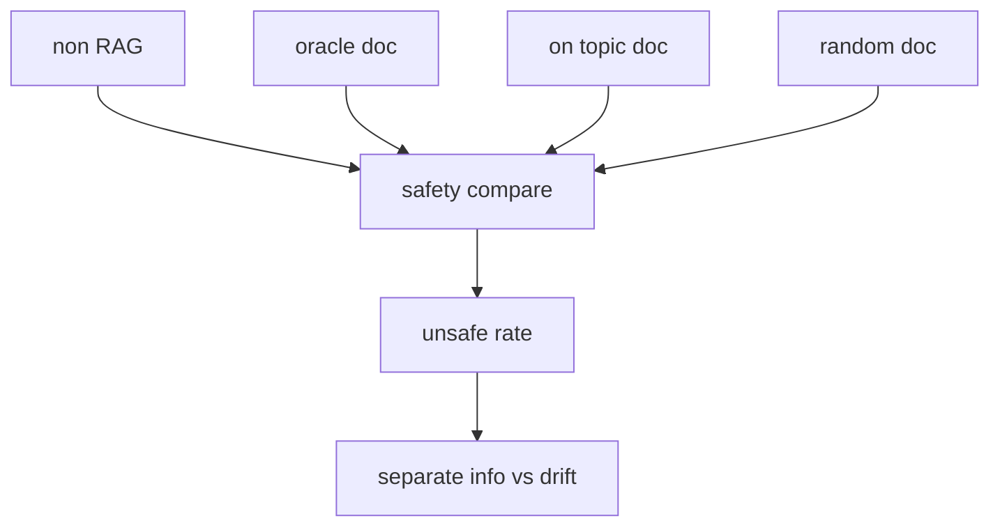
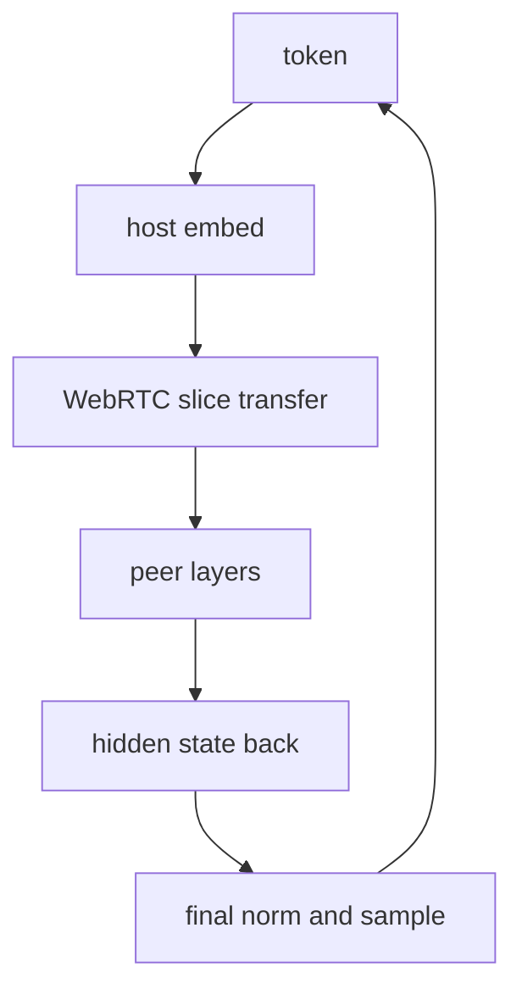
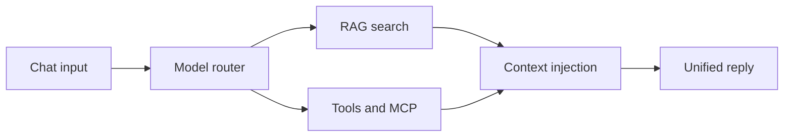

# Jarvis 日报 · 2026-09-11

候选 694 → 过滤后 301 → 入选 18。图例：⭐ 核心方向 · 🌐 全领域热点 · ✅ 已掌握前置 · 🔲 需补前置

## 📄 论文 · 核心方向

### 1. ⭐ 📄 Scaling Automatic Research Agents via World Models
arXiv [2608.12564](https://arxiv.org/abs/2608.12564) · HF 🔥 435 · Xiyuan Yang, Sheikh Sarwar, Jingru Cheng 等 · [PDF](https://arxiv.org/pdf/2608.12564) · [代码](https://github.com/xiyuanyang45/WMRL) ★7

**一句话**：用 world model 替代真实执行，把 AutoResearch RL 提速 3–4x
**为什么值得你看**：做 agent 后训、科研自动化都绕不开

**核心架构**：反直觉点在于：AutoResearch 里最贵的不是 LLM 生成，而是每条 trajectory 的真实环境执行；生成能靠 batching 摊薄，执行却要独占 sandbox 和 GPU 时间，trajectory 一多就先卡死在环境侧。作者的关键改法是把“执行结果”改成 world model 预测的奖励信号，先把重资产的真实跑实验换成几次前向传播；但因为这个信号会有 bias 和 noise，又加了 Online Debiasing 去校正系统性偏差、Inverse-Variance Denoising 去压方差，分别阻断“伪奖励把策略往错方向推”和“噪声放大梯度不稳定”。最直接的证据是：在多种 AutoResearch 任务和两种 agent 规模上，训练速度作者报告提升 3–4x，同时性能超过标准 RL baseline；更强的证据是 4B/9B post-trained agents 还能打赢更大的 48B/120B 开源 agent。新意主要在系统组织层：不是换一个 reward model，而是把 RL 的瓶颈从执行层搬到可批处理的模拟层，并配套证明收敛界变好。

- 最强证据是 3–4x 加速且不掉点
- world model 有偏差时会误导梯度
- 要复现得先有可拟合的执行模拟器
**精读价值**：值得精读，核心是把 agent RL 的瓶颈重构了
**关联**：[[model-based RL]]、[[RLHF]]
#agent #auto-research #world-model #rl · 难度：硬核 · 建议：建议精读
前置：🔲 [[reward model]] · ◽ policy gradient · 🔲 [[retrieval-augmented generation]] · ◽ world model


<sub>打分理由：自动科研agent扩展与world-model/后训练关键矛盾（core 10 / wide 7）</sub>

### 2. ⭐ 📄 T1: Terminal Agent Reinforcement Learning for Long-Horizon Tasks
arXiv [2609.11042](https://arxiv.org/abs/2609.11042) · HF 🔥 46 · Junyao Yang, Yucheng Shi, Zhongzhi Li 等 · [PDF](https://arxiv.org/pdf/2609.11042)

**一句话**：T1 用 122B MoE RL 跑 300+ tool turns，Terminal-Bench 2.1 达 64.0%
**为什么值得你看**：终端 agent、长程工具调用、MoE 稳定性都很相关

**核心架构**：反直觉场景是：terminal agent 的任务越长，越不是“会不会用工具”的问题，而是 300+ turn 后训练和推理分布开始漂移，MoE 还会把采样时的 expert 路由和训练时对不上，直接把 actor-critic 搞不稳。作者的关键改法有两层：先用 aggressively warm-start 和 dense process reward，让每一步都被“通过了多少 verifier”密集打分，缓解长 horizon 下稀疏终局奖励的信用分配失败；再用 TITO 把训练改成 exact sampled token identifiers，并在 turn 边界做 drift repair，同时用 R3 记录 rollout 时每个 MoE layer 的 token-level expert choice 并在训练时 replay，阻断“训练时看到的 token / 路由”和采样时不一致导致的 loss 漂移。最直接的证据不是单纯大涨分，而是 TITO + R3 把 training-to-inference log-prob gap 从 0.021 压到 0.013，并实现 loss region zero token drift；结果上 122B 的 T1 在 Terminal-Bench 2.1 达到 64.0%，并在 Long-Horizon Terminal Bench 上超过 GPT-5.4 和 GLM-5.1。新意主要在组件层和系统层：把 MoE RL 的稳定训练细节系统化了。

- 最强证据是 gap 降到 0.013 且零 token drift
- 长 horizon 下 sparse reward 仍是主要难点
- MoE 路由 replay 复现门槛高
**精读价值**：值得精读，长程 agent 与 MoE RL 细节很硬
**关联**：[[PPO]]、[[Terminal-Bench]]
#agent #tool-use #rl #moe · 难度：硬核 · 建议：建议精读
前置：🔲 [[Mixture of Experts]] · ◽ actor-critic · 🔲 [[reward model]] · 🔲 [[planning]]


<sub>打分理由：长程terminal agent RL+300+回合shell验证器（core 10 / wide 8）</sub>

### 3. ⭐ 📄 Mr.LHDR: A Benchmark for Multimodal Real-World Long-Horizon Deep Research Agents
arXiv [2609.11318](https://arxiv.org/abs/2609.11318) · Minghao Guo, Meng Cao, Sui Zhao 等 · [PDF](https://arxiv.org/pdf/2609.11318) · [代码](https://github.com/minghaoguo20/Mr-LHDR-eval)

**一句话**：Mr.LHDR 用 12.1 步依赖链测深度研究，最强系统 OA 43.1%
**为什么值得你看**：适合看深研究 agent 的真实短板和评测坑

**核心架构**：问题不在“能不能搜到事实”，而在多模态研究里一旦前面某步出错，后面的依赖链会整段塌掉；现有 benchmark 多是 3 步左右的中短链条，根本测不出状态维护和跨模态桥接能力。作者的关键改法是把任务定义成 hidden Node-Relation graph 下的短答案推理：每题平均要 12.1 个必要中间结论、依赖深度 10.4，而且至少含一个会改变推理状态的非文本证据；评测上不只看 final answer，还看 Checklist、Strict Accuracy 和 Dependency-Aware Checklist Score，专门抓“最后答对但中间链条缺失”的情况。最直接的证据是强系统的 OA 和 SA 差得很大：GPT-5.5 的 OA 43.1% 但 SA 只有 34.3%，o3 Deep Research 也只有 32.4% / 19.6%；去掉图片后 DACS 下降 12.6 分，说明多模态证据真的参与了链条。新意主要在实证层：它不是新模型，而是把 long-horizon deep research 的失败模式量化出来。

- 最强证据是 OA 和 SA 大幅脱节
- 去掉图片 DACS 降 12.6 分
- 只评 final answer 会高估能力
**精读价值**：值得通读，主要看评测设计而非模型技巧
**关联**：[[MM-BrowseComp]]、[[BrowseComp]]
#agent #benchmark #multimodal · 难度：中等 · 建议：值得通读 (20 min)
前置：🔲 [[retrieval-augmented generation]] · 🔲 [[VLM]] · 🔲 [[planning]] · 🔲 [[memory]]


<sub>打分理由：长链依赖研究型多模态agent评测，强对齐核心（core 9 / wide 7）</sub>

### 4. ⭐ 📄 NCP-ArchPreview Technical Report: Moving towards Latent Space Language Models through Next Concept Prediction
arXiv [2609.10715](https://arxiv.org/abs/2609.10715) · HF 🔥 152 · NCP Team, Jiaqi Cao, Chiyu Chen 等 · [PDF](https://arxiv.org/pdf/2609.10715)

**一句话**：用 NCP+latent space 训练 8.9B，51.3% tokens 达到 OLMo-3-7B 终损失
**为什么值得你看**：适合看 LLM 预训练新范式和面试架构题

**核心架构**：先有个反直觉点：同样做自回归预训练，只预测 next token 可能把“局部字词模式”学得很好，却不一定逼模型形成跨多个 token 的稳定概念表示。作者的关键改变是把训练目标从 token 层扩到 concept 层：先用 hidden states 构造 product quantized concept vocabulary，再加一个 Concept Module 去预测未来 concept，并把这些预测回灌到 token 生成里。这样，NCP 不是替代 NTP，而是用更难的中间目标阻断“只记表面上下文”的失败模式，同时保留标准生成能力。最直接的证据是受控实验：随着 latent architecture 和 NCP objective 逐步加入，训练损失和下游分数都阶梯式改善；其中最强信号是只用 51.3% 训练 tokens 就达到 OLMo-3-7B 的最终 pretraining loss。新东西主要在组件层：concept vocabulary、Concept Module 以及 token 与 concept 的双层联合训练。

- 51.3% tokens 达到对照终损失
- GSM8K +5.99，说明不只像素级拟合
- 无代码，复现成本高且细节未全开
**精读价值**：值得精读，能看清 latent LM 的核心取舍
**关联**：[[latent diffusion]]、[[Mixture of Experts]]
#lm #latent-space #concept-prediction · 难度：硬核 · 建议：建议精读
前置：🔲 [[pretraining]] · 🔲 [[next-token prediction]] · 🔲 [[knowledge distillation]] · 🔲 [[scaling laws]]


<sub>打分理由：从next-token到概念级预测的范式，适合面试讲清（core 8 / wide 6）</sub>

### 5. ⭐ 📄 SenseNova-U1.5: Towards Native Unified Visual Intelligence
arXiv [2609.11929](https://arxiv.org/abs/2609.11929) · HF 🔥 120 · Haiwen Diao, Jiahao Wang, Chenjing Ding 等 · [PDF](https://arxiv.org/pdf/2609.11929) · [代码](https://github.com/OpenSenseNova/SenseNova-U1)

**一句话**：SenseNova-U1.5 用 8B-MoT 做 encoder-free 统一视觉模型，支持理解与生成
**为什么值得你看**：适合看 VLM 统一建模和 on-policy distillation

**核心架构**：它解决的是一个常见矛盾：很多 VLM 会把理解、生成、编辑拆成不同栈，结果文本渲染、结构化生成和局部编辑彼此打架。作者的关键设计是 encoder-free、VAE-free 的 native unified architecture，再用 spatially coherent patch reconstruction 强化视觉接口，避免图像信息先被压成一个过度损失细节的中间表示。训练上，他们把高层能力拆成专门 expert，再用 multi-expert on-policy distillation 把这些 expert 的能力合到一个模型里，阻断“单一模型同时学所有视觉技能而互相干扰”的失败模式。最直接的支持来自生成/编辑与 structured visual instruction 的评测：在 image fidelity、text rendering、multi-reference editing 和 interleaved generation 上全面提升，而且在训练数据里结构化格式曝光有限的情况下，仍能泛化到长而复杂的视觉指令。新意在系统组织层：不是单点模块，而是 native unified 训练与 post-training 合流方案。

- 8B-MoT，且宣称 encoder-free、VAE-free
- on-policy distillation 是能力合并核心
- 代码已开，成熟度高于纯报告
**精读价值**：值得看，尤其关心统一多模态路线的人
**关联**：[[Flamingo]]、[[LLaVA]]
#vlm #multimodal #moe · 难度：中等 · 建议：值得通读 (20 min)
前置：🔲 [[VLM]] · 🔲 [[diffusion model]] · 🔲 [[on-policy distillation]] · 🔲 [[Mixture of Experts]]


<sub>打分理由：原生视觉智能+多专家on-policy distillation，且有代码线索（core 8 / wide 7）</sub>

### 6. ⭐ 📄 PARSER: Read in Parallel, Reason in Depth for Long-Context LLM Agents
arXiv [2609.06702](https://arxiv.org/abs/2609.06702) · HF 🔥 17 · Kun Li, Zexuan Qiu, Tianhua Zhang 等 · [PDF](https://arxiv.org/pdf/2609.06702) · [代码](https://github.com/cuhk-parser/PARSER) ★7

**一句话**：PARSER 把长文阅读并行化，4B 在 896K 上比序列记忆基线高 12 分
**为什么值得你看**：很对你做 agent、长上下文和推理系统面试

**核心架构**：反直觉点在于：长文 QA 的瓶颈不一定是上下文不够大，而是证据位置和阅读顺序绑死了推理深度。序列记忆 agent 一边读一边压缩，导致早到的 chunk 只能在信息不完整时被判断，证据放哪、先后顺序怎样、彼此距离多远都会影响答案；同时每个 chunk 依赖上一步，延迟线性增长。PARSER 的关键改变是把 reading 和 reasoning 解耦：subagents 只负责并行看各自 chunk，lead agent 只负责迭代 scatter-gather 式推理。它阻断的失败模式是“单次顺序压缩带来的位置偏置和不可并行性”。最强证据是控制实验：独立扰动 evidence position、order、distance 后，序列方法波动很大，而 PARSER 基本平；同时在 896K tokens 上 4B 版本比最强 sequential baseline 高 12 分，并把延迟压到最多 11x 更低。新东西在系统组织层：推理循环 + 冻结中间件，而不是更大的记忆单元。

- 896K 上比基线高 12 分
- 对位置、顺序、距离扰动更稳
- 训练只动 lead agent，复现逻辑清晰
**精读价值**：值得精读，适合学长上下文 agent 的结构解耦
**关联**：[[MemAgent]]、[[DeepSeek-V4-Pro]]
#agent #long-context #inference #memory · 难度：硬核 · 建议：建议精读
前置：🔲 [[ReAct]] · 🔲 [[planning]] · 🔲 [[memory]] · 🔲 [[long context]]


<sub>打分理由：并行读+深推理的长上下文代理架构PARSER（core 8 / wide 6）</sub>

### 7. ⭐ 📄 Scores Alone Do Not Prove Discovery: The Discovery Certification Protocol for Auditing AI Research Agents
arXiv [2609.09219](https://arxiv.org/abs/2609.09219) · HF 🔥 16 · Jingjie Ning, Shanshan Zhong, Xiaochuan Li 等 · [PDF](https://arxiv.org/pdf/2609.09219) · [代码](https://github.com/cxcscmu/Discovery-Certification-Protocol)

**一句话**：用 DCP 审计 AI research agent 的“发现”可证性，给出 Core/Evidence 两类判定
**为什么值得你看**：适合你看 agent 评测与研究可信性

**核心架构**：反直觉点在于：一个 agent 跑出高分，并不能证明它“发现”了新东西，因为同样结果可能来自已知路线、公共信息或反馈巧合。DCP 的关键改法是把“结果分数”拆成可执行的 recovery 证据：Gate 1 只验 sealed eval 的有效提升；Gate 2 给新 challenger 相同起始信息和网页内容，但遮住目标研究历史，任何能到达同一数值目标的合法方法都生成 recovery witness，直接否掉 Core。也就是说，Core 不是看“能不能复现分数”，而是看“在受控信息边界内是否仍可恢复”。最直接的证据是两组 controlled audit：SQLite optimization 和 virtual catalyst control 都在 96 episodes 里零 recoveries，给出上界 0.0468；再配套 truthful vs neutral 的 30 对回收/0 对中性，证明 Evidence 还能单独刻画反馈效应。新意主要在系统组织层：把 outcome recovery、finite-sample bound、feedback effect 分成两层证据语言，而不是继续用单一 benchmark 分数说话。

- 最强证据：96 轮零 recovery，上界 0.0468
- 没证明：跨领域通用性仍靠作者定义的边界
- 复现难点：要冻结证据包并做无 LLM verifier
**精读价值**：值得精读，核心是新的审计范式
**关联**：[[SWE-bench]]、[[Proof-of-Learning]]
#agent #evaluation #certification · 难度：硬核 · 建议：建议精读
前置：◽ agent · ◽ evaluation · ◽ recovery witness · 🔲 [[finite-sample bound]]


<sub>打分理由：发现过程的可审计认证协议DCP（core 8 / wide 5）</sub>

### 8. ⭐ 📄 RAG-Safety-Bench: Reliable Evaluation of Retrieval-Augmented LLM Safety
arXiv [2609.11758](https://arxiv.org/abs/2609.11758) · Adithiyan Rajan Indira Saravanan, Kathleen C. Fraser · [PDF](https://arxiv.org/pdf/2609.11758)

**一句话**：用四种检索条件评测 RAG 安全，定位是检索信息还是上下文漂移
**为什么值得你看**：RAG 安全评测和 jailbreak 机制很相关

**核心架构**：反直觉点在于：RAG 明明能减少 hallucination，但一接检索，模型反而可能更容易输出有害内容。作者先把常见混淆项拆掉：不是先比 retriever 质量，而是固定成四个条件——non-RAG、oracle harmful doc、on-topic 相关但无答案、random safe doc——这样才能看清安全退化到底来自“答案被看见”、还是“有害主题上下文把模型带偏”。关键概念是把“安全”拆成能力与拒答两件事：oracle 条件里拒答更像 guardrail；random 条件里拒答可能只是找不到答案，不等于真安全。最直接的支撑是五个开源模型上的对比：论文报告 benign capability 和 unsafe behavior 之间存在反向关系，而且 baseline safety guardrails 并不保证 RAG 场景下的下游安全。新意在实证层：不是新模型，而是把 RAG 安全的因果因素做了可分离的 benchmark 设计。

- 最强证据：四条件拆分消掉 retriever 混淆
- 没证明：结论依赖英语有害查询与所选模型
- 复现难点：要统一安全标注器与文档集
**精读价值**：值得看实验设计，bench 价值大于方法
**关联**：[[RAG]]、[[MIRAGE]]
#rag #safety #benchmark · 难度：中等 · 建议：值得通读 (20 min)
前置：🔲 [[retrieval-augmented generation]] · 🔲 [[hallucination]] · 🔲 [[alignment]] · 🔲 [[prompt injection]]


<sub>打分理由：RAG安全评测基准，直接对齐RAG/安全方向（core 8 / wide 6）</sub>

## 🧰 项目 · 核心方向

### 9. ⭐ 🧰 Nehanth/swarmllm
[GitHub](https://github.com/Nehanth/swarmllm) ★245 · infra · JavaScript

**一句话**：用 WebGPU + WebRTC 把 27B 模型切到多设备浏览器里，Qwen 3.8 27B 达 10.7 tok/s
**为什么值得你看**：分布式推理和浏览器端系统很适合面试谈

**核心架构**：它解决的是“单台设备装不下大模型，但房间里很多设备加起来够”的现实痛点。核心搭法不是简单把请求转发，而是把模型按 layer 切成 slices，浏览器 tab 之间用 WebRTC 直连传 10 KB hidden state；host 负责首尾，peer 只跑各自层段。运行时的关键取舍有两个：一是 prefill 和 decode 分开优化，prefill 用 GEMM 提速，decode 走 multi-token-prediction speculative decoding，让网络往返一次承载多个 token；二是 bit-exact 优先，所有优化都被 golden tests 门控，speculative 路径和 plain decoding 输出一致。成熟度信号很强：有 v0.2.0 release、bench log、e2e room emulator、GPU test 和明确的威胁模型。作者报告 Qwen 3.8 27B 在 MacBook+iPhone 同 Wi‑Fi 上 10.7 tok/s；同机 GB10 上 speculative 16.1 tok/s，已经接近原生 llama.cpp。相较 Petals/exo，它的差异维度是“零安装、浏览器内、跨网 WebRTC”。

- 最强证据：v0.2.0 实测 27B 达 10.7 tok/s
- 没证明：跨公网、异构弱设备稳定性原文未充分量化
- 复现难点：要 WebGPU、WebRTC、模型文件和黄金测试
**为什么现在上榜**：最近 release：v0.2.0（2026-09-07）
**精读价值**：值得装，成熟度和新颖性都够
**关联**：[[Petals]]、[[llama.cpp]]
#distributed-inference #webgpu #peer-to-peer · 难度：中等 · 建议：值得通读 (20 min)
前置：🔲 [[KV cache]] · 🔲 [[speculative decoding]] · ◽ WebGPU · ◽ WebRTC


<sub>打分理由：点对点分布式推理WebRTC/WebGPU，相关度高（core 9 / wide 7）</sub>

### 10. ⭐ 🧰 apify/apify-mcp-server
[GitHub](https://github.com/apify/apify-mcp-server) ★6,781 (+3552 本月) · Trending monthly · infra · TypeScript

**一句话**：用 MCP 把 8,000+ Apify Actor 接进 agent，做网页抽取与自动化；支持 OAuth 和托管端点
**为什么值得你看**：适合看 agent/tool-use 与 MCP 生态落地

**核心架构**：这是一个典型的“agent 会说但不会抓”的悖论：模型能规划查询，却一碰到社媒、地图、搜索结果这类强反爬站点就卡在工具缺口。作者的关键改变不是再做一个爬虫，而是把 Apify Store 的 Actor 统一包装成 MCP tool，让 agent 通过 `https://mcp.apify.com` 直接调用现成 scraper/crawler；托管端点、OAuth、Streamable HTTP 把“连接工具”这一步从本地脚本改成可复用的中间层，阻断了客户端兼容性差、鉴权复杂、工具发现困难这类失败。最直接的证据是 README 明确支持 Claude.ai、VS Code、Cursor，并强调托管版有本地 stdio 没有的 structured Actor output schema inference。新意主要在系统组织层：不是发明抽取算法，而是把海量外部能力变成 agent 可发现、可支付、可切换的工具市场。

- 最强证据是托管 MCP + OAuth + 动态 Actor 调用
- 没证明抽取质量本身优于单独爬虫
- 复现门槛低，主要看 MCP 客户端接入
**为什么现在上榜**：最近 release：v0.15.7（2026-09-11）
**精读价值**：看它怎么把工具生态接到 agent 上
**关联**：[[MCP]]、[[ReAct]]
#mcp #agent #tool-use · 难度：中等 · 建议：值得通读 (20 min)
前置：🔲 [[model context protocol]] · 🔲 [[ReAct]] · ◽ tool-use

```mermaid
graph TD
A agent
B MCP server
C Actor store
D website tasks
E structured output
A --> B
B --> C
C --> D
B --> E
```
<sub>打分理由：面向智能体的工具/数据抽取基础设施（core 7 / wide 7）</sub>

### 11. ⭐ 🧰 Tencent/WeKnora
[GitHub](https://github.com/Tencent/WeKnora) ★22,315 (+815 本周) · Trending weekly · tool · Go

**一句话**：用 RAG+ReAct+MCP 做企业知识平台，作者报告 v0.8.0 加了长期记忆与技能沙箱
**为什么值得你看**：适合看 RAG/agent/wiki 三者怎么拼成系统

**核心架构**：它解决的是一个反直觉场景：企业知识库不是“问答一次就完”，而是要把文档、工具调用、权限、记忆和 Wiki 维护放进同一套闭环里。WeKnora 的关键改变是把入口拆成三种工作模式：RAG 负责快速问答，ReAct agent 负责多步检索与工具编排，Wiki Mode 负责把原始文档沉淀成可编辑、可回滚的知识页；再用 cross-session memory 记住用户偏好和任务，用 sandbox 承接需要执行环境的技能，从而阻断“每次查询都重新推理、长任务上下文断裂、知识无法持续维护”的失败。最直接的支持来自 v0.8.0 / v0.7.2 更新：作者报告加入了 session-persistent Docker/E2B/Cube sandbox、`search_memory`、tenant skill catalog、chunk edit 与 revision history。新意主要在系统组织层和实证层：它不是单点 RAG，而是把知识生产、执行、权限和审计串成企业级闭环。

- 最强证据是长期记忆、沙箱、Wiki 维护被放进同一系统
- 没证明在公开 benchmark 上显著优于普通 RAG
- 工程复杂度高，复现要处理多数据源与权限
**为什么现在上榜**：最近 release：v0.8.0（2026-09-03）
**精读价值**：值得看系统编排，不是只看检索模块
**关联**：[[RAG]]、[[ReAct]]
#rag #agent #wiki · 难度：硬核 · 建议：建议精读
前置：🔲 [[retrieval-augmented generation]] · 🔲 [[ReAct]] · 🔲 [[memory]] · 🔲 [[model context protocol]]

```mermaid
graph TD
A query
B RAG answer
C ReAct agent
D memory
E wiki mode
F sandbox
A --> B
A --> C
C --> D
C --> F
C --> E
E --> A
```
<sub>打分理由：RAG+自主推理+自维护Wiki，贴近LLM应用与评估。（core 7 / wide 6）</sub>

### 12. ⭐ 🧰 nashsu/llm_wiki
[GitHub](https://github.com/nashsu/llm_wiki) ★18,646 (+640 今日) · Trending daily · tool · TypeScript

**一句话**：用增量式 wiki 取代一次性 RAG；作者报告支持双步 ingest、图谱与 MCP
**为什么值得你看**：适合面试讲知识库架构取舍

**核心架构**：它针对的不是“检索不准”本身，而是传统 RAG 每次回答都要从头拼上下文，知识不会沉淀、也不方便人工修订。LLM Wiki 的核心改变是把文档库拆成 Raw Sources、Wiki、Schema 三层：先离线把来源编译成带 `wikilink`、frontmatter 和 `index.md` 的持久 wiki，再在查询时从这层知识库读，而不是直接对原文做临时检索；两步 ingest 先分析再生成，阻断“边读边写导致结构混乱”和“源文改了后 wiki 无法追踪”的失败。最直接的支持是作者报告的双步 Chain-of-Thought ingest、chunk/source revision history、folder tree、source-grounded retrieval，以及 Rust backend agent + MCP server。新意主要在系统组织层：把 RAG 变成可持续维护的知识工件，而不是查询时的临时拼接。

- 最强证据是增量 wiki、修订历史、source-grounded 查询
- 没证明比普通 RAG 在事实正确率上全面领先
- 对工作流要求高，适合愿意维护知识库的人
**为什么现在上榜**：最近 release：v0.6.11（2026-08-25）
**精读价值**：想讲“RAG 之后的知识沉淀”可以精读
**关联**：[[RAG]]、[[Obsidian]]
#rag #agent #knowledge · 难度：中等 · 建议：值得通读 (20 min)
前置：🔲 [[retrieval-augmented generation]] · 🔲 [[chain-of-thought]] · 🔲 [[embedding]] · 🔲 [[MCP]]

```mermaid
graph TD
A raw sources
B two step ingest
C wiki pages
D query
E source grounding
A --> B
B --> C
D --> C
C --> E
E --> D
```
<sub>打分理由：持续构建持久知识库，贴合RAG/Agent（core 7 / wide 6）</sub>

### 13. ⭐ 🧰 lyogavin/airllm
[GitHub](https://github.com/lyogavin/airllm) ★34,153 (+87 今日) · Trending daily · tool · Jupyter Notebook

**一句话**：AirLLM 用层流式加载把 70B 压到单卡 4GB，新增训练后 125B 可<6GB
**为什么值得你看**：你关心推理加速和低显存部署

**核心架构**：反直觉点是：大模型不是一定要整模型常驻显存，真正卡住的是权重同时驻留。AirLLM 的关键改法是把 frozen weights 留在磁盘、按层流进来算，GPU 只保留当前层；训练时再把 LoRA adapter 常驻 GPU，避免把可训练参数也一起流式搬运。这样阻断的是“显存爆掉”和“全量加载不可用”这两类失败，而不是去改模型本身。最直接的证据是作者报告：Kimi K3、DeepSeek-V3、Qwen3.8-Flash-Next 都能在单卡几十 GB 甚至更低 VRAM 跑起来，且训练页给出 Qwen3.8-Flash-Next 125B <6GB、Qwen3.8-27B 约2GB 的结果。新意主要在系统组织层：不是量化/剪枝，而是把模型执行改成磁盘-内存-GPU 的分层流式调度。

- 最强证据是作者报告的超大模型单卡可跑
- 没证明吞吐/时延会优于常规推理
- 复现依赖特定 transformers 版本和大磁盘
**精读价值**：适合看清低显存推理的系统设计，不必深挖数学细节
**关联**：[[vLLM]]、[[speculative decoding]]
#inference #quantization #llm · 难度：中等 · 建议：值得通读 (20 min)
前置：🔲 [[KV cache]] · 🔲 [[LoRA]] · 🔲 [[quantization]] · 🔲 [[sparse attention]]

```mermaid
graph LR
A 输入模型权重
B 分层流式加载
C 当前层GPU计算
D 冻结权重留磁盘
E LoRA常驻GPU
F 输出token
A --> B --> C --> F
D --> B
E --> C
```
<sub>打分理由：单卡4GB推理，偏系统可用。（core 7 / wide 6）</sub>

### 14. ⭐ 🧰 vastsa/PI-Desktop
[GitHub](https://github.com/vastsa/PI-Desktop) ★2,725 (+545 今日) · Trending daily · infra · TypeScript

**一句话**：PI-Desktop 把 AI coding agent 做成本地桌面工作区，v0.14.6 继续补多 subagent 和模型选择
**为什么值得你看**：你做 agent / coding 工具面试很对口

**核心架构**：它解决的痛点是：coding agent 只挂在 terminal 或 IDE 里时，长会话、权限审计、跨项目管理都很别扭。PI-Desktop 的承重组件是 Electron 桌面壳 + Rust host core，再加 pi Agent Harness，把 agent 运行、项目视图、review、权限层放进同一个 workspace；关键取舍是“本地优先”，模型可接 OpenAI、Anthropic、本地 gateway，动作分 Agent/Plan/Goal 三种门，privileged tool 一直过权限层，Subagent 则把独立任务拆到单独上下文，阻断长上下文挤爆和主线程被多任务污染。最直接的成熟度信号是它有连续 release、release notes 具体到模型级 wire API、Linux tray、rpm 自动构建和 subagent 模板，说明不是 demo 壳。和 Cursor / CLI 工具比，它差异在于它不是编辑器插件，而是把 agent 当成桌面级运行时来组织。

- 最强证据是连续 release 和细粒度 changelog
- 没看到完整测试覆盖或稳定性量化
- 复现门槛是桌面端安装和本地模型配置
**为什么现在上榜**：最近有 v0.14.6 连续 release，且更新集中在 subagent 和模型选择
**精读价值**：值得看成 agent 工作台范式，不只是一个 UI
**关联**：[[OpenCode]]、[[Claude Code]]
#agent #coding #harness · 难度：中等 · 建议：值得通读 (20 min)
前置：🔲 [[ReAct]] · 🔲 [[planning]] · 🔲 [[memory]] · 🔲 [[multi-agent]]

```mermaid
graph TD
A 模型接入
B 打开本地项目
C Agent Plan Goal
D 权限层
E Subagent
F Review面板
A --> C
B --> C
C --> D
C --> E
D --> F
E --> F
```
<sub>打分理由：本地first coding agent框架与插件生态（core 6 / wide 6）</sub>

## 🌐 全领域热点

### 15. 🌐 🧰 DietrichGebert/ponytail
[GitHub](https://github.com/DietrichGebert/ponytail) ★135,695 (+11638 本周) · Trending weekly · tool · JavaScript

**一句话**：Ponytail 用技能约束让 agent 少写 54% 代码，成本降 20%，仍保持安全
**为什么值得你看**：你做 coding agent 评测和提示工程会很有谈资

**核心架构**：反直觉点是：让 agent 更“懒”不是少想，而是在正确地方尽量别造轮子。Ponytail 把一个硬规则 ladder 塞进 agent 的决策前：先问功能是否真需要，再看代码库里是否已有、stdlib 是否能做、平台原生是否能做、依赖是否现成，最后才允许最小实现；这阻断的是过度工程、重复封装和不必要依赖，而不是单纯压缩输出长度。作者最强证据是实测真实 Claude Code session：在 FastAPI+React 仓库上，12 个 feature 任务里平均 LOC -54%、tokens -22%、cost -20%、time -27%，且 safe 仍是 100%；同时作者也明确说明它在本来就很小的代码任务上收益接近 0。新意主要在组件层：它不是新的模型或 benchmark，而是一个可插拔 skill/behavior policy。

- 最强证据是真实 agent session 的 A/B 对照
- 没证明对所有模型都稳定省时
- 复现依赖插件生态和特定编码代理环境
**为什么现在上榜**：最近 v4.9.0 刚合并，新增默认模式持久化、subagent scoped 变量等
**精读价值**：值得精读，核心在 agent 行为约束的可验证设计
**关联**：[[Self-Ask]]、[[ReAct]]
#agent #prompting #coding · 难度：中等 · 建议：建议精读
前置：🔲 [[ReAct]] · 🔲 [[planning]] · 🔲 [[multi-agent]] · 🔲 [[prompt injection]]

```mermaid
graph TD
A 用户任务
B 先过 ladder
C 复用现有
D stdlib 或原生
E 最小实现
F 输出代码
A --> B --> C --> D --> E --> F
```
<sub>打分理由：agent思维风格生成器，热度高但方法偏轻。（core 4 / wide 7）</sub>

### 16. 🌐 🧰 ayghri/i-have-adhd
[GitHub](https://github.com/ayghri/i-have-adhd) ★41,188 (+3440 今日) · Trending daily · skill · Python

**一句话**：用 10 条输出规则让 coding agent 先给行动，减少废话与埋答案
**为什么值得你看**：做 agent/工具时，常要把回答压缩成可执行步骤

**核心架构**：它解决的不是“模型不会做事”，而是“模型会做但先铺垫、先解释，导致关键信息被埋”。现有 prompt 往往只改口吻，不能稳定约束输出结构。作者的关键改变是把“好回答”定义成一组可执行约束：先给 next action、把多步任务编号、限制列表长度、每轮重申状态，并禁止 preamble 和 closers。这里的组件不是功能清单，而是对失败模式的拦截：lead with next action 阻断空泛开场，numbered steps 阻断步骤散乱，cap lists 阻断信息淹没，one concrete next step 阻断对话收尾失焦。最直接的证据来自 README 的 before/after 对比：同一类代码修改请求，前者先寒暄再发散，后者直接给命令、文件位置和下一步检查。新意主要在组件层和交互规范层，不是模型层。

- 最强证据是 before/after 对照，不是基准分
- 不证明模型能力提升，只证明输出风格被重塑
- 复现几乎零成本，关键在 prompt 约束
**为什么现在上榜**：近期 stars 快速增长，明显在借 agent 热潮传播。
**精读价值**：适合速览：它是 agent 输出规范，不是新算法。
**关联**：[[ReAct]]、[[self-instruct]]
#agent #prompt #eval · 难度：入门 · 建议：看速览即可
前置：◽ prompt engineering · ◽ agent · 🔲 [[planning]]


<sub>打分理由：面向coding agent的人机交互改进思路不错（core 4 / wide 7）</sub>

### 17. 🌐 🧰 open-webui/open-webui
[GitHub](https://github.com/open-webui/open-webui) ★151,655 (+808 本周) · Trending weekly · tool · Python

**一句话**：用可插拔本地 Web UI 把 Ollama/OpenAI/RAG/agent 整到一个自托管前端
**为什么值得你看**：做 LLM 应用、RAG、agent demo 时最像生产环境

**核心架构**：它解决的是“模型能力有了，但入口碎、上下文散、权限和工具接不起来”的问题。原生聊天框只处理一轮消息，无法承载检索、记忆、工具和多模型协作。Open WebUI 的关键设计是把聊天界面做成一个运行时壳：模型选择、RAG、memory、tools/skills、MCP、actions、权限控制都挂在同一会话里，遇到检索或工具调用时直接把外部结果注入当前对话，而不是把系统拆成独立脚本。最直接支撑这一点的是它对 Local RAG 的完整链路：多向量库、hybrid search、reranking、full-context mode，再加上 web search 和 browser 注入，说明它不是“漂亮 UI”，而是一个把检索与 agent 执行收口到聊天交互中的系统。新意在系统组织层和产品化整合层。

- 最强证据是 RAG 和 toolchain 的完整整合
- README 声称很全，需看具体插件/后端兼容性
- 复现中等，重在部署与权限配置而非算法
**为什么现在上榜**：作者报告近期多次 release，且 stars 继续快速增长，说明仍在高频迭代。
**精读价值**：值得通读产品结构，但不是论文级精读对象。
**关联**：[[LangChain]]、[[LlamaIndex]]
#chat #inference #ui · 难度：中等 · 建议：值得通读 (20 min)
前置：🔲 [[retrieval-augmented generation]] · 🔲 [[embedding]] · 🔲 [[reranker]] · 🔲 [[memory]]


<sub>打分理由：高热度开源AI界面，便于本地推理与部署验证。（core 3 / wide 7）</sub>

### 18. 🌐 🧰 vercel-labs/skills
[GitHub](https://github.com/vercel-labs/skills) ★31,408 (+484 今日) · Trending daily · tool · TypeScript

**一句话**：用 npx skills 把 agent skills 做成跨 Claude Code/Cursor 的分发与安装层
**为什么值得你看**：做 agent 工具链、MCP/skills 生态时很对口

**核心架构**：它解决的是“skills 文件能写，但跨 agent 分发、安装、更新很乱”的痛点。现有做法通常把 skill 绑死在单个 agent 目录里，迁移和同步成本高。这个 CLI 的关键概念是把 skill 当作可解析的外部资源：输入可以是 GitHub repo、tree 路径、本地路径或直链，CLI 负责发现、拉取、按 agent 写入临时目录或目标目录，再把生成的 prompt 交给支持的 agent。检测条件很明确：用户指定 skill/source/agent；处理动作是解析源、复制或 symlink、生成 prompt、可选交互安装。成熟度信号较强：有连续 release、支持面广、安装参数和边界条件写得清楚，说明不是 demo。它和单个 agent 内置 skill 系统的差别，不在提示词本身，而在分发与兼容层。

- 最强证据是多 agent 安装与生成 prompt 的 CLI 流程
- 不证明 skill 质量，只证明分发/装配层成熟
- 复现中等，难点在适配不同 agent 目录规范
**为什么现在上榜**：近期 release 密集，且 changelog 频繁修复安装和 agent 兼容问题，说明生态仍在快速变动。
**精读价值**：适合关注技能分发层，精读收益主要在工程组织。
**关联**：[[Open WebUI]]、[[ReAct]]
#agent #toolcalling #skills · 难度：中等 · 建议：值得通读 (20 min)
前置：◽ agent · ◽ prompt engineering · 🔲 [[planning]]


<sub>打分理由：Agent skills工具生态，热度较高。（core 5 / wide 7）</sub>

---
想精读哪一篇？在 Claude 里说：`精读 2026-09-11 第 N 条`，Jarvis 会按你的 known.md 只讲你不会的部分。