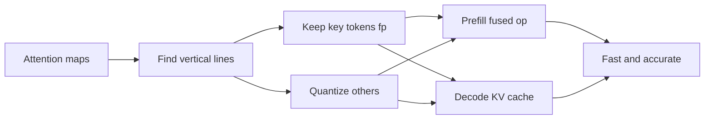
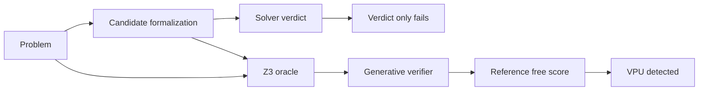
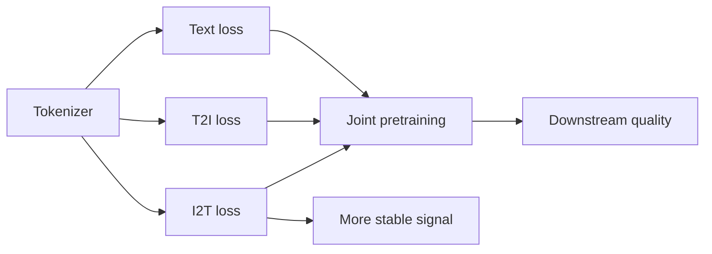
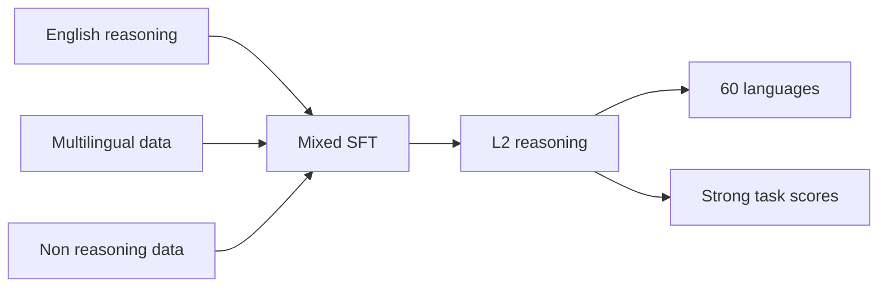
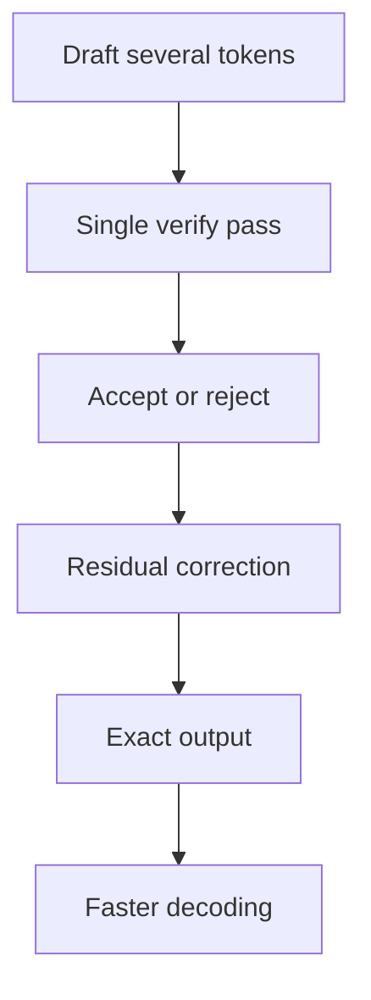
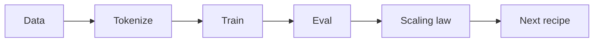
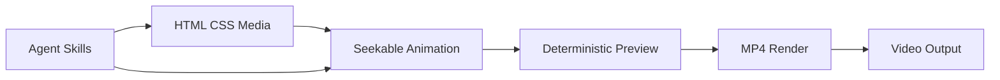
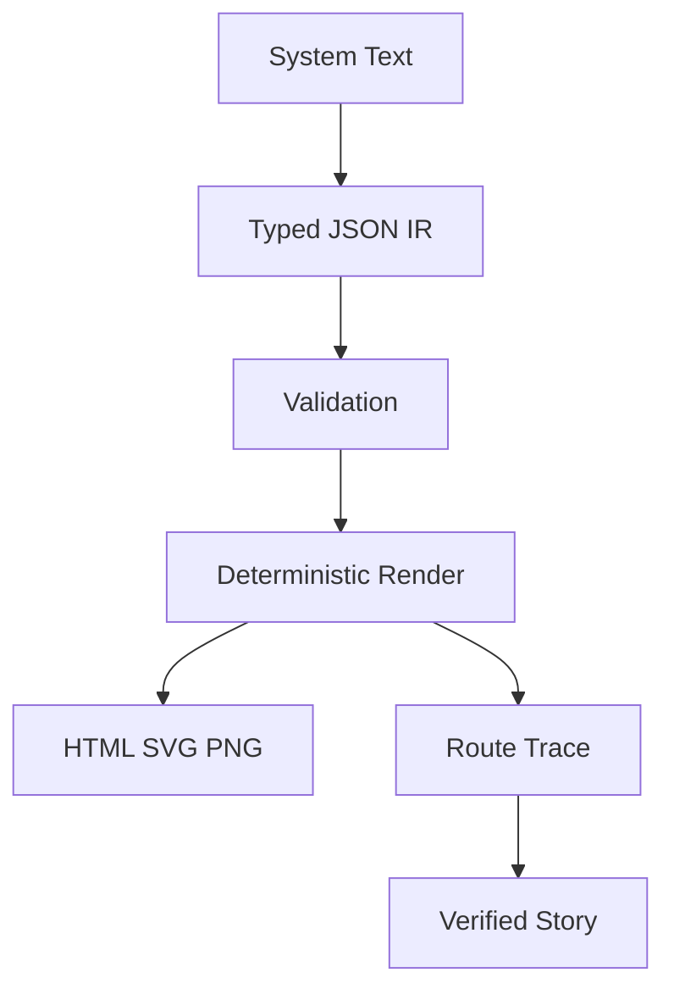

# Jarvis 日报 · 2026-09-12

候选 450 → 过滤后 112 → 入选 18。图例：⭐ 核心方向 · 🌐 全领域热点 · ✅ 已掌握前置 · 🔲 需补前置

## 📄 论文 · 核心方向

### 1. ⭐ 📄 EvoSafeHarness: Evolving Model- and Domain-Specific Harnesses for Securing Agents
arXiv [2609.05903](https://arxiv.org/abs/2609.05903) · HF 🔥 47 · Nanxi Li, Yingzi Ma, Yulong Cao 等 · [PDF](https://arxiv.org/pdf/2609.05903) · [代码](https://github.com/SaFo-Lab/EvoSafeHarness) ★2

**一句话**：EvoSafeHarness 为冻结 agent 自动搜 harness；DecodingTrust-Agent ASR 45.6%→10.0%。
**为什么值得你看**：你做 agent/RAG 安全或评测会直接碰到

**核心架构**：反直觉点在于：同一个安全 harness，换个模型或换个 domain，可能从“很严”变成“过拦”或“漏拦”。作者先否定通用固定规则，原因不是 policy 写得不够细，而是模型差异决定需要多强的外部约束，domain 差异决定要管哪些状态、动作序列和安全关系。EvoSafeHarness 的关键变化，是把 harness 也当成可优化对象：同时搜索自然语言 policy 和可执行 code logic，并用目标模型的行为反馈、domain spec 和 fresh-context adversarial review 去筛掉只对 benchmark artifact 有效的规则。最直接的证据不是最大涨幅，而是它在 15 个独立 model-domain cell 上把 DecodingTrust-Agent 的平均 ASR 压到 10.0%，只付出 3.3 点 utility；这说明它学到的是 deployment-specific 的边界，而不是某个固定防线。新意主要在系统组织层：不是改模型，而是让 harness 随部署自适应。

- DecodingTrust-Agent: ASR 45.6%→10.0%，utility 仅降 3.3
- 没证明通用最优；换模型/域仍需重搜
- 代码已开源，但 harness 生成链条复现成本高
**精读价值**：值得精读，核心是 agent 安全的部署自适应思路
**关联**：[[CaMeL]]、[[Meta-Harness]]
#agent #safety #eval · 难度：硬核 · 建议：建议精读
前置：🔲 [[prompt injection]] · 🔲 [[planning]] · 🔲 [[memory]] · ◽ agent

```mermaid
graph LR
A target model and domain --> B search policy
A --> C search code logic
B --> D fresh context review
C --> D
D --> E deployable harness
E --> F safety utility frontier
```
<sub>打分理由：为agent设计可进化安全评测框架（core 8 / wide 6）</sub>

### 2. ⭐ 📄 Memory as Plans: World-Action Modeling with Memory-Grounded Planning
arXiv [2609.11561](https://arxiv.org/abs/2609.11561) · HF 🔥 24 · Sizhe Zhao, Haozhe Xie, Weiyu Zhao 等 · [PDF](https://arxiv.org/pdf/2609.11561) · [代码](https://github.com/aipixel/MaP-WAM) ★4

**一句话**：MaP-WAM 把长记忆压成计划；RMBench 83.3%，实机 78.0%。
**为什么值得你看**：你看 VLA、长上下文或机器人记忆会很对口

**核心架构**：反直觉点在于：复杂操作任务并不需要每一步都把整段历史喂给执行器；真正需要长记忆的，往往是“下一段该怎么做”的决策，而不是每个 control step 都重读全历史。作者把记忆依赖建模拆成两段：先用 multimodal episodic context 生成 memory-grounded plan，再让固定上下文的 executor 按计划执行。这里的关键组件是 segment record 和 WAP。segment record 只保存已完成片段的语言指令和稀疏视觉帧，阻断“长历史无限膨胀”；WAP 同时预测 action chunks 和 progress，阻断“执行时不知道该什么时候切段”。plan-observation alignment 再用当前观测去校准 progress，阻断长序列里进度漂移。最直接的证据是它在 history 增长时，executor latency 近似恒定，同时拿到 RMBench 83.3% 和实机 78.0%。新意在系统组织层：不是更长窗口，而是把 memory 变成 plan 的中间表示。

- RMBench 83.3%，实机 78.0%，且延迟近似不随历史增长
- 没证明所有任务都适合 plan 化；强依赖实时细节时可能受限
- 需要规划器、world model、进度对齐，工程复杂度高
**精读价值**：值得通读，适合做机器人长记忆/规划的切入点
**关联**：[[Octo]]、[[DynamicVLA]]
#agent #memory #planning · 难度：硬核 · 建议：建议精读
前置：🔲 [[vision-language-action]] · ◽ world model · 🔲 [[long context]] · 🔲 [[KV cache]]

```mermaid
graph LR
A episodic memory --> B plan generation
B --> C visual guidance
C --> D fixed executor
D --> E action chunks
D --> F progress
F --> G replan
G --> B
```
<sub>打分理由：记忆作为计划的世界-行动建模（core 8 / wide 5）</sub>

### 3. ⭐ 📄 Negative Self-Distillation: Learning to Reason by Avoiding Flaws
arXiv [2609.11699](https://arxiv.org/abs/2609.11699) · HF 🔥 17 · Rongcan Pei, Zhepei Wei, Shuyao Xu 等 · [PDF](https://arxiv.org/pdf/2609.11699) · [代码](https://github.com/Prongcan/NSD) ★5

**一句话**：NSD 用“避开坏推理”自蒸馏；7 个理科基准平均涨 2.3% 到 7.5%。
**为什么值得你看**：你关心 reasoning 后训练和 label-free RL 会很有价值

**核心架构**：反直觉点在于：OPSD 这类方法把“带真值的自蒸馏”做得越像老师，模型反而可能越不会想题——因为老师太自信、路径太线性，会压掉探索、犹豫和自我修正，而这些正是难题里真正需要的行为。NSD 的关键改变不是学正确答案，而是先让模型自己构造一个 question-specific 的 negative condition，比如“careless reasoner”，再让学生远离这条坏分布。难点在于，不能把所有被负条件抬高概率的 token 都打掉，否则连基础语言能力也会伤到；所以它引入 token-level gating，只在负条件确实“异常抬高”某个 reasoning-critical token 时才施加 unlikelihood，并配合 bounded objective 和 KL 约束稳住更新。最强证据是它在 1.7B/4B/8B 上都稳定优于 OPSD、Intuitor、TTRL，且作者报告平均提升分别为 2.3%、7.5%、6.0%。新意在组件层：用负样本蒸馏和门控把“不要学坏习惯”变成可训练信号。

- 7 个数学 reasoning 基准上稳定优于 OPSD 等 baseline
- 没证明对所有推理任务都有效；负条件设计可能敏感
- 单次 rollout、无外部 teacher，训练效率信号较强
**精读价值**：值得精读，适合理解后训练里“反向监督”思路
**关联**：[[OPSD]]、[[OPD]]
#rlhf #distillation #reasoning · 难度：硬核 · 建议：建议精读
前置：🔲 [[direct preference optimization]] · 🔲 [[knowledge distillation]] · ◽ unlikelihood · 🔲 [[chain-of-thought]]

```mermaid
graph LR
A unlabeled question --> B generate negative condition
B --> C negative teacher
A --> D benign reference
C --> E token gating
D --> E
E --> F suppress flawed tokens
F --> G better reasoning
```
<sub>打分理由：on-policy 自蒸馏改进，贴近推理后训练（core 8 / wide 6）</sub>

### 4. ⭐ 📄 SpatialBlock: Enhancing Spatial Intelligence in LVLMs via Synthetic Block-Stacking Problem
arXiv [2609.07064](https://arxiv.org/abs/2609.07064) · HF 🔥 87 · Soohyun Ryu, Sohee Kim, Eunho Yang · [PDF](https://arxiv.org/pdf/2609.07064) · [代码](https://github.com/rsoohyun/SpatialBlock) ★2

**一句话**：用15k合成积木任务补LVLM空间推理，迁移到真实场景更准
**为什么值得你看**：VLM/空间推理方向，能讲清数据设计价值

**核心架构**：反直觉点在于：LVLMs 先把图像问答做得不错，却连简单 block-stacking 的 3D-to-2D 投影都常错，说明瓶颈不在“看见”而在“从2D重建3D结构”。现有 real-scene spatial QA 依赖 dense geometric annotation 和外部 depth/segmentation，贵、慢、还会引入噪声。作者换成“基础空间技能先学会”的路线：SpatialBlock-15k 用合成积木题把能力拆成 projection、viewpoint transformation、structural combination，并用 controlled color modulation 强行给模型锚点，阻断视觉复杂时找不到任务相关对象的失败。最直接的证据是：用这 15k 纯合成数据训练后，direct answer 和 reasoning-based prediction 都显著优于 baseline，而且能泛化到 real-world spatial tasks。新在组件层：不是改 LVLM 架构，而是换训练任务的“空间先验注入”方式。

- 最强证据：纯合成 15k 也能迁移到真实任务
- 没证明通用 3D 理解，可能只吃积木分布
- 复现成本低，代码和数据都开源
**精读价值**：适合想讲“数据设计如何补空间能力”的论文精读
**关联**：[[MindCube]]、[[ReAct]]
#vlm #spatial #benchmark · 难度：中等 · 建议：值得通读 (20 min)
前置：🔲 [[VLM]] · 🔲 [[vision transformer]] · 🔲 [[contrastive learning]] · ◽ spatial reasoning


<sub>打分理由：合成空间任务提升LVLM空间能力（core 7 / wide 4）</sub>

### 5. ⭐ 📄 HyQuant: Hybrid-Precision Quantization for LLM Attention
arXiv [2608.27875](https://arxiv.org/abs/2608.27875) · HF 🔥 17 · Jiatong Ding, Bingxin Xing, Yu Zhang 等 · [PDF](https://arxiv.org/pdf/2608.27875) · [代码](https://github.com/jerrysfls/HyQuant) ★8

**一句话**：HyQuant 混精度量化 attention，低比特下近乎无损且提速
**为什么值得你看**：推理加速/量化面试很实用

**核心架构**：反直觉点在于：long-context inference 里，attention 不是所有 token 都一样重要，uniform low-bit 会把少数“反复被看”的位置压坏，最后比省下的算力更伤精度。作者先把问题拆成 Prefill 的算力瓶颈和 Decode 的带宽瓶颈，再给出同一个核心改法：找出 vertical-line token 和 local window 这类高贡献位置，保留高精度，其余大部分 token 才做低比特压缩。这里的关键组件是“轻量 vertical-line-aware signal → 识别关键位置”，它阻断的是把关键 token 和普通 token 一视同仁导致的误差放大。Prefill 里用 hybrid-precision attention operator 把双路径融合进一个算子；Decode 里同样策略压 KV cache，并把 dequantization 和 attention 融合，减少带宽开销。最直接证据是多模型上 1.32–3.58 倍 decode-kernel speedup，同时 accuracy 基本不掉。新在系统组织层：不是单纯更低 bit，而是按 attention 结构做差异化精度分配。

- 最强证据：decode-kernel 1.32–3.58x
- 只适合有明显垂直注意力结构的长上下文
- 实现牵涉 attention/KV 融合，复现偏硬核
**精读价值**：精度和速度都关心时，值得精读系统设计
**关联**：[[StreamingLLM]]、[[MInference]]
#quantization #inference #attention · 难度：硬核 · 建议：建议精读
前置：🔲 [[quantization]] · 🔲 [[KV cache]] · 🔲 [[flash attention]] · 🔲 [[long context]]


<sub>打分理由：LLM注意力混合量化，系统推理优化（core 7 / wide 5）</sub>

### 6. ⭐ 📄 Beyond Solver Verdicts: Generative Reward Models for Autoformalization
arXiv [2609.11085](https://arxiv.org/abs/2609.11085) · HF 🔥 13 · Vikash Singh, Debargha Ganguly, Aman Goel 等 · [PDF](https://arxiv.org/pdf/2609.11085)

**一句话**：用生成式 verifier 识别 VPU，AUROC 0.961
**为什么值得你看**：适合做 reward model/verification 面试谈资

**核心架构**：反直觉点在于：solver verdict 正确，不代表 formalization 和 reference 等价；把比较符号反过来、绑错变量，程序仍可能 satisfiable，于是“只看 verdict”的检查会直接失明。作者把这个漏洞定义成 VPU，并证明任何只依赖 binary verdict 的结构化规则，在这种 matched pair 上理论上只能接近随机。关键概念改动是把“判定式 verifier”换成“generative verification”：先用 bidirectional Z3 离线产出 reference-equivalence 标签，再把这个 oracle 蒸馏进模型原生 token space，用 next-token probability 当连续 equivalence score，阻断的是“只会看执行结果、看不到源问题与候选表达是否语义对齐”的失败。最强证据是 GenV+HN 在 reference-equivalence verification 上 AUROC 0.961，且对 unseen translator 和 formal style zero-shot 泛化。新在实证层 + 监督层：不是新 solver，而是把精确 oracle 标签转成可部署的 reference-free score。

- 最强证据：reference-equivalence AUROC 0.961
- 只看 solver verdict 的方法理论上近随机
- 依赖离线 Z3 oracle，部署时不需要 reference
**精读价值**：想讲 autoformalization 失败模式和 verifier 设计，值得精读
**关联**：[[Lightman et al. Reward Models]]、[[direct preference optimization]]
#reward-model #verification #autoformalization · 难度：硬核 · 建议：建议精读
前置：🔲 [[reward model]] · 🔲 [[next-token prediction]] · ◽ verification · 🔲 [[alignment]]


<sub>打分理由：生成式奖励模型用于形式化验证（core 7 / wide 5）</sub>

### 7. ⭐ 📄 Studying Image Tokenizers as Visual Languages in Unified Multimodal Models
arXiv [2609.09143](https://arxiv.org/abs/2609.09143) · HF 🔥 18 · Siting Li, Zhengyang Wang, Simon Shaolei Du 等 · [PDF](https://arxiv.org/pdf/2609.09143) · [代码](https://github.com/amazon-far/Tokenizer_UMM)

**一句话**：用任务级 loss 评 image tokenizer，找出与下游更一致的视觉语言信号
**为什么值得你看**：做统一多模态/RAG 时，得会判断 tokenizer 值不值换

**核心架构**：反直觉点在于：image tokenizer 不是只看重建好不好；在 unified AR 训练里，它会同时改写图像、文本、T2I、I2T 四个预测任务的难度。作者的关键改变是把 tokenizer 当成“视觉语言”，不用单一 reconstruction metric，而是搭一个纯 autoregressive continual pretraining testbed，按任务分别看 validation loss。这里的组件因果很清楚：task-specific loss → 阻断“平均 loss 掩盖不同任务缩放差异”的失败；I2T loss → 因为落在共享 text vocabulary 上，能更稳定地跨 tokenizer 对齐下游；T2I loss → 只在固定 tokenizer 内和生成质量相关，跨 tokenizer 会被 image-token space 改写。最直接的证据是：I2T loss 在 supervised finetuning 前后都能稳定关联 generation 和 VQA，而更好的 reconstruction 并不保证更低任务 loss 或更强下游。新意主要在实证层：不是发明新 tokenizer，而是重新定义了评价它的坐标系。

- I2T loss 跨 tokenizer 更稳
- 重建更好不等于下游更好
- joint 训练会反过来影响 text modeling
**精读价值**：值得精读，核心是把 tokenizer 评价从单指标改成任务级诊断
**关联**：[[Chameleon]]、[[Janus-Pro]]
#multimodal #tokenizer #pretraining · 难度：中等 · 建议：值得通读 (20 min)
前置：◽ autoregressive · 🔲 [[next-token prediction]] · 🔲 [[VLM]] · 🔲 [[pretraining]]


<sub>打分理由：研究图像tokenizer作为统一多模态语言（core 6 / wide 5）</sub>

### 8. ⭐ 📄 Building Multilingual Bridges: Data Mixing as the Pillar of Generalization for In-Language Reasoning
arXiv [2609.10445](https://arxiv.org/abs/2609.10445) · HF 🔥 16 · Mehrnaz Mofakhami, Ananya Sahu, Alejandro R. Salamanca 等 · [PDF](https://arxiv.org/pdf/2609.10445)

**一句话**：用数据混配把 3.35B 模型做成 60 语言都能本语种推理的 L2 Thinker
**为什么值得你看**：做多语种 LLM/Agent 时，能直接判断数据配方价值

**核心架构**：悖论是：模型会用非英语回答，却在脑内先用英语推理；这会丢掉语言特定语境，还让中间推理难以审计。作者的关键改法不是再造一种推理监督，而是把 L2 reasoning 视为可迁移行为，通过 SFT 的 data mixing 和 scheduling 去“搭桥”。这里的硬定义是：L2 reasoning 指模型在用户提示语言内完成推理链，再用同语种给出答案。组件因果上，broader language coverage → 阻断“只会把推理迁移到少数高资源语言”的失败；multilingual non-reasoning data → 阻断“指令跟随和跨语种对齐不足”；English reasoning backbone → 保留推理能力底座，再把它迁移到目标语言。作者报告 Tiny Aya L2-Thinker 在 60 种语言、6 个 benchmark 上 L2 reasoning rate 超过 93%，且保留较强任务性能。最强支撑是他们把“是否本语种推理”与“任务分数”分开看，证明这不是单纯的语言风格问题。新意在系统组织层：不是模型结构新，而是训练数据编排新。

- 93% L2 reasoning rate，覆盖 60 语言
- 靠 data mixing 转移推理，不靠每语种监督
- held-out language 仍是主要检验点
**精读价值**：值得精读，适合面试讲 multilingual reasoning 的数据路线
**关联**：[[Magistral]]、[[Qwen3]]
#rag #data-mixing #reasoning · 难度：中等 · 建议：值得通读 (20 min)
前置：◽ reasoning · 🔲 [[SFT]] · ◽ instruction following · 🔲 [[chain-of-thought]]


<sub>打分理由：数据混合提升同语言推理，多语言泛化（core 6 / wide 5）</sub>

## 🧰 项目 · 核心方向

### 9. ⭐ 🧰 youssofal/MTPLX
[GitHub](https://github.com/youssofal/MTPLX) ★2,272 (+1111 本月) · Trending monthly · infra · Python

**一句话**：在 Apple Silicon 上用原生 MTP speculative decoding，把本地推理提到 1.6x 到 2.24x
**为什么值得你看**：做本地推理/推理加速项目时，很适合看它的运行时取舍
- MTP head 直接复用，不要外部 drafter
- 用 exact rejection sampling 保持分布不变
- 2.11.2 修了长会话与 27B verify 路径
**为什么现在上榜**：作者报告最近 release：v2.11.2（2026-09-06），修了长会话和 27B 机型的正确性问题；v2.11.1（2026-09-04），v2.10.2（2026-09-01）
**精读价值**：值得看项目成熟度和 decoding 机制，偏系统实现参考
**关联**：[[Leviathan and Chen rejection sampling theorem]]、[[speculative decoding]]
#inference #speculative #quant · 难度：中等 · 建议：值得通读 (20 min)
前置：🔲 [[speculative decoding]] · 🔲 [[KV cache]] · 🔲 [[quantization]] · 🔲 [[rejection sampling]]


<sub>打分理由：MTP 猜测解码加速，面向推理与工程（core 7 / wide 6）</sub>

### 10. ⭐ 🧰 jordan-gibbs/hyperresearch
[GitHub](https://github.com/jordan-gibbs/hyperresearch) ★2,993 (+712 今日) · Trending daily · tool · Python

**一句话**：用 16 步 agent 研究流水线，做出可追溯报告；作者报告内部 RACE 领先
**为什么值得你看**：适合看 agent+RAG 研究架构

**核心架构**：它解决的反直觉点是：做深度 research 时，信息越多不一定越可靠，反而更容易被重复转载、断章取义和上下文漂移带偏。现有线性“搜一轮→写报告”会把证据、论点、批评揉在一起，后面步骤越跑越容易丢上下文。作者把关键改动放在“循环 + 中间件”上：16 步不是顺序脚本，而是按 tier 选择的可恢复 pipeline；`vault` 负责把每个来源持久化并可复用，`critic`/`cite-checker` 负责阻断幻觉引用，independence audit 阻断把 syndication 当共识，tool-locked patcher 只允许外科式改写，阻断模型事后重写证据链。最直接的证据是作者报告：`premier` profile 在单轮里拉到 250+ sources，且每条引用在出报告前都要过支持性检查；他们还给出“citation actually supports the sentence”这类硬门槛。新意主要在系统组织层，不是单个检索器：把 research 任务拆成可审计、可恢复、可复用的多阶段 agent 协作。

- 作者报告 16 步、250+ sources/轮
- 未证明第三方泛化，内部榜单
- 复现门槛高：依赖 Claude Code 与多 agent
**精读价值**：想看 agentic research 如何做成系统，值得精读
**关联**：[[ReAct]]、[[SWE-bench]]
#agent #rag #research #wikipedia · 难度：硬核 · 建议：建议精读
前置：🔲 [[ReAct]] · 🔲 [[retrieval-augmented generation]] · 🔲 [[planning]] · 🔲 [[memory]]


<sub>打分理由：agent驱动检索+综合，RAG/知识库契合（core 7 / wide 6）</sub>

### 11. ⭐ 🧰 fitchmultz/pi-posthorse
[GitHub](https://github.com/fitchmultz/pi-posthorse) ★242 · skill · TypeScript

**一句话**：给 Pi agent 加无摘要换窗；保留完整转录与可恢复 notes
**为什么值得你看**：适合看 context rollover 机制

**核心架构**：它解决的是：长对话一旦触发 compaction，模型最需要的“最近状态、未消耗工具结果、手工 notes”最容易被摘要丢掉，后续工具调用就会断档。Posthorse 的关键设计不是再做一个摘要器，而是把“换窗”变成协议：`get_context_remaining` 只做预算判断，`new_context` 在整批工具成功后原子提交边界，rollover 时把 direct user inputs、未消费的 tool batch、可恢复 checkpoint 写入新窗，同时把旧窗从 active context 里移走；`notes` 和 `history` 则作为持久层兜底恢复。最直接的支持是它明确区分了支持配置和不支持配置：当模型可用 token 不足时，自动行为关闭，保留 Pi 自己的 compaction，不强行越界。新意在运行时机制层：不是功能堆叠，而是把上下文预算、边界提交和恢复状态做成一套可执行 policy。

- 支持 native rollover、notes、history recovery
- 不支持官方未打补丁的 Pi
- 复现要改 fork 并重启 Pi
**为什么现在上榜**：最近 release：v0.4.5 / v0.4.4 / v0.4.3（2026-09-05~09-06）
**精读价值**：做 coding agent 运行时的人值得看
**关联**：[[ReAct]]、[[model context protocol]]
#agent #coding-agent #context · 难度：中等 · 建议：值得通读 (20 min)
前置：🔲 [[KV cache]] · 🔲 [[long context]] · 🔲 [[context window]] · 🔲 [[memory]]


<sub>打分理由：增强编码智能体长上下文与持久记忆（core 7 / wide 6）</sub>

### 12. ⭐ 🧰 marin-community/marin
[GitHub](https://github.com/marin-community/marin) ★3,621 (+2414 本月) · Trending monthly · infra · Python

**一句话**：开源训练平台 Marin，公开从数据到模型全流程，做出 5e24 FLOPs MoE 计划
**为什么值得你看**：适合看训练配方与系统化复现

**核心架构**：它解决的是：大模型训练常见“只给最终 checkpoint，不给过程知识”，导致别人能看结果却学不到配方。Marin 的核心改变是把训练当成可追踪的 research program：数据处理、tokenization、pretraining、posttraining、evaluation 都在同一套实验编排里，并把失败实验也保留下来。`StepRunner`/依赖式步骤把训练流程组织成可复用 DAG，避免脚本式流水线在长实验里失控；Delphi 则把小规模模型、scaling recipe 和 scaling law 放在一起，阻断“只会拟合大模型点、不会外推”的失败。最强证据是作者公开了 checkpoints、training mixture pipelines、recipe code 和 plot-ready data，说明它不是只发 blog，而是把可复现材料一并放出。新意主要在系统组织层兼实证层：把 foundation model 研发过程本身产品化，并用 scaling suite 做可外推验证。

- 公开 checkpoints、mixture、recipe、数据
- 作者报告 5e24 FLOPs MoE 计划
- 是研发平台，不是单模型仓库
**为什么现在上榜**：最近 release：dev-wheels（2026-08-13）；其余为 prerelease/实验分支
**精读价值**：想补训练系统视角，值得通读
**关联**：[[Pythia]]、[[Megatron-LM]]
#foundation-models #framework #training · 难度：中等 · 建议：值得通读 (20 min)
前置：🔲 [[pretraining]] · 🔲 [[mixture of experts]] · 🔲 [[scaling laws]] · 🔲 [[Adam]]


<sub>打分理由：基金会模型研发框架，可能可迁移（core 6 / wide 5）</sub>

### 13. ⭐ 🧰 openai/plugins
[GitHub](https://github.com/openai/plugins) ★6,516 (+1063 本周) · Trending weekly · infra · JavaScript

**一句话**：用 `.codex-plugin` 清单组织 Codex 插件，给多端能力分发。
**为什么值得你看**：适合看 agent 工具链与 plugin 生态怎么落地

**核心架构**：这是一个插件样板库，不是单一功能应用。它解决的反直觉点是：同样是让模型“会用工具”，如果把能力全塞进一个脚本里，后续的 UI、工作流、权限和上下文会互相污染，agent 很快失控。作者把插件拆成以 `.codex-plugin/plugin.json` 为入口的可装配单元，再允许挂 `skills`、`mcp`、`commands`、`hooks` 等伴随面，这等于把“工具调用”阻断在清晰边界内：manifest 负责被发现，skills 负责行为约束，MCP/commands 负责执行面。最能说明这点的是 `figma`、`notion`、`build-web-apps` 这些 richer examples：它们不是在演示 API，而是在演示同一插件框架如何承载设计、知识、构建和部署这种不同工作流。新意主要在系统组织层：它把 plugin 生态的目录约定、市场分发和多 surface 协同定成了可复用协议，而不是单个 demo。

- 最强证据是多类 rich examples 共用同一 manifest
- 未证明通用性边界，复杂工作流仍依赖外部工具
- 复现门槛低，主要看目录约定和配置拼装
**精读价值**：看它怎么把 plugin 变成可组合工作流即可
**关联**：[[Model Context Protocol]]、[[OpenAI Codex]]
#plugins #tool-use #llm · 难度：中等 · 建议：值得通读 (20 min)
前置：🔲 [[model context protocol]] · 🔲 [[planning]] · 🔲 [[ReAct]]

```mermaid
graph LR
A 输入需求 --> B plugin manifest
B --> C skills
B --> D mcp
B --> E commands
C --> F agent行为
D --> F
E --> F
F --> G 多端工作流
```
<sub>打分理由：插件生态历史重要，利于工具调用理解（core 6 / wide 6）</sub>

### 14. ⭐ 🧰 stablyai/orca
[GitHub](https://github.com/stablyai/orca) ★67,208 (+666 今日) · Trending daily · tool · TypeScript

**一句话**：用 worktree 和并行 agent 编排编码任务，支持桌面与移动端。
**为什么值得你看**：agent 编排和多工作区设计，面试很常问

**核心架构**：它解决的场景是：你同时跑几个 coding agent 时，最怕它们互相改同一份文件、上下文串线、人在外面还不知道谁卡住了。Orca 的关键改变是把“一个任务一个隔离 worktree”作为基本单元，再在其上做并行调度和状态同步：worktree 阻断文件冲突，worker-terminal ownership 阻断多个调度器抢同一执行终端，chat 里暴露子 agent 活动和 changed files 阻断黑箱式执行。真正支撑这个架构的是运行时，不是功能清单：桌面端承载 terminal、browser、repo 视图，remote runtime 负责 SSH/自动重连，mobile 只做监控和接管。作者报告最近 release 持续在修复 orchestration、startup 和 browser 相关回收问题，说明它的难点就在并发与恢复语义，而不是 UI。新意在系统组织层：把“并行 agent + worktree + 多端接管”做成一个协同运行时。

- 最强证据是并行 worktree 和终端归属机制
- 黑箱并行会失控，依赖 CLI agent 和 git worktree 习惯
- 复现难度中等，核心在调度和状态恢复
**为什么现在上榜**：最近 release：v1.4.200、v1.4.199、v1.4.198，连续在修 orchestration 与恢复。
**精读价值**：想看并行 agent 运行时，这个值得通读
**关联**：[[OpenAI Codex]]、[[Claude Code]]
#agent #runtime #parallel · 难度：中等 · 建议：值得通读 (20 min)
前置：🔲 [[multi-agent]] · 🔲 [[planning]] · 🔲 [[memory]] · 🔲 [[model context protocol]]

```mermaid
graph LR
A 一个任务 --> B 多个worktree
B --> C agent1
B --> D agent2
B --> E agent3
C --> F changed files
D --> F
E --> F
F --> G 选择并合并
H 手机 --> I 监控接管
I --> B
```
<sub>打分理由：并行多agent运行环境，实用且有热度（core 6 / wide 7）</sub>

## 🌐 全领域热点

### 15. 🌐 🧰 mattpocock/skills
[GitHub](https://github.com/mattpocock/skills) ★260,347 (+10571 本周) · Trending weekly · skill · Shell

**一句话**：用可组合 `SKILL.md` 约束 agent，降低误解和调试失真。
**为什么值得你看**：很贴近 agent 工作流，适合做项目级方法参考

**核心架构**：它解决的不是“让 agent 更聪明”，而是“让 agent 少犯系统性工程错误”。反直觉点在于：很多失败不是模型能力不够，而是任务定义、术语和调试信息被过程本身弄乱了。作者把 skills 做成小而可编辑的 `SKILL.md`，再配套安装器和 `/setup-matt-pocock-skills`，让技能既能被订阅也能被 fork；关键机制是把对齐、共享语言、逐步调试和红action 写进流程里。比如 `grill-me` 先逼 agent 反问澄清，阻断“以为理解了其实没理解”；`diagnosing-bugs` 先 redaction，阻断 secrets 泄漏和无效日志污染；shared language 文档阻断术语漂移，让后续命名、搜索和推理都收敛。最近 release 还专门强化了 secrets redaction，说明作者在把这个方法向真实工程约束收紧。新意主要在系统组织层和实证层：不是提出新模型，而是把 agent 协作失败模式拆成可执行的 skill。

- 最强证据是把对齐、语言、调试写成可执行 skill
- 没证明对所有模型都稳，仍依赖使用者选对流程
- 复现最容易，直接是文本/脚本级模板
**为什么现在上榜**：最近 release：v1.2.3、v1.2.2、v1.2.0，新增 redaction 约束。
**精读价值**：更像 agent 工程方法库，适合速览后挑技能试
**关联**：[[Claude Code]]、[[Model Context Protocol]]
#agent #skills #tooling · 难度：入门 · 建议：值得通读 (20 min)
前置：🔲 [[ReAct]] · 🔲 [[planning]] · 🔲 [[prompt injection]] · 🔲 [[memory]]

```mermaid
graph TD
A 任务开始 --> B grill questions
B --> C shared language
C --> D small steps
D --> E bug trace
E --> F redact secrets
F --> G 更稳的agent协作
```
<sub>打分理由：海量agent skills集合，质量参差但热度高（core 2 / wide 8）</sub>

### 16. 🌐 🧰 heygen-com/hyperframes
[GitHub](https://github.com/heygen-com/hyperframes) ★49,173 (+5100 本周) · Trending weekly · tool · TypeScript

**一句话**：用 HTML→MP4 确定性渲染，支撑 agents 产出视频
**为什么值得你看**：你做 LLM/Agent 时会碰到视频生成落地

**核心架构**：它解决的是一个反直觉痛点：同一段生成式内容，预览里看着正常，导出后却因为状态漂移、seek 不一致、浏览器重载而变成另一段视频。现有“给 agent 一个渲染器”不够，因为真正失败点在编辑循环里：预览、动画时钟、媒体加载、lint、render 之间没有统一的确定性边界。HyperFrames 的关键改变是把“写 HTML”变成“可 seek 的确定性视频程序”：HTML/CSS/媒体负责表达，router 型 skills 决定该走哪条创作流程，而渲染核心把动画、seek、导出约束到同一条生产链，阻断预览与最终 MP4 语义分叉。最直接的证据是 v0.8.36 的修复说明：暂停预览后子动画仍在跑、编辑时 iframe 会重载、打开项目会重复 re-encode，这些都说明作者在修的是“编辑态和导出态必须同态”。新意主要在系统组织层，不是新渲染算法。

- 最强证据是预览/导出不同步的修复
- 原文未明确测试覆盖与可复现脚本
- 像技能系统，复现更依赖 agent 环境
**为什么现在上榜**：最近 release：v0.8.36
**精读价值**：适合看速览：价值在 agent 生产链，不在渲染算法
**关联**：[[Remotion]]、[[FFmpeg]]
#agent #video #render · 难度：中等 · 建议：值得通读 (20 min)
前置：🔲 [[model context protocol]] · 🔲 [[planning]] · 🔲 [[video generation]]


<sub>打分理由：面向agent的视频渲染框架，跨模态相关（core 4 / wide 7）</sub>

### 17. 🌐 🧰 k2-fsa/OmniVoice
[GitHub](https://github.com/k2-fsa/OmniVoice) ★12,729 (+546 今日) · Trending daily · model · Python

**一句话**：High-Quality Voice Cloning TTS for 600+ Languages
**为什么值得你看**：（dry-run：未调用 LLM，配置 OPENAI_API_KEY 后会生成中文速览）
#tts #voice #multilingual #audio · 难度：中等 · 建议：看速览即可
<sub>打分理由：高质量多语TTS模型发布，音频生成相关（core 6 / wide 7）</sub>

### 18. 🌐 🧰 tt-a1i/archify
[GitHub](https://github.com/tt-a1i/archify) ★59,454 (+11006 本周) · Trending weekly · skill · JavaScript

**一句话**：用 typed JSON IR 把系统描述渲染成可验证架构图
**为什么值得你看**：适合做 agent 可视化与系统讲解，面试很能讲

**核心架构**：它解决的是“图看起来对，但其实不可证”的老问题：架构图、数据流图、时序图常被手工画到失真，尤其在 agent 场景里，路径、回路、边界和证据源混在一起，改一处就乱一片。Archify 的关键改变是先把自然语言或代码库分析收敛成 typed JSON IR，再由确定性 renderer 生成 HTML/SVG，并在同一套验证里保留事实、路线和来源证据，从而阻断“图像美观但拓扑不可信”的失败。最直接的证据是它支持 Before / Delta / After、route probe、upstream/downstream reach，并在 release 里持续修复 Intent Trace 方向、边界可读性、SVG Legend 遮挡这类语义/渲染问题，说明作者在打磨的是“可验证表达”而不是单纯出图。新意在系统组织层：IR、验证、导出、交互阅读一起组成闭环。

- typed IR + deterministic compile 是核心证据
- 原文未明确是否有自动化测试覆盖率
- 图的可信度比纯美化工具高一维
**为什么现在上榜**：最近 release：v2.16.0 / v2.15.0
**精读价值**：值得看，尤其适合学 agent/系统图的可信表达
**关联**：[[Mermaid]]、[[D3.js]]
#agent #diagram #skill · 难度：中等 · 建议：值得通读 (20 min)
前置：◽ JSON · 🔲 [[planning]] · ◽ agent · ◽ sequence


<sub>打分理由：架构图生成agent skill，偏表达层（core 4 / wide 6）</sub>

---
想精读哪一篇？在 Claude 里说：`精读 2026-09-12 第 N 条`，Jarvis 会按你的 known.md 只讲你不会的部分。