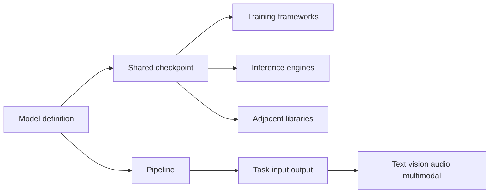
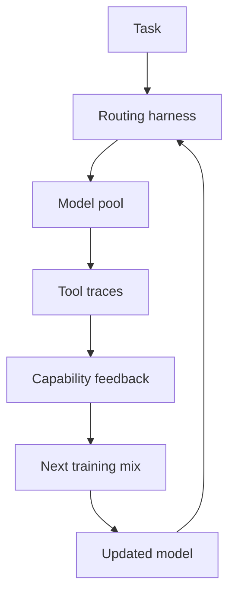
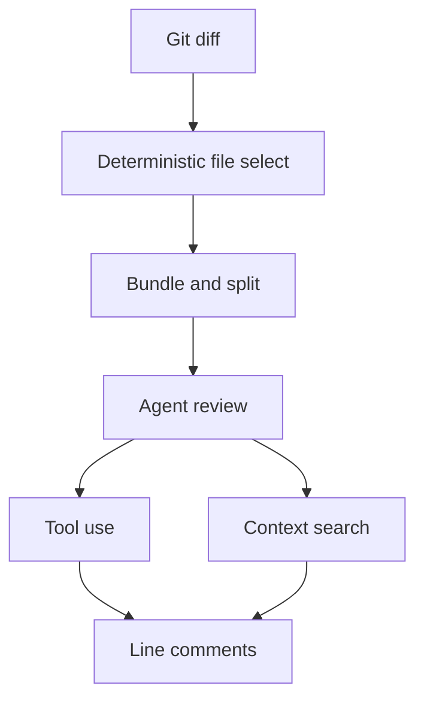
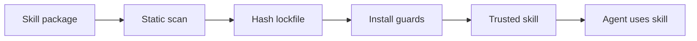
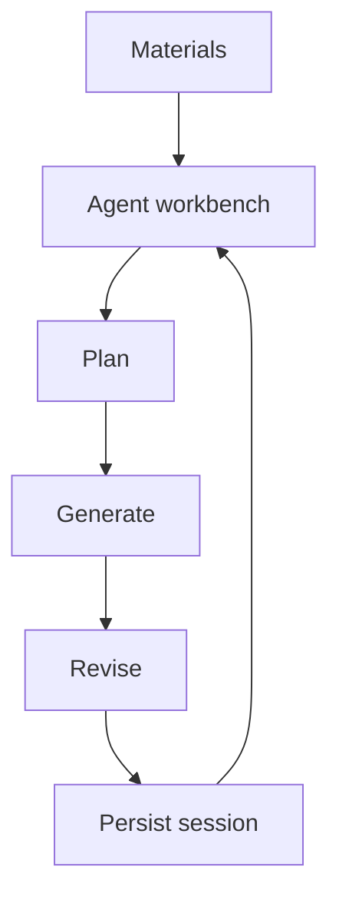
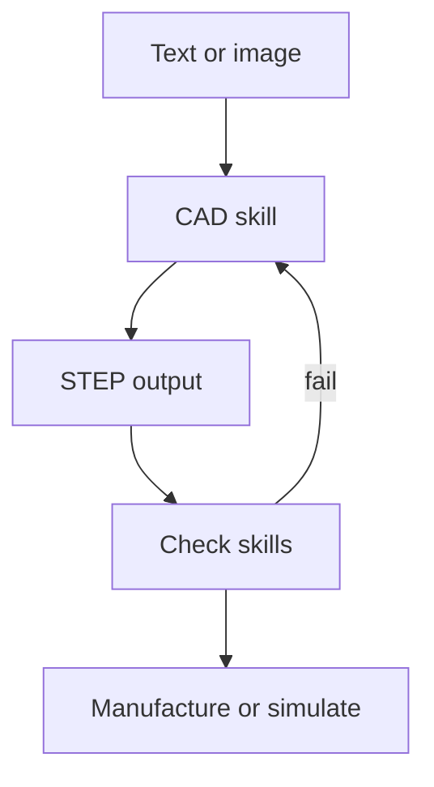
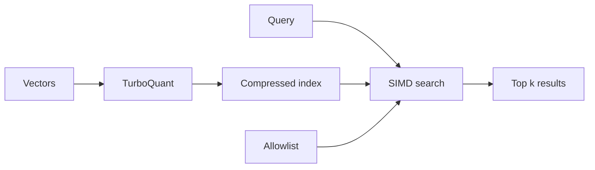
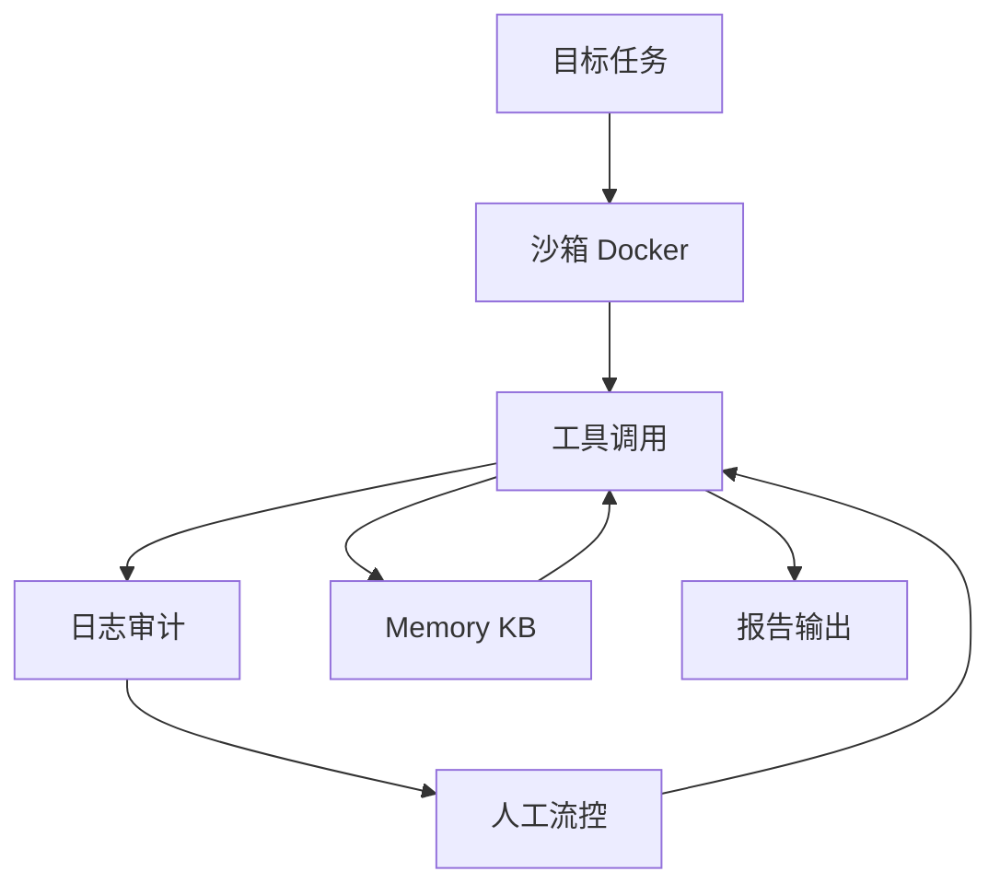

# Jarvis 日报 · 2026-09-13

候选 416 → 过滤后 83 → 入选 10。图例：⭐ 核心方向 · 🌐 全领域热点 · ✅ 已掌握前置 · 🔲 需补前置

## 🧰 项目 · 核心方向

### 1. ⭐ 🧰 huggingface/transformers
[GitHub](https://github.com/huggingface/transformers) ★165,413 (+102 今日) · Trending daily · infra · Python

**一句话**：统一 1M+ 模型定义，打通训练与推理生态
**为什么值得你看**：你做 LLM/VLM 和推理加速都绕不开它

**核心架构**：它解决的反直觉点是：模型能力明明在涨，但一换训练框架、推理引擎或多模态任务，接口和权重格式就碎成一地。现有做法通常把“模型结构”绑死在某个仓库里，导致同一模型难以同时被 Axolotl、FSDP、vLLM、SGLang 直接复用。Transformers 的关键改变是把模型定义做成生态里的共同协议：模型类负责把结构、tokenizer、输出张量语义固定下来，外部训练/推理系统只要对齐这份定义，就能共享同一 checkpoint。`Pipeline` 是它最直接的运行时封装，负责预处理、后处理和任务分发，阻断“用户先懂一堆底层细节才能跑模型”的失败。最强证据不是某个单点涨幅，而是文档里明确写到它支撑 text、vision、audio、multimodal，并且有 1M+ checkpoints 可直接接入。新意主要在系统组织层，不是新模型算法。

- 1M+ checkpoints 形成事实标准
- Pipeline 统一多模态推理入口
- 不证明模型更强，只证明兼容面更大
**精读价值**：值得当作生态底座理解，不必逐页精读
**关联**：[[PyTorch]]、[[vLLM]]
#nlp #multimodal #inference · 难度：入门 · 建议：看速览即可
前置：🔲 [[pretraining]] · 🔲 [[VLM]] · 🔲 [[KV cache]] · 🔲 [[quantization]]

打分理由：训练/推理基础设施，必读必用（core 9 / wide 9）

### 2. ⭐ 🧰 TokenRhythm/NeoHorse
[GitHub](https://github.com/TokenRhythm/NeoHorse) ★225

**一句话**：用路由式 agent 后训把 4B/9B 提升到 +5.93 / +3.44
**为什么值得你看**：适合看 agent 后训、on-policy distillation 和 RSI 叙事

**核心架构**：它要解决的悖论是：模型会做单轮指令和代码题，不代表它能在真实 agent 轨迹里越跑越强，因为工具调用、上下文和任务难度会把训练信号冲散。传统 SFT 只学静态答案，难以把“这次执行到底卡在哪一层能力”回灌到下一轮训练。NeoHorse 的关键概念是 routing harness：先把任务路由到异构模型池，记录工具交互与结果，再估计 capability demand，把能力级反馈写回下一轮训练混合；对应的 agentic post-training 把执行轨迹直接变成监督与 on-policy distillation 信号。最直接的支持证据是 4B/9B 在 ten-benchmark average 上分别比同尺寸 Qwen3.5 提升 +5.93 / +3.44，且 agentic 类基准如 PinchBench、VitaBench、tau2-Bench 明显抬升，说明它确实在“执行轨迹回灌”这一层起作用。新意主要在系统组织层，外加训练数据闭环。

- 最强证据是 agentic 基准整体抬升
- 不证明 RSI 已实现，只是原型闭环
- 复现难点在路由与轨迹数据闭环
**为什么现在上榜**：2026-09-09 technical report；2026-09-07/08 先后开源 4B/9B、GGUF 和量化版
**精读价值**：值得精读，重点看 harness 如何把执行变训练信号
**关联**：[[Qwen3.5]]、[[SFT]]
#agent #post-training #rl · 难度：硬核 · 建议：建议精读
前置：🔲 [[ReAct]] · 🔲 [[planning]] · 🔲 [[memory]] · 🔲 [[on-policy distillation]]

打分理由：agentic post-training与routing思路贴核心（core 8 / wide 6）

### 3. ⭐ 🧰 alibaba/open-code-review
[GitHub](https://github.com/alibaba/open-code-review) ★23,194 (+438 今日) · Trending daily · infra · Go

**一句话**：用确定性分流+Agent，把代码评审做成高精度流水线
**为什么值得你看**：和 SWE-bench、代码 Agent 面试话题强相关

**核心架构**：它解决的是真实 review 里最烦的三个失败：大改动时漏看文件、评论位置漂移、prompt 轻微变化就让质量波动。纯语言驱动的 Agent 往往把“看哪些文件、怎么分组、规则怎么匹配”也交给模型，结果就是噪声大、不可控。Open Code Review 的关键设计是把必须正确的部分交给确定性工程：先精确选文件，再按相关性分组并并行子审查，再做规则匹配和外部定位/反思模块；Agent 只负责动态检索上下文、调用工具和生成建议。最直接的证据是它给出 50 个开源仓库、200 个 PR、10 种语言、1,505 条标注问题的 AACR-Bench，并声称在相同底模下比 Claude Code 更高 Precision 和 F1，同时只用约 1/9 tokens；这说明它不是“多说”，而是把噪声压下去了。新意在系统组织层，成熟度上也有 Alibaba 大规模内部验证和连续 release。

- 最强证据是高 Precision 和 1/9 tokens
- 不保证 Recall 最优，偏保守审查
- 复现依赖模型接入和仓库上下文质量
**为什么现在上榜**：2026-09-12 刚发 v1.12.0，前几天连续小版本更新
**精读价值**：值得看架构，尤其是确定性与 Agent 的分工
**关联**：[[Claude Code]]、[[SWE-bench]]
#llm #agent #code-review · 难度：中等 · 建议：值得通读 (20 min)
前置：🔲 [[ReAct]] · 🔲 [[prompt injection]] · 🔲 [[multi-agent]] · 🔲 [[SWE-bench]]

打分理由：LLM+确定性流水线代码审查，工业级可落地（core 7 / wide 7）

### 4. ⭐ 🧰 tech-leads-club/agent-skills
[GitHub](https://github.com/tech-leads-club/agent-skills) ★5,547 (+215 今日) · Trending daily · infra · TypeScript

**一句话**：用 validated skill registry 约束 agent 插件，降低 13.4% 高危技能风险
**为什么值得你看**：做 coding agent/RAG 工具链时很相关

**核心架构**：它解决的是“agent 会装会用插件，但插件本身可能把环境带偏”的悖论：技能越开放，越容易把 prompt 注入、路径越权和脏资源一起带进工作流，单靠 marketplace 目录无法挡住。作者的关键改法是把 skill registry 变成受控分发层：skill → 经过静态扫描、lockfile 哈希、路径隔离和 symlink guard 后才进入 agent；CLI → 负责安装时的 sanitization 与审计轨迹，阻断恶意内容落地而不是只做推荐。最直接的证据是它把“13.4% skills contain critical issues”这类外部风险叙事，落到 Snyk Agent Scan、immutable integrity、defense-in-depth 这些可执行检查上；不过正文未给出拦截率或误杀率。新在组件层和系统组织层：不是单个安全规则，而是把 skill 分发、验证、安装、审计连成一条可信链。

- 最强证据是 threat model + CI 扫描链路
- 没证明召回/误报；安全收益难量化
- 复现要接入注册表与安装器
**精读价值**：值得看架构与安全边界，不值得为功能清单精读
**关联**：[[MCP]]、[[ReAct]]
#agent #skills #registry · 难度：中等 · 建议：值得通读 (20 min)
前置：🔲 [[prompt injection]] · 🔲 [[MCP]] · ◽ agent

打分理由：agent技能注册与安全校验，贴近agent工程（core 7 / wide 7）

### 5. ⭐ 🧰 THU-MAIC/OpenMAIC
[GitHub](https://github.com/THU-MAIC/OpenMAIC) ★36,428 (+4417 本周) · Trending weekly · tool · TypeScript

**一句话**：用多 agent 工作台把文档变课程，v1.0.0 加了可持续会话
**为什么值得你看**：多 agent 教学/内容生成项目，适合看系统组织

**核心架构**：它要解决的不是“能不能一键生成课件”，而是“生成到一半能不能继续改、换材料、不中断地重跑”。早期一键生成很容易停在一次性流水线：输入文档→输出课件，交互和修订都得重来。作者把核心改成 agent workbench：会话由 server-backed runtime 持久化，支持 cancel/resume/steer；材料层允许文档、音频、视频与 web search 混合进入；技能层把 slides、quiz、PBL、TTS、`.pptx` import 这些能力模块化，让 agent 在同一轮循环里规划、生成、修改，而不是线性拼接。最直接的证据是 v1.0.0 的 durable sessions + Pro workbench；v0.3.2 进一步补了 incremental saves 和 Postgres stack，说明“可恢复”是主线，不是 UI 装饰。新在系统组织层：把多 agent 教室做成可持久、可操控的运行时。

- 最强证据是 durable sessions + cancel/resume
- 没证明课程质量优于人工编排
- 复现要跑完整 server 和存储栈
**为什么现在上榜**：v1.0.0（2026-08-27）
**精读价值**：适合看多 agent 运行时与产品化思路
**关联**：[[AutoGen]]、[[CrewAI]]
#multi-agent #education #sandbox · 难度：中等 · 建议：值得通读 (20 min)
前置：🔲 [[multi-agent]] · 🔲 [[planning]] · 🔲 [[memory]] · 🔲 [[retrieval-augmented generation]]

打分理由：多智能体交互课堂，适合agent演示（core 6 / wide 6）

### 6. ⭐ 🧰 earthtojake/text-to-cad
[GitHub](https://github.com/earthtojake/text-to-cad) ★15,558 (+1011 本周) · Trending weekly · skill · Python

**一句话**：用 CAD/CAE/CAM skills 让 agent 产出 STEP、URDF、G-code，v0.5.1
**为什么值得你看**：对具身/机器人/工程生成很有面试谈资

**核心架构**：它解决的是“agent 会写代码，但不会把自然语言稳定落到工程文件”的问题：CAD、URDF、SDF、G-code 这些输出一旦格式错，后面制造、仿真、装配都会断。作者把能力拆成一组面向工件的 skills：输入可以是文本或图片，CAD skill 负责生成/编辑模型并以 STEP 为主输出；URDF/SRDF/SDF 负责机器人结构与仿真描述；DfAM、SendCutSend、Bambu Labs 这类后处理 skill 则在检测条件触发时做可制造性检查、上传前校验或打印启动，形成“生成→检查→交付”的闭环。成熟度信号很强：有 docs、test workflow、明确的 install/update 命令，还说明每个 skill 的 `requirements.txt` 锁定发布版本；但正文未明确是否有统一基准评测。它比一般代码 agent 库更偏工程文件与本地工具链，差异在输出工件的严格式约束。

- 最强证据是多种工程工件的完整 skills 族
- 没证明跨 CAD 任务的成功率
- 复现依赖本地几何/切片工具链
**为什么现在上榜**：v0.5.1（2026-09-08）
**精读价值**：适合看工程 agent 的技能组织，不只是生成 demo
**关联**：[[OpenAI Codex]]、[[AutoGen]]
#agent #cad #generation · 难度：中等 · 建议：值得通读 (20 min)
前置：◽ agent · 🔲 [[planning]] · ◽ CAD · 🔲 [[vision transformer]]

打分理由：agent skill用于文本到CAD，具备工程迁移性（core 6 / wide 6）

## 🌐 全领域热点

### 7. 🌐 🧰 cjpais/Handy
[GitHub](https://github.com/cjpais/Handy) ★31,487 (+62 今日) · Trending daily · tool · Rust

**一句话**：用本地 Whisper/Parakeet 做快捷键说话转写，离线写入任意文本框
**为什么值得你看**：适合看语音入口、桌面代理和隐私型推理

**核心架构**：它解决的是“开会/写作时想口述，但不想把音频送云端”的场景。云端 STT 的失败点不是识别率，而是隐私、延迟和跨应用粘贴链路。Handy 的关键改变是把整条链路收进本机：全局快捷键触发录音，VAD 先滤静音，后端在 Rust 里跑 Whisper 或 CPU 版 Parakeet，最后把结果直接 paste 到当前输入框。这里的设计阻断的是“识别完还要手动搬运文本”的失败，而不是单纯做一个转写 API。最直接的证据是它把 offline、cross-platform、system permissions、global hotkey、clipboard/paste 都放在主路径里，并明确支持 GPU Whisper 和 CPU Parakeet 两条推理路线上线。作者报告近期 v0.9.6 主要是 bug fixes，说明当前重点是稳定性而非算法刷新。新意主要在系统组织层：把 STT 做成可 fork 的桌面工作流，而不是模型壳。

- 最强证据：离线转写并直写任意文本框
- 没证明识别率领先；更多是工程整合
- 复现难度中等，涉及系统权限与跨平台输入
**为什么现在上榜**：原文未明确
**精读价值**：适合看速览；值不值得用看你是否需要本地语音入口
**关联**：[[Whisper]]、[[OpenAI Whisper]]
#asr #offline #speech · 难度：中等 · 建议：值得通读 (20 min)
前置：◽ Whisper · ◽ VAD · 🔲 [[KV cache]]

打分理由：离线语音转写工具，有可迁移价值（core 5 / wide 7）

### 8. 🌐 🧰 RyanCodrai/turbovec
[GitHub](https://github.com/RyanCodrai/turbovec) ★17,069 (+81 今日) · Trending daily · infra · Rust

**一句话**：用 TurboQuant 把 1000万向量压到 4GB，还能比 FAISS 更快
**为什么值得你看**：适合看 RAG 索引、Rust 加速和本地检索系统

**核心架构**：它解决的是“RAG 索引一大就吃内存、还得预训练 codebook、过滤时又白算一遍”的问题。传统 PQ/ANN 的失败点在于：要先训练量化器、扩容时常要重建，且检索时的过滤通常发生在后处理阶段。turbovec 的关键改变是把 TurboQuant 做成 data-oblivious quantizer，索引可在线 ingest，不需要单独训练；同时把 allowlist 过滤塞进 SIMD kernel 里，块级直接短路，避免对大量不允许样本做无效打分。最直接的证据是作者给出的 1000 万文档仅 4GB、并在多组硬件上平均快于 FAISS IndexPQFastScan 的基准，以及 allowlist 时输出长度严格等于可用候选数，说明过滤不是外层裁剪而是内核级机制。新意主要在组件层：量化、搜索内核、增量持久化被一起重做。

- 最强证据：4GB 容纳 1000 万向量，且快于 FAISS
- 没证明对所有维度都赢；低维 GloVe 更吃亏
- 复现难度高，SIMD 内核和持久化机制都重
**为什么现在上榜**：原文未明确
**精读价值**：值得通读，尤其做本地 RAG/检索系统时
**关联**：[[FAISS]]、[[Product Quantization]]
#vector #indexing #retrieval · 难度：硬核 · 建议：建议精读
前置：🔲 [[retrieval-augmented generation]] · 🔲 [[embedding]] · 🔲 [[quantization]] · ◽ SIMD

打分理由：向量索引工程，可能用于RAG检索加速（core 4 / wide 7）

### 9. 🌐 🧰 anthropics/claude-plugins-community
[GitHub](https://github.com/anthropics/claude-plugins-community) ★3,920 (+3563 本月) · Trending monthly · tool · Python

**一句话**：给 Claude Cowork 和 Claude Code 提供社区插件市场
**为什么值得你看**：适合看 agent 工具生态和插件分发机制

**核心架构**：它解决的是“Claude 的扩展能力散落在用户本地，安全和分发都不统一”的痛点。单纯的插件目录解决不了可用性，因为还要有审核、同步和安装入口。这个仓库的关键改变不是插件本身，而是把社区插件市场做成只读镜像：插件先经 Anthropic 内部 review pipeline 和自动安全扫描，再夜间同步到公开 marketplace.json，Claude Cowork 从官网装，Claude Code 通过 marketplace add/install 接入。它阻断的是“用户直接拉任意第三方插件导致安全和版本失控”的失败。最直接的证据是 README 明确写了 read-only mirror、nightly sync、automated security scanning、approved for distribution，这说明它是分发层基础设施而不是插件合集。新意主要在系统组织层：把 agent 插件生态做成受控市场。

- 最强证据：只读镜像，插件经审核后夜间同步
- 没展示插件运行时沙箱；安全边界原文未细说
- 复现难度低，主要是目录和分发流程
**为什么现在上榜**：作者报告 stars 今日 +3563，属于近期传播爆发
**精读价值**：看速览即可；价值在生态分发，不在方法
**关联**：[[MCP]]、[[Claude Code]]
#agent #plugins #tool-use · 难度：入门 · 建议：看速览即可
前置：◽ agent · ◽ tool-use · 🔲 [[model context protocol]]

打分理由：插件生态镜像，利于跟踪agent工具趋势（core 5 / wide 6）

### 10. 🌐 🧰 vxcontrol/pentagi
[GitHub](https://github.com/vxcontrol/pentagi) ★23,846 (+613 今日) · Trending daily · tool · Go

**一句话**：用沙箱多智能体做渗透测试，作者报告 2.1 加了文件管理、知识库和可观测性
**为什么值得你看**：适合看 agent 编排、工具调用与安全隔离

**核心架构**：反直觉点在于：渗透测试最怕“会用工具的 agent”失控，既泄露主机又把上下文弄丢；单纯给模型一串工具 API 并不能保证它在真实攻防循环里稳定推进。PentAGI 的关键改变是把系统做成“循环 + 中间件”的自治平台：Docker 沙箱阻断主机污染，Memory/Knowledge Base 负责把成功路径和语义线索沉淀下来，ToolCall observability 让人能回看每一步调用，assistant flow control 允许人在运行中监视和干预，避免长链行动漂移。最直接的证据是作者报告的 2.1 release：加入文件管理层、Knowledge Base、实时 ToolCall logging 和 assistant 工具，说明他们把“可持续执行”当成核心能力而不是附属 UI。新意主要在系统组织层，不是单个模型或单个安全工具，而是把自治、审计、隔离和知识复用绑成一条运行时闭环。

- 最强证据：2.1 明确补了文件、KB、日志和流控
- 没证明在真实红队任务上的成功率提升
- 复现成本高：要 Docker、工具链和多模型配置
**为什么现在上榜**：作者报告 v2.1.0（2026-05-29）
**精读价值**：值得看系统组织，但更像工程框架而非方法论文
**关联**：[[ReAct]]、[[SWE-bench]]
#agent #autonomy #security · 难度：中等 · 建议：值得通读 (20 min)
前置：◽ agent · 🔲 [[planning]] · 🔲 [[memory]] · 🔲 [[model context protocol]]

打分理由：自主渗透代理系统，工程相关但偏安全（core 6 / wide 6）

---
想精读哪一篇？在 Claude 里说：`精读 2026-09-13 第 N 条`，Jarvis 会按你的 known.md 只讲你不会的部分。