# Jarvis 日报 · 2026-09-14

候选 458 → 过滤后 109 → 入选 18。图例：⭐ 核心方向 · 🌐 全领域热点 · ✅ 已掌握前置 · 🔲 需补前置

## 📄 论文 · 核心方向

### 1. ⭐ 📄 Feyospace-v1: How the Cyber Mercury Seven Trained Frontier Cyber Models
arXiv [2609.08418](https://arxiv.org/abs/2609.08418) · HF 🔥 74 · Zongjie Li, Alan Z. W, John Nicolas J 等 · [PDF](https://arxiv.org/pdf/2609.08418)

**一句话**：七人团队用 16.4 万条审计轨迹，训出 CyberGym 63.24% 的开放权重 cyber agent
**为什么值得你看**：LLM 后训练 + agent/cyber，面试很能讲

**核心架构**：这篇的反直觉点是：做 frontier cyber agent，瓶颈不在单纯 scale，而在“可执行环境、可靠多轮监督、强 teacher”三件事。作者先把问题拆成五种失败：轨迹不真、采样太贵、闭源 teacher 不配合、开权重合并后能力掉、专家经验不会变成可训轨迹。关键改变不是再造一个更大的模型，而是把“数据生成”做成系统：Choulea 先分析 reasoning signature，阻断把过程监督写成摘要；SkyReal / Hongzwang 降低 teacher rollout 成本和 API 约束下的失真；PSBreakup 先恢复被 model merging 压扁的域能力；Kreator 把人类关键干预改写成 teacher-native continuation。最强证据是执行验证+证据审计后仍能得到 164,269 条轨迹，并让三个 checkpoint 平均提升 23.76%，其中 s1 在 CyberGym verified success rate 到 63.24%。新意主要在系统组织层：不是单一算法，而是把监督获取、环境构造、过滤和训练闭环化。

- 最强证据是 164,269 条审计轨迹+63.24%
- 没证明通用 cyber 外的迁移
- 复现难：环境、teacher、审计全都重
**精读价值**：适合精读，重点看数据引擎怎么闭环
**关联**：[[ReAct]]、[[SWE-bench]]
#agents #post-training #cyber · 难度：硬核 · 建议：建议精读
前置：◽ post-training · 🔲 [[supervised fine-tuning]] · ◽ agent · 🔲 [[model merging]]

```mermaid
graph TD
A 受限teacher与真实环境
B Choulea采轨迹签名
C SkyReal降采样成本
D PSBreakup恢复合并后能力
E Kreator转人类干预
F 审计轨迹入库
G SFT训练cyber agent
A --> B --> F
A --> C --> F
A --> D --> F
A --> E --> F
F --> G
```
<sub>打分理由：前沿网络安全模型训练数据系统，细节强。（core 8 / wide 6）</sub>

### 2. ⭐ 📄 COBRA-Skills: Contextual Bandit-Guided Evolution for Agent Skill Optimization
arXiv [2609.11682](https://arxiv.org/abs/2609.11682) · HF 🔥 29 · Pingchen Lu, Xiangyi Wang, Xiang Li 等 · [PDF](https://arxiv.org/pdf/2609.11682) · [代码](https://github.com/Jerry-LuP/COBRA-Skills) ★8

**一句话**：COBRA-Skills 用 contextual bandit+进化，把技能优化成本降 55–58%
**为什么值得你看**：agent skills 与 test-time 评测很对口

**核心架构**：这篇解决的是一个很现实的悖论：技能越依赖 execution feedback，越容易把预算花在“先天就不行”的候选上，而且每轮还要反复跑 LLM 分析轨迹，token 成本比优化本身还重。作者把 skill optimization 改写成“带预算的 sequential optimization”：每个 skill 当成一只 arm，先用语义 embedding 和 reward predictor 估计收益，再用 LinearUCB bonus 处理不确定性，阻断“只看历史高分导致局部收敛”。更关键的是，它不是静态选技能，而是周期性 evolution：regeneration、rollout mutation、crossover 都用已收集的成功/失败证据生成新候选，阻断“候选空间枯竭”。最直接的证据是六个 agent benchmark 上平均最优，同时比 SkillOpt 省 55–58% 成本、每个 benchmark 只用 50 个 unique optimization examples。新意在系统组织层：bandit 负责分配评测预算，evolution 负责扩展候选空间。

- 最强证据是 50 个样本还省 55–58%
- 没证明在极弱 harness 下仍稳定
- 实现要同时管 reward model 和 evolution loop
**精读价值**：值得通读，核心是 bandit 如何接管技能搜索
**关联**：[[LinearUCB]]、[[SkillOpt]]
#agent #bandit #skills · 难度：中等 · 建议：值得通读 (20 min)
前置：🔲 [[contextual bandit]] · 🔲 [[reward model]] · 🔲 [[planning]] · 🔲 [[memory]]

```mermaid
graph TD
A 候选技能池
B Reward predictor
C LinearUCB排序
D 目标agent执行
E 轨迹与奖励回流
F 进化算子
G 新技能池
A --> B --> C --> D --> E --> F --> G
G --> C
```
<sub>打分理由：带预算的技能优化，直接对齐agent技能。（core 8 / wide 6）</sub>

### 3. ⭐ 📄 TRACE: Trajectory-robust Admission with Evidence Ordering for Efficient GUI Agents
arXiv [2609.10297](https://arxiv.org/abs/2609.10297) · HF 🔥 2 · Yuhao Wang, Mu Qiao, Xindong Zhang 等 · [PDF](https://arxiv.org/pdf/2609.10297) · [代码](https://github.com/924973292/TRACE) ★2

**一句话**：TRACE 让 GUI agent 在缓存复用下，仍能按预算剪 token 而不重编码
**为什么值得你看**：长上下文+KV cache+多模态 agent 很贴近你的方向

**核心架构**：这篇的悖论很具体：GUI agent 一旦把截图写进 session cache，后续步骤读的是历史缓存而不是原图，所以“剪掉 token”不再是可反悔的选择，而是一次性的 admission。旧方法的问题在于它们默认每步都能重选 token，但这里一旦丢了，未来任何 query 都补不回来，只能重编码，等于把省下的算力又吐回去。作者的关键概念改写是 lifecycle-aware visual pruning：把 pruning 变成 write-time visual evidence commitment，再要求保留下来的 token 在更小预算下必须是前缀嵌套。LIP 用 layout-derived interaction prior 阻断“只看当前指令导致后续目标缺失”；NEO 把 relevance、novelty 和布局信息融合成 nested order，阻断“不同预算要重新选导致不可复用”；NCR 用 native tokens 修补覆盖，阻断“只保留显著区域导致可操作区域空洞”；MKC 把退休帧压成 session state，阻断“每步重编码历史帧”。最直接的证据是六个 GUI benchmark 的单步和多步设置都验证有效。新意主要在系统组织层，尤其是把 pruning 和 cache 生命周期绑在一起。

- 最强证据是多步 GUI 下仍保持嵌套 keep set
- 没证明对所有视觉 backbone 都同等有效
- 实现难点在 NEO+MKC 的缓存状态管理
**精读价值**：值得精读，核心机制新且和 agent 推理强相关
**关联**：[[FastV]]、[[PruMerge]]
#agent #inference #gui · 难度：硬核 · 建议：看速览即可
前置：🔲 [[KV cache]] · 🔲 [[vision transformer]] · ◽ GUI agent · ◽ visual token pruning

```mermaid
graph TD
A 截图与历史缓存
B LIP布局先验
C NEO嵌套排序
D NCR覆盖修补
E MKC单调收缩
F 可复用会话状态
A --> B --> C --> D --> E --> F
```
<sub>打分理由：GUI agent证据排序与剪枝，直接影响推理效率/评测（core 8 / wide 6）</sub>

### 4. ⭐ 📄 DataFlex-RL: An Evaluation Platform for RLVR Data Policies
arXiv [2609.06107](https://arxiv.org/abs/2609.06107) · HF 🔥 96 · Hao Liang, Mingrui Chen, Hengyi Feng 等 · [PDF](https://arxiv.org/pdf/2609.06107)

**一句话**：DataFlex-RL 用 13 组 RLVR 数据策略在 12 个种子上对比，发现均匀 GRPO 最稳，其他策略没复现实质增益
**为什么值得你看**：你做 RLHF/GRPO 选数据时最该先看这类负结果

**核心架构**：反直觉点是：RLVR 里大家默认“更聪明的数据策略”会比均匀采样更强，但作者把选择、重加权、混合自适应都放进同一个 GRPO 配方后，发现它们并没有稳定赢过 uniform。关键概念是把“数据策略”当成可独立评估的变量，而不是和训练细节缠在一起：DataFlex-RL 通过同一训练 recipe、匹配 seeds、同一套 12 个 benchmark，把不同策略的增益和噪声分开，避免把偶然波动误判成方法提升。最直接的证据是 12-seed 主实验：uniform GRPO 相比未训练 checkpoint 提升 7.76 个百分点，但 8 个 selection/reweighting 方法的 paired 95% CI 都没排除 0，3 个 adaptive mixture 也没超过固定均匀混合。它的新意主要在实证层：不是新算法，而是把 RLVR 数据策略做成可比较、可复现的评价平台。

- 12-seed 后仍无稳定赢家
- 数学重权评分会改排名，r=-0.33
- 结论只限当前 GRPO 与 12 benchmark 设定
**精读价值**：适合先读，帮你校准 RLVR 数据策略预期
**关联**：[[DPO]]、[[PPO]]
#rl #evaluation #grpo · 难度：中等 · 建议：值得通读 (20 min)
前置：🔲 [[GRPO]] · 🔲 [[reward model]] · 🔲 [[rejection sampling]] · 🔲 [[on-policy distillation]]

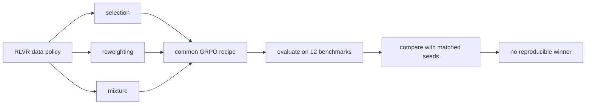
<sub>打分理由：RLVR数据策略评估平台，Agent训练相关。（core 7 / wide 5）</sub>

### 5. ⭐ 📄 Benchmark Radar: A Living Database and Search Engine for AI Benchmarks and Evaluation
arXiv [2609.11115](https://arxiv.org/abs/2609.11115) · HF 🔥 73 · Koutian Wu, Junjie Zhou, Ergan Shang 等 · [PDF](https://arxiv.org/pdf/2609.11115) · [代码](https://github.com/ktwu01/benchmark-radar) ★201

**一句话**：Benchmark Radar 把 1,283 个 benchmark 记录做成可检索数据库，连论文、代码、分数和来源一起追踪
**为什么值得你看**：做 benchmark 或面试聊 eval 体系时很实用

**核心架构**：痛点不是“找不到 benchmark 名字”，而是找不到它的原始数据、代码、评分设置和后续被谁用过，导致同分数根本不可比。Benchmark Radar 的关键改变是把 benchmark 当成带 provenance 的记录系统：日更抓取论文、repo、dataset 和 release，再把 model card、tech report 里的提及和分数历史挂回同一条目，保留 source identity 和 citation，避免只剩一个排行榜数字。最直接的证据是它的全库审计：来自 37 个来源，累计 1,283 条 source records、12,916 个 numeric observations，且提供可复现的 web dashboard、CLI 和 downloadable evidence；正文还给了一个完整 prior-art search 的案例，说明它不是静态名单而是能追溯证据链的检索系统。新意在系统组织层：把 discovery、retrieval、source inspection 合并成一个 living benchmark index。

- 1,283 条记录，12,916 个观测
- 保留来源身份与 citation
- 分数历史和 catalog 可离线查询
**为什么现在上榜**：有明确 release：v0.11.0 目录与 dashboard/CLI 已公开
**精读价值**：很值得扫一遍，做 eval 检索会反复用到
**关联**：[[OpenCompass]]、[[LLM Stats]]
#evaluation #benchmark #retrieval · 难度：中等 · 建议：值得通读 (20 min)
前置：◽ benchmark · 🔲 [[retrieval-augmented generation]] · 🔲 [[embedding]] · 🔲 [[reranker]]

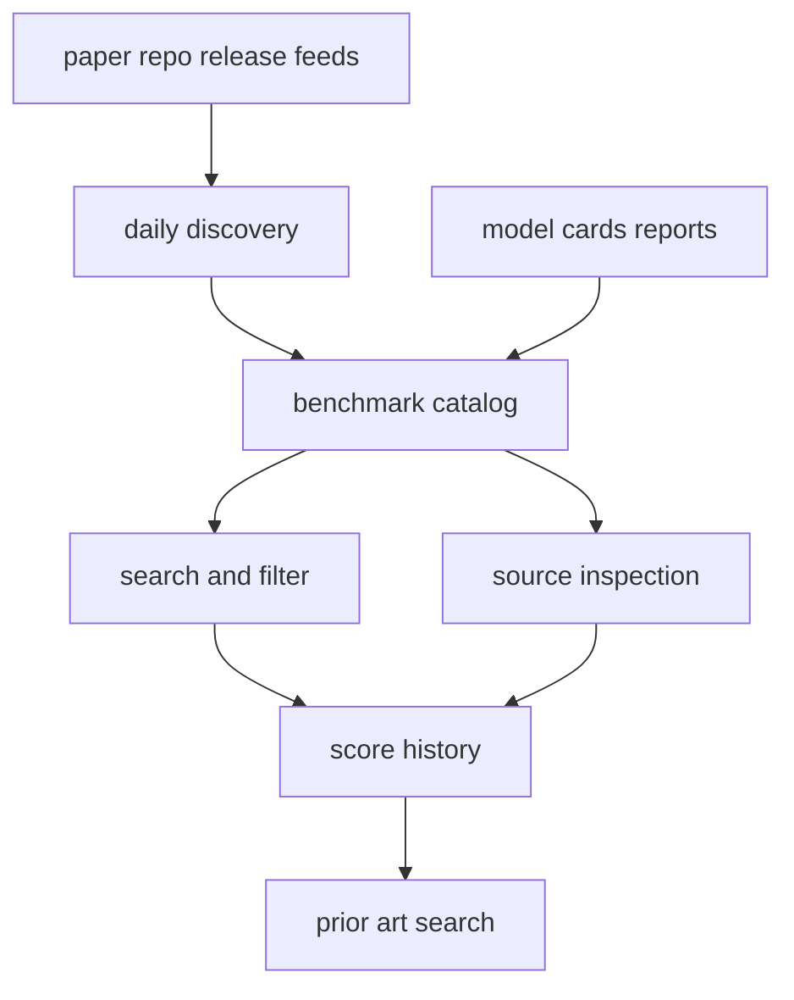
<sub>打分理由：基准/评测发现数据库，面试与研究都高用。（core 7 / wide 7）</sub>

### 6. ⭐ 📄 PLC-DPO: Posterior Label Correction in Noisy and Ambiguous Preference Optimization
arXiv [2608.30597](https://arxiv.org/abs/2608.30597) · HF 🔥 23 · Boryeong Cho, Sumyeong Ahn, Se-Young Yun · [PDF](https://arxiv.org/pdf/2608.30597) · [代码](https://github.com/VennTum99/PLC-DPO) ★4

**一句话**：PLC-DPO 用“clean / flip / tie”路由修正噪声偏好，57 组设置里平均胜率 60.5%
**为什么值得你看**：偏好优化里最常见的坑就是标签噪声和模糊偏好

**核心架构**：反直觉点是：DPO 把一对偏好默认当成绝对真值，但真实数据里既可能标反了，也可能根本没有明确方向，硬推只会把错误梯度放大。PLC-DPO 的关键概念改变是把每个 pair 的标签看成 latent state：clean 就强化原方向，flip 就反转监督，tie 就不施加强方向梯度；路由依据不是外部 reward model，而是 policy-reference margin 的在线证据，再配合 EMA 校准、stop-gradient、warm-up 和 confidence gate，避免训练早期乱改标签。最直接的证据是作者在 57 个 dataset-model-benchmark cells 上报告最高 mean win rate，且注入噪声、tie stress test 和 human-disagreement set 上路由能区分 flipped 与 weakly directional pairs。新意主要在组件层：不是换一个 preference objective，而是把“纠错”直接塞进 DPO 的 pair label 入口。

- 把 pair 标签分成 clean flip tie 三态
- 57 组设置 mean win rate 60.5%
- 是否优于 DPO 仍依赖噪声与 tie 比例
**精读价值**：值得精读，偏好噪声处理思路很面试友好
**关联**：[[DPO]]、[[KTO]]
#dpo #alignment #preference · 难度：硬核 · 建议：建议精读
前置：🔲 [[DPO]] · 🔲 [[reward model]] · 🔲 [[alignment]] · ◽ Bradley-Terry model

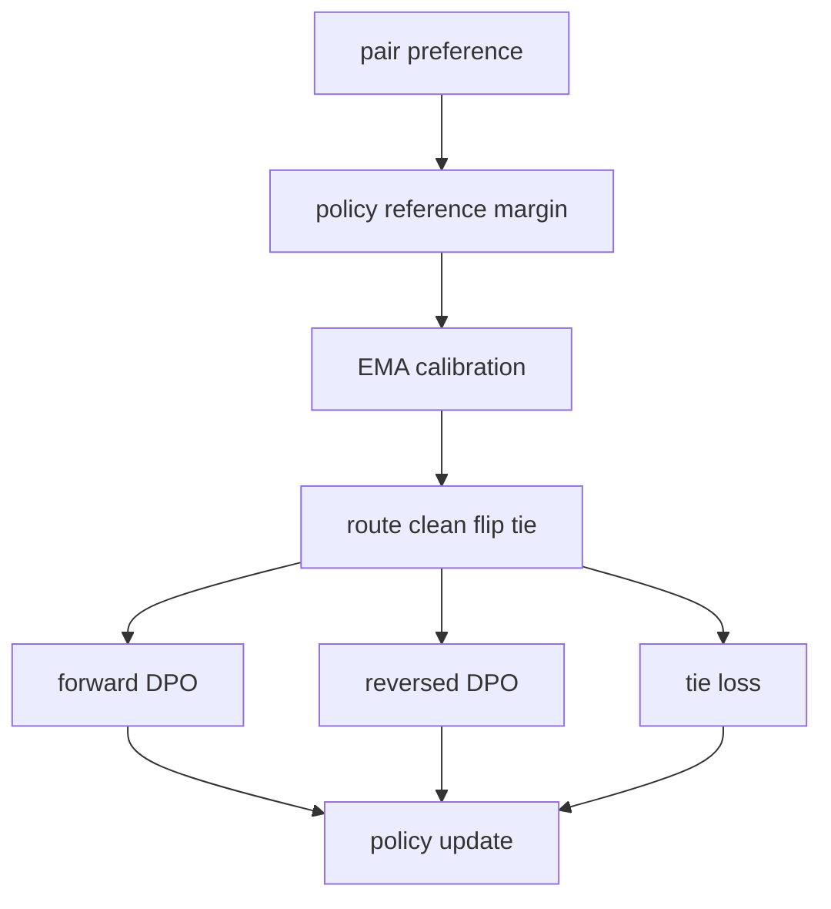
<sub>打分理由：噪声偏好校正DPO，后训练方法实用。（core 7 / wide 6）</sub>

### 7. ⭐ 📄 Studying Without a Syllabus: Task-Agnostic Environment Preprocessing
arXiv [2609.10824](https://arxiv.org/abs/2609.10824) · HF 🔥 3 · Vinay Samuel, Varun Ursekar, Vijay S. Kalmath 等 · [PDF](https://arxiv.org/pdf/2609.10824)

**一句话**：用任务无关的study预算构造环境工件，5/6基准上Avg@3最佳
**为什么值得你看**：很像Agent版预处理，适合看系统设计

**核心架构**：反直觉点在于：新环境里还没见到下游任务，就能先‘读书’并产出对后续求解有用的工件。传统方法要么依赖task examples、trajectory或feedback来决定该建什么，要么先验绑定某类环境；这篇把问题改成 task-agnostic environment preprocessing：studying system 先在预算内探索环境，再把索引、脚本、procedural guidance 等文件型 artifact 留给 frozen solver。关键改变是把‘适配’从针对任务的优化，改成针对环境内容的自选式准备；artifact 阻断的是 test-time 反复试错的高采样成本。最直接的证据是六个异构 benchmark 上，archive-equipped Meta-Agent 在五个上拿到最高 Avg@3，而且 studied artifacts 让达到同分数所需的 test-time sampling 下降。新意主要在系统组织层：不是又一个固定 corpus-processing workflow，而是让 meta-agent 决定学什么、产什么。

- 5/6 基准上 Avg@3 最好
- 大 study budget 不稳定变好
- 复现难点在环境与工件设计
**精读价值**：值得看，核心是把计算前移到study阶段
**关联**：[[Machine Studying]]、[[RAPTOR]]
#agent #rl #planning · 难度：中等 · 建议：值得通读 (20 min)
前置：🔲 [[planning]] · 🔲 [[memory]] · 🔲 [[retrieval-augmented generation]] · ◽ agent

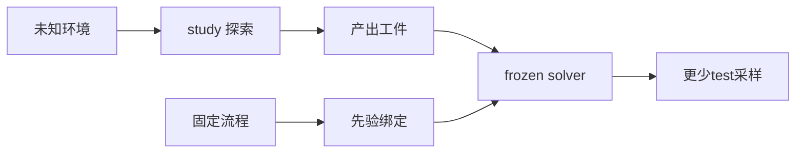
<sub>打分理由：无任务大环境预处理，契合agent/RL前置准备（core 7 / wide 5）</sub>

### 8. ⭐ 📄 Breaking the Vision-Action Shortcut: Latent Interface Training for Generalizable Robotics Foundation Models
arXiv [2609.12641](https://arxiv.org/abs/2609.12641) · HF 🔥 62 · Jianman Lin, Shailesh Shailesh, Zhongyi Luo 等 · [PDF](https://arxiv.org/pdf/2609.12641) · [代码](https://github.com/MAGICLAB-NUS/LIT) ★26

**一句话**：用LIT切断视觉捷径，LIBERO-Plus提升3.87–10.70点
**为什么值得你看**：机器人VLA泛化的训练机制，面试很能聊

**核心架构**：问题很具体：机器人在训练集里常把某些视觉线索和动作偶然绑定，结果一换相机、光照或干扰物就掉点。以前的做法要么强化表示、往里塞更多几何信息，要么先做image-free pretraining，但都没真正限制 action expert 该怎么用视觉。LIT 的核心变化是两阶段：Stage 1 先不用图像，只用 language、robot state 和每段动作 chunk 的 terminal SE(3) pose 学一个 spatial-goal-conditioned action prior；Stage 2 再让 latent interface 成为唯一视觉入口，并用 pose reconstruction 监督它还原同一个 terminal pose。这个设计阻断的是“直接吃视觉捷径”，同时保住与动作生成相关的空间目标信息。最强证据是跨四种 VLA/WAM 架构都提升 LIBERO-Plus 3.87–10.70 个点，且真实场景在未见相机、光照、干扰下也涨 13.3–16.7 点。新意在组件层加系统层：不是换 backbone，而是重写视觉到动作的接口约束。

- 四种架构都能插，涨幅 3.87–10.70 点
- 没证明对所有任务都更好，仍依赖 pose 监督
- 复现需要机器人数据和分阶段训练
**精读价值**：值得精读，关键在‘接口约束’这个泛化思路
**关联**：[[Diffusion Policy]]、[[RT-2]]
#robotics #generalization #vision · 难度：硬核 · 建议：建议精读
前置：◽ VLA · 🔲 [[diffusion model]] · ◽ robot foundation model · 🔲 [[vision-language-action]]

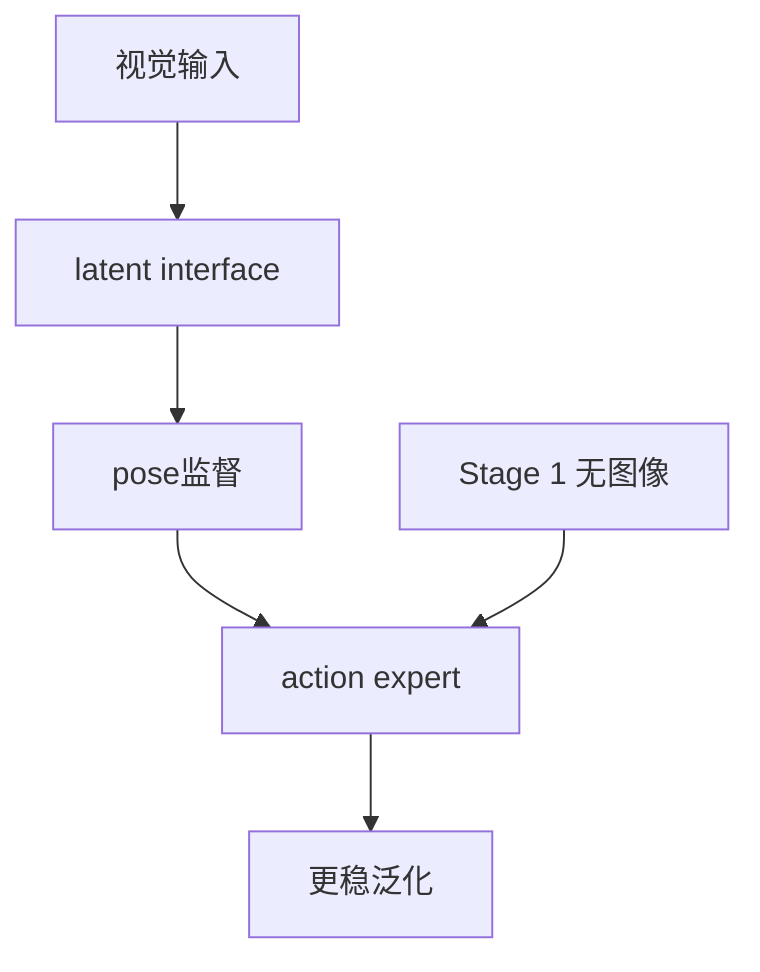
<sub>打分理由：机器人视觉-动作短路与泛化，面向具身。（core 6 / wide 5）</sub>

## 🧰 项目 · 核心方向

### 9. ⭐ 🧰 pacifio/atlas
[GitHub](https://github.com/pacifio/atlas) ★4,400 (+1077 今日) · Trending daily · infra · Rust

**一句话**：给coding agents做source control，4.4k stars，9/6发alpha-0.3.1
**为什么值得你看**：Agent 工程化基础设施，适合看成熟度

**核心架构**：它解决的是多 agent 开发里最烦的痛点：每个 agent run 都会改代码，但谁改了什么、为什么改、和之前哪次尝试有关，往往散在终端滚屏和各自的记忆文件里。Atlas 的承重组件是 checkpoint 体系：每次 agent session 都落到本地 `.atlas/sessions.db`，commit 再反向链接回产生它的 session、prompt、tool calls 和 reasoning；共享 memory 则把 plan、failures、architecture notes 在不同 agent 间复用，避免切换 Claude Code / Codex 时从零开始。检测条件很明确：当你在 commit、换 agent、或 `@` 引用文件/笔记/历史 session 时，Atlas 先在本地解析与聚合，再把统一上下文送给外部 agent。成熟度信号不错：有 CI、docs、release，且最近连续发了 alpha/exp 版；README 的‘source control for coding agents’也和可见机制一致。和普通编辑器/聊天壳的差别在于，它不是只提供聊天入口，而是把 agent 历史、版本控制、共享记忆绑成一个运行时。

- 4.4k stars，近日报 release
- 有 CI、docs、release，可见证据较足
- 只支持 macOS，Linux/Windows 未测
**为什么现在上榜**：最近 release：alpha-0.3.1（2026-09-06）
**精读价值**：值得关注，属于agent工作流基础设施
**关联**：[[MCP]]、[[MemGPT]]
#agent #versioning #multi-agent · 难度：中等 · 建议：值得通读 (20 min)
前置：◽ agent · 🔲 [[memory]] · 🔲 [[multi-agent]] · 🔲 [[embedding]]

```mermaid
graph LR
A[agent run] --> B[checkpoint]
B --> C[sessions db]
C --> D[shared memory]
D --> E[下个agent]
F[@引用] --> G[本地解析]
G --> E
```
<sub>打分理由：agent代码/变更追踪，贴合核心方向（core 8 / wide 7）</sub>

### 10. ⭐ 🧰 langwatch/langwatch
[GitHub](https://github.com/langwatch/langwatch) ★4,780 (+1251 本周) · Trending weekly · infra · TypeScript

**一句话**：用 LangWatch 统一 LLM trace、eval、routing，开源可自托管
**为什么值得你看**：做 Agent/RAG 评测与线上观测都能直接看

**核心架构**：这类工具的痛点不是“能不能跑”，而是 agent 一旦进了真实业务，日志、评测、路由、治理会散在不同系统里，出了 prompt injection、成本飙升或工具调用失控，很难把一次失败追到具体 LLM call。LangWatch 的关键改变是把每次 LLM/agent 调用都当成可追踪事件，再围绕这条事件链挂 observability、agent testing、evaluations、prompt management、AI gateway 和 governance；这些组件分别阻断“看不见失败”“测不出回归”“控不住预算”“管不住权限”四类问题。正文里最直接的证据是它把 coding agents、frameworks、model providers、governance sources 都接进同一套平台，还支持本地 self-host 和 open-source；但原文未明确公开一组统一基准来证明哪类 agent 测试最有效。新意主要在系统组织层：不是单点评测库，而是把线上监控、离线测试和企业治理收进同一控制面。

- 更像 LLM Ops 平台，不是单一 benchmark
- 覆盖 coding agents 到治理源，集成面广
- 原文未明确统一评测协议，效果难横比
**精读价值**：适合做 Agent 评测/观测栈选型
**关联**：[[OpenTelemetry]]、[[LangSmith]]
#eval #agent #benchmark · 难度：中等 · 建议：值得通读 (20 min)
前置：◽ agent · ◽ evaluation · 🔲 [[retrieval-augmented generation]] · 🔲 [[prompt injection]]

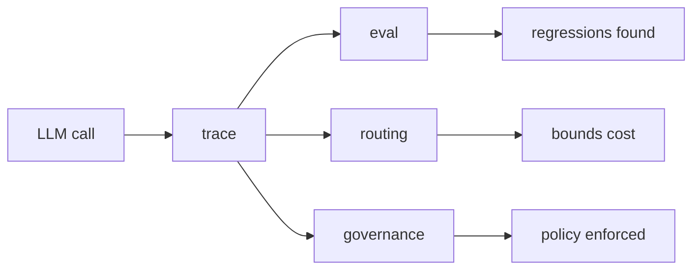
<sub>打分理由：LLM评测与agent测试平台，和核心方向高度匹配（core 7 / wide 7）</sub>

### 11. ⭐ 🧰 multimodal-art-projection/YuE
[GitHub](https://github.com/multimodal-art-projection/YuE) ★8,263 (+578 今日) · Trending daily · model · Python

**一句话**：用符号规划+flow matching 做 YuE2，最佳 8 次均分 6.9632
**为什么值得你看**：多模态生成里少见的“可编辑”音乐系统

**核心架构**：反直觉点在于：直接从 lyrics 到音频，往往更像黑箱采样，能出声但很难改旋律、和弦或结构；而纯符号生成又常停在“谱面好看、声音不行”。YuE2 的关键改变是把音乐拆成可编辑的 symbolic plan 再落到 audio：AR–NAR Mixture-of-Transformers 先自回归预测 score 和 semantic tokens，随后用 flow matching 生成 acoustic latents，最后由 VAE 解码成 stereo audio。这个分工阻断了两类失败：规划阶段保住可读可改，声学阶段负责补足音色与质感。最直接的证据是 WildSongBench 上 best-of-8 的 6.9632 SongBench Avg，作者把它放在与 Suno v5/v6 的对比里；同时 demo 里能做 zero-shot covers 和 9 步 14 版的 agentic editing，说明“同一 checkpoint 支持生成、翻唱、修改”不是口号。新意在组件层加系统组织层：符号规划作为中间表示，把音乐生成变成可干预流程。

- best-of-8 6.9632，直接对标商业系统
- 能先改 score 再渲染，编辑性是核心证据
- 24GB BF16 才够跑，复现门槛不低
**为什么现在上榜**：2026-09-09 release
**精读价值**：想看可编辑音乐生成，值得精读
**关联**：[[AudioLM]]、[[MusicLM]]
#music #agent #planning #multimodal · 难度：硬核 · 建议：建议精读
前置：◽ AR · 🔲 [[diffusion model]] · 🔲 [[flow matching]] · 🔲 [[VAE]]

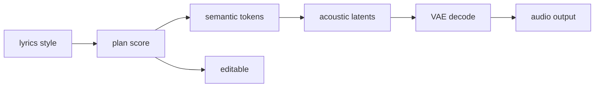
<sub>打分理由：符号规划+生成音乐，偏多模态与agent思路（core 7 / wide 6）</sub>

### 12. ⭐ 🧰 microsoft/AI-Engineering-Coach
[GitHub](https://github.com/microsoft/AI-Engineering-Coach) ★4,116 (+112 今日) · Trending daily · tool · TypeScript

**一句话**：读本地 AI 日志做 Coach，发现 45 类坏习惯
**为什么值得你看**：面试聊 agent 开发流程与 context management 很顺

**核心架构**：它解决的是一个很真实的痛点：很多人有大量 Copilot、Claude Code、terminal session，但只知道“今天用了多少”，不知道自己的提示词、上下文、工具使用哪里在拖后腿。AI Engineer Coach 的承重组件是本地日志解析加规则化诊断，再把结果组织成 Dashboard、Timeline、Coding Moments、Output、Patterns 和 Anti-Patterns；检测到重复提示、上下文管理差、instruction file 异常时，给出分数、趋势和具体动作。成熟度信号不错：README 明确给出本地构建、VSIX 安装、GitHub Copilot app canvas 跑法，并强调 no data leaves your machine；但它不是商店上架版，需自己打包，且部分能力依赖本地 VS Code model，在 canvas 模式下会隐藏。和同类工具比，它更偏“训练/教练”而非纯 observability：不仅看发生了什么，还试图把 session 变成可复用 skills。

- 45 条规则，覆盖 prompt 到 context management
- 本地处理日志，隐私边界清楚
- 部分能力依赖 VS Code model，canvas 下会缩水
**为什么现在上榜**：原文未明确
**精读价值**：适合想系统改进 agent 使用习惯的人看
**关联**：[[OpenTelemetry]]、[[LangSmith]]
#agent #engineering #eval · 难度：中等 · 建议：值得通读 (20 min)
前置：◽ agent · 🔲 [[prompt injection]] · 🔲 [[planning]] · 🔲 [[memory]]

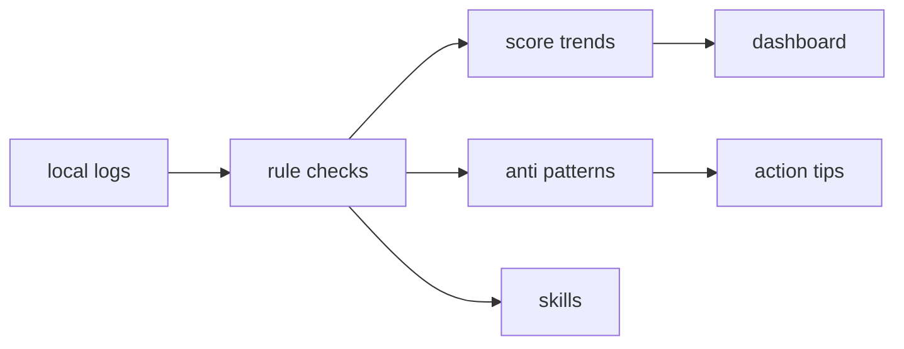
<sub>打分理由：面向agent工程实践，较贴合（core 7 / wide 6）</sub>

### 13. ⭐ 🧰 experientiallabs/experiential
[GitHub](https://github.com/experientiallabs/experiential) ★4,849 (+4416 本月) · Trending monthly · infra · Python

**一句话**：Experiential is the open source, zero markup gateway for BYOK, self-hosted and 1000+ marketplace models
**为什么值得你看**：（dry-run：未调用 LLM，配置 OPENAI_API_KEY 后会生成中文速览）
- It learns from your traffic to cut costs, recommend better models, and train a specialized model you own.
#llm-routing #cost #mcp · 难度：中等 · 建议：看速览即可
<sub>打分理由：自托管多模型网关，偏推理成本优化（core 6 / wide 6）</sub>

### 14. ⭐ 🧰 ruvnet/RuView
[GitHub](https://github.com/ruvnet/RuView) ★93,774 (+370 今日) · Trending daily · model · Rust

**一句话**：π RuView turns commodity WiFi signals into real-time spatial intelligence, vital sign monitoring, and presence detection — all without a single pixel of video.
**为什么值得你看**：（dry-run：未调用 LLM，配置 OPENAI_API_KEY 后会生成中文速览）
#sensing #spatial #rf #ml · 难度：中等 · 建议：看速览即可
<sub>打分理由：WiFi信号到空间/生命体征，属于视觉替代感知（core 6 / wide 5）</sub>

## 🌐 全领域热点

### 15. 🌐 🧰 Panniantong/Agent-Reach
[GitHub](https://github.com/Panniantong/Agent-Reach) ★81,115 (+640 今日) · Trending daily · tool · Python

**一句话**：Give your AI agent eyes to see the entire internet
**为什么值得你看**：（dry-run：未调用 LLM，配置 OPENAI_API_KEY 后会生成中文速览）
- Read & search Twitter, Reddit, YouTube, GitHub, Bilibili, XiaoHongShu — one CLI, zero API fees.
#agent #retrieval #web #evaluation · 难度：中等 · 建议：看速览即可
<sub>打分理由：强agent抓取能力，面向真实检索/工具调用（core 5 / wide 8）</sub>

### 16. 🌐 🧰 harry0703/MoneyPrinterTurbo
[GitHub](https://github.com/harry0703/MoneyPrinterTurbo) ★123,628 (+499 今日) · Trending daily · tool · Python

**一句话**：一键把主题变高清短视频，作者报告 v1.3.7 新增逐词字幕和停顿控制
**为什么值得你看**：适合看 agent 工作流和多模态内容生产边界

**核心架构**：它面对的痛点很具体：你只有一个主题或关键词，但要交付的是脚本、配音、素材、字幕、配乐和成片，手工串起来最容易在脚本节奏、TTS 停顿和字幕对齐上出错。它的关键改变不是“加了很多功能”，而是把短视频生产拆成可插拔的 AI Agent + WebUI + API + CLI 工作流：LLM 负责脚本和检索词，TTS 负责旁白，素材检索和剪辑各自独立，中间用统一任务流衔接，阻断的是单点模型输出不稳定导致的整条链路失败。最直接的证据是最新 release 里把逐词字幕、弹出动画、背景音乐预览、Azure TTS 原生 pause 做成独立控制项，说明它在补“生成后对齐与可控性”这层短板，而不是只追求一键出片。新意主要在系统组织层：把内容生成、时序控制和多模型接入做成流水线式编排，而不是单模型生成器。

- 逐词字幕和 pause 直接补时序对齐
- 支持多家 LLM/TTS，链路可替换
- 纯看 README 不等于可稳定复现整条产线
**为什么现在上榜**：最近 release：v1.3.7（2026-09-13）
**精读价值**：看速览即可，像工程编排多于研究方法
**关联**：[[ReAct]]、[[AutoGPT]]
#video #generation #workflow #automation · 难度：入门 · 建议：看速览即可
前置：🔲 [[planning]] · 🔲 [[memory]] · 🔲 [[multi-agent]] · ◽ text-to-speech

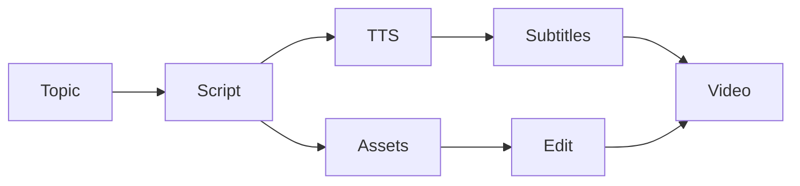
<sub>打分理由：短视频生成热，但偏流程套壳（core 3 / wide 7）</sub>

### 17. 🌐 🧰 OpenBMB/VoxCPM
[GitHub](https://github.com/OpenBMB/VoxCPM) ★37,313 (+204 今日) · Trending daily · model · Python

**一句话**：VoxCPM2 用 tokenizer-free diffusion autoregressive 生成语音，2B 模型支持 30 语种和可控克隆
**为什么值得你看**：适合看 TTS 新架构、vLLM-Omni 部署和语音克隆面试题

**核心架构**：它要解决的反直觉点是：高自然度语音不一定要先离散成 tokenizer，再像 LLM 那样预测 token。传统 TTS 往往被离散化和声学码本限制，细腻的韵律、情绪和克隆细节会在编码阶段丢失。VoxCPM2 的关键概念改变是 tokenizer-free：直接生成连续语音表示，再用 diffusion autoregressive 架构把文本条件下的声学轨迹一步步拉到可听波形；VAE 负责把 16kHz 参考和 48kHz 输出对接，阻断的是“分辨率不够、细节被上采样补丁掩盖”的失败模式。最直接的支撑是它报告 2B 参数、超过 200 万小时、多语言和 48kHz 输出，并在 vLLM-Omni 上给出 RTF ~0.13 的服务形态，说明这不是只会离线合成的研究原型。新意主要在组件层和系统层：前者是无 tokenizer 的连续语音建模，后者是把它做成可流式、可多租户的 OpenAI-compatible 语音服务。

- 核心证据是多语种+克隆+48kHz 一体化
- 没证明极端低资源语种是否稳
- 复现门槛高，训练和推理都吃算力
**为什么现在上榜**：最近 release：2.0.3（2026-05-11）
**精读价值**：值得精读，TTS 架构和部署都很新
**关联**：[[VALL-E]]、[[AudioLM]]
#tts #speech #multilingual #cloning · 难度：硬核 · 建议：建议精读
前置：🔲 [[diffusion model]] · 🔲 [[autoregressive image generation]] · ◽ text-to-speech · 🔲 [[vLLM]]

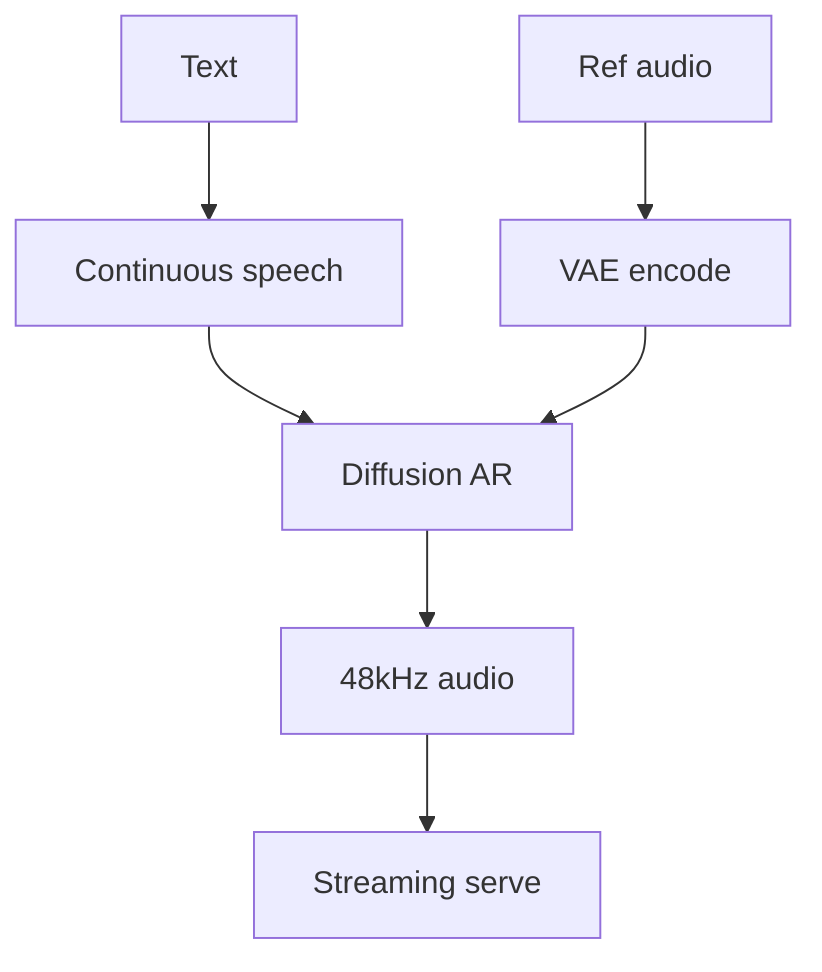
<sub>打分理由：TTS新方法+开源，语音生成热度高（core 4 / wide 7）</sub>

### 18. 🌐 🧰 tashfeenahmed/freellmapi
[GitHub](https://github.com/tashfeenahmed/freellmapi) ★26,183 (+7674 本月) · Trending monthly · infra · TypeScript

**一句话**：FreeLLMAPI 把 34 家免费 LLM 和 635 个端点收进一个 /v1，作者报每月 74 亿 token
**为什么值得你看**：适合看 LLM 路由、fallback 和 OpenAI-compatible 生态

**核心架构**：它解决的是很现实的痛点：你想稳定做实验、写 agent 或批量调用，但单一免费 API 容易撞限额、换模型又要改一堆 SDK。它的关键做法不是“聚合列表”，而是把多个 provider 放进统一 router：请求先匹配可用模型，再按 key 的健康、配额和失败状态做 failover，阻断的是某家限流或失效把整个调用打断。另一个关键机制是 signed catalog 自动更新，减少你手动同步模型和 quota 变化的成本。最直接的证据是它明确支持 OpenAI-style 的 chat、responses、embeddings、audio 等 surface，并且给出 Claude Code、Codex CLI、Cursor 等工具的一键接入，说明它把“能接上”做成了工程闭环。新意主要在系统组织层和运行时机制：统一 API、动态路由、密钥加密和自动配置生成。

- 路由会跳过没健康 key 的平台
- signed catalog 免手动 git pull
- 免费额度依赖外部 provider，稳定性有上限
**为什么现在上榜**：最近 release：v0.9.9（2026-09-10）
**精读价值**：看速览即可，核心是工程路由不是新模型
**关联**：[[LiteLLM]]、[[OpenRouter]]
#llm-routing #api #inference · 难度：中等 · 建议：看速览即可
前置：◽ OpenAI-compatible API · ◽ routing · ◽ failover · 🔲 [[embedding]]

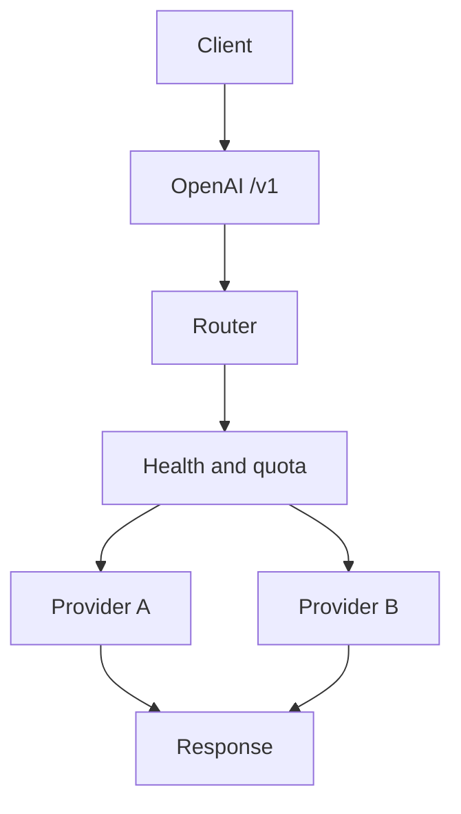
<sub>打分理由：LLM路由/多供应商，主要是工程封装（core 3 / wide 6）</sub>

---
想精读哪一篇？在 Claude 里说：`精读 2026-09-14 第 N 条`，Jarvis 会按你的 known.md 只讲你不会的部分。