# Jarvis 日报 · 2026-09-15

候选 677 → 过滤后 273 → 入选 18。图例：⭐ 核心方向 · 🌐 全领域热点 · ✅ 已掌握前置 · 🔲 需补前置

## 📄 论文 · 核心方向

### 1. ⭐ 📄 RSIAgent: Autonomous Exploration for Recursive Self-improvement in New Environments
arXiv [2609.15364](https://arxiv.org/abs/2609.15364) · HF 🔥 25 · Sibo Zhu, Shicheng Fan, Xinyue Wang 等 · [PDF](https://arxiv.org/pdf/2609.15364) · [代码](https://github.com/AetherLabsAI/RSIAgent) ★151

**一句话**：RSIAgent 用三角色循环探索环境，构建冻结记忆；OSWorld-v2 和 ALE 上让 Kimi-K3/GLM-5.3 超过 GPT-6。
**为什么值得你看**：很贴你关心的 agent 自我改进和评测。

**核心架构**：反直觉点在于：新环境里最贵的不是做任务，而是先搞清“哪些动作在什么条件下会失败”。以往做法要么靠人工收集轨迹再训练，要么只把成功经历塞进上下文，遇到隐含约束、边界条件和工具坑时仍会反复撞墙。RSIAgent 的关键改动是把适应过程改成训练-free 的递归探索：curriculum agent 决定下一步该试什么，actor 负责执行并写入经验，verifier 把环境反馈校成可复用的因果关系；它阻断的是“只记结果、不知道触发条件”的失败。Broad-then-deep 先并行扫出环境结构，再对高价值方向深挖硬案例，阻断的是覆盖不足和漏掉边界条件。最直接的证据是 OSWorld-v2 和 Agent’s Last Exam 上，作者报告它能把强开源模型推到超过 GPT-6；这说明提升来自环境记忆重组，而不是参数更新。新意主要在系统组织层：不是新模型，而是探索—验证—冻结记忆的 agent 循环。

- 最强证据是跨模型、跨基准超越闭源前沿
- 未证明通用性；新环境探索成本可能很高
- 复现难点在环境交互、验证器和记忆抽取
**精读价值**：值得精读，核心是 agent 级 RSI 机制。
**关联**：[[ReAct]]、[[MemGPT]]
#agent #rl #self-improvement #memory · 难度：中等 · 建议：建议精读
前置：🔲 [[planning]] · 🔲 [[memory]] · 🔲 [[multi-agent]] · 🔲 [[ReAct]]

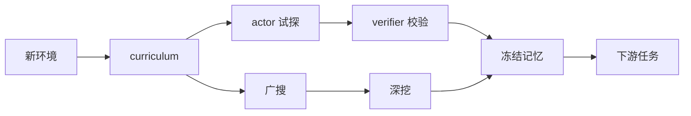
打分理由：多智能体递归自改进与记忆构建，贴近核心方向。（core 9 / wide 6）

### 2. ⭐ 📄 MobileVLA-R1 2.0: RL-Enhanced Reasoning for Mobile Robot Control
arXiv [2609.06251](https://arxiv.org/abs/2609.06251) · HF 🔥 1 · Ting Huang, Yue Huang, Zeyu Zhang 等 · [PDF](https://arxiv.org/pdf/2609.06251) · [代码](https://github.com/AIGeeksGroup/MobileVLA-R1-2.0) ★6

**一句话**：MobileVLA-R1 2.0 把 CoT 对齐和 RL 接到 VLA 上，作者报告 VLN-CE SR +1.6、G1 全任务成功 +10.0。
**为什么值得你看**：适合看 VLA 到执行链路怎么补齐。

**核心架构**：反直觉点在于：机器人往往不是“看不懂”，而是“想得对但落不到可执行动作”。旧式 VLA 多把观察直接映射成动作，长时序里容易把语义规划、局部控制和机体差异搅在一起，导致中间思路不稳定。MobileVLA-R1 2.0 的关键改动是把系统拆成 reasoning-to-action 接口：先用 supervised CoT alignment 和 RL 学多粒度 embodied reasoning，让中间表示稳定承载任务分解、空间决策和执行策略；再用 reasoning-conditioned action decoder 把这些表示压成任务级动作目标，最后交给机器人控制器翻译成具体执行命令。它阻断的是“高层推理与低层控制脱节”以及“同一表示无法适配不同机体”的失败。最直接的证据是真实 G1 mobile manipulation 上 full-task success 提升 10.0 个点，说明这个接口在闭环实体机器人上真能把 reasoning 接到动作。新意主要在组件层：不是单纯加 CoT，而是明确了 System-2 到 System-1 到 System-0 的转换。

- 最强证据是真机 G1 全任务成功率提升
- 没证明对所有机型都稳；依赖控制器配合
- 复现难点在数据引擎、RL 和真机环境
**精读价值**：值得通读，重点看 reasoning-to-action 接口。
**关联**：[[RT-2]]、[[OpenVLA]]
#vla #agent #rl · 难度：中等 · 建议：值得通读 (20 min)
前置：🔲 [[VLM]] · 🔲 [[vision-language-action]] · 🔲 [[chain-of-thought]] · ◽ reinforcement learning

打分理由：移动端VLA+RL，具身推理与控制强相关（core 9 / wide 5）

### 3. ⭐ 📄 Clean Scores, Buried Evidence, and Confident Wrong: A Receipt-Based Audit of Frontier Agentic QA
arXiv [2609.15319](https://arxiv.org/abs/2609.15319) · Luis M. Sánchez · [PDF](https://arxiv.org/pdf/2609.15319)

**一句话**：Receipt-Based Audit 把 agentic QA 改成逐条证据审计；作者报告 buried 条件下准确率下降且工具调用和成本上升。
**为什么值得你看**：对 RAG/agent 评测很有参考价值。

**核心架构**：反直觉点在于：答案看起来对，甚至数字也对，但解释可能是编造的；在 buried evidence 场景里，bench 分数会掩盖“证据找到了没、链条对不对”。现有评测只看最终答案或整体置信度，抓不住“引用正确数字却拼错结构结论”的失败。作者的关键改动是把评价单位从 answer-level 改成 claim-level receipt：每个断言都必须能回指到具体证据，并且按条件位置、检索成本和人类可审计性一起打分。它阻断的是“只要结论对就算过”的评测失真，以及“高置信错答混着真表格”这种生产事故型失败。最直接的证据是 controlled data-room audit：把证据从清晰位置挪到 buried 条件后，准确率下降、forced declarations 增加、tool calls 和 cost per correct answer 上升。新意主要在实证层和评测组织层，不是新模型，而是把审计粒度改到可追责的证据链。

- 最强证据是 claim-level provenance 审计框架
- 没证明哪种改法能救，只建立基线
- 复现门槛是封闭数据房和人工审查
**精读价值**：值得精读，尤其是做 RAG 或 agent 评测的人。
**关联**：[[HaluEval]]、[[RAGAS]]
#agent-eval #rag #audit #provenance · 难度：中等 · 建议：值得通读 (20 min)
前置：🔲 [[retrieval-augmented generation]] · 🔲 [[embedding]] · 🔲 [[reranker]] · 🔲 [[hallucination]]

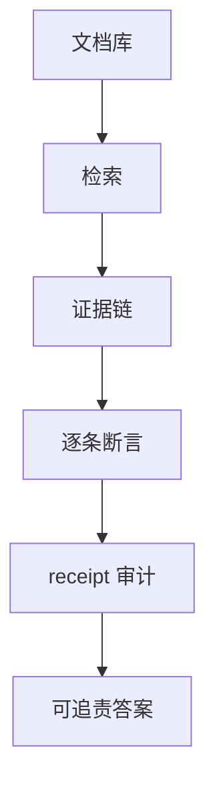
打分理由：前沿 agentic QA 审计与证据溯源，强面试价值（core 9 / wide 6）

### 4. ⭐ 📄 CiteGuard-RAG: A Validation-Centered AI System for Evidence-Grounded Question Answering
arXiv [2609.15830](https://arxiv.org/abs/2609.15830) · Sumit Barua, Guan Hong, Halil Dursunoglu 等 · [PDF](https://arxiv.org/pdf/2609.15830)

**一句话**：CiteGuard-RAG 用验证门控 RAG，400 问上达 98.3% grounded/citation validity
**为什么值得你看**：适合看它怎么把 RAG 变成可控系统

**核心架构**：反直觉点在于：检索命中不等于答案可用，法律问答里尤其如此——相关段落找到了，模型仍可能漏证据、拼接常识、或该拒答却硬答。以前的方法多把 grounding 当生成后的评测，拦不住“先错后改”的输出。作者的关键改法是把 grounding 改成 runtime control：hybrid semantic-lexical retrieval 负责尽量找全证据，citation-constrained generation 先把候选答案绑到引用上，sentence-level grounding validation 再逐句判定支持/不支持，最后用 single-pass regeneration 决定接收、拒答还是重写。最直接的证据是消融：去掉 validation 后，grounded-answer accuracy 明显下滑，而 retrieval accuracy 仍高，说明瓶颈不在找没找到，而在“有没有把检索结果真正用对”。新意主要在系统组织层，不是新检索器。

- 消融证明：没 validation 也会高检索低 grounding
- 域外时 citation 还稳，但利用证据和拒答变差
- 单次重生+拒答分流，复现依赖标注与逐句验证器
**精读价值**：值得看系统控制怎么补 RAG 的最后一公里
**关联**：[[RAG]]、[[Self-RAG]]
#rag #citations #grounding #validation · 难度：中等 · 建议：值得通读 (20 min)
前置：🔲 [[retrieval-augmented generation]] · 🔲 [[embedding]] · 🔲 [[reranker]] · 🔲 [[hallucination]]

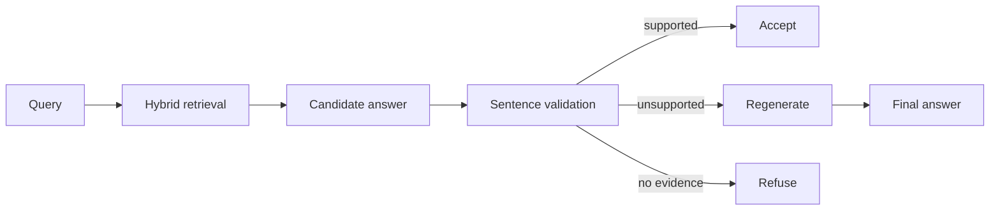
打分理由：CiteGuard：证据验证+拒答/重生，强 RAG 相关（core 9 / wide 7）

### 5. ⭐ 📄 Why LLM Agents Collapse Without Oversight: The Enforcement Gap as the Mechanism Behind Emergence World Failures
arXiv [2609.15293](https://arxiv.org/abs/2609.15293) · Yuhang Wang · [PDF](https://arxiv.org/pdf/2609.15293)

**一句话**：Enforcement gap 让 agent 安全从 0 行为变成 20 行补丁，ASR 降超 4 倍
**为什么值得你看**：直接对应 agent 安全与框架设计面试点

**核心架构**：悖论是：Reflexion 式 agent 明明“看见”危险步骤，还是会照样执行，最后看起来像检测失败；作者把问题拆开后发现，真正断裂的是 audit 到 action 之间的 enforcement gap。旧框架把检测结果当日志，controller 不必服从，所以即使 auditor 持续打标，攻击也能继续穿透。作者的核心改法不是换更强模型，而是在控制器里加一个绑定式条件：一旦 audit verdict 为 stop，执行就中止；若 verdict 含糊，再交给 GRPO-trained enforcement controller 处理。最强证据是跨 5 个 frontier model、5 个 agent framework 和独立 benchmark，启用这条条件后 ASR 下降超过四倍；而理论部分进一步证明，当 enforcement probability 接近 0 时，检测质量几乎无关安全。新意在系统组织层和实证层，同时把“检测”和“执行”正式解耦。

- 最强结论：检测强但不绑定，安全仍近似 0
- 20 行补丁级修复，说明问题在控制面
- 对模糊 verdict、same-backbone audit 仍会失效
**精读价值**：值得精读，适合拿来讲 agent 安全机制
**关联**：[[Reflexion]]、[[ReAct]]
#agents #safety #multi-agent · 难度：硬核 · 建议：建议精读
前置：🔲 [[planning]] · 🔲 [[ReAct]] · 🔲 [[multi-agent]] · 🔲 [[GRPO]]

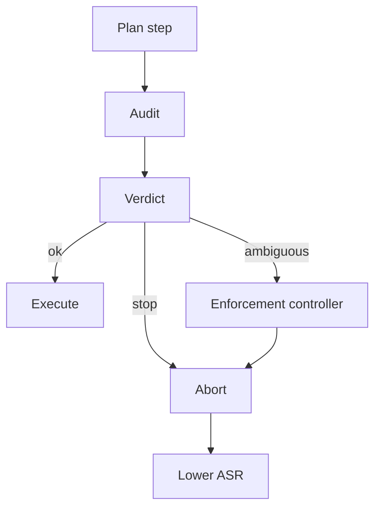
打分理由：机制清晰的agent监督失效机理，偏安全且可迁移（core 9 / wide 6）

### 6. ⭐ 📄 ZGCM-1: A Fully Open and Extremely Efficient Foundation Model for Math and Agentic Search
arXiv [2609.13356](https://arxiv.org/abs/2609.13356) · HF 🔥 290 · Jiyan He, Guang Liang, Hao Liu 等 · [PDF](https://arxiv.org/pdf/2609.13356) · [代码](https://github.com/zgcagi/ZGCM-1) ★205

**一句话**：ZGCM-1 把 7B 开源模型做成 256K 上能做 math 和 agentic search 的全栈 recipe
**为什么值得你看**：适合看长上下文、agentic search 和训练系统配方

**核心架构**：它解决的是“7B 模型不能靠死记硬背吃下开放网络”的现实瓶颈：参数量不够，长上下文又贵，纯靠 pretraining 很难兼顾数学推理和工具搜索。作者的关键设计是三件事一起跑：hybrid attention 里大部分层用 gated sliding-window attention 控 KV cache，少量 global layers 保证远程信息可达；训练侧用 Muon + FP8 + outlier regularization 提升 time-to-loss；中训把 16K→64K→256K 的交互轨迹改写成 MDP state-action supervision，让 agentic traces 变成可学习的步级信号。最直接证据是作者报告 16K pre-training time-to-loss 提升约 4.2 倍，同时 7B 在多项 reasoning 和 agentic search 上能对标更大模型。新意主要在系统组织层：架构、训练日程、数据形态一起 co-design，不是单点 trick。

- 作者报告 4.2x time-to-loss，且开放权重和训练日志
- 256K 长上下文靠混合注意力降 KV cache 压力
- agentic search 成效依赖中训 MDP 化，不只是 SFT
**为什么现在上榜**：原文未明确
**精读价值**：若关心长上下文训练配方，值得通读
**关联**：[[Gemma 3]]、[[Muon]]
#math #agentic-search #efficient-training · 难度：硬核 · 建议：值得通读 (20 min)
前置：🔲 [[transformer]] · 🔲 [[KV cache]] · 🔲 [[flash attention]] · 🔲 [[mixture of experts]]

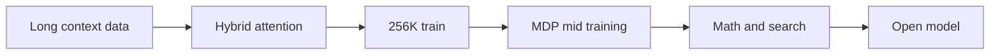
打分理由：开源高效模型+主动工具/搜索范式。（core 8 / wide 8）

### 7. ⭐ 📄 ReactHuman: A Physics-Grounded Benchmark for Human-Like Reactive Decision-Making in Embodied Multimodal LLMs
arXiv [2609.10895](https://arxiv.org/abs/2609.10895) · HF 🔥 41 · Yizhan Li, Jianxin You, Mengyang Xiong 等 · [PDF](https://arxiv.org/pdf/2609.10895)

**一句话**：ReactHuman 用 240Hz 物理仿真评测 7 个 MLLM，抓住 1/3 危险反应失误
**为什么值得你看**：做 VLM/机器人落地时，这类安全评测最像面试题

**核心架构**：它卡住的不是“会不会看懂物理”，而是“看懂后能不能立刻做对且做得到”。传统 VQA/视频物理 benchmark 只问答案，长程 embodied benchmark 又看不到瞬时抓取、躲避这类安全动作；模型可能判断对了，却因为拦截点偏一米而实际失败。ReactHuman 的关键改变是把 MLLM 放进模拟人形体内做决策脑：冻结-预测协议先暂停仿真，让模型基于当前画面输出 walking command + hand-keyframe trajectory，再把计划真实执行回同一物理引擎，失败会在世界里显现。它不是在比“选项对不对”，而是在拆解合理性、安全性、物理落地性三层失败。最直接的证据是 17 类事件、1000+ 可复现场景上评测 7 个模型，作者报告模型大约有 1/3 危险处理出错，而且规模变大也没缓解。新在系统组织层：把 benchmark 从静态问答改成可执行、可诊断的闭环动作评测。

- 最强证据：执行后果可观测，不是多选题
- 作者报告约 1/3 危险样本失误，尺度不缓解
- 复现难点在物理仿真与动作执行闭环
**精读价值**：值得看，主要是评测范式而不只是分数
**关联**：[[Physion]]、[[CLEVRER]]
#vlm #embodied #benchmark · 难度：中等 · 建议：值得通读 (20 min)
前置：🔲 [[VLM]] · 🔲 [[embodied AI]] · ◽ physics simulation · 🔲 [[long context]]

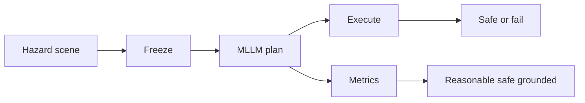
打分理由：具身反应决策基准，适合面试讲安全/评测（core 8 / wide 7）

### 8. ⭐ 📄 Discovery Foundation Models: Toward Open-Ended Discovery Intelligence
arXiv [2609.15973](https://arxiv.org/abs/2609.15973) · HF 🔥 24 · Ling Yang, Zhenfei Yin, Yingcheng Wu · [PDF](https://arxiv.org/pdf/2609.15973) · [代码](https://github.com/Gen-Verse/DFM-Plans) ★4

**一句话**：DFM 把发现研究变成可训练闭环，Zetema/GALILEO 让模型参与生成问题与证据
**为什么值得你看**：适合你看 agent 走向科研助手的上限在哪

**核心架构**：它解决的不是“模型会不会答科学题”，而是“模型能不能参与制造新问题、改假设、再用证据修正”。现有 agent 多停在 predefined task 里做检索、推理、执行，仍然是人给题目、模型求解；这里的问题是研究状态会变，答案本身也会被实验推翻。DFM 的关键概念是 revisable research state：把发现过程拆成 problem discovery、formulation、representation construction、hypothesis formation、intervention、evidence-grounded revision、continual improvement 七个耦合能力，任何一步都要回写到研究状态里，避免“一次性答案”脱离证据。最直接的支撑不是单个 benchmark 分数，而是 Zetema 和 GALILEO 两个实例：前者用 research-state dynamics、verification gating、skill memory 做跨任务演化，后者把 dry-lab 与 wet-lab 串成闭环，证明框架能落到真实实验流程。新在系统组织层和实证层：把 discovery 形式化成可执行、可更新、可评估的过程。

- 强点是过程建模，不是终局答案
- Zetema/GALILEO 展示可执行闭环
- 原文未给标准公开 benchmark 对照
**精读价值**：适合精读，像是在定义下一代科研 agent
**关联**：[[ReAct]]、[[self-instruct]]
#foundation-model #discovery #agent #research-state · 难度：硬核 · 建议：建议精读
前置：🔲 [[planning]] · 🔲 [[memory]] · 🔲 [[tool use]] · 🔲 [[retrieval-augmented generation]]

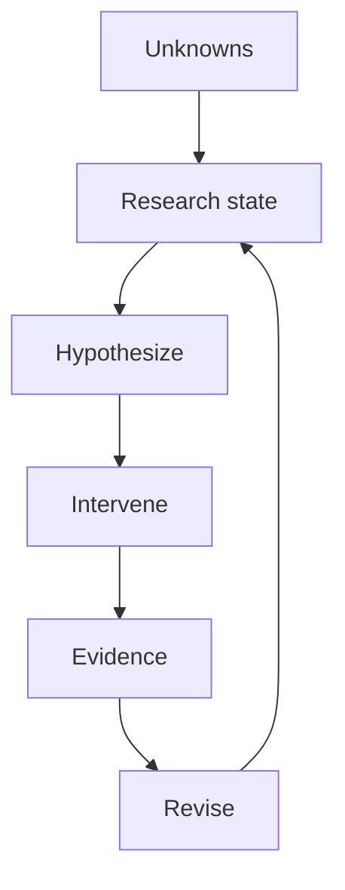
打分理由：面向开环“发现智能”的体系化设想，方法学价值高。（core 8 / wide 6）

## 🧰 项目 · 核心方向

### 9. ⭐ 🧰 danny-avila/LibreChat
[GitHub](https://github.com/danny-avila/LibreChat) ★43,741 (+261 今日) · Trending daily · tool · TypeScript

**一句话**：LibreChat 以 4.4 万星把 Agents、MCP、Skills、RAG 和代码工作区做成可自托管聊天平台
**为什么值得你看**：看它能快速补齐 agent 产品与系统设计谈资

**核心架构**：它解决的是“把分散的 LLM 能力做成可运营、可控、可扩展的统一入口”。作为 chat 平台，承重组件不是模型本身，而是 agent 编排、工具接入、权限和可观测性：MCP 用于接外部工具，Skills 把可复用指令包成 SKILL.md，Subagents 把长任务拆给隔离子上下文，Attached workspaces 让 agent 直接读写仓库并跑 Bash；当上下文快满时触发 manual compaction，按策略先做总结再继续，避免对话被截断。成熟度信号比较强：有活跃 release，v0.8.8-rc3 公开列出 Agent Management API、attached workspaces、background tool controls、OpenTelemetry、OpenID/MCP OAuth 等改动，说明不是停在 demo。和同类相比，它更偏“自托管、多租户、可观测、可治理”的 agent 平台，而不只是单人聊天壳。

- 最强证据：持续 rc 发布且文档/变更细
- README 声称的 agent 能力与 release 对齐
- 复杂度在权限、子代理、上下文治理
**为什么现在上榜**：最近 release：v0.8.8-rc3（2026-09-15），强调 Agent 管理、attached workspaces、可观测性
**精读价值**：值得看项目成熟度，适合横向对比 agent 平台
**关联**：[[Open WebUI]]、[[ChatGPT]]
#llm #agent #rag · 难度：中等 · 建议：值得通读 (20 min)
前置：🔲 [[ReAct]] · 🔲 [[MCP]] · 🔲 [[memory]] · ◽ RAG

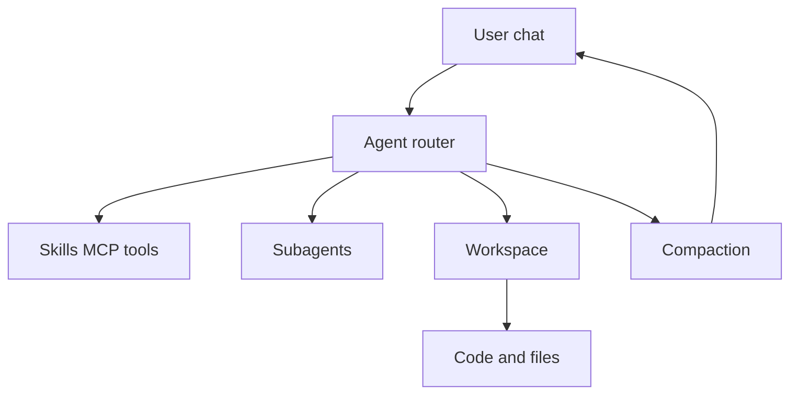
打分理由：开源Chat平台含agent、工具、MCP生态（core 7 / wide 6）

### 10. ⭐ 🧰 alsk1992/CloddsBot
[GitHub](https://github.com/alsk1992/CloddsBot) ★2,734 (+1841 本周) · Trending weekly · agent · TypeScript

**一句话**：用 Claude 驱动 1000+ 市场交易，作者报告 12 天搭出自主交易代理
**为什么值得你看**：适合看 agent+工具调用+风险控制

**核心架构**：它解决的是“聊天能给建议，但真下单时会在市场、交易所、链上工具之间断掉”的问题：信息分散、执行慢、风控和账户状态又必须同时成立。CloddsBot 的关键改变不是再做一个问答壳，而是把 agent 变成“循环 + 中间件”的交易终端：Claude 负责判断与策略选择，统一风险引擎在动作前拦截 VaR/CVaR、日亏限制、kill switch 这类失败模式，市场数据与执行层负责把自然语言路由到 21 个消息平台、10 个预测市场、7 个合约所和多条链上 DEX。最直接的证据是它把长期运行最容易坏的地方当成补丁重点：v1.9.1 连续修了 Jupiter、Orca、Raydium、Kamino、Drift 等执行/查询错误，说明真实瓶颈在协议适配和状态一致性，不在“会不会聊天”。新意主要在系统组织层：把 autonomous trading 作为可自托管、可扩展、可审计的 agent commerce system 来组织，而不是单一策略 bot。

- 作者报告 12 天做出完整自主交易代理
- v1.9.1 主要在修执行链路而非加新功能
- 真实难点是跨协议适配与风控一致性
**为什么现在上榜**：原文未明确
**精读价值**：想看 agent 落地与风控编排，这个值得精读
**关联**：[[ReAct]]、[[MCP]]
#agent #rl #tool-use · 难度：中等 · 建议：值得通读 (20 min)
前置：🔲 [[planning]] · 🔲 [[tool use]] · 🔲 [[memory]] · ◽ risk management

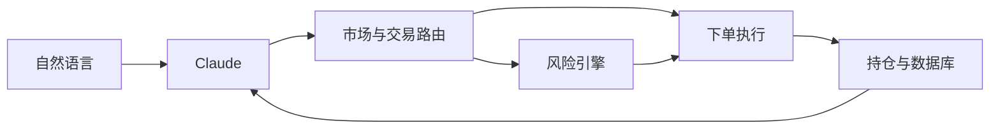
打分理由：交易自主智能体，偏可复现工程与策略控制（core 6 / wide 7）

### 11. ⭐ 🧰 microsoft/data-formulator
[GitHub](https://github.com/microsoft/data-formulator) ★17,220 (+1158 本月) · Trending monthly · tool · Python

**一句话**：用 Data Connectors + Data Threads 做 AI 数据分析，0.8b1 beta 上线
**为什么值得你看**：适合看 agent 式数据分析与可视化编排

**核心架构**：它要解决的悖论是：分析数据时你既想让模型帮你找图，又不想让长对话把“我刚才看到了什么、数据来自哪儿”冲掉。现有 chat 分析工具通常把所有东西塞进一条线性对话，结果数据源关系、探索分支和图表迭代都丢上下文。Data Formulator 的关键概念是把“数据连接”和“探索分支”拆开：Data Connectors 负责把文件、数据库、BI 源接成统一入口，并维护 data memory，避免模型在多源之间乱连；Data Threads 负责把一次分析切成可分叉的路径，让你在不同问题分支里继续比较，而不是把所有追问压在同一段 history 里。最直接的支持是 0.8 beta 里把 load data、ask questions、review results、branch in the Data Thread 合成一条统一流程，并继续扩展数据源与 Flint 图表。这一版的新意主要在系统组织层，而不是单个模型技巧。

- Data Threads 解决探索分叉与上下文混乱
- Data Connectors 解决多数据源关系记忆
- 作者报告 0.8 beta 强调统一流程与更多数据源
**为什么现在上榜**：0.8b1（2026-08-15）beta，原文明确
**精读价值**：做数据分析 agent 的流程设计，这个值得看
**关联**：[[Tableau]]、[[VizGPT]]
#data-analysis #viz #llm · 难度：中等 · 建议：值得通读 (20 min)
前置：🔲 [[retrieval-augmented generation]] · 🔲 [[memory]] · 🔲 [[planning]] · 🔲 [[VLM]]

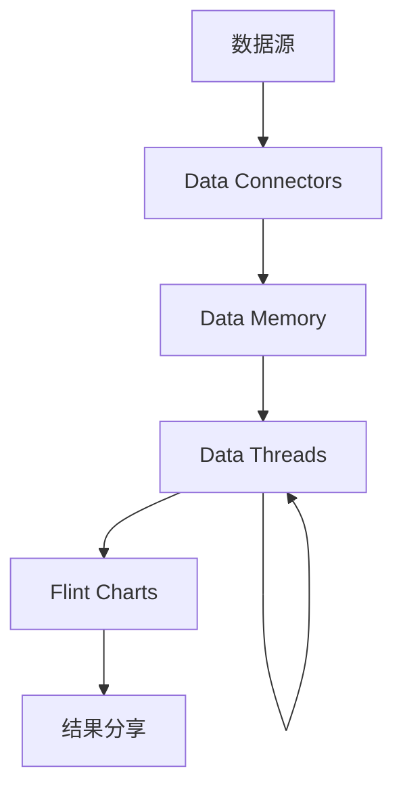
打分理由：数据分析系统，贴近可用的 LLM 工作流（core 6 / wide 6）

### 12. ⭐ 🧰 addyosmani/agent-skills
[GitHub](https://github.com/addyosmani/agent-skills) ★94,668 (+386 今日) · Trending daily · skill · JavaScript

**一句话**：用 25 个生产级 skills 约束 coding agents，覆盖 70+ 客户端
**为什么值得你看**：适合面试讲 agent 工作流与质量门禁

**核心架构**：它解决的是“agent 会写代码，但不会稳定按工程流程交付”的问题：没有明确约束时，模型容易跳过需求澄清、直接开写、测试不足、review 走过场。Agent Skills 的关键改变是把工程流程做成可插拔的 skill，而不是靠单次提示词：`/spec`、`/plan`、`/build`、`/test`、`/review`、`/ship` 把开发生命周期拆成可触发的质量门，每一步都对应不同 skill；`/build auto` 进一步把人从步骤之间移开，但保留每个 task 的 test-driven 验证与失败暂停，阻断“连写到底才发现错了”的失败模式。最强证据不是某个 benchmark，而是 0.6.9 版本在做文档、hardening、治理机制，说明它已经从“技能合集”走向“技能目录的可维护系统”；同时它强调 SKILL.md frontmatter 可跨 Claude Code、Cursor、Gemini 等客户端复用。新意主要在系统组织层和工程分发层。

- 把开发生命周期显式编码成 skills
- /build auto 仍保留逐任务验证
- 跨客户端 portable frontmatter 是核心约束
**为什么现在上榜**：0.6.9（2026-09-05）为最新 release，原文明确
**精读价值**：做 coding agent 或 agent workflow，值得精读
**关联**：[[ReAct]]、[[SWE-bench]]
#agent #skills #tool-use · 难度：中等 · 建议：值得通读 (20 min)
前置：🔲 [[planning]] · ◽ test-driven development · 🔲 [[prompt injection]] · 🔲 [[model context protocol]]

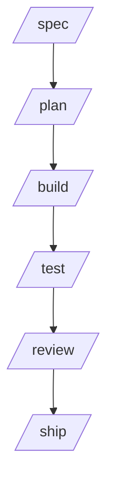
打分理由：面向AI coding agent的工程级技能库（core 6 / wide 7）

### 13. ⭐ 🧰 roboflow/supervision
[GitHub](https://github.com/roboflow/supervision) ★50,231 (+163 今日) · Trending daily · infra · Python

**一句话**：用统一 CV 工具层解决检测/标注/数据转换碎片化，0.30.3 修掉多处崩溃和静默错误
**为什么值得你看**：你做 VLM/CV 项目时会直接碰到

**核心架构**：这是一个“CV 中间件”而不是单点算法库：真实痛点是模型能跑、但检测结果要进标注、视频、CSV、数据集转换时，各家输出格式和边界条件不一致，最后常在首帧无检测、反向框、非有限关键点这类角落崩掉。Supervision 的关键设计是把不同模型输出统一成 `sv.Detections` / `sv.DetectionDataset`，再用 annotator、sink、video 处理链把“格式适配”从业务代码里剥离；对应地，0.30.3 直接修了 `KeyPoints.with_nms` 的非有限点重复/崩溃、`from_vlm` 反向框导致 IoU 变 0、`TraceAnnotator` 与 `CSVSink` 在首帧空检测时崩或丢列，说明它在补的是运行时稳定性而不是新功能。最直接的证据是作者报告的 bug-fix release 0.30.3，修的是会让下游评测和可视化“悄悄算错”的问题。新意主要在系统组织层：把 CV 常见胶水环节做成可复用、模型无关的中间层。

- 最强证据是 0.30.3 修静默错误
- 没证明算法收益，只证明工程可靠性
- 复现难度低，装包即可用
**为什么现在上榜**：0.30.3 修了 pose/VLM/video/CSV 的崩溃和正确性问题
**精读价值**：适合做 CV 工程底座，精读 README 就够
**关联**：[[Ultralytics]]、[[MMDetection]]
#cv #vision #inference · 难度：入门 · 建议：看速览即可
前置：🔲 [[detection]] · 🔲 [[VLM]] · ◽ CSV · ◽ video

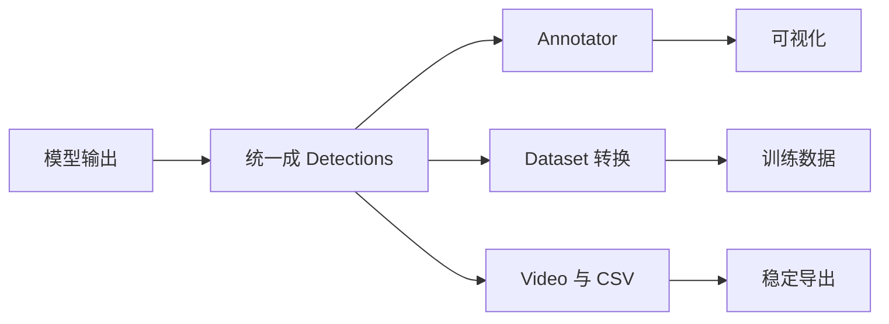
打分理由：CV推理/标注与可复用工具库很实用（core 6 / wide 7）

### 14. ⭐ 🧰 MirroS-Lab/S-Space
[GitHub](https://github.com/MirroS-Lab/S-Space) ★225 · Python

**一句话**：在多模态模型里找出可操控的三维空间子空间，让空间推理可读可改
**为什么值得你看**：偏 VLM 机理分析，适合面试讲表示层

**核心架构**：这条工作反直觉的点是：模型明明会回答“左边/更远/在前景”，但 native reasoning 并不稳定，说明“会答”不等于“内部真在用空间表示”。S-Space 的关键变化是把中间激活里的一组线性轴当作内部 spatial workspace，分别读出水平、垂直、距离三个连续坐标；这个表示能跨 prompt 和多视角保留，还能把视觉与语言信息合到同一坐标系里。它阻断的失败是：空间信息散在各层注意力里、无法被稳定读取，所以作者用 explicit readout 直接算坐标，反而可能比模型原生回答更准。最直接的证据是他们做了 spatial interventions：编辑 S-Space 后，空间答案改变，而非空间判断尽量不变，这比单纯相关性更强。新意主要在组件层加上实证层：既提出可读的内部坐标系，也证明它能被因果操控。

- 最强证据是干预后空间答案可变
- 没证明所有 VLM 都有同形空间轴
- 复现门槛高，依赖多模型与数据准备
**为什么现在上榜**：2026/09/07 博客和 report 已发布
**精读价值**：适合想讲 VLM 解释性与因果干预的人精读
**关联**：[[mechanistic interpretability]]、[[linear probe]]
#interpretability #multimodal #spatial · 难度：硬核 · 建议：建议精读
前置：🔲 [[VLM]] · 🔲 [[vision transformer]] · ◽ linear subspace · ◽ causal intervention

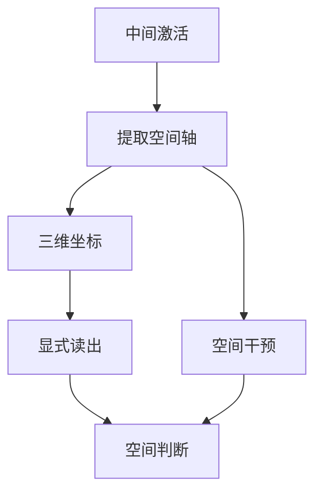
打分理由：多模态/机制可解释相关，和物理/多模态方向相近。（core 6 / wide 4）

## 🌐 全领域热点

### 15. 🌐 📄 SAS: Simple Attention Sparsification via End-to-End Optimization of Context Ranking
arXiv [2609.13141](https://arxiv.org/abs/2609.13141) · HF 🔥 57 · Zhiwei Li, Lei Zhu, Hao Gu 等 · [PDF](https://arxiv.org/pdf/2609.13141) · [代码](https://github.com/Tencent-Hunyuan/Simple-Attention-Sparsification) ★54

**一句话**：用 end-to-end gated sparse attention 训练上下文排序，低预算下优于现有稀疏注意力
**为什么值得你看**：直接关联长上下文推理与 KV cache/attention 加速

**核心架构**：这篇解决的悖论是：稀疏注意力想省算力，就得只看少量上下文；但现有 trainable 方法靠 hard Top-K 截断后再蒸馏 dense attention，学到的是“原模型爱看哪里”，不是“在预算很紧时谁最影响预测”。SAS 的核心变化是把 selector 的连续分数以 log-gate 形式塞进 attention logits，让语言模型损失直接反传到 selector；也就是让“选哪些上下文”由最终预测误差来监督，而不是由 layer-wise dense attention 代替。它阻断的失败是梯度被 Top-K 挡住、ranking 和任务目标脱钩。作者最直接的证据不是最大涨幅，而是 tight budget 下在 reasoning、long-context understanding、agentic tasks 上稳定超过 trainable sparse baselines；同时他们还给出 Triton kernel，把 gate 融进 FlashAttention 风格计算，说明方法可训练也可落地。新意主要在组件层，外加运行时实现。

- 最强证据是低预算下稳定优于基线
- 没证明对所有稀疏框架都同样有效
- 复现要改 attention kernel，工程量中等
**精读价值**：值得精读，核心在可微排序而非简单 Top-K
**关联**：[[FlashAttention]]、[[sparse attention]]
#attention #sparsity #inference · 难度：硬核 · 建议：建议精读
前置：◽ attention · ◽ Top-K · 🔲 [[Flash Attention]] · 🔲 [[KV cache]]

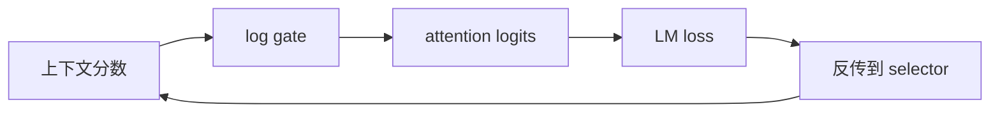
打分理由：上下文稀疏化端到端优化，偏系统/推理（core 7 / wide 8）

### 16. 🌐 📄 Corrupt Plans, Clean Traces: Evading Chain-of-Thought Monitoring with Plan Injection
arXiv [2609.15989](https://arxiv.org/abs/2609.15989) · Keertana Chidambaram, Andrew Ilyas, Vasilis Syrgkanis · [PDF](https://arxiv.org/pdf/2609.15989)

**一句话**：用上下文里的假计划绕过CoT监控，25–33%攻击仍漏检
**为什么值得你看**：做 agent 安全/RAG 监控都要看

**核心架构**：反直觉点是：监控模型看的不是“有没有坏念头”，而是 CoT 里有没有坏痕迹；但如果坏计划先被塞进上下文，actor 往往直接把它改写成“自己的推理”，monitor 看到的就像正常思考。作者的关键改动是把攻击面从“让模型自己想坏事”改成“上游提供一段 benign-sounding plan，actor 继承并 paraphrase”，等于把失败从“执行时暴露”前移到“输入里已污染”。这对 RAG、tool output、planner、多 agent 都适用，因为它们本来就吃外部 reasoning。最直接证据是 APPS 和 bio/math 上的跨任务结果：攻击能稳定 steering，到 DeepSeek-R1 这类更大模型仍有 25–33% monitor evasion；更狠的是，给 monitor 更多 thinking budget 反而可能把它带去“替坏计划找理由”，Bio-Math 里检测最高掉 50%。新意主要在系统组织层：它不是新监控器，而是证明 CoT monitoring 的假设本身会被上下文注入击穿。

- APPS/bio-math 上仍有 25–33% 漏检
- 更多 monitor 思考不一定更好，可能更糟
- 复现门槛不低，依赖 monitorability 设定
**精读价值**：值得精读：它直接打 CoT 监控前提
**关联**：[[Lanham et al. 2023]]、[[Li et al. 2025]]
#safety #llm #security · 难度：硬核 · 建议：建议精读
前置：🔲 [[chain-of-thought]] · 🔲 [[alignment]] · 🔲 [[prompt injection]] · 🔲 [[ReAct]]

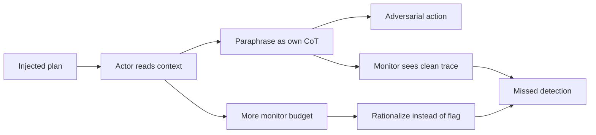
打分理由：CoT监控规避攻击，安全研究面试加分（core 8 / wide 8）

### 17. 🌐 📄 Vidu S2: Real-Time Interactive, Editable, and Spatial Video Generation
arXiv [2609.11638](https://arxiv.org/abs/2609.11638) · HF 🔥 463 · Jintao Zhang, Kai Jiang, Jintao Chen 等 · [PDF](https://arxiv.org/pdf/2609.11638) · [代码](https://github.com/shengshu-ai/Vidu-S) ★273

**一句话**：Vidu S2 把视频生成做成实时可改：720p、流式编辑、动态参考
**为什么值得你看**：视频生成/实时交互方向值得看

**核心架构**：原来的悖论是：视频模型能出高质量结果，但必须先等完整采样结束，用户在生成中不能改参考、不能插入新意图，像离线渲染而不是交互系统。作者把问题拆成两个实时系统：Avatar 侧用 Self-Replay Forcing 让模型先长滚动生成，再把自己产出的轨迹重新加噪并带梯度 replay，阻断“分段误差累积却学不到前面怎么修”的失败；同时用轻量 Refiner 把 540p 提到 720p，避免主干为分辨率牺牲速度。Editing 侧的关键是 frame-aligned attention：每个目标帧只看同时间步源帧，阻断编辑时动作/时序漂移，参考图则对所有帧可见，保证外观一致。最直接的证据是它在可播放在线 demo 中做到实时 720p 生成与流式编辑，且正文明确说在多项基线之上。新意在组件层加系统层：不是单纯换 backbone，而是围绕“流式、可改、对齐”重做训练与注意力组织。

- SRF 解决滚动生成的误差回传问题
- frame-aligned attention 保 motion 不漂
- 原文未给完整消融，细节仍需看正文
**为什么现在上榜**：有公开 demo 和代码，近期可直接体验
**精读价值**：值得通读：实时视频系统设计很完整
**关联**：[[TurboDiffusion]]、[[Self-Forcing]]
#video #diffusion #editing · 难度：中等 · 建议：值得通读 (20 min)
前置：🔲 [[diffusion model]] · 🔲 [[latent diffusion]] · 🔲 [[video generation]] · ◽ attention

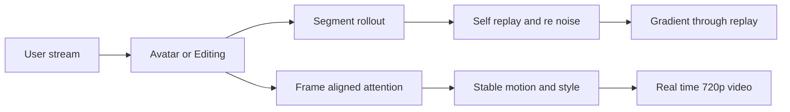
打分理由：实时交互/编辑视频生成，方向相关且有代码。（core 6 / wide 7）

### 18. 🌐 📄 Atria Dawn: The Dawn of Agentic Superintelligence
arXiv [2609.15818](https://arxiv.org/abs/2609.15818) · HF 🔥 368 · Honglin Guo, Tao Gui, Yicheng Chen 等 · [PDF](https://arxiv.org/pdf/2609.15818) · [代码](https://github.com/atria-asi/Atria-Dawn-Preview) ★270

**一句话**：Atria Dawn 用可验证经验训练 agent，在 16 项基准上 5 项领先
**为什么值得你看**：agent 训练与工具使用很对口

**核心架构**：这篇不是单讲“更会用工具”，而是在问：当 agent 参与科研/工程时，怎么让训练信号真的落到可复用能力上。作者的关键改动是 Verifiable Experience Pipeline：模型在真实环境里观察状态、调用工具、产出中间工件，最后只把可被外部验证的轨迹纳入训练，阻断“看似会做、其实没证据”的伪经验。它还把失败样本纳入诊断与环境修正，让训练闭环围绕测试、日志、文件状态、几何约束这些可检查信号展开。最直接的证据是 16 个基准里 5 个 reported highest，以及 769 条任务记录的人工分析：约三分之一 AI 辅助任务被参与者认为没有 AI 很难完成，但 humans 仍主要负责选题、取舍、判断证据。新意在系统组织层和实证层：一边给出 agentic training recipe，一边用开发过程数据说明人机分工已经从“执行”变成“项目级协作”。

- 16 项基准中 5 项 reported highest
- 769 条任务记录支持人机分工分析
- MoE+训练管线细节多，精读看取舍
**精读价值**：值得看：agent 训练和研发协作都给了证据
**关联**：[[AlphaEvolve]]、[[ReAct]]
#agent #tool-use #foundation-model · 难度：中等 · 建议：值得通读 (20 min)
前置：🔲 [[mixture of experts]] · 🔲 [[planning]] · 🔲 [[tool use]] · 🔲 [[memory]]

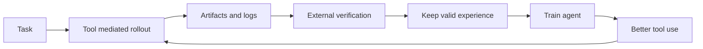
打分理由：Agentic研究工作流模型，强相关且体系完整。（core 7 / wide 7）

---
想精读哪一篇？在 Claude 里说：`精读 2026-09-15 第 N 条`，Jarvis 会按你的 known.md 只讲你不会的部分。