# Jarvis 日报 · 2026-09-16

候选 692 → 过滤后 285 → 入选 18。图例：⭐ 核心方向 · 🌐 全领域热点 · ✅ 已掌握前置 · 🔲 需补前置

## 📄 论文 · 核心方向

### 1. ⭐ 📄 Dream-RSI: Recursive Self-Improvement through Evolving Worlds
arXiv [2609.14858](https://arxiv.org/abs/2609.14858) · HF 🔥 277 · Tong Zheng, Xidong Wu, Zheng Zhang 等 · [PDF](https://arxiv.org/pdf/2609.14858) · [代码](https://github.com/zhengkid/Dream-RSI) ★132

**一句话**：Dream-RSI 用历史发现树做 replay simulator，8 任务上更省调用
**为什么值得你看**：适合看 agent/RSI 的循环组织与探索优化

**核心架构**：反直觉点是：探索策略的反馈不必每次都真跑一遍。作者先把 coding agent 的历史 discovery tree 变成 replay simulator，让“过去走过的分支”充当可读的世界模型；新策略只在这个 simulator 里 dreaming，就能用低成本 off-policy 反馈比较不同 branching、parallel、stopping 方案，避免在线 policy optimization 被长回合、延迟回报拖死。最关键的概念改变是把 exploration 显式交给一层轻量 orchestration：组件不是新 agent，而是“调度层 + 历史树 + dreaming 评估”，分别阻断策略不可编程、反馈昂贵、meta-search 空间太大这三类失败。最直接的证据是跨 algorithm engineering、mathematical optimization、GPU kernel engineering 的 8 个任务：作者报告在若干设置里达到相近或更好的 discovery quality，同时显著减少 discovery cost。新在系统组织层：它把 RSI 从在线试错改成“在线采样—离线梦境—再上线”的闭环。

- 最强证据是 8 任务的降本增效
- 没证明 simulator 外推到未见搜索分布
- 复现要能跑 discovery tree 与多轮评估
**精读价值**：值得精读，核心是把探索自改造成可编程闭环
**关联**：[[World Models]]、[[model-based reinforcement learning]]
#agent #rsi #exploration #framework · 难度：硬核 · 建议：建议精读
前置：🔲 [[planning]] · 🔲 [[memory]] · ◽ off-policy

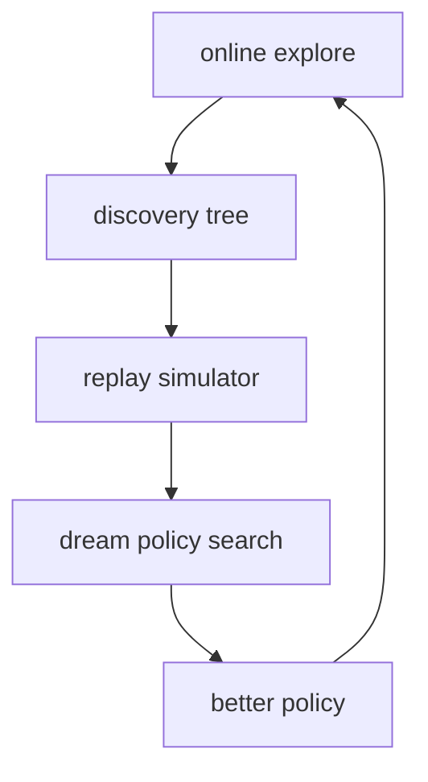
打分理由：高热度RSI探索框架，和agent研究强相关。（core 9 / wide 8）

### 2. ⭐ 📄 HazardAuditor: From Executable Threats to Safer Computer-Use Agents
arXiv [2609.15134](https://arxiv.org/abs/2609.15134) · HF 🔥 14 · Yunhao Feng, Ruixiao Lin, Ming Wen 等 · [PDF](https://arxiv.org/pdf/2609.15134) · [代码](https://github.com/Yunhao-Feng/HazardAuditor) ★19

**一句话**：HazardAuditor 把执行日志标准化后训练 guard，准确率最高提 16.5 点
**为什么值得你看**：做 computer-use agent 安全、评测和 guard 很对口

**核心架构**：反直觉点是：computer-use agent 的危险不只在文本里，而在执行过程中一步步累积；静态 prompt/response 级 guard 会漏掉“每步都正常、合起来越界”的行为。作者先建一个 executable safety infrastructure，把 Claude Code、Codex、Hermes、OpenClaw 的运行日志统一成 canonical event representation，这一步阻断的是“跨框架日志无法监督同一 guard”的失败；再用 GuardPO 把确定性安全结果变成 sequence-level advantage，并对 rationale / verdict 区域做归一化，阻断“长解释抢走梯度”的结构性偏差。最直接的证据是 balanced cross-agent execution diagnostic CUA-EXEC，上面准确率相对 strongest prior guard 最高提升 16.5 个百分点，且跨不同 agent framework 都能受益。新在组件层 + 训练层：前者解决监督来源，后者解决 generative guard 的优化目标错位。

- 最强证据是 CUA-EXEC 上 16.5 点提升
- 没证明对未知工具/新框架同样稳
- 复现门槛在于可控执行环境和日志规范化
**精读价值**：值得精读，既是安全数据管线也是 guard 训练法
**关联**：[[BraveGuard]]、[[ReAct]]
#agent #safety #computer-use #evaluation · 难度：硬核 · 建议：建议精读
前置：🔲 [[prompt injection]] · ◽ agent safety · 🔲 [[DPO]]

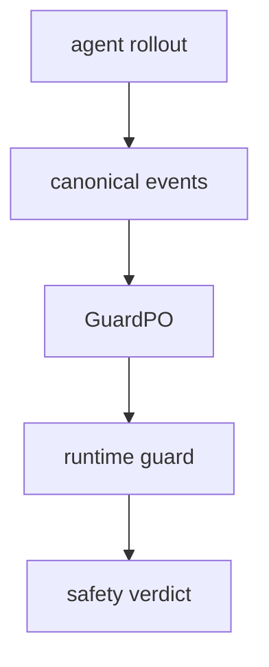
打分理由：执行期安全审计框架，和智能体安全强相关。（core 9 / wide 7）

### 3. ⭐ 📄 An Empirical Study of Counterfactual Self-Explanations in LLMs
arXiv [2609.17119](https://arxiv.org/abs/2609.17119) · Giannis Kalyvas, Giorgos Filandrianos, Orfeas Menis Mastromichalakis 等 · [PDF](https://arxiv.org/pdf/2609.17119)

**一句话**：研究 LLM 自我反事实解释：大模型更会翻转自身预测
**为什么值得你看**：适合看解释是否真反映模型决策

**核心架构**：反直觉点是：模型能写出像样解释，不代表这些解释真的碰到它做决定的证据。作者让同一模型先分类，再做 counterfactual self-explanations，即最小改写输入使自身预测翻转，用 faithfulness、minimality、human alignment 三个维度同时验。关键改变不是新模型，而是把“解释好不好”拆成可操作的行为指标，并用 ESMP 硬定义“是否改到了人类标注的证据”。最直接的证据是十个 LLaMA-3 / Qwen-2.5 指令模型的对比：模型规模越大，越容易产出能翻转自身预测的 counterfactual；rationale-guided 让编辑更小、也更贴近人工 rationale，但不稳定提升 faithfulness。新在实证层：它不是提出方法，而是把 self-explanation 的可靠性边界量化出来。

- 最强证据是 scale 与 faithfulness 的一致相关
- 没证明 rationale-guided 能稳定提升 faithful
- 复现主要在 prompt 和评测定义，不是训练
**精读价值**：值得看速览，重点是解释可靠性的边界
**关联**：[[ERASER]]、[[counterfactual explanations]]
#vla #intrinsic-reward #rl · 难度：中等 · 建议：值得通读 (20 min)
前置：🔲 [[chain-of-thought]] · 🔲 [[hallucination]] · 🔲 [[contrastive learning]]

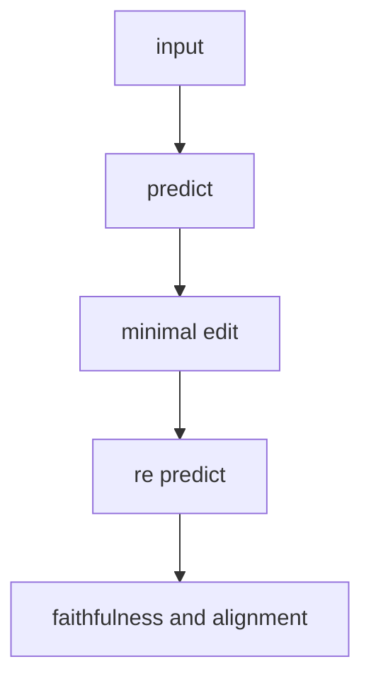
打分理由：VLA表示用于自评估+策略改进，强契合具身/后训练（core 9 / wide 6）

### 4. ⭐ 📄 Coupled Calibration and Learning: Mitigating Teacher Bias in LLM Distillation without Target-Domain Reward Feedback
arXiv [2609.17474](https://arxiv.org/abs/2609.17474) · Haichen Hu, Yuheng Zhang, David Simchi-Levi · [PDF](https://arxiv.org/pdf/2609.17474)

**一句话**：CCL 用源域 reward 校准 teacher，再蒸馏 target，作者证明 KL 收敛到 0
**为什么值得你看**：适合看 distillation 如何抗 teacher bias

**核心架构**：反直觉点是：teacher 在 source 上很强，直接照抄到 target 还是会把系统性偏差一起蒸进去，而且 target 又没有 reward feedback，常规 distillation 没法知道什么时候该信 teacher。CCL 的关键改动是把“校准 teacher”和“训练 student”绑成迭代回路：先用 source reward 修正 teacher 的偏差，再拿这个被校准的 teacher 去监督 target 上的 student；而 student 的新状态又反过来影响下一轮校准，阻断了固定 teacher 偏差被一次性复制的路径。最直接的证据是作者给出的 separation：regularized direct matching 甚至在 teacher 的 target reward 高于所有 student policy 时，和 oracle student 的 KL 仍可能卡在正值；而 CCL 的 expected average KL 对 oracle student 以 polynomial rate 收敛到 0。新意主要在系统组织层：不是换一个 distillation loss，而是重排了 teacher feedback 与 student update 的时序耦合。

- 最强证据是 direct matching 的严格分离
- 没证明在真实 LLM 上一定稳，主要是理论
- 实现要做 token-level branching，复现偏难
**精读价值**：适合精读，核心价值是给出无 target reward 的可证明纠偏路线
**关联**：[[Hinton et al. 2015]]、[[Direct Preference Optimization]]
#rlhf #distillation #alignment · 难度：硬核 · 建议：建议精读
前置：🔲 [[knowledge distillation]] · 🔲 [[reward model]] · 🔲 [[direct preference optimization]] · 🔲 [[group relative policy optimization]]

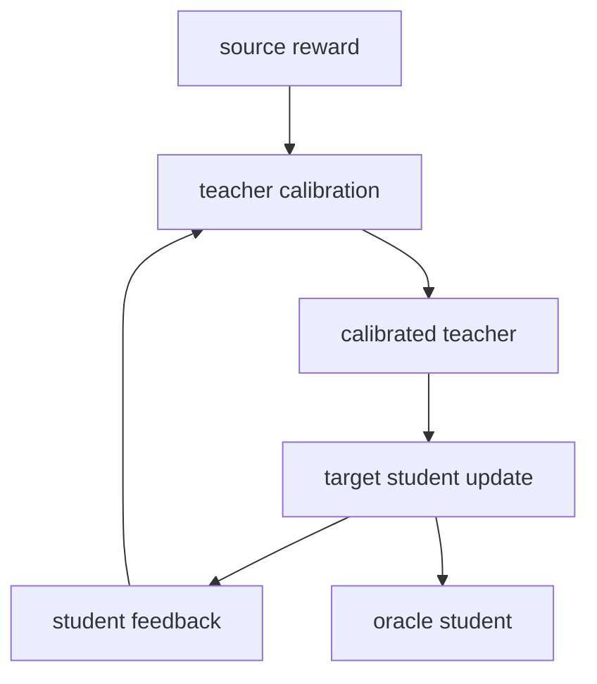
打分理由：蒸馏抗教师偏差、配合校准学习，和后训练强对口（core 9 / wide 7）

### 5. ⭐ 📄 Agentic Societies Need a Social Harness
arXiv [2609.17527](https://arxiv.org/abs/2609.17527) · Tapan Chugh, Vidushi Singh, Krish Jain 等 · [PDF](https://arxiv.org/pdf/2609.17527)

**一句话**：社会 harness 把 agent 间通信分层，阻断错消息和恶意操控
**为什么值得你看**：和你做 agent 系统、MCP、安全面试都直接相关

**核心架构**：反直觉点是：就算 agent 本身“诚实且能干”，只要它们跨信任边界自治协作，现有 messaging primitive 也会让合作频繁失败；一旦混入故障或恶意 agent，还会通过“speech”卡进度、操纵结果。作者的核心概念改变是把 agent 系统从“单个 agent 的 personal harness”扩展成“社会 harness”：前者管私有上下文和对主人通信，后者管 agent 之间的交互。它不是功能清单，而是按失败模式分层阻断：身份层防 spoofing，可靠有序通信层防乱序与丢消息，规范层防不符合当前任务状态的消息，治理层负责事后调查和惩罚。最直接的证据是他们在 meeting scheduling 里观察到，随着 agent 数和并发任务数增加，现有基础设施下即便 honest agents 也难达成满意结果；这说明问题不在模型单点能力，而在交互协议。新意在系统组织层。

- 最强证据是 meeting scheduling 的失败模式
- 没证明这套分层已可落地，偏研究框架
- 对通信协议和治理栈要求高
**为什么现在上榜**：原文未明确
**精读价值**：值得看，能补上 agent 系统里常被忽略的交互安全层
**关联**：[[A2A]]、[[AutoGen]]
#agent #multi-agent #safety · 难度：中等 · 建议：值得通读 (20 min)
前置：🔲 [[multi-agent]] · 🔲 [[planning]] · 🔲 [[memory]] · 🔲 [[prompt injection]]

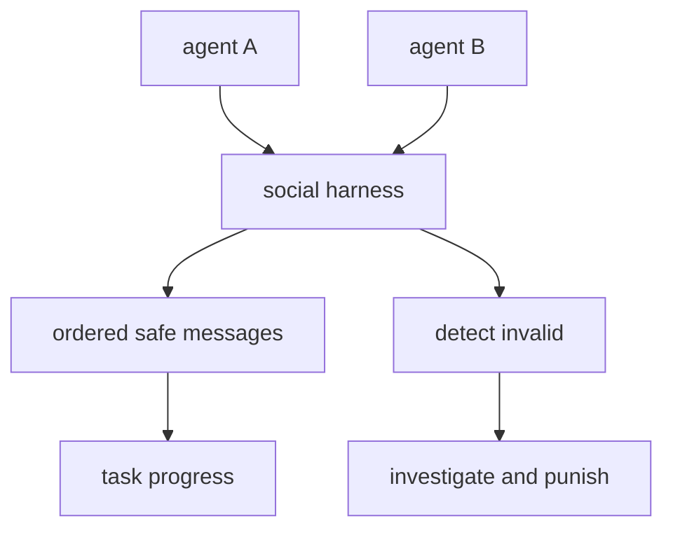
打分理由：agent society通信“社会约束”，高相关高质量（core 9 / wide 8）

### 6. ⭐ 📄 Beyond Token-Local Imitation: Reward-Compatible Temporal Credit Assignment for On-Policy Distillation
arXiv [2609.16937](https://arxiv.org/abs/2609.16937) · Shiqi Liu, Zeyu He, Letian Tao 等 · [PDF](https://arxiv.org/pdf/2609.16937)

**一句话**：γOPD 用折扣 temporal credit 改写 OPD，并加 RBM 融合 reward
**为什么值得你看**：你做后训练和 reasoning 蒸馏时会碰到

**核心架构**：反直觉点是：token-level OPD 虽然稳定，但它只看当前 token，等于把后面几步推理的代价和收益都截断了；sequence-level OPD 虽然能看见未来 credit，却会随着长度变长方差暴涨。作者的关键改动是把这两种目标放进统一 temporal-credit 视角：token-level 不是“另一种方法”，而是 sequence-level reverse-KL 梯度的时间近似；然后用 discounted credit 让监督既保留未来影响，又把方差压到 horizon-independent。为避免完全依赖 teacher，他们再加 RBM，把 verifiable reward 和 discounted teacher advantage 做有界混合，阻断 teacher 信号压过任务级反馈。最直接的证据是数学和 code reasoning 上，在 vanilla、size-mismatched、multi-teacher 三种设置都稳定优于现有 OPD。新意主要在组件层：把 OPD 的 credit assignment 重新定义了。

- 最强证据是多设置下的稳定提升
- 没证明最优折扣如何选，调参敏感性原文未充分展开
- 需要能稳定做 on-policy rollouts
**精读价值**：值得通读，适合补 OPD 与 RLVR 的连接
**关联**：[[On-Policy Distillation]]、[[RLVR]]
#rlhf #distillation #on-policy · 难度：硬核 · 建议：建议精读
前置：🔲 [[on-policy distillation]] · ◽ reverse KL · 🔲 [[reward model]] · ◽ verifiable rewards

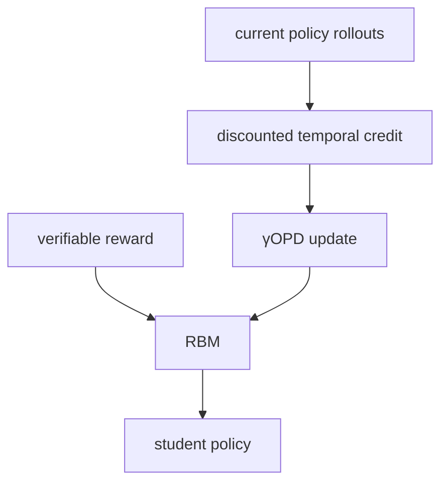
打分理由：OPD 时序信贷分配，强后训练方法相关。（core 9 / wide 6）

### 7. ⭐ 📄 PaperDoctor: Evidence-Grounded and Actionable Feedback for Scientific Papers in Progress
arXiv [2609.16995](https://arxiv.org/abs/2609.16995) · Kevin Qinghong Lin, Siyuan Hu, Pan Lu 等 · [PDF](https://arxiv.org/pdf/2609.16995) · [代码](https://github.com/QinghongLin/paperdoctor)

**一句话**：PaperDoctor 用三层诊断框架查论文问题，30 篇稿子达 70.6% 一致
**为什么值得你看**：适合看 agent 评测与论文自动审稿

**核心架构**：反直觉点在于：自动审稿如果只给 accept/reject，作者其实拿不到“哪里错、为什么错、怎么改”，这更像门卫，不像导师。现有 reviewer/agent 卡在这里，因为它们把所有问题都压成同一层判断，无法按证据成本分流。PaperDoctor 的关键变化是把论文当成可分层诊断对象：L1 先做稿面筛查，挡住格式、引用、排版这类低成本硬错；L2 把原子 claim 路由给对应 verifier，分别用 web search、VLM、code analysis、theory verifier 去堵“证据不对口”的失败；L3 再按重要性和算力选择性复跑实验，堵“论文写得对但跑不出来”的失败。最直接的证据是 30 篇 in-progress papers 的 human study：作者报告 70.6% agreement，且 holistic score 全正，说明它不是只会挑刺，而是能稳定给出作者认可的诊断。新意主要在系统组织层：不是发明单一 verifier，而是把“诊断—证据—修订建议”做成可审计闭环。

- 最强证据是 30 篇人工一致性 70.6%
- 没证明能替代人工审稿，偏预提交诊断
- 复现难点在多 verifier 和代码重跑
**精读价值**：适合精读：它在讲 agent 审稿该怎么分层
**关联**：[[SWE-bench]]、[[ReAct]]
#agent #paper-review #evaluation · 难度：中等 · 建议：建议精读
前置：◽ agent · 🔲 [[prompt injection]] · 🔲 [[VLM]] · 🔲 [[retrieval-augmented generation]]

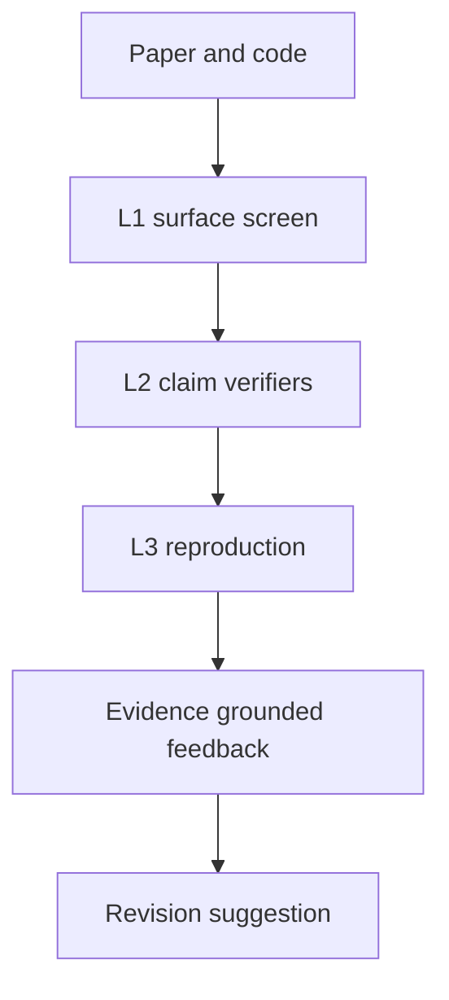
打分理由：PaperDoctor：证据路由的预审agent框架很对口（core 9 / wide 6）

### 8. ⭐ 📄 Grouped Value Attention: Efficient KV Caching via On-Demand Key Reconstruction
arXiv [2609.13285](https://arxiv.org/abs/2609.13285) · HF 🔥 64 · Vishesh Tripathi, Abhay Kumar, Ramsha Khan · [PDF](https://arxiv.org/pdf/2609.13285)

**一句话**：GVA 用重建 key 的方式压缩 KV cache，较 GQA 少约 45-47% cache
**为什么值得你看**：适合看长上下文推理和 KV cache 设计

**核心架构**：反直觉点在于：decode 阶段真正需要的不是“完整 key 和 value 都永久缓存”，而是能做打分的内容表示加上能保留位置信息的少量通道。GQA 已经共享了 KV 头，但还是两条流一起存，cache 读写仍重。GVA 的关键改法是把 persistent state 改成 grouped values，只把用于打分的 content key 用 learned linear map 从 value 里重建；推理时这个线性映射还能吸收到 query 里，于是 intended decode path 不必 materialize content keys。为了不让 RoPE 破坏这种吸收，作者再加一个 shared decoupled RoPE channel，单独缓存短 positional key，阻断“位置编码迫使回到完整 key cache”的失败。最直接的证据是 350M、30B FineWeb-Edu 设定下，16 维 positional variant 的平均准确率 44.35，几乎贴住 GQA 的 44.36，同时 persistent cache scalar 下降约 45-47%。新意在组件层：不是新 attention 公式，而是改了缓存状态的分解方式与 decode 路径。

- 最强证据是近 GQA 准确率下少约 45-47% cache
- 没证明端到端吞吐提升，原文说还在评测
- 复现难点在自定义 decoding kernels
**精读价值**：值得精读，核心是 cache 状态重构而非刷分
**关联**：[[Grouped-Query Attention]]、[[Multi-head Latent Attention]]
#inference #attention #kv-cache #efficiency · 难度：硬核 · 建议：建议精读
前置：🔲 [[KV cache]] · ◽ grouped-query attention · 🔲 [[RoPE]] · 🔲 [[linear attention]]

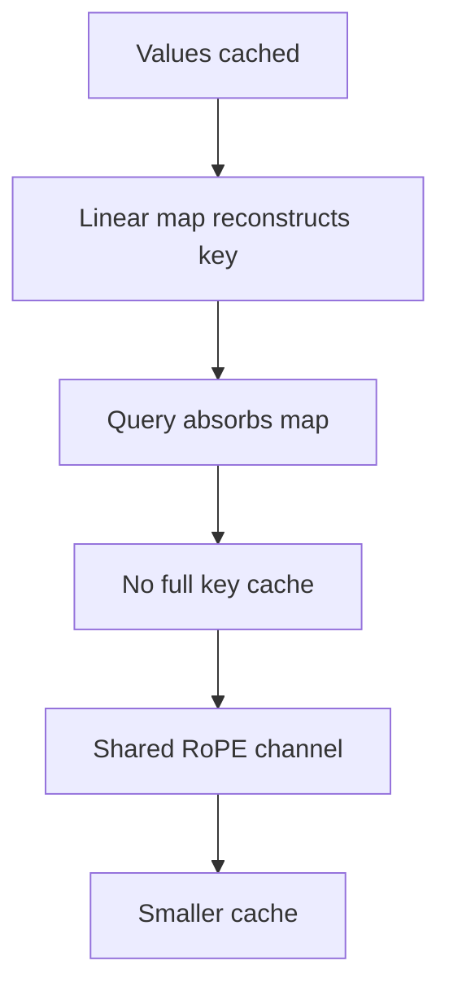
打分理由：KV缓存效率新做法，推理加速直接相关。（core 8 / wide 5）

## 🧰 项目 · 核心方向

### 9. ⭐ 🧰 anthropics/claude-code
[GitHub](https://github.com/anthropics/claude-code) ★145,392 (+155 今日) · Trending daily · tool · TypeScript

**一句话**：Claude Code 把终端变成 agentic coding 工具，支持自然语言改代码和管 Git
**为什么值得你看**：面试里常被问 terminal agent 与 MCP

**核心架构**：这个项目解决的是“代码库大、操作碎、上下文切换多”时，开发者不想在 IDE、shell、git、文档之间来回跳。它的承重形态是一个跑在 terminal 里的 agent，README 明确它能理解 codebase、执行 routine tasks、解释复杂代码、处理 git workflows；近期 release 还补了 MCP 断连自动重连、remote-control session fork、权限检查修复和 gateway hint headers，说明它不是静态 demo，而是在补运行时边界条件。成熟度信号比较强：stars 145k+，有连续日更 release，README 给出安装、插件、bug 报告和文档入口，且出现了权限与会话管理这类生产问题修复。和同类相比，它的差异不在“能不能聊天写代码”，而在终端原生、MCP 接入、会话控制和权限/安全处理这套运行时组织。

- 最强证据是持续 release 和权限/会话修复
- 没法仅凭 README 判断实际代码质量
- 同类差异在 terminal 原生和 MCP 运行时
**为什么现在上榜**：最近 release：v2.1.273、v2.1.272、v2.1.271，且持续日更
**精读价值**：可快速扫一遍，重点看运行时和 MCP 设计
**关联**：[[ReAct]]、[[SWE-bench]]
#agent #coding #tooluse · 难度：入门 · 建议：值得通读 (20 min)
前置：◽ agent · 🔲 [[model context protocol]] · 🔲 [[planning]] · 🔲 [[memory]]

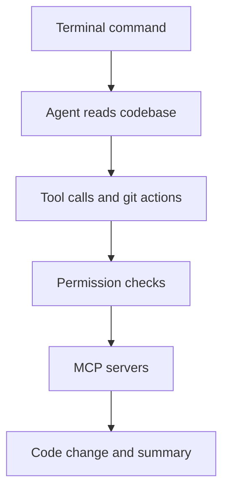
打分理由：旗舰级agent编码工具，近期热度与实用性强（core 8 / wide 10）

### 10. ⭐ 🧰 cline/cline
[GitHub](https://github.com/cline/cline) ★68,259 (+102 今日) · Trending daily · tool · TypeScript

**一句话**：用共享 agent 内核做 IDE/CLI/桌面编码助手，支撑 6.8 万星
**为什么值得你看**：Agent 工程化样板，面试能聊工具调用和人类在环

**核心架构**：它面对的悖论是：编码 agent 想自治，就会把错误改进、命令执行和长任务都吞进一次运行里，结果最容易失控；而只做单轮补全又没法跨文件修复。Cline 的关键变化不是“加更多功能”，而是把 agent 做成共享核心 + 多端壳：同一套引擎在 SDK、CLI、VS Code、JetBrains、Desktop 间复用，外层只负责交互和权限，把“编辑、跑命令、浏览器/插件/MCP、multi-agent”这些动作都放进带审批的循环里。它的阻断点很明确：每次文件编辑和终端命令都要 human approval，Plan/Act 先对齐再执行；长任务继续监听输出，遇到编译/测试失败可在运行中接着修。最直接的证据是 README 里对 diff、checkpoint、实时命令监控和多模型兼容的描述，加上本周 desktop 和 sdk 连续 release，说明它在持续打磨交互与底层复用。新意主要在系统组织层，不是新算法。

- 最强证据是共享内核跨多端复用
- 不证明 agent 自主修复的上限
- 复现难点在工具链与交互闭环
**为什么现在上榜**：本周有 desktop-v0.0.29 和 sdk/v0.0.83 连续 release，原文未明确更大事件。
**精读价值**：值得看架构，适合理解 agent 产品化
**关联**：[[ReAct]]、[[model context protocol]]
#agent #coding #ide · 难度：中等 · 建议：值得通读 (20 min)
前置：🔲 [[planning]] · 🔲 [[memory]] · 🔲 [[MCP]] · 🔲 [[multi-agent]]

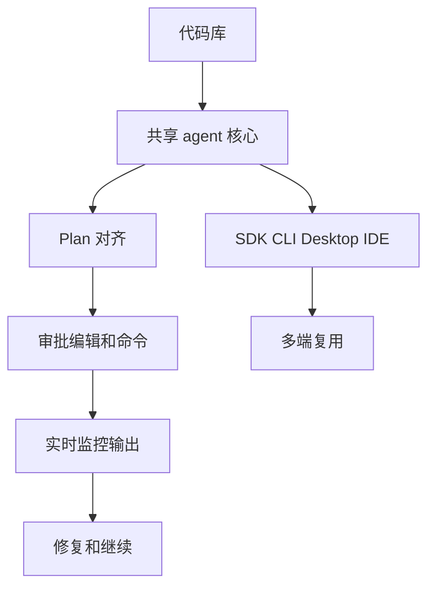
打分理由：IDE/CLI自治编码agent，开源活跃度高（core 8 / wide 9）

### 11. ⭐ 🧰 MemTensor/MemOS
[GitHub](https://github.com/MemTensor/MemOS) ★11,391 (+39 今日) · Trending daily · infra · TypeScript

**一句话**：用混合检索做 LLM 持久记忆，宣称省 35.24% token
**为什么值得你看**：RAG / memory 方向很相关，能看 agent 记忆怎么落地

**核心架构**：它解决的是 agent 每次都像失忆：历史偏好、工具轨迹、跨任务技能都在上下文里反复重放，token 越用越贵。MemOS 的关键概念不是“再做一个向量库”，而是把 memory 变成可管理的 OS：统一 add/retrieve/edit/delete，底层把结构化图、FTS5 和 vector 结合成 hybrid-retrieval，再用异步 MemScheduler 把写入和检索解耦，避免高并发下内存操作拖慢主任务。它还把记忆分成 KB、tool memory、persona 和 multi-cube，这样不同用户/项目/agent 的记忆可以隔离或共享，不必把所有东西塞进一个黑箱 embedding store。最直接的证据是作者报告的 35.24% token savings，以及 OpenClaw 上任务完成率从 36.63% 到 50.87% 的提升；但这些结果依赖具体插件和任务形态，原文未明确对通用编码 agent 的外推。新意在系统组织层和实证层，核心是“可编辑记忆”而不是单纯检索。

- 作者报告 35.24% token savings
- OpenClaw 任务完成率 36.63%→50.87%
- 没证明通用任务都受益，依赖记忆写入质量
**为什么现在上榜**：最近 release 有 v2.0.33 和 local plugin 版本更新，且站内强调 DeepSeek Harness 接入，原文未明确更大事件。
**精读价值**：值得看 memory OS 怎么比 RAG 更工程化
**关联**：[[retrieval-augmented generation]]、[[graph RAG]]
#agent #memory #rag · 难度：中等 · 建议：值得通读 (20 min)
前置：🔲 [[retrieval-augmented generation]] · 🔲 [[embedding]] · 🔲 [[reranker]] · 🔲 [[memory]]

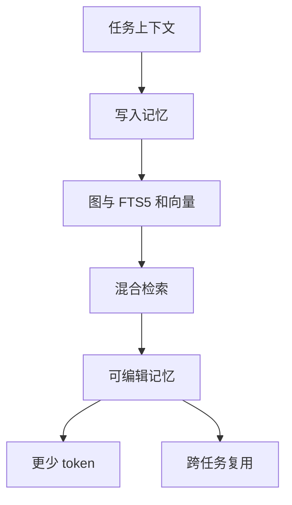
打分理由：持久记忆+混合检索，面向agent可用（core 8 / wide 7）

### 12. ⭐ 🧰 cloudflare/security-audit-skill
[GitHub](https://github.com/cloudflare/security-audit-skill) ★6,635 (+1249 今日) · Trending daily · skill · JavaScript

**一句话**：把 coding agent 变成六阶段安全审计器，产出可验证 findings
**为什么值得你看**：Agent 安全与工具编排很适合面试，能看审计闭环设计

**核心架构**：它面对的反直觉问题是：安全审计最怕“看起来像漏洞”的幻觉，单个 agent 一边找一边下结论，覆盖会漏、验证会偏。这个 skill 的关键改变是把审计拆成带独立验证的循环：先做 reconnaissance 和 coverage-led ledger，明确架构、信任边界和覆盖单位；再让隔离的 hunters 按 ledger 追缉，coverage critics 专门找盲区；每个 candidate 交给新的 verifier 试图证伪，最后只把 source trace 完整的结果写进 confirmed / needs_validation / rejected。最强证据不是分数，而是它把“发现、反驳、记录、报告”强制解耦，并且对 ledger 和 findings 做多次 validator 检查；Cloudflare 还说明这套 skill 是后续 fleet-wide harness 的起点。新在系统组织层：把审计从单 agent 任务变成可复核的多阶段协议。

- 最强证据是独立 verifier + 结构化 findings
- 不证明一定找到真实漏洞，需 sandbox
- 复现门槛高：要多 agent 和隔离执行
**为什么现在上榜**：原文未明确；最近 stars 增长很快，且文档显示它是 Cloudflare 漏洞发现 harness 的起点。
**精读价值**：值得精读，能学 agent 安全工作流
**关联**：[[ReAct]]、[[SWE-bench]]
#agent #security #tooluse · 难度：硬核 · 建议：建议精读
前置：🔲 [[multi-agent]] · 🔲 [[prompt injection]] · 🔲 [[planning]] · 🔲 [[model context protocol]]

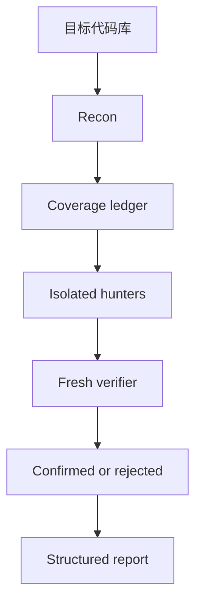
打分理由：多阶段安全审计agent，结构化可复现发现输出（core 7 / wide 8）

### 13. ⭐ 🧰 vercel/eve
[GitHub](https://github.com/vercel/eve) ★5,202 (+40 今日) · Trending daily · infra · TypeScript

**一句话**：The Open Framework for Building Agents
**为什么值得你看**：（dry-run：未调用 LLM，配置 OPENAI_API_KEY 后会生成中文速览）
#agent #framework #orchestration · 难度：中等 · 建议：看速览即可
打分理由：通用agent框架，工程上可落地（core 7 / wide 6）

### 14. ⭐ 🧰 pascalorg/editor
[GitHub](https://github.com/pascalorg/editor) ★23,981 (+1374 本周) · Trending weekly · tool · TypeScript

**一句话**：Open-source 3D architectural editor with a local CLI, MCP tools, and practical workflows for humans and AI agents.
**为什么值得你看**：（dry-run：未调用 LLM，配置 OPENAI_API_KEY 后会生成中文速览）
#3d #mcp #agent · 难度：中等 · 建议：看速览即可
打分理由：3D编辑+MCP工具化，面向AI工作流。（core 6 / wide 7）

## 🌐 全领域热点

### 15. 🌐 🧰 jamiepine/voicebox
[GitHub](https://github.com/jamiepine/voicebox) ★54,256 (+409 今日) · Trending daily · tool · TypeScript

**一句话**：The open-source AI voice studio
**为什么值得你看**：（dry-run：未调用 LLM，配置 OPENAI_API_KEY 后会生成中文速览）
- Clone, dictate, create.
#voice #tts #multimodal · 难度：中等 · 建议：看速览即可
打分理由：AI语音开源工作室，热度高但偏应用（core 3 / wide 9）

### 16. 🌐 🧰 kunchenguid/firstmate
[GitHub](https://github.com/kunchenguid/firstmate) ★6,171 (+1056 本周) · Trending weekly · tool · Shell

**一句话**：用 agent distro 管多 agent 协作，作者称可并行出 PR/报告
**为什么值得你看**：agent 编排与 worktree 隔离，适合面试谈系统设计

**核心架构**：它解决的是“一个 coding agent 能做事，但一旦三件任务并行就开始互相污染上下文、你还得手动盯终端”的悖论。firstmate 的关键变化不是再做一个 agent，而是把它做成 agent distro：把 instructions、skills、tooling、policies、state conventions 统一成可移植目录，让首席 agent 只负责调度和升级决策，crewmates 在各自独立 git worktree / tmux backend 里执行。这样阻断的是上下文串线、分支冲突、以及人类在多会话间来回拷贝信息的失败。最直接的证据是它支持 ship tasks 产出可授权改动、scout tasks 产出独立报告，并且有 event-driven、zero-token supervision 和 restart-proof 状态回收，说明它把“持续监督”从人工轮询改成了后台事件。新东西主要在系统组织层：不是单 agent 能力增强，而是把多 agent 运行时、状态、边界和恢复机制打包成一套分发系统。

- 强证据：独立 worktree + 事件驱动监督
- 没证明模型更强，只证明协作更稳
- 复现要接入支持的 harness 和本地后端
**精读价值**：值得看系统组织层设计，不是单纯工具合集
**关联**：[[ReAct]]、[[MCP]]
#agent #multi-agent #tool-use · 难度：中等 · 建议：值得通读 (20 min)
前置：🔲 [[planning]] · 🔲 [[multi-agent]] · ◽ worktree · ◽ Git

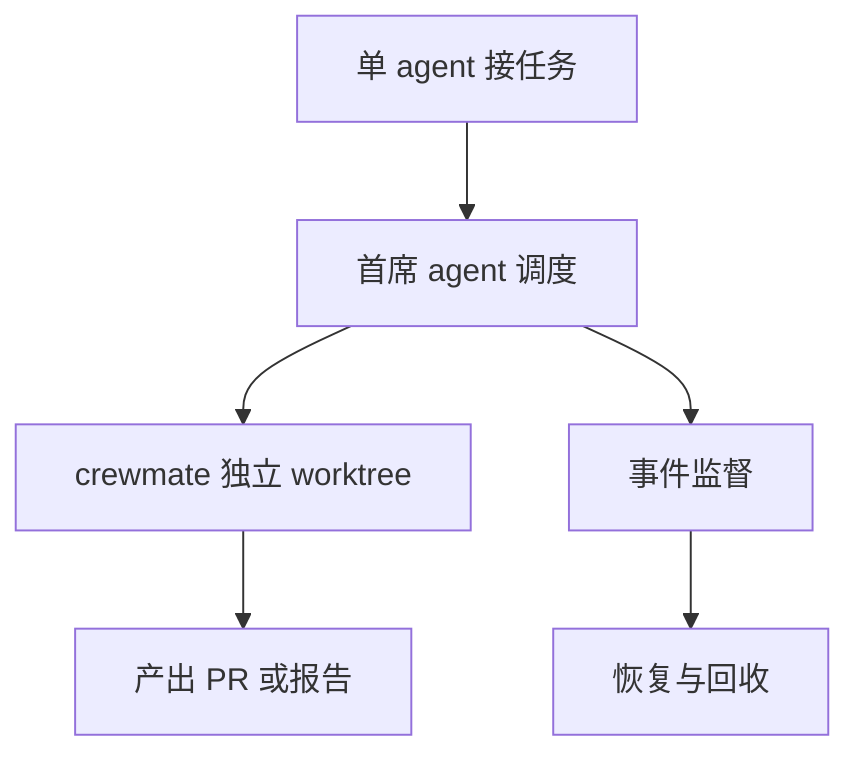
打分理由：多智能体/代理编排强，热度高且可上手。（core 6 / wide 8）

### 17. 🌐 🧰 microsoft/ai-agents-for-beginners
[GitHub](https://github.com/microsoft/ai-agents-for-beginners) ★74,886 (+618 本周) · Trending weekly · tutorial · Jupyter Notebook

**一句话**：用 18 课讲 AI agents，作者提供多语言教程和代码样例
**为什么值得你看**：适合补 agent 基础和面试话术，门槛低

**核心架构**：它解决的是“想入门 AI agents，但不知道从 planning、memory、tool use、评测到安全该按什么顺序学”的痛点。这个仓库本质上是课程，不是框架：用 lesson 切片把 agent 的基础概念、代码样例和额外资源串起来，并且明确基于 Microsoft Agent Framework 和 Microsoft Foundry Agent Service V2 跑示例。关键设计取舍是降低入门门槛而不是追求系统承重，因此它把复杂性放在讲解结构里，而不是运行时机制里。最直接的成熟度信号是有 18 课、源码样例、多语言自动翻译和活跃 issue/PR 入口，但正文里原文未明确持续 release 机制或严格测试覆盖。相较同类教程，它的差异在于企业栈对齐更强，适合把 agent 基础和 Microsoft 生态一起学。

- 强证据：18 课 + 代码样例 + 多语言
- 没证明通用性，主要是教学组织
- 更偏入门，不是可直接上生产的架构
**为什么现在上榜**：原文未明确
**精读价值**：看作系统化入门课，速览后按需补课
**关联**：[[ReAct]]、[[LangChain]]
#agent #beginner #framework · 难度：入门 · 建议：看速览即可
前置：🔲 [[planning]] · 🔲 [[memory]] · 🔲 [[ReAct]] · 🔲 [[tool use]]

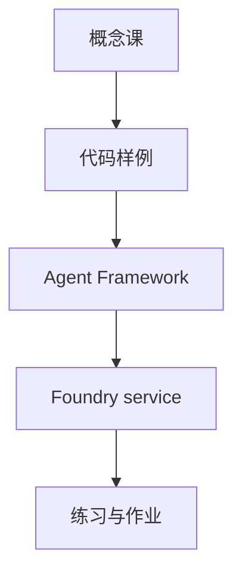
打分理由：代理入门教程，和方向相关但偏基础。（core 5 / wide 7）

### 18. 🌐 🧰 yyjeqhc/webcodex
[GitHub](https://github.com/yyjeqhc/webcodex) ★955 (+431 本周) · Trending weekly · infra · Rust

**一句话**：让云端 agent 直接用本地开发环境，v0.4.1 主打可靠性
**为什么值得你看**：agent 开发环境和执行边界是面试高频点，且有 release 线索

**核心架构**：它解决的是“云端 coding agent 能聊天，但一碰真实仓库、长任务、Git 和本地工具链就不得不搬家或丢上下文”的矛盾。WebCodex 的关键变化是把 AI client、MCP/HTTPS 接口和你机器上的 repository、Git、compilers/tests 连起来，让 agent 在本机真实开发环境里工作；Server/Runner 的分层则把长任务、可见执行和人类可审查操作拆开，避免单轮对话必须全程在线。正文里最直接的支持是：temporary `share` 只适合短试用，而 full Server + Runner 才是推荐的日常形态，说明作者明确区分了试用与承重架构；v0.4.1 的 release 进一步把 Desktop 日常可用性、Windows/network-path、job/file 边界和安全写操作收紧。新东西主要在系统组织层和实证层：不只是“能连上本地仓库”，而是把生命周期、权限边界、后台可恢复执行做成可发布产品。

- 最强证据：v0.4.1 强调边界和可靠性
- 短试用 share 不等于长期 Server
- 复现依赖本机工具链和受控权限边界
**为什么现在上榜**：最近 release：v0.4.1（2026-09-10）; v0.4.0（2026-09-07）; v0.3.9（2026-08-26）
**精读价值**：值不值得装看你是否需要本地真环境 agent
**关联**：[[MCP]]、[[OpenAI Secure MCP Tunnel]]
#agent #dev-env #inference · 难度：中等 · 建议：值得通读 (20 min)
前置：🔲 [[MCP]] · 🔲 [[tool use]] · 🔲 [[planning]] · ◽ Git

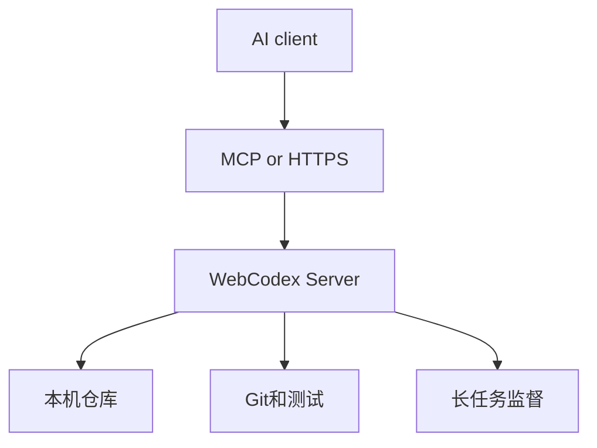
打分理由：为云端代理提供本地开发环境，实用度高。（core 6 / wide 7）

---
想精读哪一篇？在 Claude 里说：`精读 2026-09-16 第 N 条`，Jarvis 会按你的 known.md 只讲你不会的部分。