# Jarvis 日报 · 2026-09-17

候选 689 → 过滤后 287 → 入选 18。图例：⭐ 核心方向 · 🌐 全领域热点 · ✅ 已掌握前置 · 🔲 需补前置

## 📄 论文 · 核心方向

### 1. ⭐ 📄 In-Context Robot Learning with VLM Agents
arXiv [2609.19138](https://arxiv.org/abs/2609.19138) · HF 🔥 14 · Dongzhou Cheng, Taoran Yi, Ye Fang 等 · [PDF](https://arxiv.org/pdf/2609.19138) · [代码](https://github.com/cheng-haha/GPT-Policy) ★178

**一句话**：GPT-Policy 用 VLM+受限控制器做零微调机器人 ICL，真人视频也能提升完成率
**为什么值得你看**：你做 LLM/Agent 和具身都能对上，面试好讲闭环控制

**核心架构**：这篇先打一个反直觉点：机器人在新环境里常常卡在“看懂了但做不稳”——现有 imitation policy 依赖固定训练分布，遇到新物体摆放、接触误差或人类示范缺动作标签时，往往既不会从上下文学，也不会把反馈转成下一步动作。作者的关键改法不是再训一个 robot policy，而是把 general-purpose VLM 接进机器人工具链：context compiler 负责保留任务相关的视觉转移和动作参考，阻断“上下文太杂导致关键信息被淹没”；VLM 负责提议参数化 tool actions，阻断“只会看不会计划”；constrained controller 负责验证、执行并回传结果，阻断“模型输出不可落地、不可回滚”。最直接的证据是实机实验：human video 即使没有 robot action labels 也能提升 task completion，aligned action references 在 contact-sensitive 任务上进一步增益，说明真正起作用的是上下文里的可迁移行为线索，而不是单纯多看几段视频。新意主要在系统组织层：它把 robotic ICL 做成通用 VLM 的闭环接口，而不是专用 policy 的训练配方。

- 最强证据：实机里 human video 也能涨成功率
- 没证明安全与精细接触已解决
- 复现难点在机器人工具与受控执行
**精读价值**：值得看闭环设计，不是只看机器人分数。
**关联**：[[ReAct]]、[[Show-Harness]]
#vlm #agent #robotics · 难度：中等 · 建议：值得通读 (20 min)
前置：🔲 [[VLM]] · 🔲 [[ReAct]] · 🔲 [[planning]] · 🔲 [[memory]]

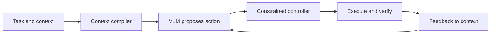
打分理由：VLM in-context 机器人策略，agent可落地（core 10 / wide 7）

### 2. ⭐ 📄 ScienceIDE: Turning World's Scientific Codebase into Agent Learnable Environments
arXiv [2609.19134](https://arxiv.org/abs/2609.19134) · HF 🔥 69 · Hejia Geng, Zesen Huang, Haoyang Li 等 · [PDF](https://arxiv.org/pdf/2609.19134) · [代码](https://github.com/aitofound/ScienceIDE) ★16

**一句话**：ScienceIDE 把科学代码库编成可学环境，训出 72B/9B/4B 修复模型
**为什么值得你看**：很适合看 agent 评测和环境化训练，面试能讲基础设施

**核心架构**：这篇的悖论是：科学代码仓库明明最像“可交互经验”，却最难直接变成 agent 能学的环境，因为工具链碎、正确性标准隐含、数值误差要按领域容忍度判断。现有 benchmark 只能测能力，不能把仓库变成可反复采样的训练场。作者的关键改变是把“科学经验”编译成 environment：scientific module 定义一个有责任边界和可执行覆盖的单元，environment 把代码、runtime、scientific checks 打包，factory 再按这个边界生成 repair/implementation/acceleration 等任务，阻断“同一个仓库每次只能手工造题”。真正支撑这个设计的证据是：他们用 verified interaction trajectories 训练出 PhAI-IDE-72B/9B/4B，并报告在 held-out scientific-code repair 以及部分通用 code/reasoning/knowledge benchmark 上都有收益，说明环境化经验确实能转成可迁移能力。新意在系统组织层和实证层：不是发一个榜，而是给科学代码一个可复用的 agent learning substrate。

- 最强证据：verified trajectories 训出三档模型
- 没证明跨所有科学域都稳定泛化
- 复现门槛高，依赖领域专家与环境化流程
**精读价值**：值得精读，核心是环境化训练范式。
**关联**：[[SWE-bench]]、[[ReAct]]
#agent #environment #benchmark · 难度：硬核 · 建议：建议精读
前置：◽ agent · ◽ reinforcement learning · ◽ evaluation · 🔲 [[SWE-bench]]

打分理由：把科学代码转为可验证agent环境，强相关（core 9 / wide 6）

### 3. ⭐ 📄 Infinite-Parameter LLMs: Generating and Adapting Weights from Live Data
arXiv [2609.18842](https://arxiv.org/abs/2609.18842) · Jinli Hu, Ross M. Clarke, Yichuan Zhang 等 · [PDF](https://arxiv.org/pdf/2609.18842)

**一句话**：Infinite-Parameter LLM 用 live data 生成低秩权重，试图让模型在推理时学习
**为什么值得你看**：对你做推理、长上下文、MoE 和在线适应都很对口

**核心架构**：这篇先指出一个常见悖论：部署后最有价值的数据不是预训练语料，而是当前交互里的事实、纠错和行为偏好，但传统 LLM 只能把这些塞进 prompt，用完就丢。MoE 虽然是动态计算，但它的 expert bank 仍是静态存储，不能从当下交互真正学进去。作者的关键改法是用 hypernetwork 把 live data 编译成共享底座的 low-rank modulation，并且不在读完上下文后就冻结，而是对 generator latent code 维持 Bayesian belief 并在线更新，阻断“只读一次、turn 内不再适应”的问题。这个设计把“写入权重”当成比“写进上下文”更可持续的记忆。摘要里他们主张这样可 amortize compute、释放 context window、跨 turn 持久，但正文当前截取处还没给出完整实证细节，因此最直接可确认的是架构思路而不是性能结论。新意在组件层：把 test-time adaptation 从 prompt/retrieval 推到可更新权重。

- 最强点：把推理时数据写进权重而非 prompt
- 原文未明确完整实证数字
- 实现难点在在线贝叶斯更新与稳定性
**精读价值**：概念很新，但先看架构，等实证再定精读。
**关联**：[[Mixture of Experts]]、[[LoRA]]
#llm #learning #moe #online · 难度：硬核 · 建议：值得通读 (20 min)
前置：🔲 [[MoE]] · ◽ hypernetwork · ◽ low-rank adaptation · ◽ Bayesian belief

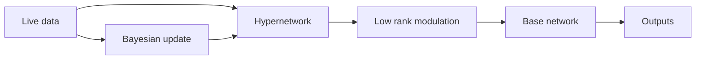
打分理由：从在线数据生成/适配权重，方向高度匹配（core 9 / wide 7）

### 4. ⭐ 📄 First Token Matters: Understanding Safety Collapse in Large Reasoning Models
arXiv [2609.18471](https://arxiv.org/abs/2609.18471) · Yizheng Yang, Haining Yu, Yuechen Wang 等 · [PDF](https://arxiv.org/pdf/2609.18471)

**一句话**：用首 token 安全锚点定位 ORC，单 token 注入缓解安全崩塌
**为什么值得你看**：懂 LRM 安全失效机理，面试可讲机制

**核心架构**：反直觉点在于：模型在 prompt 阶段还“知道”危险，却一到第一个生成 token 就突然转向不拒答，说明问题不是全程失忆，而是理解到生成的过渡点失稳。现有做法多靠再训练或 preference optimization，只能改参数分布，难抓住这个瞬时断点。作者的关键改变是把拒绝表征当成可在 token 级追踪的共享方向：先从 instruction-tuned 同背骨模型里抽出 refusal vectors，再看 LRM 隐状态在各位置上的投影，发现 harmful query 下 refusal strength 在首个生成 token 突降，这就是 ORC。SafeToken 进一步只在 onset 注入 learned continuous safety anchor，相当于把首 token 的拒绝信号扶住，阻断“明知危险但生成时滑出拒答区”的失败。最直接证据是 refusal vector steering 在 LRM 上呈双向可控，且 harmful benchmark 上 ORC 被压低、reasoning utility 基本保留。新意主要在组件层加上少量推断时干预，而不是系统组织层重训。

- 首 token 的 refusal gap 变化最直接
- 只改一个 token embedding，说明脆弱点很局部
- 原文未明确对更强 jailbreak 的鲁棒性
**精读价值**：值得精读，因它把安全崩塌定位到可干预的生成起点
**关联**：[[activation steering]]、[[mechanistic interpretability]]
#safety #reasoning #alignment · 难度：硬核 · 建议：建议精读
前置：🔲 [[chain-of-thought]] · ◽ instruction tuning · ◽ activation steering · 🔲 [[alignment]]

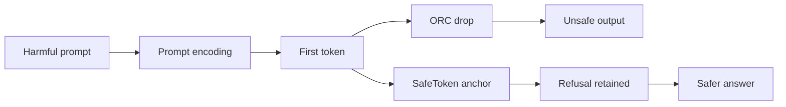
打分理由：推理起始token触发安全崩塌，机理分析很对口（core 9 / wide 6）

### 5. ⭐ 📄 ProgramDistill: From Interactive Web Apps to Verifiable Reference-Guided SWE Tasks
arXiv [2609.18805](https://arxiv.org/abs/2609.18805) · HF 🔥 44 · Jeonghye Kim, Minseon Kim, Young Jin Kim 等 · [PDF](https://arxiv.org/pdf/2609.18805)

**一句话**：用 mine craft patch 生成 4,063 个可回放 SWE 任务，测参考驱动修复
**为什么值得你看**：做 coding agent 评测/训练的人很值得看

**核心架构**：它解决的是一个老痛点：真实 web app 的需求往往不是 issue 文本，而是“看着一个能跑的参考版本，猜它该怎么改”，现有 SWE benchmark 很难系统化地给出这种参考驱动任务。作者把应用拆成不同粒度的 feature，再把每个 feature 绑定到可重放的 browser trace 和 gold patch，形成 prerequisite lineages；这样任务不是孤立题，而是能沿依赖链累积修复，控制 restoration depth。核心机制是 mine-craft-patch：先 mining 找到可重复行为，再 crafting 屏蔽对应实现生成缺失版本，最后 patch 让 agent 只靠 reference 恢复行为，成功标准是 replay trace 在修补后逐步一致。最强证据是 26 个应用上自动挖出 1,975 个 replay-verified behaviors，拼出 4,063 任务；并且深度从 1 到 8 时，Astra 和 Opus 的成功率显著掉，说明它确实在测“参考到当前”的信息获取与修复负担。新的是系统组织层：不是单题 benchmark，而是可控深度的任务生成框架。

- 4,063 题且无人工标注，生成链条完整
- 深度增大时成功率下滑很明显
- 对比的是 frontier agents，复现门槛高
**为什么现在上榜**：原文未明确
**精读价值**：值得通读，适合看 benchmark 设计和失败分析
**关联**：[[SWE-bench]]、[[ProgramBench]]
#agent #coding #benchmark · 难度：中等 · 建议：值得通读 (20 min)
前置：🔲 [[SWE-bench]] · 🔲 [[planning]] · 🔲 [[memory]] · 🔲 [[ReAct]]

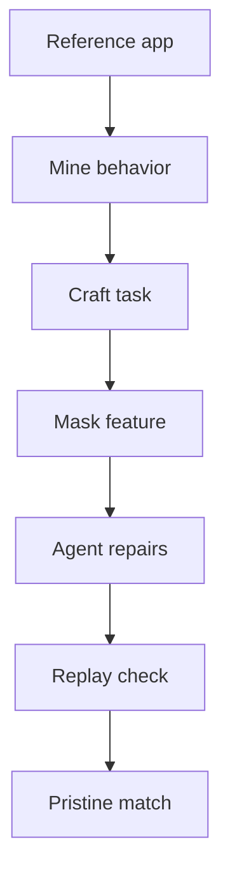
打分理由：SWE任务从交互提取特征，评测设计实用（core 8 / wide 6）

### 6. ⭐ 📄 Agora: Git as Shared Memory for Collective AutoResearch
arXiv [2609.18094](https://arxiv.org/abs/2609.18094) · HF 🔥 37 · Yifan Zhang, Yunheng Zou, Shaokun Zhang 等 · [PDF](https://arxiv.org/pdf/2609.18094) · [代码](https://github.com/yifanzhang-pro/Agora) ★7

**一句话**：用 Git 当共享记忆，13 个 agent 12 天做出 1,703 次贡献
**为什么值得你看**：做多 agent / autonomous research 很对口

**核心架构**：它针对的悖论是：多开几个 research agent，本该更多发现，却常变成每个 session 重新摸底、重复试错。Agora 的关键改变是把研究状态从临时 transcript 提升成 append-only DAG，并直接存进 Git：每个 claim、result、verification 都是 commit，parent edge 说明它依赖什么，外加索引暴露 frontier、冷门分支和验证状态，避免大家都扎堆追一个 leader。也就是说，Git 不是代码仓库，而是共享记忆和协调协议，阻断“状态丢失导致重复搜索”和“信息不可追溯导致无法复验”两类失败。最直接证据是那次 12 天的无中心调度：13 个 LLM workers、无分配任务，完成 1,703 个贡献，把 evaluator 从 3.39 降到 1.899 bpb，且 145-commit ancestry 可追踪、165 次独立复现都成功。新意在系统组织层和运行时机制层：不是单个 agent 更强，而是群体如何共享状态、分配注意力、留下可验证谱系。

- Git DAG 是唯一状态，便于回放和复验
- 165 次独立复现都成功，工程证据强
- 原文也承认还缺对照实验来定因果
**为什么现在上榜**：近 12 天持续运行，原文给出首个 sustained use
**精读价值**：值得精读，适合学多 agent 共享记忆的系统设计
**关联**：[[AutoResearch]]、[[AI Scientist]]
#autonomous-research #multi-agent #infra · 难度：中等 · 建议：值得通读 (20 min)
前置：🔲 [[multi-agent]] · 🔲 [[memory]] · 🔲 [[planning]] · ◽ Git

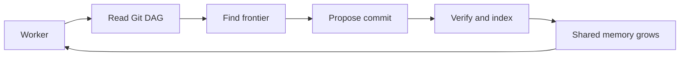
打分理由：Git共享记忆推动多agent研究闭环（core 8 / wide 6）

### 7. ⭐ 📄 ScienceBuddy: Recursive-in-Recursive Self-Improvement for Interactive Scientific Agents
arXiv [2609.17523](https://arxiv.org/abs/2609.17523) · HF 🔥 20 · Shuhan Xue, Jianyuan Zhong, Ziyuan Nan 等 · [PDF](https://arxiv.org/pdf/2609.17523) · [代码](https://github.com/Gen-Verse/ScienceBuddy) ★45

**一句话**：ScienceBuddy 用递归自改 harness+RL 让科学 agent 持续变强
**为什么值得你看**：适合看 agent 评测与自我改进范式

**核心架构**：先有个反直觉点：科研 agent 不是“答对一次就完”，而是要在研究者持续追问、补证据、改约束的过程中越用越好。旧法通常把交互日志只当展示，或者只做一次性 RL，结果任务定义和训练信号都静态，学到的改进很快失效。ScienceBuddy 的关键改变是把“研究者交互”变成可学习的任务与 rubric，再把系统分成两层递归：inner recursion 固定模型，只改 harness，靠诊断失败与受限 procedural edits 阻断“模型没变导致系统只会重复同类错”；outer recursion 固定新 harness，做 on-policy rollouts + GRPO，阻断“训练目标和真实科研流程脱节”。最直接的证据是作者展示了两轮递归动态：先 harness 适配、再模型更新，且在线服务持续可用，说明它不是离线数据集，而是闭环产品。新意在系统组织层：不是单个 agent 算法，而是把科研工作区、评估规约和持续学习绑成同一套运行时。

- 最强证据是两轮递归改进案例
- 没证明通用科研能力上限
- 复现要同时搭 workspace 和训练闭环
**精读价值**：值得精读，核心是把 agent 变成持续学习系统
**关联**：[[ReAct]]、[[Self-Instruct]]
#agent #science #self-improvement · 难度：硬核 · 建议：建议精读
前置：🔲 [[planning]] · 🔲 [[memory]] · 🔲 [[GRPO]] · ◽ on-policy

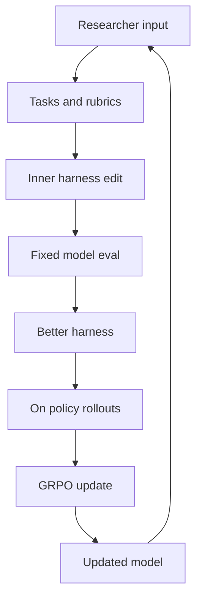
打分理由：递归自改进科学助手；具备工作流与持续学习（core 8 / wide 5）

### 8. ⭐ 📄 A Zeroth-Order Paradigm for LLM Preference Alignment
arXiv [2609.19144](https://arxiv.org/abs/2609.19144) · HF 🔥 22 · Peter Chen, Xi Chen, Wotao Yin 等 · [PDF](https://arxiv.org/pdf/2609.19144)

**一句话**：ComPO 用 comparison oracle 做零阶偏好对齐，缓解 likelihood displacement
**为什么值得你看**：很适合面试讲 DPO 的局限和替代思路

**核心架构**：先看悖论：DPO 这类 direct alignment 明明在拉大“好/坏”概率差，却可能把好回复的绝对概率一起压低，甚至把 refusal 推成 compliance，这就是 likelihood displacement。现有修正多是加正则或直接过滤 noisy pairs，但前者还在用同一个有偏梯度，后者把“弱但有用”的比较信号全扔掉。ComPO 的关键概念改动是把偏好对当成 comparison oracle：先对当前 policy 做小扰动，只问“preferred 是否更高、dispreferred 是否更低”，再把一比特比较结果汇成更新方向，所以它利用的是方向信息而不是直接最小化一个可导 preference loss。最强证据是它在 Mistral、Llama、Gemma-2、Qwen3、Gemma-3 上都报告优于现有 direct alignment，并且 pair-level diagnostics 和 length-controlled win rate 一起指向 displacement 被缓解。新在实证层加理论层：不是新 reward model，而是给 preference alignment 换成 zeroth-order 视角并补了收敛/覆盖分析。

- 最强证据是多模型 win rate 改善
- 只对 noisy pairs 有价值，干净 pair 仍靠别法
- 比较 oracle 估方向，优化方差可能不低
**精读价值**：值得通读，能补齐 DPO 之外的对齐视角
**关联**：[[DPO]]、[[RLHF]]
#rlhf #preference #optimization · 难度：硬核 · 建议：值得通读 (20 min)
前置：🔲 [[direct preference optimization]] · 🔲 [[reward model]] · 🔲 [[alignment]] · ◽ KL regularization

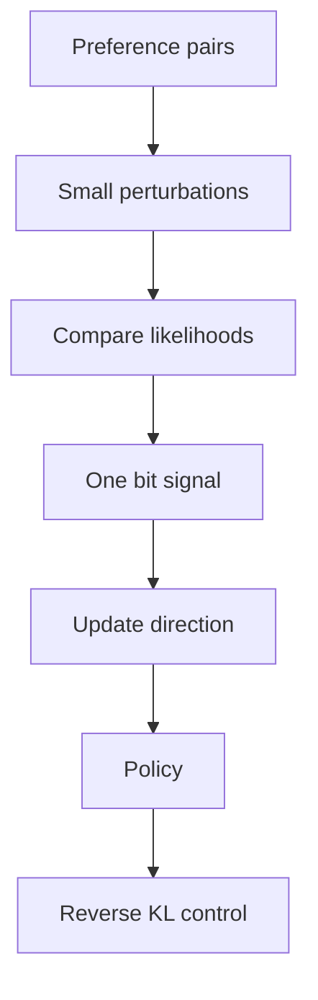
打分理由：LLM偏好对齐新范式：ComPO零阶对比优化（core 8 / wide 4）

## 🧰 项目 · 核心方向

### 9. ⭐ 🧰 openai/codex
[GitHub](https://github.com/openai/codex) ★124,897 (+19131 本月) · Trending monthly · tool · Rust

**一句话**：OpenAI Codex CLI 把 coding agent 装进终端，最近发到 v0.155.0-alpha.16
**为什么值得你看**：做 agent 工程和产品判断都很直接

**核心架构**：它解决的是“我想让模型直接在本地仓库里干活，但不想切到网页或重搭一套壳”的痛点。承重组件很清楚：终端 CLI 负责接管本地文件与命令执行，IDE/desktop/web 只是不同入口；README 还明确有 install script、npm、brew、GitHub release 多种分发，说明它不是 demo 而是可安装产品。关键设计取舍是本地运行与远端能力分层：用户可以 sign in with ChatGPT，也可以走 API key；安装器默认从 releases.openai.com 拉取，失败再回退 GitHub Releases，说明它在做稳定分发而不是单一渠道。成熟度信号较强：有高频 release，今天可见最新是 0.155.0-alpha.16，star 增长也很快；但当前仍是 alpha，README 里的核心是安装和入口，关于安全边界、任务规划细节和失败恢复机制原文未明确。若只想要 coding agent，Codex 和一般套壳客户端差在“终端本地执行+OpenAI 官方持续迭代+多入口统一”。

- 最新 release 很近，说明还在高频迭代
- 当前信息偏安装与入口，机制细节原文未展开
- alpha 阶段，稳定性与安全边界需再看
**为什么现在上榜**：最近 release：rust-v0.155.0-alpha.16（2026-09-17）
**精读价值**：值得跟进，适合看产品化 coding agent 怎么落地
**关联**：[[SWE-bench]]、[[ReAct]]
#agent #coding #inference · 难度：入门 · 建议：看速览即可
前置：🔲 [[ReAct]] · 🔲 [[planning]] · 🔲 [[memory]] · 🔲 [[MCP]]

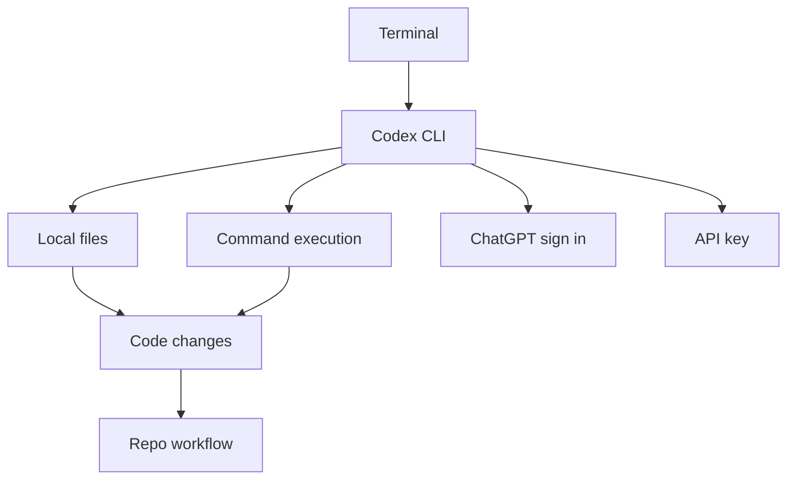
打分理由：权威代码智能体，面试谈资且工程价值高。（core 7 / wide 9）

### 10. ⭐ 🧰 volcengine/OpenViking
[GitHub](https://github.com/volcengine/OpenViking) ★37,875 (+9270 本月) · Trending monthly · infra · Python

**一句话**：OpenViking 用 viking:// 统一记忆与RAG，LoCoMo 准确率 80–83%
**为什么值得你看**：适合看 agent memory 与 RAG 架构

**核心架构**：它先解决一个反直觉问题：agent 记住得越多，越容易把长会话和知识库搞成一坨不可控上下文，检索慢、重复存、还会把旧经验和新任务混在一起。OpenViking 的关键改变是把 context 变成一个可寻址的 virtual filesystem：resources、memories、skills 都挂在 viking:// 下，directory summary 先做 L0/L1 过滤，真正内容只在需要时下钻到 L2，阻断“全量塞上下文”导致的 token 浪费和误召回；session commit 后再做 background extraction，按 policy 判断新记忆是 create、merge 还是 skip，阻断记忆无限膨胀。最直接的证据是 LoCoMo：相对 native memory，三种 agent integration 准确率升到 80–83%，同时 input tokens 降 34.3–91.0%、query latency 降 58.45–66.10%。新意主要在系统组织层，不是单个检索器，而是把 memory、RAG、skill 统一到同一 context database 和分层加载协议里。

- LoCoMo 80–83%，输入token降34.3–91.0%
- 没证明通用任务都收益；依赖 embedding/VLM 配置
- 复现不只装库，还要配模型与后台任务链路
**精读价值**：值得精读，尤其想讲清 agent memory 设计时
**关联**：[[RAG]]、[[MemGPT]]
#rag #agent-memory #vector-db · 难度：中等 · 建议：值得通读 (20 min)
前置：🔲 [[retrieval-augmented generation]] · 🔲 [[embedding]] · 🔲 [[long context]] · 🔲 [[memory]]

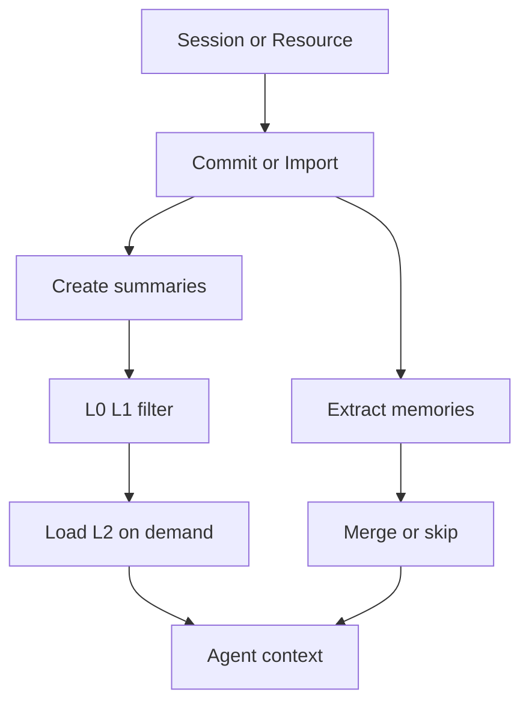
打分理由：自演化上下文库，agent记忆+RAG相关。（core 7 / wide 6）

### 11. ⭐ 🧰 max-sixty/worktrunk
[GitHub](https://github.com/max-sixty/worktrunk) ★7,920 (+998 本周) · Trending weekly · infra · Rust

**一句话**：Worktrunk 用 wt 管理 worktree，支撑多 agent 并行开发
**为什么值得你看**：看 agent 并行工作流和 CLI 设计

**核心架构**：它解决的痛点很具体：AI agent 能同时跑 5–10 个任务，但原生 git worktree 操作太碎，建一个分支要反复写路径和分支名，切换、清理、看状态都很费手。Worktrunk 的核心设计是把 worktree 按 branch 作为主键管理，路径由模板推导，`wt switch` 负责创建和切换，`wt remove` 负责清理，`wt list` 负责把各 worktree 的状态、ahead/behind、日志和 CI 信息放到同一视图；再用 hooks 把创建、合并前后、commit 等动作自动化，检测条件是工作流事件，处理动作是执行本地脚本或模板。成熟度信号比较强：有持续高频 release、完整 docs、跨平台安装说明、CI/Codecov/签名说明，而且 release notes 明确写了 breaking change 与迁移策略。和裸 git 相比，它赢在把 worktree 变成面向 agent 的操作对象，而不是让你手工拼命令。

- release 频繁，且有 breaking migration 说明
- 没证明大规模团队协作，只证明本地并行工作流
- 复现门槛低，核心是 CLI 交互与 hooks
**为什么现在上榜**：最近 release：v0.78.0（2026-09-16）
**精读价值**：适合速览：是好用的工程工具，不是研究论文
**关联**：[[git worktree]]、[[gh]]
#agent #workflow #cli · 难度：入门 · 建议：看速览即可
前置：🔲 [[multi-agent]] · 🔲 [[planning]] · 🔲 [[ReAct]]

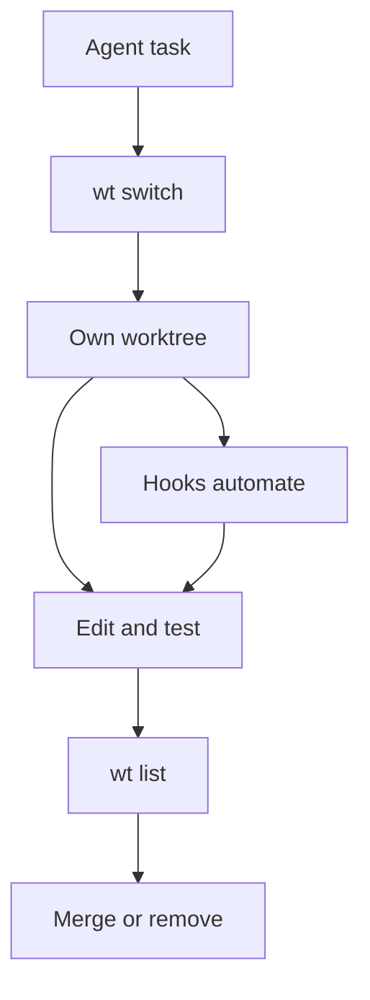
打分理由：面向AI agent的工作流CLI（core 7 / wide 5）

### 12. ⭐ 🧰 CodebuffAI/freebuff
[GitHub](https://github.com/CodebuffAI/freebuff) ★12,267 (+76 今日) · Trending daily · tool · TypeScript

**一句话**：Freebuff 用多专用 agent 做免费 coding，主打终端/桌面/云
**为什么值得你看**：想看 agent 产品包装与分工，可快速扫

**核心架构**：它解决的是“单一聊天窗口啥都干”的老问题：编码、研究、浏览器操作和并行改代码，其实需要不同 agent 角色和不同运行环境。Freebuff 的搭法是产品分层而不是单模型：Desktop 负责本地并行 workspaces，CLI 负责终端编码，Web/Cloud 提供沙箱、预览和部署，Chat 负责研究；任务流里由 file-finding、implementation、review、browser research 等专用 agent 分工，检测条件是任务类型和环境需求，处理动作是调用相应 agent 和 workspace。成熟度上，README 给了安装、产品矩阵、模型目录和数据使用说明，也写了 Bun monorepo、Docker、`.env.local`、测试指引，但正文更像产品介绍，原文未明确公开可核验的发布/实验细节。想要“免费 AI coding 工具”时，它和一般套壳的差异在于有明确的 agent 分工和多端载体，不只是一个前端入口。

- 产品矩阵完整，但实验与架构细节偏少
- 免费与广告支持是核心卖点，不是研究贡献
- 复现主要看 monorepo、Docker、CLI 安装链路
**为什么现在上榜**：最近 release：v1.0.420-beta.185（2025-10-21）
**精读价值**：看产品形态即可，精读价值一般
**关联**：[[Claude Code]]、[[Codex]]
#agent #llm #coding · 难度：入门 · 建议：看速览即可
前置：◽ agent · 🔲 [[planning]] · 🔲 [[memory]] · 🔲 [[model context protocol]]

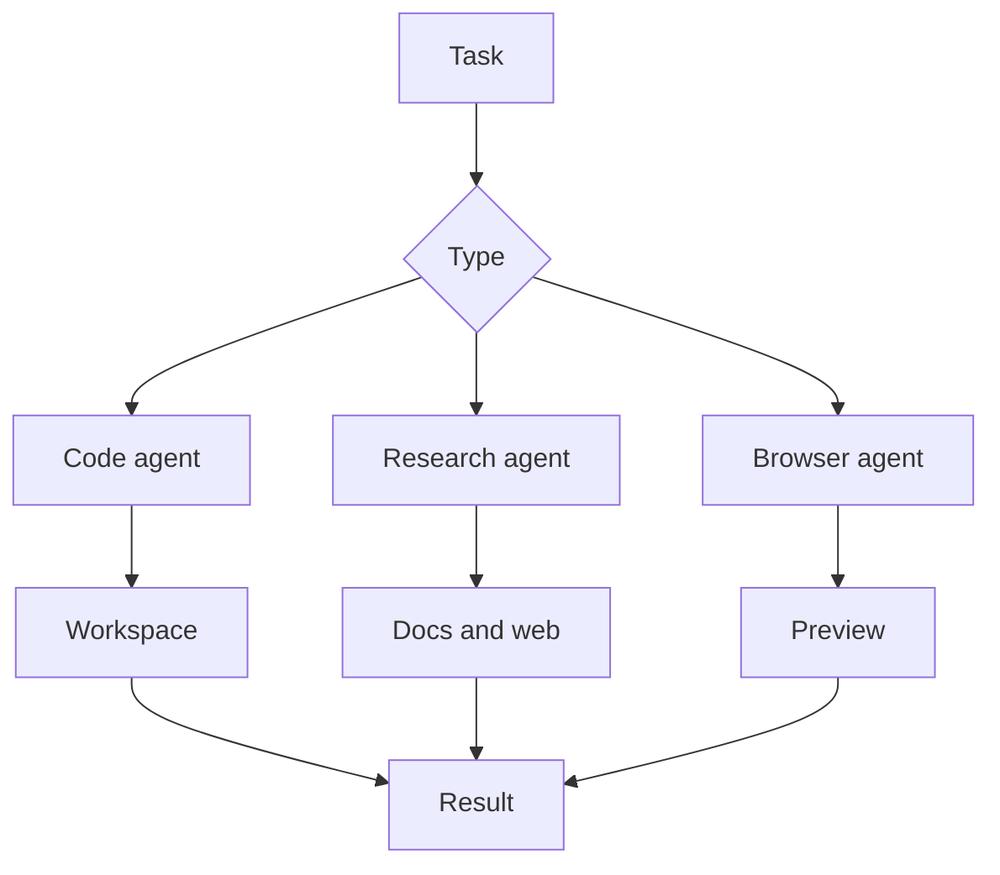
打分理由：coding agent工具，方向贴近（core 7 / wide 4）

### 13. ⭐ 🧰 LLMQuant/quant-mind
[GitHub](https://github.com/LLMQuant/quant-mind) ★2,977 (+94 今日) · Trending daily · infra · Python

**一句话**：用 agent-native 知识工程把金融原始材料变成可追溯知识图谱，带时间戳和引用
**为什么值得你看**：适合看 RAG/Agent 里的知识抽取与检索组织方式

**核心架构**：它解决的是一个很具体的悖论：金融问答里，信息明明来自论文、新闻、公告，但一旦被切块进向量库，时间点、出处、文档结构都丢了，后续检索和推理就很难可信。QuantMind 的关键改变不是“再做一个 RAG”，而是把每条知识先变成 typed artifact：先用 deterministic preprocess 做 fetch/parse/clean，保证 provenance 可回放；再用 cfg 驱动的 `PaperFlow` / `collect_news` 生成带 `as_of`、citation、source ref 的结构树或扁平卡片，阻断“知识和来源脱钩”的失败；最后在 `rag/`、`library/`、`mind/` 上分别支持 chunk 检索、本地持久化语义搜和 agentic retrieval。最直接的证据是它明确区分 `PaperStructureCfg` 和 `PaperSemanticCfg`，前者保留页级节点树，后者保留分页 chunk + 全局摘要，说明作者在结构保真和检索便利之间做了可切换的系统设计。新意主要在系统组织层，不在单个模型算法。

- 最强证据：typed artifact 带 citation 和 as_of
- 没证明通用金融以外场景也同样稳
- 复现门槛在于流程和数据契约而非模型
**精读价值**：适合看懂 agent 版知识工程怎么落地
**关联**：[[RAG]]、[[ReAct]]
#rag #agent #finance · 难度：中等 · 建议：值得通读 (20 min)
前置：🔲 [[retrieval-augmented generation]] · 🔲 [[embedding]] · 🔲 [[reranker]] · 🔲 [[planning]]

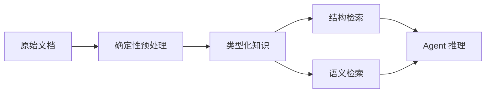
打分理由：面向知识抽取与检索的 agent 框架（core 7 / wide 5）

### 14. ⭐ 🧰 strands-agents/harness-sdk
[GitHub](https://github.com/strands-agents/harness-sdk) ★7,322 (+46 今日) · Trending daily · infra · Python

**一句话**：用可控 agent harness 统一循环、工具、记忆和评测，Python/TS 双栈同步发布
**为什么值得你看**：适合看 agent 框架怎么做运行时与控制面设计

**核心架构**：它解决的不是“再写一个 Agent demo”，而是手写 agent loop 进入生产后常见的失控：turn 数、token 预算、取消、stop reason、工具调用、MCP、多 agent、记忆、观测和评测会散落在业务代码里。Strands 的关键概念是 harness：把 agent loop 当成可控制的运行时，核心组件是生命周期控制、hooks、guardrails、tracing、evals 和 model provider 抽象，阻断“模型一旦开始行动就只能黑盒跑到底”的失败。正文里最强的成熟度信号是它不是单语言玩具，而是 Python 与 TypeScript 双 SDK、配套文档站、生产部署指南，而且最近 release 里还在持续补 context strategy presets、bm25 search、sandbox timeout 细节，说明重点在运行时能力持续加厚。和普通工具箱相比，它更像把 agent 的控制面做成 SDK。

- 最强证据：turn/budget/hooks/tracing/evals 一体化
- 没证明在复杂真实任务上的稳定收益
- 双语言但代码面更偏工程框架而非算法
**为什么现在上榜**：最近 release：typescript/v1.18.0，python/v1.56.0，python/v1.55.1
**精读价值**：想看生产级 agent 运行时，这个值得看
**关联**：[[ReAct]]、[[MCP]]
#agent #evaluation #sdk · 难度：中等 · 建议：值得通读 (20 min)
前置：🔲 [[ReAct]] · 🔲 [[memory]] · 🔲 [[multi-agent]] · 🔲 [[model context protocol]]

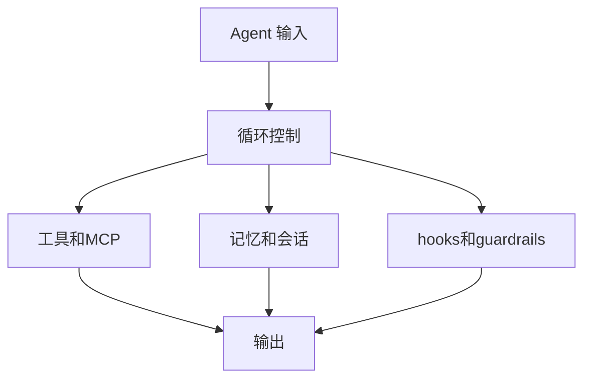
打分理由：agent harness 控制与评测支撑，工程友好（core 7 / wide 6）

## 🌐 全领域热点

### 15. 🌐 📄 The Other Half of the Memory Wall: Serving 35B MoEs from SSD with Trained Routing Prediction
arXiv [2609.18063](https://arxiv.org/abs/2609.18063) · HF 🔥 6 · Yu Lin, Yiming Wang, Runyuan Cai 等 · [PDF](https://arxiv.org/pdf/2609.18063) · [代码](https://github.com/Edge0-AI/edge0) ★1858

**一句话**：用预测路由把 35B MoE 从 SSD 流式服务，24GB 机器上峰值活跃内存 3GiB
**为什么值得你看**：很适合你看 MoE 推理、KV 之外的权重内存问题

**核心架构**：它打的是一个反直觉场景：MoE 省的是计算，不省权重字节，所以 35B 模型即使 4-bit 也会把 24GB 机器挤爆；而单纯把专家放 SSD 也没用，因为下一层专家要等上一层输出后才能知道，磁盘读不出现在 compute 前。Edge0 的关键概念是 prerouter：用前一个 token 的状态提前一 token 预测下一层 routing，把“预测”直接当“真正路由”使用，于是预取的 expert 集和最终用到的 expert 集一致，阻断了流式加载里最致命的“读错了就白等”失败。另一个设计是 unmerged recovery LoRA：int4 基座不合并 adapter，而是以并行 delta 方式服务，避免 merge 后再量化把恢复效果抹掉。最直接的证据是作者报告在单机 24GB 上把 35B MoE 做到 20 tok/s、峰值活跃内存 3GiB，并在五个公开 benchmark 上接近 fp16 teacher；新意主要在系统组织层加了“预测即路由”的跨 token 调度。

- 最强证据：3GiB 活跃内存下服务 35B MoE
- 没证明对所有 MoE 路由形式都通用
- 复现难点在路由预测训练和流式执行对齐
**精读价值**：值不值得精读，取决于你关不关心本地 MoE 推理
**关联**：[[Mixtral-offloading]]、[[FlexGen]]
#moe #inference #offloading · 难度：硬核 · 建议：建议精读
前置：🔲 [[mixture of experts]] · 🔲 [[KV cache]] · 🔲 [[quantization]] · 🔲 [[LoRA]]

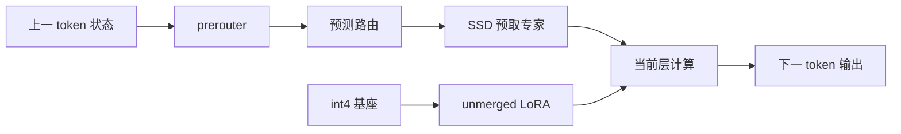
打分理由：Edge0：SSD流式路由推理，MoE系统级突破（core 8 / wide 9）

### 16. 🌐 🧰 n8n-io/n8n
[GitHub](https://github.com/n8n-io/n8n) ★204,878 (+319 今日) · Trending daily · tool · TypeScript

**一句话**：用可视化工作流+代码编排自动化，接 1500+ 集成
**为什么值得你看**：适合看 agent 编排与生产化落地

**核心架构**：它解决的是“agent 能跑 demo，但一进真实业务就卡在工具、审批、监控上”的悖论。纯线性脚本挡不住分支、重试、人工确认和多系统联动，单靠对话式 agent 也难稳定接入现成业务栈。n8n 的关键改变是把 agent 落到“workflow + middleware”上：visual canvas 负责把步骤、条件分支、回调和 human approval 固化成可审计流程，custom code 与 npm 包补上复杂逻辑，1500+ integrations 把失败模式从“自己写适配器”降到“选节点并连线”。作者明确强调 self-host / cloud、role-based access、audit trails，说明它阻断的是权限与可观测性失控，而不只是功能不足。正文里最直接的证据是它把 AI workflows、multi-step agents、tool use、full observability 放在同一套平台里，而不是把 AI 当成单独插件。新意主要在系统组织层：不是新模型，而是把 agent 的运行时、连接器和治理做成可生产部署的平台。

- 1500+ 集成是核心护城河，不是单纯模板库
- 没证明 agent 智能更强，只证明编排更能落地
- 自定义节点多，复现的是平台工程，不是论文算法
**为什么现在上榜**：stable（2026-09-17）；n8n@2.39.7（2026-09-17）
**精读价值**：值得看项目架构，理解 agent 生产化怎么做
**关联**：[[Zapier]]、[[LangChain]]
#workflow #automation #agent · 难度：中等 · 建议：值得通读 (20 min)
前置：🔲 [[ReAct]] · 🔲 [[planning]] · 🔲 [[memory]] · 🔲 [[multi-agent]]

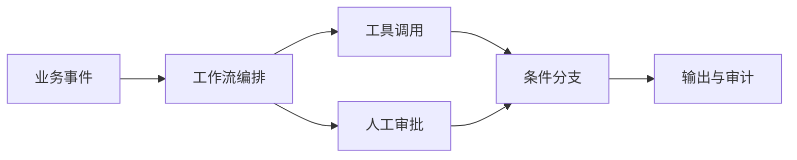
打分理由：AI 能力的工作流平台，热度高（core 5 / wide 8）

### 17. 🌐 📄 Continual Learning Mechanisms Compose for Long-Horizon Memorization
arXiv [2609.06986](https://arxiv.org/abs/2609.06986) · HF 🔥 294 · Zheyuan Zhang, Alvin Zhang, Daniel Khashabi 等 · [PDF](https://arxiv.org/pdf/2609.06986) · [代码](https://github.com/cozheyuanzhangde/compose-cl) ★14

**一句话**：用三类 anchor+merged LoRA，将100任务保留率提到34.9%
**为什么值得你看**：直击 continual learning 与记忆保留，面试好讲

**核心架构**：它要解决的反直觉场景是：模型连续学 100 个任务后，明明每次都只学一点新东西，最后却几乎把早先任务忘光。作者先指出单一 continual learning 方法在长 horizon 上都守不住 retention，问题不在“训不够久”，而在不同任务间的遗忘来源不同。关键概念是把机制拆成两轴：anchors 决定“这次更新要保住什么旧信息”，分成 data、function、weight；low-rank allocation 决定“新知识落在哪些参数槽里”，对应 shared LoRA 和 merged LoRA。这样组合的目的不是堆技巧，而是让不同机制分别阻断 replay 缺样本、output 漂移、参数被覆盖这三类失败。最强证据不是最大单项涨幅，而是 factorial experiment：data anchor 和 merged LoRA 在三个数据集上都 super-additive，最终把平均 final retention 从 1.2% 拉到 34.9%。新意在实证层加系统化设计空间：它不只提出方法，还用 successive halving + factorial analysis 证明“组合”本身是决定因素。

- 最强结果是 1.2%→34.9%，28 倍提升
- 没证明能泛化到非 memorization 任务
- 复现难点在 100-task 设定和组合搜索
**精读价值**：值得精读，核心是 continual learning 的组合范式
**关联**：[[EWC]]、[[LwF]]
#continual-learning #alignment #memory · 难度：硬核 · 建议：建议精读
前置：🔲 [[LoRA]] · 🔲 [[knowledge distillation]] · ◽ replay · ◽ regularization

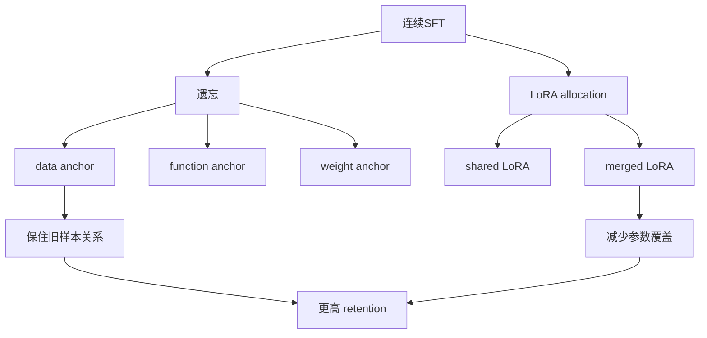
打分理由：长时记忆：持续微调机制组合，热点且方法清晰（core 6 / wide 8）

### 18. 🌐 🧰 anthropics/knowledge-work-plugins
[GitHub](https://github.com/anthropics/knowledge-work-plugins) ★24,508 (+287 今日) · Trending daily · skill · Python

**一句话**：用插件+skills+MCP，把 Claude 变成岗位专用助手
**为什么值得你看**：看 agent 工具栈和 MCP 落地很直接

**核心架构**：它解决的是“通用 LLM 会说话，但不知道你团队怎么干活、该连哪些工具、哪些流程不能乱改”的问题。这里的核心不是一个大而全 agent，而是把能力拆成三层：skills 提供岗位方法和工作流约束，commands 提供显式触发的动作入口，connectors 通过 MCP 把 Slack、Notion、Jira、HubSpot 等外部系统接进来。检测条件很简单：相关任务出现时，skills 自动生效；需要确定动作时，用户用 slash command；需要外部事实时，走 connector 拉数据。这样做阻断的是上下文漂移、工具不可控和流程不一致。成熟度信号比较强：有 11 个现成插件、明确的安装方式、目录结构和可定制说明，README 也直接暴露了 plugin.json、.mcp.json、commands、skills 的文件化实现。但它更像岗位工作台，不是自治 agent 框架；差异维度在于“把 knowledge work 结构化到可维护插件包”，而不是追求更强推理。

- 11 个岗位插件，覆盖销售、法务、数据等场景
- 文件化实现，门槛低于自研 agent 框架
- 没看到测试/发布节奏细节，成熟度主要靠 README 证据
**为什么现在上榜**：原文未明确
**精读价值**：适合快速判断企业级 agent 工作台形态
**关联**：[[MCP]]、[[LangChain]]
#plugins #agent #tool-use · 难度：中等 · 建议：值得通读 (20 min)
前置：🔲 [[model context protocol]] · 🔲 [[ReAct]] · 🔲 [[planning]] · 🔲 [[memory]]

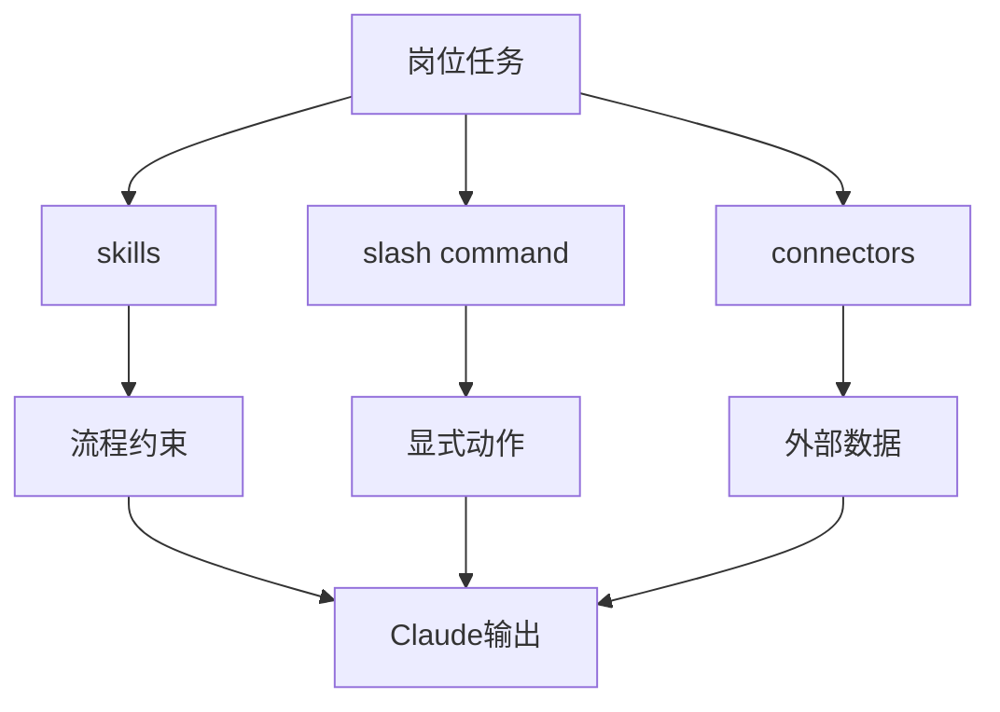
打分理由：Claude 插件生态，利于工作流 agent（core 6 / wide 7）

---
想精读哪一篇？在 Claude 里说：`精读 2026-09-17 第 N 条`，Jarvis 会按你的 known.md 只讲你不会的部分。