# Jarvis 日报 · 2026-09-18

候选 680 → 过滤后 283 → 入选 18。图例：⭐ 核心方向 · 🌐 全领域热点 · ✅ 已掌握前置 · 🔲 需补前置

## 📄 论文 · 核心方向

### 1. ⭐ 📄 DeepSeek-V4.1-Flash: Pushing the Limits of KV Cache Compression
arXiv [2609.19969](https://arxiv.org/abs/2609.19969) · HF 🔥 53 · DeepSeek-AI, Anyi Xu, B. Li 等 · [PDF](https://arxiv.org/pdf/2609.19969)

**一句话**：用 CED+CSA2+FP4 把1M上下文的 KV 压到890B/ token
**为什么值得你看**：适合看长上下文推理与部署瓶颈

**核心架构**：长上下文 agent 的反直觉点是：模型算力还没先死，HBM/SSD 先被 KV cache 吃满，prefill 也仍然贵，所以只做 attention 加速不够。作者的关键改法不是单点压缩，而是把“谁在什么时候需要什么状态”拆开：CED 让 decode 侧每 token 激活 16B 参数、prefill 只激活 8B，降低输入重计算；CSA2 负责跨层复用 KV 和索引，阻断“每层都存一份历史”的爆炸；FP4 main KV cache 进一步把常驻 KV 精度压低，SWA Bounded Replay 则把 persistent KV 从 HBM 挪到 SSD/host，并限制重放窗口，阻断“长期会话越跑越占显存”。最直接的证据是作者报告 global KV cache 降到 890 bytes/token，约为 DeepSeek-V4-Flash 的 1/4，persistent KV 约为 1/8，同时在 agentic benchmark 上还优于 baseline。新意主要在系统组织层：不是单一压缩算子，而是把模型架构、缓存格式和部署重放策略绑成一套。

- 作者报告 global KV 仅 890B/token
- persistent KV 约为 baseline 的 1/8
- 未明确公开代码，复现偏部署级
**精读价值**：值得精读，核心是缓存瓶颈的系统解法
**关联**：[[DeepSeek-V4-Flash]]、[[FlashAttention]]
#kv-cache #moe #inference · 难度：硬核 · 建议：建议精读
前置：🔲 [[KV cache]] · 🔲 [[Mixture of Experts]] · 🔲 [[long context]] · 🔲 [[quantization]]

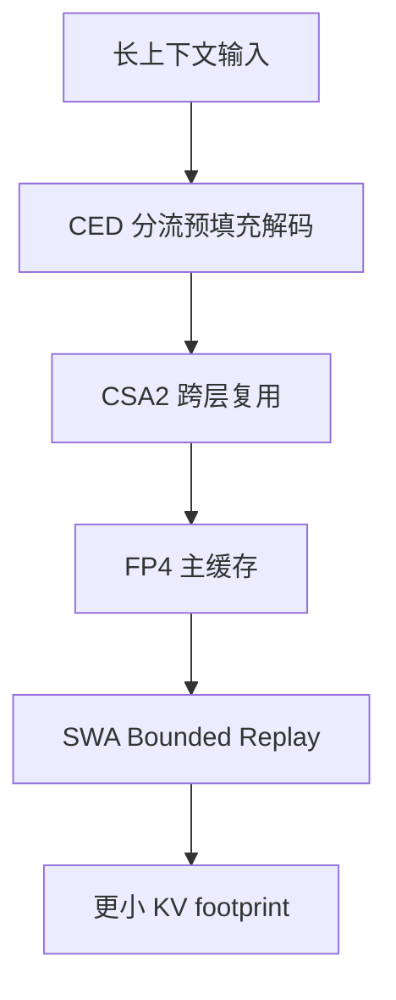
<sub>打分理由：KV cache 压缩与长上下文推理瓶颈，强相关且高质量（core 9 / wide 8）</sub>

### 2. ⭐ 📄 ActionPiece: Rethinking Action Tokenization for Autoregressive Vision-Language-Action Models
arXiv [2609.18487](https://arxiv.org/abs/2609.18487) · HF 🔥 39 · Shijie Lian, Bin Yu, Zhaolong Shen 等 · [PDF](https://arxiv.org/pdf/2609.18487) · [代码](https://github.com/DeepCybo-PhysAI/ActionPiece) ★15

**一句话**：用 PRC+ActionPiece 让 VLA 动作 token 保住相对物理关系，LIBERO 94.8%
**为什么值得你看**：对 VLA 和机器人 action discretization 很对口

**核心架构**：VLA 里一个常见悖论是：MSE 看起来很低，机器人却把“该更靠前一点”学没了，甚至把两个上下文下应不同的微调压成同一个代表动作。作者先改评价，再改 tokenization：PRC 是硬定义的局部物理排序一致性指标，比较重建前后动作邻居的距离排名是否保住，补上了点对点误差看不到的关系损失；ActionPiece 则用 PRP 和 QR 双重监督，把“近的动作在表示空间和 codeword 分配里也该近”写进训练，阻断压缩后动作簇塌到均值、上下文细调被抹平的失败。最直接的证据是同一 Qwen3-VL-4B policy 训练设定下，ActionPiece 在 LIBERO 94.8%、未见 LIBERO-Plus 68.8%，并且 ablation 显示 PRP+QR 要一起上才同时改善 PRC 和成功率。新意主要在组件层加了一个“关系保真”的 tokenization 目标，而不是换一个更大的 policy。

- PRC 评价的是排序保真，不是 MSE
- LIBERO-Plus 上仍有 68.8% 泛化
- 基于 frozen decoder，训练链路较清晰
**为什么现在上榜**：原文未明确
**精读价值**：值得精读，改的是 action tokenization 目标
**关联**：[[RT-2]]、[[OpenVLA]]
#vla #action-tokenization #vision-language-action #evaluation · 难度：中等 · 建议：值得通读 (20 min)
前置：🔲 [[vision-language-action]] · ◽ tokenization · 🔲 [[contrastive learning]] · 🔲 [[autoregressive image generation]]

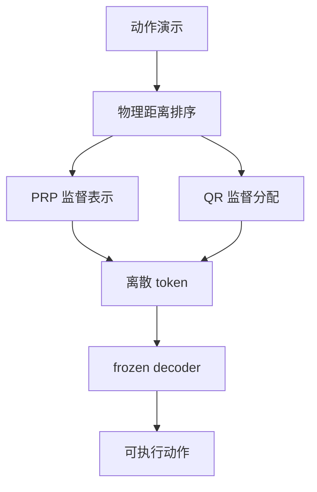
<sub>打分理由：行动token化重思考，面向具身/VLA关键环节（core 9 / wide 6）</sub>

### 3. ⭐ 📄 EPIG-Tree: Compute-Optimal Branching for Gradient-Efficient Reinforcement Learning
arXiv [2609.20004](https://arxiv.org/abs/2609.20004) · Nikita Khomich, Leopold Hermansson, Ido Hakimi · [PDF](https://arxiv.org/pdf/2609.20004)

**一句话**：用 EPIG-Tree 替代 entropy branching，让树采样更省算力地降梯度误差
**为什么值得你看**：和 GRPO、tree search、长程 credit assignment 直接相关

**核心架构**：在 GRPO 里，一个长轨迹的所有 token 共享同一个标量奖励，问题是：错在中途、后面又补救成功时，正确动作也被一起罚；而只看 entropy 也会把算力浪费在“高不确定但对梯度没影响”的分叉上。作者把树构造改写成梯度估计的算力分配问题：EPIG-Tree 不是问“哪里最不确定”，而是问“再分一枝，哪里最能降低 policy gradient 的不确定性/单位计算”；新分支主要减 decision uncertainty，重复 suffix rollout 主要减 continuation uncertainty。最强证据是 cloned-state continuous control 里梯度 MSE 更低、九个环境全赢，以及在线 multi-turn Wordle 最终 win rate 到 0.850，超过 flat GRPO 的 0.790。新意在实证层和算法层同时落地：它不是新 reward，也不是新 critic，而是把 tree branching 变成 gradient-efficient sampling。

- 核心指标是 gradient MSE，不是最终 reward
- 在线 Wordle 上 final win rate 0.850
- 对 entropy branching 是直接替代关系
**精读价值**：值得精读，能补 GRPO 的树采样视角
**关联**：[[GRPO]]、[[TreePO]]
#rl #grpo #tree-search · 难度：硬核 · 建议：建议精读
前置：🔲 [[GRPO]] · ◽ policy gradient · ◽ tree search · ◽ entropy

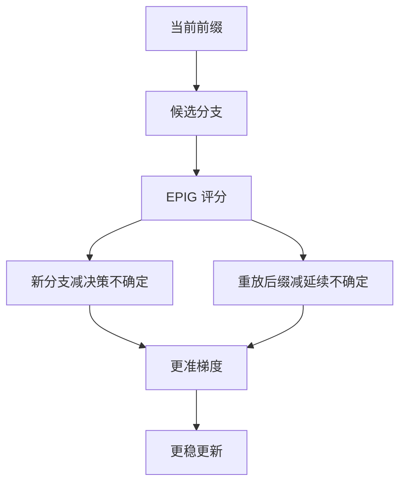
<sub>打分理由：RL算力分配与树式rollout，直接对应GRPO范式（core 9 / wide 5）</sub>

### 4. ⭐ 📄 SoL-Pi: Recursively Scaling Auto-Research Loops for Efficient Agent Harness
arXiv [2609.20519](https://arxiv.org/abs/2609.20519) · HF 🔥 42 · Haozhe Liu, Tian Ye, Sensen Gao 等 · [PDF](https://arxiv.org/pdf/2609.20519) · [代码](https://github.com/NVlabs/SoL-Pi) ★2235

**一句话**：SoL-Pi用自动研究循环找 harness，EdgeBench 省44.7–49.0% token
**为什么值得你看**：你做 Agent/RAG 和系统都用得上

**核心架构**：它解决的反直觉点是：agent 省 token 不能只靠更快 attention 或量化，因为长任务里真正烧钱的常常是 harness 自己的循环、回读和失败恢复。SoL-Pi 的关键变化是把 harness 优化变成 RSI 式 auto-research：研究 AI 读执行轨迹，提出改动，再用开发环境筛选；但 capability 和 efficiency 的门槛先被冻结，且 held-out 的 EdgeBench 只做最终验证，避免“在搜索集上越改越像答案”。四个保留下来的机制分别卡住 action execution、context compaction、observation handling、delegated reading 四类浪费。最直接的证据是 51-task EdgeBench：性能接近 Pi，但 recorded token traffic 降 44.7–49.0%，API cost 约少三分之一。新意主要在系统组织层，而不是单个算法模块。

- 最强证据是 EdgeBench 上等性能降 token
- 没证明通用到所有 agent harness
- 复现难点在大规模搜索与隔离验证
**精读价值**：值得看系统组织怎么把 agent 省 token 做实
**关联**：[[Meta-Harness]]、[[Recursive Harness Self-Improvement]]
#agent #auto-research #harness · 难度：中等 · 建议：值得通读 (20 min)
前置：◽ agent · 🔲 [[memory]] · 🔲 [[retrieval-augmented generation]] · 🔲 [[test-time compute]]

```mermaid
graph LR
A 执行轨迹 --> B 研究AI提案
B --> C 开发环境筛选
C --> D 能力门槛
C --> E 效率门槛
D --> F 机制保留
E --> F
F --> G 冻结后评测
G --> H 更低token
```
<sub>打分理由：递归自动研究循环，on-policy/agent harness 很对口（core 8 / wide 8）</sub>

### 5. ⭐ 📄 Confidence Comes from Experience: Experiential Confidence Estimation from Reasoning to Agents
arXiv [2609.17708](https://arxiv.org/abs/2609.17708) · HF 🔥 52 · Caiqi Zhang, Xiaochen Zhu, Chengzu Li 等 · [PDF](https://arxiv.org/pdf/2609.17708) · [代码](https://github.com/caiqizh/xconf) ★1

**一句话**：XConf用经验库估置信心，24次对比中23次胜过10样本self-consistency
**为什么值得你看**：做可信 Agent 和选择性拒答很相关

**核心架构**：它抓住的悖论是：模型当前这次推理看起来很顺，不代表它真有把握；尤其在 coding 和 agent 任务里，单看 logits、口头自评或重采样，往往只是在看“这次答案像不像对的”，不是“这类题过去有多常对”。XConf 的关键改动是把 confidence 的依据从当前 inference 迁到 accumulated experience：每个历史 episode 记录任务、反思、当时 confidence、最终 outcome 和 lesson；Recall 先按“相似任务+相似自信度”查历史成功率，Reflect 再让模型读这份记录并重述 confidence。最强证据是 9 个 benchmark、4 个模型、23/24 次 AUROC 优于或持平 10-sample self-consistency，而且 ECE 更低、生成成本约十分之一；在 agent 任务上，低置信度 abstain 还能把交付成功率再抬高。新意在实证层加一个新的 confidence basis，而不是训练新模型。

- 最强证据是 23/24 次 AUROC 对比胜出
- 不依赖 logit 或 weight update
- 弱点是跨模型/跨域经验迁移会掉点
**精读价值**：值得精读，尤其是 agent 置信度怎么做
**关联**：[[self-consistency]]、[[verbalized confidence]]
#confidence #agents #calibration #inference · 难度：中等 · 建议：值得通读 (20 min)
前置：◽ confidence estimation · ◽ self-consistency · 🔲 [[retrieval-augmented generation]] · 🔲 [[hallucination]]

```mermaid
graph TD
A 新任务 --> B Recall 检索经验
B --> C 历史成功率
C --> D Reflect 重估置信心
D --> E 输出 confidence
E --> F abstain 或继续
F --> G outcome 回写经验
```
<sub>打分理由：经验驱动置信度，和agent可靠性强相关（core 8 / wide 5）</sub>

### 6. ⭐ 📄 RetireOPD: Self-Retiring On-Policy Distillation for Agentic Reinforcement Learning
arXiv [2609.20784](https://arxiv.org/abs/2609.20784) · HF 🔥 14 · Yan Yu, Zhengxi Lu, Yizhou Liu 等 · [PDF](https://arxiv.org/pdf/2609.20784)

**一句话**：RetireOPD让 teacher 会退休，ALFWorld 提升14.1–18.8%
**为什么值得你看**：做 RLHF/GRPO 和 agent 训练很对口

**核心架构**：它解决的不是“要不要 distillation”，而是一个更细的悖论：在多轮 agent 里，teacher 一开始能补稀疏 reward 的洞，但当 student 已经学会这套技能后，继续硬贴 teacher 会把 reward optimization 卡住。RetireOPD 先把 teacher 单独用 environment rewards 训成真会用 privileged context 的 policy，再让 student 同时吃 GRPO 和 OPD；关键机制是 Adaptive Retirement：监控 teacher-student discrepancy，只有当它不再下降、且 student 成功率达到 teacher 的某个目标比例时，才把 teacher 按在线信号“退役”，后续只留 RL。最直接的证据是 ALFWorld 和 WebShop 上，RetireOPD 在 1.5B 到 7B 的 Qwen2.5 都稳定优于 RL、纯 distillation 和混合基线，还超过了自己的 skill-conditioned teacher。新意主要在系统组织层：不是换个 teacher，而是决定 teacher 何时退出。

- 最强证据是三种模型尺度都赢基线
- 没证明退休阈值对所有任务稳健
- 实现要同时追踪差异和成功率
**精读价值**：值得看 online retirement 这一招怎么落地
**关联**：[[OPD]]、[[GRPO]]
#opd #distillation #rl · 难度：中等 · 建议：值得通读 (20 min)
前置：🔲 [[GRPO]] · 🔲 [[on-policy distillation]] · 🔲 [[reward model]] · 🔲 [[planning]]

```mermaid
graph TD
A 环境奖励 --> B 训练 teacher
B --> C student 加 GRPO 和 OPD
C --> D 监控 discrepancy
D --> E 达到阈值
E --> F 退休 teacher
F --> G 只留 RL
G --> H 更高成功率
```
<sub>打分理由：RetireOPD：agent 任务下的 on-policy distillation 改进（core 8 / wide 6）</sub>

### 7. ⭐ 📄 Reflect, Revise, Reuse: Training-Free Skill Evolution for GUI Agents
arXiv [2609.17653](https://arxiv.org/abs/2609.17653) · HF 🔥 10 · Bofan Chen, Boxuan Zhang, Fei Tang 等 · [PDF](https://arxiv.org/pdf/2609.17653) · [代码](https://github.com/ZJU-REAL/EvoSkill-GUI) ★11

**一句话**：用 reflect-revise-reuse 让 GUI 技能无训练自我修订，MobileWorld 等最高+16.2%
**为什么值得你看**：Agent/RAG 面试里很适合聊在线自我进化

**核心架构**：反直觉点在于：GUI 任务最容易挂的不是“不会做”，而是同一技能在执行中被弹窗、延迟加载、控件位移打断；静态 skill 只要写死一次就会失效。作者的关键改法是把 skill 从单文档改成可编辑的多文件 package：retrieval metadata 负责召回相关技能，plan/localization/recovery 分开存，避免失败时整段技能不可改；critic 与 executor 信息隔离，先诊断是哪一类错误，再用受限工具只改对应文件，阻断“错误复用整份技能”的扩散。最直接的证据是跨 MobileWorld、AndroidWorld、OSWorld 都能在不训练的情况下提升，最大增益分别到 +16.2%、+6.0%、+10.5%；这说明收益来自执行反馈写回技能本身，而不是某个模型特化。新意主要在组件层和系统组织层：不是新 RL，而是把 skill 设计成可局部修订、可累积的活文档。

- 最强证据是三套 GUI 基准都涨，且无需训练
- 没证明对非 GUI 场景同样有效
- 复现要接入执行器、critic、受限写回链路
**精读价值**：值得精读，核心是训练外的技能在线演化
**关联**：[[XSkill]]、[[MMSkills]]
#gui #agent #planning #skill-learning · 难度：中等 · 建议：建议精读
前置：🔲 [[planning]] · 🔲 [[memory]] · 🔲 [[prompt injection]] · 🔲 [[ReAct]]

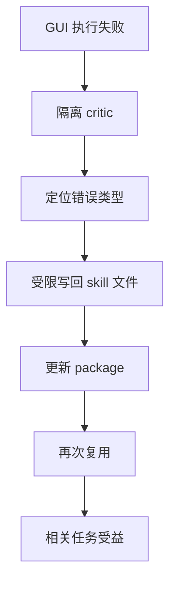
<sub>打分理由：GUI长程技能演化，贴合agent后训练与评测（core 8 / wide 2）</sub>

### 8. ⭐ 📄 VABench: Measuring Embodied Spatial Intelligence through Visual Demonstrations, Active Perception, and Metric Control
arXiv [2609.19554](https://arxiv.org/abs/2609.19554) · HF 🔥 7 · Zhongbo Zhang, Jiayi Jin, Yifan Wang 等 · [PDF](https://arxiv.org/pdf/2609.19554) · [代码](https://github.com/zhangzhongbo2213/VABench) ★11

**一句话**：用 VA-Bench 评测闭环空间智能，12 个模型三跑后成功率仅 53.93%
**为什么值得你看**：适合补 embodied / VLM 面试里的评测视角

**核心架构**：反直觉点在于：模型在静态图里能把“左边、上方、近处”说对，不代表它能在真实交互里把视角补齐并转成可执行的机器人动作。作者把空间智能拆成 observe-reason-act-revise 闭环：先要求模型根据 RGB 演示主动选视角，再输出 metric Cartesian command，由固定 controller 执行，最后根据反馈修正；这阻断了“只会描述、不懂补证据”和“会判断但不会落到坐标动作”的两类失败。最直接的证据是 matched comparison 里，主动 camera control 把成功率从 27.86% 提到 57.50%；而且 best model 在 target localization 上能到 100%，整体三跑任务成功却只有 53.93±3.17%，说明诊断分和闭环执行不是一回事。新意主要在实证层：它不是新模型，而是把主动感知、度量控制和反馈修正绑进同一个 benchmark。

- 最强证据是主动视角比被动多视角更有效
- 没证明这些诊断能单独预测成功
- 复现依赖物理仿真和固定 controller
**精读价值**：值得通读，主要看它怎么拆闭环失败
**关联**：[[CLEVR]]、[[ManipBench]]
#embodied #rl #benchmark #vlm · 难度：中等 · 建议：值得通读 (20 min)
前置：🔲 [[VLM]] · 🔲 [[vision transformer]] · 🔲 [[planning]] · 🔲 [[long context]]

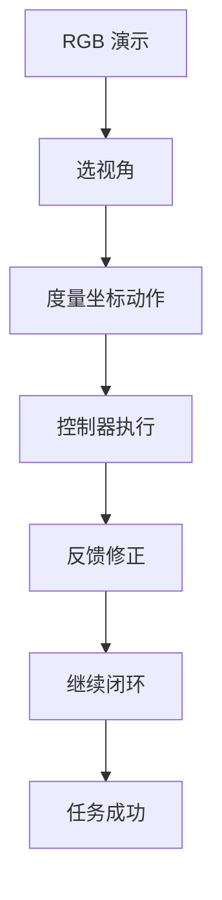
<sub>打分理由：observe-reason-act-revise评测，适配VLA/agent（core 8 / wide 5）</sub>

## 🧰 项目 · 核心方向

### 9. ⭐ 🧰 Graphify-Labs/graphify
[GitHub](https://github.com/Graphify-Labs/graphify) ★119,326 (+437 今日) · Trending daily · infra · Python

**一句话**：用本地 AST+知识图谱把代码库变成可查询图，Star 119326
**为什么值得你看**：对做 agent 工具链、代码理解很有参考价值

**核心架构**：它解决的是“大代码库读不动、grep 不出跨文件关系”的痛点：README 里给的不是搜索框，而是把代码、文档、SQL、PDF 统一映射成可遍历的 graph。承重组件是本地 deterministic AST 解析和显式边类型；代码侧用 tree-sitter 做跨语言引用解析，避免 embedding 把结构关系揉成相似度，文档/图片/视频才走语义通道。关键取舍是 no vector store、每条边带 EXTRACTED 或 INFERRED 标签，这会阻断“检索结果看起来像、但来源不清”的黑盒问题，也方便追溯路径。成熟度信号强：有明确 recent release v0.9.63–v0.9.61，README 直接给安装、CLI、输出文件和 benchmark；但基准主要是 recall/QA，且宣传里能做的范围很广，真实边界仍要看是否大量依赖语义层。想要“查项目知识”这件事，它和传统 dense RAG 的差别在于结构可解释性和跨文件依赖路径，而不是召回向量近邻。

- 最强证据是本地 AST 解析加可解释边
- 没证明语义层比纯图检索更稳
- 复现门槛低，但大仓库索引成本未明
**为什么现在上榜**：最近 release：v0.9.63（2026-09-16）、v0.9.62（2026-09-15）、v0.9.61（2026-09-12）
**精读价值**：值得关注，适合想做代码理解工具的人
**关联**：[[Graph RAG]]、[[RAG]]
#graph #rag #agent #knowledge-graph · 难度：中等 · 建议：值得通读 (20 min)
前置：🔲 [[embedding]] · 🔲 [[retrieval-augmented generation]] · 🔲 [[graph RAG]] · ◽ knowledge graph

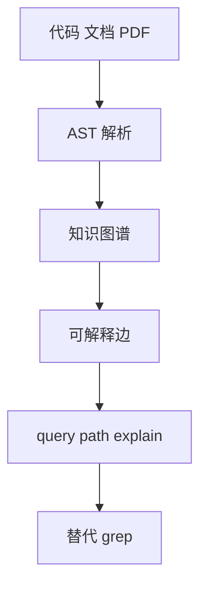
<sub>打分理由：从代码/文档到可查询KG，且强调确定性与可解释边。（core 8 / wide 9）</sub>

### 10. ⭐ 🧰 SWE-agent/mini-swe-agent
[GitHub](https://github.com/SWE-agent/mini-swe-agent) ★7,749 (+357 本周) · Trending weekly · model · Python

**一句话**：用仅 bash 的 100 行 agent 解决代码修复，SWE-bench verified >74%
**为什么值得你看**：适合看 agent scaffold 取舍与 SWE-bench 面试谈资

**核心架构**：反直觉点在于：做软件工程 agent，不一定要复杂工具和状态化 shell；很多失败其实来自 scaffold 自己把轨迹和消息拆开、把 sandbox 搞脆、把调试面变大。mini-swe-agent 的关键改变是把 agent 收缩成“bash + 线性消息 + subprocess.run”：组件只做动作执行与消息追加，不维护长会话，也不依赖 tool-calling，因而阻断了状态漂移、环境依赖和不可复现这三类失败。作者最直接的证据是它在 SWE-bench verified 上仍然能到 >74%，同时启动更快；这说明高性能不一定来自更厚的 agent 层，而可能来自把 LM 放回中间、把 scaffold 变薄。新意主要在系统组织层，不是新算法。

- bash only 仍能打到 >74%
- 不证明复杂工具没价值；更像强基线
- 复现门槛低，核心逻辑很短
**精读价值**：值得精读，尤其看 agent 组织方式怎么收缩
**关联**：[[SWE-agent]]、[[Claude Code]]
#agent #swe-bench #tool-use · 难度：中等 · 建议：值得通读 (20 min)
前置：🔲 [[ReAct]] · 🔲 [[planning]] · 🔲 [[SWE-bench]] · 🔲 [[tool use]]

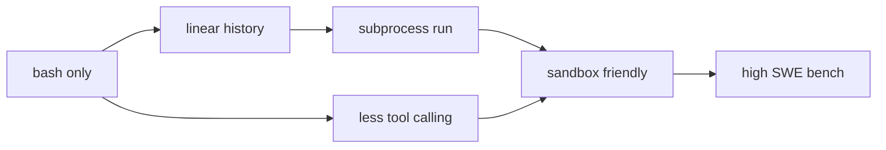
<sub>打分理由：极简高性能agent，SWE-bench表现强（core 8 / wide 7）</sub>

### 11. ⭐ 🧰 higgsfield-ai/higgsfield
[GitHub](https://github.com/higgsfield-ai/higgsfield) ★4,574 (+250 今日) · Trending daily · infra · Jupyter Notebook

**一句话**：用 GitHub 驱动分布式训练与队列调度，面向万亿参数
**为什么值得你看**：看训练系统编排和 ZeRO/FSDP 组合，适合系统岗

**核心架构**：原文的问题是：训练大模型时，真正拖慢进度的常常不是 forward/backward，而是环境、节点、队列和出错后的恢复；一旦实验跨机器，配置地狱和资源争抢会先把人拖垮。Higgsfield 的关键概念是把“实验”提升成可部署、可监控、可排队的工作流：资源分配器负责阻断节点冲突，experiment 装饰器把训练入口标准化，GitHub/GitHub Actions 负责触发与追踪，ZeRO-3/FSDP 则解决参数规模过大时的显存分摊。作者最直接的例子是用几行代码训练 LLaMA 70B，且支持 bf16、AdamW、push_to_hub；这更像在证明编排层能把分布式训练门槛压到工程可操作，而不是证明某个新优化器。新意主要在系统组织层。

- 重点证据是队列、GitHub 集成和分布式封装
- 没证明比现成训练框架更强，只是更省配置
- 依赖节点和 SSH 环境，部署门槛不低
**为什么现在上榜**：最近 release：v0.0.4-rc（2024-03-23）
**精读价值**：偏工程系统，适合看训练编排思路
**关联**：[[DeepSpeed]]、[[PyTorch FSDP]]
#training #orchestration #distributed · 难度：中等 · 建议：值得通读 (20 min)
前置：🔲 [[ZeRO]] · 🔲 [[Fully Sharded Data Parallel]] · 🔲 [[bf16]] · 🔲 [[Adam]]

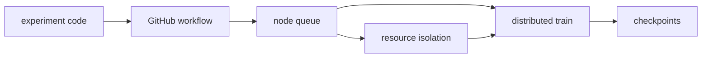
<sub>打分理由：GPU 编排框架，适合规模化训练系统研究（core 8 / wide 7）</sub>

### 12. ⭐ 🧰 unslothai/unsloth
[GitHub](https://github.com/unslothai/unsloth) ★76,377 (+78 今日) · Trending daily · infra · Python

**一句话**：用桌面端和核心库把本地训练推理做成一体，更新含 GRPO 与 FP8
**为什么值得你看**：和 LLM 微调、推理加速、agent 本地化都直接相关

**核心架构**：原文里的痛点不是单一功能，而是本地跑模型时训练、推理、RAG、agent、部署分散在不同工具里，Windows/Linux/WSL/macOS 和多 GPU 还经常割裂。Unsloth 的关键设计是把它做成“本地模型操作系统”：底层核心库负责训练与推理提速，上层 Desktop/Studio 负责 UI 和账户隔离，再往外接 Claude Code、Codex、MCP、web search、RAG、diffusion 和 OpenAI-compatible API。组件级取舍很明确：通过量化、LoRA/QLoRA、FP8/INT8、vLLM 支持去阻断显存和吞吐瓶颈，通过多平台与 Docker 去阻断环境碎片化。最强证据是最近 release 明确报告了 GRPO 改进、FP8/INT8 diffusion、ARM64 Windows CUDA、AMD RDNA 支持等，说明它不是静态包装，而是在持续把训练和推理入口做宽。成熟度信号强：有 Desktop、Studio、Docker、release、文档和活跃更新。

- 作者报告 2x faster、70% less VRAM
- 不证明所有模型都同幅度收益，依赖模型与配置
- 桌面端+核心库+Docker，成熟度高
**为什么现在上榜**：最近 release：v0.1.811-beta（2026-09-18）
**精读价值**：值得看项目成熟度和本地模型生态整合
**关联**：[[vLLM]]、[[QLoRA]]
#fine-tuning #quantization #inference #tooling · 难度：中等 · 建议：值得通读 (20 min)
前置：🔲 [[LoRA]] · 🔲 [[quantization]] · 🔲 [[GRPO]] · 🔲 [[vLLM]]

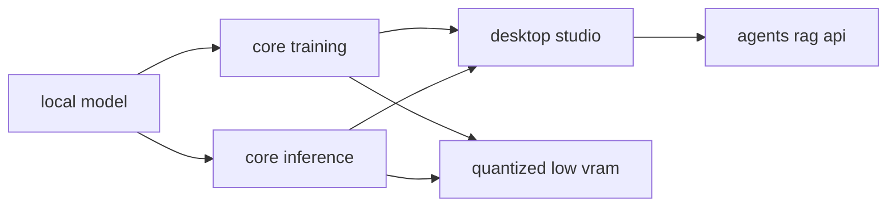
<sub>打分理由：训练/推理加速一体化，业界热点且上手价值高。（core 8 / wide 10）</sub>

### 13. ⭐ 🧰 microsoft/agent-lightning
[GitHub](https://github.com/microsoft/agent-lightning) ★18,335 (+70 今日) · Trending daily · infra · Python

**一句话**：用代理网关+控制器训练真实 agent harness，6K 样本把 SWE-bench Verified 41.8% 提到 56.4%。
**为什么值得你看**：做 agent/RL 后训练、面试讲“零改动训练”很对口。

**核心架构**：反直觉点在于：agent 训练常被迫把工具、上下文、控制流先拆掉，变成“假环境”里学策略，结果学到的不是原始 harness 里的行为。Agent Lightning 的关键改变是把训练面和执行面解耦：Trainer 只负责 `verl`/vLLM 采样与更新；API Gateway 把真实交互代理成训练数据；Rollout Controller 继续用本地或 Kubernetes 跑原 agent。每个组件都在阻断一种失败：Gateway 阻断“交互轨迹拿不到”；Controller 阻断“为了训练改坏 agent”；Trainer 阻断“复杂编排塞进训练循环”。最直接的证据是 Coding Agent 示例：只用 6K 样本，端到端 Qwen3.5-9B 在 SWE-bench Verified 从 41.8% 到 56.4%，而且作者明确说保留了 tools、context、control flow 和 environments in the loop。新意主要在系统组织层，不是新 RL 算法，而是把 agentic RL 的数据采集、执行与更新做成可插拔闭环。

- 最强证据：6K 样本提升 14.6 个点
- 没证明通用到所有 agent harness
- 复现要会 `verl`、vLLM、K8s
**精读价值**：值得看，核心在可训练 agent 系统怎么搭。
**关联**：[[RLHF]]、[[DPO]]
#agent #training #distillation #rlhf · 难度：中等 · 建议：值得通读 (20 min)
前置：🔲 [[ReAct]] · 🔲 [[reward model]] · 🔲 [[PPO]] · 🔲 [[SWE-bench]]

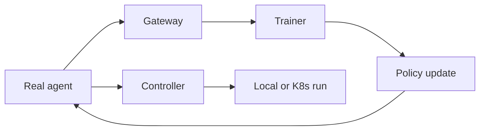
<sub>打分理由：面向agent训练的系统方案，方法可迁移性高。（core 8 / wide 7）</sub>

### 14. ⭐ 🧰 K-Dense-AI/scientific-agent-skills
[GitHub](https://github.com/K-Dense-AI/scientific-agent-skills) ★45,496 (+11830 本月) · Trending monthly · skill · Python

**一句话**：用 166 个 scientific skills 给任意 agent 接上研究工作流，覆盖 78+ 数据库。
**为什么值得你看**：适合看 agent 工具层如何产品化，面试也好聊。

**核心架构**：它解决的痛点不是“agent 会不会推理”，而是科研里大量步骤是固定 процедурал knowledge：查数据库、做格式化检索、跑特定分析、整理证据链。Scientific Agent Skills 的硬定义是一个可被 Agent Skills / Agent Plugins 标准加载的技能库，每个 skill 封装一段可复用科研流程，让 agent 在调用工具时不必从零生成步骤。组件关系很直接：skill 负责把“该查什么、怎么查、怎么判定结果”写成可执行模板；标准化打包负责阻断“不同客户端不能复用”；测试与安全扫描负责阻断“技能能跑但不稳”。原文给出的成熟度信号是有 `skill-tests`、security scan、release 列表和 BYOK/desktop 工作区；但 README 里的“190,000+ scientists”是作者自报，未见独立验证。它和一般 research agent 的差别不在模型，而在可移植的任务库厚度：你拿到的是流程积木，不是一个单一助手。

- 最强证据：166 个技能+测试流水线
- 没证明这些 skill 都同样高质量
- 装载到不同 agent 依赖标准支持
**为什么现在上榜**：最近 release：v2.69.0（2026-09-11）; v2.68.0（2026-09-11）; v2.67.0（2026-09-10）
**精读价值**：想看 agent 工具生态，这个比“聊天助手”更像基础设施。
**关联**：[[ReAct]]、[[model context protocol]]
#agent #science #tooluse · 难度：入门 · 建议：值得通读 (20 min)
前置：◽ agent · 🔲 [[tool use]] · 🔲 [[retrieval-augmented generation]] · 🔲 [[planning]]

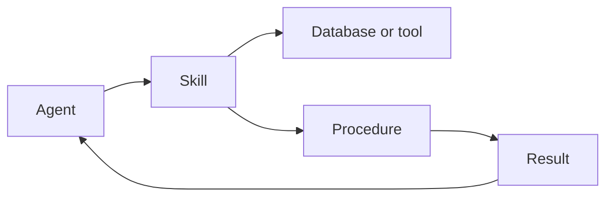
<sub>打分理由：科学 agent 技能库与数据，迁移性强（core 7 / wide 7）</sub>

## 🌐 全领域热点

### 15. 🌐 🧰 calesthio/OpenMontage
[GitHub](https://github.com/calesthio/OpenMontage) ★59,915 (+2850 本周) · Trending weekly · infra · Python

**一句话**：用多 agent 流水线把脚本、素材、剪辑和合成串起来，做可复现的视频生产。
**为什么值得你看**：如果你关心 agent 工作流/多模态生成，它是很直观的系统样例。

**核心架构**：它解决的是“一个 prompt 想做成完整视频，但素材、镜头、剪辑、配乐都要分工”的真实痛点。OpenMontage 的核心机制不是单次生成，而是 agentic video production system：先从文本或参考视频提炼叙事和镜头计划，再按 pipeline 拉取/生成素材，最后由编辑与合成阶段输出成片。这里的关键取舍是它不只做 image-based video，而是明确支持从 free stock footage 和 open archives 里构建 corpus、检索真实 motion clips，再用时间线编辑和渲染收束，这阻断了“只有静帧动画、没有真正运动叙事”的失败。成熟度信号还不错：README 给出多个成片、成本、工具链和 Backlot 审核界面，但“世界上第一个”是作者自述，原文未给独立对比。它相对同类的差异在于是否真做 production workflow，而不是只做视频生成 API 封装。

- 最强证据：给出多条完整成片与成本
- 没证明对所有风格都稳定
- 复现依赖多模型、多工具链
**为什么现在上榜**：最近 release：原文未明确
**精读价值**：更像多模态 agent 系统样板，值得快速扫一遍。
**关联**：[[ReAct]]、[[vision-language-action]]
#agent #video #workflow · 难度：中等 · 建议：值得通读 (20 min)
前置：🔲 [[multi-agent]] · 🔲 [[planning]] · 🔲 [[video generation]] · 🔲 [[diffusion model]]


<sub>打分理由：agent化视频生产，工具链完整（core 5 / wide 7）</sub>

### 16. 🌐 🧰 Fission-AI/OpenSpec
[GitHub](https://github.com/Fission-AI/OpenSpec) ★69,237 (+298 今日) · Trending daily · infra · TypeScript

**一句话**：用 spec 驱动 AI 编码，生成可审的 proposal 到 archive 闭环
**为什么值得你看**：做 agentic coding/RAG 工具链时很对口

**核心架构**：它解决的是“让 AI 先改代码，还是先把需求说清”这个老问题：直接让模型写代码，容易在 brownfield 仓库里把意图、范围和执行顺序都搞乱。OpenSpec把关键变化改成 artifact-guided workflow：先用 `openspec/changes/...` 固化 proposal、spec、design、tasks，再让 agent 按这些工件推进，等于把“需求漂移”和“边做边忘”挡在代码之外。`openspec status` 现在还会给出明确 `Next:` 命令，减少人和 agent 对流程记忆的依赖。v1.13.1 最直接的支持证据是安全加固：`config.yaml` 不能再注入指令，恶意文件不会卡死 `update/archive`，`.npmrc` 也不能劫持更新检查，说明它开始认真处理不可信仓库场景。新意主要在系统组织层，不是单个 coding skill。

- 安全加固直接对准未审仓库
- status 给出 Next 提升可恢复性
- stores beta 说明多仓协作还在打磨
**为什么现在上榜**：v1.13.1（2026-09-17）
**精读价值**：想理解 spec-driven coding，值得通读
**关联**：[[ReAct]]、[[SWE-bench]]
#agent #spec #coding-assistant #mcp · 难度：中等 · 建议：值得通读 (20 min)
前置：◽ agent · 🔲 [[planning]] · 🔲 [[model context protocol]]

```mermaid
graph TD
A 输入需求
B 生成 proposal spec design tasks
C agent 按任务执行
D archive 归档
E 安全检查
A --> B
B --> C
C --> D
E --> B
```
<sub>打分理由：面向编码助手的规范化开发，工程迁移性强。（core 5 / wide 7）</sub>

### 17. 🌐 📄 LimiX-2: A Contextual Mechanism Network Towards General Structured-Data Intelligence
arXiv [2609.17488](https://arxiv.org/abs/2609.17488) · HF 🔥 165 · Xingxuan Zhang, Gang Ren, Hao Yuan 等 · [PDF](https://arxiv.org/pdf/2609.17488) · [代码](https://github.com/limix-ldm-ai/LimiX) ★4203

**一句话**：用 CMN+CCMM 把表格学习从单目标预测改成联合结构建模
**为什么值得你看**：适合看结构化数据 foundation model 怎么换范式

**核心架构**：它先打破一个反直觉点：表格里真正难的常不是单列预测，而是同一数据集里不同列、缺失值、因果关系要同时一致；只学 p(y|x, Dcontext) 会把“只会猜标签”学得很强，却难迁移到补全和结构推断。LimiX-2 的关键改动是 CMN：把上下文学习的目标从指定 target 转成变量间依赖的联合建模 p(x,y|Dcontext)，再用 CCMM 在多种可见性模式下做 target prediction + feature reconstruction，让“跨变量条件推断”成为主任务而不是副产品。最直接的证据是它在 TabArena、TALENT、BCCO 上统一超过 dataset-specific 模型和 tabular foundation models，同时还能做 causal skeleton recovery，说明 feature attention 不只是相关性。新意在组件层加系统训练目标层。

- 联合建模替代单 target PFN 是核心
- 因果骨架恢复是额外能力，不是主优化目标
- 合成 SCM 训练，真实分布外泛化边界未明
**精读价值**：值得精读范式切换，不只是刷榜
**关联**：[[PFN]]、[[TabFM]]
#tabular #pfm #context-learning #model · 难度：硬核 · 建议：建议精读
前置：◽ prior-data fitted networks · 🔲 [[long context]] · ◽ causal awareness

```mermaid
graph TD
A 多列表格
B Context Conditional Masked Modeling
C CMN 联合建模
D 分类回归补全
E 因果骨架恢复
A --> B --> C
C --> D
C --> E
```
<sub>打分理由：tabular上下文机制，虽热但与LLM/agent主线偏（core 2 / wide 7）</sub>

### 18. 🌐 🧰 PaddlePaddle/PaddleOCR
[GitHub](https://github.com/PaddlePaddle/PaddleOCR) ★89,783 (+72 今日) · Trending daily · tool · Python

**一句话**：用 PP-OCRv6 和文档解析把图片 PDF 变成 LLM 友好的结构化数据
**为什么值得你看**：做 RAG/文档 Agent 很实用，且近期更新密集

**核心架构**：它解决的是“文档不是纯文本，LLM 直接读 PDF 常被版面、表格、公式和多语种卡住”这个落地痛点。PaddleOCR 的承重组件是两条线：一条是 scene OCR，靠 PP-OCRv6 做检测+识别，另一条是 document parsing，靠 PaddleOCR-VL/PP-StructureV3 把页面转成 Markdown/JSON，并尽量保留坐标与结构。关键取舍是把轻量高吞吐和结构输出同时做进同一工具链，而不是只给文字框。v3.7.0 的最直接证据是 PP-OCRv6：34.5M 参数的 medium 版报告较 v5_server 提升 4.6% detection 和 5.1% recognition，还给出 50 语言统一、OpenVINO 5.2× CPU 加速和 A100 0.13s 的部署指标，说明它不是 demo 而是工程化版本。和纯 VLM 文档解析方案相比，它更偏可部署的 OCR 引擎。

- 34.5M 参数却报告超越多种主流 VLM
- 50 语言统一，减少模型切换
- README 有 release 和部署信息，成熟度高
**为什么现在上榜**：v3.7.0（2026-06-11）
**精读价值**：做文档 RAG 或 OCR 工程值得看
**关联**：[[PaddleOCR-VL]]、[[PP-Structure]]
#ocr #multimodal #document #pipeline · 难度：中等 · 建议：值得通读 (20 min)
前置：🔲 [[VLM]] · 🔲 [[detection]] · ◽ document parsing

```mermaid
graph TD
A PDF或图片
B 检测识别
C 版面结构化
D Markdown JSON
E LLM 可读数据
A --> B --> C --> D --> E
```
<sub>打分理由：强OCR能力，能为VLM/RAG提供结构化输入。（core 4 / wide 7）</sub>

---
想精读哪一篇？在 Claude 里说：`精读 2026-09-18 第 N 条`，Jarvis 会按你的 known.md 只讲你不会的部分。