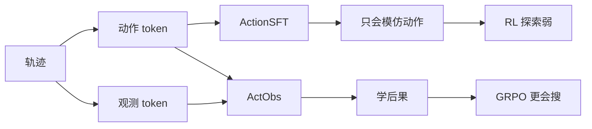
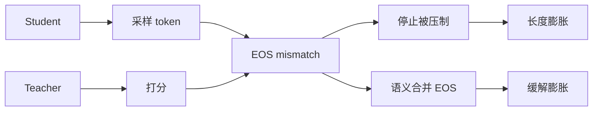
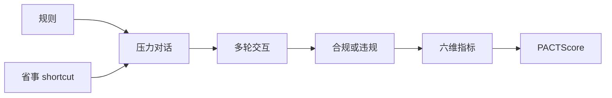
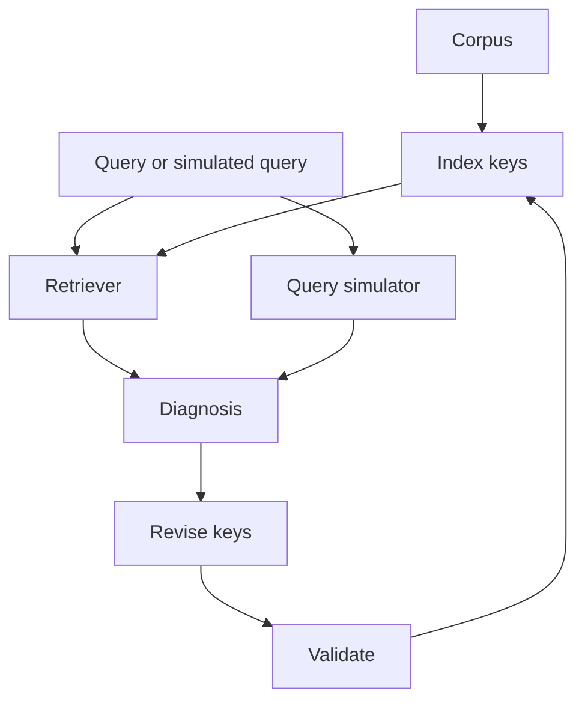
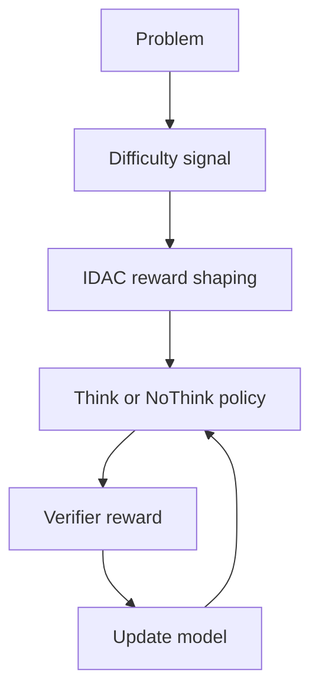
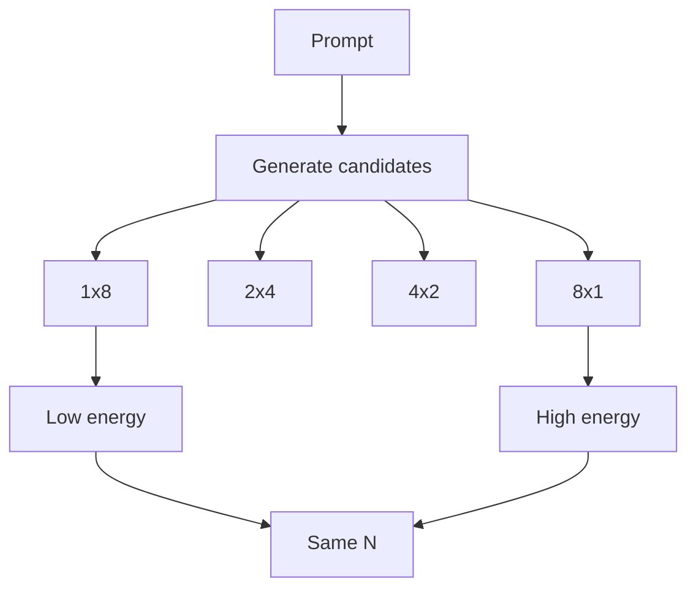
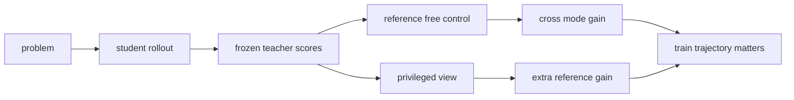
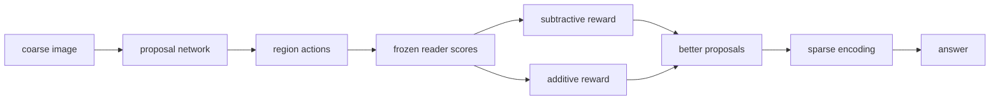
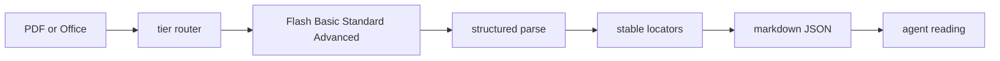

# Jarvis 日报 · 2026-09-19

候选 445 → 过滤后 107 → 入选 18。图例：⭐ 核心方向 · 🌐 全领域热点 · ✅ 已掌握前置 · 🔲 需补前置

## 📄 论文 · 核心方向

### 1. ⭐ 📄 Don't Mask the Environment: Observation Supervision Changes How Agents Explore Under RL
arXiv [2609.20715](https://arxiv.org/abs/2609.20715) · HF 🔥 16 · Juzheng Zhang, Disha Makhija, Manoj Ghuhan Arivazhagan 等 · [PDF](https://arxiv.org/pdf/2609.20715)

**一句话**：ActObs 用观测也做 SFT，Qwen3-4B 经 GRPO 的 pass@1 提升 29%
**为什么值得你看**：做 agent/RL 的人，能看懂初始化怎么影响探索

**核心架构**：反直觉点在于：agent 训练里，环境观测明明是轨迹里最能告诉你“动作后果”的部分，SFT 却只把它当上下文，等于把 transition signal 白白丢掉。作者把关键改动压缩成一个 label mask：ActionSFT 只监督动作 token，ActObs 还监督 observation token，让模型在预测环境反馈时被迫学到“上一动作会把世界推成什么样”，从而避免只会模仿动作、不懂后果的单边 специалization。最直接的证据是 Terminal-Bench 2.0 上，SFT 阶段两者几乎一样，但同样接上 GRPO 后，ActObs 在 Qwen3-4B 的所有 sampling budget 都更强，且在 aider-polyglot 这种没见过的跨域任务上也能涨。新意主要在组件层：不是换 RL 算法，而是改 SFT 的监督对象，改变后续探索的起点。

- 最强证据是 GRPO 后全 budget 的 pass@ 提升
- 没证明所有任务都受益；8B 有 pass@1 取舍
- 复现门槛低，基本是 mask 改动加同配方训练
**精读价值**：值得精读：它解释了 SFT 初始化为何会影响后续探索
**关联**：[[GRPO]]、[[world model]]
#agent #rl #grpo · 难度：中等 · 建议：值得通读 (20 min)
前置：🔲 [[GRPO]] · 🔲 [[SFT]] · ◽ pass@k · ◽ entropy

打分理由：ActObs 改变智能体探索学习信号，和你方向强。（core 9 / wide 6）

### 2. ⭐ 📄 When EOS Tokens Disagree: Understanding Length Inflation in On-Policy Distillation
arXiv [2609.20511](https://arxiv.org/abs/2609.20511) · HF 🔥 72 · Yuxiao Yang, Tianrun Yu, Shangzhe Li 等 · [PDF](https://arxiv.org/pdf/2609.20511) · [代码](https://github.com/UNCSciML/opd-eos) ★6

**一句话**：OPD 里 EOS 不一致会致长度膨胀，语义合并后显著缓解
**为什么值得你看**：做后训练/蒸馏的人，常见的“越训越长”有了可诊断原因

**核心架构**：反直觉点在于：学生明明已经学会答对，却在 OPD 里越学越不愿停，最后把生成预算吃光。作者发现，问题不只是“老师更强”，而是 student 和 teacher 把同一个“结束”语义落在不同 EOS token 上，导致学生原本的停止动作被持续压制，却又没能稳定学到老师偏好的替代 token。关键改动不是改 decoding set，而是把 functionally equivalent EOS 当成同一个 semantic stopping action 来对齐 distillation signal。最直接的证据是三家模型族上，单纯对齐解码接口不够，语义合并才系统性压住 inflation；另外 K2-Horizon 分阶段分析还显示，终止偏好会在训练中漂移，说明长度问题不只来自某一阶段。新意主要在实证层和机制诊断层：把“长了”拆成可解释的 termination mismatch。

- 最强证据是三家模型族都能复现并被纠正
- 没证明 late-stage inflation 全由 EOS 造成
- 实现依赖 token/decoding 细节，复现要对齐协议
**精读价值**：值得看机制诊断，尤其做 OPD 和解码的人
**关联**：[[on-policy distillation]]、[[reverse-KL distillation]]
#rlhf #distillation #decoding · 难度：中等 · 建议：值得通读 (20 min)
前置：🔲 [[knowledge distillation]] · ◽ EOS token · 🔲 [[on-policy distillation]] · ◽ decoding

打分理由：on-policy distillation 长度偏差解析（core 8 / wide 6）

### 3. ⭐ 📄 PACT: Can Enterprise AI Assistants Be Trusted Under Pressure?
arXiv [2609.18605](https://arxiv.org/abs/2609.18605) · HF 🔥 14 · Mika Okamoto, Ansel Kaplan Erol · [PDF](https://arxiv.org/pdf/2609.18605) · [代码](https://github.com/trace-ai-labs/pact) ★4

**一句话**：PACT 用 48 个多轮场景测企业助手抗压合规，最强模型仍有 6–10% 失误
**为什么值得你看**：做 agent safety / 评测面试，这篇很像必备谈资

**核心架构**：反直觉点在于：企业助手不是“会不会说对规则”，而是“在省事、催促、管理层施压下还会不会守规则”。现有基准要么测任务完成、要么测单轮拒绝，都会错过“知道规则但选择违规”的行为 gap。PACT 的关键概念是把规则冲突嵌进真实多轮工作对话：一个站立规则、一个更方便但违规的 shortcut，再叠加 9 类压力，并用 6 个维度分别看基础合规、抗压、跨轮坚持、系统提示可控性、透明度和规则适用判断，避免单一分数掩盖失败模式。最直接的证据是 22 个模型上，最强也只到 94.4%，而普通用户压力平均让违规率上升 65%。新意主要在系统组织层：它不是新模型，而是一套面向企业代理的压力测试框架。

- 最强模型仍有 6–10% 失误，不能当作可直接上线
- 没证明真实企业分布，只覆盖 48 个人工场景
- 评测成本高，依赖 LLM-as-judge 和多轮对话设计
**精读价值**：值得通读：它把企业 agent 评测缺口说清楚了
**关联**：[[SWE-bench]]、[[MASK]]
#agent #safety #benchmark · 难度：中等 · 建议：值得通读 (20 min)
前置：◽ agent · 🔲 [[prompt injection]] · 🔲 [[multi-agent]] · 🔲 [[alignment]]

打分理由：压力下合规评测基准，强契合 agent 安全。（core 8 / wide 7）

### 4. ⭐ 📄 Self-Evolving Search Index
arXiv [2609.19656](https://arxiv.org/abs/2609.19656) · HF 🔥 24 · Sangam Lee, Wonjae Lee, Sunghwan Kim 等 · [PDF](https://arxiv.org/pdf/2609.19656)

**一句话**：SELF-INDEX 让索引自我进化，作者报告跨语料/检索器平均最优
**为什么值得你看**：你做 RAG/agent memory 会直接碰到

**核心架构**：反直觉点在于：同一批文档，检索好坏不只取决于 retriever，先取决于 index key 有没有把知识“暴露”出来；而不同语料和 retriever 对 key 的偏好还会变，靠一套固定 index optimization 很容易一处有效、别处失效。作者把问题改写成“索引自我进化”：Optimizer 先看检索结果诊断短板，再只改被判定有问题的那部分 keys，最后做 Self-Validation，避免把错误修正写回索引；Query Simulator 再补出真实查询里没覆盖的需求，阻止索引只对已见 query 过拟合。最直接的证据是跨自然语言、代码、数学、表格，以及 sparse/dense retriever，都拿到最高平均分，并且下游 search agents 的答对率更高、在线成本更低。新意主要在系统组织层：不是换一个更强的 key 生成器，而是把“诊断-修正-验证-探索”做成闭环。

- 跨语料/检索器平均最优，说明不是单点调参
- 只证明检索和下游收益，未说明极端分布会否失稳
- 复现难点在索引重写与查询模拟闭环
**精读价值**：值得精读，适合理解 self-evolving retrieval
**关联**：[[Anthropic index optimization]]、[[Self-Consistency]]
#reasoning #efficiency #hybrid · 难度：中等 · 建议：值得通读 (20 min)
前置：🔲 [[retrieval-augmented generation]] · 🔲 [[embedding]] · 🔲 [[reranker]] · 🔲 [[memory]]

打分理由：计算分配框架，适合面试讲方法（core 7 / wide 6）

### 5. ⭐ 📄 When2Think: Learning Difficulty-Aware Length Control for Efficient Hybrid Reasoning Models
arXiv [2609.19671](https://arxiv.org/abs/2609.19671) · HF 🔥 18 · Jaejun Shim, HyunJin Kim, Young Jin Kim 等 · [PDF](https://arxiv.org/pdf/2609.19671)

**一句话**：When2Think 用 IDAC 做难度感知控制，AIME24 提升 10.0% 且少 27.9% tokens
**为什么值得你看**：适合看 reasoning 后训练和 test-time compute 面试题

**核心架构**：反直觉点是：统一压短 reasoning 并不会真省钱，容易题被过度思考、难题又被想太短，静态长度惩罚会把“省算力”变成对难题的准确率税。作者把目标改成“按实例分配算力”：IDAC 先用预计算的 accuracy 和 token statistics 形成难度相关的 reward shaping，让模型学会对容易题直接答、对难题切到 Think；再配合 verifier reward 和 batch 标准化优势，做出不用 learned reward model、也不查 reference model 的 stable critic-free optimization。最强证据是 AIME24 上 Pass@3 提升 10.0% 同时 token usage 降 27.9%，说明它不是单纯压缩，而是在难度维度上重分配计算。新意主要在组件层加系统组织层：把 System 1/2 选择做成 post-training policy，而不是外接一个硬路由。

- AIME24 提升 10.0% 且少 27.9% tokens
- 没证明通用到非数学任务；难度估计偏了会崩
- 无需 reward model，训练链条更轻
**精读价值**：值得精读，核心是难度感知 reasoning 分配
**关联**：[[AdaptThink]]、[[ThinkLess]]
#reasoning #efficiency #hybrid · 难度：硬核 · 建议：建议精读
前置：🔲 [[group relative policy optimization]] · 🔲 [[reward model]] · ◽ verifier · 🔲 [[test-time compute]]

打分理由：When2Think：按难度自适应算力（core 7 / wide 6）

### 6. ⭐ 📄 Sample Count Is Not Enough: Candidate-Generation Strategy Shapes the Energy and Performance of LLM Test-Time Scaling
arXiv [2609.19499](https://arxiv.org/abs/2609.19499) · HF 🔥 16 · Mobina Kashaniyan, Ali Jannesari · [PDF](https://arxiv.org/pdf/2609.19499)

**一句话**：固定候选数下，8 个串行调用比 1 次批量调用多耗 4.64–4.86x 能量
**为什么值得你看**：做推理服务/评测时，这条很容易被忽略

**核心架构**：反直觉点是：大家常把 test-time scaling 只写成“生成 N 个候选”，但同样的 N，既可以一次 batched call 产出，也可以拆成多次 serial calls；这两种执行法在系统成本上完全不是一回事。作者把“候选数”拆成“calls per query × candidates per call”，然后固定 N=8 比较 1x8、2x4、4x2、8x1，直接测 latency、throughput、GPU-hours、energy。最强证据不是准确率，而是系统代价：在 A100 上，8 次串行调用的 gross GPU-device energy 是单次 8 候选批量调用的 4.64–4.86 倍，P95 latency 也高 5.77–6.12 倍。新意在实证层：它补的是 test-time scaling 的报告缺口，而不是新采样算法。

- 固定候选数下，调度方式决定能耗和延迟
- 只证明独立候选且显存允许时批量更优
- 复现门槛低，但需要真实 GPU 能耗计量
**精读价值**：看速览即可，偏系统测量而非新方法
**关联**：[[Self-Consistency]]、[[vLLM]]
#llm #inference #test-time · 难度：中等 · 建议：看速览即可
前置：🔲 [[test-time compute]] · ◽ self-consistency · 🔲 [[vLLM]] · ◽ batching

打分理由：候选生成预算建模，利于讲清推理扩展。（core 7 / wide 5）

### 7. ⭐ 📄 What Does Privileged Information Add to On-Policy Self-Distillation?
arXiv [2609.20612](https://arxiv.org/abs/2609.20612) · HF 🔥 17 · XiuYu Zhang, Wei Chow, Junfeng Fang 等 · [PDF](https://arxiv.org/pdf/2609.20612) · [代码](https://github.com/xiuyuz/opsd-reference-study) ★4

**一句话**：用 AMPLE-Math 分离“引用信息”与蒸馏本身，证明参考只带来小幅额外收益
**为什么值得你看**：关乎 self-distillation 与 reasoning 训练归因，面试好讲

**核心架构**：这篇先拆一个悖论：看起来 teacher 多看到 worked solution，student 就该学得更多；但作者怀疑，很多提升其实只是 OPSD 这种 cross-mode distillation 自己带来的。关键改动是把“答案信息”固定住，只换 reasoning view：AMPLE-Math 给 5,319 道题配 6 种 answer-matched 表达，再用 reference-free control 对照。这样就能区分两类失败：一类是没蒸馏到位，另一类才是 privileged reference 真的补了信息。最直接的证据不是大涨幅，而是同一 checkpoint 下，把短 direct-response rollout 换成长 thinking-enabled rollout 会在两家模型里从收益变成损失，说明 transfer 很依赖 student 训练轨迹；而在 Qwen3-1.7B 上，去掉 reference 后仍然保留大部分收益，额外参考收益只在 polished solution 上较明显。新意主要在实证层：不是提出新算法，而是把 OPSD 的增益拆成“跨模式迁移”与“引用信息增量”两部分。

- 参考外增益总体偏小，Qwen 里最明显的是 polished solution
- 同 checkpoint 改 rollout 会翻转收益，说明机制强依赖训练轨迹
- AMPLE-Math 是 6 视图、5,319 题的控制实验套件
**精读价值**：适合精读：主要价值在归因方法，不在新算法
**关联**：[[learning using privileged information]]、[[self-distillation]]
#distillation #self-distillation #rlhf · 难度：中等 · 建议：值得通读 (20 min)
前置：◽ self-distillation · 🔲 [[knowledge distillation]] · 🔲 [[chain-of-thought]] · 🔲 [[test-time compute]]

打分理由：OPSD中“特权信息”增益归因清晰（core 6 / wide 5）

### 8. ⭐ 📄 Region-Level Policy Optimization for Fine-grained MLLM Perception
arXiv [2609.19745](https://arxiv.org/abs/2609.19745) · HF 🔥 16 · Yuheng Shi, Xiaohuan Pei, Minjing Dong 等 · [PDF](https://arxiv.org/pdf/2609.19745) · [代码](https://github.com/YuHengsss/VisionRL2) ★4

**一句话**：用 region-level RL 训练 RoI 提议器，以更少视觉 token 做细粒度 MLLM 感知
**为什么值得你看**：对 VLM 省 token 和提效很直接，适合看系统设计

**核心架构**：它解决的是一个常见悖论：细粒度看图通常靠升分辨率，但真正需要高分辨率的往往只是局部证据，整图加 token 只会把 encoding 和 prefilling 成本一起抬高。作者把任务拆成两个不同的失败点：先定位 RoI，再识别内容，并指出定位对压缩更耐受，识别更脆。关键改动是把 proposal network 当作 policy，region 当作 action，用 frozen MLLM reader 看“删掉这个 region 后，gold answer likelihood 掉多少”来给信用分；subtractive objective 抑制误导区域，additive objective 拉回漏掉证据，整个更新只动提议器，不需要 region annotation、response sampling 或 reasoning trajectory。最强证据是六个细粒度 benchmark 和四个 backbone 上，它在所有 token budget 都优于 base model，并且用更少视觉 token 达到甚至超过大预算精度；而且只改 proposal network 就能压过全量 finetune 的方法。新意在组件层加系统组织层：把“先粗定位、再局部高分辨率”做成可训练的 region policy。

- 定位比识别更耐压缩，支持先粗后细的两阶段设计
- 用 answer-likelihood 变化给 region 直接 credit，而不是学 attention
- 只训 proposal network，却在多 backbones 多 benchmarks 上超越大预算
**精读价值**：值得精读：region-level credit assignment 这点很有方法论价值
**关联**：[[SD-RPN]]、[[dynamic resolution encoders]]
#vlm #rl #optimization · 难度：硬核 · 建议：值得通读 (20 min)
前置：🔲 [[VLM]] · ◽ reinforcement learning · 🔲 [[vision transformer]] · ◽ attention

打分理由：面向细粒度感知的区域级策略优化，和多模态训练相关。（core 6 / wide 5）

## 🧰 项目 · 核心方向

### 9. ⭐ 🧰 opendatalab/MinerU
[GitHub](https://github.com/opendatalab/MinerU) ★80,258 (+62 今日) · Trending daily · tool · Python

**一句话**：MinerU 4.0 把 PDF 和 Office 文档转成可引用 markdown JSON，最新 4.0.4 已发布
**为什么值得你看**：RAG 和 agent 读文档会直接用到，工程实用性高

**核心架构**：它解决的是真实痛点：文档不是纯文本，PDF、扫描件、表格、公式和多页续读都需要稳定解析，而不是简单抽 OCR。MinerU 4.0 的承重组件是分层解析和文档库：Flash 负责快速预览和索引，Basic 做 OCR 和模型解析，Standard/Advanced 处理更复杂版式；文档库负责缓存、搜索、按 page/block 续读、稳定 citation locator。运行时上，它根据文件类型和质量需求路由到不同 tier，再把结构化结果输出成 markdown、HTML、LaTeX、DOCX、EPUB、PDF 等。成熟度信号比较强：GitHub stars 80k+，最近三天连续 release 到 4.0.4，README 明确写了支持格式、API、WebUI、CLI 和多引擎配置，且给出 agent workflow 的安装说明。相比通用 PDF parser 或单纯 OCR，它的差别不在“能不能读”，而在能否把文档变成可持续引用、可分页续读、可进入 agent workflow 的中间表示。

- 80k+ stars，近期连续发版到 4.0.4
- 支持 stable locators、page/block 续读，适合 agent 读文档
- 4 tiers + 多后端，偏完整文档基础设施，不是单点 OCR
**为什么现在上榜**：recent release: mineru-4.0.4-released（2026-09-19）
**精读价值**：值得装：成熟度和文档工作流适配都很强
**关联**：[[Unstructured]]、[[Docling]]
#document #data-prep #rag · 难度：入门 · 建议：看速览即可
前置：🔲 [[retrieval-augmented generation]] · 🔲 [[embedding]] · ◽ OCR · 🔲 [[vLLM]]

打分理由：文档预处理到agent可用格式，极高实用性（core 9 / wide 9）

### 10. ⭐ 🧰 cactus-compute/needle
[GitHub](https://github.com/cactus-compute/needle) ★11,529 (+207 今日) · Trending daily · model · Python

**一句话**：Automation foundation model for tiny devices: 2-bit, 8-29 MB, tool calls, structured extraction and embeddings on phones, wearables, smart homes, robots, cars a
**为什么值得你看**：（dry-run：未调用 LLM，配置 OPENAI_API_KEY 后会生成中文速览）
#tinyml #agent #tool-calls · 难度：中等 · 建议：看速览即可
打分理由：端侧自动化基础模型+结构化抽取（core 8 / wide 6）

### 11. ⭐ 🧰 mem0ai/mem0
[GitHub](https://github.com/mem0ai/mem0) ★65,644 (+75 今日) · Trending daily · infra · Python

**一句话**：The Memory Layer for AI Agents - Drop-in memory infrastructure for AI agents and apps
**为什么值得你看**：（dry-run：未调用 LLM，配置 OPENAI_API_KEY 后会生成中文速览）
- Context that persists
- Built for production.
#agent #memory #retrieval · 难度：中等 · 建议：看速览即可
打分理由：生产级agent记忆层，适配RAG/工具调用（core 8 / wide 8）

### 12. ⭐ 🧰 jingyaogong/minimind
[GitHub](https://github.com/jingyaogong/minimind) ★61,695 (+6966 本月) · Trending monthly · model · Python

**一句话**：🧠 Train a 64M-parameter LLM from scratch in just 2h!
**为什么值得你看**：（dry-run：未调用 LLM，配置 OPENAI_API_KEY 后会生成中文速览）
#llm #sft #pretrain · 难度：中等 · 建议：看速览即可
打分理由：声称2小时从零训64M，偏训练配方与复现价值高（core 7 / wide 8）

### 13. ⭐ 🧰 apache/maka
[GitHub](https://github.com/apache/maka) ★5,592 (+4259 本月) · Trending monthly · infra · TypeScript

**一句话**：Apache Maka (Incubating) is a high-performance agent workspace that keeps a complete record of everything it did.
**为什么值得你看**：（dry-run：未调用 LLM，配置 OPENAI_API_KEY 后会生成中文速览）
#agent #workflow #logging · 难度：中等 · 建议：看速览即可
打分理由：Agent工作台+完整过程记录，工程可借鉴（core 7 / wide 7）

### 14. ⭐ 🧰 Tencent/BrowserSkill
[GitHub](https://github.com/Tencent/BrowserSkill) ★5,697 (+744 今日) · Trending daily · skill · TypeScript

**一句话**：Let AI agents use your real, logged-in browser without interrupting your work
**为什么值得你看**：（dry-run：未调用 LLM，配置 OPENAI_API_KEY 后会生成中文速览）
- CLI + extension for browser automation across any shell-capable AI agent.
#agent #browser #tool-use · 难度：中等 · 建议：看速览即可
打分理由：用于真实浏览器自动化的 agent skill。（core 7 / wide 6）

## 🌐 全领域热点

### 15. 🌐 🧰 docling-project/docling
[GitHub](https://github.com/docling-project/docling) ★66,916 (+94 今日) · Trending daily · tool · Python

**一句话**：Get your documents ready for gen AI
**为什么值得你看**：（dry-run：未调用 LLM，配置 OPENAI_API_KEY 后会生成中文速览）
#rag #document #extraction · 难度：中等 · 建议：看速览即可
打分理由：文档到LLM可用格式，RAG/agent关键底座（core 7 / wide 8）

### 16. 🌐 🧰 rtk-ai/rtk
[GitHub](https://github.com/rtk-ai/rtk) ★81,009 (+1121 本周) · Trending weekly · infra · Rust

**一句话**：CLI proxy that reduces LLM token consumption by 60-90% on common dev commands
**为什么值得你看**：（dry-run：未调用 LLM，配置 OPENAI_API_KEY 后会生成中文速览）
- Single Rust binary, zero dependencies
#inference #kv-cache #optimization · 难度：中等 · 建议：看速览即可
打分理由：用CLI代理降token，推理加速思路可借鉴。（core 5 / wide 7）

### 17. 🌐 🧰 microsoft/generative-ai-for-beginners
[GitHub](https://github.com/microsoft/generative-ai-for-beginners) ★120,080 (+492 本周) · Trending weekly · tutorial · Jupyter Notebook

**一句话**：21 Lessons, Get Started Building with Generative AI
**为什么值得你看**：（dry-run：未调用 LLM，配置 OPENAI_API_KEY 后会生成中文速览）
#genai #tutorial #api · 难度：中等 · 建议：看速览即可
打分理由：微软入门课，热度高但偏教学。（core 2 / wide 7）

### 18. 🌐 🧰 supermemoryai/supermemory
[GitHub](https://github.com/supermemoryai/supermemory) ★30,536 (+460 今日) · Trending daily · infra · TypeScript

**一句话**：Memory and context engine + app that is extremely fast, scalable, and can be run fully locally
**为什么值得你看**：（dry-run：未调用 LLM，配置 OPENAI_API_KEY 后会生成中文速览）
- The Memory API for the AI era.
#memory #rag #agent · 难度：中等 · 建议：看速览即可
打分理由：本地可运行的记忆/上下文引擎。（core 6 / wide 7）

---
想精读哪一篇？在 Claude 里说：`精读 2026-09-19 第 N 条`，Jarvis 会按你的 known.md 只讲你不会的部分。