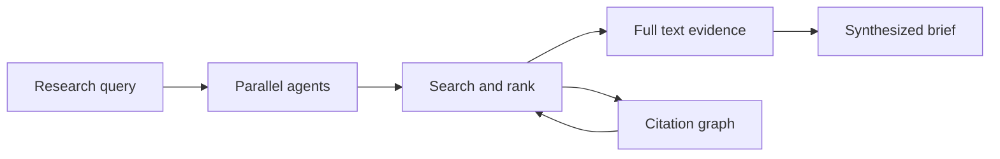
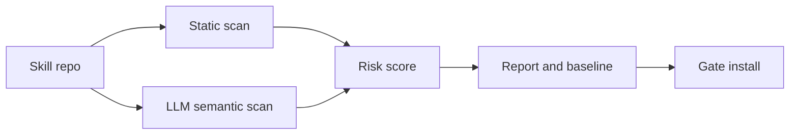
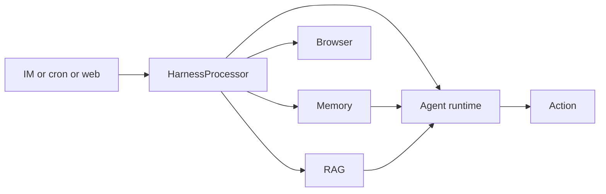
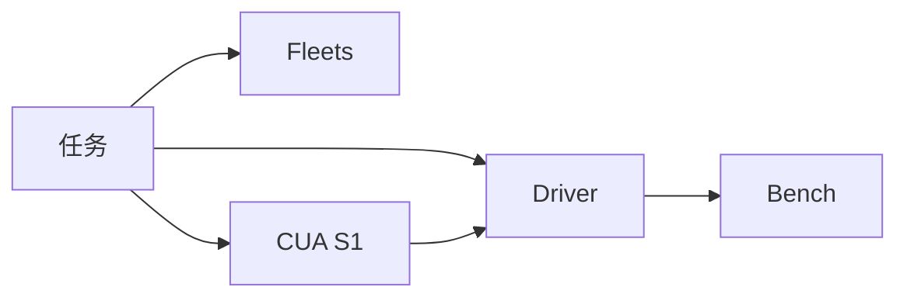
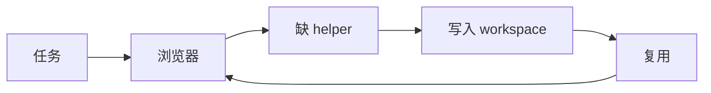
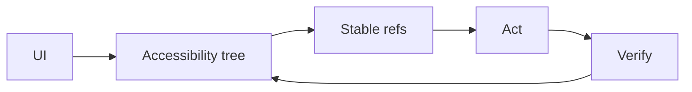
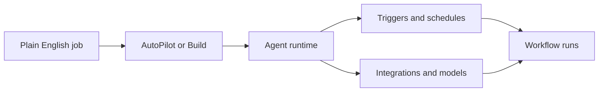
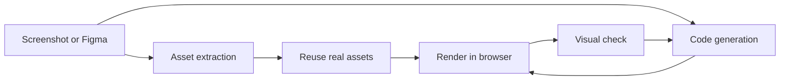
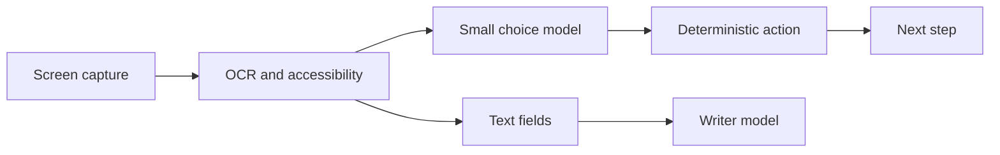

# Jarvis 日报 · 2026-09-20

候选 420 → 过滤后 90 → 入选 10。图例：⭐ 核心方向 · 🌐 全领域热点 · ✅ 已掌握前置 · 🔲 需补前置

## 🧰 项目 · 核心方向

### 1. ⭐ 🧰 Companion-Inc/feynman
[GitHub](https://github.com/Companion-Inc/feynman) ★9,718 (+1215 本月) · Trending monthly · tool · TypeScript

**一句话**：用多代理研究工作流做文献检索与综述，支持本地模型与技能安装。
**为什么值得你看**：适合做 LLM 研究/Agent 工具链对比

**核心架构**：这类工具的痛点不是“能不能问”，而是研究任务一旦切到检索、比对、追溯，单轮聊天就会丢证据、丢来源、丢上下文。传统做法把搜索、总结、排名拆成线性步骤，但每一步都要人手挑结果，失败点是中间证据链断掉。Feynman 的关键变化是把研究做成“多代理调查 + 可追溯排名 + 本地可运行”的一套循环式工作流：研究代理并行找材料，rank 再按 citation、method、reproducibility、provenance 给文献打分，paper/fetch-full-text 负责补足证据面，而技能安装让这些研究动作能落到本地环境。最直接的证据是它把 deepresearch、lit、rank、paper 分成不同命令，并支持 expand-citations、full-text-top、critique-top 这类增量证据开关，说明它不是只做摘要，而是在把“先看什么、凭什么看”程序化。新意主要在系统组织层，不是新模型。

- 作者报告 stars 9718，+1215 today
- 支持本地模型、skills 安装和可审计 rank
- 原文未明确自动评测或成功率上界
**精读价值**：值得看它怎么把 research agent 组织成可控工作流
**关联**：[[ReAct]]、[[SWE-bench]]
#agent #tool-use #research · 难度：中等 · 建议：值得通读 (20 min)
前置：🔲 [[multi-agent]] · 🔲 [[retrieval-augmented generation]] · 🔲 [[planning]] · 🔲 [[memory]]

打分理由：开源研究型 agent，方向高度匹配（core 8 / wide 7）

### 2. ⭐ 🧰 NVIDIA/SkillSpector
[GitHub](https://github.com/NVIDIA/SkillSpector) ★17,904 (+820 本周) · Trending weekly · tool · Python

**一句话**：用静态+语义分析扫描 agent skills，给 31,132 个样本判出 26.1% 漏洞率。
**为什么值得你看**：直接对应 prompt injection 与 agent 安全

**核心架构**：反直觉点在于：agent skills 看起来像“配置文件”，但实际执行时带着隐式信任，里面一条恶意指令就能把工具权限、输出和数据外传一起带偏。只做关键词过滤不够，因为很多风险藏在 Markdown 结构、shell 片段、MCP 工具调用和上下文语义里。SkillSpector 的核心改变是两阶段分析：先用静态规则、AST、taint、YARA、MCP least privilege 抓明显风险，再可选用 LLM 做语义评估补漏，并把结果压成风险分数、报告格式和 baseline，避免重复告警淹没新问题。最直接的支撑是它报告在 31,132-skill 子集里有 26.1% vulnerabilities、5.2% likely malicious intent，同时这次 2.11.2 专门修了参考计数和解析器边界，说明它在真实文档上跑得动但也很依赖解析稳健性。新意在系统组织层和实证层：不仅定义了扫描流程，也给出大规模技能安全画像。

- 作者报告 31,132 样本中 26.1% 有漏洞
- 两阶段分析，兼顾快扫与语义补漏
- 对文档解析和 baseline 质量很敏感
**为什么现在上榜**：v2.11.2，2026-09-10；此前 v2.11.0/2.11.1 也在 2026-08~09 连续迭代
**精读价值**：值得精读，尤其看它怎么做 agent 供应链安全
**关联**：[[CodeQL]]、[[Semgrep]]
#agent #security #prompt-injection · 难度：硬核 · 建议：值得通读 (20 min)
前置：🔲 [[prompt injection]] · 🔲 [[MCP]] · ◽ taint tracking · ◽ AST

打分理由：专测 agent skill 漏洞与注入风险，实用。（core 8 / wide 7）

### 3. ⭐ 🧰 TencentCloud/Octop
[GitHub](https://github.com/TencentCloud/Octop) ★4,369 (+3137 本月) · Trending monthly · tool · Python

**一句话**：用单进程多代理中台做自托管助手，覆盖 IM、RAG、浏览器和桌面。
**为什么值得你看**：贴近多智能体系统与私有化助手形态

**核心架构**：它解决的是“一个团队/家庭要共享助手，但又不想把聊天、知识库、权限、自动化拆成一堆外部服务”的痛点。很多方案的问题不在功能少，而在 surfaces 一多就变成队列、数据库、权限、记忆各自为政，状态难以恢复。Octop 的关键设计是把 Web、IM、cron 全部路由进一个 in-process HarnessProcessor，控制平面状态统一落在 SQLite 或 PostgreSQL，重启后靠数据库重建；上层再挂 harness-agent、harness-gateway、harness-memory、harness-browser，把 agent、消息桥、记忆、浏览器放到同一运行时里。检测条件到处理动作很清楚：消息从 Feishu/DingTalk/WeCom 进来或 cron 触发后，统一进入 processor，再分发到对应 agent/workspace/工具；需要外部知识时走 RAG，需要网页操作时走 browser，需要 IDE 交互时走 ACP。成熟度信号比较强：v1.0.1、Windows installer、桌面/便携版、OAuth SSO、验证码重置、PostgreSQL 知识库修复都在近期 release 里，说明不是概念演示。相较普通聊天壳，它差在“多用户 + 多代理 + 本地持久状态”的控制平面。

- 单进程控制平面，状态可由 DB 重建
- 支持 IM、cron、RAG、Browser、ACP
- 成熟度较高，但原文未明确自动化评测
**为什么现在上榜**：v1.0.1，2026-09-19；前一版 v1.0.0 在 2026-09-14
**精读价值**：如果你关心自托管 agent 系统，这个值得看
**关联**：[[ReAct]]、[[model context protocol]]
#agent #multi-agent #rag · 难度：中等 · 建议：值得通读 (20 min)
前置：🔲 [[multi-agent]] · 🔲 [[retrieval-augmented generation]] · 🔲 [[memory]] · 🔲 [[planning]]

打分理由：自托管多用户多智能体助手，贴近方向（core 7 / wide 6）

### 4. ⭐ 🧰 trycua/cua
[GitHub](https://github.com/trycua/cua) ★25,047 (+1012 今日) · Trending daily · infra · HTML

**一句话**：用 Cua Driver+Fleets 做 computer-use，作者报 stars 25047、日增 1012
**为什么值得你看**：适合看 agent/RAG 工程化与评测基建

**核心架构**：它解决的不是“让模型会点鼠标”，而是同一任务里要在代码、API、GUI 之间切换时，agent 一旦丢上下文就会卡死。传统做法把浏览器/桌面当成单一前端，失败点在于环境不可控、动作不可验证、跨 OS 复现差。Cua 的关键变化是把电脑本身产品化：Cua Driver 负责把桌面操作暴露给 agent，Fleets 提供可隔离的云桌面，CUA-S1 则把高频、窄决策下沉成专门的 System 1 模型，减少通用模型在表单/结构化界面上的自由生成失败。最直接的证据是它把训练、评测、数据生成和真实可用环境放在同一套栈里，并且 README 明确给了 cloud fleet、desktop driver、bench 三条路径；但原文未明确公开统一基准上的量化提升。新在系统组织层：不是单点工具，而是“环境+驱动+小模型+benchmark”的 computer-use 基础设施。

- 强证据是训练/评测/数据生成一体化
- 未见统一公开指标，效果边界要看 bench
- 复现难点在桌面权限与跨 OS 环境
**精读价值**：适合想做 computer-use/agent 基建的人看精读
**关联**：[[ReAct]]、[[model context protocol]]
#agent #benchmark #data-gen · 难度：中等 · 建议：值得通读 (20 min)
前置：◽ agent · 🔲 [[planning]] · 🔲 [[memory]] · 🔲 [[MCP]]

打分理由：computer-use 驱动含评测与数据生成（core 7 / wide 7）

### 5. ⭐ 🧰 browser-use/browser-harness
[GitHub](https://github.com/browser-use/browser-harness) ★17,855 (+86 今日) · Trending daily · infra · Python

**一句话**：用可改写的浏览器 harness 连接 LLM，251 tests 通过
**为什么值得你看**：适合看 web agent 如何把失败转成可复用技能

**核心架构**：它解决的是浏览器任务里“每次都差一个小 helper，导致 agent 反复卡在同一处”的悖论。纯 CDP 方案能连上浏览器，但一遇到上传、下载、站点特例，就只能靠提示词硬扛；而封死在固定技能库里，又学不到新站点。Browser Harness 的关键概念是“agent 在工作时自己补 helper”：核心不是把浏览器控制做得更全，而是把缺失能力写回本地 workspace，让后续任务复用。这样失败点从“当下任务必挂”变成“先补一次，后面都能过”。最直接的证据是 README 里明确展示了 helper 缺失→agent 生成→文件上传成功的闭环，并给出 251 个 unit tests、pip-audit 和 wheel/sdist 构建通过；但它主要证明工程闭环，不证明复杂站点上的泛化上限。新在系统组织层：把 browser control、skill 载入、代码生成拆成可进化的 harness，而不是单纯自动化脚本。

- 最强证据是自修复 helper 闭环
- 没证明大规模站点泛化，只证明工程可用
- 复现门槛在 Chrome 远程调试与技能注入
**为什么现在上榜**：v0.1.13，2026-09-04
**精读价值**：想看 web agent 工程化，值得通读安装与架构
**关联**：[[Playwright]]、[[ReAct]]
#agent #browser #eval · 难度：中等 · 建议：值得通读 (20 min)
前置：🔲 [[ReAct]] · 🔲 [[MCP]] · 🔲 [[prompt injection]] · ◽ browser automation

打分理由：自愈浏览器 harness，适合 agent 评测（core 7 / wide 6）

### 6. ⭐ 🧰 lahfir/agent-desktop
[GitHub](https://github.com/lahfir/agent-desktop) ★1,331 (+41 今日) · Trending daily · infra · Rust

**一句话**：用 accessibility tree 做桌面操作，58 命令名、54 个可执行命令
**为什么值得你看**：适合看桌面 agent 的稳态控制与可复现执行

**核心架构**：它针对的是桌面 agent 常见的反直觉问题：看起来像“点对了”，实际却因为像素噪声、焦点漂移、误触系统快捷键而把状态弄乱。只靠截图/像素定位，dense app 里元素一多就会失去稳定引用，重试也不安全。agent-desktop 的关键变化是把观察和执行都建立在 OS accessibility tree 上，生成稳定 ref，再用 ref 驱动动作；progressive skeleton traversal 则先给浅层结构，只有命中目标分支才下钻，阻断 dense UI 下 token 爆炸。最直接的证据是它明确报告了 78–96% 的 token reduction，并给出 headless-by-default、structured JSON、trace export、C-ABI FFI 和 CDP interop；但这些是系统能力证据，不是任务成功率。新在组件层和系统层都有：ref 设计解决可重试性，progressive traversal 解决上下文预算，FFI/CDP 让它能嵌进多语言 agent。

- 强证据是 78–96% token 降幅
- 没公开统一 agent 成功率
- 复现需 accessibility、屏录、automation 权限
**为什么现在上榜**：v0.9.2，2026-09-17
**精读价值**：如果你关心桌面 agent，可精读架构与 refs 设计
**关联**：[[accessibility tree]]、[[Playwright]]
#agent #ui #automation · 难度：硬核 · 建议：建议精读
前置：◽ agent · 🔲 [[planning]] · 🔲 [[memory]] · 🔲 [[long context]]

打分理由：桌面可执行agent，OS可观测+安全重试（core 7 / wide 5）

## 🌐 全领域热点

### 7. 🌐 🧰 Significant-Gravitas/AutoGPT
[GitHub](https://github.com/Significant-Gravitas/AutoGPT) ★187,463 (+30 今日) · Trending daily · tool · Python

**一句话**：用可视化编排+触发器跑 LLM agents，覆盖45+平台；云端托管与自托管同仓。
**为什么值得你看**：做 agent/RAG 的人可看它的运行时组织方式

**核心架构**：它解决的不是“再做一个聊天机器人”，而是把“描述一个结果”落到可持续跑的工作流上：纯 prompt 方案一到多步就会卡在工具接入、权限、定时触发和状态维护。AutoGPT 的关键变化是把 agent 运行拆成一个可托管的循环中间件：AutoPilot 把自然语言直接转成 agent，Build 允许拖拽/分支/检查每一步，Marketplace 复用现成 agent，触发器让同一 agent 既能按需跑也能按计划跑。组件之间的因果关系是：编排层阻断“单轮对话无法落地执行”，连接器层阻断“工具生态碎片化”，托管层阻断“用户自己维护模型、凭据和可靠性”的摩擦。最直接的支持是 README 明确给出 45+ 平台、hundreds of models、on demand/on schedules/from triggers 的运行方式，并且把 hosted 与 self-host 的能力边界写清。新意主要在系统组织层，而不是某个新模型。

- 证据强：同仓同时给托管与自托管路径
- 没证明 agent 可靠完成复杂任务；更像平台
- 复现难点在权限、连接器和运行时而非代码量
**为什么现在上榜**：2026-09-19 发布 autogpt-platform-beta-v0.8.0，且有自托管破坏性升级说明。
**精读价值**：适合看平台架构，不适合当算法论文精读。
**关联**：[[ReAct]]、[[LangChain]]
#agent #orchestration #llm · 难度：中等 · 建议：值得通读 (20 min)
前置：🔲 [[planning]] · 🔲 [[memory]] · 🔲 [[model context protocol]] · 🔲 [[ReAct]]

打分理由：历史级 agent 热点，但当前价值偏复用（core 2 / wide 10）

### 8. 🌐 🧰 abi/screenshot-to-code
[GitHub](https://github.com/abi/screenshot-to-code) ★79,401 (+5264 本月) · Trending monthly · tool · Python

**一句话**：把截图/Figma/录屏转成 HTML、React、Vue 代码；支持视频模式。
**为什么值得你看**：偏 VLM+前端生成，面试很容易聊到

**核心架构**：它解决的是“看得懂界面但写不出同等布局”的落差：单模型直接生成页面，容易丢 logo、背景、层级和交互状态。这个项目的关键做法是把问题拆成代码生成外加资产复用与视觉自检：Gemini 负责从截图里抽取真实图片/图标，Replicate 负责图像编辑、背景去除和生成，前端用 React/Vite 交互，后端用 FastAPI 串起多模型选择；可选的 screenshot preview 让生成结果再进无头浏览器检查。它阻断的失败模式分别是：资产抽取避免“重画成假元素”，多模型切换避免“单模型质量不稳”，浏览器预览避免“代码能跑但长得不对”。最直接的证据是 README 明写 Gemini 用于 asset extraction、video mode 必需，且 preview 可在 Chromium 可用时自动启用。新意主要在系统组织层：不是一个新 VLM，而是面向 UI 复刻的多模型编排。

- 强证据：资产抽取、预览、自带多模型路由
- 没证明通用前端工程正确性，只是 UI 复刻
- 复现中等，依赖多家 API 和 Chromium
**为什么现在上榜**：stars 今日 +5264，且 README 明确给出 hosted app 和视频模式。
**精读价值**：值得看它怎么把 VLM 变成可用的 UI 生成流水线。
**关联**：[[Pix2Code]]、[[DALL·E]]
#vlm #conversion #ui · 难度：中等 · 建议：值得通读 (20 min)
前置：🔲 [[VLM]] · 🔲 [[diffusion model]] · 🔲 [[vision transformer]] · 🔲 [[self-attention]]

打分理由：从截图生成代码，热度高但偏应用（core 2 / wide 7）

### 9. 🌐 🧰 awlevin/typesafe-computer-use
[GitHub](https://github.com/awlevin/typesafe-computer-use) ★588 · tool · Python

**一句话**：用 OCR + 小分类器驱动 Mac，单步约 $0.0002，比大模型电脑使用便宜155倍。
**为什么值得你看**：适合看 computer-use 里的低成本推理与状态设计

**核心架构**：它针对的是一个反直觉悖论：电脑使用里，大模型最贵的往往不是“思考”，而是每一步都把整张截图发给模型去做选择。这个项目的关键改变是把一步决策拆成确定性感知和小范围分类：先用 screencapture、OCR 和 accessibility tree 把屏幕读成结构化项，再用 TypeSafe 在固定动作集合里做 Choice，只有文本输入才调用写入模型。组件各自阻断的失败是：OCR 压缩视觉输入成本，accessibility 阻断“看见按钮却点不中”，Choice 分类器阻断“每步都要大模型规划”，置信度门控阻断低把握动作继续扩散。最直接的证据是作者把同屏同任务对比写成表格：单步成本 $0.0002，对照 Claude Opus 5 的 $0.032，端到端一步约 1.5s，对照约 5.5s。新意在运行时组织层，且把 frontier model 的隐式推理拆成显式状态。

- 作者报告：单步成本0.0002美元，155倍更便宜
- 只覆盖固定动作集合；开放式推理会崩
- 复现依赖 macOS 辅助功能与屏幕录制权限
**精读价值**：如果你关心 agent 成本，这条值得精读。
**关联**：[[ReAct]]、[[SWE-bench]]
#agent #computer-use #inference · 难度：硬核 · 建议：建议精读
前置：◽ computer-use · ◽ OCR · 🔲 [[planning]] · ◽ confidence

打分理由：Computer-use自动化，类型安全+低成本执行很实用（core 7 / wide 7）

### 10. 🌐 🧰 LynnReal-AI/LynnReal-Omni
[GitHub](https://github.com/LynnReal-AI/LynnReal-Omni) ★204 · model · Python

**一句话**：LynnReal-Omni brings text-to-video, image-to-video, human- and hand-pose guided generation, structural control, omni-reference generation, style transfer, video
**为什么值得你看**：（dry-run：未调用 LLM，配置 OPENAI_API_KEY 后会生成中文速览）
#video #multimodal #generation · 难度：中等 · 建议：看速览即可
打分理由：长视频/编辑一体化框架，覆盖面广可研究（core 6 / wide 7）

---
想精读哪一篇？在 Claude 里说：`精读 2026-09-20 第 N 条`，Jarvis 会按你的 known.md 只讲你不会的部分。