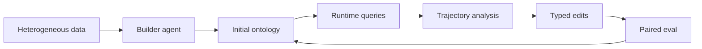
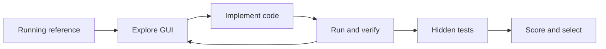
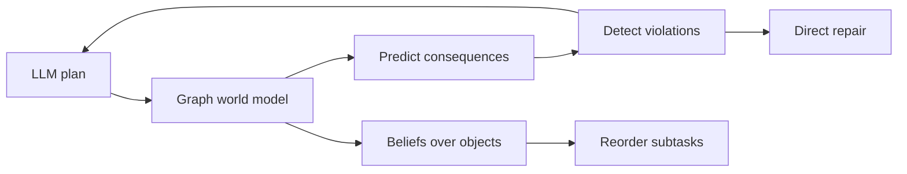
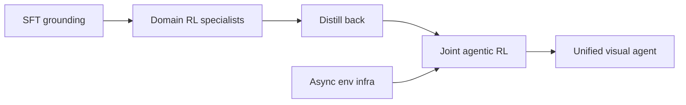
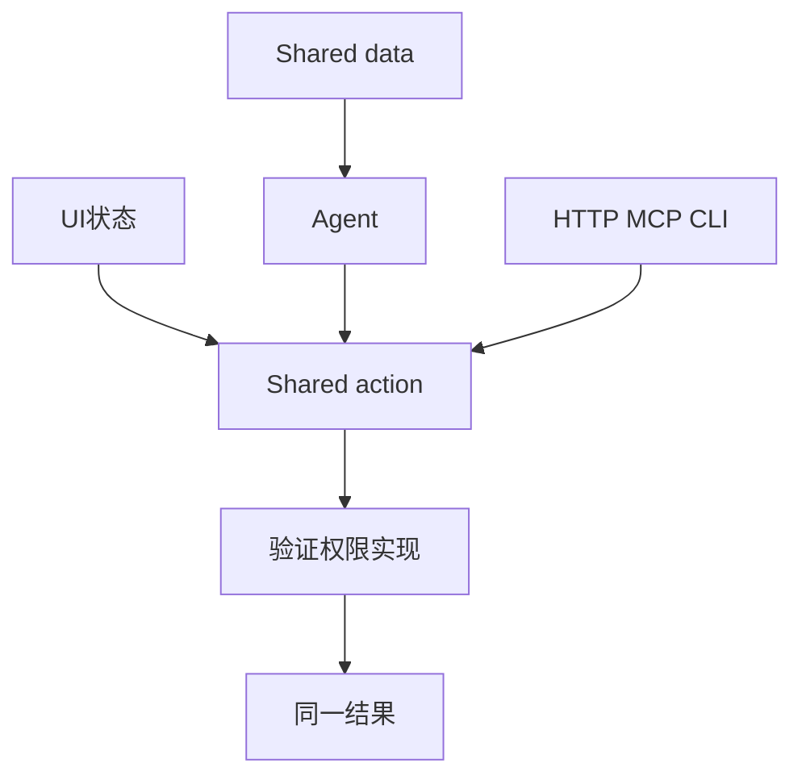
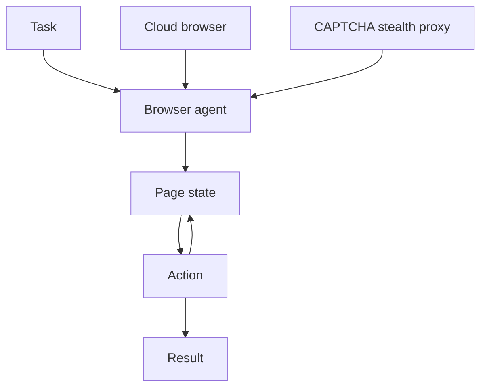
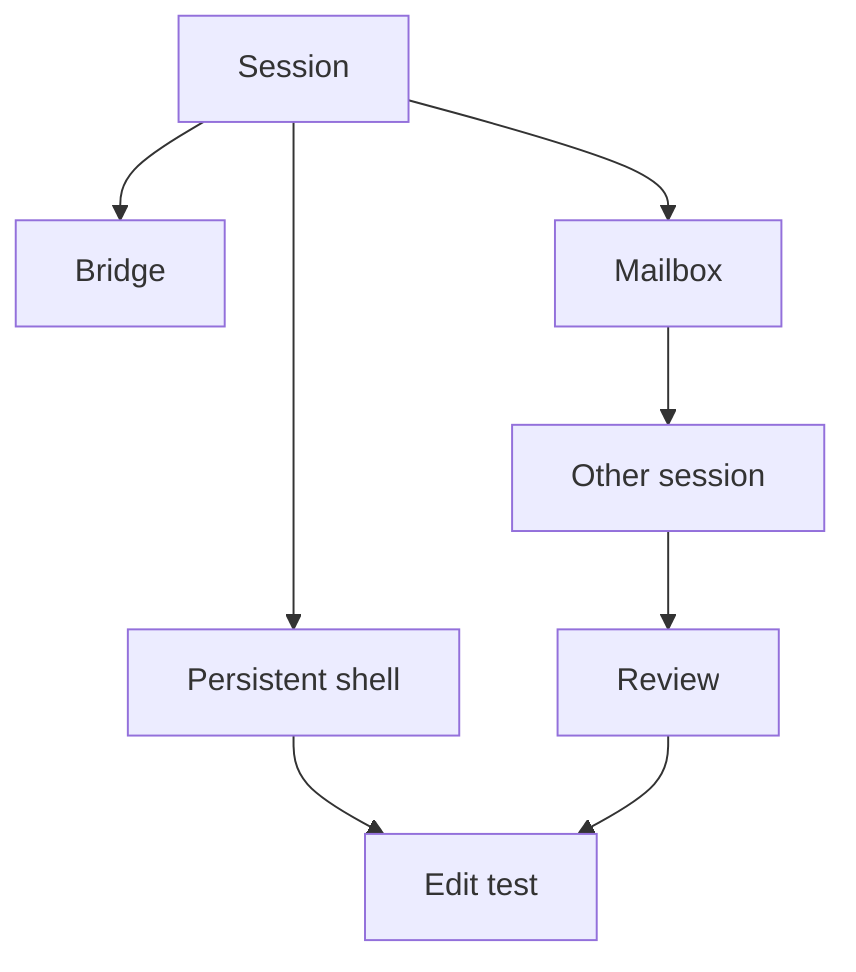
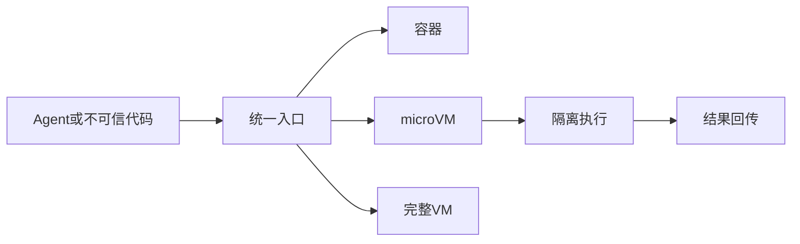

# Jarvis 日报 · 2026-09-21

候选 451 → 过滤后 116 → 入选 18。图例：⭐ 核心方向 · 🌐 全领域热点 · ✅ 已掌握前置 · 🔲 需补前置

## 📄 论文 · 核心方向

### 1. ⭐ 📄 Grounded Skill Synthesis from Code at Scale for Agentic Intelligence
arXiv [2609.05571](https://arxiv.org/abs/2609.05571) · HF 🔥 85 · Yongqi Tong, Pan Wang, Hang Wang 等 · [PDF](https://arxiv.org/pdf/2609.05571) · [代码](https://github.com/ant-intl/Code2Skill) ★27

**一句话**：Code2Skill 用 1,9769 个仓库抽技能，建成 100.7 万条可检验证据库
**为什么值得你看**：适合看 agent harness 怎么做成可复用基础设施

**核心架构**：反直觉点在于：agent 还没积累足够交互经验时，就已经需要可复用的 procedural knowledge；但 trajectory-based 技能依赖特定环境，文档式技能又缺少可执行证据，换环境就容易失真。Code2Skill 的关键改变是把 code 当成技能底座：先从代码单元抽出 atomic operation、composite workflow、recurring pattern，再给每条技能补上 applicability、invariant、failure case 和 provenance，最后用 source-body-blind reconstruction 验证“只看技能能不能重建实现”，再用 source-aware comparison 过滤掉不受原代码支持的记录。最直接的证据是作者报告：在 72 个 protocol-matched 评测里，挂接 CodeSkillBank 的模型平均提升 11.7%，并且在统一接口下，7 个共享 benchmark 上都超过轨迹派技能库。新意主要在组件层 + 系统组织层：不是再做一个 skill bank，而是把“可执行源码→可验证技能→可检索资产”串成闭环。

- 最强证据：72 组匹配评测，平均 +11.7%
- 没证明：跨代码风格/框架的泛化边界
- 复现难点：全自动抽取与验证链路长
**精读价值**：值得精读，核心在可验证技能抽取范式
**关联**：[[Trace2Skill]]、[[SkillRL-Bank]]
#agent #skills #code2skill #verification · 难度：硬核 · 建议：建议精读
前置：◽ agent harness · 🔲 [[memory]] · 🔲 [[planning]] · ◽ verification


<sub>打分理由：把代码单元转可迁移技能，agent能力扩展关键（core 9 / wide 6）</sub>

### 2. ⭐ 📄 CodeMidas: Scaling Agentic Coding RL Environments from Code Itself
arXiv [2609.22068](https://arxiv.org/abs/2609.22068) · HF 🔥 84 · Bowen Ye, Lei Li, Shicheng Li 等 · [PDF](https://arxiv.org/pdf/2609.22068)

**一句话**：CodeMidas 从代码本身造 RL 环境，构建 5,545 个训练任务
**为什么值得你看**：适合看 coding RL 的数据来源怎么扩容

**核心架构**：反直觉点在于：做 coding RL 最缺的不是模型，而是“有可靠 verifier 的任务”；只靠 issues、commits 或文档，覆盖面会被开发记录绑死。CodeMidas 的关键改变是直接把已实现功能当任务种子：先让 agents 读代码抽出行为规格，再把原仓库改造成待实现的开发起点，用原代码执行结果来构造测试，最后用 adversarial rollouts、solution review 和 rollout success rate 过滤能被钻空子的环境。作者报告的最直接证据是：用这 5,545 个任务训练 MiMo-V2.5 后，DeepSWE 提升 11.7%，ProgramBench 从 4.5 到 21.5，Terminal-Bench v2.1 从 63.7% 到 72.2%。新意主要在系统组织层：不是单纯做任务生成，而是把“任务说明、起点代码、测试、过滤”做成可规模化的 RL 环境生产线。

- 最强证据：5,545 任务训练后多基准全涨
- 没证明：对非代码任务是否同样有效
- 复现难点：环境构造与过滤环节都重
**精读价值**：值得看，重点是代码驱动 RL 环境构造
**关联**：[[SWE-bench]]、[[R2E-Gym]]
#agent #rl #environment #coding · 难度：硬核 · 建议：值得通读 (20 min)
前置：🔲 [[GRPO]] · 🔲 [[reward model]] · ◽ verification · 🔲 [[SWE-bench]]


<sub>打分理由：用源代码生成RL环境，适合训练/评测管线（core 8 / wide 6）</sub>

### 3. ⭐ 📄 EvoOntology: A Self-Evolving Ontology Layer for Data Agents
arXiv [2609.15779](https://arxiv.org/abs/2609.15779) · HF 🔥 68 · Meiduo Chong, Shaolei Zhang, Ju Fan 等 · [PDF](https://arxiv.org/pdf/2609.15779) · [代码](https://github.com/ruc-datalab/EvoOntology) ★245

**一句话**：EvoOntology 把数据 ontology 做成 MCP 层，让 agent 运行时自我演化
**为什么值得你看**：适合看 data agent 的中间层怎么设计

**核心架构**：反直觉点在于：数据 agent 真正卡住的不是不会用工具，而是面对表、文件、数据库时只知道“列名/路径”，不知道概念该落到哪一层；直接把原始数据摊给模型会陷入盲搜，把手工语义层塞进 prompt 又撑爆 context。EvoOntology 的关键改变是把 ontology 做成可交互的 MCP server：schema layer 负责定义对象类型和引用规则，content layer 存领域知识与映射，tool layer 让 agent 运行时查询和修改；再用 builder agent 先建初版 ontology，之后根据交互轨迹做 attribution-guided typed edits，并且只在 backbone-conditional paired evaluation 通过后接受更新。最直接的证据是作者报告：在 3 个 data-agent benchmark、4 个 backbone 上都稳定优于强基线和手工 semantic layer。新意在系统组织层：不是静态知识注入，而是“可调用、可更新、可验证”的中间 ontology。

- 最强证据：3 个 benchmark、4 个 backbone 稳定提升
- 没证明：ontology 演化成本与收敛边界
- 复现难点：MCP 层和评测闭环都较重
**精读价值**：值得精读，核心是 agent-data 中间层重构
**关联**：[[dbt]]、[[OWL]]
#rag #data-agents #mcp #ontology · 难度：硬核 · 建议：建议精读
前置：🔲 [[retrieval-augmented generation]] · 🔲 [[MCP]] · 🔲 [[memory]] · 🔲 [[planning]]


<sub>打分理由：自演化本体层解决数据代理agent-data gap（core 8 / wide 7）</sub>

### 4. ⭐ 📄 RecreationWorld: Scalable and Verifiable Environments for Hybrid Computer-Use Agents
arXiv [2609.22000](https://arxiv.org/abs/2609.22000) · HF 🔥 60 · Shuai Bai, Jiayong Deng, Yikun Fu 等 · [PDF](https://arxiv.org/pdf/2609.22000) · [代码](https://github.com/QwenLM/RecreationWorld) ★32

**一句话**：RecreationWorld 用五平台复刻任务训 hybrid CUA，58.1% 领先
**为什么值得你看**：适合做 agent/评测/训练方向面试谈资

**核心架构**：反直觉点在于：真正的 computer-use 不是“先看 GUI 再写代码”的串联，而是边试界面、边实现、边运行验证；单做 GUI 只能见表层，单做 terminal 又看不见 UI 结果，都会卡在长时序修正。RecreationWorld 的关键变化是把“复刻一个运行中的 reference”变成统一任务：reference 既是行为规格，也是隐藏测试的 oracle。这样，GUI exploration 负责发现交互规律，coding tools 负责构造实现，native GUI control + programmatic/visual assertions 负责把失败定位到可修的动作或代码；组件的作用不是拼功能，而是阻断“无法自动验收”和“无法跨平台迁移”两类失败。最直接的证据是作者报告：训练在这套轨迹上后，模型在五个 OOD coding / hybrid benchmarks 都有提升，并且更常主动验证自己渲染出来的结果；在 RecreationBench 上，GPT-6 Astra 虽然总体 58.1%，但全程序测试全过只在 2.8% 任务，说明静态界面像了不代表行为像。新意主要在系统组织层：把可执行 reference、跨五平台环境、统一 harness、冻结后的自动评分串成可规模化训练与评测闭环。

- 最强证据：58.1% 总分但仅 2.8% 全测例通过
- 没证明通用性边界：任务偏复刻，不等于任意开发
- 复现难点在五平台环境与冻结测试生成
**为什么现在上榜**：原文未明确
**精读价值**：值得精读，尤其看它怎么把可验证训练做成闭环
**关联**：[[SWE-bench]]、[[ReAct]]
#agent #computer-use #verification #benchmark · 难度：硬核 · 建议：建议精读
前置：◽ computer-use agents · ◽ verification · ◽ GUI control · ◽ replay


<sub>打分理由：混合图形+代码的可验证环境，CUA训练很对口（core 8 / wide 6）</sub>

### 5. ⭐ 📄 GAVEL: Graph World Models for Verified and Efficient Long-Horizon LLM Task Planning
arXiv [2609.19315](https://arxiv.org/abs/2609.19315) · HF 🔥 2 · Ruiyang Wang, Hao-Lun Hsu, Swarajh Mehta 等 · [PDF](https://arxiv.org/pdf/2609.19315)

**一句话**：GAVEL 用图世界模型验修长程规划，Qwen3-8B 成功率到 91.8%
**为什么值得你看**：很适合讲 embodied planning 和 verification 思路

**核心架构**：悖论是：LLM 生成的长程机器人计划常常不是“想得不够好”，而是执行前就已经违反了前提；但把所有错误都扔回 LLM 重写，又贵又可能引入新错。GAVEL 的关键变化是把 graph world model 当成可执行的中间层：图里显式保存 object relations、action preconditions/effects，以及对未观测物体位置的 probabilistic beliefs；它先在图上前推动作，能直接从模型语义推出的失败就本地修补，只有需要语义判断的失败才回给 LLM。这样组件阻断的是“无效动作直接落地”和“本可确定修复却浪费 LLM 调用”两种失败。最直接的证据是作者报告：在 BEHAVIOR-1K 上，Qwen3-8B 单任务成功率从 41.2% 到 91.8%，多任务从 19.9% 到 92.6%；而 belief 推理还把 travel distance 降了约 5.4%，说明它不仅更准，也更省搜索。新意主要在组件层加系统层：图不再只是 verifier，而是带不确定性、可修复、可重排任务顺序的 world model。

- 最强证据：41.2%→91.8%，19.9%→92.6%
- 没证明泛化到更开放物理世界
- 图修复只覆盖语义可推出的错误
**精读价值**：值得精读，核心是把 verifier 升成 world model
**关联**：[[SayPlan]]、[[EPoG]]
#agent #planning #verification · 难度：硬核 · 建议：建议精读
前置：🔲 [[planning]] · ◽ world model · ◽ partial observability · 🔲 [[graph RAG]]


<sub>打分理由：图世界模型验证/修复长时规划，面试友好。（core 8 / wide 6）</sub>

### 6. ⭐ 📄 MintAct: A Unified Visual Agent for Digital Environments
arXiv [2609.22083](https://arxiv.org/abs/2609.22083) · HF 🔥 12 · Mingfei Gao, Rui Tian, Haiming Gang 等 · [PDF](https://arxiv.org/pdf/2609.22083)

**一句话**：MintAct 统一三类数字代理，8B 在 OSWorld-Verified 得 48.9
**为什么值得你看**：适合看统一式 visual agent 和 RL 基建怎么做

**核心架构**：反直觉点在于：UI grounding、mobile/web/desktop navigation、visual tool use 看似都是“看屏幕做事”，但各自动作空间、环境后端和数据来源不同，硬混会互相污染。MintAct 的关键变化不是堆更多数据，而是用分阶段训练把能力拆开补齐：先用 grounding 和 multi-step SFT 打底，再用 per-domain RL specialist 训练后蒸馏回单模型，最后做 joint agentic RL；承重的是异步 RL 基建，它显式控制跨域采样分布，并在 noisy 环境反馈和 off-policy drift 下保持稳定。检测条件是环境回报和轨迹，处理动作是按域调配 rollout、再蒸馏和联合优化，阻断的是“某个域太快导致训练分布塌缩”和“单模型一混就掉专精”这两类失败。最直接的证据是作者报告：MintAct-8B 在 OSWorld-Verified 48.9、Online-Mind2Web 39.1、AndroidWorld 67.0，且在 grounding、mobile、desktop、web、visual tool use 上能匹配或超过同尺寸 specialist。新意主要在系统组织层：把统一能力、异步 RL、跨域环境编排一起做成训练系统。

- 最强证据：8B 同时拿到 48.9/39.1/67.0
- 没证明极低算力或端侧真实部署表现
- 难点在异步 RL 与跨域分布控制
**为什么现在上榜**：原文未明确
**精读价值**：值得看系统训练方案，论文本身偏工程整合
**关联**：[[UI-TARS]]、[[OpenCUA]]
#vision-agent #ui-grounding #rl #vlm · 难度：中等 · 建议：值得通读 (20 min)
前置：🔲 [[VLM]] · ◽ reinforcement learning · ◽ UI grounding · ◽ multi-step navigation


<sub>打分理由：统一视觉智能体与UI导航，训练基础设施很强（core 7 / wide 7）</sub>

### 7. ⭐ 📄 When AI Reviews Train AI Reviewers: Scientific-Judgment Collapse and Mitigation
arXiv [2609.20942](https://arxiv.org/abs/2609.20942) · HF 🔥 5 · Sy-Tuyen Ho, Minghui Liu, Furong Huang · [PDF](https://arxiv.org/pdf/2609.20942)

**一句话**：用合成 review 训练 reviewer 导致评分收缩，TrustReviewer 把失真率压到更稳
**为什么值得你看**：LLM 评审递归污染，适合做 alignment/评测面试谈资

**核心架构**：反直觉点在于：你以为让 LLM 学更多 peer review 会更像“平均审稿人”，但作者发现它会把评分分布压窄、语义判断变单调，越多 synthetic review 越像同一口径。现有做法的问题是把模型生成的判断直接混进后续训练，等于把上一代的偏差当监督信号继续放大。作者的关键改法是把失败拆成两层：训练时用 curated corpus 先阻断低质量、语义退化监督进入 core reviewer；测试时再用 paired activation steering，在不再训练、也不加专家标注的情况下把残余的“收缩倾向”往外拉。最直接的证据是 controlled recursive training：从 0% 到 100% synthetic exposure，同 paper 与 corpus-level semantic diversity 单调下降，作者报告分别约降 11% 和 5%。新意主要在系统组织层：不是做一个更强 reviewer，而是把递归污染当成 feedback loop 问题来切断。

- synthetic review 越多，评分越收缩
- 只测一轮递归，未证多代是否累积
- 需复现 reviewer 训练与 steering 细节
**精读价值**：值得看，能补齐 AI 审稿递归风险这一块
**关联**：[[model collapse]]、[[activation steering]]
#rlhf #evaluation #alignment · 难度：中等 · 建议：值得通读 (20 min)
前置：🔲 [[reward model]] · 🔲 [[alignment]] · ◽ activation steering · 🔲 [[supervised fine-tuning]]

```mermaid
graph TD
A 官方 reviews
B 合成 reviews
C 训练 reviewer
D 评分分布变窄
E curated corpus
F activation steering
G 语义多样性回升
A --> C
B --> C
C --> D
E --> C
D --> F
F --> G
```
<sub>打分理由：AI 评审递归崩塌，直接影响后训练与数据安全。（core 7 / wide 6）</sub>

### 8. ⭐ 📄 APort Vault: Benchmarking AI Agent Payment Authorization with the Open Agent Passport
arXiv [2609.22076](https://arxiv.org/abs/2609.22076) · HF 🔥 2 · Uchi Uchibeke · [PDF](https://arxiv.org/pdf/2609.22076) · [代码](https://github.com/aporthq/aport-agent-guardrails) ★25

**一句话**：用 OAP 守住 agent 付款边界，69,297 次里 0 次越权转账
**为什么值得你看**：agent 安全/工具调用面试很对口，能讲清边界防护

**核心架构**：反直觉点在于：很多 agent benchmark 只看模型会不会“想转账”，但真正的风险是模型已经发出了 tool call，最后有没有人把它拦下来。单看模型拒绝率会漏掉这一层。作者把关键概念改成“authorization boundary”：在模型与支付工具之间插入 deterministic pre-action check，实现 Open Agent Passport 规范；这样失败不再靠模型自己克制，而是由边界层硬截断。实验上最直接的是 replay 4,371 个真人 CTF 攻击，14 个模型、5 个 policy level、2 条 replay track、共 225,964 次评估；在 Levels 2–4，模型单独时出现 140/76,842 次对未授权收款人转账，而加了 OAP 层后是 0/69,297。新意在系统组织层：它不是新模型，而是把“工具执行前检查”做成可测、可复现的安全层。

- 核心证据是未授权转账 0 次
- 未证明对代码执行/数据外泄同样有效
- 复现依赖工具边界与策略实现
**精读价值**：值得精读，能直接讲 agent 安全边界
**关联**：[[AgentDojo]]、[[InjecAgent]]
#agent #security #benchmark · 难度：中等 · 建议：值得通读 (20 min)
前置：🔲 [[prompt injection]] · 🔲 [[tool use]] · 🔲 [[multi-agent]] · ◽ policy engine

```mermaid
graph TD
A 攻击输入
B agent 生成付款请求
C OAP 检查
D 支付工具
E 未授权转账
A --> B
B --> C
C -->|deny| E
C -->|allow| D
D --> E
```
<sub>打分理由：支付授权攻防评测，Agent 安全基准价值高。（core 7 / wide 5）</sub>

## 🧰 项目 · 核心方向

### 9. ⭐ 🧰 mksglu/context-mode
[GitHub](https://github.com/mksglu/context-mode) ★23,869 (+1242 本周) · Trending weekly · infra · TypeScript

**一句话**：用 MCP 路由和沙箱压住上下文膨胀，工具输出少 98%
**为什么值得你看**：agent 工程很实用，面试能讲 context management

**核心架构**：它解决的是 coding agent 的真实痛点：工具一多，原始输出直接灌进上下文，几轮后 token 被日志、snapshot、重复解释吃光，模型还会在压缩时忘掉已做了什么。Context Mode 的承重组件是一个 MCP server，核心取舍是“不要把数据塞回上下文，而是把数据留在外部并索引”。运行时机制是：当工具输出、文件扫描或检索请求出现时，先走 sandbox tools 把大块原始内容挡在 context 外；会话状态写入 SQLite，再经 FTS5/BM25 按需检索；需要大量计算时让模型写脚本，由 ctx_execute 只回传结果；同时 hooks/MCP routing 约束 17 个平台走同一路由。成熟度信号较强：有 23k+ stars、明确 release、doctor/upgrade/insight 等命令、文档写了自动路由与诊断。和同类相比，它不是单纯压缩 prompt，而是同时管“数据去哪”和“状态怎么续”。

- 作者报告 315 KB 变 5.4 KB
- 主要依赖 MCP hooks 与 SQLite 索引
- 不解决模型推理，只解决上下文路由
**为什么现在上榜**：最近 release：v1.0.169（2026-06-29）
**精读价值**：值得看项目成熟度，偏 agent 基础设施
**关联**：[[MCP]]、[[vLLM]]
#agent #context #mcp · 难度：中等 · 建议：值得通读 (20 min)
前置：🔲 [[model context protocol]] · 🔲 [[retrieval-augmented generation]] · 🔲 [[memory]] · ◽ tools

```mermaid
graph TD
A 工具输出
B 沙箱
C SQLite
D FTS5 检索
E 模型回答
F 路由 hooks
A --> B
B --> C
C --> D
D --> E
F --> B
```
<sub>打分理由：上下文优化+记忆与路由，Agent落地相关。（core 8 / wide 7）</sub>

### 10. ⭐ 🧰 BuilderIO/agent-native
[GitHub](https://github.com/BuilderIO/agent-native) ★5,806 (+607 今日) · Trending daily · tool · TypeScript

**一句话**：用共享 action + UI 做 agent app，统一工具/状态/权限
**为什么值得你看**：Agent/RAG 面试常问的 agent app 架构

**核心架构**：反直觉点在于：agent 真正卡住的不是“会不会调用工具”，而是工具、UI、权限三套入口各写一遍后，很快出现行为分叉。现有做法通常把 agent 当成纯后端，把前端当成展示层，结果 agent 看不到用户正在看的上下文，UI 也无法复用同一套校验。Agent-Native 的关键改变是把能力抽成 shared action：同一个 action 既能被 agent 当工具调用，也能被 UI、HTTP、MCP、A2A、CLI 直接调用；shared data 和 shared application state 则把页面选择、当前记录等 UI 状态送进 agent，阻断“agent 和人看的是两份世界”这个失败模式。最直接的证据是它的示例里，`hello` 一份定义同时服务 React、agent 和 HTTP/MCP；README 还明确列出 auth、skills、memory、automations、agent teams、PostgreSQL，说明它不是单工具库，而是围绕共享动作组织的应用框架。新意主要在系统组织层：把 agent app 从“模型后端 + 前端壳”改成“同一动作层驱动所有表面”。

- 示例证明统一 action 层是真实可用的
- 未见基准或大规模负载证据
- TypeScript 生态里更易接入现有 Web 栈
**精读价值**：适合看框架思路，精读 docs 看 action/state 设计
**关联**：[[MCP]]、[[LangGraph]]
#agent #framework #inference · 难度：中等 · 建议：值得通读 (20 min)
前置：🔲 [[ReAct]] · 🔲 [[planning]] · 🔲 [[memory]] · 🔲 [[model context protocol]]


<sub>打分理由：Agent 应用框架，工程可迁移，质量高。（core 8 / wide 8）</sub>

### 11. ⭐ 🧰 browser-use/browser-use
[GitHub](https://github.com/browser-use/browser-use) ★115,758 (+253 今日) · Trending daily · tool · Python

**一句话**：用浏览器原生交互做 agent，支持本地或云端浏览器
**为什么值得你看**：做 web agent、browser automation 面试很对口

**核心架构**：反直觉点在于：浏览器任务难的不只是“点按钮”，而是页面状态、登录、验证码、跨站跳转都在和模型的文本推理脱钩。常见封装只给模型 DOM 文本，结果一遇到动态页面、权限和人类式交互就崩。Browser Use 的关键设计是把浏览器本身变成 agent 的执行环境：agent 通过结构化浏览器动作读写页面，可接本地或云端浏览器，并把 CAPTCHA、stealth、proxies、录制等运行时能力放进同一套栈里，阻断“模型知道任务但拿不到真实页面反馈”的失败。最直接的证据是它给出明确的三条路径：Cloud、CLI、Python library；README 还写了 BU2 这种面向 browser automation 的模型和 BU Bench V2，说明它把浏览器 agent 当成可评测、可托管的系统。新意主要在系统组织层与实证层：不只是封装工具，而是围绕浏览器执行环境、托管和 benchmark 形成完整闭环。

- Cloud/CLI/Library 三种部署形态清晰
- 验证矩阵覆盖 MCP、跨平台 wheel、漏洞审计
- 未见公开核心成功率数字，更多是工程成熟度
**为什么现在上榜**：2026-09-04 有 0.13.10 release；2026-09-21 仍在持续发布相关包
**精读价值**：适合看 browser agent 工程栈，不必为方法论深挖太久
**关联**：[[Playwright]]、[[AutoGPT]]
#agent #browser #tool-use · 难度：中等 · 建议：值得通读 (20 min)
前置：🔲 [[ReAct]] · 🔲 [[planning]] · 🔲 [[prompt injection]] · 🔲 [[model context protocol]]


<sub>打分理由：浏览器智能体，通用性强且热门。（core 8 / wide 9）</sub>

### 12. ⭐ 🧰 qiz029/dscode
[GitHub](https://github.com/qiz029/dscode) ★201 · infra · JavaScript

**一句话**：给 coding agent 做持久 shell 和跨会话协作的 harness
**为什么值得你看**：coding agent / harness / 评测面试很容易聊到

**核心架构**：反直觉点在于：coding agent 最容易坏的地方不是写代码，而是会话一旦分裂，cwd、环境、测试结果和审批就各自漂移。很多 agent harness 只是把“跑一次 shell”包装成工具，导致续写、接力、复审都要靠人工重建上下文。DSCODE 的关键改变是把 session 当成一等运行时：persistent shell 负责保住 cwd、环境和后台任务；session bridge 让 TUI、CLI 和脚本共享同一 session runtime；agent-to-agent tasks 和 mailbox 让不同 session 能明确地 queue、steer 或 defer；独立 reviewer 则把审批从主 agent 中拆出去，阻断“自己给自己放行”的失败模式。最直接的证据是 0.7.23 release：resumed session 强制回到原 folder，并把跨 session 发送、接收、成本都显式写进终端，说明它不是概念 demo，而是已经在把协作和审计做进运行时。新意主要在系统组织层：把 coding agent 从单体循环改成可追踪的多会话协作 runtime。

- release 文本给出明确运行时机制变化
- 有文档、changelog、demo 脚本，成熟度信号较强
- 深度依赖 macOS/DeepSeek Harness 生态，迁移性有限
**为什么现在上榜**：0.7.23（2026-09-21）刚把 session 归属、跨会话可见性和 per-turn cost loop 做实
**精读价值**：值得看运行时设计，尤其是会话与审批拆分
**关联**：[[SWE-bench]]、[[AutoGPT]]
#agent #coding-agent #harness · 难度：中等 · 建议：值得通读 (20 min)
前置：🔲 [[planning]] · 🔲 [[memory]] · 🔲 [[multi-agent]] · 🔲 [[model context protocol]]


<sub>打分理由：DeepSeek编码智能体/评测式运行框架。（core 8 / wide 6）</sub>

### 13. ⭐ 🧰 FlashML-org/FreeToken
[GitHub](https://github.com/FlashML-org/FreeToken) ★13,449 (+13363 本月) · Trending monthly · infra · Python

**一句话**：带 q* 调度的 MoE 推理引擎，能把 290B+ 模型塞进桌面机本地跑
**为什么值得你看**：直击 LLM 推理加速与本地部署面试点

**核心架构**：反直觉点在于：MoE 不是“参数大就一定慢”，真正把本地机卡死的常是带宽和 KV 争用。FreeToken 的关键改法是把 GPU、CPU、主机内存当成一个统一的弹性推理平台：q* policy 按带宽自适应决定 CPU–GPU 共执行，global LRU expert caching 防止专家权重反复抖动，double-buffered prefill streaming 则把预填充和传输重叠，避免一次性灌满显存。最直接的证据是作者报告可在消费级硬件上交互式运行 290B+ frontier MoE；这说明瓶颈被从“单卡算力”转成了“跨层调度”。新意主要在系统组织层，不是新模型，而是把 MoE serving 的搬运、缓存、执行拆成了可控的运行时机制。

- 作者报告 290B+ 模型桌面交互式运行
- 没证明通用模型都稳，强依赖带宽/显存条件
- 复现难点在硬件、量化格式和 kernel 版本
**为什么现在上榜**：recent release: v0.1.3（2026-09-16）
**精读价值**：想懂本地 MoE serving 该精读
**关联**：[[vLLM]]、[[llama.cpp]]
#inference #serving #quantization · 难度：硬核 · 建议：建议精读
前置：🔲 [[Mixture of Experts]] · 🔲 [[KV cache]] · 🔲 [[quantization]] · 🔲 [[vLLM]]


<sub>打分理由：本地大模型高效推理/服务，系统价值高。（core 7 / wide 7）</sub>

### 14. ⭐ 🧰 arcboxlabs/arcbox
[GitHub](https://github.com/arcboxlabs/arcbox) ★6,187 (+2501 本周) · Trending weekly · infra · Rust

**一句话**：Rust 写的本地沙箱与 VM 运行时，<100ms 启动 AI agent 隔离环境
**为什么值得你看**：和 agent sandbox、工具执行安全直接相关

**核心架构**：痛点是 agent 既要像 Docker 一样快，又要像 VM 一样隔离，但传统方案往往二选一。ArcBox 的核心组织方式是把 containers、microVM sandboxes、full Linux VMs、macOS guests 放进同一个 daemon/CLI 下，并让 sandbox 成为统一原语：检测到 agent 或不可信代码运行时，就切到 microVM；需要兼容 Docker 时，走 Docker-compatible socket 和 guest dockerd；需要持久化或迁移时，再用对应 VM 层承载。作者给出的最强信号是 public beta、完整命令链和迁移能力都已公开，且明确写了 sandbox 本地与云端同一 primitive。新意在系统组织层：不是再造一个容器工具，而是把不同隔离级别收敛到同一执行底座。

- 作者声称 microVM 启动 <100ms
- 可见证据是 Docker 兼容、迁移、k8s 都已公开
- 沙箱与云端同 primitive，利于本地到集群延伸
**为什么现在上榜**：recent release: fleet-agent-v0.1.5（2026-09-11）
**精读价值**：想看 agent 沙箱底座可精读
**关联**：[[Docker Desktop]]、[[OrbStack]]
#agent #sandbox #inference · 难度：硬核 · 建议：建议精读
前置：◽ Docker · ◽ microVM · ◽ Kubernetes · ◽ sandboxing


<sub>打分理由：隔离环境运行agent，系统性可复用。（core 7 / wide 7）</sub>

## 🌐 全领域热点

### 15. 🌐 🧰 affaan-m/ECC
[GitHub](https://github.com/affaan-m/ECC) ★264,652 (+6453 本周) · Trending weekly · infra · JavaScript

**一句话**：给 Claude Code 等 agent 装上计划-测试-复查闭环的 harness，含 68 个 agents
**为什么值得你看**：面试里很适合聊 agent workflow、memory、security

**核心架构**：它解决的不是“agent 会不会写代码”，而是“写完后如何不靠人盯着也能持续把工程流程跑对”。ECC 的关键改变是把流程显式化成 plan -> test -> implement -> review -> verify -> remember -> improve：hooks 和 rules 负责拦截不合规动作，fresh context review 负责阻断上下文污染，memory 和 continuous learning 负责把一次成功固化成可复用技能，AgentShield 则扫描 prompt、权限和 secret 风险。最直接的支撑是 README 里明确列出 68 agents、292 skills、94 commands，以及它支持 Claude Code、Codex 等多个 harness；这说明它不是单一 prompt，而是一个可插拔的 agent 运行系统。新意在系统组织层，证据强于概念。

- README 明示 68 agents 与 292 skills
- 没证明跨 harness 性能一致，能力有平台差异
- 复现门槛低，核心价值在安装后流程约束
**为什么现在上榜**：recent release: v2.2.1（2026-09-08）
**精读价值**：想了解 agent harness 工程化，值得看
**关联**：[[ReAct]]、[[SWE-bench]]
#agent #eval #orchestration · 难度：中等 · 建议：值得通读 (20 min)
前置：🔲 [[planning]] · 🔲 [[memory]] · 🔲 [[prompt injection]] · 🔲 [[ReAct]]


<sub>打分理由：面向Claude Code类的agent harness与能力框架。（core 5 / wide 8）</sub>

### 16. 🌐 🧰 earendil-works/pi
[GitHub](https://github.com/earendil-works/pi) ★108,091 (+438 今日) · Trending daily · tool · TypeScript

**一句话**：用统一 agent runtime 把多模型调用、循环和状态管理收拢到一套 CLI，作者称星标 108k+
**为什么值得你看**：适合看 agent 架构和 coding agent 工程边界

**核心架构**：这个项目的反直觉点是：coding agent 真正难的不是“会不会调模型”，而是循环里上下文、工具、扩展和状态一旦交织，就很容易把历史写坏、把插件边界打穿。现有线性流水线只能串步骤，无法稳定承载“观察-行动-再观察”的 agent loop。Pi 的关键改变是把 agent 拆成 runtime 语义：agent loop 负责决策循环，state management 负责持久状态，context edit 允许改 model context 但不回写历史，extension events 给扩展加可行动的生命周期钩子；这些组件本质上是在阻断“上下文污染”和“扩展失控”两类失败。最直接的证据是 v0.87.0 的 canonical session context / full-transcript context extensions：它明确把会话格式和 system-message 变换做成边界，而不是把提示词拼接交给外部脚本。新意主要在系统组织层，不是单个模型技巧。

- v0.87.0 强调 session 边界与 extension events
- README 有测试、文档、release 流程
- 强在 harness 组织，不证明 agent 智能本身
**精读价值**：值得看 runtime 边界怎么设计
**关联**：[[SWE-bench]]、[[OpenHands]]
#agent #tooling #inference · 难度：中等 · 建议：值得通读 (20 min)
前置：🔲 [[ReAct]] · 🔲 [[planning]] · 🔲 [[memory]] · 🔲 [[model context protocol]]

```mermaid
graph LR
A 输入请求 --> B agent loop
B --> C state manager
B --> D tool calling
D --> E context edit
E --> F extension events
F --> G 输出结果
```
<sub>打分理由：AI agent toolkit：API/loop/TUI/CLI，工程适用。（core 7 / wide 8）</sub>

### 17. 🌐 🧰 Crosstalk-Solutions/project-nomad
[GitHub](https://github.com/Crosstalk-Solutions/project-nomad) ★37,784 (+360 今日) · Trending daily · tool · TypeScript

**一句话**：用离线 Docker 编排把 Wikipedia、Kiwix、Kolibri、Qdrant 等知识工具装进一台自有服务器
**为什么值得你看**：适合看离线 RAG 和本地知识服务器的产品化边界

**核心架构**：这个项目解决的不是“有没有知识库”，而是断网后知识、课程、地图、AI 还能不能被统一入口调度。单点应用各自能用，但用户会卡在安装、更新、内容同步和工具切换上。NOMAD 的关键概念是 Command Center：它把容器化工具编排、配置和更新收进一个管理层，底下再接 Kiwix、Kolibri、ProtoMaps、CyberChef、FlatNotes，以及可选的 Ollama+Qdrant 本地 AI；也就是说，管理 UI 阻断的是“组件各自孤岛化”和“离线部署不可维护”两类失败。最直接的证据是正文明确写了自动更新、安装向导、Supply Depot 和本地 RAG 工作流，说明它在系统组织上已经不是 demo，而是可持续部署的知识服务器。新意在系统组织层和产品层。

- 最近 release 是 v1.35.0-rc.1
- 支持自动更新、安装向导、供应仓库
- 离线知识整合强，但不证明检索质量领先
**为什么现在上榜**：v1.35.0-rc.1，最近处于 release candidate
**精读价值**：更像成熟离线知识平台而非单一工具
**关联**：[[Kiwix]]、[[Kolibri]]
#rag #offline #knowledge · 难度：中等 · 建议：值得通读 (20 min)
前置：🔲 [[retrieval-augmented generation]] · 🔲 [[embedding]] · 🔲 [[reranker]] · 🔲 [[long context]]

```mermaid
graph LR
A 离线设备 --> B Command Center
B --> C Kiwix
B --> D Kolibri
B --> E Qdrant
B --> F Ollama
E --> G RAG
F --> G RAG
```
<sub>打分理由：离线知识库+可选本地 AI，agent/RAG 思路可用。（core 6 / wide 8）</sub>

### 18. 🌐 🧰 AlexsJones/llmfit
[GitHub](https://github.com/AlexsJones/llmfit) ★36,942 (+3798 本月) · Trending monthly · tool · Rust

**一句话**：用硬件探测和模型兼容性打分，帮你一条命令找出能跑的开源 LLM，作者报告星标 36k+
**为什么值得你看**：适合看本地推理选模和量化/显存估算工程

**核心架构**：反直觉场景是：同一台机器上，‘能下载’不等于‘跑得动’，而且不同 quantization、context length、GPU 组合会把显存和吞吐预测搞偏。传统做法要么靠经验，要么进 vLLM/Ollama 前先试错。llmfit 的关键改变是把硬件探测、模型参数和量化格式合成一个 compatibility engine：它读取 CPU、RAM、GPU、VRAM、统一内存与多 GPU 信息，再按模型参数量、上下文长度和量化方式估算内存与 tokens/s，从而阻断“选型试错”和“只看参数不看上下文”这两类失败；1.1.16 里新增的 concurrent-session capacity estimator 进一步把单模型 fit 扩展到并发容量。最直接的支持证据是它新增 benchmark & share：真实机器上的 tok/s 会回填到 fit table，说明它在实证层补足了纯估算的误差。新意主要在系统组织层，兼有实证层。

- 1.1.16 增加并发容量估计
- 支持 benchmark 回填真实 tok/s
- 估算强，但前提仍是本地推理场景
**为什么现在上榜**：v1.1.16，新增并发容量估计与 Sept 2026 模型刷新
**精读价值**：值得看推理选型与容量估算机制
**关联**：[[Ollama]]、[[llama.cpp]]
#inference #model-hub #hardware · 难度：中等 · 建议：值得通读 (20 min)
前置：🔲 [[quantization]] · 🔲 [[KV cache]] · 🔲 [[vLLM]] · 🔲 [[speculative decoding]]

```mermaid
graph LR
A 硬件信息 --> B 兼容性引擎
C 模型参数 --> B
D 量化格式 --> B
B --> E 内存估算
B --> F 吞吐估算
E --> G 推荐模型
F --> G 推荐模型
```
<sub>打分理由：模型/提供商兼容工具，工程可用性强。（core 5 / wide 7）</sub>

---
想精读哪一篇？在 Claude 里说：`精读 2026-09-21 第 N 条`，Jarvis 会按你的 known.md 只讲你不会的部分。