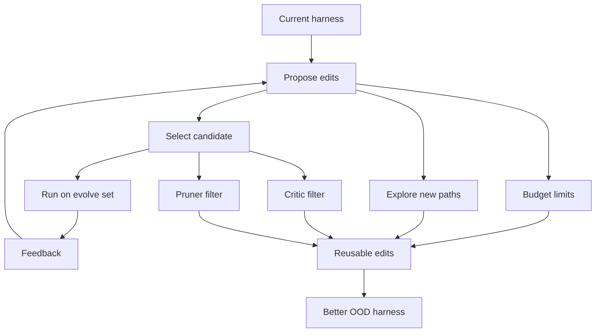
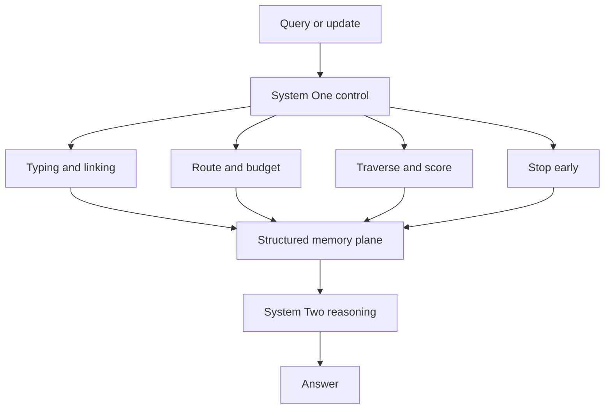
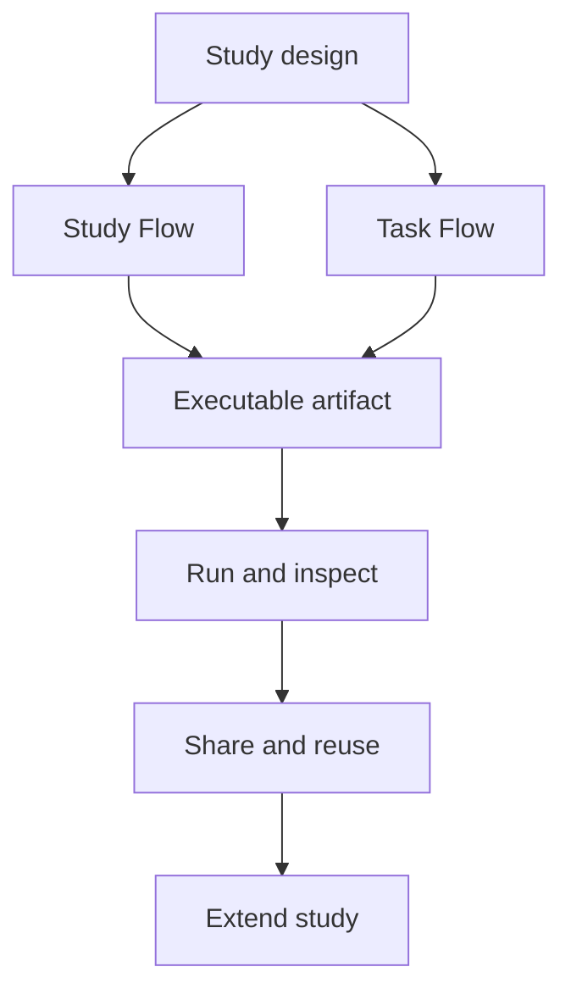
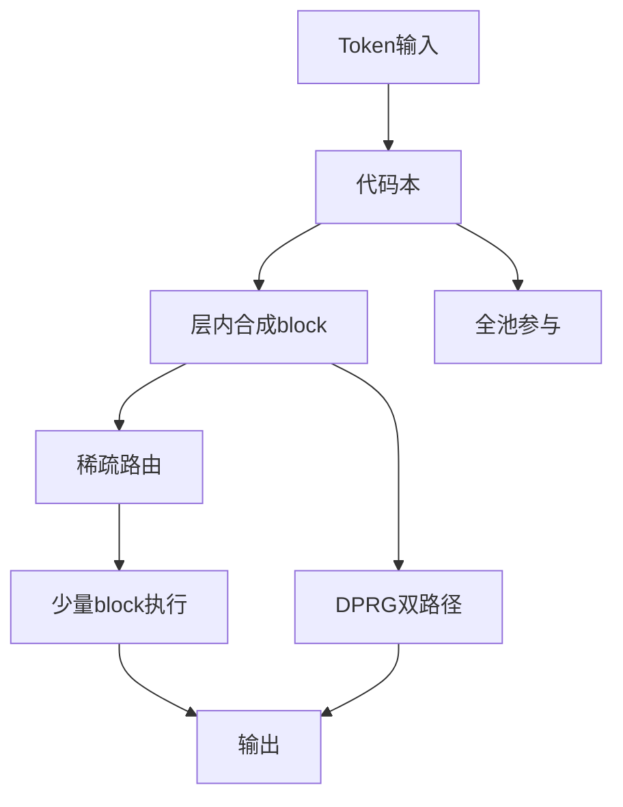
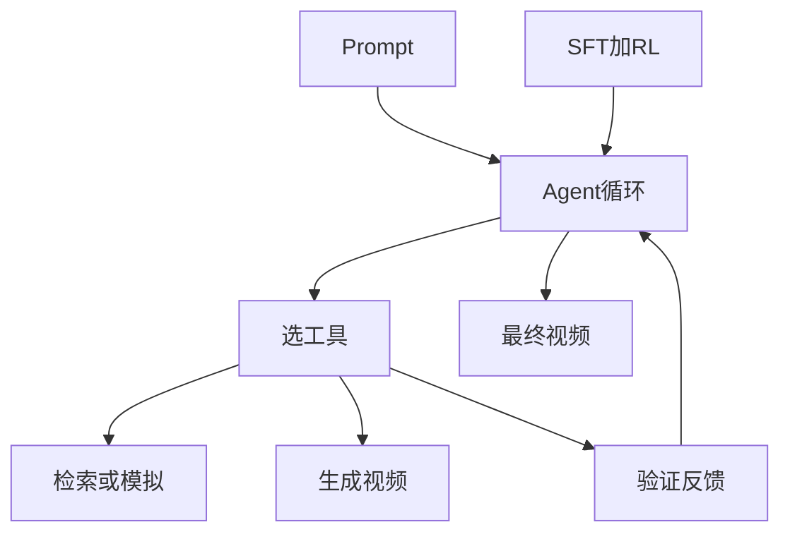
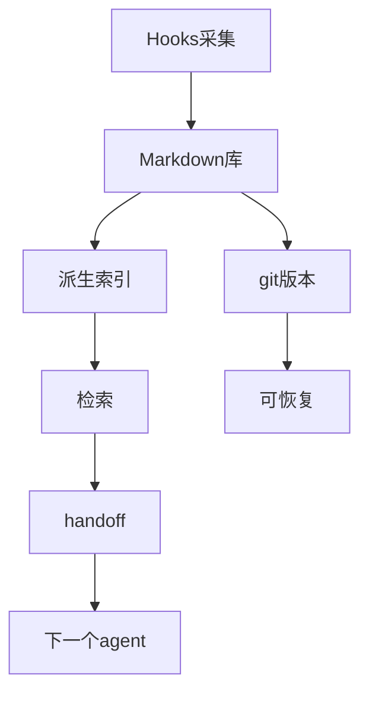
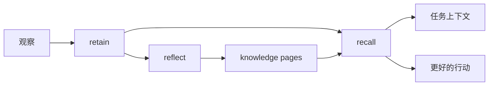
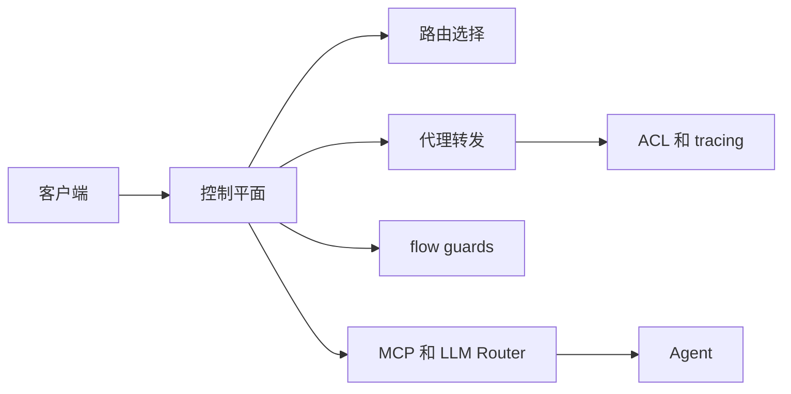

# Jarvis 日报 · 2026-09-22

候选 678 → 过滤后 295 → 入选 18。图例：⭐ 核心方向 · 🌐 全领域热点 · ✅ 已掌握前置 · 🔲 需补前置

## 📄 论文 · 核心方向

### 1. ⭐ 📄 RRSI: Regularized Recursive Self-Improvement of Agent Harnesses
arXiv [2609.24972](https://arxiv.org/abs/2609.24972) · HF 🔥 149 · Peng Xia, Rujun Han, Zifeng Wang 等 · [PDF](https://arxiv.org/pdf/2609.24972) · [代码](https://github.com/google-research/rrsi) ★54

**一句话**：RRSI用正则化RSI提效：8基准上分裂提升14.1分，OOD再涨4.7分
**为什么值得你看**：适合看 agent harness 自改如何避免过拟合

**核心架构**：反直觉点在于：让 agent harness 自己迭代，分数常常只是在“记住这组题”，换到没见过的 benchmark 就掉回去，甚至低于原始 harness。现有 RSI 式 harness evolution 的问题不是不会改，而是反馈太少又太噪，搜索会把 benchmark-specific pattern、评测噪声和复杂度累积一起学进去。RRSI 的关键改变是把“会改”变成“只允许更可复用的改法”：proposer 用 temporally annealed budget 限制一次候选能打包的 edits 数，并沿 evolution history 逼它走没试过的轨迹；selector 再用 critic + pruner 挡掉明显是任务特化、收益太小、代价太高或已经没用的改动。最直接的证据是它在 8 个基准上同时报告了 evolve split 上最高 14.1 分提升、5 个 OOD benchmark 上最高 4.7 分提升，而且 policy tokens 还少了 30%。新意主要在系统组织层：不是换一个 harness 搜索器，而是给 RSI 加了“提案约束 + 选择约束”的正则化框架。

- 最强证据：8 基准上 OOD 也涨，非只刷内分
- 没证明：对更大任务分布/更强 verifier 的稳定性
- 复现要点：需要 harness evolution 全流程和 history
**精读价值**：值得精读，核心是把 agent 自改从刷分变成可迁移机制
**关联**：[[AutoGPT]]、[[SWE-bench]]
#agent #evaluation #harness #self-improvement · 难度：硬核 · 建议：建议精读
前置：🔲 [[planning]] · 🔲 [[memory]] · 🔲 [[prompt injection]] · 🔲 [[SWE-bench]]

打分理由：agent harness 递归自改进与 OOD 风险，核心方向。（core 9 / wide 6）

### 2. ⭐ 📄 Jev-Mem: System-One-Controlled Agentic Memory for Efficient AI Agents
arXiv [2609.23986](https://arxiv.org/abs/2609.23986) · HF 🔥 11 · Dongming Jiang, Yi Li, Bingzhe Li · [PDF](https://arxiv.org/pdf/2609.23986) · [代码](https://github.com/libingzheren/Jev-Mem) ★25

**一句话**：Jev-Mem把记忆控制前移到System One：LoCoMo 0.777，构建快6.6倍
**为什么值得你看**：适合看 agent memory 的运行时拆分

**核心架构**：问题很具体：长时 agent 的记忆操作最耗的往往不是存什么，而是每次都让 autoregressive LLM 去决定怎么分型、怎么连关系、查多少、何时停，等于把生成放到记忆系统的关键路径上。现有做法要么靠固定 heuristic，灵活性不够；要么让大模型一路参与，延迟和 token 开销都高。Jev-Mem 的关键改变是把记忆系统拆成“快控制层 + 慢推理层”：System One 负责高频、结构化决策，包括写入时的 memory typing、redundancy filtering 和多关系建图，读取时的 query routing、retrieval budget 分配、graph traversal、candidate scoring、adaptive stopping；System Two 只在复杂 reasoning 和最终答案合成时才出场。最直接的证据是 LoCoMo 上整体 LLM-as-a-Judge 0.777，同时 memory construction 158s、查询延迟 0.93s，说明不是单纯省算力而牺牲效果。新意主要在系统组织层，核心是把“记忆控制”做成独立控制平面，而不是把它塞进生成式推理循环。

- 最强证据：效果和效率同时提升，不是单纯加速
- 原文未明确：对弱 System One 质量下限的分析
- 复现难点：多关系记忆结构和路由/停止策略联动
**精读价值**：值得看系统设计，尤其是记忆模块怎么拆控
**关联**：[[RAG]]、[[graph RAG]]
#agent #memory #long-context #inference · 难度：硬核 · 建议：值得通读 (20 min)
前置：🔲 [[memory]] · 🔲 [[long context]] · 🔲 [[retrieval-augmented generation]] · 🔲 [[graph RAG]]

打分理由：System-One 控制的高效 agent memory 关键（core 9 / wide 6）

### 3. ⭐ 📄 Gricea: An Open Science Platform for Conversational AI Research
arXiv [2609.22039](https://arxiv.org/abs/2609.22039) · HF 🔥 8 · Nikhil Sharma, Yunlin Gong, Xinyang Cheng 等 · [PDF](https://arxiv.org/pdf/2609.22039)

**一句话**：Gricea把 CAI 实验做成可执行 artifact：93% 论文配置可复现
**为什么值得你看**：适合想做 CAI 研究/评测的人看实验平台

**核心架构**：它解决的是 CAI 研究里一个很实际的悖论：大家在讨论同一类交互设计，但真正影响结果的往往是界面、参与者流程、agent 行为上下文、任务配置这些细节，而这些细节常写不全，后人只能重搭实验。现有方式的问题不是“没有论文”，而是研究配置分散在文本、代码、表单和临时脚本里，导致不可运行、不可修改、不可积累。Gricea 的关键改变是把研究本身定义成可执行 artifact：Study Flow 描述实验流程，Task Flow 描述单个任务里的界面与 agent 行为，二者连起来后，研究者看到的配置就是 runtime 真正执行的配置。这样一来，平台不是只存结果，而是把可检查、可部署、可复用的实验模板保存下来。最直接的证据是它用自身框架能复现 93% 的 eligible CUI 2026 配置，同时标出 96% 论文存在阻碍 faithful replication 的缺失信息。新意主要在系统组织层：把 CAI 实验的“配置”变成一等公民的研究对象。

- 最强证据：93% 可复现，96% 论文信息缺失
- 没证明：平台外部生态能否形成持续复用
- 更像研究基础设施，不是单个任务 benchmark
**精读价值**：偏项目/平台，想做 CAI 实验平台值得看
**关联**：[[OpenAI Evals]]、[[MosaicML Compose]]
#agent #tool-use #memory #continual · 难度：中等 · 建议：值得通读 (20 min)
前置：🔲 [[planning]] · 🔲 [[memory]] · 🔲 [[multi-agent]] · 🔲 [[prompt injection]]

打分理由：程序化记忆+图形设计agent，长任务可复用（core 9 / wide 6）

### 4. ⭐ 📄 ActGov: Governing LLM Agent Actions via Policy-Constrained Validation
arXiv [2609.24446](https://arxiv.org/abs/2609.24446) · Kaiyuan Zhang, Yuke Peng, Ke Jiang 等 · [PDF](https://arxiv.org/pdf/2609.24446)

**一句话**：Large language model (LLM) agents increasingly execute long-horizon workflows through external tools, allowing untrusted outputs to influence subsequent actions
**为什么值得你看**：（dry-run：未调用 LLM，配置 OPENAI_API_KEY 后会生成中文速览）
- Existing defenses isolate injected content or constrain execution with predefined plans and static policies, but these a
- In this work, we present ActGov, a runtime enforcement framework that validates each LLM-proposed tool action before it 
#agent #tool-use #runtime-security · 难度：中等 · 建议：看速览即可
打分理由：ActGov运行时策略约束验证，agent安全强相关（core 9 / wide 7）

### 5. ⭐ 📄 Transferring the Intelligence of VLMs to Robotic Control
arXiv [2609.22966](https://arxiv.org/abs/2609.22966) · HF 🔥 101 · Meng-Hao Guo, Zhe-Han Mo, Jia-Jun Wang 等 · [PDF](https://arxiv.org/pdf/2609.22966)

**一句话**：Humans can seamlessly adapt to both physical and digital worlds, suggesting that while a digital-to-real gap exists in embodiment, environment and task, human i
**为什么值得你看**：（dry-run：未调用 LLM，配置 OPENAI_API_KEY 后会生成中文速览）
- This naturally raises a fundamental question: can the intelligence of vision-language models (VLMs) similarly generalize
- Using this interface, the VLM controls a robot in a closed loop: it observes the current visual state, reasons about the
#vlm #robotics #control #embodied · 难度：中等 · 建议：看速览即可
打分理由：VLM 到机器人闭环控制迁移，契合 VLA/具身。（core 8 / wide 6）

### 6. ⭐ 📄 Document Retrieval-Aware Chunking (D-RAC): Universal Retrieval-Aware Ingestion of Enterprise Documents via PDF Normalization and Multimodal Markdown Conversion
arXiv [2609.24220](https://arxiv.org/abs/2609.24220) · HF 🔥 48 · Uday Allu, Abhivanth Sivaprakash, Pratik Singh 等 · [PDF](https://arxiv.org/pdf/2609.24220)

**一句话**：Retrieval-Augmented Generation (RAG) systems over enterprise knowledge bases must ingest heterogeneous document formats -- PDFs, Word documents, presentations, 
**为什么值得你看**：（dry-run：未调用 LLM，配置 OPENAI_API_KEY 后会生成中文速览）
- Rule-based extraction and OCR destroy reading order, flatten tables, and lose heading hierarchy, while fully agentic chu
- We present Document Retrieval-Aware Chunking (D-RAC), an extension of our Web Retrieval-Aware Chunking (W-RAC) framework
#rag #retrieval #chunking #document · 难度：中等 · 建议：看速览即可
打分理由：RAG 文档归一化+检索感知分块，工程可迁移。（core 8 / wide 5）

### 7. ⭐ 📄 IntBMoE: Integrating Block-Level Conditioning into Expert Composition for Full-Participation Mixture-of-Experts
arXiv [2609.21346](https://arxiv.org/abs/2609.21346) · HF 🔥 37 · Ran Cheng, Longfei Xu, Zheng Liu 等 · [PDF](https://arxiv.org/pdf/2609.21346)

**一句话**：IntBMoE 用代码本块+超网络，把 MoE 的参与/计算/存储三者解耦，并在图像分类、LM 上都赢基线
**为什么值得你看**：你做 MoE/训练系统面试，这篇是新型参数组织

**核心架构**：反直觉点在于：MoE 不是“专家越多越强”这么简单，而是 token 级别会被三个量绑死——参与度、执行量、参数实体数。现有 sparse routing 用少量专家省算力，却把没选中的专家直接踢出该 token 的学习；dense mixing 让所有专家都参与，但每个 token 都要算全量；parameter-merging 虽然单次只跑一个合成专家，但每个路由单元都可能要生成一份新权重，存储炸掉。作者的关键改法是把“构造专家变换”和“在 token 上执行”拆开：先用小 codebook 固定 block 数，再让共享 hypernetwork 在每一层把该层 expert base 合成为一个 block，token 只路由到少数 block。这样每个 block 都从全池取知识，所以参与是 full；真正算的 block 数仍然稀疏，所以 execution 低；block 数由 codebook 固定，所以 materialization 有上界。最直接的证据是 ImageNet-1K 上对 sparse 和 dense MoE 基线都稳定提升，且语言建模/序列推荐也能迁移；这支持的是“解耦三种成本”这个设计而不是单点调参。新意主要在组件层和系统组织层，不只是换路由器。

- 最强证据：ImageNet-1K 稳定赢 sparse/dense 基线
- 没证明：代码本规模与层数放大后是否仍稳
- 复现难点：hypernetwork+双路由，训练细节可能敏感
**精读价值**：值得看设计取舍，但速览足够判断方向
**关联**：[[Switch Transformer]]、[[GShard]]
#moe #training #sparsity #architecture · 难度：硬核 · 建议：值得通读 (20 min)
前置：🔲 [[mixture of experts]] · 🔲 [[sparse attention]] · ◽ hypernetwork · ◽ routing

打分理由：MoE专家合成的关键工程约束，方法可迁移（core 8 / wide 5）

### 8. ⭐ 📄 VideoGen-Agent: Reinforcing Video Generation Agents
arXiv [2609.24997](https://arxiv.org/abs/2609.24997) · HF 🔥 32 · Binxu Li, Haoyi Duan, Yuhui Zhang 等 · [PDF](https://arxiv.org/pdf/2609.24997)

**一句话**：VideoGen-Agent 用多任务 agentic RL 学会调用检索、生成和验证工具，把 VABench 提升 56.5→75.6
**为什么值得你看**：你关心 agent 和视频生成，这篇把 tool-use 真做进视频模型

**核心架构**：反直觉点在于：视频生成的失败往往不是画面不清，而是“知道得不对”——新术语、指定身份、物理约束、动作顺序这些，单靠 pretrained video model 容易胡编。作者没有继续堆更大的生成器，而是把生成拆成多轮 agent 循环：先 reasoning，再在 augmentation、generation、verification 三类工具里选动作，观察工具输出后再决定下一步。检测条件很明确：如果缺少知识或参考，就检索文本/图像或做 simulation；如果要出视频，就调 T2V/I2V/action-to-video；如果要校验主体存在或空间结构，就用 object detection、depth estimation。SFT 用 teacher trajectories 先教会“何时用什么工具”，再用 multitask agentic RL 把策略往高质量工具链上推；hybrid reward 同时约束工具调用合法性、任务匹配和生成质量。最直接的证据是 VABench 600 条 held-out prompts 上从 56.5 到 75.6 的提升，而且换更强 generation tools 后还能到 86.1，说明收益来自“会用工具”的策略而不只是底座模型。新意主要在系统组织层：把 video generation 做成可学习的循环+中间件，而不是单次生成。

- 最强证据：VABench 上 base 56.5→75.6
- 没证明：RL 是否依赖这套工具集与奖励设计
- 复现难点：多轮轨迹、任务均衡和 judge 设计都重
**精读价值**：值得精读，尤其是 agentic video 和工具学习
**关联**：[[ReAct]]、[[SWE-bench]]
#agent #video #rl #tool-use · 难度：硬核 · 建议：建议精读
前置：🔲 [[ReAct]] · 🔲 [[planning]] · ◽ reinforcement learning · 🔲 [[diffusion model]]

打分理由：视频生成智能体+外部工具+验证，agent 训练关键。（core 8 / wide 5）

## 🧰 项目 · 核心方向

### 9. ⭐ 🧰 akitaonrails/ai-memory
[GitHub](https://github.com/akitaonrails/ai-memory) ★8,058 (+575 今日) · Trending daily · infra · Rust

**一句话**：ai-memory 做跨 agent、跨机器的长期记忆，用 git-backed markdown wiki 统一 20+ harness
**为什么值得你看**：你做 agent 系统，这个是记忆与交接层的实用标杆

**核心架构**：它解决的是真实断点：编码 agent 的上下文通常锁在单机、单产品里，Claude Code 换到 Codex 或换机器后，之前的架构、失败尝试和未完事项就丢了。它的承重组件不是“再做一个聊天记录”，而是把 memory 定义成三层：生命周期 hooks 静默采集；session end 把观察整理成 git-backed `.md` wiki；下一次启动时用 full-text、entities、links 和可选 vectors 做检索，再通过 handoff protocol 把 baton 明确交接给下一个 agent。关键取舍是 source of truth 选 markdown 而不是纯向量库：可 grep、可手改、可 rsync，索引只是派生物；同时默认零 LLM calls，capture/search/handoff 都能跑。成熟度信号很强：README 明确列出 20+ harness 支持，支持矩阵被 CI 约束，最近 release 到 v2.4.0 且连发，另有 checksums；这不是概念 demo。若你要的是“换模型/换客户端也不断任务”的能力，它比一般 agent memory 工具更强调协议化交接和可审计的存储层，而不只是记更多内容。

- 最强证据：20+ harness 支持且有 CI 维护
- 没证明：大规模语义检索是否比向量库更强
- 复现难点：hooks、权限、跨工具协议集成成本高
**为什么现在上榜**：最近 release：v2.4.0（2026-09-21），v2.3.2（2026-09-20），v2.3.1（2026-09-17）
**精读价值**：项目成熟度高，值得看架构和协议设计
**关联**：[[model context protocol]]、[[Retrieval-Augmented Generation]]
#agent #memory #handoff · 难度：中等 · 建议：值得通读 (20 min)
前置：🔲 [[memory]] · 🔲 [[model context protocol]] · ◽ agent · 🔲 [[retrieval-augmented generation]]

打分理由：面向 agent 的长程记忆与供应商交接（core 8 / wide 7）

### 10. ⭐ 🧰 magnitudedev/magnitude
[GitHub](https://github.com/magnitudedev/magnitude) ★4,832 (+3303 本月) · Trending monthly · infra · TypeScript

**一句话**：用机器画像和模型预估解决本地推理选型，作者称可在下载前估 tok/s
**为什么值得你看**：做本地 LLM/Agent 部署时，先选对模型比装一个推理壳更关键

**核心架构**：反直觉点在于：本地推理的瓶颈常不是“能不能跑”，而是“下载后发现太慢或太吃内存”。传统 Ollama/LM Studio 让你先选模型再试，失败成本是反复下载和试错。Magnitude 的关键改变是先做 machine profiling，再对模型与 quant 预估 tok/s、速度、内存，再把模型下载、调参、运行串起来；speculative decoding、context size 这些调节点的目标是阻断“模型能启动但体验不可用”的失败。最直接的支撑是 README 的对比说明和作者报告的能力：在下载前估算每个模型的表现，并按 speed/accuracy/intelligence/memory 排名。新意主要在系统组织层，不是新推理算法。

- 最强证据：下载前估 tok/s 并给出排序
- 没证明硬件覆盖外的泛化，性能依赖机型画像质量
- 复现门槛低，价值在客户端集成与模型库维护
**精读价值**：适合看速览；值不值得精读主要看本地部署/推理系统方向
**关联**：[[Ollama]]、[[LM Studio]]
#inference #deployment #quant · 难度：中等 · 建议：值得通读 (20 min)
前置：🔲 [[KV cache]] · 🔲 [[speculative decoding]] · 🔲 [[quantization]]

打分理由：面向端侧推理的模型选择与运行，实用性强（core 7 / wide 6）

### 11. ⭐ 🧰 vectorize-io/hindsight
[GitHub](https://github.com/vectorize-io/hindsight) ★25,223 (+1337 本周) · Trending weekly · Python

**一句话**：用 retain recall reflect 做 agent memory，作者称 LongMemEval 达到 SOTA
**为什么值得你看**：直接打你关心的 agent memory，且有 benchmark 和论文

**核心架构**：反直觉点在于：很多 agent memory 只是在“记聊天记录”，但真正让 agent 变聪明的是把经验抽成可复用知识。旧方案里，RAG 只能临时检索，knowledge graph 又容易变成静态事实库，二者都难让系统随交互持续学习。Hindsight 的关键概念是把 memory 拆成 retain / recall / reflect 三种操作：retain 负责写入原始观察，recall 负责按任务上下文找回，reflect 负责把多次经历压成 mental models / knowledge pages，阻断“只存不学”与“检索到也不会泛化”的失败。最直接的证据是它在 LongMemEval 上自报 SOTA，且文档给了 benchmark 页面和独立复现说明。新意在组件层加系统组织层：不是单一检索器，而是围绕学习循环设计 memory 操作。

- 最强证据：LongMemEval 自报 SOTA，且有独立复现说明
- 没证明通用到所有 agent 任务，长程记忆任务才是主战场
- 复现难度中等，依赖后端存储和多 LLM provider 适配
**精读价值**：值得精读，尤其适合做 agent 记忆或长期交互系统
**关联**：[[RAG]]、[[Knowledge Graph]]
#agent #memory #learning · 难度：中等 · 建议：建议精读
前置：🔲 [[retrieval-augmented generation]] · 🔲 [[memory]] · 🔲 [[hallucination]] · 🔲 [[alignment]]

打分理由：Agent 记忆学习方法，热度与相关性高（core 7 / wide 8）

### 12. ⭐ 🧰 Nasiko-Labs/nasiko
[GitHub](https://github.com/Nasiko-Labs/nasiko) ★7,609 (+734 今日) · Trending daily · infra · Rust

**一句话**：用单控制平面管 A2A agents，作者称一键部署、路由和审计
**为什么值得你看**：很贴 agent 系统面试：控制平面、路由、权限、观测一锅端

**核心架构**：问题不是再做一个 agent 框架，而是多个 agent 一多就会变成运维和安全问题：谁能调谁、谁持有密钥、一次调用怎么追踪、失控循环怎么停。Nasiko 的关键改变是把所有 A2A 流量收进单个 control-plane process，代理转发、ACL、rate limit、trace、flow guards 都在这一处生效；路由还用了 embedding shortlist + rerank + LLM final pick，把“选哪个 agent”从调用方里拿掉。最直接的证据是 README 里的架构图和功能表：所有 inter-agent call 都经过 server，且 release v1.0.0 已有 desktop app。新意主要在系统组织层和运行时机制层，不是新模型。

- 最强证据：所有 A2A 调用都经 server，且有 flow guards
- 没证明在大规模异构 agent 集群下的极限吞吐
- 落地成本主要在控制面与代理协议适配
**为什么现在上榜**：v1.0.0（2026-02-12）初始正式版，带 macOS desktop app
**精读价值**：看速览就够；除非你要做 agent 平台或 MCP/路由基础设施
**关联**：[[MCP]]、[[ReAct]]
#agent #control-plane #orchestration · 难度：中等 · 建议：值得通读 (20 min)
前置：🔲 [[planning]] · 🔲 [[multi-agent]] · 🔲 [[prompt injection]] · 🔲 [[retrieval-augmented generation]]

打分理由：AI Agent 控制面，偏工程可用性（core 7 / wide 6）

### 13. ⭐ 🧰 agent-substrate/substrate
[GitHub](https://github.com/agent-substrate/substrate) ★2,880 (+301 今日) · Trending daily · infra · Go

**一句话**：Agent Substrate: the core system
**为什么值得你看**：（dry-run：未调用 LLM，配置 OPENAI_API_KEY 后会生成中文速览）
#agent #orchestration #runtime · 难度：中等 · 建议：看速览即可
打分理由：开源 agent 系统，适合做工程与面试案例（core 7 / wide 7）

### 14. ⭐ 🧰 code-yeongyu/lazycodex
[GitHub](https://github.com/code-yeongyu/lazycodex) ★3,586 (+63 今日) · Trending daily · infra · TypeScript

**一句话**：The one and only agent harness for complex codebases
**为什么值得你看**：（dry-run：未调用 LLM，配置 OPENAI_API_KEY 后会生成中文速览）
- Project memory, planning, execution, and verified completion inside Codex.
#agent #planning #codex · 难度：中等 · 建议：看速览即可
打分理由：面向复杂代码库的 agent harness，工程可用（core 7 / wide 7）

## 🌐 全领域热点

### 15. 🌐 🧰 dream-num/univer
[GitHub](https://github.com/dream-num/univer) ★15,247 (+202 今日) · Trending daily · infra · TypeScript

**一句话**：The Office Harness for AI Agents — Spreadsheets, Docs, Slides, Canvas, Relational Tables, and PDF in one runtime.
**为什么值得你看**：（dry-run：未调用 LLM，配置 OPENAI_API_KEY 后会生成中文速览）
#agent #tool-use #workspace · 难度：中等 · 建议：看速览即可
打分理由：面向 AI agent 的 Office 级运行时，热度高（core 6 / wide 9）

### 16. 🌐 🧰 google/ax
[GitHub](https://github.com/google/ax) ★7,361 (+2324 今日) · Trending daily · infra · Go

**一句话**：Google's open agentic orchestration runtime
**为什么值得你看**：（dry-run：未调用 LLM，配置 OPENAI_API_KEY 后会生成中文速览）
#agent #orchestration #framework · 难度：中等 · 建议：看速览即可
打分理由：Google agent 编排运行时，工程价值较高（core 6 / wide 8）

### 17. 🌐 🧰 browser-use/video-use
[GitHub](https://github.com/browser-use/video-use) ★25,722 (+155 今日) · Trending daily · skill · Python

**一句话**：Edit videos with coding agents
**为什么值得你看**：（dry-run：未调用 LLM，配置 OPENAI_API_KEY 后会生成中文速览）
#agent #multimodal #video · 难度：中等 · 建议：看速览即可
打分理由：用代码型 agent 做视频编辑，落地强（core 6 / wide 8）

### 18. 🌐 📄 DUMA-Bench: A Dual-Control Multi-Agent Benchmark for Evaluating LLM Agent Security
arXiv [2609.24662](https://arxiv.org/abs/2609.24662) · Ivan Aleksandrov, German Kochnev, Sabrina Sadiekh 等 · [PDF](https://arxiv.org/pdf/2609.24662)

**一句话**：LLM-based agents increasingly operate in environments where they interact with users, tools, and external systems
**为什么值得你看**：（dry-run：未调用 LLM，配置 OPENAI_API_KEY 后会生成中文速览）
- Yet most security evaluations assume passive users and static control, ignoring the interactive dynamics that shape real
- We introduce \textbf{DUMA-Bench}, a benchmark and evaluation protocol for measuring agent security under \emph{dual-cont
#agent #security #benchmark · 难度：中等 · 建议：看速览即可
打分理由：agent安全双控制基准，和评测/安全高度相关（core 8 / wide 8）

---
想精读哪一篇？在 Claude 里说：`精读 2026-09-22 第 N 条`，Jarvis 会按你的 known.md 只讲你不会的部分。