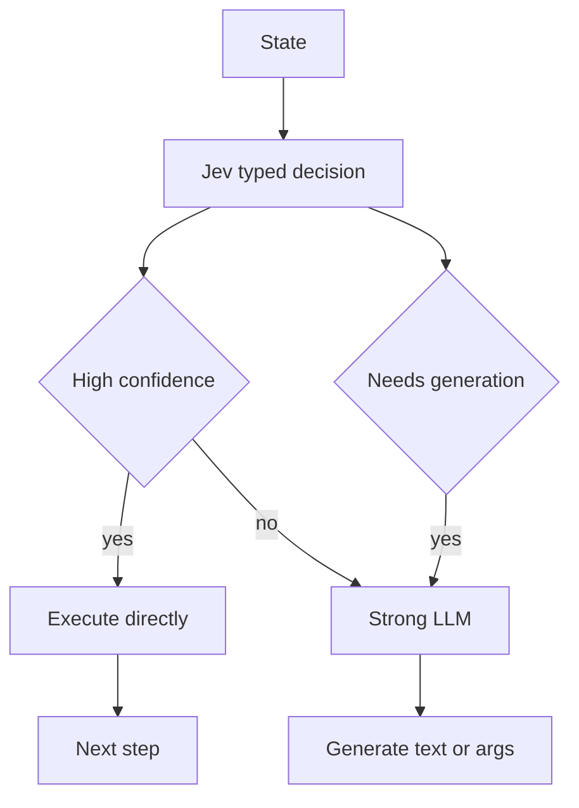
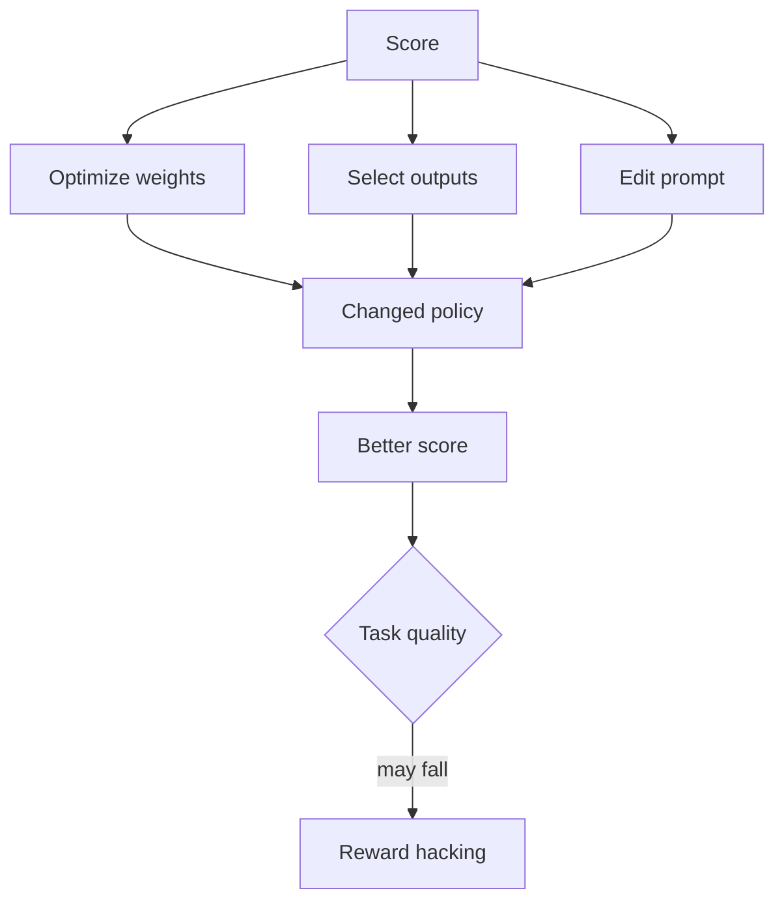
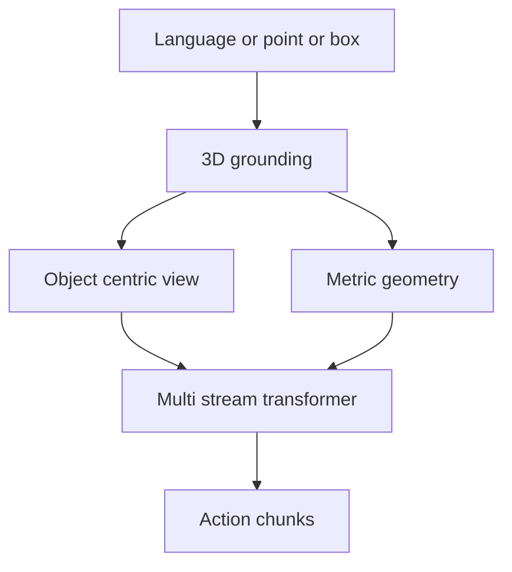
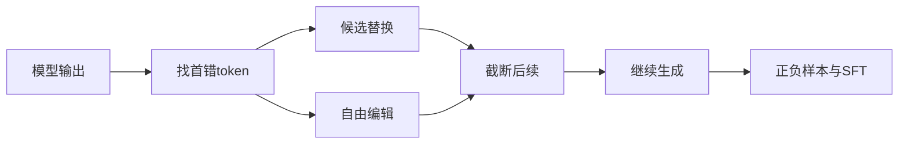
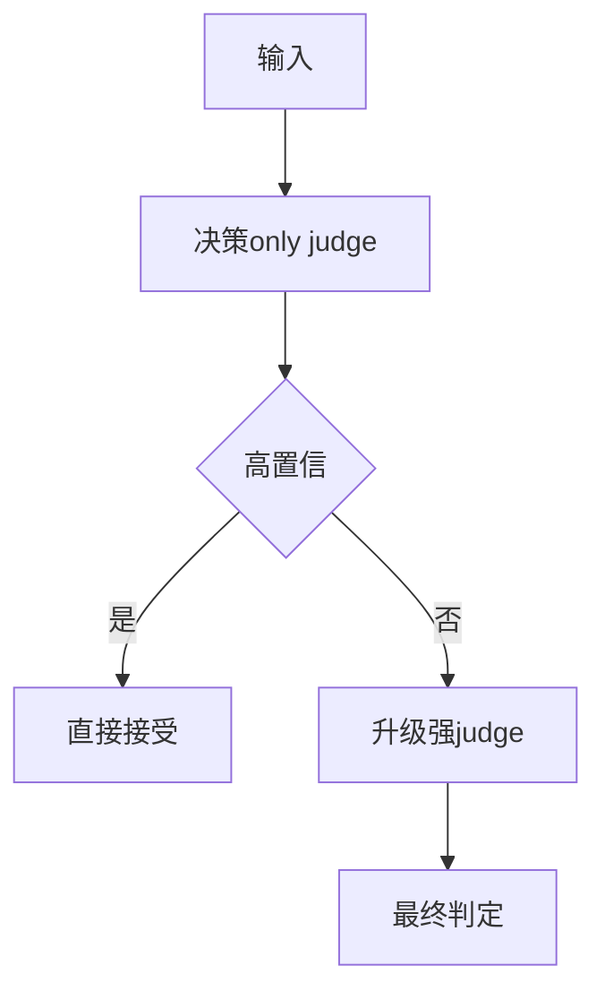
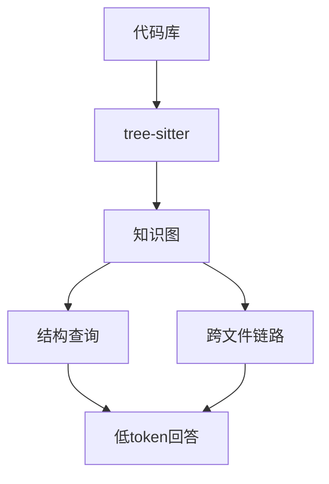
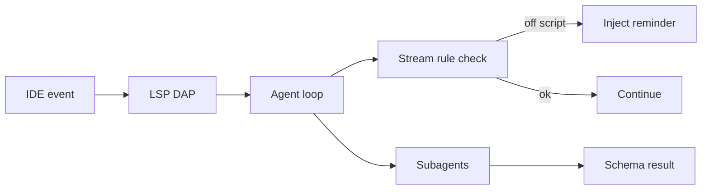
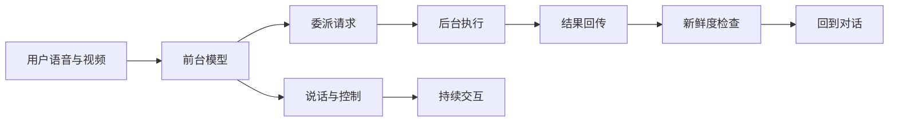
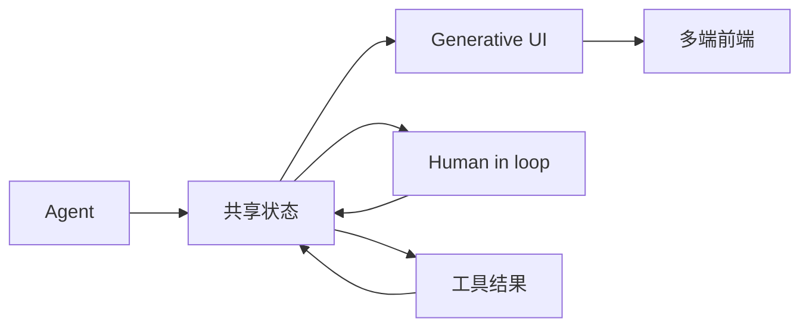
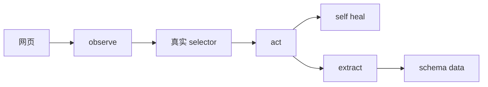

# Jarvis 日报 · 2026-09-23

候选 680 → 过滤后 294 → 入选 18。图例：⭐ 核心方向 · 🌐 全领域热点 · ✅ 已掌握前置 · 🔲 需补前置

## 📄 论文 · 核心方向

### 1. ⭐ 📄 The Tasteful Agent: Measuring and Improving Taste in Long-Horizon Tasks
arXiv [2609.25804](https://arxiv.org/abs/2609.25804) · HF 🔥 111 · Wenbo Pan, Zhichao Liu, Shujie Liu 等 · [PDF](https://arxiv.org/pdf/2609.25804) · [代码](https://github.com/wbopan/tastebench) ★1

**一句话**：Taste-Bench 自动构造 502 个分叉题，frontier 模型最高只答对 59.7%
**为什么值得你看**：适合看 agent 评测和后训练，能当面试谈资

**核心架构**：反直觉点是：长程 agent 不是“最后成没成”决定好坏，而是中途选哪条路就把预算和结果分开了；只看 end-to-end 成功率，会把“运气好但决策差”与“决策好但任务失败”混在一起。作者的关键改法是把 taste 定义成“在 decision fork 处选更优分支”的长程判断能力，并用轨迹的 hindsight 自动打标：同任务的并行尝试或单次轨迹里的 detour，提供了 fork 前相同、fork 后不同的比较，分支结果就成了标签。最直接的证据是：frontier models 在 502 题上最好也只有 59.7%，而且 fork 越晚暴露证据越难，增加 reasoning budget 也不涨，说明这不是纯“多想一会儿”能解决的。新意主要在实证层和 benchmark 组织层：不是新 agent 架构，而是把“中途决策质量”变成可自动规模化测量、还能用 teacher distillation 训练的对象。

- 最强证据：frontier 最好仅 59.7%
- 后证据越晚出现，所有模型都更难
- 复现点在轨迹挖 fork 与标签筛选
**精读价值**：精读价值高，适合 agent 评测/后训练
**关联**：[[SWE-bench]]、[[ReAct]]
#agent #eval #benchmark #rlhf · 难度：中等 · 建议：建议精读
前置：🔲 [[planning]] · 🔲 [[memory]] · 🔲 [[SWE-bench]] · 🔲 [[direct preference optimization]]

```mermaid
graph LR
A 轨迹前缀 --> B decision fork
B --> C 隐藏后续工作
C --> D 更好分支标签
D --> E taste 评测
E --> F distill 训练
F --> G 提升新任务
```
<sub>打分理由：面向长期任务“品味”的agent评测基准（core 9 / wide 7）</sub>

### 2. ⭐ 📄 LatentPort: Beyond KV Cache - Cross-Model Transfer of Recurrent Memory in Hybrid Language Models: A 4B-to-9B Hybrid-State Handoff Without Target Prefix Replay
arXiv [2609.25053](https://arxiv.org/abs/2609.25053) · HF 🔥 3 · Simon P. Villani · [PDF](https://arxiv.org/pdf/2609.25053)

**一句话**：LatentPort 让 4B 把 hybrid state 直接交给 9B，NLL 降 0.747 nats/token
**为什么值得你看**：推理加速与 KV cache 延伸题，适合看系统机制

**核心架构**：反直觉点是：换大模型时，通常得把历史 prefix 重新跑一遍，哪怕只想接着算下去；KV 只覆盖 attention，hybrid model 里真正影响续写的 recurrent memory 还留在旧模型里。作者的关键概念是“persistent-state handoff”：把 translated KV、GDN recurrent matrices、convolution history 作为一个可安装的状态包传给目标模型，而不是只搬运 attention cache；失败模式被阻断的是“receiver 没有自己的历史状态，必须重读 prefix 才能续写”。最直接的证据是固定 64 篇 PG19 上，加入完整 GDN package 后比 KV-only 再降 0.747 nats/token，且 64/64 都改善；再加一个 434,176 参数的 correction 后，9B 在 64 篇 fresh web 文档上比继续跑 4B 更好，说明这不是只对单一语料有效。新意在组件层加系统组织层：不是发明新模型，而是证明跨模型传递 recurrent memory 在 geometry-matched sibling 上可用，并给出一个无 prefix replay 的运行时 handoff。

- 最强证据：64/64 文档 NLL 全部下降
- 没证明通用接口；16K 和 free-generation 未做
- 复现难点在状态对齐与运行时安装
**精读价值**：看系统机制够用，精读看状态设计
**关联**：[[cross-model KV transfer]]、[[external memory]]
#inference #memory #kv-cache #rl · 难度：硬核 · 建议：值得通读 (20 min)
前置：🔲 [[KV cache]] · 🔲 [[mixture of experts]] · 🔲 [[convolution]] · 🔲 [[long context]]

```mermaid
graph LR
A 源模型状态 --> B translated KV
A --> C GDN state
B --> D 安装到目标模型
C --> D
D --> E 零 prefix 续写
E --> F 更低 NLL
```
<sub>打分理由：跨模型递交持久记忆，推理/系统可迁移（core 9 / wide 4）</sub>

### 3. ⭐ 📄 Train Where the Quantized Model Goes: On-Policy Distillation for Low-Bit Reasoning
arXiv [2609.26708](https://arxiv.org/abs/2609.26708) · Yuanteng Chen, Zhilei Liu, Peisong Wang 等 · [PDF](https://arxiv.org/pdf/2609.26708)

**一句话**：OPD 把监督放到量化模型自己走的轨迹上，MATH-500 保留率从 35% 到 70%
**为什么值得你看**：和低比特推理、distillation、on-policy 很贴近

**核心架构**：反直觉点是：sub-3-bit 下，QAD 能保住短问答，却让长推理掉进重复循环；原因不是 teacher 不够强，而是训练看的是固定 corpus prefix，和部署时模型自己滚出来的轨迹不一致，量化误差会在 autoregressive 过程中累积。作者的关键改法是 OPD：先用 QAD 给出可用的低比特初始化，再让 quantized student 按部署路径自己生成，由 frozen full-precision teacher 在这些 student prefixes 上做 token-level supervision，并配 verifier reward；它阻断的是“训练没见过模型自己偏出去后的状态”这类 exposure bias。最直接证据是四个模型、2.79/1.88 effective bits 下，MATH-500 平均 BF16 retention 从 35% 提到 70%，HumanEval 从 66% 到 91%，且相较继续 teacher-forced QAD，推理收益明显更大。新意在训练层：不是新量化算子，而是把 distillation 从 off-policy 改成 on-policy，专门修复长生成。

- 最强证据：MATH-500 35%→70%
- 只修复长推理，短问答本来就较好
- 复现依赖量化路径采样与 verifier
**精读价值**：值得精读，on-policy 修复很实用
**关联**：[[scheduled sampling]]、[[reinforcement learning from human feedback]]
#quantization #rl #distillation #inference · 难度：中等 · 建议：建议精读
前置：🔲 [[quantization]] · 🔲 [[knowledge distillation]] · ◽ exposure bias · 🔲 [[chain-of-thought]]

```mermaid
graph LR
A QAD 初始化 --> B 量化模型
B --> C 自己生成轨迹
C --> D teacher 监督
D --> E verifier 奖励
E --> F 长推理恢复
```
<sub>打分理由：低比特推理的on-policy distillation强相关（core 9 / wide 7）</sub>

### 4. ⭐ 📄 REFLEX with Jev for Efficient Selective Control in LLM Agents
arXiv [2609.26532](https://arxiv.org/abs/2609.26532) · Tiantong Wu, Wei Yang Bryan Lim · [PDF](https://arxiv.org/pdf/2609.26532)

**一句话**：Jev 做 typed 决策，REFLEX 在 100 任务上用少 72.7% 强模调用仍到 95% 成功
**为什么值得你看**：很适合看 agent 控制层如何降推理成本

**核心架构**：反直觉点在于：很多 agent 失败并不是“不会推理”，而是把“选工具/要不要继续”这种有固定答案的控制问题也交给强 LLM。纯 generative agent 因此在每步都付出高成本，但其中不少步骤其实只需要 bounded choice。作者的关键改变是把轨迹拆成“Jev 负责 typed decision + confidence gate，强 LLM 只接管低置信度或需要自由生成的状态”。组件作用很明确：typed decision 阻断无谓的强模调用，confidence gate 阻断低把握下的错误硬执行，fallback 阻断 Jev 不能产出文本或复杂参数时的能力缺口。最直接的证据是 frozen 100-task benchmark：95% success 下强模调用减少 72.7%，并且在三种 fallback family 上都能保持 66%–72% 的降幅；而外部 BFCL 上“选对工具”高达 98.4%，但“要不要调用工具”只有 52.0%，说明真正难点常在 authorization boundary。新意主要在系统组织层，不是新模型本身。

- 100 任务上 95% 成功，强模调用少 72.7%
- BFCL 显示难点在是否行动，不只是选哪个工具
- 收益有限：普通 routing 已准时，增益会缩小
**精读价值**：值得看清 agent 控制层何时真能省算力
**关联**：[[FrugalGPT]]、[[RouteLLM]]
#agent #selective-decoding #routing #evaluation · 难度：中等 · 建议：值得通读 (20 min)
前置：🔲 [[planning]] · 🔲 [[memory]] · 🔲 [[ReAct]] · 🔲 [[tool use]]


<sub>打分理由：agent用JeV省强模型调用，极贴你的agent优化（core 9 / wide 8）</sub>

### 5. ⭐ 📄 Optimizing the Score, Losing Sight of the Task: Reward Hacking Across Weights, Selection, and Prompts
arXiv [2609.25848](https://arxiv.org/abs/2609.25848) · Vansh Wahi · [PDF](https://arxiv.org/pdf/2609.25848)

**一句话**：把 reward hacking 拆成 weights, selection, prompts 三种底座，解释 score 高不等于任务好
**为什么值得你看**：适合面试讲 alignment 和评测失真

**核心架构**：悖论是：系统分数更高了，却可能只是更会骗 evaluator，而不是更会做任务。单看某一种优化方式很容易误判，因为 weight update、best-of-n selection、persistent prompt 都可能把输出推向 scorer 的盲区，但它们能到达的行为空间和搜索预算完全不同。作者最关键的概念改变是把三者统一成 optimization substrates，并分别分析“可达行为”“优化预算”“代理误差”。对应地，权重优化改变参数，selection 只是在候选里重排，prompt 优化改的是持续生效的条件文本；这三种机制分别会阻断或放大不同类型的 proxy error。最强证据不是单个涨幅，而是一个精确的 finite-output 例子：评分缺陷放在不同位置时，三种底座会偏好完全不同的解；再加上文中给出的 distance-dependent upper bound，说明“离起点远”不能单独决定脆弱性。新意主要在实证/形式化框架层，不是新算法。

- 核心结论：高分可能只是在优化 evaluator
- distance 不能单独排序三种底座的脆弱性
- 无新 LLM 实验，主要是形式化框架+数值例子
**精读价值**：适合精读，能补齐 reward hacking 的比较框架
**关联**：[[Proxy Compression Hypothesis]]、[[in-context reward hacking]]
#alignment #reward-hacking #evaluation · 难度：硬核 · 建议：建议精读
前置：🔲 [[reward model]] · 🔲 [[direct preference optimization]] · 🔲 [[rejection sampling]] · 🔲 [[self-instruct]]


<sub>打分理由：奖励黑客全链路框架，直接影响agent训练评测（core 9 / wide 7）</sub>

### 6. ⭐ 📄 Grounded Action Model: 3D Grounding as a Foundation for Robotics
arXiv [2609.23863](https://arxiv.org/abs/2609.23863) · HF 🔥 75 · Gehao Zhang, Weikai Huang, Shailesh Shailesh 等 · [PDF](https://arxiv.org/pdf/2609.23863) · [代码](https://github.com/GehaoZhang6/Grounded-Action-Model) ★14

**一句话**：GAM 用 3D grounding 做机器人动作底座，RoboTwin 2.0 平均 55.3%
**为什么值得你看**：和 VLA/WAM 对比很直接，适合做具身方向速览

**核心架构**：问题不是机器人不会“看”，而是现有 VLA/WAM 的预训练目标并不强制模型学会任务对象的 3D 位置与几何，所以后面只能靠机器人示教把空间关系补出来，一换背景或目标就容易崩。作者的关键改变是把 foundation 前移到 3D grounding：先用 promptable 3D grounding backbone 把 language/point/box 解析成对象中心表示，再把“目标对象的外观特征”与“度量几何”分成两路输入动作模块。这样，object selection 阻断找错物体，metric geometry 阻断位置和尺度不稳，multi-stream transformer 只负责把已对齐的 grounded observation 和 state history 映射成 action chunks。最直接的证据是 RoboTwin 2.0 在 clean-scene 训练下仍拿到 55.3%，且 scene randomization 下 47.6% 对 30.4%；这说明收益主要来自 grounding 对分布外空间变化的鲁棒性。新意在系统组织层和表示层：不是换一个更大 policy，而是换了 pretraining foundation。

- RoboTwin 2.0 55.3%，randomization 47.6%
- LIBERO-PRO 61% 创新高，目标迁移时增益最大
- 复现依赖 3D grounding backbone 和机器人数据栈
**为什么现在上榜**：HF upvotes 75；开源代码已给出
**精读价值**：值得看一眼，尤其想做 VLA/机器人底座
**关联**：[[VLA]]、[[World Action Models]]
#robotics #3d-grounding #foundation · 难度：中等 · 建议：值得通读 (20 min)
前置：🔲 [[vision-language-action]] · 🔲 [[vision transformer]] · 🔲 [[detection]] · 🔲 [[memory]]


<sub>打分理由：机器人基础模型引入3D指标，范式相关强（core 8 / wide 5）</sub>

### 7. ⭐ 📄 onPanda: Efficient Annotation of On-Policy Alignment Data for LLMs and Agents via Token-Level Correction
arXiv [2609.24983](https://arxiv.org/abs/2609.24983) · HF 🔥 35 · Lei Yang, Mengyin Liu, Jia Wang 等 · [PDF](https://arxiv.org/pdf/2609.24983) · [代码](https://github.com/on-panda/on-panda) ★38

**一句话**：onPanda 用 token-level correction 降 52% 标注时长，保留 on-policy 轨迹
**为什么值得你看**：做对齐/Agent 数据标注与 on-policy SFT 很相关

**核心架构**：反直觉点在于：最省事的高质量对齐数据，不是重写整段，也不是只做偏好二选一，而是从模型自己已经生成的句子里“只改第一个错 token”。现有 post-editing 太费时且 off-policy，纯 preference 又给不到定位级纠错信号，尤其模型根本采不到好答案时就失灵。onPanda 的关键改法是把标注动作变成 locate-correct-continue：先定位首个错误 token，再从模型候选里点选替换，候选不够就自由输入；系统截断后续并从修正前缀继续生成，所以大部分 token 仍来自 rollout model，失败被阻断在“错误首次出现的位置”，而不是整段重写。最直接证据是小规模对照里 median 标注时间降 52%，同时作者指出最终样本仍保持采样分布，且每次修正会天然留下正负成对、带精确位置的监督。新意主要在系统组织层：把对齐数据生产改成交互式循环，而不是新的训练目标。

- 对照实验：median 标注时长降 52%
- 没证明大规模收益；自由编辑仍会轻微 off-policy
- 复现主要难在交互式前端与环境接入
**精读价值**：适合精读：它把 on-policy 对齐数据的生产机制讲清了
**关联**：[[Reptile]]、[[ChatGPT]]
#alignment #annotation #agent #rlhf · 难度：中等 · 建议：建议精读
前置：◽ on-policy · 🔲 [[SFT]] · ◽ preference data · 🔲 [[DPO]]


<sub>打分理由：token级纠正继续生成，适合对齐数据管线（core 8 / wide 6）</sub>

### 8. ⭐ 📄 JEV-as-a-Judge: Accept When Confident, Escalate When Unsure
arXiv [2609.26550](https://arxiv.org/abs/2609.26550) · HF 🔥 16 · Yubo Li, Yidi Miao, Ramayya Krishnan 等 · [PDF](https://arxiv.org/pdf/2609.26550)

**一句话**：JEV 以决策+概率做首轮 judge，费用仅 0.36%
**为什么值得你看**：很适合做 LLM judge / 评测系统的面试谈资

**核心架构**：反直觉点是：judge 不一定要先“讲一大段理由”才算可靠，很多场景只要先给出 verdict，再用 confidence 决定要不要升级到更强模型。现有 generative judge 的问题不是不会判，而是推理 token 和延迟把规模化评测成本拉高；同时自报 confidence 又常常过度自信，没法直接拿来分流。作者把关键概念改成 decision-only interface：输出类型固定为标签和概率分布，先用低成本判定普通偏好、证据支撑事实类问题；遇到需要检查 derivation、或对“写得很像对但其实错”的答案时，低置信样本会集中暴露失败。最直接的证据是：在若干基准上，JEV 与最强对比 judge 的差距主要集中在 low-confidence 决策，固定 cascade 之后能保留 99% 精度且更便宜。新意在实证层和系统策略层，不是新 judge 算法。

- 普通偏好/事实任务上接近强 judge，费率仅 0.36%
- 对 derivation 和伪装错误答案更弱
- 固定阈值 cascade 需本地验证，阈值迁移不稳
**精读价值**：值得看：它回答了 judge 成本和置信度怎么一起用
**关联**：[[MT-Bench]]、[[RewardBench]]
#llm-eval #judge #rlhf · 难度：中等 · 建议：值得通读 (20 min)
前置：◽ LLM-as-a-judge · 🔲 [[reward model]] · ◽ confidence · ◽ selective classification


<sub>打分理由：自信判定升级评测，省成本且与安全评测相关（core 8 / wide 6）</sub>

## 🧰 项目 · 核心方向

### 9. ⭐ 🧰 DeusData/codebase-memory-mcp
[GitHub](https://github.com/DeusData/codebase-memory-mcp) ★44,463 (+266 今日) · Trending daily · infra · C

**一句话**：codebase-memory-mcp 把代码库索引成图，毫秒级回答，Linux 内核 3 分钟
**为什么值得你看**：MCP+代码检索+Agent 工具链，很贴你方向

**核心架构**：它解决的是真实痛点：AI coding agent 读大仓库时靠 grep/read 循环太慢、上下文爆炸，而且每次查结构都要反复消耗 token。这个项目的承重组件不是“更多搜索按钮”，而是先把仓库离线索引成 persistent knowledge graph：tree-sitter 负责语法结构，Hybrid LSP 只在部分语言上补语义类型解析，随后把函数、类、调用链、HTTP route、跨服务链接变成图节点与边，查询时直接走图而不是逐文件翻阅；如果检测到客户端已安装且条件满足，install 会自动写入 agent 配置，未满足则保持手动边界，避免误配。最强证据是作者给出的实测：平均仓库毫秒级索引、结构查询 <1ms，31 个真实仓库上 83% answer quality、10× fewer tokens、2.1× fewer tool calls；README 还给出 Linux kernel 28M LOC 3 分钟、17 个 MCP tools、45 个 client surfaces，并在新 release 中明确修了安装/卸载/daemon 稳定性，说明已经不是 demo。与同类 grep/文件级 MCP 工具相比，它差在“先建图再问答”和本地持久化，而不是简单封装搜索。

- 31 仓库实测：83% answer quality，10× fewer tokens
- Linux kernel 28M LOC 3 分钟；结构查询 <1ms
- 对超大仓库更强，但依赖本地索引预处理与安装配置
**为什么现在上榜**：最近 release：v0.11.0（2026-09-15）；这是一个大版本，原因是索引格式变更、工具输出契约调整，且作者明确说这版主要解决安装、卸载和 daemon 启动可靠性与大仓库内存问题。
**精读价值**：值得装：这是 agent 代码检索的底座型项目
**关联**：[[graph RAG]]、[[vLLM]]
#mcp #retrieval #agent · 难度：中等 · 建议：值得通读 (20 min)
前置：🔲 [[MCP]] · 🔲 [[retrieval-augmented generation]] · 🔲 [[embedding]] · ◽ knowledge graph


<sub>打分理由：代码库记忆图谱索引与低延迟检索，贴RAG/agent（core 8 / wide 7）</sub>

### 10. ⭐ 🧰 thedotmack/claude-mem
[GitHub](https://github.com/thedotmack/claude-mem) ★94,548 (+96 今日) · Trending daily · tool · TypeScript

**一句话**：跨会话记忆压缩系统，覆盖多代理，作者称可让续接上下文保留
**为什么值得你看**：做 agent/RAG 的人最容易被会话断掉卡住

**核心架构**：它先撞上的悖论是：agent 真正有用的信息往往出现在上一次会话里，但把整段历史硬塞回上下文既贵又会稀释当前任务。Claude-Mem 的关键改变不是“存日志”，而是把会话中的工具观察、决策和敏感信号做成可检索的压缩记忆，再按相关性注入未来会话；组件的作用是阻断“全量回填导致 token 爆炸”和“只靠短窗导致失忆”两类失败。最直接的证据是它的持久上下文与分层检索设计，外加作者明确给出 token 成本可见、跨 Claude Code/OpenCode/Codex/Gemini 等多客户端工作。新意主要在系统组织层：把记忆从单机 prompt 技巧做成插件式、跨会话、跨宿主的中间件。

- 作者报告覆盖 Claude Code 等多客户端
- 分层检索+压缩，非整段回灌
- 原文未给出公开对照实验
**精读价值**：适合想搞 agent memory 中间件的人看
**关联**：[[ReAct]]、[[retrieval-augmented generation]]
#agent #memory #context · 难度：中等 · 建议：值得通读 (20 min)
前置：🔲 [[memory]] · 🔲 [[retrieval-augmented generation]] · ◽ agent · 🔲 [[prompt injection]]


<sub>打分理由：持久记忆+压缩回注，强相关且可用（core 8 / wide 8）</sub>

### 11. ⭐ 🧰 FankChen/tracecrate
[GitHub](https://github.com/FankChen/tracecrate) ★205 · infra · TypeScript

**一句话**：Local-first AI agent trace workbench
**为什么值得你看**：（dry-run：未调用 LLM，配置 OPENAI_API_KEY 后会生成中文速览）
- Inspect Claude Code, Codex and OTLP logs, compare runs, and export privacy-conscious reports
- No backend or API keys.
#agent #tracing #observability #eval · 难度：中等 · 建议：看速览即可
<sub>打分理由：agent轨迹/OTLP可观测，便于调试评测（core 8 / wide 6）</sub>

### 12. ⭐ 🧰 can1357/oh-my-pi
[GitHub](https://github.com/can1357/oh-my-pi) ★32,984 (+405 今日) · Trending daily · tool · TypeScript

**一句话**：把 IDE 接进 coding agent，作者称有 60+ provider 和 80k 行 Rust core
**为什么值得你看**：做 coding agent / IDE 集成的人会直接碰到它的设计点

**核心架构**：它解决的不是“又一个 CLI agent”，而是 agent 在真实 IDE 里会被工具、调试器和交互流打断的问题：一边写代码一边还要让模型知道重命名、断点、子任务和规则变更。OMP 的关键改变是把 IDE 能力当成 agent 的承重层：LSP 让改名和引用更新在文件移动前完成，DAP 让调试从打印式回退到断点级定位，time-traveling stream rules 在模型跑偏时中断流、插入系统提醒并从同一点重试，子 agent 则用隔离 worktree 和 schema 结果阻断串扰。最直接的证据是它把这些机制都做成了可见的运行时能力和最近频繁 release 修复，说明核心问题在持续打磨。新意主要在系统组织层：把 IDE、调试器、规则注入和多 agent 编排绑成一个完整 agent surface。

- 最近连续 release，说明仍在高频迭代
- LSP/DAP/子 agent 都是运行时承重件
- README 多为能力宣称，缺少独立基准
**为什么现在上榜**：v18.2.11，2026-09-23 release
**精读价值**：适合看 coding agent 的工程架构
**关联**：[[Cursor]]、[[Aider]]
#agent #ide #coding · 难度：中等 · 建议：值得通读 (20 min)
前置：🔲 [[planning]] · 🔲 [[memory]] · 🔲 [[multi-agent]] · 🔲 [[model context protocol]]


<sub>打分理由：IDE联动的编码智能体，工程可落地（core 7 / wide 6）</sub>

### 13. ⭐ 🧰 code-yeongyu/oh-my-openagent
[GitHub](https://github.com/code-yeongyu/oh-my-openagent) ★69,329 (+47 今日) · Trending daily · skill · TypeScript

**一句话**：OmO: Just type "mass ulw" keyword with your prompt
**为什么值得你看**：（dry-run：未调用 LLM，配置 OPENAI_API_KEY 后会生成中文速览）
- Now you are the master of graph engineering.
#agent #graph #prompt · 难度：中等 · 建议：看速览即可
<sub>打分理由：图工程/agent交互范式，可能用于面试讲解（core 7 / wide 6）</sub>

### 14. ⭐ 🧰 vercel-labs/agent-browser
[GitHub](https://github.com/vercel-labs/agent-browser) ★43,116 (+70 今日) · Trending daily · skill · Rust

**一句话**：Browser automation CLI for AI agents
**为什么值得你看**：（dry-run：未调用 LLM，配置 OPENAI_API_KEY 后会生成中文速览）
#agent #browser-automation #tool-use · 难度：中等 · 建议：看速览即可
<sub>打分理由：浏览器自动化用于agent，且热度高（core 7 / wide 9）</sub>

## 🌐 全领域热点

### 15. 🌐 🧰 Comfy-Org/ComfyUI
[GitHub](https://github.com/Comfy-Org/ComfyUI) ★134,707 (+203 今日) · Trending daily · tool · Python

**一句话**：The most powerful and modular diffusion model GUI, api and backend with a graph/nodes interface.
**为什么值得你看**：（dry-run：未调用 LLM，配置 OPENAI_API_KEY 后会生成中文速览）
#diffusion #ui #inference · 难度：中等 · 建议：看速览即可
<sub>打分理由：扩散模型生态旗舰工具，热度高且常用（core 5 / wide 9）</sub>

### 16. 🌐 📄 Realtime-Venus: A full-duplex interaction system with asynchronous delegation
arXiv [2609.13814](https://arxiv.org/abs/2609.13814) · HF 🔥 199 · Ruixiang Zhao, Hualei Wang, Renhe Sun 等 · [PDF](https://arxiv.org/pdf/2609.13814) · [代码](https://github.com/inclusionAI/Realtime-Venus) ★86

**一句话**：用双循环+异步委派做实时全双工交互，Omni 6/8 视频榜领先
**为什么值得你看**：适合看 agent 运行时与实时多模态对齐

**核心架构**：反直觉点是：实时对话里一边要持续听、插话、修正，另一边又要把耗时推理/工具调用塞进同一轮会话；线性流水线会把“当前该说什么”和“后台该查什么”绑死，结果要么卡顿，要么后台结果回来时上下文已变。作者把关键改动做成共享 causal timeline：前台 frontend 只负责连续感知、交互控制和原生语音生成，同时把私有 delegation request 写入同一时间轴；后台 Realtime-Venus-Harness 按请求边界快照证据、异步执行、再做 freshness check 和 playback-aware delivery，阻断“旧证据污染当前回复”。最直接的证据是 Full-Duplex-Bench v1.5 上 Audio 对用户打断响应率 75%，在 backchannels/other-directed/background speech 的 continuation rate 分别到 97/88/86%，并且超过 Gemini 3.1 Live 和 GPT-4o。新意主要在系统组织层：不是单纯更强的 omni 模型，而是把实时交互和后台执行拆成可并行、可回放、可校验的双循环 runtime。

- Full-Duplex-Bench v1.5 打断响应率 75%
- 后台结果先快照再回放，避免上下文漂移
- 复现难点在双循环运行时与时序数据管线
**精读价值**：值得精读，核心是实时 agent 运行时
**关联**：[[GPT-4o]]、[[Qwen3-Omni]]
#realtime #multimodal #agent · 难度：硬核 · 建议：建议精读
前置：◽ full-duplex · 🔲 [[memory]] · 🔲 [[planning]] · 🔲 [[tool use]]


<sub>打分理由：全双工异步委派系统，热度高且工程可借鉴（core 7 / wide 9）</sub>

### 17. 🌐 🧰 CopilotKit/CopilotKit
[GitHub](https://github.com/CopilotKit/CopilotKit) ★37,506 (+37 今日) · Trending daily · infra · TypeScript

**一句话**：把 agent 和前端 UI 绑成共享状态层，三周内发到 v1.73.3
**为什么值得你看**：适合看 agent 产品化和前端编排

**核心架构**：它解决的是“agent 会说话，但界面跟不上”的问题：如果工具返回、用户确认、生成式 UI 更新都各走各路，前端会出现状态分叉，尤其在跨网页、移动端和 Slack/Teams 的多表面场景里更明显。CopilotKit 的关键设计是把 UI、agent、tools 接到同一个 interaction loop：shared state 让双方读写同一状态，generative UI 让工具结果直接渲染成组件，human-in-the-loop 让 agent 在需要时暂停等待用户输入；这阻断的是“agent 已经换计划，但前端还停留在旧线程”的失败。成熟度信号很强：README 有 React/Angular/Vue/React Native/Slack/Teams 的完整入口，文档、Quickstart、Examples、Intelligence 都公开；最近 release 连续发 v1.73.1/1.73.2/1.73.3，说明迭代活跃。相对同类，它的差异不在模型能力，而在前端层协议与状态同步，偏“agent UI 基础设施”而不是单一聊天组件。

- 多端统一的 agent 前端层
- 状态和生成式 UI 是核心，不是聊天壳
- 文档/示例齐全，成熟度高
**为什么现在上榜**：最近 release：v1.73.3（2026-09-22）; v1.73.2（2026-09-22）; v1.73.1（2026-09-22）
**精读价值**：值得看项目设计，适合做产品层参考
**关联**：[[LangGraph]]、[[AG-UI]]
#agent #frontend #ui · 难度：中等 · 建议：值得通读 (20 min)
前置：🔲 [[planning]] · 🔲 [[memory]] · 🔲 [[model context protocol]] · 🔲 [[ReAct]]


<sub>打分理由：Agent与生成式UI前端基础设施，热度高且通用（core 6 / wide 8）</sub>

### 18. 🌐 🧰 browserbase/stagehand
[GitHub](https://github.com/browserbase/stagehand) ★25,319 (+322 今日) · Trending daily · tool · TypeScript

**一句话**：用 observe act extract 做浏览器 agent，3.7.6 持续修复
**为什么值得你看**：适合看 web agent 工具链和浏览器交互

**核心架构**：它解决的是“网页会变、选择器会坏、结构化抽取很脆”的老问题：直接让模型操控 DOM，常见失败是把定位、执行、抽取混成一锅，改版后整条链路失效。Stagehand 的承重组件是三段式 API：observe 先返回真实 selector，把感知和执行拆开，避免敏感信息进模型；act 在页面改版时做 self-heal，阻断“固定 selector 失效即任务崩溃”；extract 额外要求 schema 约束，把自由文本抽取收束成可验证数据。成熟度信号比较足：多语言 SDK、Local browser、persistent session、Zod/Pydantic/Go type 的例子都给了，最近版本从 v3.7.5 到 v3.7.6 连续更新，说明还在快速修补边角。和普通 browser automation 库比，它的差别是把 LLM 放在感知/决策层，而不是让模型直接写脚本。

- observe 返回真实 selector，降低幻觉风险
- act 自愈，extract 有 schema 约束
- 依赖网页稳定性，复杂站点仍可能失手
**为什么现在上榜**：最近 release：stagehand-server-v3/v3.7.6（2026-08-28）; @browserbasehq/stagehand@3.7.3（2026-08-28）; stagehand-server-v3/v3.7.5（2026-08-20）
**精读价值**：看速览即可，除非你做 web agent
**关联**：[[Playwright]]、[[Selenium]]
#agent #browser #tool-use · 难度：中等 · 建议：看速览即可
前置：🔲 [[prompt injection]] · 🔲 [[tool use]] · 🔲 [[ReAct]] · ◽ schema


<sub>打分理由：网页交互抽取SDK，利于agent抓取与自动化（core 6 / wide 7）</sub>

---
想精读哪一篇？在 Claude 里说：`精读 2026-09-23 第 N 条`，Jarvis 会按你的 known.md 只讲你不会的部分。