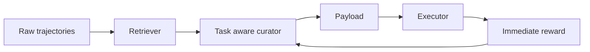
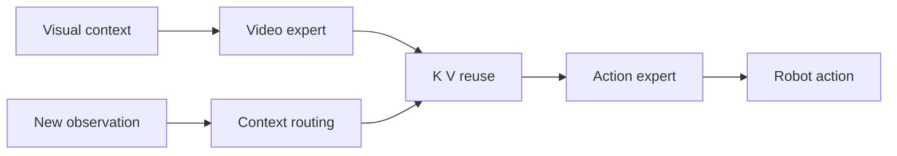
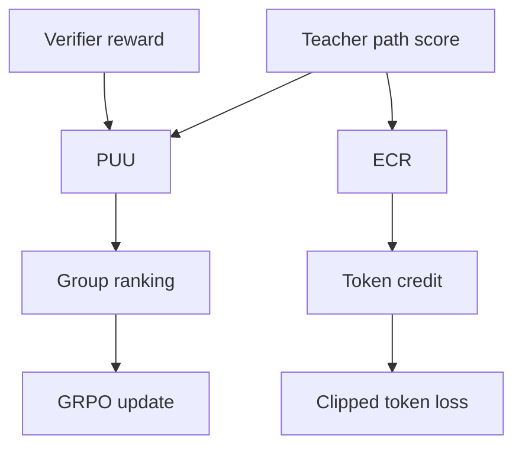
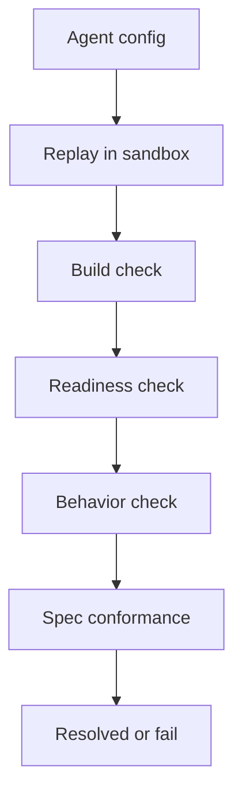
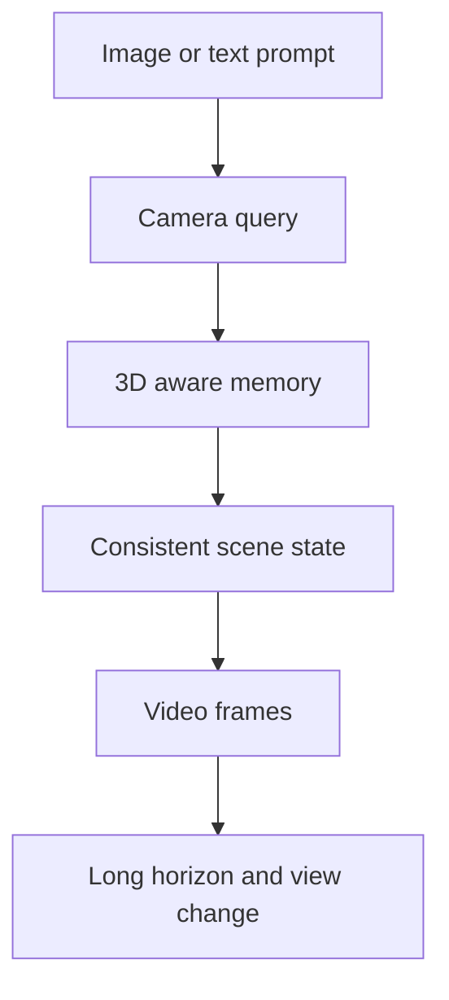
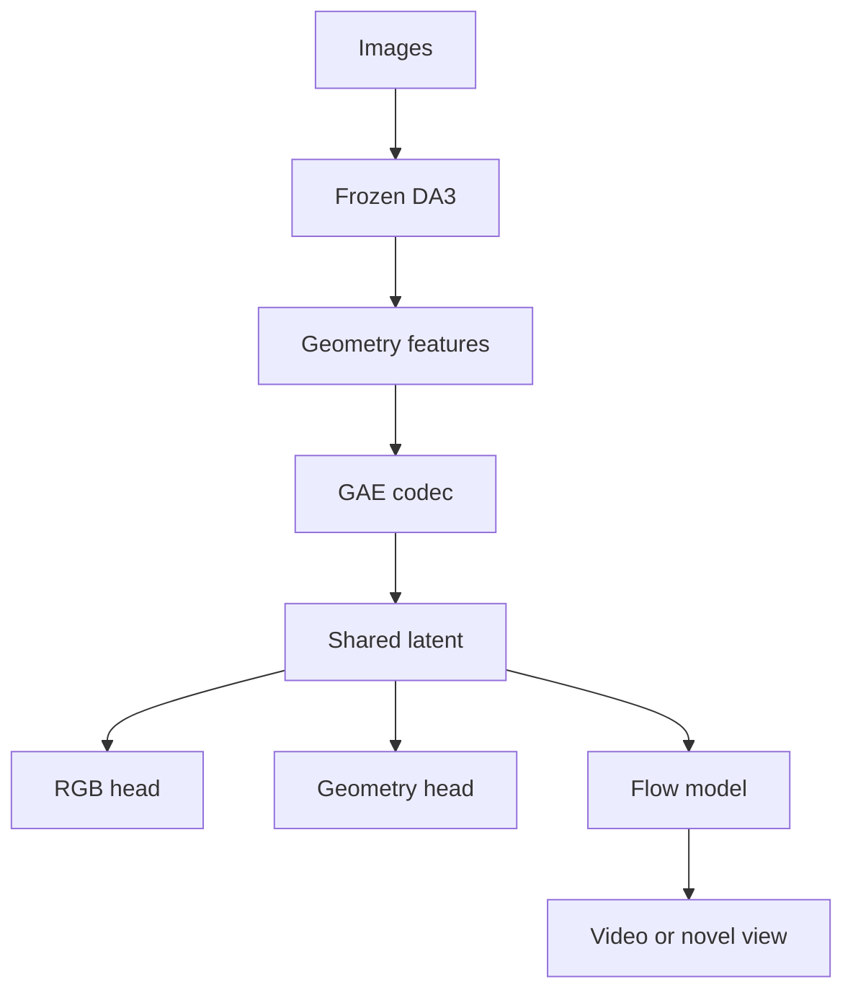
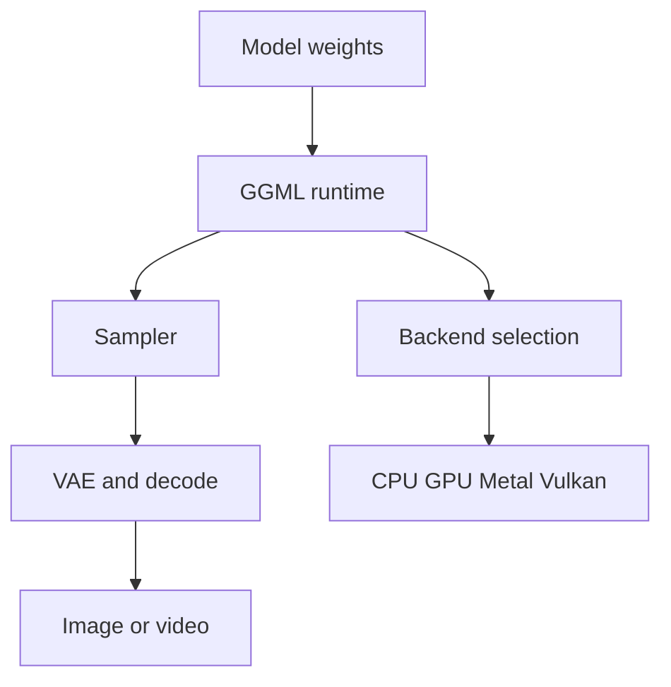
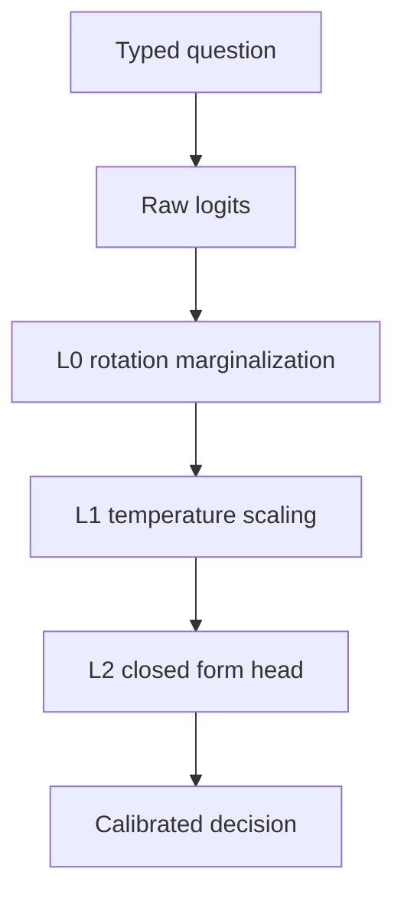
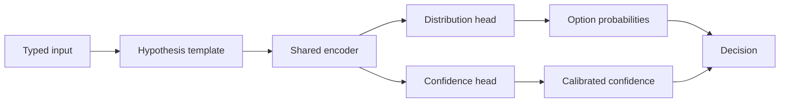
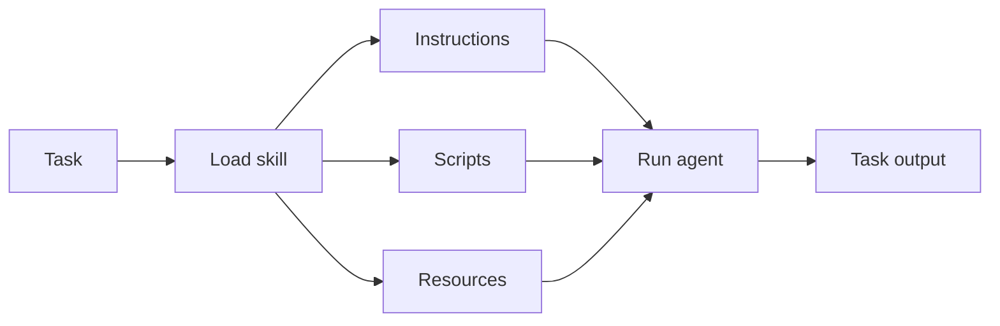

# Jarvis 日报 · 2026-09-24

候选 676 → 过滤后 288 → 入选 18。图例：⭐ 核心方向 · 🌐 全领域热点 · ✅ 已掌握前置 · 🔲 需补前置

## 📄 论文 · 核心方向

### 1. ⭐ 📄 Bellman Policy Optimization
arXiv [2609.15987](https://arxiv.org/abs/2609.15987) · HF 🔥 27 · Zhuoqing Song, Haotian Xu, Xikun Zhang 等 · [PDF](https://arxiv.org/pdf/2609.15987)

**一句话**：BPO 用 Bellman 重写 PMD，免 value model，AIME 平均提到作者报告峰值。
**为什么值得你看**：RLVR 训练稳定性和 GRPO 替代路线，面试很常问。

**核心架构**：反直觉点是：做 RLVR 时，最麻烦的不只是 reward 稀疏，而是每个中间 token 的 value/advantage 还得估，训练一个 critic 又吃显存又容易在推理题上漂。现有 GRPO 虽然免 critic，但本质还是用组内归一化优势加 PPO 式比率，和 PMD 的最优更新并不完全同构。作者的关键改动是把 terminal reward 下的 Bellman equations 用来展开 PMD，把每步 advantage 变成相邻状态 value 差，沿整条 response telescoping 后只剩终值和起始值；这样组件层上直接阻断了“中间状态价值估计误差”这条失败路径。最直接的证据是 Figure 1：在同一条 Qwen3-30B-A3B-Base、DAPO-Math-17k、400 steps 的设置下，BPO 的均值曲线压过 GRPO-ClipHigher、GSPO、CISPO、DPPO，说明不是只改了稳定项，而是新的 trajectory-level 目标真在优化上更有效。新意主要在组件层与目标重写层，不是单纯换个 loss 超参。

- 强证据：同设定下曲线优于四个 RLVR 基线
- 未证明对非 terminal reward 场景同样成立
- 实践版依赖平滑比率近似，复现细节偏多
**精读价值**：适合精读，重点看 PMD 到 trajectory loss 的推导。
**关联**：[[GRPO]]、[[PPO]]
#rl #llm #policy-optimization · 难度：硬核 · 建议：建议精读
前置：🔲 [[GRPO]] · 🔲 [[PPO]] · ◽ Policy Mirror Descent · ◽ Bellman equations


<sub>打分理由：面向终止奖励的BPO，强化学习后训练强相关。（core 10 / wide 7）</sub>

### 2. ⭐ 📄 Just-in-Time Memory: Learning to Curate Task-Adaptive Memory for LLM Agents
arXiv [2609.27334](https://arxiv.org/abs/2609.27334) · HF 🔥 31 · Yefan Zhou, Yang Li, Zeyu Leo Liu 等 · [PDF](https://arxiv.org/pdf/2609.27334)

**一句话**：JitMem 把记忆整理挪到 read time，ALFWorld 提升 16.2 点。
**为什么值得你看**：Agent memory 设计题，和 memory / RAG / credit assignment 很相关。

**核心架构**：问题不是“要不要记”，而是“何时把经历压成可复用记忆”。传统写时记忆在任务结束时就把轨迹压成 reflection、workflow 或 skill，等于提前猜未来查询会需要什么；一旦摘要丢掉细节，后面相关任务再来就救不回，而且同一条轨迹对不同任务可能要提炼出完全不同的 lesson。作者的关键改动是把 raw trajectories 先完整存起来，等当前任务到了再 read time curation：检索到的 traces 和当前 task 一起喂给 curator，输出一个 task-adaptive payload。这个组件阻断的是“写时就做不可逆压缩”和“一个摘要服务所有未来查询”这两类失败。最直接证据是同一训练/推理框架下，JitMem 在 ALFWorld、WebShop、τ^2-bench 都超过最强 baseline，且即使 untrained curator 也已经很强，说明收益主要来自 read-time curation 本身，不只是 RL 训练。新意在系统组织层：把记忆存储、整理、使用的时序重排了。

- 强证据：untrained curator 也能超过多种写时方法
- 作者报告最高提升 16.2、16.3、3.9 点
- 训练信号依赖 same-task success，任务泛化边界要看检索质量
**精读价值**：值得看，核心是记忆时序重排而非新模型。
**关联**：[[ReAct]]、[[retrieval-augmented generation]]
#agent #memory #rlhf #curation · 难度：中等 · 建议：值得通读 (20 min)
前置：🔲 [[memory]] · 🔲 [[retrieval-augmented generation]] · 🔲 [[GRPO]] · 🔲 [[planning]]


<sub>打分理由：JIT 记忆整理，和 agent 研究高度相关（core 9 / wide 6）</sub>

### 3. ⭐ 📄 InternW0: A Foundational Physical World Model for Efficient Real-World Interactions
arXiv [2609.27656](https://arxiv.org/abs/2609.27656) · HF 🔥 4 · Jisong Cai, Yao Mu, Ganlin Yang 等 · [PDF](https://arxiv.org/pdf/2609.27656)

**一句话**：InternW0 用异步视频-动作 world model 做实物交互，训练约 7200 小时数据。
**为什么值得你看**：你做 VLA/机器人/世界模型，这篇是系统级架构思路。

**核心架构**：反直觉点是：真实物理交互里，光会预测未来画面还不够，因为动作更新更快，等你每次都重生一遍未来再决定下一步，控制就慢半拍了。现有统一 world model 往往把视频预测和动作生成绑在同一频率上，既贵又跟不上接触、力反馈这类快信号。作者的关键改动是 asymmetric video-action architecture：高容量 video expert 负责长时域预测，轻量 action expert 负责快频控制；中间靠 layerwise K/V 复用和 observation-conditioned context routing，把“重新算未来”改成“用新观测修正已有上下文”，从而阻断了高频控制被低频预测拖慢的失败路径。最直接的证据是他们把这一套放到模拟和真实科学任务里，包含 15 步 MOF 合成和 5 步力觉灵巧操作；这类任务最能检验“预测要能来得及影响执行”，而不是只会离线预测。新意主要在系统组织层和运行时机制，不是单纯加更多模态。

- 强证据：面向真实科学流程和接触操作，不只模拟榜单
- 作者报告约 7200 小时数据训练
- 原文未明确公开完整代码与权重，复现门槛偏高
**精读价值**：适合速览后再决定精读，重点看异步控制机制。
**关联**：[[RT-2]]、[[VLA]]
#embodied #world-model #robotics #video-action · 难度：硬核 · 建议：值得通读 (20 min)
前置：🔲 [[vision transformer]] · 🔲 [[flow matching]] · 🔲 [[vision-language-action]] · 🔲 [[KV cache]]


<sub>打分理由：物理世界模型+可行动预测，面向真实交互。（core 9 / wide 4）</sub>

### 4. ⭐ 📄 EmbodiedSWE: Coding Agents for Long Horizon Dexterous Robotics
arXiv [2609.27308](https://arxiv.org/abs/2609.27308) · HF 🔥 2 · Haoxiang You, Zeyu Shen, Yilang Liu 等 · [PDF](https://arxiv.org/pdf/2609.27308) · [代码](https://github.com/EmbodiedSWE/EmbodiedSWE) ★36

**一句话**：We study coding agents for long-horizon, dexterous robotics and ask whether their solutions can provide scalable supervision for learning general robot policies
**为什么值得你看**：（dry-run：未调用 LLM，配置 OPENAI_API_KEY 后会生成中文速览）
- To test this, we develop EMBODIEDSWE-BENCH, a simulation benchmark for coding agents spanning contact-rich manipulation,
- We find that frontier coding agents can solve complex long-horizon tasks and transfer prior solutions across both tasks 
#embodied #coding-agent #robotics #benchmark · 难度：中等 · 建议：看速览即可
<sub>打分理由：长时域具身编码智能体+新bench，和你方向高度一致。（core 9 / wide 4）</sub>

### 5. ⭐ 📄 The Capability Manifold and ML Scaling Laws
arXiv [2609.27588](https://arxiv.org/abs/2609.27588) · Syed Ali Raza Zaidi, Maryam Hafeez · [PDF](https://arxiv.org/pdf/2609.27588)

**一句话**：Existing machine learning (ML) scaling laws relate predictive loss to compute, model parameters, and data
**为什么值得你看**：（dry-run：未调用 LLM，配置 OPENAI_API_KEY 后会生成中文速览）
- However, as models are increasingly deployed through agentic harnesses, loss alone is insufficient to characterize downs
- Yet, no unified framework connects such capabilities to the coupled resources available across the ML lifecycle
#scaling-laws #capability #evaluation · 难度：中等 · 建议：看速览即可
<sub>打分理由：能力流形与缩放定律，极利于面试/研究框架构建。（core 9 / wide 8）</sub>

### 6. ⭐ 📄 Agent-Editing World Model: Rethinking World Modeling for LLM Agents
arXiv [2609.28416](https://arxiv.org/abs/2609.28416) · Shuang Sun, Guoxin Chen, Fanzhe Meng 等 · [PDF](https://arxiv.org/pdf/2609.28416)

**一句话**：Recent advances in large language models (LLMs) have enabled agents to tackle long-horizon tasks across diverse environments
**为什么值得你看**：（dry-run：未调用 LLM，配置 OPENAI_API_KEY 后会生成中文速览）
- To further improve agent performance, existing language world models typically predict environment observations, yet rec
- Meanwhile, agents suffer from \emph{task-state contamination}, where unsupported assumptions and outdated plans persist 
#agent #world-model #planning · 难度：中等 · 建议：看速览即可
<sub>打分理由：面向工具反馈的世界模型，agent机制核心（core 9 / wide 7）</sub>

### 7. ⭐ 📄 When and Where to Trust the Teacher: Unifying On-Policy Distillation and GRPO through Entropy-Calibrated Credit Assignment
arXiv [2609.28385](https://arxiv.org/abs/2609.28385) · Jie Zhang, Jingxiao Yang, Zhehao Huang 等 · [PDF](https://arxiv.org/pdf/2609.28385)

**一句话**：UECR-GRPO 用 1 个 GRPO 更新统一本体与教师信号，Qwen3-4B 提升 0.56 点
**为什么值得你看**：你做 RLVR/后训练时会遇到它

**核心架构**：反直觉点在于：verifier 只知道“对不对”，teacher 只知道“像不像好轨迹”，两者各自都能把组内相对排序搞歪：前者让整条回答共享同一 advantage，后者又可能偏向错误但流畅的路径。作者把关键改变放在“credit 怎么分”而不是“再加一个 loss”：PUU 先把 verifier reward 和 teacher-to-anchor 的 path log-ratio 放进同一个 KL 目标里，阻断 teacher 只能在 group-normalization 之后补丁式介入、因而无法影响 response ranking 的失败；ECR 再用 teacher-old-policy 的 signed gap 做 token 级重分配，并用 teacher entropy 抑制不确定指导，阻断 token 重加权后总 credit 漂移、把失败响应里的局部好 token 误抬成正样本的失败。最直接的证据是五个数学推理基准上的平均提升：Qwen3-1.7B / 4B 分别比最强 baseline 高 0.89 / 0.56 个百分点，而且他们专门报告 teacher 能区分大量 verifier-degenerate 组、但与 correctness 有 39.1–50.8% 冲突，说明“只信 teacher”确实不行。新意主要在组件层，把 response-level 选择和 token-level credit redistribution 放进一个统一更新里。

- 最强证据是五基准平均涨幅，不是单点 SOTA
- 没证明 teacher 何时会系统性误导
- 实现要同时管 response 排序与 token 归因
**精读价值**：适合想讲清 GRPO 变体设计的人精读
**关联**：[[GRPO]]、[[PPO]]
#rl #on-policy-distillation #grpo · 难度：硬核 · 建议：建议精读
前置：🔲 [[GRPO]] · 🔲 [[reward model]] · 🔲 [[on-policy distillation]] · ◽ KL regularization


<sub>打分理由：统一OPD与GRPO的熵校准归因，后训练关键（core 9 / wide 7）</sub>

### 8. ⭐ 📄 FDE-Bench: Evaluating LLM Agents for Deployment Environment Configuration
arXiv [2609.27571](https://arxiv.org/abs/2609.27571) · Weihang Ding, Junfei Zhan, Yueting Li 等 · [PDF](https://arxiv.org/pdf/2609.27571)

**一句话**：FDE-Bench 用 136 任务评测部署配置 agent，最高解 75.0%
**为什么值得你看**：很适合做 agent 评测/DevOps 面试谈资

**核心架构**：它解决的是一个常被高估的场景：代码能跑测试，不等于能在 Docker、Compose、Kubernetes 里真正起服务、连依赖、过健康检查、还符合部署规范。作者的关键改法不是再做一套“生成配置”的榜单，而是把评测对象锁定为 deployment artifact 本身：agent 提交 declarative 配置，系统在干净环境里重建、重部署，再用四层 gated binary checks 依次卡 build、readiness、behavior、spec conformance，阻断“只写个能过语法的 manifest”或“靠健康探针钻空子”的失败。最直接的证据是他们专门放了 three zero-intelligence floors 和三种 adversarial shortcut，全部解决不了任务；同时 7 个模型共用同一 four-tool scaffold，在 136 题上做到 52.9–75.0% resolved rate，且 readiness 是最大失败阶段，说明瓶颈确实在运行时而不只是文本生成。新意在系统组织层：把 replay grading、四层闸门、release gate 和污染控制组合成一个可复查的部署评测协议。

- 四层闸门把 build 到 conformance 分开卡住
- 最强证据是 zero-intelligence floors 全失败
- 难点在运行时与评测协议，不是写配置文本
**为什么现在上榜**：原文未明确
**精读价值**：想评估 deployment agent，值得通读
**关联**：[[SWE-bench]]、[[OSWorld]]
#agent #evaluation #deployment · 难度：中等 · 建议：值得通读 (20 min)
前置：🔲 [[SWE-bench]] · ◽ agent · ◽ Docker · ◽ Kubernetes


<sub>打分理由：LLM agent评测基准，部署任务高度贴合（core 9 / wide 7）</sub>

## 🧰 项目 · 核心方向

### 9. ⭐ 🧰 TencentARC/WorldCrafter
[GitHub](https://github.com/TencentARC/WorldCrafter) ★344 · Python

**一句话**：WorldCrafter 用隐式 3D memory 做可控视频世界模型，含 Base 和 Fast
**为什么值得你看**：你做 VLM/视频生成/世界模型会很对口

**核心架构**：它解决的是视频世界模型里最烦的悖论：单帧看起来对，换个视角或拉长时间就开始漂、抖、忘细节。WorldCrafter 的硬核点是把“记忆”做成 camera-queryable 的 implicit 3D-aware memory：不是把历史帧简单堆起来，而是让记忆能按相机位置被查询，从而把跨视角的一致性和长程连续性绑定到同一套状态里，阻断“局部纹理对了但几何关系丢了”的崩坏。仓库里最能说明成熟度的是它不只给 Base，还给了 distill 出来的 Fast，且 README 明确提供 uv/conda、权重下载、i2v/t2v 推理命令和 interactive demo；不过 demo 仍写着“currently being debugged”，说明可用但还没到完全打磨好的产品级。相较于纯视频生成项目，它的差异维度在 3D-aware memory 和 camera control，不只是更会补帧。

- Fast 是蒸馏版，主打更快推理
- demo 还在调试，成熟度不是完全成品
- 核心卖点是相机可查询的 3D-aware memory
**为什么现在上榜**：仓库新增/公开于 2026 年 9 月，当前 stars 344，README 已放出 Base/Fast 权重与推理脚本
**精读价值**：对世界模型路线感兴趣，值得上手看
**关联**：[[Helios]]、[[LagerNVS]]
#world-model #video #3d-aware #arxiv · 难度：中等 · 建议：值得通读 (20 min)
前置：🔲 [[video generation]] · 🔲 [[diffusion model]] · 🔲 [[latent diffusion]] · ◽ 3D


<sub>打分理由：一致视频世界模型，贴合世界模型方向（core 8 / wide 6）</sub>

### 10. ⭐ 🧰 TencentARC/GAE-GeometricAutoEncoder
[GitHub](https://github.com/TencentARC/GAE-GeometricAutoEncoder) ★287 · Python

**一句话**：GAE用共享latent解码RGB+几何，作者报告可做3D一致世界生成
**为什么值得你看**：适合看多模态生成和3D一致性怎么做

**核心架构**：它瞄准的悖论是：生成视频/新视角时，RGB看着对了，几何却一漂就崩；把几何放在 latent 外面补救，通常只会让两套表征互相打架。GAE 的关键改动是把 3D inductive bias 放进生成状态本身：先用冻结的 Depth Anything 3 提取多层几何特征，再压成 per-view latent，随后同一个 latent 同时解码出 RGB 和 depth/rays/pointmap，避免“图像一套表示、几何另一套表示”导致的错配。最直接的证据是它在 codec bottleneck 上同时加了 `L_tok` 和 `L_struct`：前者把 posterior token 对齐到 C-RADIOv2.5-B，保证可生成；后者在 raw posterior mean 上匹配 DINOv2-L 的 patch 相似度，专门补回 token-only 对齐会抹掉的跨视图空间结构。新意主要在组件层和系统组织层：冻结几何头、双解码头、再把 clean reference latents 和 Plücker rays 作为条件输入，形成一个统一的生成状态。

- 几何头冻结，迫使 latent 保持可读性
- L_struct 直接约束 raw posterior mean
- 复现要同时跑 codec、flow 和几何评估
**精读价值**：值得看其 latent 里塞几何的设计，不必先精读
**关联**：[[Depth Anything]]、[[REPA]]
#3d-consistency #autoencoder #world-generation #vae · 难度：硬核 · 建议：值得通读 (20 min)
前置：🔲 [[VLM]] · 🔲 [[diffusion model]] · 🔲 [[latent diffusion]] · 🔲 [[vision transformer]]


<sub>打分理由：几何原生潜空间，利于3D一致生成（core 8 / wide 6）</sub>

### 11. ⭐ 🧰 leejet/stable-diffusion.cpp
[GitHub](https://github.com/leejet/stable-diffusion.cpp) ★7,212 (+69 今日) · Trending daily · infra · C++

**一句话**：stable-diffusion.cpp用纯C/C++跑主流扩散模型，近期加Qwen-Image-2.1
**为什么值得你看**：适合看推理加速和跨平台部署

**核心架构**：它解决的是“模型能跑，但只能在 Python 生态和高配 GPU 上跑”的部署痛点。核心做法不是再包一层接口，而是用 ggml 风格的纯 C/C++ 推理内核，把 diffusion 的采样、VAE、LoRA、量化、不同 backend 统一进同一个可执行体里，目标是低依赖、跨平台、可控内存。关键设计取舍是把能力下沉到运行时：支持 CPU/CUDA/Vulkan/Metal/OpenCL/SYCL，多种 sampler、Flash Attention、VAE tiling、GGUF/ckpt/safetensors 转换，阻断的是“模型格式杂、平台杂、显存不够就跑不动”的失败模式。最强证据不是宣称，而是它已经在 README 列出多个近期大模型的 Day-0/Day-1 支持，并给出 release 节奏；这说明项目成熟度高、跟进速度快。它在系统组织层的新意大于算法新意。

- 近期持续跟进新模型支持
- README 有 backend、量化和 build 文档
- 不证明训练，只证明推理栈成熟
**为什么现在上榜**：最近 release：master-908-88411ef（2026-09-23）; master-907-500ef5f（2026-09-23）; master-906-2a4ebba（2026-09-23）
**精读价值**：看它怎么把扩散推理工程化，值得关注
**关联**：[[llama.cpp]]、[[stable-diffusion-webui]]
#diffusion #inference #cpp · 难度：中等 · 建议：值得通读 (20 min)
前置：🔲 [[diffusion model]] · 🔲 [[quantization]] · 🔲 [[flash attention]] · 🔲 [[KV cache]]


<sub>打分理由：扩散推理加速/实现，工程可复现（core 7 / wide 7）</sub>

### 12. ⭐ 🧰 nokia-applied-research/AnyJev
[GitHub](https://github.com/nokia-applied-research/AnyJev) ★495 · tool · Python

**一句话**：AnyJev把任意LLM变成可校准决策器，L0把可自动决策率提到52.0%
**为什么值得你看**：适合面试讲决策校准和agent路由

**核心架构**：它解决的不是“让模型更会答”，而是“让模型的置信度真的能拿来做决策”。原始 logits 最大的问题是选项一换顺序就翻答案，且 0.9 的分数不对应可行动的风险。AnyJev 的关键改动是把回答改成 typed decision：先用 `Question` 定义 choice/score/noul，再用分层读出把“答案”和“校准”拆开。L0 用 cyclic-shift permutation marginalization 抵消位置偏置，再做 label-free prior correction，阻断的是“选项顺序导致的假偏好”；L1 在 L0 上做 temperature scaling 解决概率偏热/偏冷；L2 则在约 2/3 深度的 hidden state 上，用少量标签拟合 closed-form head，阻断的是“概率可用但成本过高”。最直接的证据是 BANKING77 上，作者报告 auto-decidable at ≤5% error 从 raw logits 的 7.7% 提到 L1 的 52.0%，说明改进主要发生在可部署性而不是只涨 accuracy。新意在系统组织层：同一模型、同一 prompt，按 L0/L1/L2 分级服务。

- L0 零标签就能降 option reversal
- L2 只需100-300标签且闭式求解
- 只证明校准与路由，不改模型能力
**为什么现在上榜**：最近 release：v0.0.2（2026-09-21）
**精读价值**：很适合读决策校准这条线，值得通读
**关联**：[[Jevons paradox]]、[[temperature scaling]]
#agent #decision-model #calibration · 难度：硬核 · 建议：值得通读 (20 min)
前置：🔲 [[reward model]] · ◽ temperature scaling · 🔲 [[next-token prediction]] · ◽ calibration


<sub>打分理由：无训练把LLM变决策模型，方法有研究性（core 7 / wide 6）</sub>

### 13. ⭐ 🧰 ekzhang/openjev-sglang
[GitHub](https://github.com/ekzhang/openjev-sglang) ★320 · infra · Python

**一句话**：用 SGLang 做 Jev API，单 token 读出实现 N+1 次评分
**为什么值得你看**：适合看 agent/RAG 的结构化输出与推理服务

**核心架构**：它解决的是“同一个对话上下文里要连续回答多种 typed question，却不能让模型真的长篇生成”的悖论。传统做法要么把每个问题单独跑一遍，要么让模型生成可解析文本，都会把 prefix 计算、缓存和解析成本放大。作者把关键概念改成“prefill-only + first-token readout”：先把共同 chat prefix 只渲染/分词一次，再用 radix cache 暖一次前缀；每个问题只送 `prefix + suffix + assistant header + Answer:`，`max_new_tokens=1`，再读取 label 的 logprob 做 Noul/Choice/Score。这样阻断的是长续写、重复前缀和 prompt 解析失败三种失效。最直接的证据是 smoke test 覆盖三类答案、64 选项和 65 选项拒绝，并报告 startup wait、latency 与 cache 命中；这支持它不是“能跑 demo”，而是围绕 SGLang cache 和 API 容错做过系统组织。新东西主要在系统组织层，不是模型层。

- 最强证据：N+1 一 token 调用支撑多题评分
- 没证明大并发下的极限吞吐
- 复现依赖 SGLang 细节与 Modal 部署
**精读价值**：值得看部署与缓存设计，不必深挖模型本身
**关联**：[[SGLang]]、[[vLLM]]
#agent #structured-generation #api · 难度：中等 · 建议：值得通读 (20 min)
前置：◽ SGLang · 🔲 [[KV cache]] · ◽ logprob · ◽ FastAPI


<sub>打分理由：提供Jev兼容结构化生成端点，利于部署（core 7 / wide 6）</sub>

### 14. ⭐ 🧰 Heman10x-NGU/openJev-verdict-2.0
[GitHub](https://github.com/Heman10x-NGU/openJev-verdict-2.0) ★285 · model · Python

**一句话**：用 149.6M 模型做非自回归决策，77.1% 准确率
**为什么值得你看**：适合看校准头、typed decision 和推理时取舍

**核心架构**：它解决的是“分类系统既要准，又要给出可用置信度，还不能被解析型生成拖慢”的冲突。常见做法把所有任务都塞进同一分布头，结果概率要么贴近人工软标注但校准差，要么为了命中率变尖锐却失真。作者的关键改变是把输出拆成双通道：distribution head 负责贴近候选分布，confidence head 负责预测 correctness 的校准概率；再配合 NLI 式模板把候选从裸名词改成 hypothesis sentence，避免 backbone 和输入形式错配。最直接的证据是 2,000 held-out 任务上，149.6M 模型以 77.10% accuracy、0.0636 Brier、0.0144 ECE 超过 421M 的 Laya，且 20–25 ms/decision，说明收益来自机制而不只是参数。它的新意主要在系统组织层和实证层：模型结构不大，但推理接口与校准拆分很明确。

- 最强证据：小模型在准确率和 Brier 上同时赢大模型
- 没证明跨任务泛化到非 typed schema
- 复现要同时对齐校准、模板和阈值
**精读价值**：值得精读校准拆分与推理接口设计
**关联**：[[GLiClass]]、[[ModernBERT]]
#rl #decision-engine #calibration #nonautoregressive · 难度：中等 · 建议：建议精读
前置：◽ calibration · ◽ NLI · ◽ Brier score · ◽ ECE


<sub>打分理由：决策引擎+校准，方法细节较硬（core 7 / wide 4）</sub>

## 🌐 全领域热点

### 15. 🌐 🧰 anthropics/skills
[GitHub](https://github.com/anthropics/skills) ★177,964 (+158 今日) · Trending daily · skill · Python

**一句话**：用 Skills 动态加载任务包，Anthropic 开源示例超 17 万星
**为什么值得你看**：适合看 agent 工程化：记忆、工具和任务分层

**核心架构**：它解决的是“agent 能做很多事，但每次都把全部能力塞进上下文会又慢又乱”的问题。传统 prompt 或单一 toolset 很难把任务边界、文件资源和操作规范隔离开。这里的关键概念是 skill：一个技能包把 instructions、scripts、resources 打成可动态加载的目录，模型只在需要时装载；这样阻断的是上下文膨胀、任务互相污染和操作步骤不稳定。仓库里把 document、pdf、pptx、xlsx 等生产技能和示例技能拆开，README 还明确给出 Claude Code、Claude.ai、API 的接入方式，说明它不是只讲概念。最直接的成熟度信号是官方仓库、清晰的 spec/template 目录和多入口文档，但 README 也明确说示例行为可能与 Claude 线上实现不同，所以它证明的是标准化思路，不是实现完全一致。它的新意主要在系统组织层：把 agent 能力做成可装配单元。

- 最强证据：官方 repo + spec + template 三件套
- 没证明线上 Claude 行为与示例完全一致
- 复现门槛低，但能力上限取决于技能设计
**为什么现在上榜**：原文未明确
**精读价值**：看技能封装范式即可，适合做 agent 工程参考
**关联**：[[MCP]]、[[ReAct]]
#agent #skills #anthropic · 难度：入门 · 建议：值得通读 (20 min)
前置：◽ agent · 🔲 [[MCP]] · 🔲 [[planning]] · 🔲 [[memory]]


<sub>打分理由：权威agent技能仓库，热度高（core 5 / wide 9）</sub>

### 16. 🌐 🧰 obra/superpowers
[GitHub](https://github.com/obra/superpowers) ★291,162 (+606 今日) · Trending daily · tool · Shell

**一句话**：用可组合 skills 把 coding agent 变成带审查的开发流程，v6.4.1 新增诊断与原生执行
**为什么值得你看**：做 Agent/RAG 面试时能讲“循环+中间件”

**核心架构**：它解决的不是“让模型会写代码”，而是“模型一旦开始写就跳过需求、计划和测试，最后把错误一路放大”的悖论。Superpowers 的关键改法是把 coding agent 绑进一套自动触发的 skills：先逼它抽 spec，再分块复述让人确认，再产出可执行计划，最后进入 subagent-driven execution；这里每个组件都在阻断一种失败，像 spec 阻断目标漂移，chunked review 阻断人类看不完，plan 阻断无测试乱改，subagent 阻断单线程瞎冲。正文里最直接的支持是它把“诊断 session 出错原因”做成新 skill，并把 executing-plans 重构为 Native execution，说明作者不是只加提示词，而是在补运行时机制。新意主要在系统组织层：把开发方法论做成会自动触发、可诊断、可替换执行器的 agent 工作流。

- 最强证据是 v6.4.1 加了诊断 skill 和 Native execution
- 没看到完整测试/评测，效果更多靠流程设计
- 复现门槛低，核心是装到支持的 harness 里
**精读价值**：适合看它怎么把 agent 失控点逐个封住
**关联**：[[ReAct]]、[[MCP]]
#agent #framework #skills · 难度：中等 · 建议：值得通读 (20 min)
前置：◽ agent · 🔲 [[planning]] · 🔲 [[memory]] · 🔲 [[ReAct]]

```mermaid
graph TD
A 触发会话
B 抽取 spec
C 分块确认
D 生成计划
E 子代理执行
F 诊断失败
A --> B --> C --> D --> E
E --> F --> B
```
<sub>打分理由：agent技能框架，热度高且可落地（core 6 / wide 8）</sub>

### 17. 🌐 🧰 BerriAI/litellm
[GitHub](https://github.com/BerriAI/litellm) ★59,561 (+602 本周) · Trending weekly · infra · Python

**一句话**：用统一 OpenAI 格式接 100+ LLM，做路由、限流和审计的 AI Gateway
**为什么值得你看**：你做 RAG/Agent 工程时最常见的生产入口层

**核心架构**：它解决的典型痛点是：同一套应用要同时接 OpenAI、Anthropic、Gemini、Bedrock 等模型时，SDK、鉴权、错误格式和计费全都不一样，代码会被 provider 细节撕碎。LiteLLM 的关键概念是把“模型调用”抽成统一 gateway：客户端只说 OpenAI 兼容请求，后端再做 provider mapping、cost tracking、guardrails、load balancing 和 logging；这些组件分别阻断接口碎片化、预算失控、越权输出和流量打爆单点。正文里最强的证据是它明确给出 100+ providers、OpenAI 格式、8ms P95 latency at 1k RPS，以及 Docker 镜像用 cosign 签名，说明它不是 demo，而是能进生产的入口层。新意主要在系统组织层，少量实现在 runtime proxy 和 SDK 兼容层，而不是新模型。

- 最强证据是 100+ provider 统一到 OpenAI 格式
- 功能多但核心是 gateway，不是模型方法
- 复现主要是配置与鉴权，工程整合成本高
**为什么现在上榜**：最近 release：v1.104.0-dev.1、v1.102.1、v1.101.2，且正文更新到 2026-09-24
**精读价值**：值得扫一遍，适合做生产入口层选型
**关联**：[[OpenAI API]]、[[vLLM]]
#llm-gateway #inference #routing · 难度：入门 · 建议：值得通读 (20 min)
前置：◽ OpenAI API · 🔲 [[quantization]] · ◽ load balancing · ◽ guardrails

```mermaid
graph LR
A App
B OpenAI format
C Gateway
D Provider router
E Guardrails
F Logging
A --> B --> C --> D
C --> E --> F
D --> G Models
```
<sub>打分理由：LLM网关：路由/成本/guardrails，工程可用（core 6 / wide 8）</sub>

### 18. 🌐 🧰 OpenBMB/MiniCPM
[GitHub](https://github.com/OpenBMB/MiniCPM) ★11,252 (+1027 本月) · Trending monthly · model · Jupyter Notebook

**一句话**：MiniCPM5-2B/1B 把 on-device 小模型做到开源 SOTA，兼顾推理与 agentic 工具使用
**为什么值得你看**：和你关注的长上下文、工具调用、小模型后训练都强相关

**核心架构**：它解决的是“小模型一缩就掉推理、代码和工具用法”的老问题：在端侧算力和显存都紧的情况下，普通压缩路线往往把能力一起压没。MiniCPM5 的关键改法不是只堆参数，而是同一 checkpoint 里同时支持 `<think>` 的 hybrid reasoning，并配合 UltraData 系列数据、RL 和 OPD 训练；这里数据与训练分别阻断知识覆盖不足、对齐不稳和推理模式不可切换。正文里最直接的支持是作者报告 1B 和 2B 两个尺寸都做到开源 SOTA，且 2B 在 coding、math、long-context、tool use 和 agentic tasks 上更强，还开放了对应训练数据。新意主要在实证层，外加训练配方层：把端侧可部署性和 agent 能力一起做出来，而不是只报一个静态榜单。

- 作者报告 1B/2B 都是开源 SOTA
- 最强卖点是 hybrid reasoning 加工具能力
- 原文未明确完整训练细节和可复现实验脚本
**为什么现在上榜**：最近 release：5.0（2026-05-26）和 2.4.2（2025-07-01）
**精读价值**：如果关心小模型后训练，这条值得精读
**关联**：[[MiniCPM4]]、[[Phi-3.5]]
#vlm #on-device #llm · 难度：中等 · 建议：建议精读
前置：🔲 [[VLM]] · 🔲 [[LoRA]] · 🔲 [[GRPO]] · 🔲 [[retrieval-augmented generation]]

```mermaid
graph TD
A 端侧输入
B 预训练数据
C RL 与 OPD
D 思考模板
E 工具与代码能力
F 小模型输出
A --> B --> C --> D --> E --> F
```
<sub>打分理由：小模型SOTA取向，适合迁移与对比（core 6 / wide 7）</sub>

---
想精读哪一篇？在 Claude 里说：`精读 2026-09-24 第 N 条`，Jarvis 会按你的 known.md 只讲你不会的部分。