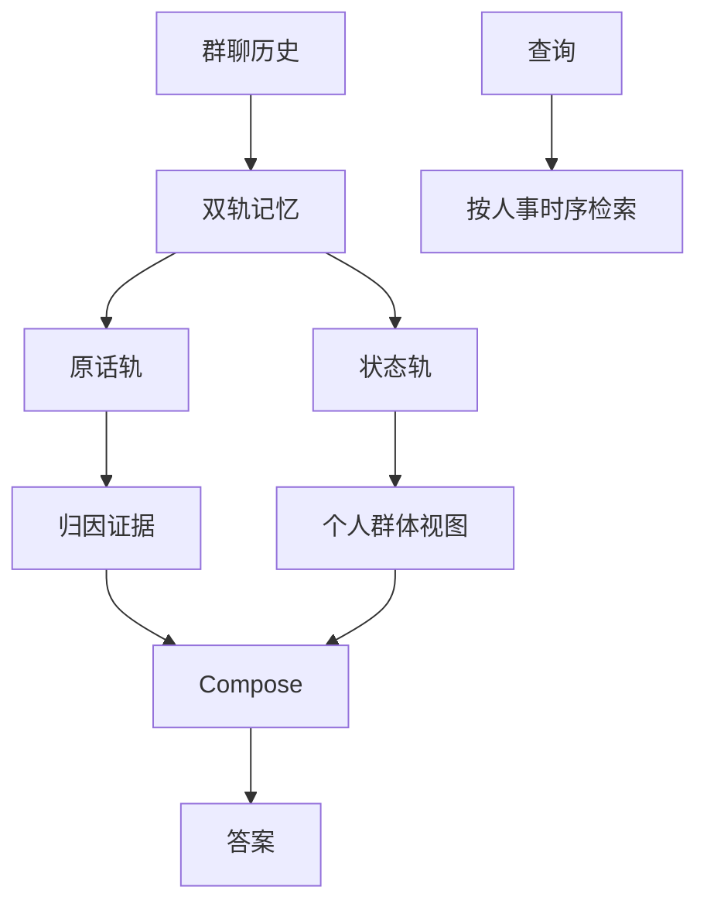
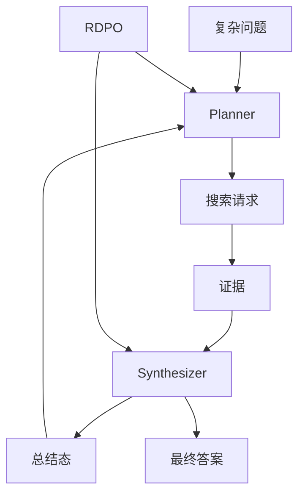
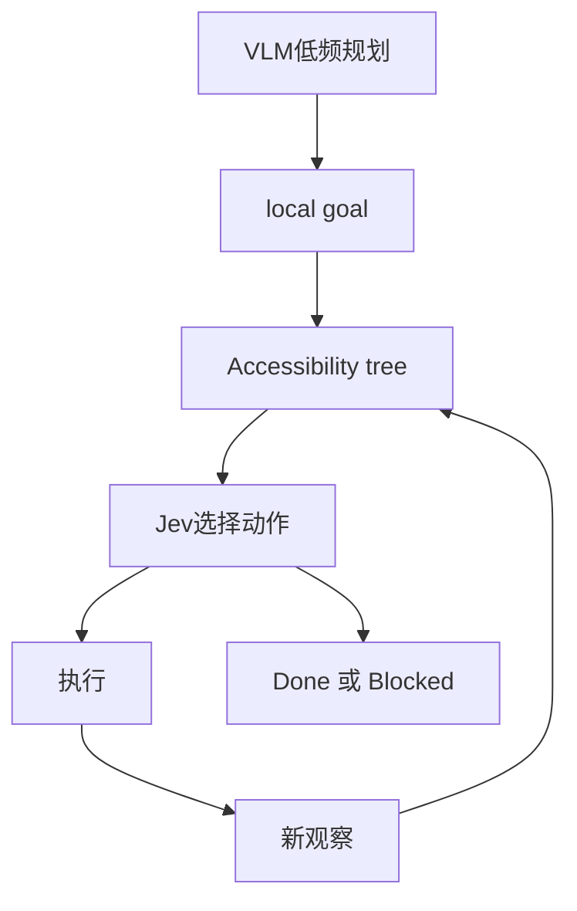
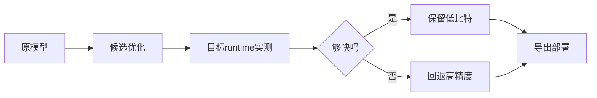
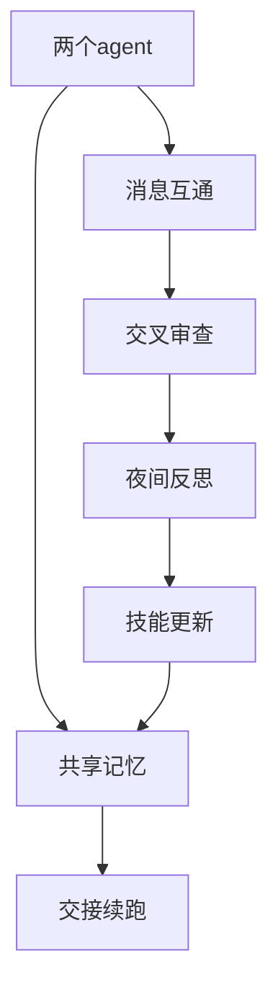
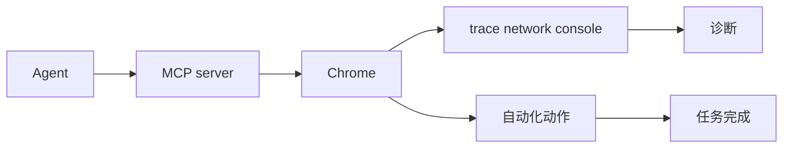
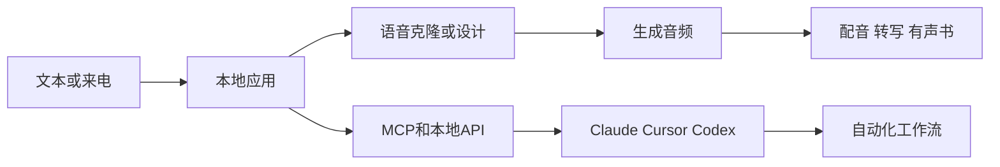
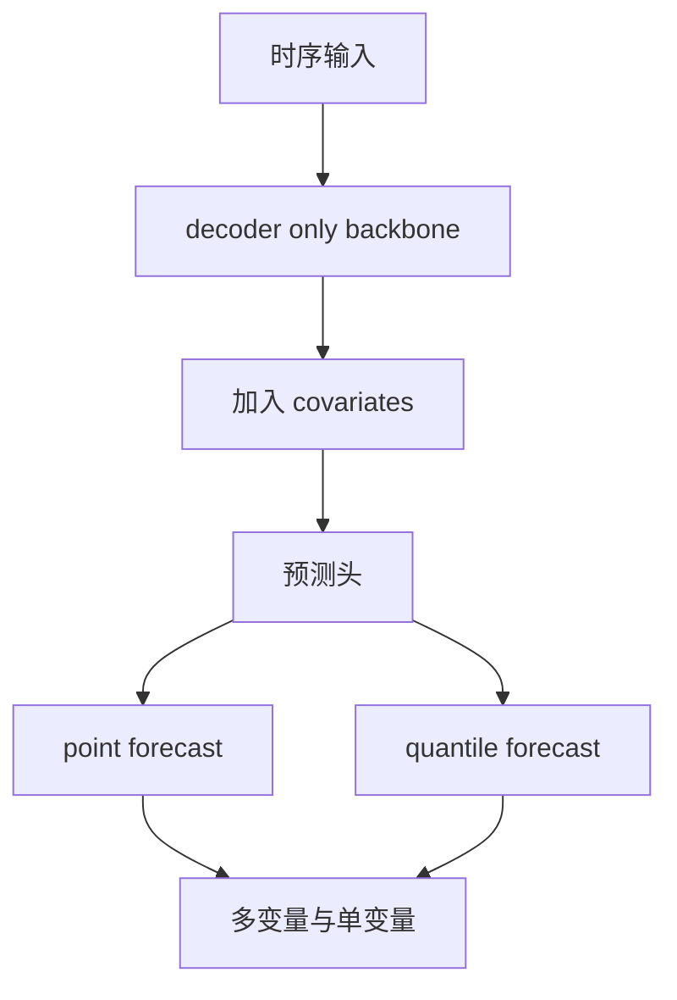
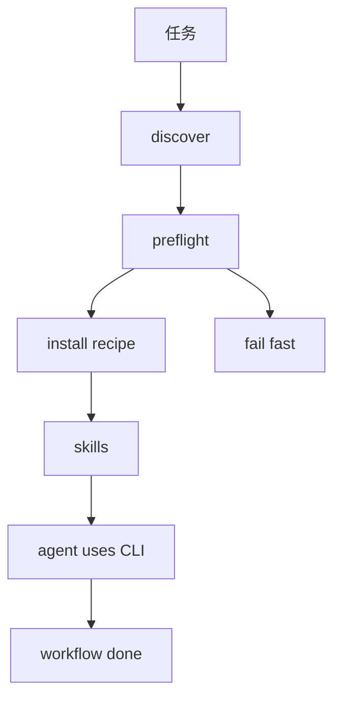

# Jarvis 日报 · 2026-09-25

候选 675 → 过滤后 285 → 入选 18。图例：⭐ 核心方向 · 🌐 全领域热点 · ✅ 已掌握前置 · 🔲 需补前置

## 📄 论文 · 核心方向

### 1. ⭐ 📄 SpeakerMem-R1: Speaker-Centered Dual-Track Memory for Multi-Party Dialogue
arXiv [2609.26780](https://arxiv.org/abs/2609.26780) · HF 🔥 82 · Haobo Zheng, Tan Tang, Yan Chen 等 · [PDF](https://arxiv.org/pdf/2609.26780) · [代码](https://github.com/2022hpsk/SpeakerMemR1) ★71

**一句话**：双轨记忆+定向Writer，三榜提分3.3/12.4/9.4
**为什么值得你看**：多轮对话 memory / agent 面试很对口

**核心架构**：它针对的悖论是：多方群聊里，最相关的话常常不是“主题最像”的那句，而是“谁说的、指向谁、发生在何时”这三类线索分散在不同轮次里；普通检索、摘要或通用 memory graph 会把说话人归属和群体/个人状态一起抹掉。作者的关键改变是把记忆拆成双轨：一轨存 speaker-labeled verbatim message，负责保留可追溯证据，阻断归因错误；另一轨存 derived state，并分 person-level / group-level 两种视角，负责阻断状态版本丢失。查询时再按 entity、event、time 做 Anchor–Separate–Resolve–Compose，把两轨证据拼回可回答的局部状态。最直接的证据是 controlled evaluation：冻结 query/answer pipeline 后，RL 把 Writer 的 mean accuracy 从 57.38% 提到 68.20%，说明提升主要来自写入侧而不是检索器“碰巧更会找”。新意主要在系统组织层，不只是换了一个 memory 格式。

- RL 只在写入侧提分，证明瓶颈在 attribution/update
- 只在多方对话强；两人边界测试不等于泛化
- 复现要同时做写入、查询和标准化评测
**精读价值**：适合精读，核心在记忆组织而非单纯检索
**关联**：[[MemGPT]]、[[MemoryBank]]
#memory #agent #dialogue #multi-agent · 难度：硬核 · 建议：建议精读
前置：🔲 [[retrieval-augmented generation]] · 🔲 [[memory]] · 🔲 [[GRPO]] · 🔲 [[multi-agent]]


<sub>打分理由：多方对话的说话人中心记忆，强贴合记忆与agent。（core 9 / wide 8）</sub>

### 2. ⭐ 📄 IterSynth: Rethinking Deep Search Agents via Role-Decoupled Iterative Synthesis
arXiv [2609.29444](https://arxiv.org/abs/2609.29444) · HF 🔥 8 · Xingyu Wu, Yuchen Yan, Zhengxi Lu 等 · [PDF](https://arxiv.org/pdf/2609.29444) · [代码](https://github.com/Tencent/IterSynth) ★4

**一句话**：IterSynth 用 Planner+Synthesizer+RDPO，8B 平均 50.7
**为什么值得你看**：深搜 agent 和 GRPO/RL 方向都很面试友好

**核心架构**：它先解决一个看似反直觉的问题：深度搜索不是“多搜几轮”就会更好，反而常见失败是一个 policy 同时管规划、证据使用和写答案，导致要么过早收束，要么历史越滚越乱。作者把单一 ReAct policy 改成两种角色：Planner 只负责从紧凑 state 里找信息缺口并发下一次查询，Synthesizer 只负责把新证据并入 evolving summary；summary 在这里不是外部压缩件，而是搜索的 persistent state，用来阻断上下文累积噪声。训练上，RDPO 把终局 reward 和 turn-level rubric 结合，并对不同角色分别算 advantage，解决“一个 credit assignment 硬分给所有步骤”的问题。最强证据是 BrowseComp、Xbench-DS 等五个长程基准上，IterSynth-8B 平均 50.7，超过最强先前 8B agent 4.2%；同时还在 frontier proprietary models 上零样本超过 ReAct，说明改的是 agent 组织方式，不只是某个开源模型特化。

- 最强证据是五个长程基准平均提升 4.2%
- 只对长链搜索友好，短任务未必值这个结构
- RDPO 依赖角色级奖励，复现比普通 GRPO 更复杂
**精读价值**：值得精读，核心是角色解耦的 agent 训练范式
**关联**：[[ReAct]]、[[Deep Research]]
#rlhf #post-training #recipe #agent · 难度：硬核 · 建议：建议精读
前置：🔲 [[ReAct]] · 🔲 [[planning]] · 🔲 [[memory]] · 🔲 [[group relative policy optimization]]


<sub>打分理由：开源后训练配方全链路细节，必读（core 9 / wide 7）</sub>

### 3. ⭐ 📄 Jev-Mobile: Jev as an Executor for Mobile GUI Agents
arXiv [2609.30186](https://arxiv.org/abs/2609.30186) · Linghua Zhang · [PDF](https://arxiv.org/pdf/2609.30186)

**一句话**：Jev-Mobile 让 VLM 少调度，多步执行，AndroidWorld 79%
**为什么值得你看**：移动端 GUI agent 的效率取舍很典型，适合看系统设计

**核心架构**：它要解决的痛点很直接：传统 mobile GUI agent 让 VLM 几乎每一步都做规划+动作 grounding，结果是延迟和 API 成本高；但把动作完全交给固定脚本又会卡在界面变化上。作者的核心设计是把高频执行从 VLM 中拆出去：VLM 只在低频时给 local goal 和精确文本，Jev 在 accessibility tree 定义的可执行 action space 里反复选动作，直到 DONE 或 BLOCKED。这里 accessibility tree 是“结构化候选空间”，负责阻断幻觉坐标和不可执行动作；Jev 是 typed decision model，负责在候选里做快速选择；每一步后重新 observation，防止旧节点 ID 在新界面上失效。最直接的证据是 AndroidWorld 全套上任务成功率 79%，接近 SeeAct-V 的 78%，而成功轨迹上的端到端时间和模型 API cost 分别比 Step-wise VLM 低 32.7% 和 73.4%。新意在系统组织层：把“谁负责思考、谁负责执行”拆开了。

- 成功率接近强 VLM baseline，但成本大幅下降
- 只覆盖 accessibility tree 可见动作，缺失控件会 BLOCKED
- 没有代码与权重，成熟度更像原型系统
**精读价值**：看速览够了；价值在效率而非新能力
**关联**：[[SeeAct]]、[[Mobile-Agent]]
#agent #vlm #inference · 难度：中等 · 建议：看速览即可
前置：🔲 [[VLM]] · ◽ accessibility tree · 🔲 [[planning]]


<sub>打分理由：移动GUI agent执行器架构，兼顾效率（core 9 / wide 6）</sub>

### 4. ⭐ 📄 When Can Agents Forget Their Reasoning? ICLR for Long-Horizon Agent Context Compression
arXiv [2609.29875](https://arxiv.org/abs/2609.29875) · Mingxuan Wang, Fei Luo, Bo Wang 等 · [PDF](https://arxiv.org/pdf/2609.29875)

**一句话**：Long horizon language model agents continually accumulate reasoning history, increasing context length and inference cost even after earlier decisions have been
**为什么值得你看**：（dry-run：未调用 LLM，配置 OPENAI_API_KEY 后会生成中文速览）
- Unlike static Chain of Thought compression, removing historical reasoning can change future actions and the resulting in
- We study when such reasoning can be safely forgotten
#agent #context #compression · 难度：中等 · 建议：看速览即可
<sub>打分理由：长上下文推理遗忘，面向agent实用压缩（core 9 / wide 6）</sub>

### 5. ⭐ 📄 LLM Agents Can Easily Tamper With Their Own Traces
arXiv [2609.30266](https://arxiv.org/abs/2609.30266) · Jeremy Qin, David Schmotz, Derck Prinzhorn 等 · [PDF](https://arxiv.org/pdf/2609.30266)

**一句话**：Asynchronous monitoring, incident investigations, and compliance audits primarily rely on agent traces to reconstruct what happened
**为什么值得你看**：（dry-run：未调用 LLM，配置 OPENAI_API_KEY 后会生成中文速览）
- These analyses assume that LLM agents cannot tamper with their own execution traces
- We show that local LLM agents such as Claude Code, Codex, Antigravity, Open Code and Grok Build fail to enforce this bou
#agent #safety #audit · 难度：中等 · 建议：看速览即可
<sub>打分理由：agent可篡改自家traces，安全与可审计核心（core 9 / wide 8）</sub>

### 6. ⭐ 📄 PACT: From Credit Assignment to Critic Alignment
arXiv [2609.26355](https://arxiv.org/abs/2609.26355) · HF 🔥 15 · Jiayan Fu, Hang Xu, Yong Zhang 等 · [PDF](https://arxiv.org/pdf/2609.26355)

**一句话**：Reinforcement learning has become a central component of large language model (LLM) post-training, yet token-level credit lacks a generally accepted mathematica
**为什么值得你看**：（dry-run：未调用 LLM，配置 OPENAI_API_KEY 后会生成中文速览）
- We formulate three regularity conditions, namely Completeness, Prefix Consistency, and Neutrality, and prove that they u
- This characterization provides a unified basis for explaining phenomena across existing algorithms and guides the develo
#rl #credit-assignment #actor-critic #llm · 难度：中等 · 建议：看速览即可
<sub>打分理由：从信用分配到critic对齐，理论对齐后训练。（core 8 / wide 5）</sub>

### 7. ⭐ 📄 Qwen-Planner-Agent: A Closed-Loop AI-for-AI Framework for Real-World Mobile Planner Agents
arXiv [2609.29892](https://arxiv.org/abs/2609.29892) · HF 🔥 9 · Tingyu Qu, Weigao Sun, Yuecheng Liu 等 · [PDF](https://arxiv.org/pdf/2609.29892)

**一句话**：闭环 AI-for-AI 做移动规划，作者报告 MobilePA-Bench 达到前沿并降输出成本。
**为什么值得你看**：你关心 agent 和评测，这篇讲闭环训练和运行时共演化。

**核心架构**：反直觉点在于：手机规划不是“把模型调强就行”，而是长时序交互里，数据、训练、运行时 harness 三者会互相拖后腿。纯离线数据很快过时，单纯在线 RL 又被真实设备成本卡死。作者的关键改变是把系统拆成共享的“action-feedback-verification contract”：AI for Data 负责让 agent 自己造任务、收轨迹、再按训练反馈筛数据，避免训练集和真实失败模式脱节；AI for Training 用监督 cold start + 混合环境在线 RL，配合 CARE，把难度不同的样本在奖励/优势上做自适应校准，阻断“高难样本把学习信号冲垮”这类失败；AI for Harness 则把 memory、skills、tools 放进统一 runtime，执行证据直接回流到后续模型和 harness 修改，阻断“模型学会了但壳子不会用”的错配。最直接的证据是消融：固定 checkpoint 下 harness 仍显著改变性能，说明收益不只来自模型本体。新意主要在系统组织层，不是单个 agent 模块。

- 核心证据是 harness 固定 checkpoint 的消融
- 原文未明确哪些场景会崩到什么程度
- 复现难点在真实设备与混合环境联动
**精读价值**：值得精读，重点看闭环数据和 harness 设计。
**关联**：[[ReAct]]、[[SWE-bench]]
#agent #planning #closed-loop #mobile · 难度：硬核 · 建议：建议精读
前置：🔲 [[planning]] · 🔲 [[memory]] · 🔲 [[ReAct]] · ◽ reinforcement learning

```mermaid
graph TD
A 输入任务 --> B AI for Data
B --> C 轨迹与反馈
C --> D SFT 与 RL
D --> E Unified Harness
E --> F 执行证据
F --> B
E --> G MobilePA-Bench 输出
```
<sub>打分理由：闭环AI-for-AI移动规划agent，贴近面试点（core 8 / wide 6）</sub>

### 8. ⭐ 📄 Hunyuan-A13B Technical Report
arXiv [2609.27284](https://arxiv.org/abs/2609.27284) · HF 🔥 9 · Tencent Hunyuan Team, Ao Liu, Botong Zhou 等 · [PDF](https://arxiv.org/pdf/2609.27284)

**一句话**：80B MoE 仅激活13B，靠20T预训与双模式CoT拿到强推理和吞吐。
**为什么值得你看**：你做 LLM 后训和推理加速，这篇是 MoE+RL+长上下文的完整配方。

**核心架构**：反直觉点在于：想要低延迟，不一定只能缩模型；大参数如果只按需激活，也能把能力和成本同时往前推。现有 dense 模型的问题是每次推理都背全量算力，导致部署贵、吞吐低。作者的关键改动是 MoE 做承重：80B 总参、13B 激活，把计算集中在少数专家上；再用高质量 20T 预训，尤其强化 STEM 清洗，抬高基础推理上限；后训练用高质量 SFT + 大规模 RL，把 reasoning 能力从“会答”推到“会想”；最后用 dual-CoT，把 fast-thinking 和 slow-thinking 分流，避免所有问题都走长思维链拖慢响应。最直接的证据是推理类与 agent 任务上，作者报告接近更大模型，同时吞吐更高；其中 dual-CoT 和高吞吐一起出现，说明它不是单纯堆参。新意主要在系统配方层，组件上是常规 MoE/后训组合。

- 作者报告 80B 总参、13B 激活
- 作者报告 20T 预训和 256K 上下文
- 没证明 dual-CoT 的路由策略最优
**精读价值**：值得看配方，不必死抠单点 trick。
**关联**：[[Mixtral]]、[[Qwen3]]
#llm #moe #rlhf · 难度：中等 · 建议：值得通读 (20 min)
前置：🔲 [[mixture of experts]] · 🔲 [[pretraining]] · ◽ reinforcement learning · 🔲 [[chain-of-thought]]

```mermaid
graph TD
A 20T 语料 --> B MoE 预训
B --> C SFT
C --> D RL
D --> E dual CoT
E --> F Fast thinking
E --> G Slow thinking
F --> H 吞吐高
G --> I 推理强
```
<sub>打分理由：MoE 技术报告+双模式CoT，和后训练相关。（core 8 / wide 7）</sub>

## 🧰 项目 · 核心方向

### 9. ⭐ 🧰 anomalyco/opencode
[GitHub](https://github.com/anomalyco/opencode) ★210,038 (+198 今日) · Trending daily · tool · TypeScript

**一句话**：开源 coding agent，近期 v1.18.32 持续修 bug 并扩展模型支持。
**为什么值得你看**：你关心 agent 工程化，这个能直接看成熟产品怎么做。

**核心架构**：它解决的是“本地写代码 agent 好用但不稳、不可控、难集成”的现实痛点。OpenCode 走的是可切换 agent 的终端/桌面工作流：build agent 默认全权限干活，plan agent 默认只读做分析，遇到文件编辑和 bash 就先拦住并请求许可，靠权限分层阻断误改代码；同时还提供 general subagent 做复杂搜索和多步任务，属于 agent 内部的循环式协作，不是线性流水线。成熟度信号比较强：有持续 release，最新版是 v1.18.32，README 明确列出多平台安装、桌面版、文档和贡献入口，说明不是单次 demo。它和同类的差异主要在“开箱即用的编码工作流 + 本地可控性”，而不是只提供一个 API 壳。

- 有持续 release 和桌面版下载
- README 明示读写权限分层
- 不等于 IDE 插件，偏独立 agent 工作台
**为什么现在上榜**：最近 release：v1.18.32（2026-09-21），前两版分别是 v1.18.31 和 v1.18.30。
**精读价值**：适合想看 coding agent 产品化的人。
**关联**：[[ReAct]]、[[SWE-bench]]
#agent #codegen #eval · 难度：入门 · 建议：看速览即可
前置：🔲 [[planning]] · 🔲 [[multi-agent]] · 🔲 [[model context protocol]]

```mermaid
graph TD
A 用户任务 --> B plan agent
B --> C 只读分析
C --> D 需要改写
D --> E 请求许可
E --> F build agent
F --> G 代码修改
G --> H general subagent
H --> I 完成输出
```
<sub>打分理由：开源 coding agent，方向契合且较热（core 8 / wide 8）</sub>

### 10. ⭐ 🧰 NVIDIA/Model-Optimizer
[GitHub](https://github.com/NVIDIA/Model-Optimizer) ★4,399 (+360 今日) · Trending daily · infra · Python

**一句话**：用统一优化库做量化/蒸馏/剪枝，作者报告 W4A4 最高 1.30x 吞吐
**为什么值得你看**：面试聊推理加速和量化很对口

**核心架构**：它解决的是“模型已经训好，但部署时速度、显存、精度三者只能二选二”的老问题。现有做法常卡在：量化结果在目标 runtime 里不一定真快，或者压得太狠后精度回不来。Model Optimizer 的关键变化是把优化做成一条可组合、可导出的链：输入 Hugging Face/PyTorch/ONNX 模型后，先用 PTQ/QAT、distillation、pruning、speculative decoding 等手段生成候选，再把结果直接对接 TensorRT-LLM、vLLM 等下游；新 release 里又加了 Autotune，会先在目标 runtime 里实测 placement，达不到默认 1.02x 速度阈值就保留高精度模型，避免“量化了但没赚到”。最直接的证据是 2026-09-16 的 Qwen3.6-35B-A3B 教程：NVFP4 W4A4 PTQ + QAD，作者报告 1.30x vLLM 吞吐和 3.1x 更小 checkpoint，同时补回 W4A4 带来的精度损失。新意主要在系统组织层：不是单个算法，而是把“选方案—验证收益—导出部署”串成一条工程闭环。

- Autotune 先测再留，避免假加速
- W4A4+QAD 是最强证据，非通用基准
- 复现要吃 NVIDIA 生态与部署栈
**为什么现在上榜**：原文未明确；但 2026-09-23 仍在发版
**精读价值**：值得看它如何把量化从算法变成部署闭环
**关联**：[[TensorRT-LLM]]、[[Knowledge Distillation]]
#inference #quantization #distillation · 难度：中等 · 建议：值得通读 (20 min)
前置：🔲 [[quantization]] · ◽ distillation · 🔲 [[speculative decoding]] · 🔲 [[vLLM]]


<sub>打分理由：推理加速/压缩工具，含投机解码等（core 8 / wide 7）</sub>

### 11. ⭐ 🧰 sno-ai/sno-station
[GitHub](https://github.com/sno-ai/sno-station) ★213 · tool · TypeScript

**一句话**：把多个 coding agent 变成带共享记忆的队伍，夜间自改技能
**为什么值得你看**：做 agent/记忆/MCP 很适合看

**核心架构**：它解决的是“单个 agent 会撞 rate limit、上下文断掉、互相审查又各说各话”的协作痛点。Sno Station 的关键不是再做一个聊天壳，而是把 agent 系统组织成循环加中间件：共享加密 memory 负责跨会话保留状态，Reach 负责 agent-to-agent 消息传递，Duo skills 负责交接和交叉 review，RSI loop 在夜里读会话、提议改自己的 skill，再等人批准。这里每个组件都在阻断一种失败：memory 防止重启失忆，handoff 防止 quota 中断，peer-review 防止单视角错误，nightly rewrite 防止经验只存在提示词里。最强证据不是性能榜，而是 README 里给了连续三天的真实运行记录：一天学规则、一天把三项 skill 的失败降到零、一天自动接班完成未完任务。新意主要在系统组织层，做的是 agent 工作站而不是线性流程。

- 真实在跑，但 install 还没放出
- 有加密共享记忆和跨 agent 交接
- 夜间自改 skill 需人工批准
**精读价值**：看它如何把 agent 协作做成可持续循环
**关联**：[[ReAct]]、[[WikiSkill]]
#agent #memory #mcp #orchestration · 难度：中等 · 建议：值得通读 (20 min)
前置：🔲 [[memory]] · 🔲 [[multi-agent]] · 🔲 [[MCP]] · ◽ agent


<sub>打分理由：多供应商agent协作+共享加密记忆，贴近agent栈（core 8 / wide 6）</sub>

### 12. ⭐ 🧰 ChromeDevTools/chrome-devtools-mcp
[GitHub](https://github.com/ChromeDevTools/chrome-devtools-mcp) ★52,602 (+35 今日) · Trending daily · infra · TypeScript

**一句话**：用 MCP 把 Chrome 变成 agent 可控浏览器，支持调试和性能分析
**为什么值得你看**：做工具调用和网页 agent 很直接有用

**核心架构**：它解决的是“agent 会点网页，但看不见、调不稳、也测不了性能”的问题。普通浏览器自动化往往只剩点击脚本，出错时缺少网络、控制台、trace 这些诊断面；Chrome DevTools MCP 的关键改法是把 Chrome DevTools 封装成 MCP server，让 coding agent 直接拿到浏览器状态、性能 trace、网络请求、截图和控制台堆栈，同时用 puppeteer 做可靠动作并自动等待结果。这样阻断的失败很明确：不会再把工具调用局限成黑箱点击，而是把浏览器变成可观测的执行环境。最直接的证据是它把“检查 https://developers.chrome.com 的性能”作为首个提示词，并明确支持 trace + CrUX 现场数据；最近 1.10.1 只是修了构建导出条件，说明它更像成熟工具链而不是实验代码。新意主要在系统组织层：不是单一自动化库，而是标准化 browser subagent 接口。

- 最强卖点是可观测而非只会点击
- 支持 trace、网络、console、截图
- 复现门槛低，但依赖 Chrome 和 Node
**为什么现在上榜**：最近 release：chrome-devtools-mcp-v1.10.1（2026-09-23）; chrome-devtools-mcp-v1.10.0（2026-09-23）; chrome-devtools-mcp-v1.9.0（2026-09-08）
**精读价值**：做 browser agent 的人值得通读它的接口设计
**关联**：[[Puppeteer]]、[[Chrome DevTools]]
#agent #mcp #tool-use · 难度：入门 · 建议：值得通读 (20 min)
前置：🔲 [[MCP]] · ◽ agent · 🔲 [[planning]] · 🔲 [[prompt injection]]


<sub>打分理由：面向 coding agent 的 DevTools 连接能力（core 7 / wide 7）</sub>

### 13. ⭐ 🧰 ethanplusai/astra-flash-orchestrator
[GitHub](https://github.com/ethanplusai/astra-flash-orchestrator) ★673 · tool · Python

**一句话**：Astra plans and reviews; DeepSeek Flash builds
**为什么值得你看**：（dry-run：未调用 LLM，配置 OPENAI_API_KEY 后会生成中文速览）
- A native Codex workflow with phased tasks, verification, safe installation and reversible setup.
#agent #orchestration #planning #verification · 难度：中等 · 建议：看速览即可
<sub>打分理由：Agent编排+可逆部署流程，偏工程可复用（core 7 / wide 6）</sub>

### 14. ⭐ 🧰 Clearailhc/clearai-dsh
[GitHub](https://github.com/Clearailhc/clearai-dsh) ★526 · infra · JavaScript

**一句话**：ClearAI is a native DSH plugin that brings the Epistemic Loop to DeepSeek Harness.
**为什么值得你看**：（dry-run：未调用 LLM，配置 OPENAI_API_KEY 后会生成中文速览）
#agent #eval #dsh #plugin · 难度：中等 · 建议：看速览即可
<sub>打分理由：面向DeepSeek Harness的DSH插件，实测友好（core 7 / wide 5）</sub>

## 🌐 全领域热点

### 15. 🌐 🧰 LibreChat-AI/LibreChat
[GitHub](https://github.com/LibreChat-AI/LibreChat) ★44,944 (+743 本周) · Trending weekly · infra · TypeScript

**一句话**：Enhanced ChatGPT Clone: Features Agents, MCP, Skills, DeepSeek, Anthropic, AWS, OpenAI, Responses API, Azure, Groq, o1, GPT-5, Mistral, OpenRouter, Vertex AI, G
**为什么值得你看**：（dry-run：未调用 LLM，配置 OPENAI_API_KEY 后会生成中文速览）
- Active
#agent #mcp #rag · 难度：中等 · 建议：看速览即可
<sub>打分理由：自托管聊天/Agent/MCP 集成，热度高可用。（core 5 / wide 8）</sub>

### 16. 🌐 🧰 debpalash/VoiceStudio
[GitHub](https://github.com/debpalash/VoiceStudio) ★35,444 (+23857 本月) · Trending monthly · model · Python

**一句话**：本地 ElevenLabs 替代品，支持 646 语言克隆/配音/转写，v0.5.6 加 MCP 和电话接入
**为什么值得你看**：适合看 agent 工具接入和语音工作流整合

**核心架构**：它解决的不是“能不能说话”，而是“本地语音工作流能否被模型和外部工具连续调用”。旧方案常卡在两头：一边是克隆、配音、转写分散在不同工具里，另一边是桌面应用很难稳定给 Claude Code、Cursor、OpenAI Agents SDK 这类 agent 暴露可调用接口。作者的关键改动是把 VoiceStudio 做成“桌面应用 + 本地 API + MCP”的中间件：音频生成留在本机，工具侧通过可复制的配置接入，MCP 在 Docker 里还补了此前会失败的 HTTP 405 路径。最直接的证据是这版新增了 Twilio 来电用已保存音色应答、把外部 agent 连接说明做成可复制安装，并强调 smoke-test 和安装脚本。新意主要在系统组织层，不是单个模型结构。

- 最强证据是 MCP/agent/Docker 可接通
- 没证明跨硬件稳定性上限
- 复现门槛低，装桌面端即可看交互
**为什么现在上榜**：v0.5.6（2026-09-23）加入电话和 agent 接入，且连续多天发版。
**精读价值**：想看 agent 语音工具编排的话，值得速览
**关联**：[[ElevenLabs]]、[[OpenAI Agents SDK]]
#voice #diffusion #cloning · 难度：中等 · 建议：值得通读 (20 min)
前置：🔲 [[MCP]] · ◽ agent · ◽ voice cloning · ◽ local API


<sub>打分理由：本地语音克隆/配音开源，对多模态有用。（core 6 / wide 7）</sub>

### 17. 🌐 🧰 google-research/timesfm
[GitHub](https://github.com/google-research/timesfm) ★33,695 (+5545 本月) · Trending monthly · model · Python

**一句话**：TimesFM 3.0 用预训练时序 foundation model 做多变量预测，作者报 TIME 等三榜第一
**为什么值得你看**：对时间序列基础模型和 LoRA 微调都很对口

**核心架构**：它要解决的是一个反直觉场景：同一套预测器既要吃单变量序列，也要直接处理多变量和动态 covariates，还不能为每个任务单独调参。旧做法通常靠任务特定特征工程或单独训练每类数据，遇到 covariate 变化就失效。作者的关键改变是把时序问题翻译成 decoder-only foundation model 的统一生成任务，再在输入侧纳入过去和未来 covariates、在输出侧保留 point forecast 和 quantile forecast；这样模型阻断的是“换数据形态就要重训”的失败模式。最直接的支持是 3.0 版本在 fev-bench、TIME、GIFT-Eval 上都报第一，并且 2.5 后还补了 16k context、量化头、LoRA 微调示例和 unit tests。新意主要在系统组织层：统一建模接口 + 能力扩展，而不是单一层模块。

- 作者报告多变量、covariate、零样本都提升
- 没证明生产场景下长跨度外推一定稳
- 复现中等，需理解时序输入与评测协议
**为什么现在上榜**：3.0 于 2026-08-28 发布新权重，且补了微调例子和测试。
**精读价值**：如果你关心 foundation model 怎么迁移到时序，值得精读
**关联**：[[PatchTST]]、[[Informer]]
#time-series #forecasting #foundation · 难度：中等 · 建议：建议精读
前置：🔲 [[pretraining]] · ◽ decoder-only · 🔲 [[LoRA]] · 🔲 [[quantization]]


<sub>打分理由：时间序列Foundation Model；与核心方向偏离。（core 2 / wide 7）</sub>

### 18. 🌐 🧰 HKUDS/CLI-Anything
[GitHub](https://github.com/HKUDS/CLI-Anything) ★50,523 (+340 今日) · Trending daily · tool · Python

**一句话**：CLI-Anything 把上百个软件做成 agent 可调用 CLI，v0.4.0 加 CLI-Matrix 批量安装
**为什么值得你看**：很适合看 agent 工具协议和软件接入设计

**核心架构**：它解决的是“agent 会用软件，但软件并不为 agent 设计”的落差。旧路径通常是手写脚本或一个个 API 封装，既难覆盖长尾软件，也难做能力发现和批量装配。作者的关键概念是把软件能力抽象成可发现、可预检、可安装的 CLI 矩阵：discover 负责找能力，preflight 负责在安装前检查依赖和覆盖，install 负责按 recipe 一次性装配整个工作流，skills 则把交互流程固化成 agent 可执行的提示与脚本。最直接的证据是 v0.4.0 新增 CLI-Matrix、统一 install/preflight/discover analytics，并扩了 30 个 CLIs；同时仓库里有 smoke、E2E、root skill validation 这类成熟度信号。新意主要在系统组织层和工程成熟度，不在单个 CLI 本身。

- 最强证据是 matrix install 和 preflight 机制
- 没证明所有 CLI 都能无人工干预跑通
- 复现成本中等，依赖所选软件和系统环境
**为什么现在上榜**：v0.4.0 于 2026-06-25 发布，伴随 CLI-Matrix 和 30 个新 CLI。
**精读价值**：看它如何把 agent 工具生态做成可装配系统，值得通读
**关联**：[[MCP]]、[[ReAct]]
#agent #cli #tooling · 难度：中等 · 建议：值得通读 (20 min)
前置：◽ agent · 🔲 [[planning]] · 🔲 [[model context protocol]] · 🔲 [[prompt injection]]


<sub>打分理由：Agent-native CLI枢纽，热度高（core 4 / wide 7）</sub>

---
想精读哪一篇？在 Claude 里说：`精读 2026-09-25 第 N 条`，Jarvis 会按你的 known.md 只讲你不会的部分。