# Jarvis 日报 · 2026-09-26

候选 450 → 过滤后 121 → 入选 18。图例：⭐ 核心方向 · 🌐 全领域热点 · ✅ 已掌握前置 · 🔲 需补前置

## 📄 论文 · 核心方向

### 1. ⭐ 📄 Rufus-Air: An Open LLM Post-Training Recipe
arXiv [2609.29421](https://arxiv.org/abs/2609.29421) · HF 🔥 12 · Chia-Yuan Chang, Renyuan Cheng, Rui Feng 等 · [PDF](https://arxiv.org/pdf/2609.29421)

**一句话**：八阶段后训练配方，复现出可竞争的开源 106B/12B 模型
**为什么值得你看**：做后训练/RLHF/Agent 面试很对口

**核心架构**：它抓的是一个反直觉问题：很多团队能训出强模型，却复现不了“为什么这个后训练顺序有效”。现有报告常只给最终分数，缺少数据、reward、基础设施和 stage order，导致同一 base checkpoint 换团队就失效。作者的关键改法不是再造新算法，而是把 post-training 当成串行 recipe：SFT 先立 capability floor；随后把 RL prompt 通过 difficulty filtering 限在“可学区间”；再按 reward reliability 排序，把最不容易被 hack 的 verifiable reward 放前面、把更容易被奖励投机的 judge/RLHF 放后面；同时把 token-in/token-out rollouts、chat template 一致性、sandbox 和 large-batch RL 视为 recipe 的组成部分，而不是工程细节。最直接的证据是 stagewise 结果：每一阶段都相对“起始 checkpoint”评估，且作者报告 Rufus-Air 在公开基线 GLM-4.5-Air 上逐项更好，尤其说明 reward 可靠性和 stage order 不是口号。新意主要在系统组织层和实证层，不是新 RL 算法。

- 最强证据是逐阶段对起始点评估，而非只看终点
- 没证明通用最优配方，更多是这条 recipe 在 GLM-4.5-Air 上成立
- 复现门槛高：要同时复刻数据、reward、infra 和 stage 顺序
**精读价值**：值得精读，重点看 stage order 和 reward 设计
**关联**：[[Tülu 3]]、[[RLHF]]
#llm #rlhf #post-training · 难度：硬核 · 建议：建议精读
前置：🔲 [[SFT]] · 🔲 [[reward model]] · 🔲 [[direct preference optimization]] · 🔲 [[group relative policy optimization]]

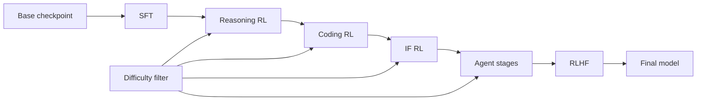
打分理由：开源后训练配方，stage与reward细（core 9 / wide 6）

### 2. ⭐ 📄 World Action Agent: Harnessing VLMs for Robot Manipulation via World Action Rehearsal
arXiv [2609.29964](https://arxiv.org/abs/2609.29964) · HF 🔥 5 · Yehang Zhang, Haojian Huang, Yifan Chang 等 · [PDF](https://arxiv.org/pdf/2609.29964)

**一句话**：WAA 让 VLM 在同一视觉工作区里试动作、改动作，LIBERO-Pro 达到 75.6%
**为什么值得你看**：对 VLM+robotics/agent 很有借鉴价值

**核心架构**：它解决的悖论是：VLM 很会看图和推理，但机器人操控里真正失败的点恰好发生在“看见偏差后已经来不及改”。现有做法要么让模型只给约束/程序，要么只给它一个看场景的窗口，结果观测、动作、纠偏分属不同空间，偏移一旦被执行就难回头。WAA 的核心变化是把“视觉工作区”变成执行层：contact view 把观察中心移到抓手-物体-目标附近，action rehearsal 让动作先变成可编辑提案并接收 planning feedback，再由 in-view correction 在同一视图里修正低层执行偏差。这样每一步的失败都被拦在“先预演、再执行、在原视图纠偏”这条闭环里。最直接的证据是 LIBERO-Pro：只用 LIBERO-90 演化出的 skills 就到 75.6%，且同一 skills 可迁移到 robosuite；再看 9B Qwen3.5 在 harness traces 上从 1.7% 到 43.3%，说明 harness 本身能产出可蒸馏轨迹。新意在系统组织层：不是换 backbone，而是重写机器人决策的运行时。

- 最强证据是 LIBERO-Pro 75.6% 和跨 robosuite 迁移
- 没证明对所有机器人形态都稳，动作空间差异仍可能卡住
- 复现难点在视觉对齐、动作预演和低层控制闭环
**精读价值**：值得精读，核心是 visual workspace 的机制
**关联**：[[Code as Policies]]、[[VLA]]
#vlm #robotics #agent · 难度：硬核 · 建议：建议精读
前置：🔲 [[VLM]] · 🔲 [[vision-language-action]] · 🔲 [[planning]] · 🔲 [[multi-agent]]

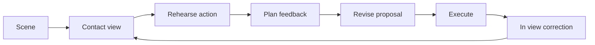
打分理由：VLM驱动机器人world-action，多智能体范式（core 8 / wide 5）

### 3. ⭐ 📄 Training Object Permanence in World Models
arXiv [2609.28654](https://arxiv.org/abs/2609.28654) · HF 🔥 194 · Haotian Zhang, Fengyuan Yu, Dezhi Luo 等 · [PDF](https://arxiv.org/pdf/2609.28654) · [代码](https://github.com/hokindeng/object-permanence) ★27

**一句话**：用 150 个认知任务训练世界模型，让继续生成模型学会物体永久性
**为什么值得你看**：适合看视频生成/世界模型的训练配方

**核心架构**：它抓住的是一个常见错觉：视频模型看起来会“理解物理”，但一到遮挡就把物体抹掉、穿墙或瞬移。既有评测多是泛化感受，不够精确地把 object permanence 和 solidity 拆成可训练、可比较的任务。作者的关键改变是把核心认知原则做成数据结构：150 个 Blender generators 保持任务的 cognitive structure 不变，只随机速度、光照、视角等 nuisance；再切成 1.5M 训练样本和 300 题考试，把“会不会守恒”变成可监督、可盲测的目标。最直接的证据是 blind pairwise Elo：PWM-WROP 在 continuation models 里排第一，整体第三，且在 native 320×192 分辨率下成立，说明不是靠高分辨率投机。新意主要在实证层兼训练数据层，不是新的 diffusion 或 transformer 架构。

- 最强证据是盲测 Elo，而不是单个自动指标
- 没证明模型真的学到完整物理，只覆盖 OP 和 OS
- 复现成本高：要搭 Blender 生成器和大规模标注流程
**精读价值**：值得看数据设计，精读可学任务构造
**关联**：[[Sora]]、[[VideoPoet]]
#world-models #video #cognition · 难度：中等 · 建议：值得通读 (20 min)
前置：🔲 [[diffusion model]] · 🔲 [[video generation]] · ◽ world model · 🔲 [[convolution]]

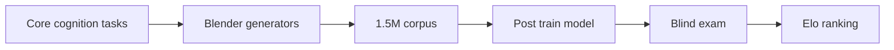
打分理由：视频世界模型+认知任务数据基础（core 7 / wide 4）

### 4. ⭐ 📄 OmniEcho: Spatial Audio Understanding for Embodied Agents
arXiv [2609.23407](https://arxiv.org/abs/2609.23407) · HF 🔥 20 · Ruixun Liu, Yuxuan Wang, Jiacheng Xie 等 · [PDF](https://arxiv.org/pdf/2609.23407) · [代码](https://github.com/PKU-VaLuE-Lab/OmniEcho) ★12

**一句话**：OmniEchoBench+OmniEcho：197场景、2972 QA、900导航样本，补上空间音频评测并把SVLN做近VLN
**为什么值得你看**：做多模态/具身和导航面试很对口

**核心架构**：现有omni model会听“是什么”，却常听不出“从哪来”，所以在被遮挡、出视野或需要转头找目标时，语义音频不够用。作者的关键改变是把空间音频单独建成一条路径：FOA spatial encoder 负责保留方向与距离线索，pretrained semantic audio pathway 继续管声音语义，避免把空间信息挤丢；同时用可控 spatial audio rendering 生成与视觉观察、轨迹几何一致的监督，阻断真实数据太贵、仿真又不对齐的失败。最直接的证据是 OmniEcho 在 OmniEchoBench 的空间音频-视觉 perception 上拿到 SOTA，且 sound-guided navigation 接近传统 VLN；这说明不是只会答题，而是空间音频真能进入 embodied reasoning。新意主要在系统组织层：把“空间音频理解”拆成 benchmark、可控数据管线和模型接口三件事，而不是只改一个 encoder。

- 最强证据：SV perception SOTA，导航接近VLN
- 未证明跨更多真实房间/麦克风仍稳
- 复现难点在FOA渲染与轨迹对齐
**精读价值**：适合精读，尤其看数据构建和FOA编码怎么接入现有omni模型
**关联**：[[Room-to-Room]]、[[Vision-Language Navigation]]
#multimodal #audio #embodied · 难度：中等 · 建议：建议精读
前置：🔲 [[VLM]] · ◽ FOA · 🔲 [[long context]] · 🔲 [[vision-language-action]]

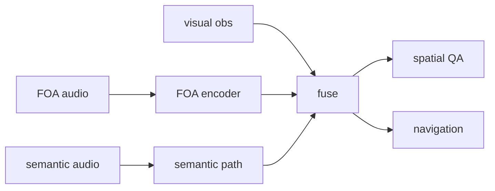
打分理由：空间音频理解+具身基准，和VLM/代理相关（core 7 / wide 5）

### 5. ⭐ 📄 Coding Agents for Generalized Task and Motion Planning Problems
arXiv [2609.30233](https://arxiv.org/abs/2609.30233) · HF 🔥 8 · Matteo Merler, Bowen Li, Josh Roy 等 · [PDF](https://arxiv.org/pdf/2609.30233) · [代码](https://github.com/tomsilver/robocode) ★12

**一句话**：用 coding agents 解 generalized TAMP：28环境、98k episodes，成功率 56%到95%
**为什么值得你看**：很适合看 agent 如何做物理规划与程序合成

**核心架构**：TAMP 的悖论是：状态都看得到，问题还是很难，因为离散决策一碰到几何、动力学约束就会炸，传统方法只能靠大量手工 predicates、samplers、operators。作者的改变不是再做一个更聪明的 planner，而是让 coding agent 在固定 synthesis budget 内自己写程序：它能先跑实验、探 simulator、校准物理模型，再把发现固化成冻结的程序，阻断“单次生成不懂边界条件”和“测试时还依赖LLM推理”的失败。最直接的证据是 28 个环境、980 个程序、98,000 次评测后，三种 coding agent 都超过手工 planner 和 LLMGenPlan；而且对象数变多时，程序还能用更少计算保持成功率。新意主要在实证层：它证明 coding agent 可以成为 generalized TAMP 的强 baseline，而不是只在代码题上强。

- 最强证据：56%到95%胜过手工planner
- 未解决动态三维里扫动/倾倒类任务
- 复现成本高，需 simulator 与大规模程序评测
**精读价值**：值得通读，重点看交互式程序合成如何替代TAMP工程
**关联**：[[KinDER]]、[[PDDLStream]]
#agents #program-synthesis #tamp · 难度：中等 · 建议：建议精读
前置：🔲 [[planning]] · 🔲 [[planning]] · ◽ program-synthesis · 🔲 [[multi-agent]]

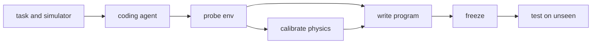
打分理由：coding agents做任务/运动规划泛化（core 7 / wide 4）

### 6. ⭐ 📄 Your Transformer Can Hold Two Thoughts at Once: Evidence of Linear Superposition in LLMs
arXiv [2609.29845](https://arxiv.org/abs/2609.29845) · HF 🔥 63 · Pavel Tikhonov, Anton Korznikov, Matvey Mikhalchuk 等 · [PDF](https://arxiv.org/pdf/2609.29845)

**一句话**：发现LLM有输入叠加线性：混合两段文本，top-10里还能保住两条各自续写
**为什么值得你看**：适合做Transformer机理和推理解读面试谈资

**核心架构**：反直觉点在于：Transformer 明明靠非线性 self-attention 和 MLP 工作，却在把两个文本流的 embedding 逐 token 平均后，仍能把两条原始续写的 next-token 概率“叠”在一起。作者的核心概念是 superposition linearity：把混合输入看成两条独立路径的线性叠加，而不是把它当成语义互相污染的单一路径；这说明模型里有一部分输入输出映射天然接近线性。为了验证这不是训练“学出来”的巧合，他们沿 pretraining 轨迹追踪，发现这种线性在初始化最强，训练反而会削弱；再用轻量 fine-tuning 把它拉回来，并做 guided decoding，把混合输出拆回两条连续文本。最强证据是 rank 分布：混合后真 token 仍大量落在 top-10/top-50，且这一点在多个模型家族和语料上都成立。新意在组件层加实证层：既提出了可测的线性假说，也给了拆解混合输出的 decoding 机制。

- 最强证据：混合后真token常进top-10
- 未证明长上下文、复杂语义下同样成立
- 复现要会做embedding混合与rank分析
**精读价值**：建议精读，适合补Transformer可解释性和混合解码思路
**关联**：[[Transformer]]、[[Residual Stream]]
#llm #analysis #linear-probe · 难度：硬核 · 建议：建议精读
前置：🔲 [[self-attention]] · 🔲 [[positional encoding]] · 🔲 [[next-token prediction]] · 🔲 [[pretraining]]

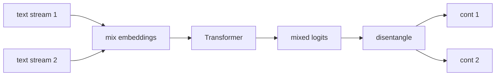
打分理由：Transformer线性叠加性质，偏表征分析（core 6 / wide 4）

### 7. ⭐ 📄 WanPE: Towards Cinematic Prompt Enhancement for Modern Text-to-Video Generation
arXiv [2609.30221](https://arxiv.org/abs/2609.30221) · HF 🔥 32 · Yubo Zhu, Yawen Shao, Ziyun Dai 等 · [PDF](https://arxiv.org/pdf/2609.30221)

**一句话**：WanPE 用 397B 逆向构造电影式提示，30 秒视频偏好+50.86
**为什么值得你看**：做 T2V/视频 agent 提示工程的人值得看

**核心架构**：问题不是“把 prompt 写长”，而是 30 秒、多镜头视频里，用户要求要跨 shots 持续成立；普通 forward rewriting 只是在语言上扩写，训练分布却偏向 synthetic rewrite，和下游视频模型学到的 video-grounded captions 不对齐。WanPE 的关键改变是把 prompt enhancement 改成 cinematic planning：先从真实视频做 video-grounded reverse construction，学到“结果视频里本来就存在的分镜结构”，再用 SC-GRPO 在 9 维奖励里压制 omission、wrong binding、temporal inconsistency，让 subject、action、camera、audio 在整段计划里不丢失、不串位。最直接的证据是 ablation：reverse construction 明显优于 forward rewriting，且 SC-GRPO 在不同模型规模上都稳健提升 semantic consistency；这说明改动不是单纯扩词，而是把监督分布和一致性约束一起换掉。新意主要在系统组织层：把 text prompt 当作视频的“蓝图”来组织，而不是描述性补写。

- 最强证据：reverse > forward rewriting
- 没证明通用规划，主要限 T2V
- 397B/11K 人评，复现门槛高
**精读价值**：适合看机制，判断提示增强新范式
**关联**：[[InstructGPT]]、[[GRPO]]
#diffusion #text-to-video #rl · 难度：硬核 · 建议：建议精读
前置：🔲 [[diffusion model]] · 🔲 [[video generation]] · 🔲 [[group relative policy optimization]] · 🔲 [[long context]]

打分理由：视频生成prompt增强+GRPO思路（core 6 / wide 4）

### 8. ⭐ 📄 AgentKernel: The Trust-Native Agentic Operating System
arXiv [2609.29647](https://arxiv.org/abs/2609.29647) · HF 🔥 6 · Zhenhua Zou, Sheng Guo, Qiuyang Zhan 等 · [PDF](https://arxiv.org/pdf/2609.29647)

**一句话**：AgentKernel 用四层内核把 agent 越权、注入、污染都变成强制拦截
**为什么值得你看**：做 agent/RAG 安全或多工具系统面试很对口

**核心架构**：反直觉点在于：agent 越强，风险不是只来自某个 bad prompt，而是它会把不可信网页、长期记忆、工具权限串成一条链；把过滤器做成 middleware 仍不够，因为它和 agent 同处一个 process trust boundary，能被绕过。AgentKernel 的关键概念是把安全下沉成 OS 式 mandatory enforcement：Identity 管可信委托，Perception 管输入进入上下文前的分级 mediation，Cognition 用 information-flow 约束 memory，Execution 把工具调用落到 non-bypassable 的 kernel boundary 上，阻断 prompt injection、memory poisoning 和 tool misuse 的跨层传播。原文最直接支持的是它对现有 harness 的系统比较：作者指出治理平台、runtime、sandbox 都只覆盖片段，而 kernel 能统一每次信任穿越；但摘要里没给出完整实证数字，性能代价与真实部署条件原文未明确。新意主要在系统组织层，不是单个检测器。

- 强项是把 trust boundary 统一到内核
- 原文未明确性能开销与攻击成功率
- 更像安全架构提案，复现难度高
**精读价值**：值得看架构思想，尤其是 agent 安全边界
**关联**：[[LangGraph]]、[[OpenAI Agents]]
#agent #security #os · 难度：硬核 · 建议：建议精读
前置：🔲 [[prompt injection]] · 🔲 [[memory]] · 🔲 [[planning]] · 🔲 [[model context protocol]]

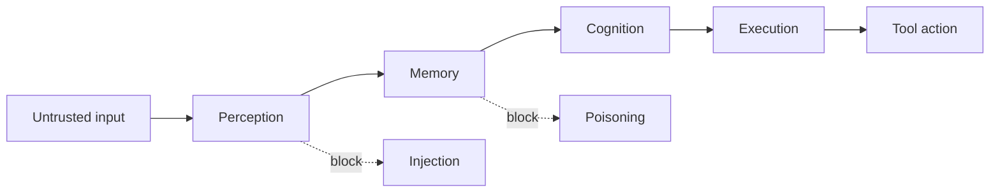
打分理由：agent治理/隔离的OS级安全视角（core 6 / wide 4）

## 🧰 项目 · 核心方向

### 9. ⭐ 🧰 Tencent/WeKnora
[GitHub](https://github.com/Tencent/WeKnora) ★30,299 (+3189 本周) · Trending weekly · tool · Go

**一句话**：WeKnora 把企业文档做成 RAG+agent+wiki，近 3 万星且周更
**为什么值得你看**：想看可落地知识库/agent 平台，可以直接抄架构

**核心架构**：它解决的是企业里“文档散、检索弱、知识会过期”的真实痛点：同一份知识既要能查、能多步推理、还能被持续维护。WeKnora 的承重组件是同一知识库上跑三种模式：RAG 负责查，agent 负责多步任务，wiki 负责组织沉淀；再往下是会话持久化沙箱里的 skills、BrowserSkill 访问用户自己的 Chrome/Edge、外部 MCP、长短期 memory、可编辑/回滚的 chunks、以及多工作区 RBAC 和审计日志。检测到的成熟度信号比较强：README 有明确 quick start、Docker Compose/K8s/Lite 单文件/桌面版部署路径，最近 release 到 v0.8.2，且 release notes 里还能看到修复 agent、sandbox、audit log、i18n 等问题，说明不是只会演示的 demo。和同类相比，它的差异不在“有没有 RAG”，而在同一套知识底座上同时支持检索、自治任务和持续维护，并且把权限、追踪、外部工具接得更完整。

- 最强证据：近 3 万星且持续发版
- 有 Docker/K8s/Lite/桌面多部署形态
- 更偏平台整合，不是单点算法突破
**为什么现在上榜**：最近 release：v0.8.2（2026-09-24）
**精读价值**：适合当知识库/agent 平台样板看
**关联**：[[LangChain]]、[[LlamaIndex]]
#rag #agent #knowledge-base · 难度：中等 · 建议：值得通读 (20 min)
前置：🔲 [[retrieval-augmented generation]] · 🔲 [[embedding]] · 🔲 [[reranker]] · 🔲 [[memory]]

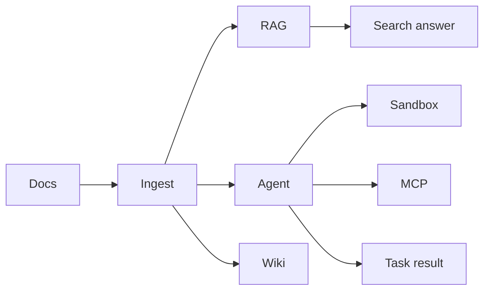
打分理由：RAG+自主推理+自维护Wiki，贴合核心方向（core 9 / wide 8）

### 10. ⭐ 🧰 rohitg00/agentmemory
[GitHub](https://github.com/rohitg00/agentmemory) ★28,884 (+41 今日) · Trending daily · tool · TypeScript

**一句话**：#1 Persistent memory for AI coding agents based on real-world benchmarks
**为什么值得你看**：（dry-run：未调用 LLM，配置 OPENAI_API_KEY 后会生成中文速览）
#agent #memory #evaluation · 难度：中等 · 建议：看速览即可
打分理由：面向AI coding agents的持久记忆，有复现价值（core 8 / wide 7）

### 11. ⭐ 🧰 aipoch/open-science
[GitHub](https://github.com/aipoch/open-science) ★4,942 (+2076 本月) · Trending monthly · tool · TypeScript

**一句话**：The open-source AI research workbench for scientific research and agent workflows
**为什么值得你看**：（dry-run：未调用 LLM，配置 OPENAI_API_KEY 后会生成中文速览）
- Local-first, model-agnostic desktop app with extensible skills, MCP tools and connectors, Python/R execution and traceab
#agent #mcp #workflow · 难度：中等 · 建议：看速览即可
打分理由：本地优先科研工作台+agent工作流，偏工程可用（core 7 / wide 7）

### 12. ⭐ 🧰 zeronsh/zeron
[GitHub](https://github.com/zeronsh/zeron) ★2,240 (+596 本周) · Trending weekly · infra · Rust

**一句话**：A native control plane for Claude Code, Codex, Cursor, Devin and other coding agents.
**为什么值得你看**：（dry-run：未调用 LLM，配置 OPENAI_API_KEY 后会生成中文速览）
#agent #control-plane #coding · 难度：中等 · 建议：看速览即可
打分理由：代理控制平面，适合搭建与评测。（core 7 / wide 6）

### 13. ⭐ 🧰 lyogavin/airllm
[GitHub](https://github.com/lyogavin/airllm) ★34,997 (+178 今日) · Trending daily · infra · Jupyter Notebook

**一句话**：单卡4GB跑70B；2026又把125B训练压到6GB
**为什么值得你看**：直指推理加速与显存优化，面试很能聊

**核心架构**：反直觉点是：大模型显存瓶颈不只在参数量，很多时候是“整模常驻 + KV cache”把单卡卡死。AirLLM的关键改变不是再做一种量化，而是把模型拆成按层流式加载：冻结权重留在磁盘，运行时只把当前层搬进内存，做完立刻释放；训练时则让adapter常驻GPU、冻结权重按层流式读入。这样阻断的是“全模型驻留”导致的OOM，而不是单纯压缩精度。最直接的证据是作者报告 Kimi K3 2.8T 只用 3.72GB、DeepSeek-V3 671B 约 12GB，且最新训练里 Qwen3.8-Flash-Next 125B 可在 6GB 内跑通。新在系统组织层：不是模型结构改造，而是权重调度与磁盘/内存/GPU之间的执行组织。

- 最强证据是超大模型单卡可跑的实测显存
- 没证明通用吞吐优势，磁盘/I O 可能成瓶颈
- 复现依赖特定 transformers 版本和模型远程代码
**精读价值**：适合看它怎么做分层流式，不必深挖数值细节
**关联**：[[vLLM]]、[[ZeRO]]
#inference #llm #quant · 难度：中等 · 建议：值得通读 (20 min)
前置：🔲 [[KV cache]] · 🔲 [[quantization]] · 🔲 [[LoRA]] · 🔲 [[flash attention]]

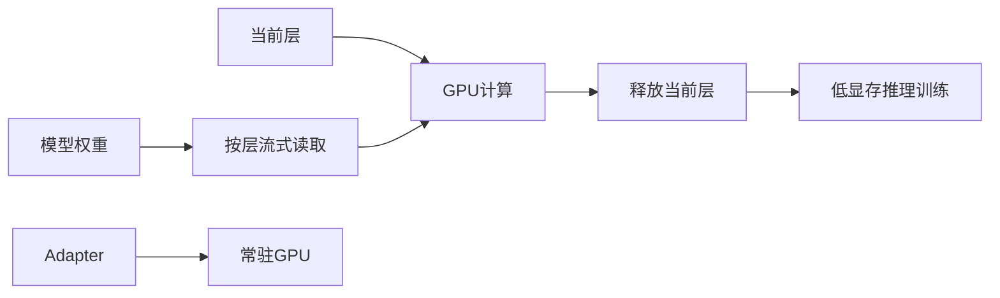
打分理由：单卡超低显存推理，工程可复现价值高（core 7 / wide 6）

### 14. ⭐ 🧰 ruc-datalab/EvoOntology
[GitHub](https://github.com/ruc-datalab/EvoOntology) ★420 · tool · Python

**一句话**：用MCP把数据语义层做成可进化本体
**为什么值得你看**：Agent+RAG+MCP 结合很对口，适合看架构

**核心架构**：问题不是“能不能调用工具”，而是数据 agent 面对表、文件、数据库时，每一步都要重新猜字段语义、映射关系和约束，导致反复探索、语义错配。EvoOntology的关键概念是把 ontology 当成可训练的 agent state：先用 workload 和原始数据构建一个带版本的语义层，再在真实交互轨迹里诊断失败，把更新限制在 Content、Schema、Tool 三层的局部补丁，并且只有候选版在同数据、同预算下优于 Parent 才发布。最直接的证据是它把 `browse_semantics`/`resolve_semantics` 通过 MCP 暴露给 Claude Code/Codex，并声称自进化后在四个 backbone 子集上继续提升。新在系统组织层：不是静态 ontology，而是带评估门控的闭环语义中间件。

- 最强证据是 on-policy 式轨迹驱动的局部进化
- 原文未明确大规模公开基准和绝对数值
- 复现要接入 MCP 与数据回放，工程链路较长
**精读价值**：如果你关心 data agent 中间件，这条值得精读
**关联**：[[ReAct]]、[[model context protocol]]
#agent #ontology #mcp · 难度：硬核 · 建议：建议精读
前置：🔲 [[MCP]] · 🔲 [[ReAct]] · 🔲 [[planning]] · 🔲 [[retrieval-augmented generation]]

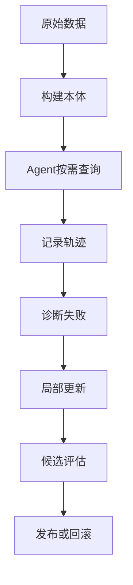
打分理由：给数据/agent进化本体层，适合方法讨论（core 7 / wide 6）

## 🌐 全领域热点

### 15. 🌐 🧰 openclaw/openclaw
[GitHub](https://github.com/openclaw/openclaw) ★390,572 (+134 今日) · Trending daily · tool · TypeScript

**一句话**：390k星开源代理OS，跨聊天和设备做事
**为什么值得你看**：agent 系统成熟度和安全边界，面试常问

**核心架构**：它解决的是“助手不在一个入口里、也不该把所有权限交给模型”的现实痛点：消息、设备、工具、状态分散在不同平台，线性 workflow 很难长期维护。OpenClaw的核心是把 Gateway 作为本地控制平面，把外部消息通道、工具、插件和设备节点挂到同一套会话/事件系统上；模型和 agent harness 只是可替换插件，状态、memory、credentials 留在本机。真正的设计取舍在安全：把 inbound message 当不可信输入，工具默认跑在 host 上，但允许你再配置 sandboxing；这说明它不是简单聊天壳，而是“可信控制面 + 不可信执行”的 agent OS。最直接的成熟度信号是 178 个 direct commits、2614 PR、351 contributors，以及连续高频 release。新在系统组织层：把跨通道 agent 做成可部署的本地平台，而不是单点应用。

- 最强证据是高频 release 和大体量协作记录
- README 明确强调安全边界，但默认工具仍在 host 侧
- 同类差异在于多通道+本地控制面，不是单一聊天客户端
**为什么现在上榜**：最近 release：v2026.9.6（2026-09-23）; v2026.7.35（2026-09-21）; v2026.9.5（2026-09-19）
**精读价值**：看成熟度和架构边界就够，适合速览
**关联**：[[ReAct]]、[[model context protocol]]
#agent #os #autonomy · 难度：中等 · 建议：值得通读 (20 min)
前置：🔲 [[multi-agent]] · 🔲 [[planning]] · 🔲 [[memory]] · 🔲 [[prompt injection]]

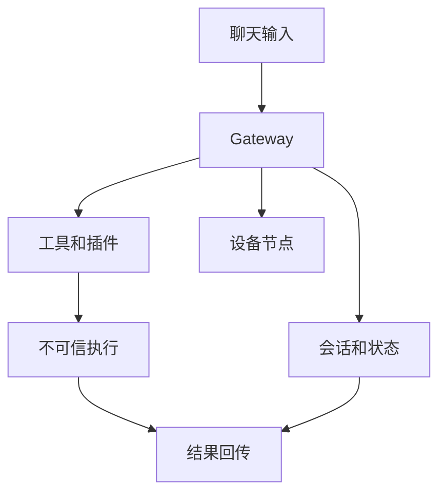
打分理由：强势开源“可做事”的OS智能体，热度高（core 6 / wide 9）

### 16. 🌐 🧰 tensorflow/tensorflow
[GitHub](https://github.com/tensorflow/tensorflow) ★200,404 (+31 今日) · Trending daily · infra · C++

**一句话**：An Open Source Machine Learning Framework for Everyone
**为什么值得你看**：（dry-run：未调用 LLM，配置 OPENAI_API_KEY 后会生成中文速览）
#training #framework #distributed · 难度：中等 · 建议：看速览即可
打分理由：训练/系统基础设施，质量高但非核心前沿（core 5 / wide 7）

### 17. 🌐 🧰 bendlang/bend
[GitHub](https://github.com/bendlang/bend) ★22,931 (+1530 本周) · Trending weekly · infra · TypeScript

**一句话**：Bend 2: a fast language that blocks AI mistakes via proof
**为什么值得你看**：（dry-run：未调用 LLM，配置 OPENAI_API_KEY 后会生成中文速览）
- Install: curl -fsSL https://bend-lang.com/install.sh | sh
#proof #safety #language · 难度：中等 · 建议：看速览即可
打分理由：形式化/证明以防AI错误，方向相关。（core 5 / wide 6）

### 18. 🌐 🧰 FareedKhan-dev/train-llm-from-scratch
[GitHub](https://github.com/FareedKhan-dev/train-llm-from-scratch) ★11,204 (+1376 本周) · Trending weekly · tutorial · Python

**一句话**：A straightforward method for training your LLM, from downloading data to generating text.
**为什么值得你看**：（dry-run：未调用 LLM，配置 OPENAI_API_KEY 后会生成中文速览）
#llm #training #from-scratch · 难度：中等 · 建议：看速览即可
打分理由：训练LLM教程类，信息量有限但可参考。（core 2 / wide 6）

---
想精读哪一篇？在 Claude 里说：`精读 2026-09-26 第 N 条`，Jarvis 会按你的 known.md 只讲你不会的部分。