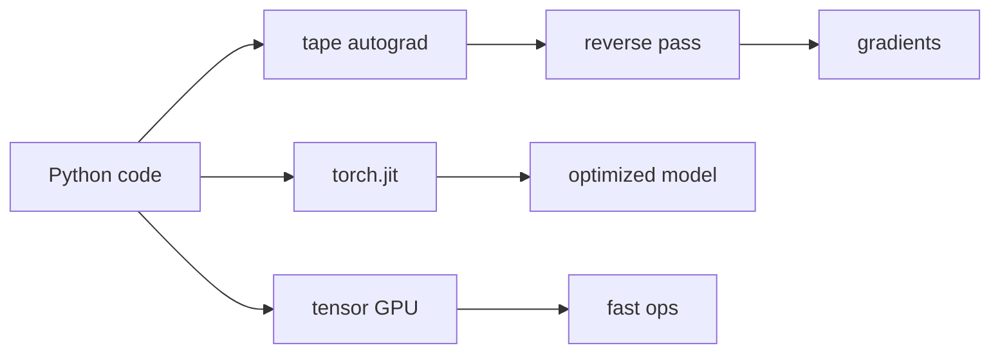
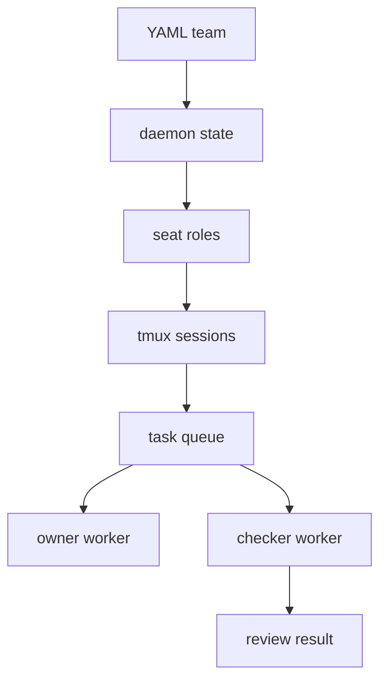
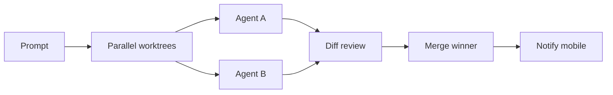
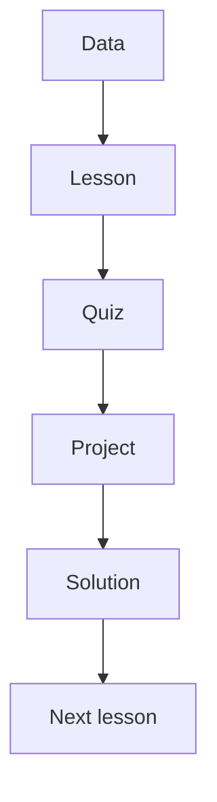

# Jarvis 日报 · 2026-09-27

候选 390 → 过滤后 83 → 入选 10。图例：⭐ 核心方向 · 🌐 全领域热点 · ✅ 已掌握前置 · 🔲 需补前置

## 🧰 项目 · 核心方向

### 1. ⭐ 🧰 pytorch/pytorch
[GitHub](https://github.com/pytorch/pytorch) ★103,415 (+56 今日) · Trending daily · infra · Python

**一句话**：把 Python 动态网络变成 GPU 原生框架，作者强调 tape autograd 与高灵活性
**为什么值得你看**：LLM/训练岗位绕不开的底座，面试常问系统取舍

**核心架构**：PyTorch 的反直觉点是：想做复杂研究时，静态图往往先卡在“改一下结构就得重建整网”，而不是算力不够。它的关键改变是把执行保持在 Python 里，用 tape-based autograd 记录前向，再反向回放；`torch.nn` 负责把模块组织成可微程序，`torch.jit` 负责在需要时把 Python 代码收进可序列化、可优化的子集，`torch.multiprocessing` 则通过 tensor 共享阻断数据加载和 Hogwild 训练里的进程拷贝开销。最直接的证据不是某个榜单，而是 README 明确把它定位为“research platform”，同时 release highlights 继续把 kernel fusion、dynamic control flow、CUDA graph capture 往前推，说明它在保留动态图的同时持续补系统性能。新意主要在系统组织层：不是发明新算子，而是把研究代码、自动求导、编译与并行运行拼成一个能持续演进的底座。

- README 直接点明动态图+GPU 原生定位
- release 继续补编译和融合，说明底座仍在演进
- 没证明训练更快于所有框架，优势依赖具体算子与后端
**精读价值**：值得通读，尤其看它怎么平衡灵活性和性能
**关联**：[[TensorFlow]]、[[Chainer]]
#training #distributed #framework · 难度：中等 · 建议：值得通读 (20 min)
前置：🔲 [[self-attention]] · ◽ autograd · ◽ CUDA · 🔲 [[data parallel]]

打分理由：深度学习核心框架，必读必用（core 10 / wide 10）

### 2. ⭐ 🧰 mvschwarz/openrig
[GitHub](https://github.com/mvschwarz/openrig) ★844 (+114 今日) · Trending daily · infra · TypeScript

**一句话**：用 YAML 把 Claude Code 和 Codex 组进一套多智能体 rig，v0.5.17 修了 Bun 安装
**为什么值得你看**：Agent 编排和评测方向很对口，能看系统机制

**核心架构**：OpenRig 解决的是：多个 coding agent 各跑各的终端，结果就是上下文散、权限乱、交接靠人肉。它的关键做法不是再做一个 agent，而是做一个“rig”把 harness 统一起来：YAML 定义团队，daemon 维护状态和队列，tmux/cmux 提供可恢复的会话容器，seat 负责把 owner、checker 这种角色固定下来；当需要启动或接手任务时，系统先检查认证、trust、hook 配置，再把任务投递到对应 seat，避免单个终端会话失联后上下文丢失。最直接的成熟度信号是它有连续三天的 release，v0.5.17 还专门修了 Bun 的安装依赖问题，README 也给出 `rig setup --dry-run`、`rig ps`、`rig queue list` 这类可操作命令，说明不是概念稿。新在系统组织层：把多 agent 协作做成 persistent team，而不是脚本串联。

- 最强证据是 release 连续更新和可执行安装流程
- 没证明多 agent 协作一定更强，效果依赖任务分解和权限配置
- 复现门槛中等，需要 tmux、Node、Codex 认证
**为什么现在上榜**：作者报告最近 release：v0.5.17（2026-09-27），连续高频发版
**精读价值**：值得看项目结构，适合关注 agent 编排的人
**关联**：[[ReAct]]、[[SWE-bench]]
#agent #multi-agent #evaluation · 难度：中等 · 建议：值得通读 (20 min)
前置：🔲 [[multi-agent]] · 🔲 [[planning]] · 🔲 [[memory]] · 🔲 [[model context protocol]]

打分理由：多智能体 harness，能用于 agent 试验（core 8 / wide 6）

### 3. ⭐ 🧰 stablyai/orca
[GitHub](https://github.com/stablyai/orca) ★79,452 (+6503 本周) · Trending weekly · infra · TypeScript

**一句话**：把多个 CLI agent 放进同一 IDE，支持并行 worktree 与手机监控，最近发到 v1.4.215
**为什么值得你看**：Agent 产品化和多工作流编排很适合面试谈系统设计

**核心架构**：Orca 解决的是真实痛点：多个 agent 同时改代码时，最先坏掉的不是模型，而是文件冲突、上下文切换和人工盯盘。它的核心组织方式是“每个 agent 一个 isolated worktree”，再用统一界面把终端、PR、issue、mobile notification 和 review 串起来；检测到任务完成、diff 可审、profile 冲突这类状态变化时，系统会主动提醒或让用户在 JSON/SQLite 之间选一个，而不是甩出命令行让人自己恢复。最直接的成熟度信号是它有桌面、移动端、CLI 三端，支持任意 CLI agent，且 release 极密集，最近版本还在修 profile 冲突这种真实故障路径。新在系统组织层：把 agent 协作、审阅、远程接管做成一个持续运行的工作台，而不是单次自动化脚本。

- 最强证据是多端形态和高频 release
- 没证明对复杂编码任务的成功率一定优于人工
- 复现难度较高，偏产品体验而非算法实现
**为什么现在上榜**：作者报告最近 release：v1.4.215（2026-09-27），前两天也连续发版
**精读价值**：适合看它如何把 agent 工作流产品化
**关联**：[[ReAct]]、[[SWE-bench]]
#agent #multi-agent #orchestration · 难度：中等 · 建议：值得通读 (20 min)
前置：🔲 [[multi-agent]] · 🔲 [[planning]] · 🔲 [[memory]] · 🔲 [[prompt injection]]

打分理由：面向并行agent编排的ADE，热度高且实用（core 7 / wide 8）

### 4. ⭐ 🧰 paperclipai/paperclip
[GitHub](https://github.com/paperclipai/paperclip) ★89,393 (+2527 今日) · Trending daily · tool · TypeScript

**一句话**：The open-source app everyone uses to manage agents at work
**为什么值得你看**：（dry-run：未调用 LLM，配置 OPENAI_API_KEY 后会生成中文速览）
#agent #workflow #mcp · 难度：中等 · 建议：看速览即可
打分理由：高热度 agent 管理工具，贴近工程落地（core 7 / wide 7）

### 5. ⭐ 🧰 MakazhanAlpamys/Soup
[GitHub](https://github.com/MakazhanAlpamys/Soup) ★7,394 (+4232 本月) · Trending monthly · infra · Python

**一句话**：Fine-tune LLMs from one YAML
**为什么值得你看**：（dry-run：未调用 LLM，配置 OPENAI_API_KEY 后会生成中文速览）
- Layer streaming trains an 8B model on a 4 GB laptop GPU.
#finetune #rl · 难度：中等 · 建议：看速览即可
打分理由：本地可训练微调框架，有可迁移价值（core 6 / wide 5）

### 6. ⭐ 🧰 mobile-next/mobile-mcp
[GitHub](https://github.com/mobile-next/mobile-mcp) ★7,837 (+573 今日) · Trending daily · infra · TypeScript

**一句话**：Model Context Protocol Server for Mobile Automation and Scraping (iOS, Android, Emulators, Simulators and Real Devices)
**为什么值得你看**：（dry-run：未调用 LLM，配置 OPENAI_API_KEY 后会生成中文速览）
#mcp #agent #automation · 难度：中等 · 建议：看速览即可
打分理由：MCP 服务器，适合 agent 工具调用（core 6 / wide 6）

## 🌐 全领域热点

### 7. 🌐 🧰 heygen-com/hyperframes
[GitHub](https://github.com/heygen-com/hyperframes) ★53,604 (+306 今日) · Trending daily · tool · TypeScript

**一句话**：Write HTML
**为什么值得你看**：（dry-run：未调用 LLM，配置 OPENAI_API_KEY 后会生成中文速览）
- Render video
- Built for agents.
#agent #video #inference · 难度：中等 · 建议：看速览即可
打分理由：面向 agent 的视频编排，但偏应用（core 3 / wide 7）

### 8. 🌐 🧰 Lordog/dive-into-llms
[GitHub](https://github.com/Lordog/dive-into-llms) ★55,343 (+5194 本月) · Trending monthly · tutorial · Jupyter Notebook

**一句话**：《动手学大模型Dive into LLMs》系列编程实践教程
**为什么值得你看**：（dry-run：未调用 LLM，配置 OPENAI_API_KEY 后会生成中文速览）
#llm #notebook · 难度：中等 · 建议：看速览即可
打分理由：入门实践教程，适合理解但非前沿（core 4 / wide 6）

### 9. 🌐 🧰 vercel-labs/json-render
[GitHub](https://github.com/vercel-labs/json-render) ★18,334 (+1561 本周) · Trending weekly · infra · TypeScript

**一句话**：The Generative UI framework
**为什么值得你看**：（dry-run：未调用 LLM，配置 OPENAI_API_KEY 后会生成中文速览）
#ui #rendering #genui · 难度：中等 · 建议：看速览即可
打分理由：生成式UI渲染框架，虽热但与核心方向距离较远（core 3 / wide 6）

### 10. 🌐 🧰 microsoft/ML-For-Beginners
[GitHub](https://github.com/microsoft/ML-For-Beginners) ★91,050 (+322 本周) · Trending weekly · tutorial · Jupyter Notebook

**一句话**：12周26课教经典机器学习，配52个测验和多语言翻译
**为什么值得你看**：适合补 ML 基础，面试前快速补课

**核心架构**：它解决的不是“学不会模型”，而是初学者常见的断裂：看完概念仍不会把数据清洗、特征、训练、评估串起来。现有零散教程要么只讲 API，要么只讲理论，学完很难形成可执行流程。这个仓库的关键改法是把课程组织成固定学习闭环：每课前测验→讲解→动手项目→后测验，让“输入数据到可验证结果”的路径始终闭合；多语言翻译和可本地克隆则把地区和下载成本这类失败点直接切掉。最直接的证据是作者报告 12 weeks、26 lessons、52 quizzes，并且每课都带 solution 和 assignment，说明它不是只放幻灯片，而是按练习驱动设计。新意主要在系统组织层，不在算法层：核心价值是把经典 ML 教成可持续自学的课程系统。

- 作者报告 12 weeks、26 lessons、52 quizzes
- 多语言翻译和 sparse checkout 降低入门门槛
- 没证明高阶建模能力，偏基础教学
**为什么现在上榜**：原文未明确
**精读价值**：看速览即可；适合补基础，不必精读
**关联**：[[Hands-On Machine Learning with Scikit-Learn, Keras, and TensorFlow]]、[[fast.ai]]
#ml #intro #education · 难度：入门 · 建议：看速览即可
前置：◽ scikit-learn · ◽ train test split · ◽ model evaluation

打分理由：入门ML教程，研二价值偏低（core 2 / wide 6）

---
想精读哪一篇？在 Claude 里说：`精读 2026-09-27 第 N 条`，Jarvis 会按你的 known.md 只讲你不会的部分。