# Jarvis 日报 · 2026-09-28

候选 426 → 过滤后 117 → 入选 18。图例：⭐ 核心方向 · 🌐 全领域热点 · ✅ 已掌握前置 · 🔲 需补前置

## 📄 论文 · 核心方向

### 1. ⭐ 📄 Disaggregated Quantization: Specializing LLM Prefill and Decode
arXiv [2609.26333](https://arxiv.org/abs/2609.26333) · HF 🔥 41 · Andrei Panferov, Maximilian Kleinegger, Sweta Priyadarshi 等 · [PDF](https://arxiv.org/pdf/2609.26333) · [代码](https://github.com/IST-DASLab/disaggregated-quantization) ★6

**一句话**：DQ把 prefill 和 decode 分开量化；8K 下 ODP 让 TTFT 快 1.78x
**为什么值得你看**：做推理/量化方向面试很对口

**核心架构**：反直觉点是：同一个 decoder-only LLM，prefill 和 decode 其实不是同一种负载。prefill 更像算力受限，decode 更像带宽受限；如果硬套同一套量化，常见结果是要么损精度，要么浪费推理成本。作者的核心改动是把“量化”从一个全局选择拆成按阶段专门化：prefill 可用 compute-native 的低精度 GEMM 与独立权重，decode 则保留更适合生成的权重/激活表示，甚至只换 prefill checkpoint 不动 decode checkpoint。这样阻断的是“同一表示同时满足两阶段”的失败。最直接的证据是：对 Qwen3.8-27B，NVFP4 prefiller 在不改 decode checkpoint 的情况下，把 1-bit 准确率在 MMLU-Pro 提升 32.5 点、MMMU-Pro 提升 35.3 点；ODP 在 8K prompt 下把 TTFT 提升 1.78x。新意主要在系统组织层：不是单点量化技巧，而是把权重、格式、存储位置按 prefill/decode 解耦。

- 最强证据：1-bit 准确率大幅回升
- 没证明通用最优；长上下文更占优
- 复现要碰推理框架和权重格式
**精读价值**：值得精读，推理系统和量化都很有料
**关联**：[[SmoothQuant]]、[[AWQ]]
#quantization #inference #llm · 难度：硬核 · 建议：建议精读
前置：🔲 [[quantization]] · 🔲 [[KV cache]] · 🔲 [[vLLM]] · 🔲 [[speculative decoding]]

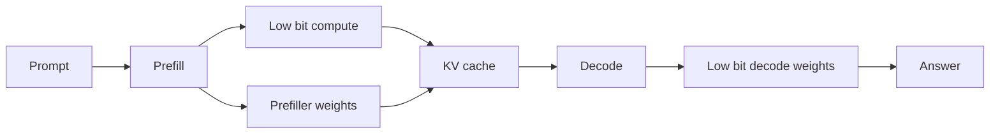
打分理由：分解prefill/decode量化，强工程可迁移（core 9 / wide 7）

### 2. ⭐ 📄 AgentWorld: Benchmarking Long-Horizon Collaboration of Multi-agent LLMs
arXiv [2609.31590](https://arxiv.org/abs/2609.31590) · HF 🔥 6 · Raphael Shu, Yusen Zhang, Young Min Cho 等 · [PDF](https://arxiv.org/pdf/2609.31590)

**一句话**：AgentWorld用 50+ 轮 MMORPG 协作任务测多智能体；最好模型也只 52% 成功
**为什么值得你看**：做 agent 评测和多智能体很相关

**核心架构**：反直觉点是：很多 multi-agent benchmark 看起来在测“协作”，实际只是在测短回合对抗、单体能力加总，或者被低层操作控制拖累。作者把问题改成黑箱长协作：3–20 个 agent 在 25–55 轮里靠聊天、分工、资源共享完成任务，且用高层 API 把导航、采集、合成这类细控制从评分里剥离。关键概念改变是把“能不能完成任务”之外，再加一个 CCE，去追踪动作之间的因果依赖，判断团队里多少努力真的进了结果；这阻断了“一个人做很多动作但不贡献协作”的假阳性。最强证据是四个前沿模型里最好也只有 52.0% success，CCE 只有 0.320，且失败模式集中在 communication breakdown、role confusion、shared plan 维持不住。新意在实证层和评测组织层：不是新算法，而是把 long-horizon collaboration 这件事首次测得更像协作本身。

- 最强证据：best model 仅 52% 成功
- CCE 只量到 0.320，暴露假协作
- 复现难点是环境和人标任务
**为什么现在上榜**：原文未明确
**精读价值**：值得看，做 agent benchmark 很有参考价值
**关联**：[[MultiAgentBench]]、[[Collab-Overcooked]]
#benchmark #multi-agent #collaboration · 难度：中等 · 建议：值得通读 (20 min)
前置：🔲 [[multi-agent]] · 🔲 [[planning]] · 🔲 [[memory]] · 🔲 [[prompt injection]]

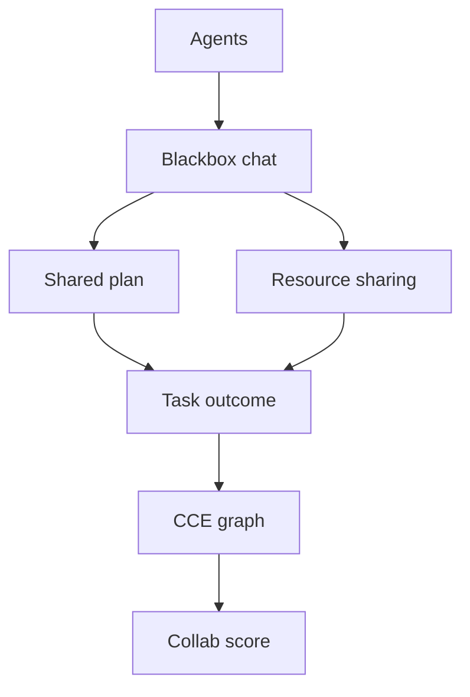
打分理由：长时多智能体协作基准，和Agent评测强（core 9 / wide 7）

### 3. ⭐ 📄 SLCA-GRPO: Resolving Cross-Segment Credit Misattribution in Tool-Calling RL
arXiv [2609.29050](https://arxiv.org/abs/2609.29050) · HF 🔥 5 · Yan Zhan, Shaobo Liu, Qiunan Liu 等 · [PDF](https://arxiv.org/pdf/2609.29050) · [代码](https://github.com/SLCA-GRPO/SLCA-GRPO) ★2

**一句话**：SLCA-GRPO把 tool 和 summary 分开分配 credit；7B 上 BFCL 提升 1.36pp
**为什么值得你看**：工具调用 RL 和 GRPO 面试点很新

**核心架构**：反直觉点是：tool-calling 轨迹里，工具调用和自然语言总结是两种不同段落，但标准 GRPO 会把同一个 trajectory advantage 广播给所有 token。结果是 summary 的好坏会污染 tool token 的更新，出现“工具做对了但总结错了被罚、工具做错了但总结对了被奖”的 credit misattribution。作者的关键改变是 SLCA：先按结构把 rollout 切成 execution 段和 articulation 段，再把各自的 advantage 只路由给对应 token，直接切断 summary→tool 的 advantage 传播；SGLS 负责生成 schema 约束的模拟轨迹，HierR 给两段提供不同粒度的 reward。最直接的证据是对比 GRPO、ToolPO、RLTR，7B backbone 在 in-domain、BFCL、τ²-Bench 都更高，其中 BFCL 提升 1.36pp，且作者做了梯度诊断显示不稳定主要来自 advantage contamination。新意在算法结构层：不是改 PPO 外壳，而是改同一条 rollout 内的 credit 归因方式。

- 最强证据：同预算下多基准都涨
- 没解决时间维 credit 问题本身
- 需要 schema simulator，搭建成本高
**精读价值**：值得精读，适合补 tool-RL 机制理解
**关联**：[[GRPO]]、[[ToolPO]]
#rl #grpo #tool-calling · 难度：硬核 · 建议：建议精读
前置：🔲 [[GRPO]] · 🔲 [[reward model]] · ◽ tool-calling · 🔲 [[MCP]]

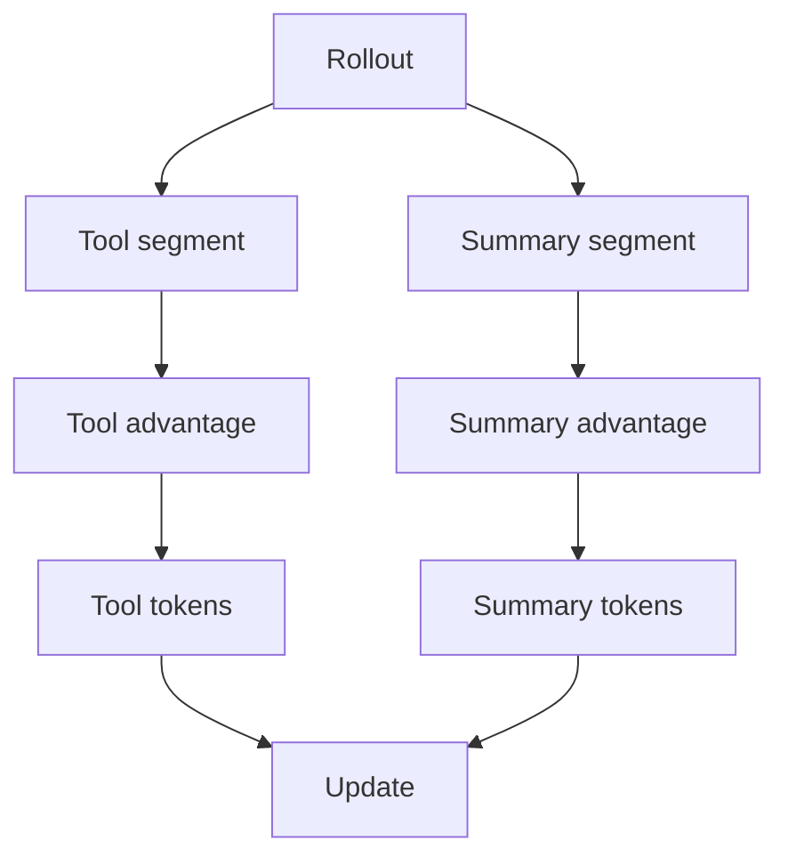
打分理由：工具调用RL：段内归因修正，工程价值高（core 9 / wide 6）

### 4. ⭐ 📄 VLA-Precision: Asymmetric Co-Bootstrapping for Efficient Real-World Online RL of Vision-Language-Action Models
arXiv [2609.04355](https://arxiv.org/abs/2609.04355) · HF 🔥 2 · Chenyu Su, Zhaolong Shen, Yuan Qian 等 · [PDF](https://arxiv.org/pdf/2609.04355) · [代码](https://github.com/scy-v/VLA-Precision) ★81

**一句话**：ACoB+ACoB-Stream把VLA在线RL提到98.3%成功率，吞吐最高10.9×
**为什么值得你看**：适合看VLA后训练和机器人在线RL怎么做稳定

**核心架构**：反直觉点在于：VLA 已经会做任务，但一上真实机器人做 online RL，越学越容易漂，原因不是只缺奖励，而是 value 估计不稳且大模型回放/同步太慢。作者把关键改动拆成两层：ACoB 不是直接追最优 policy，而是先用 intervention-guided behavioral learning 快速修正行为、顺带把在线经验质量抬高；随后再用 global return propagation 和 local preference ranking 去校准 value，把“相对动作优势”喂给 reference-regularized policy improvement，从机制上阻断 value error 传染成 policy drift。最直接的证据是九个高精度化学操作任务、四种机器人上的总结果：98.3% mean success rate，且 27.6s episode 的速度达到 VLA 和 RL baseline 的 1.2×、1.8×。新意不在单个 trick，而在算法层 + 系统层一起设计：把在线 RL 的稳定性和大 VLA 的吞吐一起解决。

- 最强证据：9 任务 4 机器人，98.3% 成功率
- 没证明通用操控；偏高精度化学
- 复现难点在真实机器人在线闭环
**精读价值**：值得精读：算法和系统两条瓶颈同时被处理
**关联**：[[ReAct]]、[[DPO]]
#rl #vla #online-rl · 难度：硬核 · 建议：建议精读
前置：🔲 [[vision-language-action]] · ◽ online RL · 🔲 [[reward model]] · ◽ policy drift

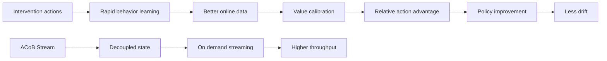
打分理由：VLA在线RL+ACoB，强相关且代码有（core 9 / wide 7）

### 5. ⭐ 📄 Block Sparse Attention with Log-Linear Complexity
arXiv [2609.31093](https://arxiv.org/abs/2609.31093) · HF 🔥 19 · Bohao Tang, Zhen Qin, Yuqi Pan 等 · [PDF](https://arxiv.org/pdf/2609.31093)

**一句话**：PISA用O(log N)层级Top-K做块稀疏注意力，复杂度降到O(Nlog N)
**为什么值得你看**：长上下文和稀疏注意力面试都常问

**核心架构**：反直觉点是：块稀疏 attention 本来想省算力，但“先给每个 query 给所有 block 打分再选 Top-K”又把复杂度拉回 O(N²)。作者的关键改变是把选块过程也做成 coarse-to-fine：先在更粗粒度的 key 层里筛，再逐层细化，每层只对受限候选做 LogSumExp scoring，所以阻断的失败是“选择代价本身吃掉稀疏收益”。最直接的支持来自语言建模和 retrieval 任务：在保持 commonsense reasoning 等 benchmark 接近 baseline 的同时，retrieval 表现更好，说明层级筛选没有把长程匹配能力彻底破坏。新意主要是组件层：不是换一种 attention 目标，而是重做 block selection 的计算图和 Triton kernel。

- 最强证据：保持通用 LM 表现，检索更好
- 没证明可无损替代 dense attention
- 复现依赖硬件友好的 Triton 实现
**精读价值**：值得看机制，但更偏长上下文系统优化
**关联**：[[Longformer]]、[[BigBird]]
#attention #long-context #sparse-attention · 难度：中等 · 建议：值得通读 (20 min)
前置：🔲 [[self-attention]] · 🔲 [[sparse attention]] · 🔲 [[long context]] · ◽ Triton

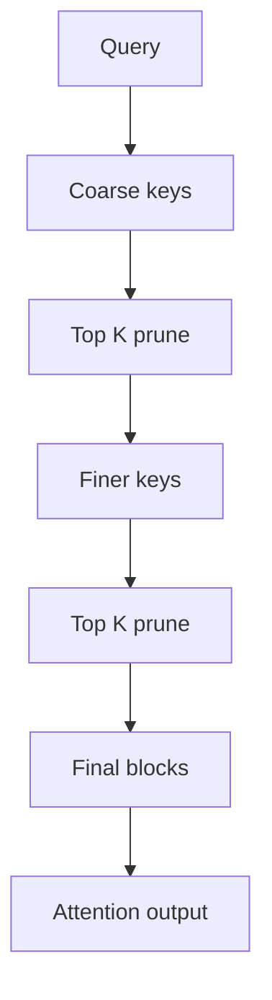
打分理由：块稀疏+高效选择，长上下文相关（core 8 / wide 6）

### 6. ⭐ 📄 RayOrch: Programming and Executing Lineage-Controlled Multi-Grain Dataflows for Foundation-Model Data Preparation
arXiv [2609.18703](https://arxiv.org/abs/2609.18703) · HF 🔥 43 · Xiaochen Ma, Zimo Meng, Junzhu Liang 等 · [PDF](https://arxiv.org/pdf/2609.18703) · [代码](https://github.com/OpenDCAI/RayOrch) ★16

**一句话**：RayOrch给数据流水线保留父子线索，MinerU 扩到64卡提速15.14×
**为什么值得你看**：很适合看 foundation-model 数据管线的系统设计

**核心架构**：反直觉点在于：数据准备里真正想并行的是 page、clip、frame 这些子项，但一旦把它们摊平成 flat records，系统就不知道每个结果该回哪个父项、什么时候能提前结束、失败该隔离到哪一层，最后又得补 group-by 和 reorder barrier。作者的关键改变是把“父子关系”提升成 runtime-owned structural lineage：每个 expansion 都记录 concrete child set、immediate parent、immutable ordinal 和 terminal state，调度时仍可跨父项混 batch，但 gather 直接按声明的 membership 和 ordinal 还原，阻断“物理 batch 破坏逻辑结构”的失败。最直接的证据是 MinerU 和视频 pipeline 的扩展结果：4→64 GPU 时分别有 15.14× 和 7.82× processing-time speedup，且 failure injection 里能抑制 6,241 个 sibling 计算进入 UDF。新意在系统组织层，不是单个算子。

- 最强证据：64 GPU 扩展和故障注入都过
- 没证明适合所有 DAG；限定 finite acyclic trees
- 复现需要改程序模型和运行时
**精读价值**：值得精读：是数据管线里少见的结构化运行时
**关联**：[[Ray Data]]、[[Dask]]
#data-pipeline #distributed #foundation-model · 难度：硬核 · 建议：建议精读
前置：◽ distributed systems · ◽ data pipeline · ◽ Ray · ◽ lineage

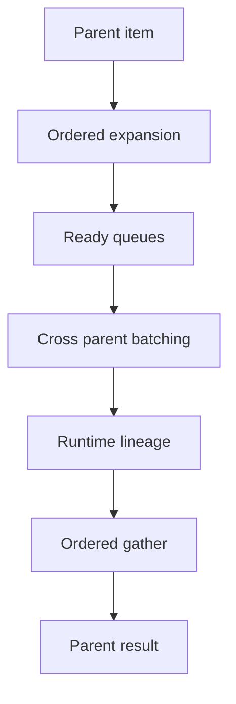
打分理由：数据准备系统：lineage受控执行（core 7 / wide 5）

### 7. ⭐ 📄 IndicBankBench: Evaluating Safety and Reliability of Language Model Assistants in Indian Retail Banking
arXiv [2609.29167](https://arxiv.org/abs/2609.29167) · HF 🔥 3 · Suvradip Paul, Chandra Bhushan, Harsh Sharma 等 · [PDF](https://arxiv.org/pdf/2609.29167) · [代码](https://github.com/npci/IndicBankBench) ★2

**一句话**：用四阶段判定抓出银行助理的 43.7%–58.2% 可靠性
**为什么值得你看**：做 agent 评测/金融工具调用很对口

**核心架构**：反直觉点在于：银行助手“答对一次”不等于能可靠办成事。它可能先给出正确余额，却在写入时选错账户，或因为上下文没理清而反复追问；只看最终回复或一次成功率，会把“偶尔碰对”和“稳定完成”混在一起。作者的关键改变是把一次银行交互拆成 safety、action and tool use、response adequacy、advisory quality 四道闸，并把大多数安全和工具检查做成 deterministic，只在“确认后写入”这类歧义处用窄 resolver，语义答复才交给 LLM judge。这样每个失败都会被定位到具体阶段，阻断“总分高但过程错”的掩盖效应。最直接的证据是三次重复评测：strict pass^3 只有 43.7%–58.2%，而 at-least-once success 有 60%–74%，证明一次跑通不能代表可靠性。新意主要在实证层：不是发明新模型，而是把评测协议改成可诊断、可复现的银行交互基准。

- strict pass^3 远低于 at-least-once
- 能区分问错问题和写错动作
- 复现依赖 mock 环境和判定器
**精读价值**：看速览就能判断，适合做评测题材参考
**关联**：[[BFCL]]、[[AgentBench]]
#safety #tool-use #benchmark · 难度：中等 · 建议：值得通读 (20 min)
前置：🔲 [[retrieval-augmented generation]] · 🔲 [[ReAct]] · 🔲 [[tool use]] · ◽ LLM-as-judge

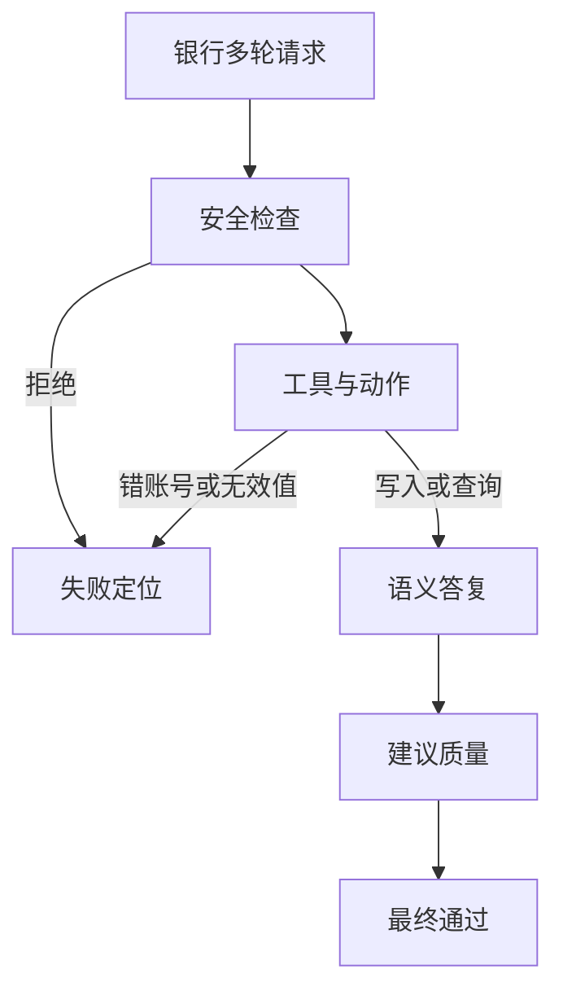
打分理由：带工具链分阶段评测，贴近LLM评测实战（core 7 / wide 4）

### 8. ⭐ 📄 MOPD-Router: Rethinking Teacher Routing in Multi-Teacher On-Policy Distillation
arXiv [2609.30837](https://arxiv.org/abs/2609.30837) · HF 🔥 2 · Tianze Xu, Yanzhao Zheng, Zhentao Zhang 等 · [PDF](https://arxiv.org/pdf/2609.30837) · [代码](https://github.com/TURLEing/MOPD-Router) ★2

**一句话**：用 token 级路由把多教师 OPD 提升 5.88 分
**为什么值得你看**：和 RLHF 后训练、蒸馏、路由设计直接相关

**核心架构**：现有 MOPD 的悖论是：你有多个专长教师，却把一个 prompt 整段硬分给单一 domain teacher，结果既依赖标签，又浪费其他教师在局部 token 上的互补信号。作者的关键改变是把路由粒度从 prompt 提到 token：student 按当前 rollout 逐 token 向全教师池取监督，不再训练单独 routing model，也不要求 domain labels。MOPD-Router 本身只是一个插槽式框架，核心在“每个 token 用什么 metric 选教师并加权”；其中 ExpertAlign 不看教师置信度或师生差异本身，而看“这个教师此刻给出的修正，是否还体现了它后训练里学到的专长方向”，从而阻断把泛化噪声当成有效监督。最强证据是无标签混合数据上较 Mean aggregation 提升 5.88 分、在有标签数据上还比标准 MOPD 高 3.95 分且不使用标签。新意主要在组件层和系统组织层：把 teacher assignment 从静态域分配改成 token 级动态组织。

- 无标签混合数据也能做多教师蒸馏
- ExpertAlign 四种设置都最好
- 没证明通用到所有 OPD 配方
**精读价值**：值得精读，核心是路由粒度和打分准则
**关联**：[[On-Policy Distillation]]、[[Multi-Teacher Distillation]]
#distillation #on-policy #routing · 难度：硬核 · 建议：建议精读
前置：🔲 [[on-policy distillation]] · 🔲 [[knowledge distillation]] · 🔲 [[self-attention]] · 🔲 [[scaling laws]]

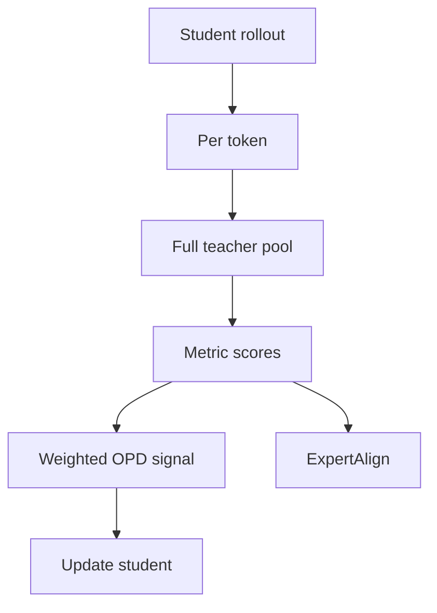
打分理由：多教师on-policy路由，贴近后训练（core 7 / wide 4）

## 🧰 项目 · 核心方向

### 9. ⭐ 🧰 microsoft/SkillOpt
[GitHub](https://github.com/microsoft/SkillOpt) ★17,795 (+111 今日) · Trending daily · Python

**一句话**：用文本技能优化器让冻结 agent 仅靠 skill.md 提升 23.5 分
**为什么值得你看**：Agent 工程和可复用技能沉淀很实用

**核心架构**：它解决的是一个很现实的痛点：agent 的能力通常散落在提示词、手工规则和一次性脚本里，难以像模型权重那样做稳定训练，也很难把“改进”沉淀成可部署资产。SkillOpt 的承重设计是把 skill document 当成可训练状态：先用一个 optimizer model 读轨迹和打分，再对单个 markdown skill 做 bounded add/delete/replace edits；只有当 held-out validation 真的变好时，候选编辑才被接受，配合 rejected-edit buffer、textual learning-rate budget 和 epoch 级慢/元更新，避免越改越坏。v0.2.0 又把 SkillOpt-Sleep 做成夜间离线循环，能从真实会话里 harvest→mine→replay→consolidate，并通过同一个验证门控。成熟度信号很强：有 PyPI、release、文档、WebUI、七个 target models 和三种 harness；README 声称的“零推理时额外模型调用”与公开流程一致。相对同类，它的差别不在 prompt 生成，而在把技能当作可优化工件并提供可部署 artifact。

- v0.2.0 上线 SkillOpt-Sleep
- 52 个 model-benchmark-harness 单元最好或并列最好
- 只改 skill 文档，不改权重
**为什么现在上榜**：v0.2.0 2026-07-02；后续 2026-07-24 又进入官方报道
**精读价值**：值得上手看文档，适合做 agent 记忆/技能层方案
**关联**：[[ReAct]]、[[SWE-bench]]
#rlhf #agent #optimization · 难度：中等 · 建议：值得通读 (20 min)
前置：🔲 [[planning]] · 🔲 [[memory]] · 🔲 [[ReAct]] · 🔲 [[knowledge distillation]]

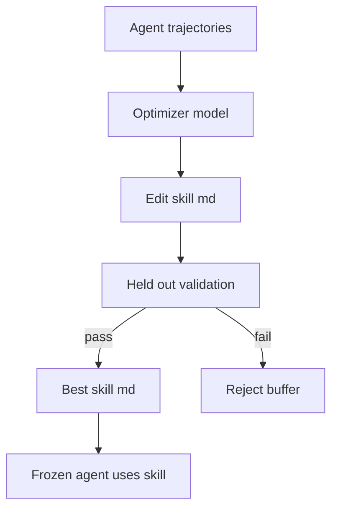
打分理由：技能训练/编辑方法，和agent后训练高度相关。（core 9 / wide 7）

### 10. ⭐ 🧰 topoteretes/cognee
[GitHub](https://github.com/topoteretes/cognee) ★31,140 (+103 今日) · Trending daily · tool · Python

**一句话**：Cognee is the open-source AI memory platform for agents
**为什么值得你看**：（dry-run：未调用 LLM，配置 OPENAI_API_KEY 后会生成中文速览）
- Give your AI agents persistent long-term memory with small models for free
#agent #memory #rag · 难度：中等 · 建议：看速览即可
打分理由：agent持久记忆平台，RAG/记忆相关。（core 8 / wide 7）

### 11. ⭐ 🧰 alibaba/open-code-review
[GitHub](https://github.com/alibaba/open-code-review) ★42,259 (+20657 本月) · Trending monthly · tool · Go

**一句话**：Secure, fast, efficient, battle-tested at Alibaba's scale
**为什么值得你看**：（dry-run：未调用 LLM，配置 OPENAI_API_KEY 后会生成中文速览）
- Hybrid architecture code review tool: deterministic pipelines + LLM Agent, precise line-level comments, built-in multi-l
#agent #code-review #llm #security · 难度：中等 · 建议：看速览即可
打分理由：LLM agent+确定性流水线，适合评测与安全讨论。（core 7 / wide 8）

### 12. ⭐ 🧰 trailofbits/coop
[GitHub](https://github.com/trailofbits/coop) ★714 (+448 本周) · Trending weekly · infra · Rust

**一句话**：Isolated VM environment for running Claude Code and Codex
**为什么值得你看**：（dry-run：未调用 LLM，配置 OPENAI_API_KEY 后会生成中文速览）
#sandbox #agent #security · 难度：中等 · 建议：看速览即可
打分理由：Agent运行隔离环境，安全基础设施价值高（core 7 / wide 5）

### 13. ⭐ 🧰 hokindeng/object-permanence
[GitHub](https://github.com/hokindeng/object-permanence) ★293 · infra · Python

**一句话**：用 Blender 生成 1.5M V2V 样本，训练世界模型的 object permanence
**为什么值得你看**：适合看世界模型/视频生成怎么做数据与训练闭环

**核心架构**：原文把问题落在一个反直觉场景：物体被遮挡后，模型常把它“忘掉”，续写视频时直接消失或位置乱跳。现有做法难点不在单帧识别，而在把遮挡前后的状态连续地写进 world model。作者的关键改变是把任务做成 video-to-video 的 continuation：输入是遮挡前视频，输出是遮挡后视频，监督不是只看视觉相似，而是用 trajectory.npz 提供每个 body 的时序真值，阻断“看见才存在”的失败模式。最直接的证据是它同时给出 1.5M 训练集、benchmark 和 model，说明这不是单点 demo，而是完整可复现实验闭环。新意主要在系统组织层：150 个 Blender task generators + 训练栈 + benchmark 绑定成一套可批量造题、训模、评测的基础设施。

- 最强证据：1.5M 数据+benchmark+model 闭环
- 原文未给出指标，效果需看论文
- 复现门槛高：Blender 生成链+Trainium2 训练栈
**精读价值**：值得看数据工厂怎么定义世界模型任务
**关联**：[[NeRF]]、[[video generation]]
#world-model #video-generation #robotics · 难度：硬核 · 建议：值得通读 (20 min)
前置：◽ world model · 🔲 [[video generation]] · 🔲 [[vision transformer]] · 🔲 [[latent diffusion]]

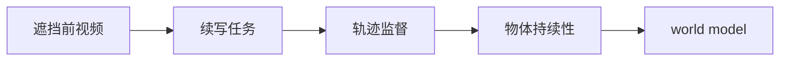
打分理由：世界模型具身关键点：object permanence（core 7 / wide 4）

### 14. ⭐ 🧰 rlaope/oh-my-hermes
[GitHub](https://github.com/rlaope/oh-my-hermes) ★3,007 (+1837 本月) · Trending monthly · infra · Python

**一句话**：用 OMH 给 Hermes 加操作层，2.0.5 合并 142 个 PR
**为什么值得你看**：适合看 agent 工作流、记忆层和模型路由怎么工程化

**核心架构**：它解决的不是“再造一个 agent”，而是 Hermes 已经能做事后，怎么避免请求一进来就直接乱跑。OMH 的核心是一个 operating layer：先把请求分到类别，再给出工作流和 evidence gate，最后调用 Hermes-native skills，阻断“同一请求走同一条线性流程”导致的误路由、证据缺失和模型不匹配。README 里最强的成熟度信号是 v2.0.5 stable、142 PR 合并、明确说明 2.0.4 因 GitHub 发布体积限制没发出去，2.0.5 承接了那批工作，说明它不是单次打包而是持续维护的发布链。与同类只做 prompt wrapper 的项目比，它的差异维度是：把分类、路由、记忆、证据边界做成可管理层，而不是只堆技能列表。

- 最强证据：v2.0.5 stable，142 PR 合并
- 2.0.4 未发布，说明 release 链真实可追踪
- 偏 Hermes 生态，迁移到别的 agent 需改接入层
**为什么现在上榜**：v2.0.5，2026-09-22
**精读价值**：值得看 agent 操作层怎么把流程管起来
**关联**：[[ReAct]]、[[model context protocol]]
#agent #memory #workflow · 难度：中等 · 建议：值得通读 (20 min)
前置：🔲 [[planning]] · 🔲 [[memory]] · 🔲 [[ReAct]] · 🔲 [[model context protocol]]

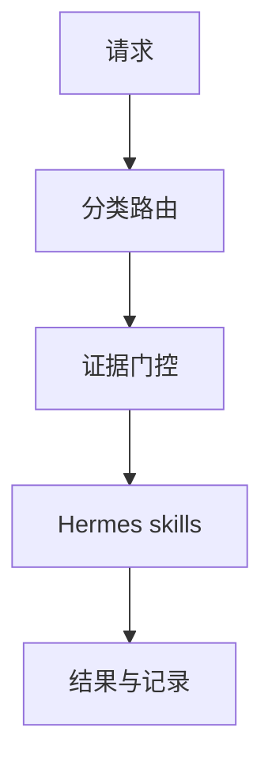
打分理由：Hermes插件+长记忆/工作流，可能可迁移。（core 6 / wide 6）

## 🌐 全领域热点

### 15. 🌐 🧰 k2-fsa/OmniVoice
[GitHub](https://github.com/k2-fsa/OmniVoice) ★14,018 (+4543 本月) · Trending monthly · model · Python

**一句话**：用 diffusion LM 式架构做 600+ 语言零样本 TTS，RTF 低至 0.025
**为什么值得你看**：适合看多语种 TTS、voice cloning 和推理加速

**核心架构**：它解决的是多语种零样本 TTS 的典型悖论：语言覆盖越广，模型越容易变慢、变糊，voice cloning 也越不稳。作者的关键设计是用 diffusion language model-style architecture 把生成和控制整合起来，再把 reference audio、ASR 转写、speaker attributes 作为条件输入，阻断“先识别再拼接”那类容易丢音色和音素一致性的失败路径。README 给出的最直接证据是 600+ languages、voice cloning、voice design 和 RTF 0.025；同时 0.2.1 里修了 `flex_attention` 的 autocast，明确说明训练时曾遇到 silent fp32 attention 导致约 4x slowdown，这比单纯宣传快更能看出工程成熟度。新意主要在系统组织层和实证层：把多语种覆盖、可控语音、速度和训练修 bug 放到同一套实现里。

- 最强证据：600+ 语言，RTF 0.025
- 0.2.1 修复 fp32 attention 慢 4x 的训练问题
- 代码偏完整，复现仍受模型权重和设备影响
**为什么现在上榜**：最近 release 0.2.1，2026-07-16
**精读价值**：值得看 diffusion 式 TTS 怎么兼顾覆盖与速度
**关联**：[[VALL-E]]、[[diffusion model]]
#tts #voice-cloning #multilingual · 难度：中等 · 建议：值得通读 (20 min)
前置：🔲 [[diffusion model]] · 🔲 [[latent diffusion]] · ◽ ASR · 🔲 [[prompt injection]]

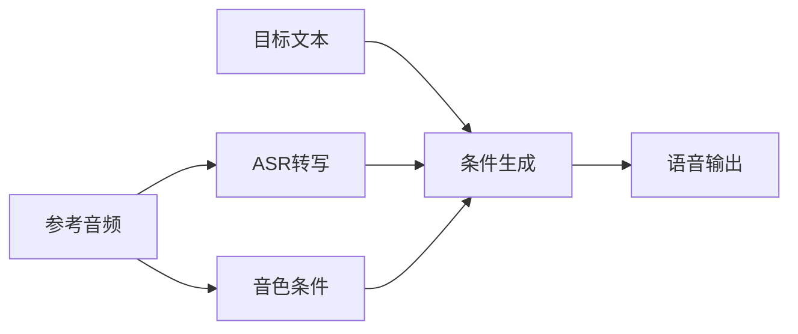
打分理由：高质量多语TTS/语音克隆，价值较高但非核心LLM。（core 5 / wide 8）

### 16. 🌐 🧰 hydra-db/hydradb
[GitHub](https://github.com/hydra-db/hydradb) ★12,271 (+1665 今日) · Trending daily · infra · Rust

**一句话**：用 S3+Rust 做图数据库，分离存储与计算
**为什么值得你看**：对 RAG/图检索和系统面试都很有参考价值

**核心架构**：它解决的是“图库越大，单机内存和重建索引越撑不住，但读写还要强一致”的悖论。传统图数据库把数据、索引和计算绑死在本地盘上，扩容通常意味着搬图、重建和停机窗口。HydraDB 的关键变化是把 object store 变成唯一持久层：graph-node 只负责 canonical mutations 和查询，graph-indexer 异步构建不可变 CSC 索引，读请求始终在一个 pinned SlateDB snapshot 上执行；索引落后时，再把可见 WAL overlay 到 base 上，避免“索引没跟上就读错”。最直接的证据是它把查询正确性建立在快照和 WAL 叠加上，而不是依赖索引实时完成；再加上 CAS lease 和 writer epoch，说明它重点防的是 stale writer 和并发写冲突。新意主要在系统组织层，不是单个算法：把图数据库拆成可替换的计算节点、背景索引器和对象存储真源。

- 最强证据：snapshot + WAL overlay 保证一致读
- 没证明：大规模并发/热点图下的真实吞吐上限
- 复现不低：要 S3、GraphBLAS、SlateDB 和 Rust 环境
**精读价值**：适合看系统设计，不适合只想用图查询的人
**关联**：[[Neo4j]]、[[Apache HBase]]
#database #graph · 难度：硬核 · 建议：建议精读
前置：🔲 [[retrieval-augmented generation]] · 🔲 [[graph RAG]] · 🔲 [[KV cache]]

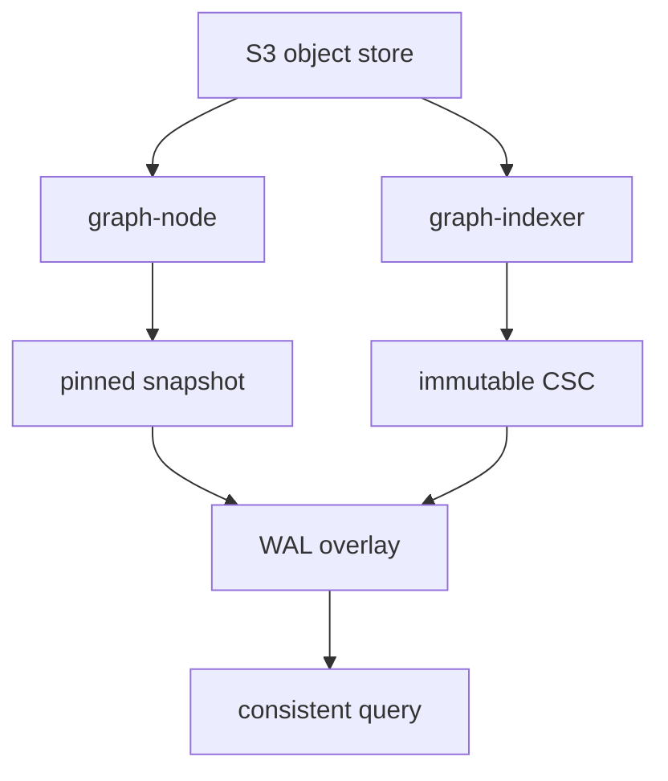
打分理由：图数据库/存储基础设施，间接支持agent。（core 3 / wide 7）

### 17. 🌐 📄 InternW0-Δ: A World Action Model Bridging Predictive Dynamics and Actions with 20K+ Hours of Open Data
arXiv [2609.31394](https://arxiv.org/abs/2609.31394) · HF 🔥 17 · Xingyu Miao, Zizun Li, Baole Fang 等 · [PDF](https://arxiv.org/pdf/2609.31394)

**一句话**：用 20K+ 小时开放数据训 WAM，提动作可控表征
**为什么值得你看**：适合看机器人后训练和多模态表征怎么接到控制

**核心架构**：它要解决的反直觉点是：视频世界模型能预测未来，不代表能更会控机器人。原先方法常把“看懂会发生什么”和“决定现在怎么动”混在一起，结果要么推理时滚未来视频太慢，要么学到的动态表征对动作没用。InternW0-Δ 的关键改动是把预测和控制改成有方向的信息流：video expert 负责视觉动态，action expert 负责动作，二者在 MoT 里交互；Causal Imprint 只在训练时用未来监督，学“哪些未来变化对动作有用”，推理时不再 rollout future video；4D teacher 的蒸馏则把几何和运动先验注入 video expert，减少纯视频表征的漂移。最直接的证据是它在分布偏移的 LIBERO-Plus 92.8% 和 RoboTwin 2.0 Clean2Random 71.9% 上领先，说明“动作相关的预测表征”确实比单纯预测更稳。新意在组件层和实证层都很明显。

- 最强证据：分布偏移下成功率最高
- 没证明：训练-only 未来监督的单独贡献幅度
- 复现难：20K+ 小时数据与双阶段后训练
**精读价值**：想看 world model 到 control 的关键桥接，这篇值得精读
**关联**：[[RT-2]]、[[V-JEPA]]
#world-action-model #robotics #multimodal · 难度：硬核 · 建议：建议精读
前置：🔲 [[vision transformer]] · 🔲 [[VLM]] · 🔲 [[diffusion model]]

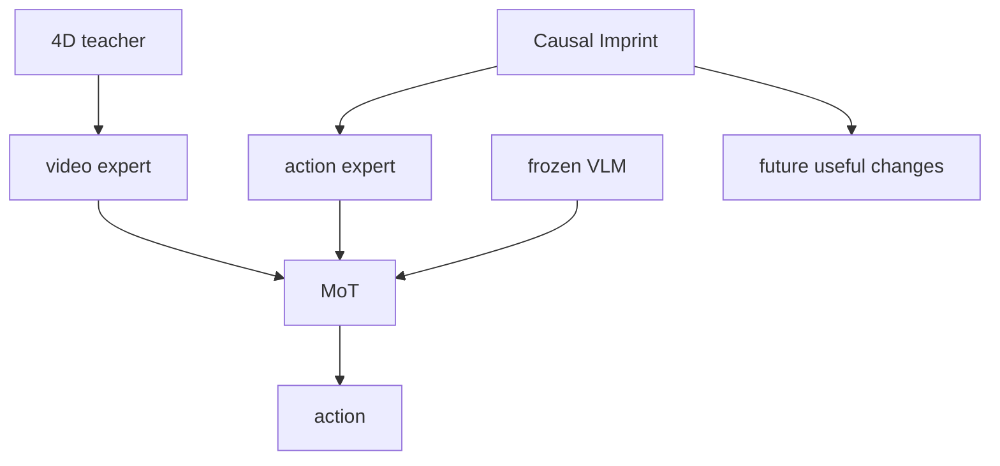
打分理由：机器人WAM，MoT框架与数据规模突出（core 6 / wide 7）

### 18. 🌐 🧰 krillinai/OpenCreator
[GitHub](https://github.com/krillinai/OpenCreator) ★12,483 (+551 本周) · Trending weekly · tool · TypeScript

**一句话**：用 Codex CLI 组一个本地创作工作台，v3.2.3
**为什么值得你看**：适合看 agent 工作台怎么把创作与开发流程串起来

**核心架构**：它解决的是“同一套内容创作和 agent 任务，往往散在多个工具里，状态、文件、审批和后台 run 彼此断开”的痛点。OpenCreator 的承重组件不是自己重写 agent loop，而是直接复用 Codex CLI 作为执行引擎，再包一层本地 Runtime、Web/desktop 工作台和项目级状态机；检测到本地已有 ChatGPT sign-in 或 API key 就复用，否则走向导配置。它的核心机制是双模式共享状态：视觉工作区和 Agent conversation 共享同一项目、Run、memory、attachments、approvals，后台任务可以继续跑。成熟度信号比较强：有桌面版、release v3.2.3、明确的最近更新说明和多语言文档；但 README 里强调的“共享状态机、skills、MCP、memory”更像产品编排层，是否稳定还要看实际插件生态和工作流覆盖。和一般套壳客户端的差别在于它把运行时和创作工具做成同一状态面，而不是单纯聊天入口。

- 最强证据：v3.2.3 近期持续迭代
- 没证明：外部模型与技能生态的稳定性
- 复现门槛低：桌面版与 Docker/本地运行都给了
**为什么现在上榜**：最近 release：v3.2.3（2026-09-24）
**精读价值**：如果你关心 agent 工作台产品形态，这个值得看
**关联**：[[Codex]]、[[OpenHands]]
#multimodal #agent #workspace · 难度：中等 · 建议：值得通读 (20 min)
前置：🔲 [[ReAct]] · 🔲 [[planning]] · 🔲 [[memory]] · 🔲 [[model context protocol]]

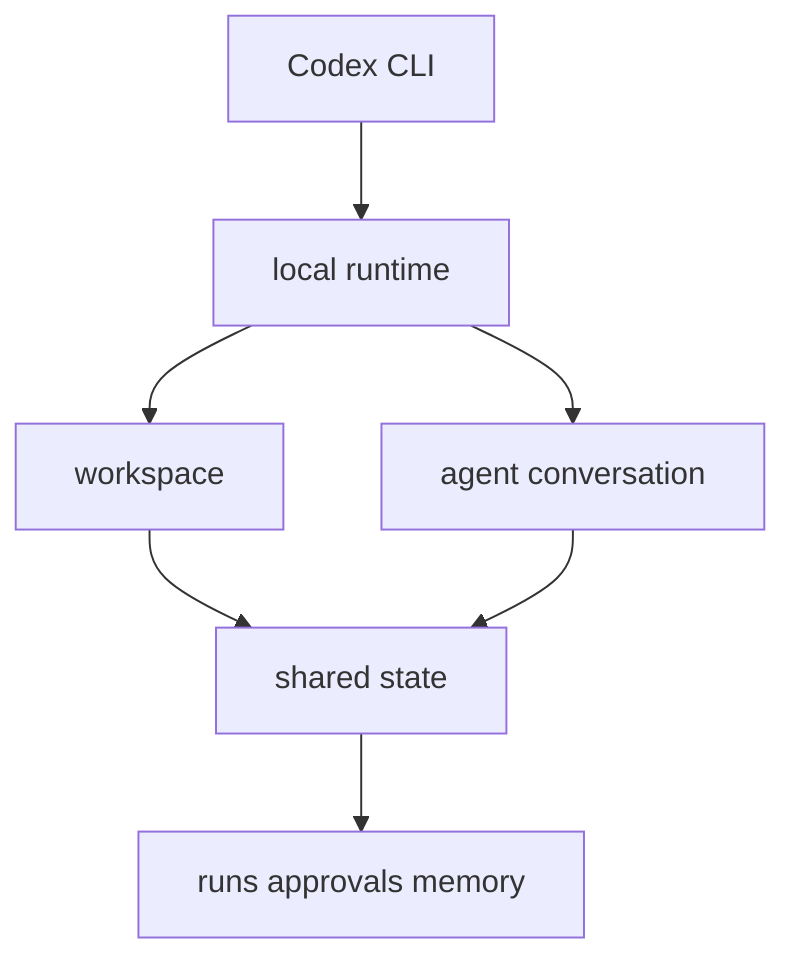
打分理由：集成式AI创作工作台，偏工程但较热（core 4 / wide 6）

---
想精读哪一篇？在 Claude 里说：`精读 2026-09-28 第 N 条`，Jarvis 会按你的 known.md 只讲你不会的部分。