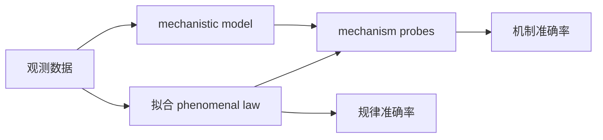
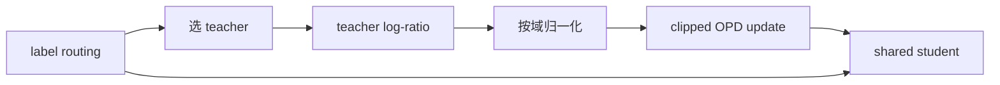
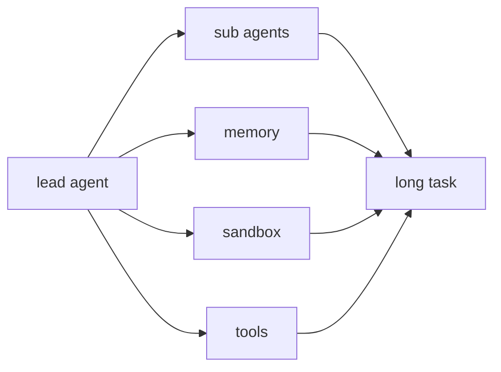
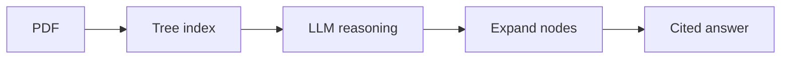
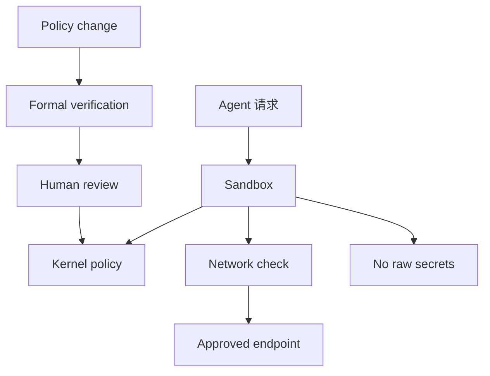
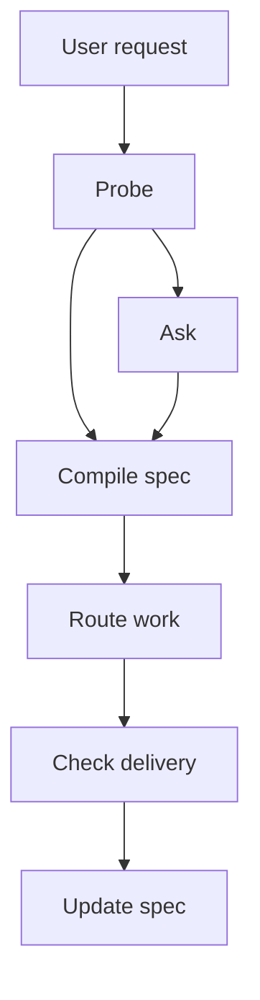
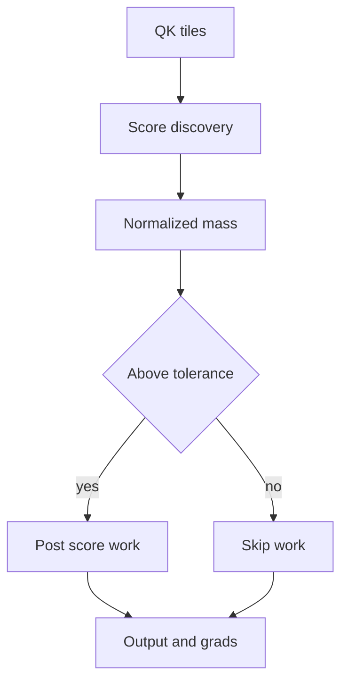
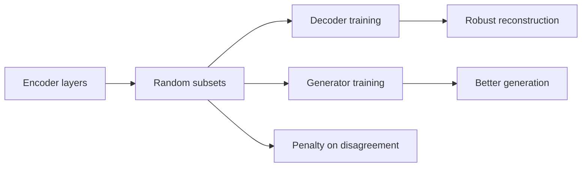
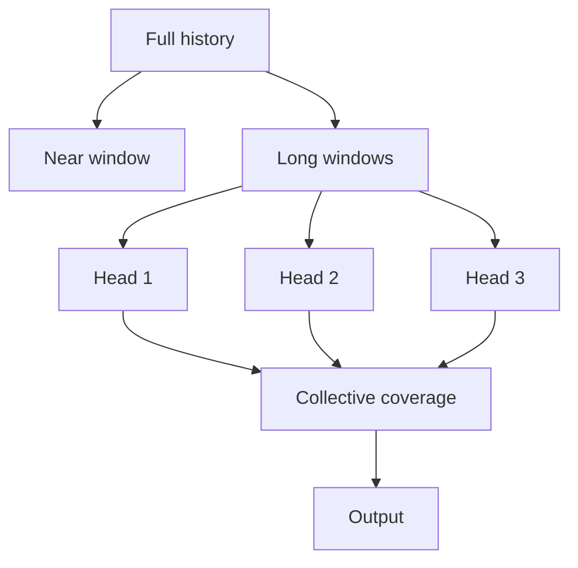
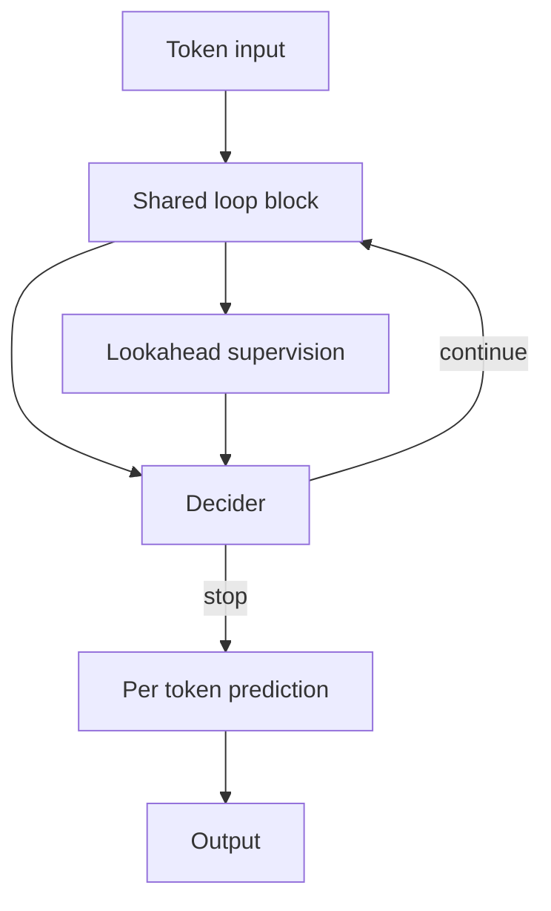

# Jarvis 日报 · 2026-09-29

候选 751 → 过滤后 364 → 入选 18。图例：⭐ 核心方向 · 🌐 全领域热点 · ✅ 已掌握前置 · 🔲 需补前置

## 📄 论文 · 核心方向

### 1. ⭐ 📄 Groupwise Agentic Grading and Advantage Redistribution for Code Agent RL
arXiv [2609.32577](https://arxiv.org/abs/2609.32577) · HF 🔥 69 · Jinhao Dong, Liang Zhao, Zihao Yue 等 · [PDF](https://arxiv.org/pdf/2609.32577)

**一句话**：Reinforcement learning (RL) for code agents often uses executable tests to provide binary rewards
**为什么值得你看**：（dry-run：未调用 LLM，配置 OPENAI_API_KEY 后会生成中文速览）
- With these rewards, Group Relative Policy Optimization (GRPO) assigns identical advantages to test-passing trajectories 
- This leaves the policy without a learning signal that favors clean, targeted implementations over those containing unnec
#rl #grpo #code-agent · 难度：中等 · 建议：看速览即可
打分理由：代码agent RL的质控打分与优势再分配，重点相关（core 9 / wide 6）

### 2. ⭐ 📄 SkillDRE: Dual-Stage Red-Team Evolution of Agent Skills via Pre-Execution and Runtime Feedback
arXiv [2609.32400](https://arxiv.org/abs/2609.32400) · HF 🔥 2 · Pengyu Zhu, Jingyi Yang, Yi Liu 等 · [PDF](https://arxiv.org/pdf/2609.32400)

**一句话**：Agent skills package instructions, executable code, and task-specific resources into reusable artifacts that agents can improve using execution feedback
**为什么值得你看**：（dry-run：未调用 LLM，配置 OPENAI_API_KEY 后会生成中文速览）
- The same mechanism also enables attackers to evolve malicious skills, making them more effective and less detectable
- However, a candidate skill may pass pre-execution scanning yet fail to realize its target under runtime defenses, while 
#agent #security #redteam · 难度：中等 · 建议：看速览即可
打分理由：agent技能演化框架，含对抗与评测细节。（core 9 / wide 4）

### 3. ⭐ 📄 SEABench: Benchmarking Endogenous Misalignment In Self-Evolving Agents
arXiv [2609.35596](https://arxiv.org/abs/2609.35596) · Saswat Das, Parvati Viswanathan, Daniel Donnelly 等 · [PDF](https://arxiv.org/pdf/2609.35596)

**一句话**：Self-evolving LLM agents have gained prominence for their ability to improve after deployment by modifying their harness, including their controller instruction
**为什么值得你看**：（dry-run：未调用 LLM，配置 OPENAI_API_KEY 后会生成中文速览）
- However, locally useful updates may persist into later tasks where they produce unsafe behavior, even without direct adv
- To study this risk, we introduce SEABench, a benchmark for studying endogenous misalignment arising from agent self-evol
#agent #safety #evaluation #rlhf · 难度：中等 · 建议：看速览即可
打分理由：自演化agent失配基准，贴近agent安全评测（core 9 / wide 6）

### 4. ⭐ 📄 Share-Borne AI Virus: Memory-Hopping Attacks Across LLM Agents
arXiv [2609.35576](https://arxiv.org/abs/2609.35576) · Sidharth Pulipaka, Ansh Sharma, Stanislau Hlebik 等 · [PDF](https://arxiv.org/pdf/2609.35576) · [代码](https://github.com/psidharth567/Share-Borne-Virus)

**一句话**：Large language models are increasingly deployed as stateful assistants that retain information across interactions and use tools to read, modify, and create per
**为什么值得你看**：（dry-run：未调用 LLM，配置 OPENAI_API_KEY 后会生成中文速览）
- As these artifacts are shared between users, they form an indirect communication channel between otherwise independent a
- We study a failure mode in which this channel enables self-propagating attacks
#security #agent #memory #llm · 难度：中等 · 建议：看速览即可
打分理由：跨agent记忆/工件传播攻击，安全面试友好（core 9 / wide 6）

### 5. ⭐ 📄 Frontier Learning: Training LLM Reasoners at the Edge of Capability
arXiv [2609.35426](https://arxiv.org/abs/2609.35426) · Robin Faro, Shyam Sundhar Ramesh, Ilija Bogunovic 等 · [PDF](https://arxiv.org/pdf/2609.35426)

**一句话**：Reinforcement Learning-based post-training of Large Language Models (LLM) has been successfully applied to improve their reasoning capabilities
**为什么值得你看**：（dry-run：未调用 LLM，配置 OPENAI_API_KEY 后会生成中文速览）
- Existing pipelines primarily finetune LLMs on a fixed pool of problems specified prior to training using the GRPO loss
- This is fundamentally limiting, as learning signal arises only when policy rollouts mix successes and failures, causing 
#rlhf #reasoning #frontier-learning #post-training · 难度：中等 · 建议：看速览即可
打分理由：开放式生成题目做推理后训练，很对口（core 9 / wide 7）

### 6. ⭐ 📄 ARISE: Adapting to Evolving Capability Gaps in Agentic Reinforcement Learning
arXiv [2609.35532](https://arxiv.org/abs/2609.35532) · Kun Feng, Yuchen Fang, Yiyang Tan 等 · [PDF](https://arxiv.org/pdf/2609.35532)

**一句话**：As a long-horizon agent improves through experience, previously observed weaknesses may recede while new limitations emerge, continually changing what it still 
**为什么值得你看**：（dry-run：未调用 LLM，配置 OPENAI_API_KEY 后会生成中文速览）
- Yet the learning process often remains tied to a static view of these needs: fixed behavioral criteria and training prio
- Even when capability gaps are identified, rollouts from the current policy may repeatedly reproduce the same failures ra
#agent #rl #evaluation · 难度：中等 · 建议：看速览即可
打分理由：面向随能力演进的agent RL训练与评测（core 9 / wide 6）

### 7. ⭐ 📄 MechBench: Can AI Scientific Agents Discover Mechanisms Beyond Phenomenal Laws?
arXiv [2609.35515](https://arxiv.org/abs/2609.35515) · Zihan Yu, Jiadong Zhang, Jialin Cheng 等 · [PDF](https://arxiv.org/pdf/2609.35515)

**一句话**：MechBench把“能拟合规律”与“能还原机制”拆开测，Codex 机制准确率仅13.75%
**为什么值得你看**：适合看科学Agent评测缺口与机制推理边界

**核心架构**：反直觉点在于：很多 scientific agent 能把观测拟合成对的方程，却说不出系统内部到底靠什么关系在工作。旧 benchmark 只看 phenomenal-law recovery，等于把“会背答案”当成“懂机制”。作者的关键改动是把任务定义成 mechanistic model，并用 mechanism probes 去问那些只能由机制推出、但不能从观测律直接反推的内部后果；再用受控 mutation 造出不熟悉但科学可解释的机制变体，避免模型靠背诵 textbook 结构蒙对。最直接的证据是 Codex with GPT-5.6-sol：Core-set 上 phenomenal-law accuracy 到 35.00%，mechanism accuracy 只有 13.75%，而且在已恢复规律的案例里仍有 64.29% 机制失败。新意主要在实证层，但也顺带提出了组件层的新评测接口。

- 规律对了不代表机制对了
- mutation 越强，机制掉得越快
- correct law 也救不回机制推理
**精读价值**：值得精读：它重新定义了 scientific agent 的评测目标
**关联**：[[symbolic regression]]、[[LLM-SR]]
#agent #scientific-discovery #benchmark · 难度：中等 · 建议：值得通读 (20 min)
前置：◽ symbolic regression · 🔲 [[planning]] · ◽ scientific agents

打分理由：机制发现基准，贴合科学智能体。（core 9 / wide 7）

### 8. ⭐ 📄 Beyond Teacher Assignment: Domain-Normalized Multi-Teacher On-Policy Distillation
arXiv [2609.35347](https://arxiv.org/abs/2609.35347) · HF 🔥 138 · Xin Li, Hao Jiang, Xin Gao 等 · [PDF](https://arxiv.org/pdf/2609.35347) · [代码](https://github.com/LiXin97/DN-MOPD) ★10

**一句话**：DN-MOPD给多教师蒸馏加了按域归一化，Qwen3.5 六任务均值比 MOPD 提升1.17-3.08
**为什么值得你看**：适合看 on-policy distillation 和多技能融合的训练细节

**核心架构**：反直觉点在于：多教师 MOPD 已经把“该谁教”解决了，但学生还是学不出最强数学老师的收益，甚至被 instruction-following 的梯度淹没。作者发现问题不在路由，而在反馈尺度：不同 domain 的 teacher-student log-ratio spread 差很多，instruction-following 的信号更分散，更新时几乎主导了共享参数。DN-MOPD 的核心改动很朴素：保留 label routing，但按每个 batch 内各域反馈的 spread 做有界、保号的重标定，把各 teacher 的优势拉到同一尺度，再走原来的 clipped OPD 更新。最直接证据是三种 Qwen3.5 尺寸、三个 seed、两个长度预算下，DN-MOPD 都稳定优于 MOPD，并且把数学专家丢失的大部分收益追回来；控制实验还显示，收益主要来自压低 instruction-following，而不是单纯抬高数学。新意在系统组织层：不是换 loss，而是把多教师信号的标定规则补上了。

- 路由对了，尺度仍会毁掉训练
- 收益主要来自压低 IF 反馈
- 无需新 teacher 或 learned router
**精读价值**：值得精读：多教师蒸馏里“谁教”之外的关键变量被补齐了
**关联**：[[MOPD]]、[[Uni-OPD]]
#distillation #on-policy #multi-teacher · 难度：中等 · 建议：值得通读 (20 min)
前置：🔲 [[on-policy distillation]] · ◽ policy gradient · 🔲 [[reward model]]

打分理由：领域归一化多教师on-policy蒸馏，与你方法高度贴合（core 8 / wide 6）

## 🧰 项目 · 核心方向

### 9. ⭐ 🧰 bytedance/deer-flow
[GitHub](https://github.com/bytedance/deer-flow) ★83,225 (+79 今日) · Trending daily · infra · Python

**一句话**：DeerFlow是字节系开源 super-agent harness，2.1.0 加了可验证执行与持久化 delegation
**为什么值得你看**：适合看 agent 编排、记忆和沙箱的成熟开源实现

**核心架构**：它解决的是长任务 agent 不是“会不会调用工具”，而是“跑几分钟到几小时后还能不能控住、复现和继续”。核心骨架是 super-agent harness：lead agent 组织 sub-agents，memory 负责跨轮保留上下文，sandbox 约束文件与代码执行，message gateway 负责外部通道，skills 让能力可插拔。2.1.0 的关键取舍是把 trust 和 operability 放到台面上：可验证执行、durable batch delegation、pluggable memory backends、更多 sandbox provider、out-of-tree extension、认证授权、workspace/branching/referenced conversations，说明它已经从“能跑 demo”往“能管理工作流”走。成熟度信号很强：stars 83k+，2026-09-24 release，2.1.0 有 772 merged PRs，README 明确写出 Docker/本地开发、MCP、LangSmith/Langfuse tracing 和安全注意事项。和一般 agent 框架相比，它差在长任务治理能力，而不只是 tool-use API。

- 2.1.0 强调 verifiable execution 和 delegation
- 83k+ stars，2.1.0 有 772 PR
- 更像可运营 harness，不是轻量 agent demo
**为什么现在上榜**：最近 release：v2.1.0（2026-09-24），v2.0.0（2026-06-25）
**精读价值**：值得看：这是少数把 agent 可靠性做成系统能力的开源项目
**关联**：[[AutoGen]]、[[LangGraph]]
#agent #superagent #memory #tool-use · 难度：中等 · 建议：值得通读 (20 min)
前置：🔲 [[ReAct]] · 🔲 [[memory]] · 🔲 [[multi-agent]] · 🔲 [[model context protocol]]

打分理由：长程 SuperAgent 框架，方法细节强（core 10 / wide 9）

### 10. ⭐ 🧰 OpenHands/OpenHands
[GitHub](https://github.com/OpenHands/OpenHands) ★89,531 (+4214 本月) · Trending monthly · tool · TypeScript

**一句话**：OpenHands 用可切换后端的 Agent Canvas 管理编码代理，支持本地/云端与自动化流程
**为什么值得你看**：贴近 LLM Agent 编排与工程落地，面试常问

**核心架构**：它解决的反直觉点是：编码 agent 真正难的不是“会不会写代码”，而是“同一个任务要在本地、容器、公司内网、云端之间切换，还要保持会话与自动化不中断”。线性工具链做不到，因为 backend、权限和长期运行状态一变，整个流程就断。OpenHands 的关键概念是把前端对话面板和后端 agent server 解耦：Canvas 负责入口与会话控制，agent backend 负责执行，二者可在 local、Docker、VM、cloud 间切换；再往上叠 automation，把 Slack、GitHub、Linear 这类事件变成触发条件，让 agent 进入“循环 + 中间件”的工作方式，而不是一次性脚本。最直接的证据是它明确支持同一前端切换多种 backend，并能在 schedule/webhook 下跑预置自动化。新意主要在系统组织层，不是单个模型或算法层。

- 多后端切换不丢会话，支持本地到云端
- 自动化把 GitHub/Slack 事件接入代理循环
- 原文未给出完整测试覆盖，复现偏工程重
**为什么现在上榜**：v1.24.0（2026-09-25）刚发，且连续高频更新
**精读价值**：适合看系统组织思路，精读价值高
**关联**：[[SWE-bench]]、[[ReAct]]
#agent #coding #orchestration · 难度：中等 · 建议：建议精读
前置：🔲 [[planning]] · 🔲 [[memory]] · 🔲 [[model context protocol]] · 🔲 [[multi-agent]]

打分理由：顶流代码智能体，工程可复现，面试高频（core 9 / wide 9）

### 11. ⭐ 🧰 sgl-project/sglang
[GitHub](https://github.com/sgl-project/sglang) ★36,597 (+4058 本月) · Trending monthly · infra · Python

**一句话**：SGLang 用高性能 serving 引擎支撑 LLM 与多模态推理，并持续加速新模型
**为什么值得你看**：训练后推理栈与系统面试高频，能讲清 KV cache 和 serving 组织

**核心架构**：它面对的悖论是：模型越大、上下文越长、任务越多模态，推理不只慢，还会被 prefill、decode、batching、缓存复用彼此牵制；单纯堆 GPU 只能缓解一时。SGLang 的关键改变是把 serving 视为运行时调度问题：围绕 KV cache、batch scheduler、load balancer、structured output 和模型特化优化，把“请求如何进入、如何合批、何时复用缓存、何时走特化路径”当成核心。这样能阻断吞吐被小请求和异构负载拖垮。最直接的支持来自它的 release 说明：v0.4 强调 zero-overhead batch scheduler、cache-aware load balancer 和 faster structured outputs；后续又持续给 DeepSeek、Kimi、TPU、diffusion 等新模型 day-0 支持。新意主要在系统组织层，兼有较强实证层积累。

- release 持续补新模型与新硬件，工程活跃度高
- 最强证据是大规模部署与吞吐博客，不是单点 benchmark
- 细节多且强依赖部署环境，复现门槛高
**为什么现在上榜**：v0.5.20（2026-09-18）刚发，且有 2026 年多次大事件
**精读价值**：推理系统方向值得精读，尤其看调度与缓存
**关联**：[[vLLM]]、[[TensorRT-LLM]]
#inference #serving #multimodal · 难度：硬核 · 建议：建议精读
前置：🔲 [[KV cache]] · 🔲 [[flash attention]] · 🔲 [[quantization]] · 🔲 [[speculative decoding]]

打分理由：高性能LLM/VLM推理Serving框架，工程价值高（core 8 / wide 8）

### 12. ⭐ 🧰 VectifyAI/PageIndex
[GitHub](https://github.com/VectifyAI/PageIndex) ★37,207 (+822 今日) · Trending daily · infra · Python

**一句话**：PageIndex 用树索引替代向量库做 RAG，单页约 $0.001 建索引
**为什么值得你看**：RAG 与长文档检索很对口，且很适合面试讲“相似性不等于相关性”

**核心架构**：它抓住的悖论是：长文档里最相关的信息，往往不是语义最像 query 的段落；向量检索会把“相似”误当“相关”，在金融、法务、技术手册里尤其容易错。PageIndex 的关键概念改动是把 vector index 换成 hierarchical tree index，让 LLM 不是做最近邻搜索，而是沿树做 reasoning：先由布局/书签生成树，再用模型只写节点摘要，检索时根据上下文逐层展开。这样阻断的是“chunking 破坏结构”和“embedding 丢上下文”两类失败。最直接的证据是它在 FinanceBench 报告 98.7% accuracy，并明确给出本地模式下约 $0.001/页的建索引成本；同时它的 benchmark 说明同一套 local setup 用于 62 个问题、34 份 PDF。新意在组件层和实证层：换了索引结构，也给出了替代 vector RAG 的对比结果。

- 最强卖点是树索引+reasoning，不是向量召回
- 对专业长文档更有优势，但依赖文档结构质量
- 检索链路更复杂，复现和调参难于传统 RAG
**为什么现在上榜**：v0.2.20（2026-09-28）刚发，且 local mode / Flash engine 是近期更新点
**精读价值**：RAG 方向值得读，核心是索引范式变化
**关联**：[[RAG]]、[[Graph RAG]]
#rag #reasoning #retrieval #benchmark · 难度：中等 · 建议：值得通读 (20 min)
前置：🔲 [[retrieval-augmented generation]] · 🔲 [[embedding]] · 🔲 [[reranker]] · 🔲 [[long context]]

打分理由：向量less/推理式 RAG，方向强且有工程（core 8 / wide 7）

### 13. ⭐ 🧰 NVIDIA/OpenShell
[GitHub](https://github.com/NVIDIA/OpenShell) ★10,435 (+978 今日) · Trending daily · infra · Rust

**一句话**：用 policy sandbox 约束 agent 权限，避免越权读写和泄密
**为什么值得你看**：做 agent/runtime 面试很对口，偏系统安全

**核心架构**：它解决的是“agent 必须拿文件、装包、调 API 才能干活，但一放权就可能把密钥、内网和主机一起带走”的悖论。OpenShell 的关键改法不是再加一个审批弹窗，而是把 agent 关进独立 sandbox：文件访问、system call、网络连接都在内核层拦；凭据不直接暴露给 agent，只在去已批准 endpoint 的请求里注入。另一层失败是“policy 改了之后，风险直到出事才知道”，它在生效前先做 formal verification，标出新增 host/API/credential 暴露，让高风险变更停在人审。最直接的证据是 README 明确给出 kernel enforcement + verified policy change 这两道门，并且 0.1.x 已有稳定 release cadence、扩展面和新 API，说明它不是 demo。新意主要在系统组织层：把 agent runtime、安全策略、gateway/sandbox/prover 串成可部署控制面，而不是单点过滤器。

- 内核级隔离 + 事前形式验证
- 只写了平台能力，原文未给攻击面评测
- 部署要吃 Linux/虚拟化/网关栈
**为什么现在上榜**：作者报告有 v0.1.1 / v0.1.2 的连续 release，且 0.1.x 明确升级指南
**精读价值**：值得看，偏 agent 安全与 runtime 方向
**关联**：[[Model Context Protocol]]、[[Sandboxing]]
#agent #runtime #safety #tool-use · 难度：硬核 · 建议：值得通读 (20 min)
前置：🔲 [[ReAct]] · ◽ tool-use · 🔲 [[prompt injection]] · 🔲 [[model context protocol]]

打分理由：面向安全自治 agent 运行时，工程可用（core 7 / wide 8）

### 14. ⭐ 🧰 angel291592/Intent-Router
[GitHub](https://github.com/angel291592/Intent-Router) ★325 · infra · Python

**一句话**：用 IntentSpec 把模糊请求编译成可执行合同，先问 1 个关键问题
**为什么值得你看**：适合看 agent 规划/路由/合同层设计

**核心架构**：它解决的不是“怎么让模型更会答”，而是“请求本身就不完整、矛盾，甚至建立在 repo 里已被推翻的前提上时，路由器该先做什么”。Intent-Router 的关键改变是把自然语言先编译成 typed IntentSpec：能查到的先 probe，查不到且会影响决策的才 ASK，若请求出现 ambiguity/conflict/premise 这三类 defect 就标记 issue 后再停；完成后还会拿交付结果逐条对照 spec，避免“答了但没按要求做”。最直接的证据是 v1.2.0 加了对 wrong request 的检查和“hand-off 后再校验交付物”，并且 README 里给了对比：裸跑会丢失缓存失败路径，带 skill 时能写出读缓存失败分支。新意主要在系统组织层和实证层：把“澄清—执行—验收”变成一个可持久化的 contract flow，而不是单次 prompt。

- 三类 defect：ambiguous / conflict / premise
- 只证明了若干 eval 案例，泛化边界原文未明确
- 依赖 repo/docs 可检索信号，冷启动会弱
**为什么现在上榜**：作者报告 v1.0.0 到 v1.2.0 在 4 天内连续发布，属于近期快速迭代
**精读价值**：值得精读，像 agent 路由的合同层原型
**关联**：[[ReAct]]、[[Self-Refine]]
#agent #routing #contracts · 难度：中等 · 建议：值得通读 (20 min)
前置：🔲 [[planning]] · 🔲 [[retrieval-augmented generation]] · 🔲 [[ReAct]] · 🔲 [[prompt injection]]

打分理由：intent到typed契约的路由层，利于可控agent（core 7 / wide 5）

## 🌐 全领域热点

### 15. 🌐 📄 MassAlloc Attention: Let Attention Allocate Its Own Compute
arXiv [2609.32712](https://arxiv.org/abs/2609.32712) · HF 🔥 64 · Jingze Shi, Zhangyang Peng, Xianduo Li 等 · [PDF](https://arxiv.org/pdf/2609.32712) · [代码](https://github.com/HKUSTDial/flash-sparse-attention) ★763

**一句话**：用 MALA 让 attention 按贡献分配后处理算力，128K 推理提速 1.6x
**为什么值得你看**：你做长上下文、推理加速或训练系统都能直接用

**核心架构**：它面对的反直觉点是：FullAttn 的 softmax mass 往往高度集中，但 dense kernel 还是把每个合法 causal tile 的后处理全做完了，于是大量低贡献 tile 白白吃掉算力。MALA 的关键改法不是改 QK 发现，而是保留完整的 QK score discovery，再用 normalized contribution 决定后处理要不要继续：forward 依赖 online-softmax normalizer 估计可省略的 mass，backward 复用 forward 保存的 finalized normalizer 来重建嵌套保留集合，二者共享一个 tolerance。最直接的证据是 matched-work study：在总后处理工作量严格相同下，MALA 的 mean omitted mass 0.0188% 接近 per-instance oracle 的 0.0182%，说明它学到的是“把算力花在更值钱的 tile 上”，不是单纯少算；随后 128K benchmark 又给出训练 forward/backward 2.2x/3.0x、推理 1.6x 的收益。新意主要在组件层：不是换一种稀疏 attention，而是在标准 attention state 上重写 post-score compute allocation。

- QK 仍全保留，省的是后处理
- matched-work 下逼近 per-instance oracle
- 收益依赖 attention mass 分布，不是万能稀疏
**精读价值**：值得精读，适合看训练/推理系统取舍
**关联**：[[FlashAttention]]、[[Sparse Attention]]
#attention #inference #efficiency · 难度：硬核 · 建议：建议精读
前置：🔲 [[self-attention]] · ◽ online-softmax · 🔲 [[flash attention]] · 🔲 [[sparse attention]]

打分理由：自分配注意力计算的MALA，系统加速价值高（core 6 / wide 8）

### 16. 🌐 📄 FuseReg: Regularizing Layer Fusion Mitigates the Reconstruction-Generation Gap in Representation Autoencoders
arXiv [2609.31620](https://arxiv.org/abs/2609.31620) · HF 🔥 118 · Hongyang Du, Yunfei Xie, Junjie Ye 等 · [PDF](https://arxiv.org/pdf/2609.31620) · [代码](https://github.com/Hongyang-Du/FuseReg) ★14

**一句话**：FuseReg 用随机层子集训练，单解码器 PSNR 更高，unguided gFID 再降 27%
**为什么值得你看**：懂 RAE / diffusion 结构取舍，面试很加分

**核心架构**：反直觉点在于：RAE 里“选哪几层做 latent”不是小技巧，而是把重建和生成绑死的接口。浅层更保细节，深层更利于 diffusion，但固定 heuristic 只能偏向一边，导致 decoder 只会某种融合、generator 也被同一融合限制。FuseReg 的关键改变是把“固定 fusion”改成“对随机层子集训练”：decoder 和 generator 在训练时看到不同层组合，逼它们学对跨层不一致不敏感的表示；作者的理论分析把这种随机子集等价成对跨层 disagreement 的显式惩罚。最直接的证据是 ImageNet-256 上，一个 FuseReg decoder 能同时重建 full / sparse / single-layer fusion，且无需重训就比专门适配固定 fusion 的 decoder 有更高 PSNR；在生成端，仅替换 decoder 就把 unguided gFID 降了 27%，说明瓶颈确实在 fusion 鲁棒性而不是 encoder 本身。新意主要在组件层和训练组织层，不改 pretrained encoder，只改 downstream 约束。

- 单 decoder 泛化到多种 fusion，PSNR 反超专用 decoder
- 只换 decoder 就降 gFID 27%，证明接口是瓶颈
- 没证明对所有 encoder 都稳，代码复现依赖 RAE 管线
**精读价值**：值得精读，核心是把 fusion 设计成鲁棒接口
**关联**：[[RAEv2]]、[[dropout]]
#representation-learning #diffusion #autoencoder · 难度：硬核 · 建议：建议精读
前置：◽ representation autoencoder · 🔲 [[diffusion model]] · 🔲 [[latent diffusion]] · 🔲 [[vision transformer]]

打分理由：RAE+扩散融合正则，和系统/微调关联中等（core 3 / wide 7）

### 17. 🌐 📄 CoWindow Attention: Full Causal Coverage Is a Collective Property
arXiv [2609.32704](https://arxiv.org/abs/2609.32704) · HF 🔥 59 · Jingze Shi, Zhangyang Peng, Xianduo Li 等 · [PDF](https://arxiv.org/pdf/2609.32704)

**一句话**：CoWA 把全因果覆盖拆到各个 KV head，128K 推理更快且训练 FLOPs 降 28.5%
**为什么值得你看**：长上下文系统和稀疏 attention 面试都能用

**核心架构**：问题不是“能不能看全历史”，而是“每个 head 都复制一遍全历史是否必要”。Full attention 让每个 head 重复看完整 causal prefix，长上下文时带来大量冗余算力和内存流量，FlashAttention 只能省 IO，没改这个结构性重复。CoWA 的关键改法是把“全覆盖”从单头属性改成集体属性：所有 KV heads 共享近邻窗口和 prefix-sink，剩下的远距离 token 被切成互补窗口分给不同 heads，任何一个 head 只看远处的一部分，但所有 head 的并集仍覆盖完整历史。这样既保留了直接访问每个 causal token 的能力，又避免每个 head 重复搬运整段远历史；因为窗口是位置定义的，训练、prefill、decode 用同一规则，不需要 router。最直接的证据是 8K 的 window-matched ablation：CoWA 只比 FullAttn 低 0.24 个点，但重复 long-range 窗口会明显更差，说明“互补分配”本身就是关键；128K benchmark 上训练和解码延迟分别降 7.4x / 3.0x。新意在系统组织层，属于 attention 结构重排而非新 kernel。

- 8K ablation 显示互补 long-range 比重复分配更重要
- 128K 下训练/解码延迟大幅下降，且无 router
- 没证明对所有任务都稳，收益依赖长上下文场景
**精读价值**：值得通读，适合做长上下文和 attention 结构对比
**关联**：[[FlashAttention]]、[[Longformer]]
#attention #inference #efficient #longcontext · 难度：硬核 · 建议：建议精读
前置：🔲 [[self-attention]] · 🔲 [[FlashAttention]] · 🔲 [[sparse attention]] · 🔲 [[tensor parallel]]

打分理由：结构化注意力降低冗余且全因果覆盖（core 7 / wide 7）

### 18. 🌐 📄 Improving Test-Time Scaling with Adaptive Looped Transformers
arXiv [2609.35748](https://arxiv.org/abs/2609.35748) · HF 🔥 45 · Yichen You, Tianyu Fu, Aosong Feng 等 · [PDF](https://arxiv.org/pdf/2609.35748) · [代码](https://github.com/thu-nics/TaH) ★89

**一句话**：TaH2 让 looped Transformer 按 token 自适应迭代，AIME 斜率提 53%
**为什么值得你看**：test-time compute 和 looped transformer 很对面试口味

**核心架构**：悖论是：looped Transformer 的迭代越多，理论上越能做 test-time scaling，但固定深度会把额外算力浪费在根本不需要再想的 token 上，所以“更深”常常只换来更贵而不是更准。TaH2 的关键改变是把“是否继续迭代”变成 token 级决策：backbone 和 iteration decider 联合 post-train，decider 由 lookahead depth supervision 监督，在线判断当前 token 再迭代一次是否真的降低 loss；只有值得的 token 才继续走循环，其他 token 提前停。这样 test-time compute 不再平均摊给所有 token，而是集中在难 token 上。最直接的证据是 AIME 上 accuracy–compute slope 提升 53%，并且在相同 test-time compute 下比 non-looped baseline 高约 3.4 分；随着最大迭代深度增加，TaH2 的优势继续扩大，而旧 looped 模型基本平台化，说明它解决的是“深度分配”而不是单纯加层。新意在训练组织层，核心是把循环深度从固定策略改成数据驱动的自适应退出。

- 53% slope 提升，说明收益来自更好的 compute 分配
- 固定 loop 常把算力浪费在易 token 上
- 在线监督依赖当前 backbone，迁移到别的模型要重调
**精读价值**：值得精读，核心机制适合讲 test-time scaling
**关联**：[[Dehghani et al. 2019]]、[[Ouro]]
#transformer #test-time #scaling #looped · 难度：硬核 · 建议：建议精读
前置：🔲 [[test-time compute]] · 🔲 [[looped transformer]] · 🔲 [[planning]] · 🔲 [[loss spike]]

打分理由：循环Transformer对解码更长时的收益分析（core 6 / wide 7）

---
想精读哪一篇？在 Claude 里说：`精读 2026-09-29 第 N 条`，Jarvis 会按你的 known.md 只讲你不会的部分。