# Jarvis 日报 · 2026-09-30

候选 819 → 过滤后 432 → 入选 18。图例：⭐ 核心方向 · 🌐 全领域热点 · ✅ 已掌握前置 · 🔲 需补前置

## 📄 论文 · 核心方向

### 1. ⭐ 📄 Raven: The Harness of Harnesses for Composable Agentic Intelligence
arXiv [2609.33439](https://arxiv.org/abs/2609.33439) · HF 🔥 442 · EverMind AI · [PDF](https://arxiv.org/pdf/2609.33439) · [代码](https://github.com/EverMind-AI/Raven) ★4937

**一句话**：Raven 用可组合 harness 把多 agent 变成可复用单元，覆盖更广任务域
**为什么值得你看**：适合看 agent 编排和 memory 设计

**核心架构**：反直觉点是：多 agent 不一定越堆越强，真正先炸的是 harness 复杂度和域绑定。传统做法要么给单一 harness 塞更多规则，要么为每个域手工改一套，结果难扩展、难复用。Raven 的关键改变是把“可执行的 model-harness pair”当成基本智能单元，再由 Host Agent 负责拆解目标、匹配专长 agent、协调依赖、汇总结果；host archive、EverOS 和 Skill Forge 则把执行经验沉淀成可重用 procedure，阻断经验只停留在单次任务里的失败。最直接的证据是它在多 agent orchestration、research、coding、design、on-call 等长链任务上，整体超过作者对比的 strongest alternative；这支持的不是单点技巧，而是“组合后覆盖面能超过任一单体 agent”的主张。新意主要在系统组织层，也带一点理论层：给出在共享资源预算下，组合可靠任务覆盖扩张的充分条件。

- 长链任务上优于现有强基线
- 没证明单个 agent 变强，只证明可组合覆盖变广
- 复现难点在多 agent 协调与经验沉淀
**精读价值**：值得精读，核心是 agent 系统组织方式
**关联**：[[ReAct]]、[[AutoGen]]
#agent #multi-agent #orchestration · 难度：硬核 · 建议：建议精读
前置：🔲 [[ReAct]] · 🔲 [[planning]] · 🔲 [[memory]] · 🔲 [[multi-agent]]

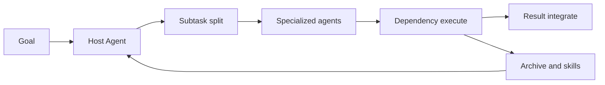
<sub>打分理由：可组合agent生态，harness自动构造迭代（core 9 / wide 9）</sub>

### 2. ⭐ 📄 EasyPPO: Stabilizing the Critic Is Key
arXiv [2609.36802](https://arxiv.org/abs/2609.36802) · HF 🔥 21 · Xuanyi Zhou, Qiuyang Mang, Huanzhi Mao 等 · [PDF](https://arxiv.org/pdf/2609.36802)

**一句话**：EasyPPO 用 3 个小改动稳住 PPO critic，AIME24 提升 2.28%
**为什么值得你看**：直接对应 RLHF 和后训练面试题

**核心架构**：反直觉点是：PPO 不稳，常不是 actor 先坏，而是 critic 把训练带偏。作者指出两个 failure mode：一是把 truncated rollout 同时从 actor 和 critic 里过滤，会让 critic 学到“完成后奖励”，于是模型反而更爱截断；二是不同 prompt 的 return 噪声不一样，有限 batch 下高方差 prompt 会主导 critic 更新。EasyPPO 的关键改变是把过滤只留给 actor、critic 继续看完整和截断 rollout；再按每个 prompt return 标准差的倒数给 critic loss 加权，压住高噪声样本；最后把 critic mini-batch 变小，限制离群值在 gradient clipping 里扩散。最直接的证据不是最大涨幅，而是三类任务上全训练过程都稳定，且比 vanilla PPO、VAPO、HL-Gauss PPO 更不容易中途崩；作者报告在 FrontierCS、AIME24、Search-R1 上最佳验证集相对 PPO 分别提升 14.89%、2.28%、9.47%。新意主要在组件层，属于把 PPO 的不稳定来源拆细后做针对性修补。

- 稳定性来自 critic 不是 actor
- 没证明适用于所有 RLVR，只在几类任务验证
- 实现不重，但要有 rollout 与噪声统计
**精读价值**：值得读方法细节，适合补 PPO 稳定性直觉
**关联**：[[PPO]]、[[VAPO]]
#rlhf #ppo #stability · 难度：中等 · 建议：值得通读 (20 min)
前置：🔲 [[PPO]] · 🔲 [[reward model]] · 🔲 [[GRPO]] · 🔲 [[RLHF]]

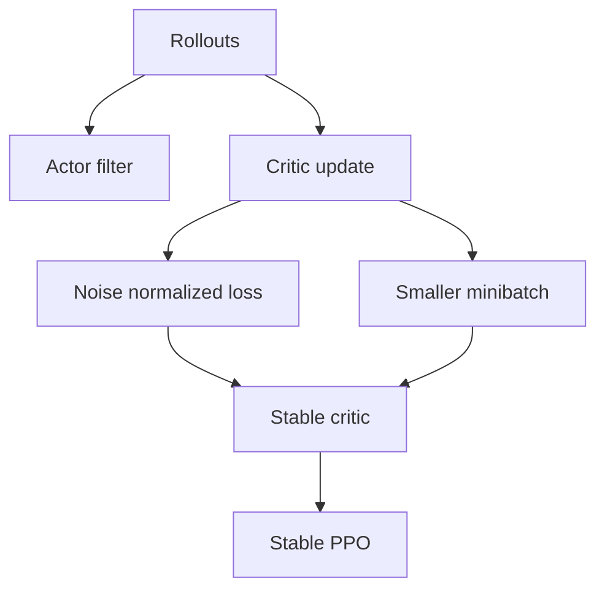
<sub>打分理由：聚焦LLM-PPO critic不稳定，后训练关键（core 9 / wide 6）</sub>

### 3. ⭐ 📄 ContextRender: From Execution Dependencies to Agent Context
arXiv [2609.37743](https://arxiv.org/abs/2609.37743) · Savini Kashmira, Jayanaka L. Dantanarayana, Lingjia Tang 等 · [PDF](https://arxiv.org/pdf/2609.37743)

**一句话**：ContextRender 用执行依赖图挑上下文，在 6K 预算下逼近全历史
**为什么值得你看**：对 agent 上下文管理和 RAG 很相关

**核心架构**：反直觉点是：长链 agent 的上下文瓶颈不只是“太长”，而是“早先结果什么时候会被后面复用”看不出来。只按 recency、语义相似度或压缩摘要选历史，容易把后续还要用的 tool result 删掉；但把全历史一直带着又贵。ContextRender 的关键改变是把 context 管理从线性历史改成 persistent execution dependency graph，再用 Tool-Flow Analysis 追踪后续步骤如何复用早先 tool result，形成 observed reuse 这个信号；rendering 时把 observed reuse 和 recency、semantic relevance 一起打分，保留完整结果，没选中的还能留在图里以后再取回。最直接的证据是 AppWorld 和 8-objective QA 上，作者报告在 6K history budget 下，三种 execution model 都优于评测过的 managed-context baseline，而且平均推理成本比 Full history 降 10.2%–32.2%；ablation 说明 observed reuse 确实改善了后来被再次用到的信息召回。新意在系统组织层，核心不是新模型，而是把“依赖复用”引入上下文选择。

- 核心信号是 observed reuse
- 没证明在所有工具生态都稳，依赖能被解析出来
- 实现难点在依赖追踪与结果保留
**精读价值**：值得读，适合做 agent memory/context 管理参考
**关联**：[[RAG]]、[[Self-GC]]
#rag #agent #context-management · 难度：中等 · 建议：值得通读 (20 min)
前置：🔲 [[retrieval-augmented generation]] · 🔲 [[memory]] · 🔲 [[planning]] · 🔲 [[long context]]

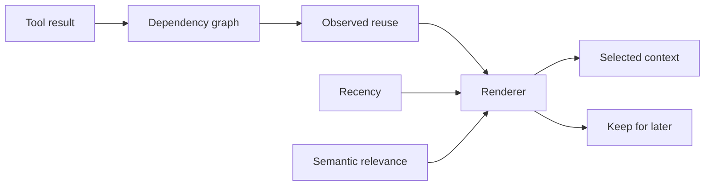
<sub>打分理由：执行依赖到agent上下文，直接服务长程agent（core 9 / wide 7）</sub>

### 4. ⭐ 📄 Prompts Live on an Arc: Gaussian Curricula in Fisher--Rao Coordinates for Rollout-Efficient GRPO
arXiv [2609.38018](https://arxiv.org/abs/2609.38018) · Mei Okonkwo, Pixel Nomand, Julian Berg 等 · [PDF](https://arxiv.org/pdf/2609.38018)

**一句话**：用 Fisher-Rao 弧长重标定 prompt，ARCUS 让 GRPO 少做 48–57% rollout
**为什么值得你看**：GRPO/采样课程设计很像你会面试到的 RLVR 细节

**核心架构**：反直觉点在于：GRPO 最耗钱的不是更新，而是“全对/全错” prompt 白白吃 rollout，却不给梯度。现有动态采样要么先采再丢，要么在 raw pass-rate/logit 空间里拍脑袋定目标、宽度和不确定性模型。作者的关键改动是把 Bernoulli 的 pass-rate 重新参数化到 Fisher-Rao 弧长 ψ=arcsin√p：在这个坐标里，GRPO 的有效更新近似均匀，零方差 prompt 只会落在两侧高斯边界层，证据噪声也变成常数。于是 prompt 课程不再是“挑中间难度”，而是“在弧长上放一个目标匹配的 Gaussian”。ARCUS 用 Kalman filter 追踪每个 prompt 的弧长信念，用高斯核ד预计能产生 informative group 的概率”打分，只保留 informative group 做原样 GRPO 更新，并把目标推进到“最难但收益还不差太多”的 objective。最直接的证据是三 backbone、六个数学 benchmark 上，它比动态采样少 48–57% rollout 仍高 2.8–2.9 分；这是组件层把坐标、核宽和 pacing 一起从几何里推出来，而不是系统层重组训练管线。

- 最强证据：比 DS 少 48–57% rollout 仍提升 2.8–2.9 分
- 没证明跨任务通用；主要在数学 reasoning + RLVR
- 复现难点在弧长滤波和目标 pacing 的闭式实现
**精读价值**：值得精读：把 GRPO 采样效率问题讲成几何问题
**关联**：[[GRPO]]、[[Dynamic Sampling]]
#rlhf #grpo #optimization · 难度：硬核 · 建议：建议精读
前置：🔲 [[GRPO]] · 🔲 [[reward model]] · ◽ Kalman filter · ◽ Fisher-Rao manifold


<sub>打分理由：GRPO+理论坐标设计，面向可解释训练改进（core 9 / wide 6）</sub>

### 5. ⭐ 📄 QwenGyre: An Elastic Reinforcement Learning Framework for Training xLong-Horizon Agents
arXiv [2609.33848](https://arxiv.org/abs/2609.33848) · HF 🔥 32 · Weiqi Wang, Yuxin Zhou, Mouxiang Chen 等 · [PDF](https://arxiv.org/pdf/2609.33848)

**一句话**：QwenGyre 把 xlong-horizon 在线 RL 做成弹性调度+轨迹去冗余，提速最高 1.85×
**为什么值得你看**：这是 agent 训练系统，正对 LLM/agent/系统面试口味

**核心架构**：反直觉点在于：xlong-horizon agent 不是“跑久一点”的普通 rollout，而是小时级、近 1M token、强分支的黑盒执行；这会同时把 GPU 卡在“等 rollout 结束”和“等训练 batch 凑齐”两头。旧的 colocate/async 都假设 rollout 与训练能比较平滑地切分，但在这种长尾和分支爆炸下，前者会被尾部执行拖死，后者会因为固定分池而互相空转。作者的关键改动是把执行生命周期、GPU 角色、训练样本分离：elastic scheduler 在 rollout 和 training 间动态挪 GPU，但不打断活着的 harness；中央 data-parallel 允许新 GPU 中途加入 batch，streaming training 让各组按进度对齐，减少 idle gap。另一条线是 trajectory processor：把黑盒执行记录重建成带 shared prefix 的 trajectory tree，按 role priority 只保留有限条路径，重复目标只记一次，并对同一 execution 内 token loss 做平均，避免分支越多样本权重越大。最直接证据是作者报告在 Qwen 3.8 2.4T、700K tokens/rollout 上 NL2RepoBench 从 52.5% 到 58.5%，48 步完成；系统层新在调度组织和样本构造，不是模型结构。

- 最强证据：52.5%→58.5%，48 steps
- 没证明对短 horizon 任务也同样赚
- 复现难在黑盒 harness、流式训练与去重逻辑
**为什么现在上榜**：作者报告 2026-09-27 release；原文未明确额外发布事件
**精读价值**：值得看：agent 训练系统的承重设计很典型
**关联**：[[Colocate]]、[[Async]]
#rl #framework #xlong-horizon · 难度：硬核 · 建议：建议精读
前置：◽ online RL · 🔲 [[data parallel]] · 🔲 [[SWE-bench]] · ◽ trajectory

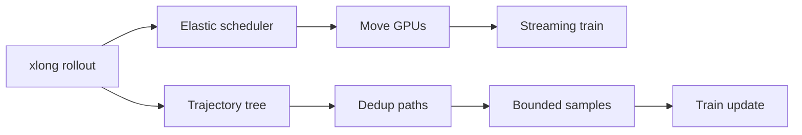
<sub>打分理由：xlong horizon agent 的弹性 RL 框架，训练系统硬（core 8 / wide 5）</sub>

### 6. ⭐ 📄 Surprising Success, Repeated Failure: Entropy-Guided Credit Assignment for Exploration in LLM Reasoning
arXiv [2609.33781](https://arxiv.org/abs/2609.33781) · HF 🔥 30 · Woongyeong Yeo, Minki Kang, Chanuk Lee 等 · [PDF](https://arxiv.org/pdf/2609.33781) · [代码](https://github.com/wgcyeo/EAPO) ★3

**一句话**：EAPO 用 entropy 区分“惊喜成功”和“重复失败”，让 reasoning 探索更广
**为什么值得你看**：和 RLVR、credit assignment、探索控制直接相关

**核心架构**：反直觉点在于：policy entropy 直觉上代表“不确定”，但把它对成功和失败都同样加权，会把最重的惩罚压在还能回头修正的高熵位置上，反而缩小探索。现有 token-level credit assignment 要么要辅助模型，要么要额外采样，代价高。作者的关键改动是把 advantage 的正负号和 entropy 反着用：成功时，高熵位置说明成功来自一次“惊喜探索”，应更强地巩固；失败时，低熵位置说明模型在重复稳定地犯错，应更强地纠正；而高熵失败位置保留分叉，少罚，别把回旋余地压没。EAPO 不改 rollout 信号来源，只把 response-level advantage 重新分配到 token 上，因此它的组件本质是“用现成 entropy 做 asymmetric credit assignment”，阻断的是“把不确定性当成统一可罚对象”的失败模式。最直接证据是它在多种 reasoning backbone 和任务上同时拿到最好平均精度与 problem coverage；但原文未明确给出一个单独最大涨幅最能说明机制的实验。新在组件层：credit assignment 规则，而不是新的训练框架。

- 最强证据：平均精度和 problem coverage 都最好
- 没证明对所有 reward 形态都成立
- 复现相对容易，直接改 token-level advantage
**精读价值**：值得读：一个很干净的探索型 credit assignment 改法
**关联**：[[GRPO]]、[[Entropy regularization]]
#rl #llm-reasoning #credit-assignment · 难度：中等 · 建议：值得通读 (20 min)
前置：🔲 [[GRPO]] · ◽ policy entropy · ◽ advantage · ◽ RLVR

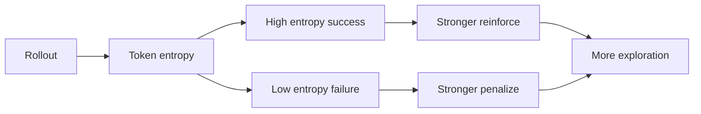
<sub>打分理由：熵引导信用分配，直接对齐推理RLVR（core 8 / wide 4）</sub>

### 7. ⭐ 📄 ROSS: Relearning from Self-Generated Rollouts through Selective Supervision
arXiv [2609.35954](https://arxiv.org/abs/2609.35954) · HF 🔥 25 · Zhiwei Zhang, Huayu Deng, Fei Zhao 等 · [PDF](https://arxiv.org/pdf/2609.35954)

**一句话**：ROSS 用历史自生成 rollout 做选择性监督，Qwen3.6-35B-A3B 的 MOPD 平均 58.4→62.2
**为什么值得你看**：适合看 on-policy distillation / agent RL 后训练怎么再榨经验

**核心架构**：它针对一个反直觉现象：模型已经靠 RL 或 on-policy distillation 学过的 rollout，过几轮后常被当成“过时数据”扔掉，但这些历史轨迹里往往还保留当前 checkpoint 不稳定复现的行为。旧做法的问题不是“历史数据不对”，而是整条轨迹里混着有用分段、错误尝试和冗余步骤，full-trajectory replay 会把噪声一起学回去。ROSS 的关键改动是把“轨迹当上下文、损失只打在被选中的 continuation 上”：保留完整历史轨迹提供状态依赖和行为语境，但只对筛出的 informative segment 施加监督，从而阻断对错误/绕路片段的模仿。最直接的证据是它在 domain-specific RL、MOPD、agentic RL 都能继续抬高 upstream checkpoint，且在 Qwen3.6-35B-A3B 上把六项 MOPD 均值从 58.40% 提到 62.20%，SWE-bench Verified 从 64.20% 到 68.40%。新意主要在组件层到系统层之间：不是新 rollout 生成，而是把历史 self-rollout 变成可再学习的离线 SFT 资产。

- 最强证据：MOPD 58.4→62.2，SWE-bench Verified 64.2→68.4
- 没证明：怎样自动选 segment，原文未明确
- 复现难点：要有历史 rollout 轨迹和稳定的分段监督逻辑
**精读价值**：值得精读：它补上了 self-rollout 训练后的“经验复用”环节
**关联**：[[Rejection Sampling]]、[[Self-Instruct]]
#rlhf #llm #distillation · 难度：中等 · 建议：值得通读 (20 min)
前置：🔲 [[on-policy distillation]] · ◽ reinforcement learning · 🔲 [[offline SFT]] · 🔲 [[SWE-bench]]

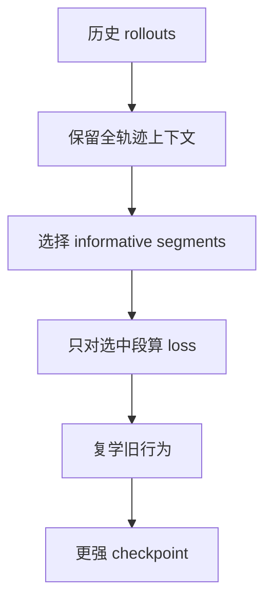
<sub>打分理由：自生成rollout选择性监督，直击后训练痛点（core 8 / wide 6）</sub>

### 8. ⭐ 📄 Rethinking Training-Inference Mismatch in LLM Reinforcement Learning: Where It Arises and How to Correct It
arXiv [2609.32444](https://arxiv.org/abs/2609.32444) · HF 🔥 18 · Tianrun Yu, Kaixiang Zhao, Shangzhe Li 等 · [PDF](https://arxiv.org/pdf/2609.32444) · [代码](https://github.com/kzhao5/CIS-RL) ★4

**一句话**：CIS 用置信度校准的重要性采样，三种 MoE 在五个数学基准上都拿到最高均值
**为什么值得你看**：适合看 RLVR 里 inference 和 training 不一致怎么修

**核心架构**：它解决的是 RLVR 里一个很隐蔽的悖论：rollout 明明是“on-policy”采出来的，但采样用的是 inference engine，反传用的是 training engine，同一 token 的概率会因为 kernel、reduction、精度甚至 MoE routing 而不同，结果标准 importance sampling 方差炸掉。旧方法通常直接对 ratio 做固定截断或 mask，但 ratio 里混了两件事：引擎差异和 token 自身置信度，所以固定阈值会主要伤到低置信 token。CIS 的关键改动是把 ratio 分解成“置信度 × 纯 mismatch 项”，然后只对 mismatch 项做统一阈值截断，再映射回一个随置信度收紧的 ratio cap；这样截断位置由 mismatch 决定，而不是被 token 置信度绑架。最直接的证据不是最大涨幅，而是诊断分析：它把截断偏差从低置信 token 上挪开，并在三种 MoE、五个数学基准上取得最高五基准均值。新意主要在实证层和方法层：用 logit-displacement 结构化解释 mismatch，再据此设计截断规则。

- 最强证据：三种 MoE、五个数学基准均为最高均值
- 没证明：非 MoE 或非 RLVR 场景是否同样有效，原文未明确
- 复现难点：要同时拿到 inference/training 两条引擎的 token 概率
**精读价值**：值得精读：它把“经验性截断”变成了有结构的校准问题
**关联**：[[Importance Sampling]]、[[Truncated Importance Sampling]]
#rl #importance-sampling #rlhf · 难度：硬核 · 建议：值得通读 (20 min)
前置：🔲 [[GRPO]] · 🔲 [[importance sampling]] · 🔲 [[Mixture of Experts]] · 🔲 [[vLLM]]

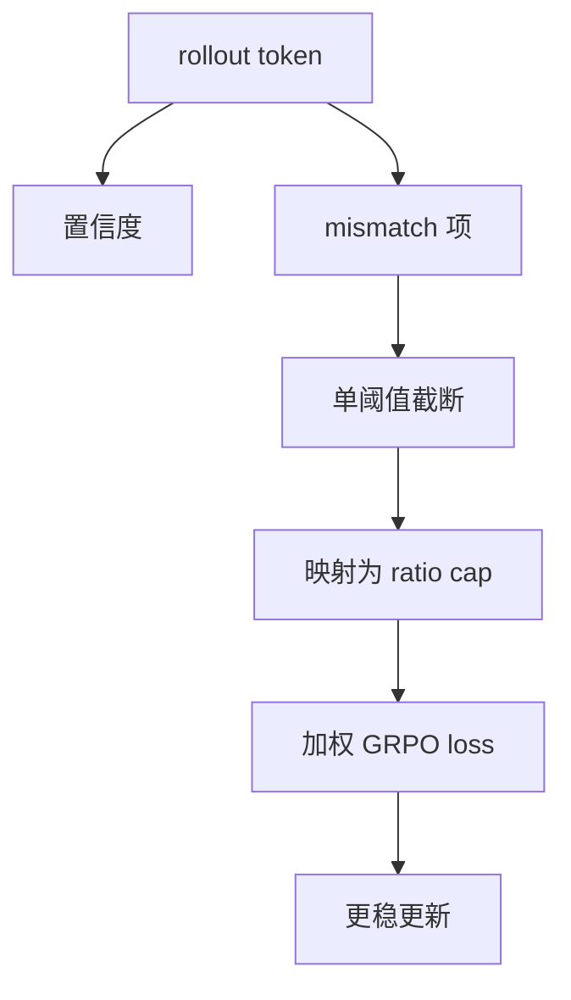
<sub>打分理由：训练-推理不匹配校准重要性采样（core 8 / wide 5）</sub>

## 🧰 项目 · 核心方向

### 9. ⭐ 🧰 alphaXiv/OpenResearch
[GitHub](https://github.com/alphaXiv/OpenResearch) ★6,291 (+280 今日) · Trending daily · skill · Rust

**一句话**：OpenResearch 把 coding agents 变成 research agents，v0.2.14 今晨发布
**为什么值得你看**：适合看研究型 agent 工作流和实验管理怎么落地

**核心架构**：它解决的是研究型 agent 最常见的真实痛点：一个 agent 能改代码，但很难同时做到并行探索、实验可复现、证据可追踪。OpenResearch 的承重组件不是“聊天界面”，而是 local-first workspace：每条研究方向拆成独立 session 和 git worktree，run 有不可变 commit archive，日志、diff、文件、结果都绑在同一条 lineage 上；当 agent loop 里检测到新方向，就开新 worktree 并行跑，而不是在单线程流水线上顺序试错。它还支持把 Claude Code、Codex、OpenCode、Cursor、Antigravity 接到同一套 harness，说明核心设计是把 agent 当可插拔执行器，而不是绑死在某个模型上。成熟度信号比较强：有连续 release，最近是 v0.2.14；README 明确列出 macOS、Windows beta、Linux、远程 GPU、telemetry 控制和 CLI 安装，说明已进入可安装使用阶段。和同类比，它更偏“研究工作台”而不是单纯 coding agent，差异在并行实验树和本地证据管理。

- 最强证据：连续 release，最近 v0.2.14
- 已给出 CLI、远程运行、telemetry 控制，说明可用性较高
- 原文未明确：是否有公开测试集或 benchmark 证明效果
**为什么现在上榜**：v0.2.14（2026-09-30）
**精读价值**：值得看项目速览：像研究工作台而不是普通 agent 壳
**关联**：[[SWE-bench]]、[[ReAct]]
#agent #research #workflow · 难度：中等 · 建议：值得通读 (20 min)
前置：🔲 [[planning]] · 🔲 [[memory]] · 🔲 [[multi-agent]] · 🔲 [[model context protocol]]

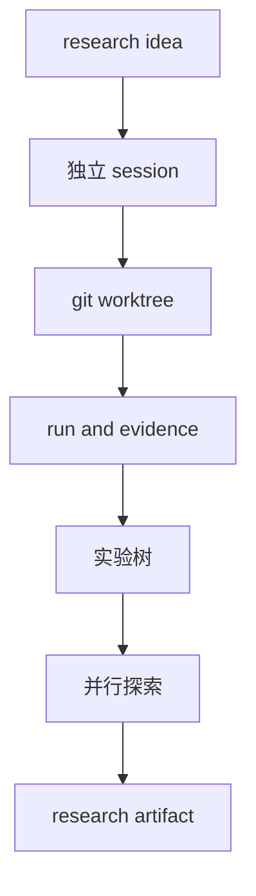
<sub>打分理由：把coding agent升级为研究agent（core 8 / wide 6）</sub>

### 10. ⭐ 🧰 modelcontextprotocol/servers
[GitHub](https://github.com/modelcontextprotocol/servers) ★90,783 (+48 今日) · Trending daily · infra · TypeScript

**一句话**：用 MCP reference servers 统一工具接入，给 LLM 安全访问文件/记忆/检索
**为什么值得你看**：做 agent/RAG 的协议底座，面试很常问

**核心架构**：反直觉点在于：LLM 真正难的不是“会不会调用工具”，而是每接一个工具都要重做权限、格式和上下文拼装。传统脚本式集成把工具能力散在各个 client 里，换模型/换宿主就重接一遍。MCP 的关键变化是把“工具与数据源”抽成统一协议：server 只暴露 prompts、resources、tools，client 负责在受控边界内发现和调用；reference servers 负责把文件系统、memory、git、fetch 等能力做成可复用的协议样例，从而阻断“工具接口碎片化”和“权限外溢”两类失败。最直接的证据是 README 明确把这些仓库定位为 reference implementation，并警告它们不是 production-ready，说明重点不在功能堆砌，而在把协议特性、SDK 用法和安全边界讲清楚。新意主要在系统组织层：不是单个工具，而是一套跨语言、跨宿主的 agent 工具层标准。

- 最强证据：官方 reference servers + 多语言 SDK
- 未证明生产安全；作者明确说需自评 threat model
- 复现门槛低，价值在协议理解不是改代码
**精读价值**：值得速览当 MCP 入门底座
**关联**：[[OpenAI function calling]]、[[ReAct]]
#mcp #agent #tool-use · 难度：入门 · 建议：看速览即可
前置：🔲 [[model context protocol]] · 🔲 [[ReAct]] · 🔲 [[memory]] · 🔲 [[retrieval-augmented generation]]

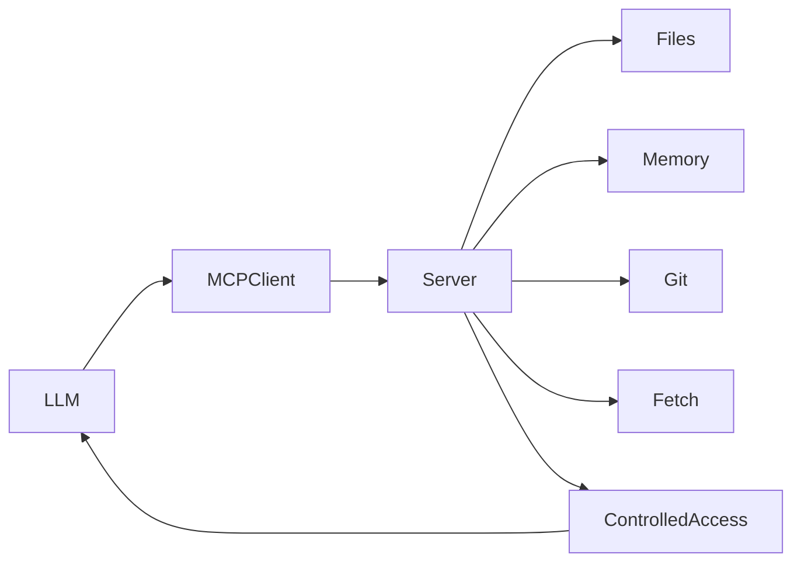
<sub>打分理由：MCP 服务器是 agent 工具生态关键基础（core 8 / wide 7）</sub>

### 11. ⭐ 🧰 pacifio/atlas
[GitHub](https://github.com/pacifio/atlas) ★8,557 (+2593 本周) · Trending weekly · infra · Rust

**一句话**：用 checkpoint 把 agent 提交和推理轨迹绑一起，支持多 agent 协作
**为什么值得你看**：agent 工程化很像你以后做研发平台

**核心架构**：这个项目解决的是真实痛点：coding agent 已经能改代码，但改完后“谁在何时基于什么上下文做了什么决定”经常丢失，换 agent 更是直接断档。旧做法把 transcript、commit、notes 分散在终端、git 和各个记忆文件里，事后只能看到一条模糊的 commit message。Atlas 的关键概念是 checkpoint：把一次 agent session 的 prompts、tool calls、file changes、reasoning 和最终 commit 绑定成可查询对象；再通过共享 memory 和本地 @ 解析，把一个 agent 的计划、失败、架构笔记喂给另一个 agent，阻断“会做不会追溯”和“换 agent 重新热启动”两种失败。最直接支持这一点的证据是它明确写出 checkpoints、shared memory、`@` 解析和本地优先存储，并且有 CI、docs、releases，说明不是概念草图。新意在系统组织层兼成熟度层：它不是单一 agent，而是把 agent 工作流、审计和上下文继承做成编辑器级底座。

- 最强证据：checkpoint 绑定 session 与 commit
- 未证明跨 agent 协作的泛化上限
- 需要理解 ACP 与 agent session 机制
**为什么现在上榜**：作者报告近期有 alpha-0.3.4 / 0.3.3 / 0.3.2 连续 release
**精读价值**：适合关注 agent 工程化的人精读
**关联**：[[Zed]]、[[OpenCode]]
#agent #tooling #evaluation · 难度：中等 · 建议：值得通读 (20 min)
前置：◽ agent · 🔲 [[memory]] · 🔲 [[planning]] · 🔲 [[model context protocol]]

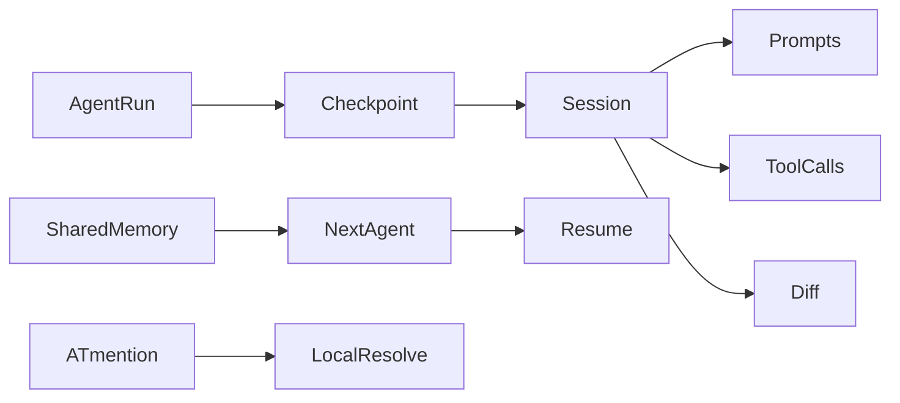
<sub>打分理由：agent 代码源控与协作追踪，较贴合智能体（core 7 / wide 6）</sub>

### 12. ⭐ 🧰 ruvnet/RuView
[GitHub](https://github.com/ruvnet/RuView) ★95,709 (+272 今日) · Trending daily · model · Rust

**一句话**：用 WiFi CSI 做无摄像头空间感知，实时测呼吸心率与存在检测
**为什么值得你看**：多模态/具身之外的感知项目，面试谈新范式很抓眼

**核心架构**：反直觉点在于：没有摄像头、没有可穿戴设备，普通 WiFi 也能从墙后提取人体存在和生命体征。传统视觉方案虽然准确，但在隐私、黑暗和遮挡场景会失效；纯信号方案又常卡在环境噪声和跨房间泛化。RuView 的关键概念是把 WiFi 的 CSI 当作时空传感输入，用低成本 ESP32 采样，再通过边缘模型把原始射频扰动映射成 presence、breathing、heart rate 等语义状态；它用本地自适应和多频 mesh 扫描来对抗环境变化，并把结果接入 Home Assistant / Matter。最直接的证据是作者报告：v2 encoder 的 held-out temporal-triplet accuracy 82.3%，且模型能以 8 KB 4-bit 量化运行；同时仓库给出最近 CI 自动 release 和集成文档，说明不是单点 demo。新意主要在系统组织层，叠加一点实证层：把 RF sensing、边缘部署和智能家居联通做成完整产品化链路。

- 最强证据：作者报告 82.3% held-out accuracy
- 原文已撤回旧的 100% presence 说法
- 泛化仍依赖场景校准，真实数据验证有限
**为什么现在上榜**：作者报告 2026-09-30 当天持续自动 release
**精读价值**：更像产品级 sensing 平台，值得速览
**关联**：[[WiFi-CSI sensing]]、[[Human activity recognition]]
#multimodal #signal #spatial · 难度：硬核 · 建议：值得通读 (20 min)
前置：◽ signal processing · 🔲 [[vision transformer]] · 🔲 [[quantization]] · ◽ edge computing

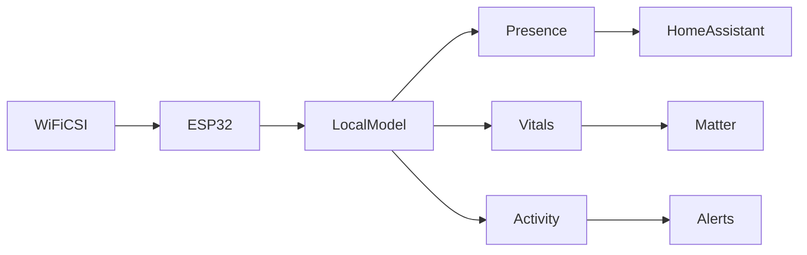
<sub>打分理由：WiFi到空间/健康监测，具多模态潜力（core 7 / wide 5）</sub>

### 13. ⭐ 🧰 ifixai-ai/iFixAi
[GitHub](https://github.com/ifixai-ai/iFixAi) ★17,323 (+250 今日) · Trending daily · infra · Python

**一句话**：Independent Auditing of AI Agents
**为什么值得你看**：（dry-run：未调用 LLM，配置 OPENAI_API_KEY 后会生成中文速览）
- Run by human or the agent itself, to answer the most crucial question in the AI Agent Economy
- Is the agent doing what is supposed to do? With iFixAi you can have this answer in less than 120 seconds.
#agent #safety #evaluation · 难度：中等 · 建议：看速览即可
<sub>打分理由：Agent 审计评估思路，面向安全可讲（core 7 / wide 6）</sub>

### 14. ⭐ 🧰 pydantic/monty
[GitHub](https://github.com/pydantic/monty) ★8,496 (+61 今日) · Trending daily · infra · Rust

**一句话**：A minimal, secure Python interpreter written in Rust for use by AI
**为什么值得你看**：（dry-run：未调用 LLM，配置 OPENAI_API_KEY 后会生成中文速览）
#sandbox #interpreter #tooluse · 难度：中等 · 建议：看速览即可
<sub>打分理由：安全Python解释器，利于工具调用（core 7 / wide 6）</sub>

## 🌐 全领域热点

### 15. 🌐 🧰 firecrawl/firecrawl
[GitHub](https://github.com/firecrawl/firecrawl) ★187,107 (+579 今日) · Trending daily · tool · TypeScript

**一句话**：🔥 Supercharge your AI agents with data from the web and beyond
**为什么值得你看**：（dry-run：未调用 LLM，配置 OPENAI_API_KEY 后会生成中文速览）
- A web data API to search, scrape, and access more sources.
#rag #agent #web · 难度：中等 · 建议：看速览即可
<sub>打分理由：Web抓取检索能力强，适配RAG/Agent（core 6 / wide 9）</sub>

### 16. 🌐 📄 LongLive-Plug: Once-for-All Distillation for Video Generation
arXiv [2609.38154](https://arxiv.org/abs/2609.38154) · HF 🔥 21 · Shuai Yang, Luozhou Wang, Wei Huang 等 · [PDF](https://arxiv.org/pdf/2609.38154) · [代码](https://github.com/NVlabs/LongLive) ★2647

**一句话**：LongLive-Plug 用一次 LoRA 蒸馏复用视频加速，54 个下游模型免重训部署
**为什么值得你看**：适合看视频生成后训练和 LoRA 迁移思路

**核心架构**：它解决的是一个很反直觉的重复劳动：每个视频专用模型都要单独做一次加速蒸馏，换个下游任务就重来，尤其在 world modeling、editing、robotics 这类分支多的模型上，成本会指数膨胀。作者的关键改变是把“加速能力”从具体 checkpoint 里拆出来，做成可复用的 functional LoRA：CFG LoRA 负责把双路 guidance 压成单次前向，同时保留可调 guidance；few-step LoRA 负责少步采样；long-context LoRA 负责 AR 长视频 rollout 的误差修正。它们阻断的失败分别是重复蒸馏、guidance 固定死、长上下文误差累积。最直接的证据是 54 个下游模型、三套 backbone 上都能训练免费挂载，且在 SCOPE 和 Wan2.2-Fun-5B-Control 上对比 naive four-step 有提升，并接近 per-target distillation。新意主要在系统组织层：不是新的蒸馏目标，而是把蒸馏结果做成一次训练、多处复用的插件化能力。

- 54 个下游模型验证训练免费迁移
- 固定 guidance 训练但推理可调
- 没证明对所有不兼容结构都行
**精读价值**：值得看蒸馏复用与 LoRA 可插拔设计
**关联**：[[Progressive Distillation]]、[[LCM-LoRA]]
#diffusion #distillation #video · 难度：中等 · 建议：值得通读 (20 min)
前置：🔲 [[diffusion model]] · 🔲 [[video generation]] · 🔲 [[LoRA]] · ◽ classifier-free guidance

```mermaid
graph LR
A 基座模型 --> B 蒸馏成能力LoRA
B --> C CFG调节
B --> D 少步采样
B --> E 长上下文修正
C --> F 下游模型
D --> F
E --> F
F --> G 免重训部署
```
<sub>打分理由：开源且热度高，虽主在视频生成非核心方法（core 3 / wide 9）</sub>

### 17. 🌐 📄 Post-Training Leaves Behavioral Shadows on Unrelated Decisions
arXiv [2609.29233](https://arxiv.org/abs/2609.29233) · HF 🔥 262 · Ziyang Zhang, Yubin Jing, Yuanhao Zeng 等 · [PDF](https://arxiv.org/pdf/2609.29233) · [代码](https://github.com/myboker/ATD) ★14

**一句话**：ATD 只用单词选择蒸馏能力，HumanEval+ 提升 5.34 pp
**为什么值得你看**：面试里很好讲“任务无关信号能否泄露能力”

**核心架构**：它抓住的悖论是：模型明明在代码上做了 post-training，泄露出来的却不是代码答案，而是在无关文本里对两个普通词的微小偏好变化。传统 distillation 要 teacher logits、target-task responses，或者至少长答案；这里作者把问题改成“能不能只看近似平局时的一次单词选择”。ATD 先用公共祖先模型找 near-tie prompts，再让私有 teacher 只吐出一个词，把这个二选一当作 update 的 behavioral shadow；student 只学这些 prompt-word 对。这样阻断的是“看不到目标任务也学不到能力”的失败。最强证据是 Qwen2.5-1.5B 上 5,664 个单词级监督就让 HumanEval+ 比 exact nuisance-matched control 高 5.34 pp，而且不同任务/模型族上也有正增益。新意在实证层和观测层：不是新蒸馏器，而是证明 post-training 的局部偏好变化本身可携带能力信息。

- 5,664 条单词监督带来 5.34 pp
- 强依赖 near-tie 查询设计
- 没证明大规模线上稳定性
**精读价值**：值得精读，能讲清黑盒能力泄露
**关联**：[[Subliminal Learning]]、[[Classical Distillation]]
#alignment #distillation #safety · 难度：硬核 · 建议：建议精读
前置：🔲 [[knowledge distillation]] · 🔲 [[on-policy distillation]] · 🔲 [[alignment]] · ◽ active learning

```mermaid
graph LR
A 公共祖先 --> B 找近似平局词
B --> C 私有Teacher选词
C --> D 单词级监督
D --> E Student学习
E --> F 下游能力提升
```
<sub>打分理由：高热 ATD，后训练行为阴影，实证很强（core 6 / wide 8）</sub>

### 18. 🌐 📄 It's All Training: A Fully Synthetic Single-Stage Recipe for LLMs
arXiv [2609.37891](https://arxiv.org/abs/2609.37891) · Pierre-Carl Langlais, Pieter Delobelle, Yannick Detrois 等 · [PDF](https://arxiv.org/pdf/2609.37891)

**一句话**：SYNTH 用 5.9 万 Wikipedia 种子做全合成训练，80B tokens 覆盖预中后训练
**为什么值得你看**：适合看合成数据、预训练配方和 open LLM 路线

**核心架构**：它面对的是一个现实痛点：web crawl 既脏又不适合中后训练，尤其缺少显式 reasoning，而很多大厂已经在内部用 synthetic data 补这块，但公开社区几乎看不到。作者的关键改法是把“预训练、mid-training、post-training”压成一阶段：用 58,698 篇 Wikipedia 作为 grounded seed，通过 back-translation 和结构化放大生成约 80B tokens 的多语言合成语料，让同一套数据同时承载事实、指令和 reasoning。这里阻断的失败是纯网页数据的不可控内容、合成数据的幻觉外溢，以及多阶段管线的割裂。最直接的证据是他们在 iso-compute 下优于 filtered web data，且小到 56M、大到 13B MoE 都能在多任务上接近同规模 open baselines，同时 factual precision 很高。新意在系统组织层：不是单个 synthetic trick，而是把合成数据做成全阶段训练底座。

- 58,698 篇种子扩到约 80B tokens
- iso-compute 下优于 filtered web data
- 没证明对非百科域同样有效
**精读价值**：值得看数据配方与全合成训练思路
**关联**：[[Phi-1.5]]、[[Cosmopedia]]
#llm #pretraining #synthetic-data · 难度：中等 · 建议：值得通读 (20 min)
前置：🔲 [[pretraining]] · 🔲 [[synthetic data]] · ◽ reasoning · 🔲 [[Mixture of Experts]]

```mermaid
graph LR
A Wikipedia种子 --> B 结构化放大
B --> C 合成预训练语料
C --> D 统一训练
D --> E 事实能力
D --> F 指令与推理
D --> G MoE模型
```
<sub>打分理由：合成数据单阶段配方，后训练/预训练面面俱到（core 8 / wide 8）</sub>

---
想精读哪一篇？在 Claude 里说：`精读 2026-09-30 第 N 条`，Jarvis 会按你的 known.md 只讲你不会的部分。