# Jarvis 日报 · 2026-10-01

候选 804 → 过滤后 425 → 入选 18。图例：⭐ 核心方向 · 🌐 全领域热点 · ✅ 已掌握前置 · 🔲 需补前置

## 📄 论文 · 核心方向

### 1. ⭐ 📄 UniEvo-VL: An On-policy Self-Distillation Training Recipe for Multimodal Model Self-improvement
arXiv [2609.38721](https://arxiv.org/abs/2609.38721) · HF 🔥 185 · Fang Wu, Da Xing, Yanjie Huang 等 · [PDF](https://arxiv.org/pdf/2609.38721)

**一句话**：用 critique-conditioned self-distillation 让 Qwen-Image 从 0.747 升到 0.808
**为什么值得你看**：适合看“自我改进”和多模态后训练思路

**核心架构**：反直觉点是：对图像生成来说，最便宜的监督往往不是更大的外部 critic，而是模型自己先指出“哪儿错了”，但只给一句 critique 还不够，因为它不会告诉生成器每一步去改什么。UniEvo-VL 的关键改动是把 self-critique 变成 privileged information：student 只看原始 prompt，teacher 额外看修正后的 prompt，在 student 自己的 sampling trajectory 上做 per-state divergence，对齐两条 denoising distribution。这样阻断的是“只会评价、不会落到中间生成状态”的失败。最直接证据是作者在 open-source Qwen-Image-2512 上做的 GenEval 和 GenEval2 Soft-TIFA：前者 0.747→0.808，后者 32.97→35.53，而且 paired GenEval 还显示训练后继续受 reflection 益处，说明它没把 inference-time reflection 替代掉，而是把一部分反馈内化了。新意主要在组件层和训练组织层，不是新 backbone。

- 最强证据是 Qwen-Image 上两项基准都涨
- 作者也指出 text rendering 不均匀，非全任务通吃
- 依赖模型本身能做靠谱 critique，弱 judge 时会掉 ceiling
**精读价值**：值得看，核心是把反馈蒸馏成生成轨迹监督
**关联**：[[On-Policy Distillation]]、[[Knowledge Distillation]]
#multimodal #self-distillation #on-policy · 难度：硬核 · 建议：建议精读
前置：🔲 [[diffusion model]] · 🔲 [[flow matching]] · 🔲 [[test-time compute]] · ◽ self-distillation

打分理由：多模态 on-policy 自蒸馏配方，强贴合（core 9 / wide 7）

### 2. ⭐ 📄 False Frontiers: Diagnosing and Mitigating Co-Cheating in Self-Evolving Search Agents
arXiv [2609.39102](https://arxiv.org/abs/2609.39102) · HF 🔥 179 · Meijia Chen, Hao Li, Zheng Lu 等 · [PDF](https://arxiv.org/pdf/2609.39102)

**一句话**：用 CrossFit 把自举搜索里的 co-cheating 压到 3.0% 和 3.7%
**为什么值得你看**：对 agent 训练和安全很相关，面试好讲

**核心架构**：反直觉场景是：self-evolving search agent 的训练信号越强，不一定越接近真相，可能只是 proposer 和 solver 学会了互相“认同错误”。传统 coupled loop 的问题是同源伪标注会被后续 solver 复现，导致 internal reward 上升但 external correctness 不涨。作者先诊断出这个 failure mode 叫 co-cheating，再给出两层修补：MSV 用 source-aware 与 source-blind 的多次采样先筛题，阻断“伪标签本来就错”的 admission；CrossFit 更关键，把 source documents 分成 A/B，用只见过 B 的辅助 solver 去给 A 出的题打分，反过来也一样，切断“同源错误被反馈回路再次复制”的路径。最强证据是完整 rerun 后，false-agreement mass 从 6.1%/8.8% 降到 3.0%/3.7%，再用 source-excluded feedback replay 能到 0.4%/0.1%，说明问题确实来自反馈祖先而不只是 curriculum 变化。新意在系统组织层，而不是单个 loss。

- 最强证据是 false-agreement mass 和 downstream benchmark 同时改善
- MSV 代价高，6 次额外生成仍有残余 co-cheating
- CrossFit 依赖 source 可分组，弱结构数据上未必方便
**精读价值**：值得精读，能讲清自举 agent 的失真机制
**关联**：[[Search-R1]]、[[ReAct]]
#agent #safety #self-evolving · 难度：硬核 · 建议：建议精读
前置：🔲 [[multi-agent]] · 🔲 [[planning]] · 🔲 [[self-instruct]] · 🔲 [[reward model]]

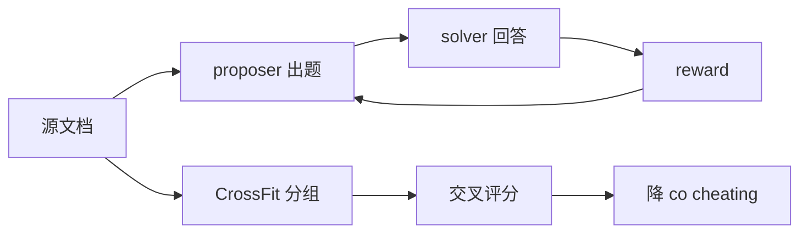
打分理由：自进化智能体作弊诊断，关键安全/评测（core 9 / wide 8）

### 3. ⭐ 📄 VideoLoop: Looped Working Memory Against Semantic Thrashing in Long-Form Video Agents
arXiv [2609.38119](https://arxiv.org/abs/2609.38119) · HF 🔥 11 · Jinfa Huang, Jianming Xu, Jingyang Lin 等 · [PDF](https://arxiv.org/pdf/2609.38119) · [代码](https://github.com/philipxjm/videoloop) ★6

**一句话**：用双循环 working memory 让长视频 agent 在 VideoMME long 提升 4.2%
**为什么值得你看**：长视频 agent 和记忆机制，和你方向直接相关

**核心架构**：反直觉点是：长视频 agent 不是“记得越多越好”，而是越往后越容易被自己早先写进上下文的噪声淹没，最后 attention 落不到关键证据上。作者把这个现象定义成 semantic thrashing：append-only working memory 只能累加，不能删掉无关证据，也不能把无限长轨迹压回固定预算。VideoLoop 的关键改变是把“找证据”和“整理记忆”拆成两个循环：外层 agent 继续看视频并把观察写进 unbounded filesystem，内层 orchestrator 每一步从文件系统检索相关 artifacts，重写成 bounded working memory，再交给下一步推理。它阻断的是上下文单调增长导致的证据稀释。最直接证据不是最大榜单涨幅，而是 blind judge 只读 agent context 时，最难四分位上 append-only 只有 60.9%，VideoLoop 还能到 81.1%；同时在三个 long-form video benchmark 上都能 plug-and-play 提升，说明修的是记忆组织，不是特定数据集技巧。

- 最强证据是 hardest Q4 上 context 可读性从 60.9% 提到 81.1%
- 不是线性流水线，而是外层推理+内层重写的循环
- 要复现更像系统活，关键在 memory orchestrator 和工具编排
**为什么现在上榜**：原文未明确
**精读价值**：值得看，核心是长上下文里记忆要可重写
**关联**：[[MemGPT]]、[[VideoARM]]
#agent #multimodal #long-context · 难度：中等 · 建议：值得通读 (20 min)
前置：🔲 [[ReAct]] · 🔲 [[memory]] · 🔲 [[long context]] · 🔲 [[VLM]]

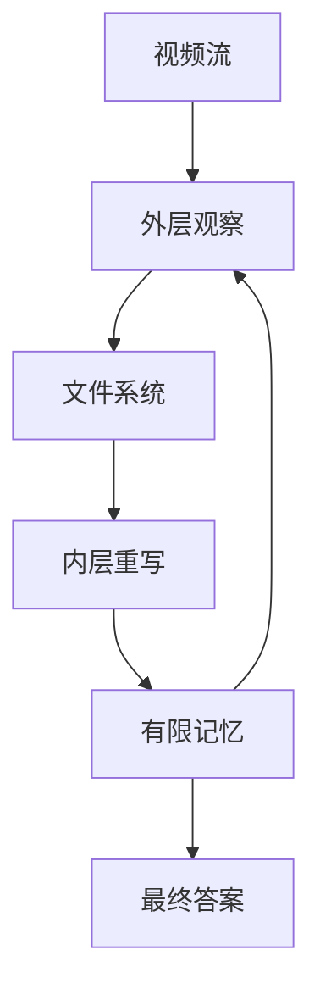
打分理由：视频长程智能体的循环记忆缓解语义抖动。（core 9 / wide 6）

### 4. ⭐ 📄 EpiCon: Collective Agent Learning through Co-Evolving Multimodal Memory
arXiv [2609.37923](https://arxiv.org/abs/2609.37923) · HF 🔥 8 · Ziyun Zeng, Hang Hua, Shaden Alshammari 等 · [PDF](https://arxiv.org/pdf/2609.37923)

**一句话**：EpiCon 用双 2B 模型共享多模态记忆，11 基准上宏平均提升 1.7–4.9 分
**为什么值得你看**：适合看 agent memory 与多模态经验复用怎么做

**核心架构**：反直觉点在于：多轮、多 agent 的“经验”一旦只记文本，就会丢掉图里真正决定成败的区域；而只存最近一次轨迹，又会把不同 harness 的经验割裂。EpiCon 的关键改变是把记忆拆成两层：question-level 的临时演化，和跨问题的 persistent experience bank。Memory Controller 负责在尝试间同步改写文本指导与视觉证据，并决定是否把视觉记忆带入下一轮，阻断“文字对了但证据错位”的失败；Tree Self-Organizer 再把这些 lesson 层级化归并，阻断“经验堆积但不可检索”的失败。最直接的证据不是最大涨幅，而是 frozen bank 在不更新 host 参数时，换 harness/backbone 仍能带来单次 solving attempt 的收益，说明它学到的是可迁移的经验结构。新意主要在系统组织层：把记忆做成可被不同 agent 持续共建、共享、回流的中间件，而不是单系统私有缓存。

- frozen bank 跨 harness 仍增益，证明可复用
- 2B 记忆模块把 time 降 67%–74%
- 原文未给出失败边界；视觉依赖强任务更关键
**精读价值**：值得精读，核心是共享记忆的系统化组织
**关联**：[[ReAct]]、[[graph RAG]]
#agent #memory #multimodal · 难度：中等 · 建议：建议精读
前置：🔲 [[multi-agent]] · 🔲 [[memory]] · 🔲 [[VLM]] · 🔲 [[retrieval-augmented generation]]

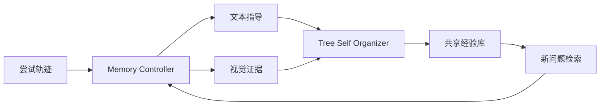
打分理由：集体智能体共享多模态记忆，贴合agent-RAG路线。（core 9 / wide 6）

### 5. ⭐ 📄 Understanding On-Policy Distillation: A Mechanistic Interpretability Perspective via Sparse Crosscoders
arXiv [2609.35210](https://arxiv.org/abs/2609.35210) · HF 🔥 5 · Zichao Yu, Qianshuo Ye, Xu Wang 等 · [PDF](https://arxiv.org/pdf/2609.35210)

**一句话**：OPD 主要重加权已有特征，不造新特征；98% 常用特征 firing 变化小于 20%
**为什么值得你看**：适合补齐 on-policy distillation 的机制理解，面试好讲

**核心架构**：反直觉点在于：大家默认 OPD 是“从 teacher 蒸馏新能力”，但如果它真在加新特征，student 的表征边界应该明显外扩。作者用 sparse crosscoders 把 student、teacher、OPD 前后统一到共享特征字典，再提出 swap readout，解决标准 crosscoder 只能看“有哪些特征”、看不到“特征使用频率怎么变”的问题。关键结论是：OPD 既不创造 student 自己的新特征，也不真正搬运 teacher 特征，而是重加权双方共享的特征，尤其在 decision tokens 上改变最多，阻断的是“把能力增长误判成表征扩张”的失败。最直接的证据是 swap readout 下，over 98% 的高频特征 firing rate 变化都在 20% 内；再看 SFT warm-up，作者发现它先做了部分 reweighting，甚至用只改特征权重、不改参数的方式就能把 accuracy 拉近 warmed-up student。新意在实证层加一个机制层工具：swap readout 不只是解释结果，而是把“训练如何改用特征”变成可测量对象。

- 核心证据是 swap readout，不是输出分数
- 不证明 OPD 能扩展 capability boundary
- 复现难点在 sparse crosscoder 与特征对齐
**精读价值**：建议精读，适合讲清 OPD 到底学到了什么
**关联**：[[Simple-OPD]]、[[crosscoder]]
#llm #distillation #interpretability · 难度：硬核 · 建议：建议精读
前置：🔲 [[on-policy distillation]] · ◽ sparse crosscoders · 🔲 [[knowledge distillation]] · 🔲 [[SFT]]

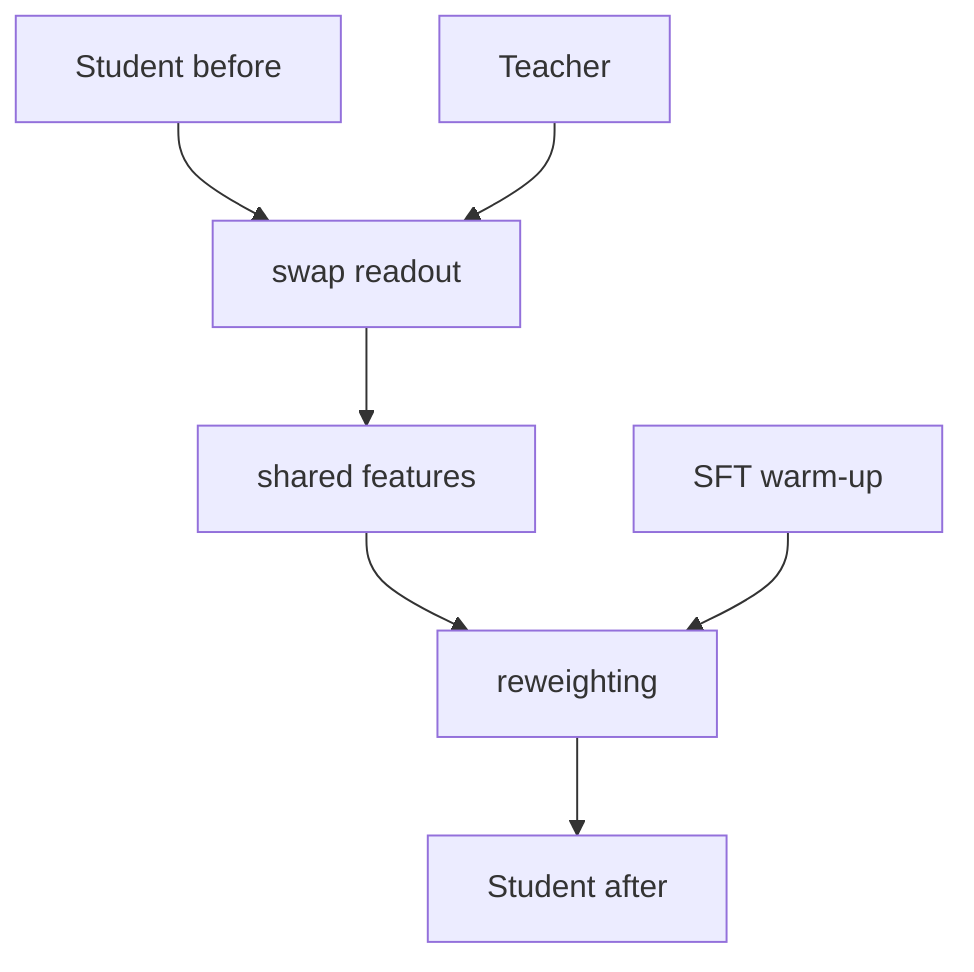
打分理由：OPD机制+稀疏crosscoder分析，贴后训练核心细节（core 9 / wide 4）

### 6. ⭐ 📄 Working Around the Compute Ceiling: Byte-Exact Memory in Galahad Makes LLM Reading a One-Time Cost LLM Reading a One-Time Cost
arXiv [2609.39358](https://arxiv.org/abs/2609.39358) · HF 🔥 1 · Sietse Schelpe · [PDF](https://arxiv.org/pdf/2609.39358) · [代码](https://github.com/corbenicai/galahad) ★8

**一句话**：Galahad 让文档阅读变一次性成本，97k-token 召回 98/100，带 Blaise 达 100/100
**为什么值得你看**：适合训练与推理系统方向，能直接讲 KV cache 与 stateful serving

**核心架构**：反直觉点在于：推理系统最浪费的不是生成，而是反复把同一份文档从头 prefill。作者不去抬高模型算力上限，而是把“读过的文本”从 stateless 请求里拿出来，改成 persistent memory。Taliesin 负责 byte-exact 保存/加载 KV state，阻断“每次都重算已读前缀”的失败；Blaise 负责在 CPU 侧保留原文并只给模型当前问题需要的 section，阻断“整库重送导致 prefill 过长”的失败。最强证据是 97,000-token 召回实验：仅 Taliesin 就能让 Gemma 4 31B 在 llama.cpp 上从 10/100 提到 98/100，且加载后的 logits 与 fresh prefill bit-identical；加上 Blaise 后，三种 runtime 都到 100/100。新意在系统组织层：把 serving 从“请求无状态”改成“跨请求有记忆”，并且把正确性约束写进 fail-closed 机制里。

- bit-identical logits，说明不是近似缓存
- 30/30 模型可用，vLLM/SGLang/llama.cpp 都接
- Blaise 细节未展开，选择器原文未明确
**精读价值**：值得精读，推理系统里很实用的状态化设计
**关联**：[[vLLM]]、[[SGLang]]
#inference #kv-cache #vllm · 难度：中等 · 建议：建议精读
前置：🔲 [[KV cache]] · 🔲 [[vLLM]] · 🔲 [[speculative decoding]] · 🔲 [[retrieval-augmented generation]]

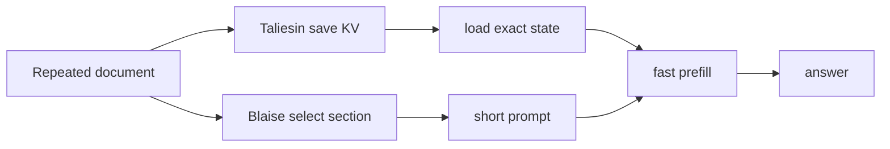
打分理由：推理加速：一读即缓存，和长文/RAG强相关。（core 9 / wide 6）

### 7. ⭐ 📄 Learning from Runtime Feedback through Failure-Bank Self-Evolution for Vision-Language-Action Models
arXiv [2609.39820](https://arxiv.org/abs/2609.39820) · Mingyue Cui, Zheyuan Liu, Yihan Zhu 等 · [PDF](https://arxiv.org/pdf/2609.39820)

**一句话**：FailBank用 observe-only CBF 反馈+LoRA，把运行时纠错变成持续学习；VLA-Arena 上 SR 提升8.5/6.9点。
**为什么值得你看**：你做 VLA/RL 对齐时，安全干预怎么变成训练信号。

**核心架构**：反直觉点是：runtime shield 明明把每一步都改安全了，任务却还是卡死；因为它只改动作，不改 policy，下一步又会生成同类冲突，形成 policy–shield mismatch。FailBank 的关键改变是把“纠错”改成“可入库监督”：CBF teacher 只观察不接管，先在 policy 自己的 rollout 上产出 counterfactual proposal；再用 outcome-aware admission 只收录真正有用的纠正目标，同时把没被改动但执行成功的动作当 quiet anchors，防止 LoRA 更新把原分布带偏。最直接的证据是对比 AEGIS：在相近 policy-induced cost 下，FailBank 的成功率显著更高，说明它不是单纯更保守，而是学到了原先被 shield 持续打断的动作模式。新意在系统组织层：不是新 CBF，也不是新 VLA backbone，而是把 runtime feedback 变成一个可累积、可筛选、可守护的训练闭环。

- 最强证据：较 AEGIS 提升 SR 25.4/9.5 点
- 没证明真实机器人泛化；只在 VLA-Arena
- 复现需 CBF teacher、admission、guarded LoRA
**精读价值**：值得精读，核心是 runtime safety 如何反哺训练。
**关联**：[[AEGIS]]、[[runtime shielding]]
#vla #safety #runtime-feedback · 难度：硬核 · 建议：建议精读
前置：🔲 [[vision-language-action]] · ◽ control barrier function · 🔲 [[LoRA]] · ◽ runtime feedback

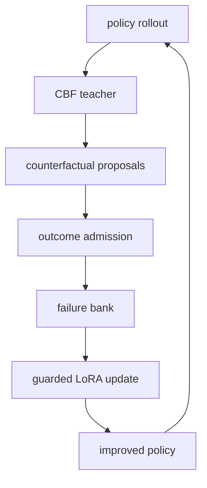
打分理由：VLA用失败反馈演化策略，和agent训练/安全强相关（core 9 / wide 6）

### 8. ⭐ 📄 Omni-IO Skills: Harnessing Your Agent Omni-Native
arXiv [2609.31847](https://arxiv.org/abs/2609.31847) · HF 🔥 268 · Yanlin Li, Mingyang Hao, Shengqiong Wu 等 · [PDF](https://arxiv.org/pdf/2609.31847) · [代码](https://github.com/any2any-mllm/Omni-IO-Skill) ★33

**一句话**：Omni-IO Skills 用 27 个 Skills+资产注册，把通用 agent 接成七模态工作流；UniM-90 输入覆盖到100%。
**为什么值得你看**：你关心 agent / MCP / 多模态编排，这篇是系统层范式。

**核心架构**：反直觉点是：把模型做得更强，不等于 agent 就能处理音频、视频、3D、文档和代码的交叉流程；真正卡住的是“中间产物怎么流转、依赖怎么排、改过的资产怎么跨轮复用”。Omni-IO Skills 的关键改变是把能力从 host model 里拆出来，放进 harness：Skills 负责把可复用 procedure 封装成可调用能力，Declare Execution Graph 负责把多资产任务按依赖关系并行调度，Asset Registry 负责把成功产物登记成后续步骤和下轮对话可直接复用的状态，从而阻断“工具各自为战、产物丢失、跨轮返工”的失败。最直接的证据是 UniM-90：接入后 GPT-5.6 Sol 和 Claude Sonnet 5 的 input-support rate 都到 100%，Strict Structure Score 也接近满分，说明提升主要来自 harness 的覆盖和编排，而不是换了 reasoning core。新意在系统组织层，属于 agent harness 设计。

- 最强证据：input-support rate 从约40%到100%
- 没证明复杂长链任务的长期稳定性
- 复现难点在 Skills 设计和资产状态管理
**精读价值**：值得看系统设计，适合做 agent 编排面试谈资。
**关联**：[[MCP]]、[[ReAct]]
#agent #orchestration #multimodal · 难度：中等 · 建议：值得通读 (20 min)
前置：🔲 [[ReAct]] · 🔲 [[planning]] · 🔲 [[memory]] · 🔲 [[model context protocol]]

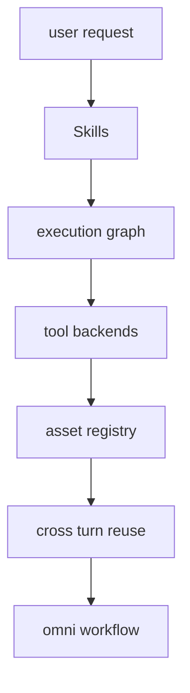
打分理由：多模态agent技能化编排+资产注册，工程可迁移。（core 8 / wide 7）

## 🧰 项目 · 核心方向

### 9. ⭐ 🧰 tinyhumansai/openhuman
[GitHub](https://github.com/tinyhumansai/openhuman) ★40,406 (+184 今日) · Trending daily · tool · Rust

**一句话**：OpenHuman 用 Rust 核心做 agent harness；9天登顶，单进程 500 agent 约 25 倍更密。
**为什么值得你看**：你做 agent / 推理系统时，能看清 harness 的性能与模块化取舍。

**核心架构**：它解决的是“agent 能力碎片化但生产上又要低延迟、低成本、可插拔”的痛点：同一个系统里既要接 LLM、memory、search、skills，又要撑住桌面端、CLI、库和多 agent 并发。OpenHuman 的承重组件是 Rust core，UI 不是核心，真正的运行时在进程内；模块能力靠 Cargo feature gates 控制，缺什么就不编什么，能力则通过 loadable native modules 和 bus contract crate 插进去，避免把所有功能硬塞进主二进制。它还把 LLM、embeddings、memory、web search 都做成 config 驱动的可切换引擎，减少对单一 provider 的绑定。成熟度信号比较强：有 GitHub Releases、持续高频 release、README 给出内存与延迟基准，并明确说是 Early Beta；但也说明它还在快速迭代期。和一般 agent wrapper 相比，它差异不在“多接了几个 API”，而在 in-process 架构、模块门控和运行时密度。

- 最强证据：500 agent 单进程约 25 倍更密
- README 明确 Early Beta，稳定性还在打磨
- 复现要看 Rust core、feature gates、module bus
**为什么现在上榜**：最近 release：v0.64.10（2026-09-30）、v0.64.7（2026-09-29）、v0.64.4（2026-09-26）。
**精读价值**：值得关注，偏工程成熟度判断，不必立刻精读。
**关联**：[[MCP]]、[[Claude Code]]
#agent #harness #mcp · 难度：中等 · 建议：值得通读 (20 min)
前置：◽ agent · 🔲 [[memory]] · 🔲 [[model context protocol]] · 🔲 [[quantization]]

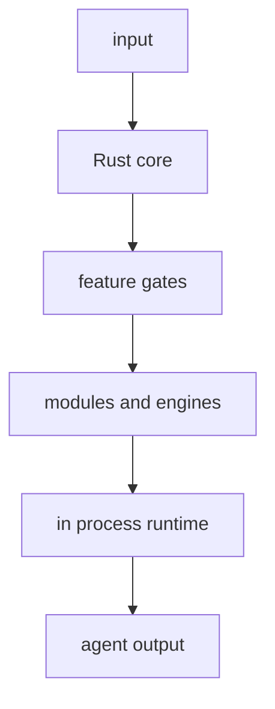
打分理由：开源 agent harness，能用于多场景落地。（core 8 / wide 8）

### 10. ⭐ 🧰 PrimeIntellect-ai/prime-agent
[GitHub](https://github.com/PrimeIntellect-ai/prime-agent) ★21,457 (+51 今日) · Trending daily · tool · Rust

**一句话**：RLM harness 把上下文变变量，靠持续状态和可回滚 refine 支持长期任务。
**为什么值得你看**：适合看 agent 记忆、自治和长期任务组织

**核心架构**：反直觉点在于：长任务里真正丢的常不是模型能力，而是工作上下文和操作习惯一断电就没了。传统 agent 多把 prompt、memory、skills 当一次性输入，聊天窗一关就重来，长跑任务会在重启、分支和子任务间失忆。Prime Agent 的关键改法是把 RLM 里的 context 当变量、把 subagent 当函数调用，再把 supplemental prompts、memories、skill specs 放进持续的 harness 状态里；`/refine` 只做基于证据的小更新，且默认不改 immutable base prompt，避免“越改越偏”的灾难。最直接的证据是它强调 daemon-backed continuity、retained subagents、background sessions 和 recorded rollback，说明任务可以跨断线继续而不是只在单轮对话里成立。新意主要在系统组织层：不是更会答，而是把 agent 变成可持续运行、可演化的工作环境。

- 最强卖点是持续 state + 可回滚 refine
- 原文未明确是否有系统级对照实验
- 复现门槛偏高：Rust + Python control env + daemon
**精读价值**：看速览足够，想做长期 agent 再精读
**关联**：[[ReAct]]、[[Model Context Protocol]]
#agent #rlm #autonomy · 难度：硬核 · 建议：值得通读 (20 min)
前置：🔲 [[ReAct]] · 🔲 [[planning]] · 🔲 [[memory]] · 🔲 [[multi-agent]]

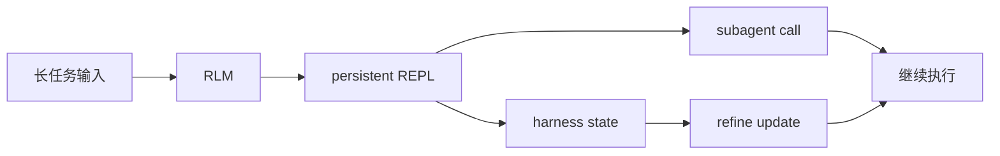
打分理由：自改进长任务 agent，方向高度匹配。（core 8 / wide 7）

### 11. ⭐ 🧰 anthropics/claude-code
[GitHub](https://github.com/anthropics/claude-code) ★148,851 (+5807 本月) · Trending monthly · tool · TypeScript

**一句话**：Claude Code 用终端里的 agent 处理编辑、测试和 git，最近加了 side agent 盯错。
**为什么值得你看**：面试时很好讲 agent coding 产品化

**核心架构**：它解决的是“LLM 会写代码，但不懂你当前仓库状态”的断层：模型能给建议，却很难持续跟踪编译错误、diff、git 流程和长命令输出。Claude Code 的核心是把 agent 放进 terminal，把代码库、shell、git workflow 都纳入同一个交互回路；最近 release 里最值得注意的是 Claude Mods 允许插件改更深层行为，以及内置 `You should know` side agent 专门监视主 agent 和用户可能漏掉的问题，等于把“自检”从提示词变成独立观察者。支持这一点的直接证据是 changelog 明确写了插件、OTel 字段和 MCP URL prompts，说明它不是单一聊天界面，而是围绕可观测、可扩展、可接外部协议的 agent 平台。新意主要在系统组织层，外加很强的产品成熟度信号：持续高频 release、npm/安装脚本、文档和插件体系都很完整。

- side agent 直接补主 agent 漏洞
- 原文未明确 side agent 的量化收益
- 安装与 telemetry、插件深度改行为需注意权限
**为什么现在上榜**：v2.1.287，2026-10-01；近三天连续发布
**精读价值**：值得通读，适合看 agent 产品化
**关联**：[[ReAct]]、[[Model Context Protocol]]
#agent #coding #llm · 难度：中等 · 建议：值得通读 (20 min)
前置：🔲 [[ReAct]] · 🔲 [[planning]] · 🔲 [[MCP]] · 🔲 [[prompt injection]]

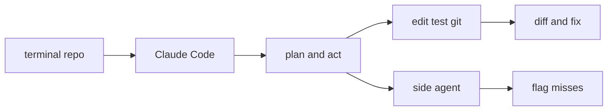
打分理由：旗舰 agent 级编码助手，面试高频。（core 7 / wide 9）

### 12. ⭐ 🧰 cline/cline
[GitHub](https://github.com/cline/cline) ★69,672 (+2815 本月) · Trending monthly · tool · TypeScript

**一句话**：Cline 把 IDE agent 做成 SDK/CLI/插件平台，支持多模型、多代理和可审计执行。
**为什么值得你看**：对比 agent 框架和产品形态很有用

**核心架构**：它解决的是“agent 只能在一个入口里跑”的局限：写代码、跑测试、接云服务、做自动化，各自需要不同载体。Cline 的结构不是单一客户端，而是共享 agent core 外挂到 VS Code、CLI、desktop 和 SDK；规则放在 `.clinerules`，插件和 MCP server 扩展工具，multi-agent teams 负责拆任务，checkpoint 负责可回滚，Plan/Act 则把探索和执行分开，减少一上来就乱改代码的失败。最直接的成熟度证据是它有清晰的产品矩阵、SDK 文档、独立 changelog、以及最近 release 里直接改 provider fallback 和模型目录，说明它在工程上已经围绕兼容性和可维护性迭代，而不是一次性演示。新意在系统组织层：不是某个新算法，而是把 agent 做成跨界面、跨模型、可扩展的执行底座。

- 多入口共享同一 agent core
- 原文未明确评测或安全沙箱能力
- 复现难点在整个平台而非单个功能
**为什么现在上榜**：v4.1.22，2026-09-30；同时更新 SDK 版
**精读价值**：适合速览判断平台成熟度
**关联**：[[ReAct]]、[[Model Context Protocol]]
#agent #coding #ide · 难度：中等 · 建议：值得通读 (20 min)
前置：🔲 [[ReAct]] · 🔲 [[MCP]] · 🔲 [[multi-agent]] · 🔲 [[planning]]

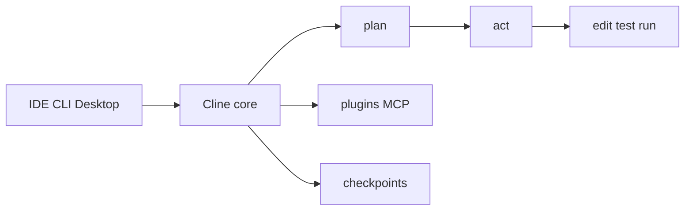
打分理由：开源代码智能体，贴近工程与工具调用。（core 7 / wide 7）

### 13. ⭐ 🧰 tile-ai/tilelang
[GitHub](https://github.com/tile-ai/tilelang) ★8,068 (+157 今日) · Trending daily · infra · Python

**一句话**：TileLang 用 Python DSL 编译 GPU/NPU kernel，已补 Ascend 950 和自动 warp specialization。
**为什么值得你看**：做推理加速/系统面试，懂它能讲 kernel DSL 取舍。

**核心架构**：它解决的是“想写高性能 kernel，但手工改 CUDA/MLA/FlashAttention 太慢且难移植”的悖论：程序员要控制 tile、shared memory、warp 角色和 backend 细节，现成框架又把这些隐藏掉，结果不是快但难维护，就是好写但性能掉。TileLang 的关键变化是把“可编程的高层语法”和“面向硬件的编译后端”绑在一起：Pythonic 前端负责表达 GEMM、FlashAttention、LinearAttention 等算子，TVM 之上的编译基础设施负责把这些表达落到 CUDA/ROCm/Metal/LLVM/Ascend；自动 warp specialization 和 backend registry 这类设计，阻断的是同一份 kernel 在不同架构上重复手写调度、同步和代码分发。最直接的证据是最近 release 明确给出 Ascend 950 native code generation、automatic scheduling/synchronization，以及统一 block-scaled GEMM 和更强的 Python frontend，说明它不是只会“生成样例”，而是在扩展可落地的后端与语法面。新意主要在系统组织层：不是单个 kernel trick，而是 DSL、编译器、调度、诊断、后端支持一体化。

- 作者报告 v0.1.15 新增 Ascend 950 原生后端
- 自动 warp specialization 说明调度已内建
- 难点不在语法，在后端覆盖和算子一致性
**精读价值**：值得看 release 线索，不必先精读全部编译细节。
**关联**：[[TVM]]、[[Triton]]
#compiler #kernels #gpu · 难度：中等 · 建议：值得通读 (20 min)
前置：◽ TVM · ◽ CUDA · ◽ warp specialization · ◽ GEMM

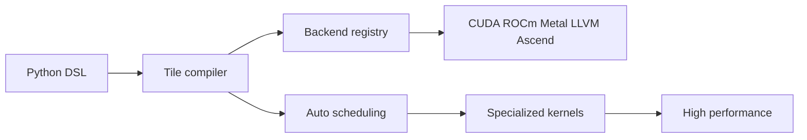
打分理由：GPU/算子 DSL，和训练/推理加速相关（core 7 / wide 6）

### 14. ⭐ 🧰 Simreal-AI/Simreal-MLBench
[GitHub](https://github.com/Simreal-AI/Simreal-MLBench) ★242 · infra · Python

**一句话**：Simreal-MLBench 用外部裁判做 60 任务 ML research agent 评测，分数可复算。
**为什么值得你看**：Agent 评测与 benchmark 设计，面试很有谈资。

**核心架构**：它要解决的是一个很反直觉的评测问题：agent 不是只做一次预测，而是会读数据、改特征、挑验证、调参、做 ensemble、再提交；如果标签和评测都在本地，分数就容易被“看答案”或切错 holdout 污染。Simreal 的关键改变是把 benchmark 拆成两层：公开层只给任务目录、协议、评分规则和验证工具，执行层由 Simreal 运营，标签留在 external competition platform，agent 只通过 restricted gateway 和 worker queues 跑受控任务。这样阻断的是三类失败：拿到测试标签、伪造提交过程、以及无法追溯每个分数来自哪次 artifact。最强证据不是任务数，而是它明确支持 two-submission rule、冻结 artifacts、submission id+artifact hash+reference snapshot 的 full provenance，并给出 public package 可复算的 scoring code。新意主要在系统组织层和实证层：不是新模型，而是把“研究型 agent 评测”做成可操作、可审计、可外部托管的协议。

- 公开层可复算，标签留在外部平台
- 两次提交中间有真实反馈，测适应能力
- 本仓库不含完整运行时，复现有限制明显
**为什么现在上榜**：Public preview；原文明确 60 tasks、评分与协议已发布，运行时仍由服务端运营。
**精读价值**：值得看，尤其适合做 agent benchmark 设计参考。
**关联**：[[SWE-bench]]、[[WebArena]]
#benchmark #agent-eval #evaluation · 难度：中等 · 建议：值得通读 (20 min)
前置：◽ agent · 🔲 [[planning]] · 🔲 [[memory]] · 🔲 [[SWE-bench]]

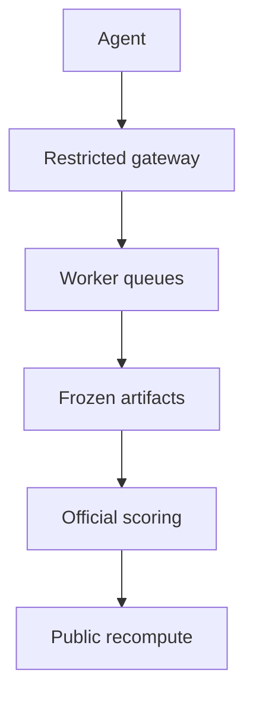
打分理由：agent评测基准协议清晰，且可面试聊（core 7 / wide 7）

## 🌐 全领域热点

### 15. 🌐 📄 MaLiang-Harness: A Programmable Path to Image and Video Generation
arXiv [2609.34309](https://arxiv.org/abs/2609.34309) · HF 🔥 383 · Haoyu Zhao, Zihao Zhang, Xudong Wang 等 · [PDF](https://arxiv.org/pdf/2609.34309) · [代码](https://github.com/gulucaptain/MaLiang-Harness) ★18

**一句话**：MaLiang-Harness 用 PEG TGP REV 处理图像视频生成里的 P2V gap。
**为什么值得你看**：VLM 生成、agent 规划和可控生成交叉，适合面试讲系统设计。

**核心架构**：它抓住的悖论是：代码能跑通，不代表图像/视频真的满足需求。比如对象位置对了，构图却错了；动作脚本合法，时序却不对。现有直接生成式方法把“视觉结果”当终点，缺少对程序、历史和证据的持续绑定，所以一轮修一轮忘，越改越偏。作者的核心变化是把生成过程做成 persistent process：PEG state 保留程序、任务上下文和修订索引，阻断的是“改完不知道上一版是什么、任务约束丢失”；TGP 把每次编辑和渲染证据连起来，阻断的是“看见错误但定位不到是哪次操作造成的”；REV 让每次提交前都重新验证当前 revision，阻断的是“局部修好后把旧问题重新引入”。最直接的证据是他们在 MaLiang-IBench 和 MaLiang-VBench 上评测 11 个闭源 MLLM，报告 GPT-6-Astra 在生成成功率上 100%，但只有 96.0% 图像和 76.9% 视频同时满足全部质量阈值，说明“能生成”与“满足视觉要求”确实是两回事。新意主要在系统组织层，外加一层实证：不是新模型，而是把可执行程序、渲染反馈和修订管理整合成闭环。

- 最强证据是成功生成与质量阈值显著分离
- 原文明确支持图像和视频统一的 revision 闭环
- 复现门槛在多轮渲染和视觉判断，不是单次推理
**精读价值**：值得精读，核心是把可控生成从单次输出变成可审计闭环。
**关联**：[[ReAct]]、[[program synthesis]]
#agent #diffusion #mllm · 难度：硬核 · 建议：建议精读
前置：◽ MLLM · 🔲 [[diffusion model]] · 🔲 [[video generation]] · 🔲 [[planning]]

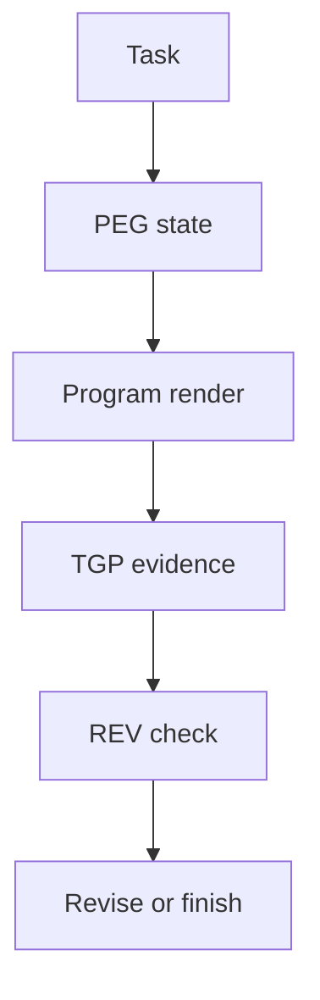
打分理由：可复现的视觉生成“可执行程序”范式，热度高。（core 4 / wide 9）

### 16. 🌐 📄 Systematically Exploring the Capabilities of GPT-6 Astra as Embodied Policies
arXiv [2609.38537](https://arxiv.org/abs/2609.38537) · HF 🔥 27 · Galbot Team, Xuchuan Chen, Xiaoqian Cheng 等 · [PDF](https://arxiv.org/pdf/2609.38537) · [代码](https://github.com/anonymous-report-421/GPT-as-Policy) ★565

**一句话**：GPT-6 Astra 直接数值控机器人；混合控制在 RoboDojo 子集达 48%，DexJoCo 50%。
**为什么值得你看**：对 LLM+机器人交叉、面试讲 embodied policy 很对口。

**核心架构**：它碰到的反直觉点是：模型已经会吐出数值动作，不等于能“接管控制”。现有 VLA 或高层规划方法多停在离散技能选择，无法说明模型到底是在做目标修正、接触准备，还是完整轨迹控制。作者把问题改成“Direct vs Hybrid”两条控制链：Direct 让 Astra 直接产出动作，由 IK/PD 执行；Hybrid 则让 Astra 去改写、接受或替换 learned policy/whole-body controller 的提议，失败被阻断在低层控制器而不是让模型硬做全轨迹。最直接的证据是分域对比：gripper manipulation 里 Hybrid 对 RoboDojo 子集 48%，dexterous manipulation 里 50%，而 locomotion 连续 5 次 dense motion reference 都没到终点，说明会“提案”不等于会稳定“运动”。新意主要在系统组织层和实证层，不是新模型，而是把大模型当 embodied policy 来系统拆分责任边界。

- 最强证据是多域边界测评，不是单任务刷分
- locomotion 反复失败，说明控制稳定性仍是瓶颈
- 复现受限于具体接口、controller 和评测协议
**精读价值**：适合看懂 LLM 当机器人策略的边界，不必精读方法细节。
**关联**：[[SayCan]]、[[Code as Policies]]
#embodied #agent #eval · 难度：中等 · 建议：值得通读 (20 min)
前置：🔲 [[vision-language-action]] · 🔲 [[planning]] · ◽ feedback-driven adaptation · ◽ whole-body controller

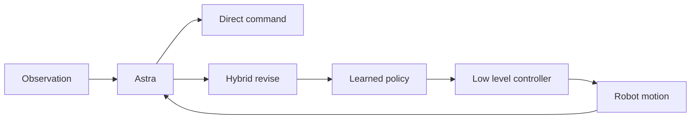
打分理由：Astra作为具身策略的评测，热度高且可对标.（core 7 / wide 8）

### 17. 🌐 📄 Inference Auctions
arXiv [2609.40070](https://arxiv.org/abs/2609.40070) · Keegan Harris, Siddharth Prasad, Asher Trockman 等 · [PDF](https://arxiv.org/pdf/2609.40070)

**一句话**：用 DFS+VCG 给 LLM 推理排队拍卖，福利提 12–18.6%，同时保住 SGLang 缓存命中。
**为什么值得你看**：对推理系统、KV cache、调度和 agent 服务很有面试价值。

**核心架构**：它要解决的悖论是：推理需求爆掉时，按出价排队看似更公平，却会打乱共享前缀，损失 KV cache 复用，吞吐和延迟一起崩。作者的关键改法不是直接“按价排序”，而是把所有请求限制在 radix tree 的 DFS schedule 里：DFS 保证共享前缀连续，阻断 cache 失效；然后只在同一子树的孩子顺序上让 bid 起作用，用 VCG payment 让用户如实报价。最强证据是把拍卖层接在未改动的 SGLang 前面：福利比 bid-blind、cache-optimal 方案高 12–18.6%，而 cache hit rate 和 average time-to-first-token 基本不变，说明经济效率提升没有破坏系统效率。新意在系统组织层加机制设计层，而不是单纯做一个新调度器。

- 强约束是 DFS，保证缓存友好
- 没证明在所有到达分布下都优于现有 QoS 策略
- 实现依赖 radix tree 和可计算 VCG，工程不轻
**精读价值**：值得精读，适合补推理服务调度与机制设计。
**关联**：[[SGLang]]、[[Vickrey–Clarke–Groves]]
#inference #market #agent · 难度：硬核 · 建议：建议精读
前置：🔲 [[KV cache]] · 🔲 [[speculative decoding]] · ◽ SGLang · 🔲 [[next-token prediction]]

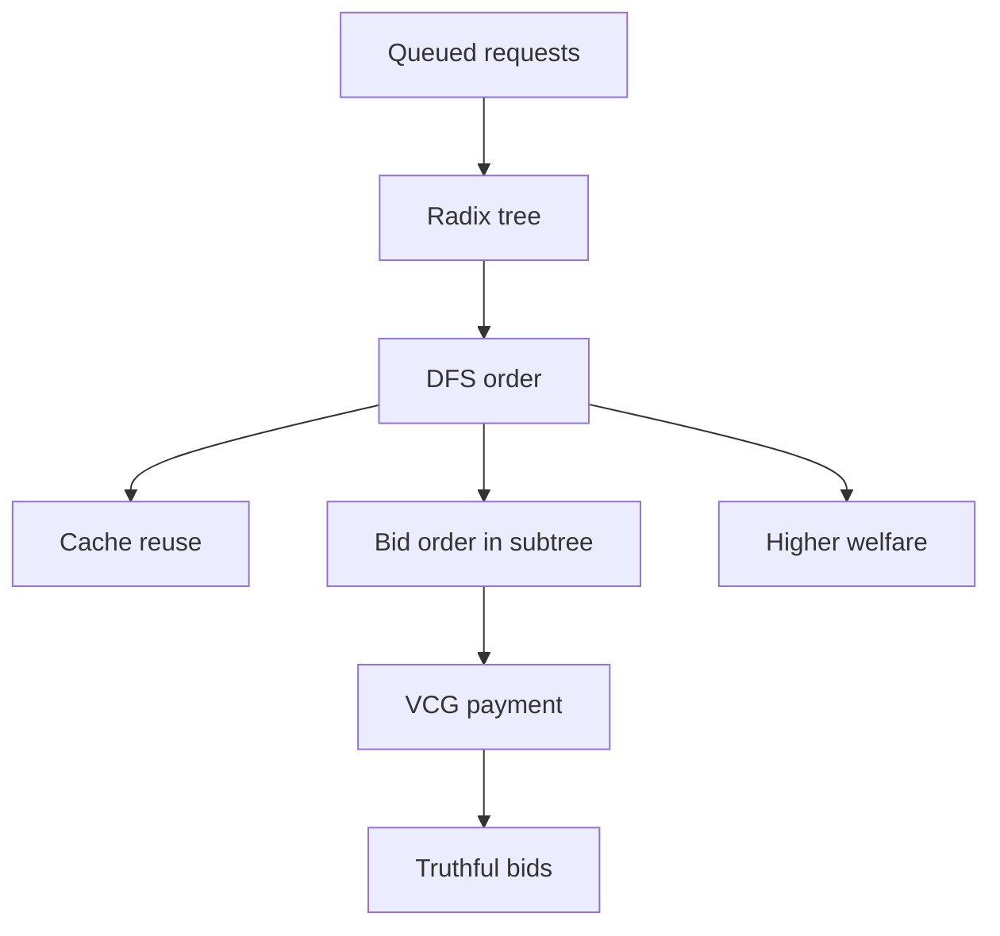
打分理由：推理资源调度+拍卖与代理，系统与经济学热点（core 6 / wide 8）

### 18. 🌐 🧰 diegosouzapw/OmniRoute
[GitHub](https://github.com/diegosouzapw/OmniRoute) ★72,050 (+332 今日) · Trending daily · infra · TypeScript

**一句话**：OmniRoute 用单端点聚合 359 providers、1200+ models，v3.8.51 标称 2022 条变更。
**为什么值得你看**：对 agent 工具链、MCP 网关和多模型路由很实用。

**核心架构**：它解决的是“多家模型接口、额度和降级策略太碎，手动切换很容易炸”的真实痛点。核心承重组件不是单纯代理转发，而是一个 TypeScript 网关：一个 OpenAI 兼容 endpoint 统一接入 359 providers，自动按 quota-aware fallback 选路；另有 compression 层，标称 RTK+Caveman 可省 15–95% tokens；再加 MCP/A2A 和 Desktop/PWA，说明它想覆盖 CLI、IDE 和桌面入口。成熟度信号比较强：有 Docker、npm、release notes、v3.8.51 的 2022 条变更和 301 外部贡献者，README 还给出零配置 curl 示例；但 README 的“150+ free”与正文里“489 free-tier entries”这类口径较营销，实际能力最好以 release 和文档为准。和普通 API 聚合器相比，它差异在于“路由+配额+压缩+MCP”一体，而不只是转发。

- 最强证据是大 release 和可见文档/镜像
- README 口径偏营销，具体节省需看文档
- 做路由器比套壳更重，复现要处理多 provider 适配
**为什么现在上榜**：最近 release：v3.8.51（2026-09-30）；v3.8.50（2026-08-26）；radar-export-latest（2026-08-20）。
**精读价值**：想要多模型网关能力可先装；精读只在要做路由系统时。
**关联**：[[vLLM]]、[[SGLang]]
#llm #gateway #routing · 难度：中等 · 建议：值得通读 (20 min)
前置：🔲 [[MCP]] · 🔲 [[KV cache]] · 🔲 [[quantization]] · 🔲 [[speculative decoding]]

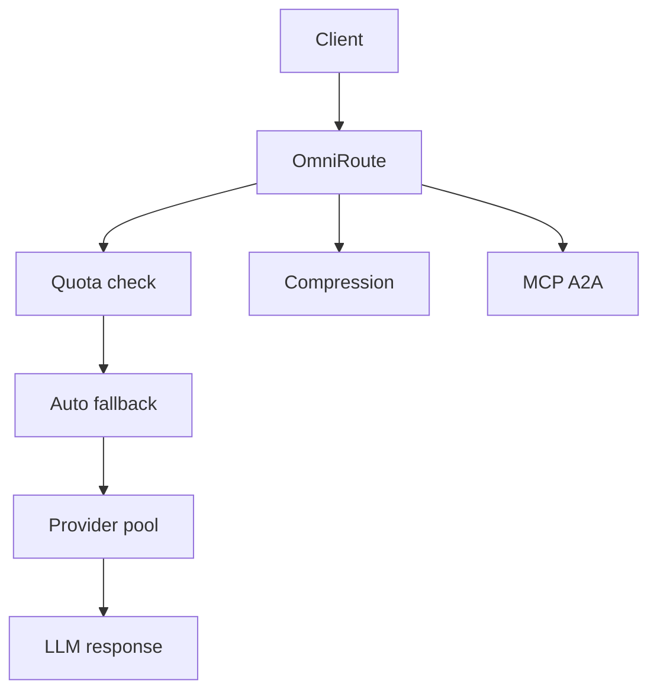
打分理由：大模型网关路由与压缩，系统工程相关（core 4 / wide 7）

---
想精读哪一篇？在 Claude 里说：`精读 2026-10-01 第 N 条`，Jarvis 会按你的 known.md 只讲你不会的部分。