# Jarvis 日报 · 2026-10-02

候选 787 → 过滤后 419 → 入选 18。图例：⭐ 核心方向 · 🌐 全领域热点 · ✅ 已掌握前置 · 🔲 需补前置

## 📄 论文 · 核心方向

### 1. ⭐ 📄 Agent Error Dataset: Scaling 50,000 Error--Diagnosis Pairs for Failure Analysis and Error-Aware Post-Training
arXiv [2609.40111](https://arxiv.org/abs/2609.40111) · HF 🔥 46 · Kunlun Zhu, Xuyan Ye, Yibo Li 等 · [PDF](https://arxiv.org/pdf/2609.40111)

**一句话**：50,228 条失败-诊断对，把 agent 崩溃经验变成可训数据
**为什么值得你看**：直接面向 agent 失败分析和后训练，面试很能讲

**核心架构**：这篇先解决一个反直觉点：失败 rollout 不是“无效样本”，而是同时包含 observation、action 和 environment response 的纠错证据；问题在于，只有最终 reward 不能告诉你该改哪一步、换什么动作。作者的关键改变是把失败拆成“诊断”和“修正”两种训练视图：AED 记录 50,228 条 error–diagnosis pair，并保留 trace 与 execution metadata，AET 再用这些证据校验 proposed correction，能 replay 时还拿同 checkpoint 的原动作重试作控制，避免把“看起来合理”误当成“确实更好”。最直接的证据是 3,062 对 matched replay 中，first-proposal corrections 的 verifier pass rate 从 18.4% 提到 51.1%。新意主要在系统组织层：不是再做一个失败分类器，而是把失败日志组织成可复诊断、可回放、可分别训练 diagnosis actor 的数据管线。

- 最强证据：3,062 对 replay，pass rate +32.7pp
- 没证明通用性：text-based agent 系统为主
- 复现难点：要有 harness replay 和元数据
**精读价值**：值得精读，核心是“失败经验如何变训练数据”
**关联**：[[AgentTuning]]、[[AgenTracer]]
#agent #evaluation #post-training · 难度：硬核 · 建议：建议精读
前置：◽ agent · ◽ post-training · 🔲 [[reward model]] · 🔲 [[rejection sampling]]

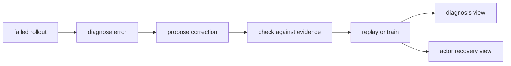
打分理由：误差数据+面向后训练的Agent失败分析（core 10 / wide 6）

### 2. ⭐ 📄 AIM: Agentic Idea Management for Automated Research
arXiv [2609.38445](https://arxiv.org/abs/2609.38445) · HF 🔥 49 · Hyeong Kyu Choi, Bhavana Dalvi Mishra, Jiefeng Chen 等 · [PDF](https://arxiv.org/pdf/2609.38445)

**一句话**：AIM 把科研代理从改代码，升级到管 ideas
**为什么值得你看**：适合看自动科研 agent 的组织方式和搜索抽象

**核心架构**：这篇先抓住一个常见卡点：科研 agent 只盯着具体实现时，容易把“哪个想法更好”和“怎么把某个实现改好”混在一起，导致实验预算被局部工程细节吃掉。作者的关键改变是把搜索对象从 solution 提升到 idea：AIM 用 Agentic Surrogate 维护 idea cluster 和历史证据，阻断“候选太多但没有全局记忆”的问题；用 Agentic Acquisition 决定先探索哪类 idea，再把候选交给 solver 落地，阻断“只会优化当前实现、不会比较方向”的问题；Solution Auditor 负责检查 idea–solution integrity，阻断“想法和实现跑偏”；Resource Planner 在固定预算下调并行度，阻断“早期撒太广、后期收不回来”。最直接的证据是 10 个 AutoLab 任务上，AIM 比 strongest baseline 在 System Optimization 上 +1.6pp、在 long-horizon Model Development & CUDA 上 +4.9pp，且最快 3.1x 更快到达最佳基线水平。新意主要在系统组织层，外加一点实证层。

- 最强证据：10 个 AutoLab 任务、最快 3.1x
- 没证明什么：依赖 AutoLab 和自动科研设定
- 复现难点：需要 idea-level 搜索与 auditor 配套
**精读价值**：值得看抽象层提升，适合自动科研方向
**关联**：[[ScientistOne]]、[[AI Scientist-v2]]
#agent #rag #research · 难度：中等 · 建议：值得通读 (20 min)
前置：🔲 [[planning]] · 🔲 [[multi-agent]] · 🔲 [[test-time compute]] · 🔲 [[SWE-bench]]

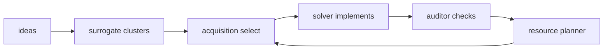
打分理由：自动科研智能体思路清晰且贴近Agent/RAG（core 9 / wide 5）

### 3. ⭐ 📄 Retrieval-Augmented Skill Optimization via Cross-Harness Adaptation
arXiv [2609.38024](https://arxiv.org/abs/2609.38024) · HF 🔥 34 · Jaewon Chu, Ji Soo Lee, Jihwan Park 等 · [PDF](https://arxiv.org/pdf/2609.38024)

**一句话**：RASO 用检索到的技能库，少跑 rollout 也能更会做 agent skill
**为什么值得你看**：和 RAG、技能优化、agent harness 直接相关，面试好讲

**核心架构**：它要解决的不是“有没有 skill”，而是“已有海量公开 skill，为什么还要从零试错”。现有 skill optimization 往往只靠目标任务上的 rollout 迭代，碰到 harness 变了就要重新学；作者的关键改变是把外部 skill corpus 当 prior，用 Retrieval-Augmented Skill Initialization 先从 task + harness 描述生成初始 skill，再用 Retrieval-Augmented Skill Update 在执行反馈下检索缺失知识继续修；Cross-Harness Adaptation 是核心阻断器，专门防止“检索到的内容来自别的任务/工具/单位，直接抄会失配”。最直接的证据是四个 agent benchmark、两个模型上，RASO 持续优于不带 retrieval 的初始化和更新；文中还特别指出 SpreadsheetBench 上检索到的 skill 里 92.9% 来自不同 harness，说明这个 adaptation 不是装饰，而是在处理真实分布偏移。新意主要在组件层加系统组织层：把 skill 优化从“只看本地 rollout”改成“检索 + harness 对齐 + 反馈更新”。

- 最强证据：4 benchmark、2 model 上稳定赢
- 没证明什么：依赖高质量外部 skill corpus
- 复现难点：Cross-Harness Adaptation 要处理工具失配
**精读价值**：值得看，适合做 agent skill/RAG 交叉方向
**关联**：[[TextGrad]]、[[GEPA]]
#agent #rlhf #rag · 难度：中等 · 建议：值得通读 (20 min)
前置：🔲 [[retrieval-augmented generation]] · 🔲 [[memory]] · 🔲 [[planning]] · 🔲 [[model context protocol]]

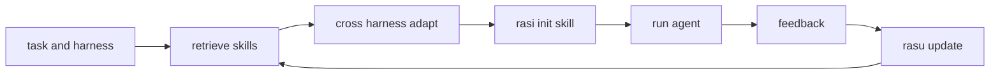
打分理由：Agent skills 优化+检索先验，契合RAG/后训练。（core 9 / wide 6）

### 4. ⭐ 📄 PivotOPD: Learning to Recover from Pivotal Mistakes in Multi-Turn Agents
arXiv [2609.40285](https://arxiv.org/abs/2609.40285) · HF 🔥 21 · Yinghui He, Yapei Chang, Khushi Bhardwaj 等 · [PDF](https://arxiv.org/pdf/2609.40285)

**一句话**：PivotOPD 用早期 pivotal mistake+恢复轨迹训练，Qwen3-1.7B 在 ALFWorld 最优基线再提 5.5%
**为什么值得你看**：做 agent / on-policy distillation 面试很对口

**核心架构**：反直觉点是：多轮 agent 失败不一定是一路崩到底，很多 rollout 其实卡在很早一次关键错误后，后面还“有救”。传统 OPD 只在学生自己采样到的轨迹上给密集监督，但错误会把后续状态带偏，恢复样本又很少，所以它学会了少犯错，却没学会怎么从自己犯错后的状态里爬回来。PivotOPD 的关键改变是把“关键错在哪一 turn”与“错后怎么恢复”拆开：pivotal turn 用 teacher 给 gold action，配 reverse KL 拉学生远离那次错误；后面几步再用 recovery action，配 forward KL 把学生几乎采不到的恢复行为灌进去。最直接的证据是 ALFWorld 上的反事实回放：只修正 pivotal turn，成功率就大幅回升；再给后两步恢复动作也能继续恢复，说明问题主要在“错后没学过”而不是“任务不可救”。新意主要在组件层和训练信号层，不是新环境。

- >50% 失败轨迹含 recoverable pivotal mistake
- 标准 OPD 降总体失败，但 pivotal 失败几乎不修
- teacher 选 pivotal 依赖 hindsight，复现门槛中等
**精读价值**：值得精读，关键在多轮 agent 的信用分配
**关联**：[[on-policy distillation]]、[[PPO]]
#agent #opd #on-policy · 难度：硬核 · 建议：建议精读
前置：🔲 [[on-policy distillation]] · 🔲 [[reward model]] · 🔲 [[direct preference optimization]] · 🔲 [[group relative policy optimization]]

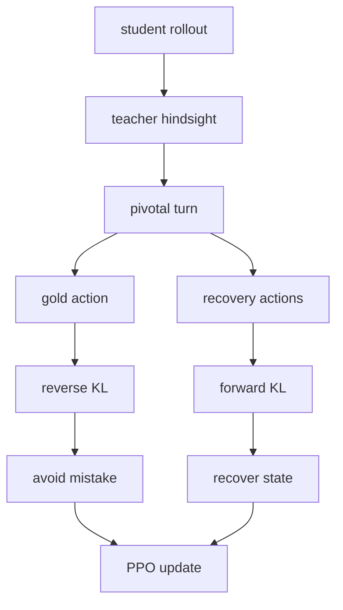
打分理由：多轮Agent从关键错误恢复，和OPD高度相关（core 9 / wide 5）

### 5. ⭐ 📄 KaliBench: A Fine-Grained Benchmark for Cybersecurity Tool Use on Kali Linux with Runtime-Free Verifiable Rewards
arXiv [2610.02206](https://arxiv.org/abs/2610.02206) · HF 🔥 4 · Pengfei Li, Naufal Suryanto, Sicheng Zhang 等 · [PDF](https://arxiv.org/pdf/2610.02206) · [代码](https://github.com/RISys-Lab/KaliBench) ★4

**一句话**：KaliBench 用 8,504 条 Kali 命令对，做无运行时可验证奖励的 NL-to-CLI 评测
**为什么值得你看**：适合看工具调用和 verifiable reward 的人

**核心架构**：这篇解决的不是“模型会不会做安全题”，而是“能不能把分析师意图翻成一条可执行的 Kali 命令”。在 CLI 场景里，少一个 flag、参数顺序错了、alias 用错了，命令就失效；而现有安全 benchmark 不是考知识问答，就是考端到端 agent，没法把失败归因到 tool selection 还是 argument construction。KaliBench 的关键改变是把问题拆成 schema-free 的 NL-to-CLI，并且给出细粒度、可验证的监督：先做工具与参数级 canonicalization，再用 alias-aware scoring 精确判错；因为 CLI 结构本身确定，还能在不跑真实命令的情况下构造 verifiable rewards。最直接的证据是作者报告：24 组模型配置里，没有开源模型超过 42% exact-command accuracy，且作者明确指出瓶颈主要在 argument construction。新意在 benchmark 组织层和奖励信号层，不是单纯刷分。

- 8,504 条 query-command，覆盖 1,642 工具
- 可做 runtime-free verifiable rewards
- 作者报告开源模型 exact-command 最高仍低于 42%
**为什么现在上榜**：原文未明确
**精读价值**：值得速览后看数据设计，训练价值大于榜单
**关联**：[[BFCL]]、[[ToolSandbox]]
#agent #benchmark #tool-use · 难度：中等 · 建议：值得通读 (20 min)
前置：🔲 [[tool use]] · 🔲 [[alignment]] · 🔲 [[reward model]]

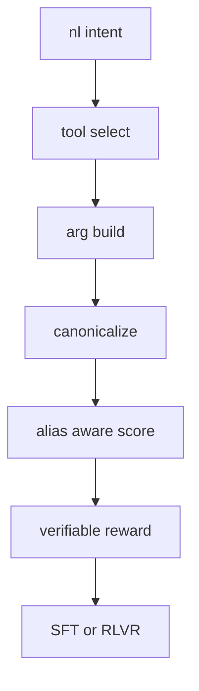
打分理由：Kali 工具使用细粒度可执行评测（core 9 / wide 4）

### 6. ⭐ 📄 Mem++: Non-Destructive Memory for Long-Term Organizational LLM Agents
arXiv [2610.02002](https://arxiv.org/abs/2610.02002) · Ahmad Yehia, Aly O. Abdelkareem, Islam Ahmed 等 · [PDF](https://arxiv.org/pdf/2610.02002) · [代码](https://github.com/AIDAChip-Inc/mem-plus-plus.)

**一句话**：Mem++ 把文档整份保留、读时再选，OrgMemBench 上比最强记忆基线高 8.0 到 13.1 分
**为什么值得你看**：做 RAG/记忆系统面试很容易问到

**核心架构**：反直觉点是：组织记忆里，最危险的不是“记不住”，而是“太早压缩后把版本关系压没了”。很多决策不是在原文里改一行，而是新发一份文档；如果 write-time 就把文档蒸成 facts 或 graph edges，后面问某个时间点到底哪个版本生效，系统已经没法回到原文核对。Mem++ 的关键改变是把选择权从 write-time 挪到 read-time：写入时不做生成式压缩，整份文档连日期和作者一起存；查询时先按时间截断，只取问题时点之前的文档，再把 lexical 和 semantic 排序融合，由回答模型自己决定版本。最直接的证据是 OrgMemBench：Mem++ 比最强 memory baseline 高 8.0 到 13.1 分，且在 LoCoMo 上 LLM-judge 也最好。新意主要在系统组织层：不是更聪明的摘要，而是拒绝过早丢源文档。

- write-time 不做压缩，原文整份保留
- 读时按时间过滤，再做 lexical+semantic 融合
- OrgMemBench 上领先 8.0 到 13.1 分
**为什么现在上榜**：原文未明确
**精读价值**：值得看，核心是记忆系统的时序归因
**关联**：[[MemGPT]]、[[RAG]]
#memory #agent #lifelong · 难度：中等 · 建议：值得通读 (20 min)
前置：🔲 [[retrieval-augmented generation]] · 🔲 [[embedding]] · 🔲 [[graph RAG]] · 🔲 [[memory]]

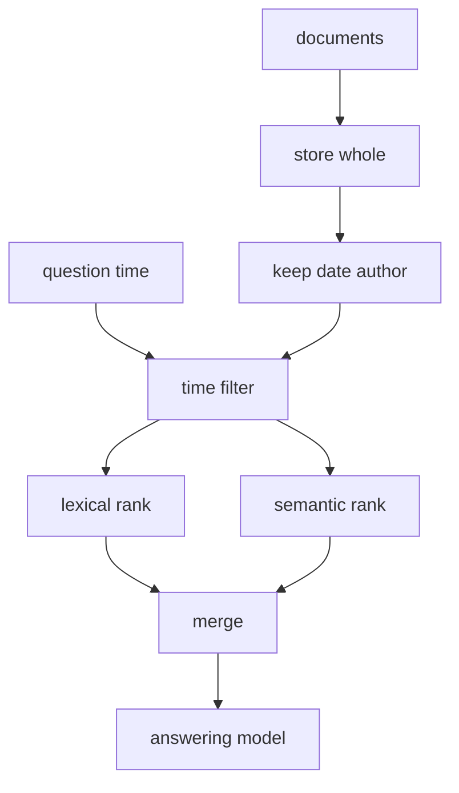
打分理由：非破坏式组织记忆，强贴合长记忆Agent（core 9 / wide 4）

### 7. ⭐ 📄 Reconstruct, Practice, Go Real: Guided Self-Improvement for Embodied Agents
arXiv [2610.02204](https://arxiv.org/abs/2610.02204) · Yen-Jen Wang, Haozhe Jiang, Shuying Deng 等 · [PDF](https://arxiv.org/pdf/2610.02204)

**一句话**：用仿真练习+技能库自改进，把22个任务成功率提到95.0%
**为什么值得你看**：适合看 embodied agent 的循环式自改进机制

**核心架构**：反直觉点在于：机器人失败后，不一定该先改 weights；很多错误其实卡在“技能缺失、技能复用差、提示词不会调度”。现有方法要么只在单任务里闭环修正，要么把能力写死进模型，跨任务复用差。RPG 的关键改变是把改进对象从参数改成共享的执行系统：Reconstruct 从离线数据里找可复用的 manipulation capability，并生成仿真练习任务；Practice 用 Runtime Agent vs Privileged Agent 的执行差异、加上 dataset videos 做失败诊断，再把改动落到新 symbolic skill、已有 skill 修订和 system prompt 更新；Cross-task evaluation 先验收单个改动，再验收合并后的版本，阻断“修好了 A 却搞坏 B”的回归。最直接的证据是 held-out 22 个任务上，15 轮后 success 从 28.6% 到 95.0%，而 ablation 说明去掉 Privileged Agent / Video Analyzer / skill revision 都会掉。新意在系统组织层：它不是新 policy，而是让机器人执行系统具备可迭代维护的共享技能库。

- 22任务 28.6%→95.0%，15轮持续提升
- 30个真实试验全成功，但前有统一校准/硬件适配
- 原文未给代码；复现关键在仿真任务构造与诊断链路
**精读价值**：值得精读，核心是“无权重更新”的机器人自改进闭环
**关联**：[[Voyager]]、[[ASPIRE]]
#embodied #robotics #rl · 难度：硬核 · 建议：建议精读
前置：🔲 [[ReAct]] · 🔲 [[planning]] · 🔲 [[memory]] · ◽ multimodal model

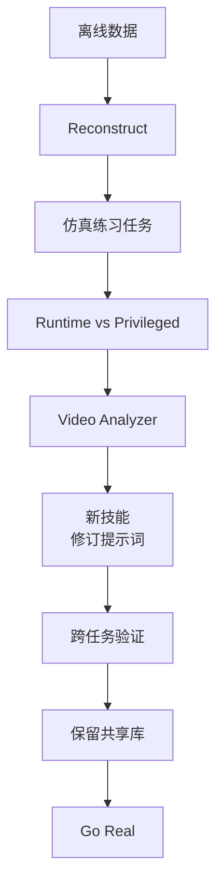
打分理由：具身智能体的离线数据驱动自进化。（core 9 / wide 7）

### 8. ⭐ 📄 Causal Memory Policy: Making Memory Utility Identifiable by Intervening on Retrieval
arXiv [2610.02070](https://arxiv.org/abs/2610.02070) · Arman Behnam, Binghui Wang · [PDF](https://arxiv.org/pdf/2610.02070)

**一句话**：把记忆筛选改成带随机曝光的因果估计，AUC到0.66
**为什么值得你看**：适合看 RAG/long-context 的记忆管理因果坑

**核心架构**：反直觉点在于：记忆“没用”不等于它真的没用，很多记忆只是从没被检索出来。现有 memory utility 估计大多只看已检索到的上下文，所以一旦某条 memory 永远没进 context，store-level 干预怎么改都看不出差别，utility 就不可识别。CMP 的关键改变是把干预点从 memory store 前移到 retrieval：系统预留固定 context slots，用已知 propensity 采样记忆，借此恢复 positivity；再用 self-normalized inverse propensity weighting 估计“被检索到后”的条件效用。这个设计直接阻断了“未被检索→效用无法估”的失败链。最直接的证据是他们在 LongMemEval/LoCoMo 上量到大量 required memories 根本没被识别到，且在 deployed memory system 里也存在；引入 CMP 后 required / non-required discrimination 从 0.54 到 0.66 AUC。新意在实证层 + 因果形式化层：不是又一个 memory scorer，而是证明了识别失败来自 retrieval-level positivity violation。

- 54%/67% required memories 发生识别失败
- CMP 把 discrimination 提到 0.66 AUC
- 它也证明：已识别的 utility 仍不足以做 retention
**精读价值**：值得精读，因果识别问题会影响很多记忆系统
**关联**：[[structural causal model]]、[[inverse propensity weighting]]
#memory #causal #retrieval #rlhf · 难度：硬核 · 建议：建议精读
前置：🔲 [[retrieval-augmented generation]] · 🔲 [[memory]] · ◽ causal inference · ◽ importance weighting

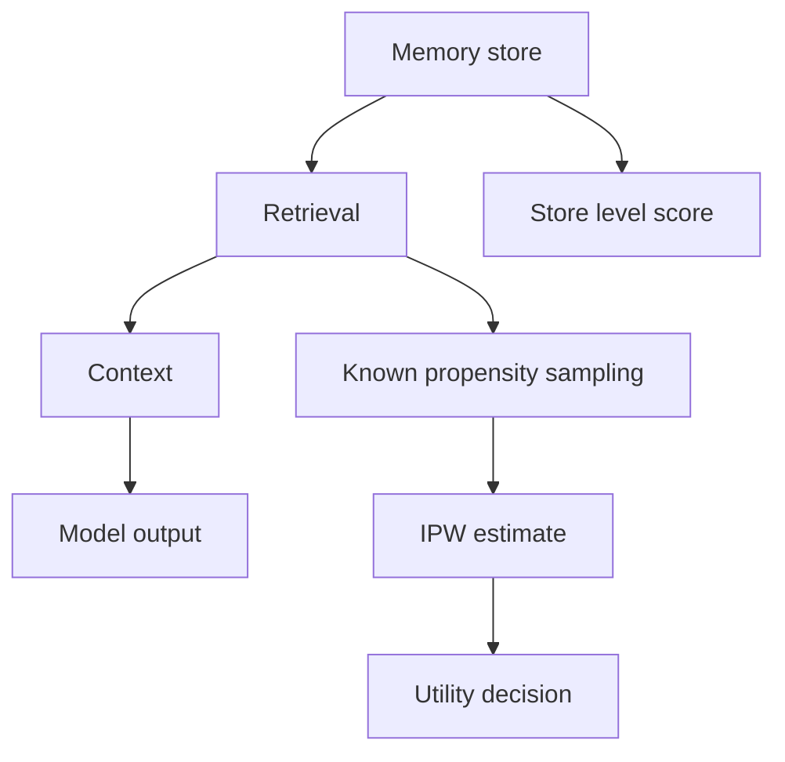
打分理由：因果记忆效用识别，直击agent/RAG关键痛点（core 9 / wide 5）

## 🧰 项目 · 核心方向

### 9. ⭐ 🧰 Friedrich-M/UniMate
[GitHub](https://github.com/Friedrich-M/UniMate) ★1,195 (+240 今日) · Trending daily · model · Python

**一句话**：统一 skeleton 动画模型，放出训练推理代码和预览 checkpoint
**为什么值得你看**：适合看 3D/视频生成里“一个模型吃多种骨架”的工程实现

**核心架构**：原文未明确它要解决的具体线上痛点，但从 README 看，它面向的是不同 skeleton 之间的统一动画：同一套模型要同时适配 Truebones、Mixamo、Objaverse 和 UniML3D，多骨架场景下最容易崩的是 joint 数、拓扑和时序长度不一致。它的承重设计是把输入先 canonicalize 成 60-frame clip，再在 attention 上提供两种组织方式：graph_adaln 把空间和时间拆开做图距离/边类型/深度 bias，并用 adaLN 注入 caption；full_cross_attn 则把 joint×time token 展平后统一做 cross-attn。训练侧用 flow matching 预测线性插值速度，配 masked L2 + rotation/smoothness 辅助损失，并用 EMA 作为默认推理权重；数据侧有 balanced sampler、topology augmentation、padding mask，阻断不同骨架规模把训练分布拉偏。成熟度信号很强：训练与推理代码已放出，数据处理 pipeline 和 preview checkpoints 也已公开，README 还写了单机/多卡启动、resume、日志和可视化输出。想要“多骨架统一动画”，它相对单一数据集方法的差异主要在数据覆盖和两种 attention 取舍。

- 代码、数据管线、checkpoint 都已公开
- 两条注意力路线可切换：graph_adaln vs full_cross_attn
- README 很完整，但 OOD rig 处理仍标注 TODO
**为什么现在上榜**：2026-09-06 已放出 training and inference code；2026-09-27 又补了 preview checkpoints
**精读价值**：值得上榜，成熟度高，适合关注 3D 生成/动画方向
**关联**：[[MotionGPT]]、[[MimicMotion]]
#multimodal #video #3d · 难度：中等 · 建议：值得通读 (20 min)
前置：🔲 [[flow matching]] · 🔲 [[latent diffusion]] · 🔲 [[vision transformer]] · ◽ cross-attention

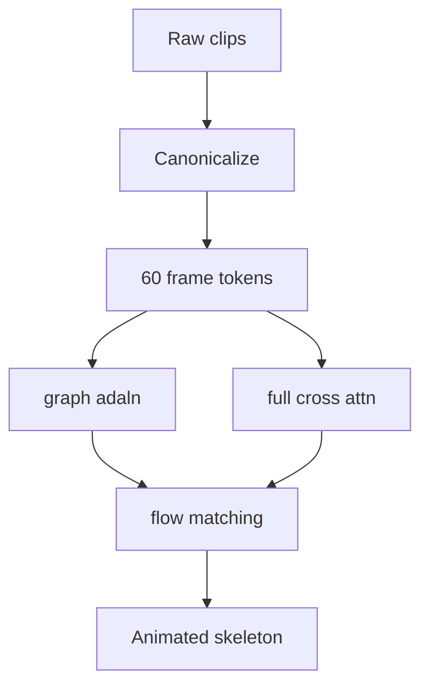
打分理由：骨架动画统一模型，具身/多模态潜力强。（core 8 / wide 7）

### 10. ⭐ 🧰 ruvnet/ruflo
[GitHub](https://github.com/ruvnet/ruflo) ★73,725 (+101 今日) · Trending daily · infra · TypeScript

**一句话**：🌊 The original agent harness
**为什么值得你看**：（dry-run：未调用 LLM，配置 OPENAI_API_KEY 后会生成中文速览）
- Deploy intelligent multi-player swarms, coordinate autonomous workflows, and build conversational AI systems
- Features adaptive memory, self-learning intelligence, federation, vector RAG integration, and native Claude Code / Codex
#agent #orchestration #rag #memory · 难度：中等 · 建议：看速览即可
打分理由：agent编排框架+内置RAG/记忆，工程可迁移强。（core 8 / wide 7）

### 11. ⭐ 🧰 Panniantong/Agent-Reach
[GitHub](https://github.com/Panniantong/Agent-Reach) ★88,447 (+683 今日) · Trending daily · tool · Python

**一句话**：Give your AI agent eyes to see the entire internet
**为什么值得你看**：（dry-run：未调用 LLM，配置 OPENAI_API_KEY 后会生成中文速览）
- Read & search Twitter, Reddit, YouTube, GitHub, Bilibili, XiaoHongShu — one CLI, zero API fees.
#agent #rag #web · 难度：中等 · 建议：看速览即可
打分理由：互联网检索+多平台搜索，偏可用agent能力。（core 7 / wide 6）

### 12. ⭐ 🧰 colbymchenry/codegraph
[GitHub](https://github.com/colbymchenry/codegraph) ★72,912 (+163 今日) · Trending daily · infra · C

**一句话**：Pre-indexed code knowledge graph, auto syncs on code changes, for Claude Code, Codex, Gemini, Cursor, OpenCode, AntiGravity, Kiro, CoPilot, and Hermes Agent — f
**为什么值得你看**：（dry-run：未调用 LLM，配置 OPENAI_API_KEY 后会生成中文速览）
#agent #rag #graph #tool · 难度：中等 · 建议：看速览即可
打分理由：代码知识图谱+本地预索引，利于agent推理降token。（core 7 / wide 7）

### 13. ⭐ 🧰 FalkorDB/FalkorDB
[GitHub](https://github.com/FalkorDB/FalkorDB) ★6,641 (+200 今日) · Trending daily · infra · Rust

**一句话**：用稀疏矩阵+GraphBLAS做图数据库，主打 GraphRAG 低延迟查询
**为什么值得你看**：GraphRAG/知识图谱底座，适合面试聊系统取舍

**核心架构**：它解决的是：图检索一慢，RAG 就被多跳遍历和子图扩展拖垮。FalkorDB 的关键改变不是“多一个图数据库”，而是把 Property Graph 的邻接关系落到 sparse adjacency matrix，再用 GraphBLAS 的线性代数算子执行查询；这样阻断了传统图存储里指针遍历和高分支带来的随机访问瓶颈。原文最直接的证据是作者明确声称它是首个可查询的 Property Graph sparse-matrix 数据库，并且 repo 给出 Docker 一键启动、OpenCypher 兼容和 Python client 示例，说明可用性不是概念图。新意主要在系统组织层：把图查询编译成矩阵运算，而不是在组件清单上堆功能。

- 最强证据：OpenCypher + 可运行 demo
- 未证明在超大图/复杂查询下的极限
- 复现门槛低，docker 即可跑
**为什么现在上榜**：原文未明确
**精读价值**：适合看架构思路；若做 GraphRAG 可精读
**关联**：[[RedisGraph]]、[[GraphBLAS]]
#graphrag #kg #retrieval · 难度：中等 · 建议：值得通读 (20 min)
前置：🔲 [[graph RAG]] · 🔲 [[sparse attention]] · ◽ linear algebra

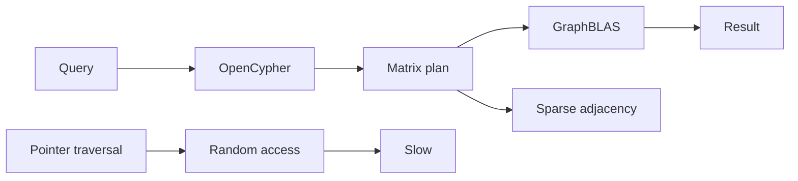
打分理由：GraphRAG 取向图数据库，价值较高。（core 7 / wide 5）

### 14. ⭐ 🧰 LockedinLabs-AI/agent-console
[GitHub](https://github.com/LockedinLabs-AI/agent-console) ★789 · infra · JavaScript

**一句话**：本地汇总 Claude Code/Codex 代理成本、token 和缓存，v0.4.1 加了 SBOM
**为什么值得你看**：做 coding agent 或内网部署时，能看可观测性和供应链

**核心架构**：它解决的是：agent 工具越多，token、cache、模型和成本分散在每台机器上，排查“谁在烧钱、谁卡住了”很难。Agent Console 的承重组件是本地读取各 agent transcript 和可选遥测，再汇到 self-hosted team hub；关键取舍是默认不出机，只上传 model id、分钟级时间戳、token 数和 salted hash，避免把 prompt、回复和路径暴露出去。0.4.1 的直接成熟度信号是 security release：修了两个可达缺陷，release pipeline 改成无 shell、GitHub Action pin 到 commit SHA，并新增 CycloneDX SBOM 和 attestation，这比“有 README”更像可上线。相比一般仪表盘，它差在 local-first、跨机器汇总和供应链可验证。

- 最强证据：0.4.1 安全修复+SBOM
- 只看计数，不上传 prompt/路径
- 未见大规模用户/集成证据
**为什么现在上榜**：v0.4.1（2026-09-27）安全发布；0.4.0/0.3.0 紧接发布
**精读价值**：偏工程实用，值得看成熟度与安全设计
**关联**：[[Grafana]]、[[Prometheus]]
#observability #agent #finops · 难度：中等 · 建议：值得通读 (20 min)
前置：◽ agent · ◽ observability · 🔲 [[prompt injection]]

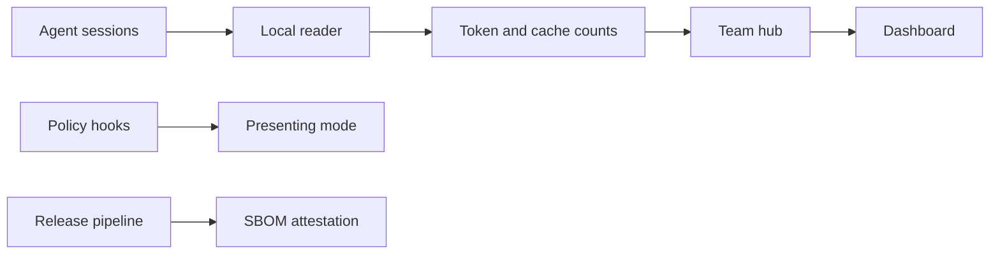
打分理由：本地first的agent观测+成本/模型记录（core 7 / wide 6）

## 🌐 全领域热点

### 15. 🌐 📄 The Teacher Is a Direction, Not a Destination: Extrapolating RL-Induced Representation Residuals in On-Policy Distillation
arXiv [2609.36484](https://arxiv.org/abs/2609.36484) · HF 🔥 295 · Hao Li, MeiJia Chen, Weijie Ren 等 · [PDF](https://arxiv.org/pdf/2609.36484) · [代码](https://github.com/xixixixixxxx/RIDE) ★4

**一句话**：RIDE 用 RL 前后隐状态残差做蒸馏，作者报告四组任务都赢 OPRD
**为什么值得你看**：后训练/蒸馏面试点，能讲清“为什么看 hidden states”

**核心架构**：它要解决的悖论是：OPD 明明在模仿 RL teacher，却常把“老师学到的东西”压扁在 logits 里，尤其当 teacher 离 base 很近时，output-space extrapolation 还会被 sampled log-ratio 噪声放大，训练反而不稳。作者的关键改变是把“老师相对 base 的变化方向”从输出空间搬到 representation space：先用 teacher 和其 pre-RL checkpoint 在同一 on-policy token 上算 layerwise residual，再把学生 hidden states 往 residual 方向外推到 teacher 之外。这个 residual 组件阻断的是 head 的各向异性衰减和 log-ratio 的随机噪声。最直接的证据是四组 base/RL teacher pair 上，RIDE 的 mean Avg@16 都能接近或超过 teacher，并且稳定压过 OPRD 和 output-space baseline；这说明改动不是只修一个榜，而是修了监督信号的位置。新意在组件层+实证层：把 reward extrapolation 从 logits 迁移到 hidden states，并给出稳定性解释。

- 最强证据：四组 pair 都优于 OPRD
- 没证明对非同初始化 teacher 也稳
- 复现依赖拿到 base 和 RL checkpoint
**精读价值**：值得精读，核心是蒸馏目标的位置变化
**关联**：[[OPRD]]、[[DPO]]
#rlhf #distillation #on-policy · 难度：硬核 · 建议：建议精读
前置：🔲 [[on-policy distillation]] · 🔲 [[RLHF]] · 🔲 [[reward model]] · 🔲 [[knowledge distillation]]

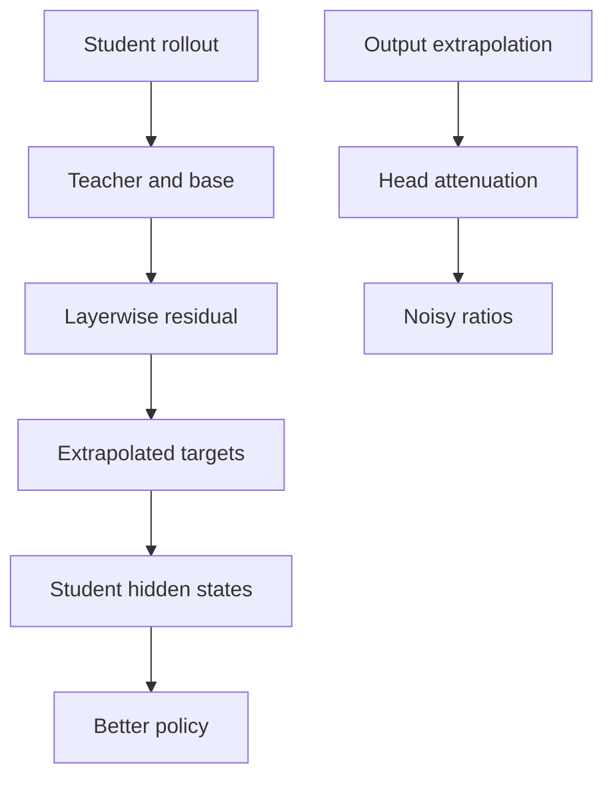
打分理由：OPD+RL 表征外推，训练方法面试可讲清（core 8 / wide 7）

### 16. 🌐 📄 Rethinking Latent Visual Reasoning: Grounding Latent Reasoning in Visual Evidence
arXiv [2609.34563](https://arxiv.org/abs/2609.34563) · HF 🔥 209 · Xi Xiao, Tianchen Zhao, Youngeun Kim 等 · [PDF](https://arxiv.org/pdf/2609.34563) · [代码](https://github.com/xixiaouab/ReaLVR-code) ★14

**一句话**：用 visual-evidence supervision 解决 latent 轨迹证据缺失，Qwen2.5-VL-7B 五任务均值到 63.7%
**为什么值得你看**：适合看 latent reasoning 和 GRPO 训练缺口

**核心架构**：反直觉点在于：latent reasoning 不写 CoT，但它也不该“盲想”；可作者发现，vanilla LVR 的 latent token 对会改变答案的图像扰动反应很弱，说明它没把关键视觉证据保住。核心改动不是换架构，而是把 GRPO 里只看 final answer 的信号，改成对 free-running latent trajectory 做证据级监督：先用正确答案 vs 模型错答判断哪些 token 位置该更强约束，再用相关证据 vs 匹配错位证据告诉这些 token 该保留什么。最直接证据是消融/对照里，替换 top-8 attention latent tokens 会显著拉低正确率，ReaLVR 的下降更大，说明这些 token 真在承载答案依赖的视觉信息。新意主要在组件层和训练信号层，不改 inference。

- 最强证据：255B 规模也有持续收益
- 没证明通用到非视觉 latent reasoning
- 复现难点在自由轨迹与证据对齐
**精读价值**：值得精读，核心是把 latent 训练从只看答案推进到看证据
**关联**：[[GRPO]]、[[CoT]]
#vlm #latent-reasoning #grpo · 难度：硬核 · 建议：建议精读
前置：🔲 [[VLM]] · 🔲 [[GRPO]] · ◽ latent reasoning · 🔲 [[visual transformer]]

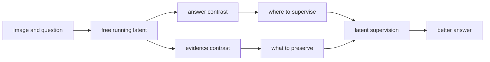
打分理由：潜在视觉推理监督问题，贴VLM后训练（core 8 / wide 7）

### 17. 🌐 📄 AREX-2: Advancing Self-Improving Agents through Long-Horizon Reflective Tasks
arXiv [2609.38288](https://arxiv.org/abs/2609.38288) · HF 🔥 126 · Hongjin Qian, Chaofan Li, Kun Luo 等 · [PDF](https://arxiv.org/pdf/2609.38288) · [代码](https://github.com/VectorSpaceLab/AREX-2) ★19

**一句话**：用长时程反思轨迹训练自改进 agent，Qwen3.8-27B 在 MLE-bench Lite 到 81.8
**为什么值得你看**：和 agent 反思、test-time scaling 直接相关

**核心架构**：难点不是“会不会重试”，而是重试很多轮后还会不会越改越好。作者把 self-improvement 拆成两件事：reflection 负责让当前方案变好，long-horizon execution 负责让这个循环别在几轮后塌掉。关键设计是把训练数据从“只保留最终过关样本”改成“保留整段改善轨迹”，并在 machine learning 与 algorithmic programming 这类有可验证反馈的域里合成长程 trajectory，让模型看到失败、回退、再修正的全过程。最直接证据是它在多轮预算增加时持续变好，同时把这种能力迁移到 BrowseComp、GAIA、HLE 等深度研究任务。新意在系统组织和实证：训练目标从单步正确性变成多轮改进能力。

- 最强证据：轮数越多性能继续涨
- 不证明所有任务都能自改进
- 数据构造依赖可验证反馈环境
**精读价值**：值得看，适合补 agent 自反思训练范式
**关联**：[[ReAct]]、[[test-time compute]]
#agent #self-improve #rl · 难度：中等 · 建议：值得通读 (20 min)
前置：🔲 [[planning]] · 🔲 [[memory]] · 🔲 [[test-time compute]] · 🔲 [[self-instruct]]

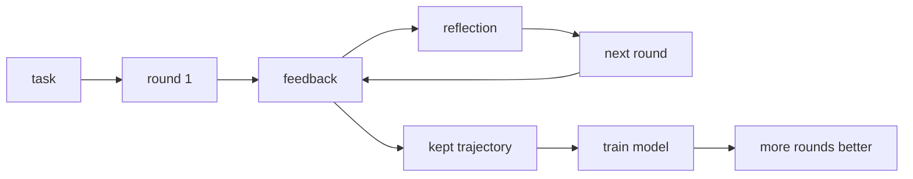
打分理由：长程反思自改进，agent 训练范式相关（core 8 / wide 7）

### 18. 🌐 📄 EvoDuet: Bilevel Co-Evolution of Web Searching and Task Solving for Scientific Discovery
arXiv [2609.40340](https://arxiv.org/abs/2609.40340) · HF 🔥 102 · Young-Jun Lee, Jinheon Baek, Soyeong Jeong 等 · [PDF](https://arxiv.org/pdf/2609.40340) · [代码](https://github.com/Open-Galapagos/EvoDuet) ★4

**一句话**：用双层共进化连接 web search 和解题，OpenEvolve 的 NDG 到 82.3%
**为什么值得你看**：适合关注 agent + web search + scientific discovery

**核心架构**：悖论是：给 evolutionary search 加 web search 工具后，模型常会反复搜到同一批页面，解题策略变了，检索却没变，搜索还是闭环的。EvoDuet 的关键改动是把“查什么”和“怎么解”拆成双层共进化：外层负责生成并评估候选解，内层用 retrieval gate 判断当前是该补新知识、复用旧文档，还是直接推进；当需要检索时，内层再按当前知识缺口改写 query，并用 hypothetical evidence scoring 预测哪篇文档更可能带来高分候选。最直接证据是 21 个优化任务上，OpenEvolve + EvoDuet 的 NDG 明显提升，且在 Q20、Rosetta 等任务刷新历史最好。新意在系统组织层：把 search loop 也纳入进化，而不是只进化 solution。

- 最强证据：21 任务 NDG 提升到 82.3%
- Qwen3.5-9B 不一定受益，需会用证据
- 预测高分文档仍可能产出差候选
**为什么现在上榜**：原文未明确
**精读价值**：值得精读，核心是把检索做成会随解题共同演化的循环
**关联**：[[OpenEvolve]]、[[EvoX]]
#agent #web-search #scientific · 难度：硬核 · 建议：建议精读
前置：◽ agent · 🔲 [[retrieval-augmented generation]] · 🔲 [[planning]] · 🔲 [[memory]]

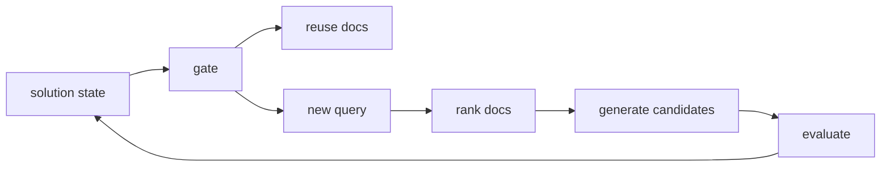
打分理由：联合检索与求解的双层进化，代码可复现（core 8 / wide 7）

---
想精读哪一篇？在 Claude 里说：`精读 2026-10-02 第 N 条`，Jarvis 会按你的 known.md 只讲你不会的部分。