# Jarvis 日报 · 2026-10-03

候选 507 → 过滤后 181 → 入选 18。图例：⭐ 核心方向 · 🌐 全领域热点 · ✅ 已掌握前置 · 🔲 需补前置

## 📄 论文 · 核心方向

### 1. ⭐ 📄 Beyond Memory: Harnessing Long-Horizon Agents with Explicit Belief States
arXiv [2610.01415](https://arxiv.org/abs/2610.01415) · HF 🔥 77 · Yu Luo, Jiamin Jiang, Yimin Zuo 等 · [PDF](https://arxiv.org/pdf/2610.01415) · [代码](https://github.com/luoyu100/PoS) ★22

**一句话**：PoS 用显式 belief state 管 long-horizon agent，四个基准全都拿到最优。
**为什么值得你看**：适合看 agent 记忆/长上下文怎么从存历史变成控状态。

**核心架构**：反直觉点在于：长上下文、外部 memory 都加上了，agent 还是会“记得很多却不知道现在世界什么样”。现有做法多把历史压缩或检索回去，但只保证证据在，不保证当前状态是可检查、可更新、可行动的。PoS 的关键改变是把 decision context 改成 explicit belief state：belief 由当前 world state 估计 + 未解决任务需求组成，组件分别阻断“状态过期”和“目标悬空”。它再加 Belief Sentinel 做 consistency validation，专门拦住自相矛盾、缺证据的更新；再用 gap persistence、progress stagnation、belief recurrence 诊断 Belief Trapping，拦住“动作还在走但目标没推进”。最直接证据是四个 benchmark 上、三种 backbone 下都拿到最高总体性能，且 ablation 说明只做显式 belief 还不够，必须有 validation 和 recovery。新意主要在系统组织层：不是更会总结历史，而是把 belief 构造、校验、陷阱诊断、恢复串成一个推理时闭环。

- 四个基准、三 backbone 全面最优
- 只显式 belief 不够，校验和恢复是关键
- 恢复策略依赖陷阱模式与未解 gap
**精读价值**：值得精读，核心是长时序 agent 的状态组织范式。
**关联**：[[ReAct]]、[[POMDP]]
#agent #memory #belief-state · 难度：硬核 · 建议：建议精读
前置：🔲 [[ReAct]] · 🔲 [[planning]] · 🔲 [[memory]] · ◽ POMDP

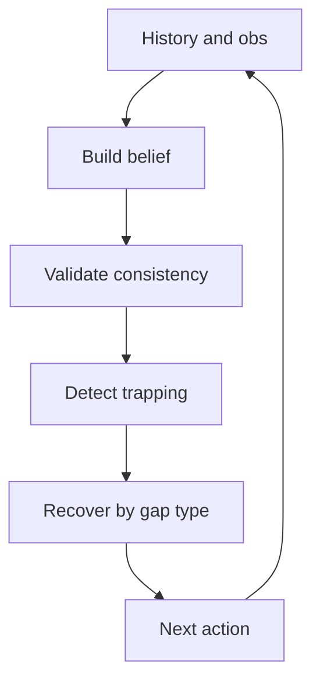
<sub>打分理由：长时智能体显式belief状态推理框架。（core 9 / wide 7）</sub>

### 2. ⭐ 📄 Fewer Tokens, Better Action: GPT-6 Astra Robot Agents with 14% Higher Success Rate but 65% Fewer Tokens
arXiv [2610.01939](https://arxiv.org/abs/2610.01939) · HF 🔥 34 · Ruiyang Si, Jianxin Bi, Shunyu Yang 等 · [PDF](https://arxiv.org/pdf/2610.01939) · [代码](https://github.com/DAGroup-PKU/PyRUA-Lean) ★18

**一句话**：PyRUA-Lean 用 Python 组机器人原语，成功率 63.1% 到 71.7%，token 省 65%。
**为什么值得你看**：适合看 VLM 机器人 agent 的接口设计和推理成本优化。

**核心架构**：痛点很具体：机器人任务里，工具调用每走一步就要再问一次模型，还会把中间图像和状态反复塞回上下文，导致 token 和调用数爆炸。PyRUA-Lean 的关键改动不是换更强 planner，而是把控制接口从 tool calling 改成可执行 Python：代码里直接编排 classical primitives 和 VLA policy，遇到条件判断、局部失败就本地重试，只在需要时回传显式请求的图像和状态。这里的“组件”分别阻断两类失败：persistent program state 阻断重复推理同一中间结果，selective observation 阻断无关视觉信息进入上下文，conditional retry 阻断一次失败就回到模型重规划。最强证据是同一 GPT-6 Astra planner、同一底层 primitives、同一预算下，在 700 个模拟任务上成功率从 63.1% 升到 71.7%，且共同解实例上少 49% 调用、65% 输入 token。新意在系统组织层和接口层：不是单个 skill 变强，而是让代码承接执行细节，模型只管高层决策。

- 同 planner 同 primitives 下仍提升成功率
- 共同解实例少 49% 调用、65% token
- 代码回传可控，省的是上下文而非算力
**为什么现在上榜**：原文未明确
**精读价值**：值得看实现思路，尤其是机器人 agent 接口怎么降成本。
**关联**：[[ReAct]]、[[Code as Policies]]
#agent #robotics #vla · 难度：中等 · 建议：值得通读 (20 min)
前置：🔲 [[VLM]] · 🔲 [[vision-language-action]] · 🔲 [[planning]] · 🔲 [[KV cache]]

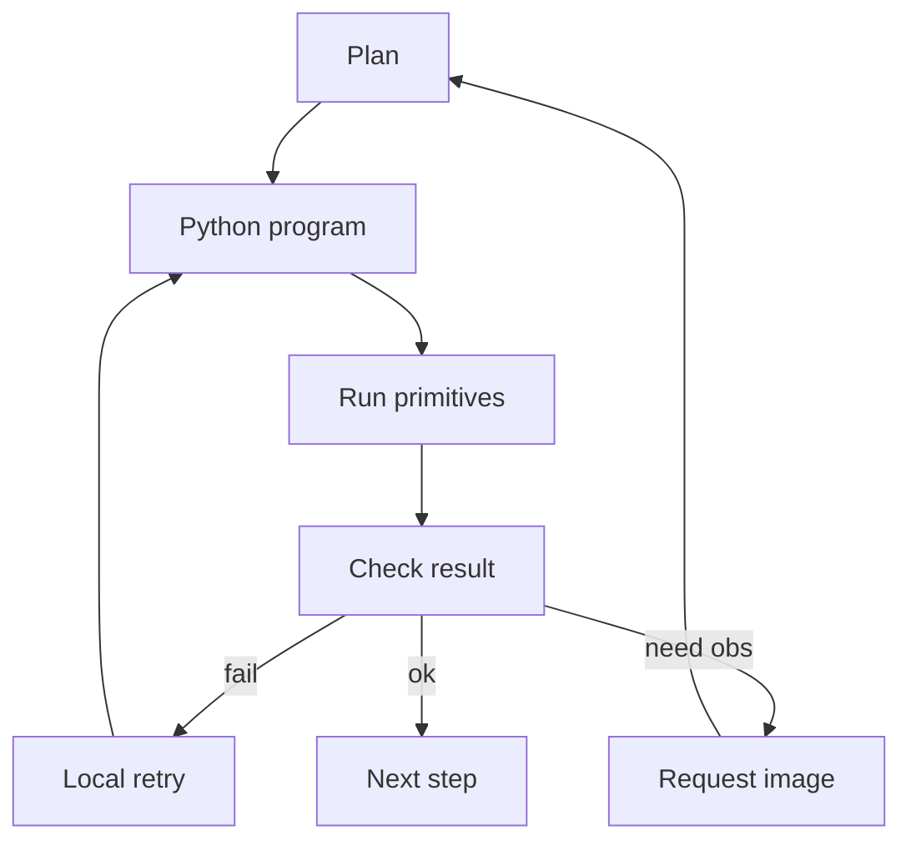
<sub>打分理由：VLM agent+机器人；省token框架对工程很实用（core 9 / wide 6）</sub>

### 3. ⭐ 📄 MemFold: Learning Compact Soft Memory for Long-Context Personalization via On-Policy Optimization
arXiv [2609.36435](https://arxiv.org/abs/2609.36435) · HF 🔥 6 · Jingxuan Wu, Yuzhe Yang, Yiqiao Huang 等 · [PDF](https://arxiv.org/pdf/2609.36435) · [代码](https://github.com/Johnny221B/memfold) ★3

**一句话**：MemFold 把长程个性化记忆压成固定 K 向量，三 backbone 都拿到最高准确率。
**为什么值得你看**：适合看 long-context personalization 里 memory 怎么从“存文本”变成“可训练接口”。

**核心架构**：反直觉点在于：长记忆不是越能复原文本越好，关键是压缩后还能不能支持当前回答。现有文本 memory 虽可读可改，但每轮重编码且长度随历史增长；latent memory 虽固定预算，却常按重建文本或模仿参考答案训练，和真正生成答案时的行为不对齐。MemFold 的关键改变是把 memory 当成 fixed-budget soft memory interface 来优化：先把 query-conditioned textual memory 压成 K 个 continuous vectors，再在学生自己的 rollouts 上训练，而不是在它没走过的序列上监督。它用两股信号阻断两种失败：group-relative rewards 管任务结果，confidence-gated on-policy distillation 用冻结 textual-memory teacher 重新给学生采样 token 打分，补上“哪些 token 本来更该依赖文本记忆”的密集梯度，同时不让 teacher 压过学生分布。最直接证据是 PersonaMem-32K/128K 上三种 Qwen backbone 都是最高，且历史越长优势越大，说明它不是单纯更会记，而是更会把记忆转成行为。新意在优化层：训练目标直接对齐 reader 行为，而不是重建存储内容。

- on-policy，监督学生自己的轨迹
- teacher 只重评分，不直接采样
- 长历史下优势更明显
**精读价值**：值得精读，重点在软记忆的训练目标怎么对齐行为。
**关联**：[[prefix tuning]]、[[latent memory]]
#memory #long-context #rlhf · 难度：硬核 · 建议：建议精读
前置：🔲 [[LoRA]] · 🔲 [[knowledge distillation]] · ◽ on-policy · 🔲 [[latent memory]]

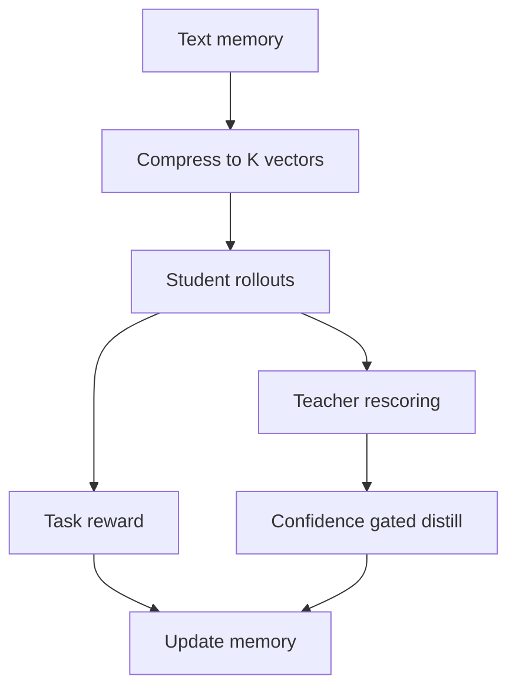
<sub>打分理由：长上下文个性化记忆+on-policy优化，核心高度相关。（core 9 / wide 7）</sub>

### 4. ⭐ 📄 On-Policy or Off-Policy Learning? A Systematic Study of Distillation Dynamics
arXiv [2609.35259](https://arxiv.org/abs/2609.35259) · HF 🔥 152 · Julianna Piskorz, Antonin Berthon, Mihaela van der Schaar · [PDF](https://arxiv.org/pdf/2609.35259)

**一句话**：用 controlled strong-to-weak distillation 分离 rollout policy，发现 forward KL 在不同 rollout 下仍稳，作者报告 2 个任务族
**为什么值得你看**：你在看后训练时最容易混淆的变量，这篇专门拆开了

**核心架构**：反直觉点是：大家常把 on-policy 的收益归因于“数据更贴近当前模型”，但在 SFT vs RLVR 里，rollout policy、objective、监督密度、优化器全搅在一起，根本看不出真因。作者的关键改法，是把 strong-to-weak distillation 变成可控试验台：固定师生框架，只独立改 rollout policy、token-level KL direction 和 learning rate。这里 rollout policy 是数据由谁采样，KL direction 是梯度在“更贴老师”还是“更贴学生”方向上推。结果最关键的因果链是：forward KL 对 rollout policy 很鲁棒，说明“是否 on-policy”本身不是主因；reverse KL 才明显偏好 student-generated rollouts；而 forgetting 和 update sparsity 主要由 learning rate 决定，不是 rollout 决定。最直接的证据是连续 student-teacher rollout spectrum 上的 gradient analysis：forward KL 近乎不变，reverse KL 随 rollout 改得很明显。新意主要在实证层：把常被绑在一起的三个因素拆开后，重新排序了它们的作用。

- forward KL 对 rollout policy 几乎不敏感
- on-policy 只稳定提升 harder Countdown 泛化
- RLVR 之后这点泛化优势不一定保留
**精读价值**：适合精读，能校正你对 on-policy 的直觉
**关联**：[[Hinton et al. 2015]]、[[RLVR]]
#rl #distillation #alignment · 难度：硬核 · 建议：建议精读
前置：🔲 [[knowledge distillation]] · 🔲 [[direct preference optimization]] · 🔲 [[group relative policy optimization]] · 🔲 [[reward model]]

```mermaid
graph TD
A rollout policy
B KL direction
C learning rate
D student updates
E task accuracy
F forgetting
A --> D
B --> D
C --> D
D --> E
D --> F
```
<sub>打分理由：对on/off-policy蒸馏动态有系统实验。（core 8 / wide 6）</sub>

### 5. ⭐ 📄 GraphForge: Training Working Agents with Graph-Anchored Workspace Synthesis
arXiv [2609.38923](https://arxiv.org/abs/2609.38923) · HF 🔥 82 · Qisheng Su, Hanchen Wang, Guanru Zhu 等 · [PDF](https://arxiv.org/pdf/2609.38923)

**一句话**：用 evidence graph 生成工作流数据，Qwen3.6-27B 在 GDPVal 上 +65.7，Workspace-Bench-Lite +7.7
**为什么值得你看**：很像 agent 数据工程的关键瓶颈题，面试常问

**核心架构**：真实痛点是：工作型 agent 需要读很多文件、跨工具协作、交付可验结果，但现有合成数据要么文件是模型编的，像不像真工作不够；要么基于真实文件却没有任务级 verifier，结果好坏没法稳查。GraphForge 的核心改法，是把“任务”和“验收”都绑到 real files 上：先用 occupation-grounded seeds 控制任务方向，再围绕爬来的 workspace 建 evidence graph，把文件之间的依赖关系显式化；task statement 由图编译出来，rubric 也锚定到图节点，所以每条要求都能回指到支撑它的文件。这里 evidence graph 的作用不是画图，而是阻断“任务写得空”和“验收标准不可证”这两种失败。最直接的证据是作者报告：用 2,169 条 trajectories 微调 Qwen3.6-27B，GDPVal、Workspace-Bench-Lite、SpreadsheetBench II 都有明显提升；再用 evidence-anchored rubrics 做 rejection fine-tuning 还能继续涨，说明 rubric 不只是描述文本，而是能提供筛选信号。新意在系统组织层：把数据生成、验证、修订串成闭环，而不是只做一次性合成。

- 作者报告 2,169 条轨迹即可带来多项基准提升
- rubric-guided rejection fine-tuning 继续增益
- 没说明开放数据之外的生成成本与失败率
**为什么现在上榜**：原文未明确
**精读价值**：值得看，尤其是 agent 数据与 verifier 设计
**关联**：[[EnvCraft]]、[[NexForge]]
#agent #data #tool-use · 难度：中等 · 建议：值得通读 (20 min)
前置：🔲 [[planning]] · 🔲 [[memory]] · 🔲 [[multi-agent]] · 🔲 [[model context protocol]]

```mermaid
graph TD
A real files
B evidence graph
C task statement
D rubric
E rollout check
F repaired data
A --> B
B --> C
B --> D
C --> E
D --> E
E --> F
```
<sub>打分理由：用证据图训练可验证工作型智能体。（core 8 / wide 6）</sub>

### 6. ⭐ 📄 X-Tree: Tokenizing Reusable Experience for Efficient Agent Generalization
arXiv [2609.32993](https://arxiv.org/abs/2609.32993) · HF 🔥 29 · Sitao Cheng, Xunjian Yin, Zhiyuan Sun 等 · [PDF](https://arxiv.org/pdf/2609.32993) · [代码](https://github.com/sitaocheng/X-Tree) ★2

**一句话**：把轨迹 token 化成 X-Tree，三种训练都能用，WebArena 最多 +4.5% SR
**为什么值得你看**：你做 agent 训练/评测时，最缺的是把经验复用进权重里

**核心架构**：反直觉点是：多步 agent 的训练明明有大量重复子程序，但 SFT 和 RLVR 都把轨迹当平铺 token 流，等于每一步都同权，没利用“可复用技能”的结构；而现有 harness 式技能库只是写进上下文，没进权重，泛化只停留在检索。X-Tree 的关键改变是把经验像文本 tokenizer 一样做分层合并：先把动作规范成 typed token，再按 reusability score 把频繁、长、且常出现在成功轨迹里的片段合并成树节点。这里 X-Tree 节点不是摘要，而是“一个高频成功技能如何由子技能组成”，它阻断的是 flat training 只学到表面动作序列、却学不到可迁移子程序的问题。最强证据是 matched data and budget 下，在 WebArena、ScienceWorld、WebShop 三个环境和三种训练设定里都优于标准 recipe，且 ablation 指向 X-Tree 结构本身，而不是单纯调参。新意在组件层加系统层都有：既提出经验 tokenization，也把它接进 offline RL、online RLVR、on-policy self-distillation。

- zero LLM calls 就能挖出层级技能
- 三种训练范式都能接入同一树
- 复现依赖轨迹质量与动作规范化
**为什么现在上榜**：原文未明确
**精读价值**：值得精读，尤其适合做 agent 训练方向谈资
**关联**：[[Sutton et al. 1999]]、[[Option discovery]]
#agent #rl #tokenization · 难度：硬核 · 建议：建议精读
前置：🔲 [[ReAct]] · 🔲 [[planning]] · 🔲 [[memory]] · 🔲 [[group relative policy optimization]]

```mermaid
graph TD
A flat trajectories
B typed actions
C reusability score
D X Tree
E training recipes
F generalization
A --> B
B --> C
C --> D
D --> E
E --> F
```
<sub>打分理由：可复用经验分层token化；面向agent泛化关键（core 8 / wide 5）</sub>

### 7. ⭐ 📄 When Users Change Their Minds: Measuring and Repairing Intent Drift in LLM Agents
arXiv [2609.32520](https://arxiv.org/abs/2609.32520) · HF 🔥 14 · Yanjie Zhang, Bowen Cao, Zixin Chen 等 · [PDF](https://arxiv.org/pdf/2609.32520)

**一句话**：IntentFlux+StateForge 让 8 个模型的意图漂移可测，General-Test 提升到 0.467
**为什么值得你看**：做 agent 评测和多轮对话时很对口

**核心架构**：反直觉点在于：多轮里模型不是“忘了”任务，而是把已经被撤回的约束继续算进最终动作。传统 sharded instruction 或 evolving-intent 评测只能看最终对不对，分不清是旧意图残留、还是单纯长对话丢信息。作者把问题改成“已知最终意图 + 可控旧信息”两件事：IntentFlux 把可验证任务转成带 revision/withdrawal 的对话，保留原始 grader；StateForge 则先维护 active requirements，再把被撤回内容和由其推出的结论剔掉，最后再生成。最直接的证据是 627-case calibration 里，随 superseded/withdrawn 信息增多，mean task score 从 0.476 掉到 0.384；而只加长度不加改意图的 control 仍接近单轮，说明不是 turns 多就会崩。新意主要在系统组织层：把“记住历史”拆成“判定哪些历史仍有效”的显式 state folding。

- 627-case 校准：多轮改意图显著掉分
- 给 ground-truth state 仍未回到单轮，说明不仅是 state estimation 错
- 对“历史压缩”类 harness 形成直接对照
**精读价值**：值得精读，核心是把多轮失败拆开测清楚
**关联**：[[ReAct]]、[[self-instruct]]
#agent #eval #rlhf · 难度：中等 · 建议：建议精读
前置：🔲 [[planning]] · 🔲 [[memory]] · 🔲 [[long context]] · 🔲 [[on-policy distillation]]

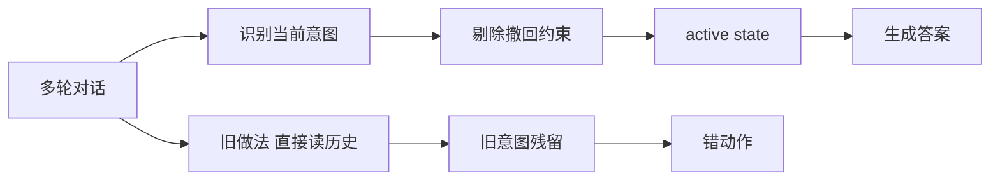
<sub>打分理由：intent漂移基准，agent安全与评测相关（core 8 / wide 6）</sub>

### 8. ⭐ 📄 FlexRouter: Learning Complementary Model Sets for Flexible LLM Routing
arXiv [2609.38585](https://arxiv.org/abs/2609.38585) · HF 🔥 7 · Wang Wei, Harry Yang, Tiankai Yang 等 · [PDF](https://arxiv.org/pdf/2609.38585)

**一句话**：FlexRouter 用 DPP 路由模型，目标从 top-k 变成覆盖率
**为什么值得你看**：做 MoE、推理路由和多模型系统都能直接借鉴

**核心架构**：现有 router 常按模型独立打分选 top-k，但这会把“互相很像、一起失败”的模型一起选上：预算花了，覆盖率却没涨。作者把路由目标改成“至少一个模型答对”的 answer coverage，然后用 DPP 表达“强但不冗余”的子集：对角线奖励单模型能力，非对角线压制相似模型的共选。关键取舍是训练时不追单一 ground-truth subset，而是对 failure set 做边缘化，直接优化覆盖率；推理时用 marginal log-determinant 增益做 greedy，并可 early stopping，所以子集大小不再固定。最强证据是 RouterEval 上同时做到更高 coverage 和更低 redundancy，而且 in-domain / out-of-domain 都成立。新意在系统组织层：把“选最强几个”改成“选一组互补模型”。

- 核心指标不是准确率，而是至少一个答对的 coverage
- DPP 显式惩罚冗余，针对共享 failure mode
- 不足：最终答案选择仍依赖 downstream verifier 或用户
**精读价值**：值得通读，适合看路由目标怎么重写
**关联**：[[Mixture of Experts]]、[[conditional computation]]
#routing #moe #inference · 难度：硬核 · 建议：值得通读 (20 min)
前置：🔲 [[mixture of experts]] · ◽ DPP · ◽ routing · ◽ verifier

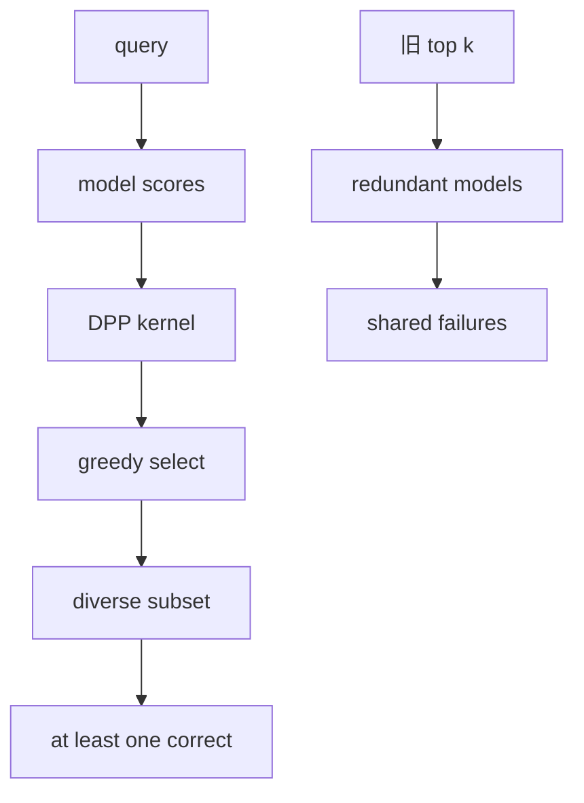
<sub>打分理由：面向推理成功率的路由，直接对应多模型/系统。（core 8 / wide 6）</sub>

## 🧰 项目 · 核心方向

### 9. ⭐ 🧰 XiaoPuOuO/openchatx-mcp
[GitHub](https://github.com/XiaoPuOuO/openchatx-mcp) ★250 · infra · TypeScript

**一句话**：OpenChatX 把 ChatGPT 变成本地 agent runtime，1 条 MCP 连接管本地工具
**为什么值得你看**：做 agent 工具链、MCP 和本地执行环境时很实用

**核心架构**：它解决的是“ChatGPT 会规划，但本地执行和工具编排散在各处”的痛点：你想让模型调用本地文件、shell、电脑控制、别的 MCP server，还要跨会话续接。OpenChatX 的承重组件是本地 MCP server + 官方 Secure MCP Tunnel + Desktop App：本地起服务，tunnel-client 走出站 HTTPS 连 OpenAI 隧道，ChatGPT 通过官方 MCP app 流程进来，再由 OpenChatX 分发到 file/shell/computer/MCP servers/Skills/Rules/Projects/Subagents。关键机制是“检测到 ChatGPT 的工具调用 → 通过隧道转发到本地 runtime → 再路由到具体工具”，而不是改造 ChatGPT 本体。成熟度信号较强：有桌面安装包、分平台下载、最近 release v1.0.1-beta.1，且文档明确区分官方接口和权限风险；但当前仍是 beta，Windows 还提示未签名。相较普通 MCP host，它差在把 ChatGPT 直接当入口，并把本地 runtime、跨会话摘要和子代理放到同一层。

- 有桌面版、release 和安装包，不是纯概念页
- 核心不是功能列表，而是官方 MCP tunnel 这条接入链
- Windows 未签名且权限风险高，适合受控环境
**为什么现在上榜**：最近 release：v1.0.1-beta.1（2026-10-01）
**精读价值**：值得关注，偏成熟项目，适合试用不是精读
**关联**：[[Model Context Protocol]]、[[ReAct]]
#mcp #agent-runtime #tool-use · 难度：中等 · 建议：值得通读 (20 min)
前置：🔲 [[model context protocol]] · 🔲 [[tool use]] · 🔲 [[planning]] · 🔲 [[memory]]

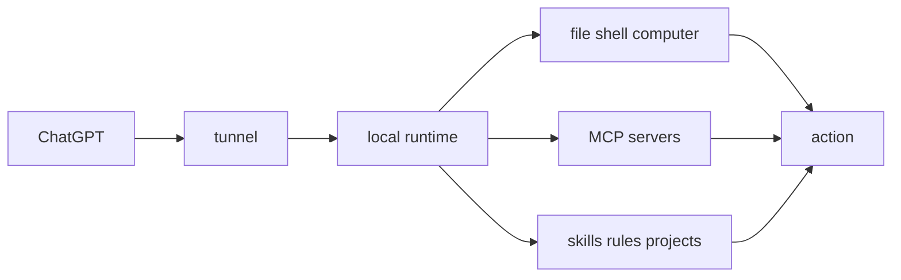
<sub>打分理由：本地agent运行时+MCP对接，贴近Agent工程（core 8 / wide 7）</sub>

### 10. ⭐ 🧰 SWE-agent/mini-swe-agent
[GitHub](https://github.com/SWE-agent/mini-swe-agent) ★8,181 (+1263 本月) · Trending monthly · model · Python

**一句话**：100行 Bash agent，SWE-bench verified 超74%，还支持本地/沙盒运行。
**为什么值得你看**：适合看 agent scaffold 该删到多薄

**核心架构**：反直觉点是：做代码 agent 不一定要复杂 tool-calling、状态 shell 和大堆历史处理；在很多可用模型上，这些反而成了脆弱点。mini-swe-agent 的关键改法是把 agent 收缩成“LLM + bash + 线性消息历史”：组件上，bash 作为唯一工具，阻断了多工具接口不一致导致的适配成本；每步用 subprocess.run 独立执行，阻断长驻 shell 状态污染和沙盒化困难；历史只追加消息，阻断 trajectory 和 prompt 分叉，便于调试和 FT/RL。最直接的证据是它在 SWE-bench verified 上仍然超过 74%，同时作者强调启动更快、可在本地/容器中稳定跑。新意主要在系统组织层：不是提出新算法，而是证明“极简 scaffold 也能保住性能”。

- 最强证据是 >74% SWE-bench verified
- 不证明复杂工具一定无用；多工具场景仍需 SWE-agent
- 复现门槛低，真正难的是选对 model 与 sandbox
**精读价值**：适合精读 scaffold 设计，不适合只看榜单
**关联**：[[SWE-agent]]、[[Claude Code]]
#agent #benchmark #swe-bench · 难度：中等 · 建议：值得通读 (20 min)
前置：🔲 [[SWE-bench]] · ◽ bash · ◽ subprocess.run · ◽ tool-calling

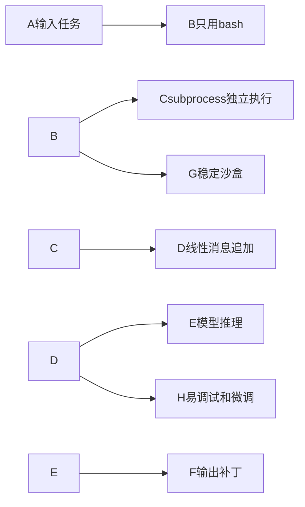
<sub>打分理由：轻量 agent，贴近 SWE-bench，复现价值高。（core 7 / wide 7）</sub>

### 11. ⭐ 🧰 calesthio/OpenMontage
[GitHub](https://github.com/calesthio/OpenMontage) ★62,659 (+328 今日) · Trending daily · infra · Python

**一句话**：开源 agent 视频生产系统，12 条流水线、100+ 工具、700+ 规则文件。
**为什么值得你看**：适合看多模态 agent 怎么把视频生产拆成可执行流程

**核心架构**：它解决的是“想用自然语言做完整视频，但单靠生成模型只会产出碎片素材”的痛点。OpenMontage 的关键不在单个模型，而在 agent 组织生产链：先把参考视频或需求转成脚本、分镜、素材计划，再按 pipeline 拉取库存镜头、生成/改写镜头、做剪辑和最终合成；核心阻断点是把“生成”与“装配”分开，避免模型直接端到端生成导致时长、节奏、叙事都失控。它还把真实 motion clips、stock footage、narration、Remotion/FFmpeg/Blender 等工具接到同一条生产线里，说明它不是“图生视频外壳”而是视频制作编排层。正文里最强的成熟度信号是大量可复现成片、公开成本、参考视频到方案的工作流，以及 Backlot 这种生产看板；但 README 很像产品页，原文未明确测试覆盖和 release 稳定性。新意主要在系统组织层：把 agent 变成视频工业流程调度器。

- 最强证据是成片、公开成本和可追踪流水线
- 没证明泛化到所有影视风格；强依赖工具链质量
- 复现难点在素材版权、各模型接口和渲染链
**为什么现在上榜**：原文未明确
**精读价值**：值得看系统编排，不是看单个生成模型
**关联**：[[ReAct]]、[[Remotion]]
#agent #multimodal #video-generation · 难度：中等 · 建议：看速览即可
前置：◽ agent · 🔲 [[video generation]] · 🔲 [[diffusion model]] · 🔲 [[planning]]

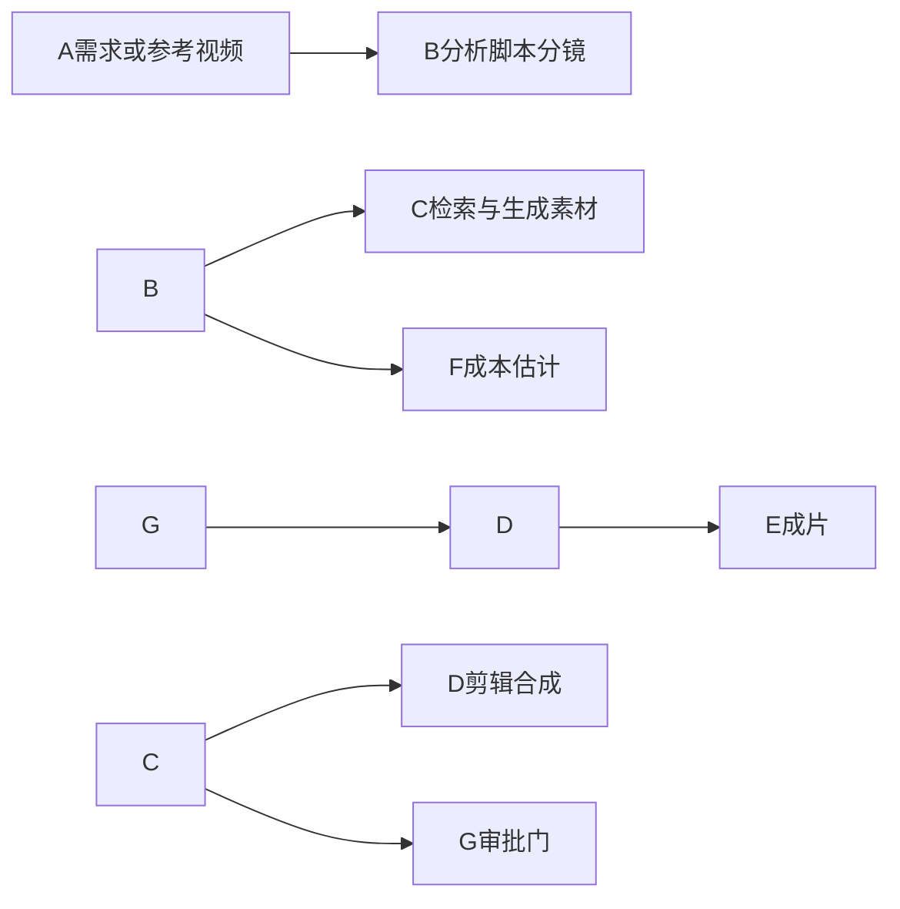
<sub>打分理由：开源agentic视频生产系统，pipeline与代码价值高（core 7 / wide 8）</sub>

### 12. ⭐ 🧰 breferrari/obsidian-mind
[GitHub](https://github.com/breferrari/obsidian-mind) ★4,875 (+45 今日) · Trending daily · tool · TypeScript

**一句话**：给 Claude Code 装持久记忆的 Obsidian vault，9.0 把上下文改成指令文件。
**为什么值得你看**：适合看 agent memory 和 MCP/CLI 集成

**核心架构**：它解决的是“agent 每次开新会话都失忆，钩子还会被截断”的悖论：你把记忆塞进 hooks，结果 Claude Code 会截断 10,000 字符，`/compact` 后只剩指针，子 agent 还拿不到。9.0 的关键改法是把会话上下文改成 instruction file，让它像 `CLAUDE.md` 一样进入主上下文并穿过 `/compact`、`/clear`，同时给它独立预算，阻断 hook 输出过长被裁、以及子 agent 不见记忆的问题。配套上，Obsidian vault 负责把对话、任务、决策、brag doc 组织成可检索知识；QMD/embedding/MCP 则负责把“找得到旧决策”从 grep 提升为语义检索。最直接的证据是它明确列出 9.0 对 Claude Code 的修复边界、支持 Codex/Gemini CLI，并且有一整套命令演示记忆如何回写和回读。新意在系统组织层：不是新检索算法，而是把 agent 记忆接进 CLI 的真正生命周期。

- 最强证据是指令文件穿透 /compact 和子 agent
- 不证明记忆一定提升所有任务；偏工作流场景
- 复现要同时配 Obsidian、CLI 和可选 QMD
**为什么现在上榜**：作者报告 v9.0.0，最近更新集中在 2026-10-03 前后
**精读价值**：值得精读，重点看记忆注入和检索链路
**关联**：[[RAG]]、[[Model Context Protocol]]
#agent #memory #rag #long-context · 难度：中等 · 建议：值得通读 (20 min)
前置：🔲 [[memory]] · 🔲 [[retrieval-augmented generation]] · 🔲 [[embedding]] · 🔲 [[Model Context Protocol]]

```mermaid
graph LR
A会话输入-->B指令文件
B-->C主上下文
C-->D子agent
C-->E任务与决策写回
E-->FObsidian vault
F-->GQMD语义检索
G-->C
```
<sub>打分理由：Obsidian 笔记+AI 持久记忆，适合做 agent 迁移思路（core 7 / wide 6）</sub>

### 13. ⭐ 🧰 feder-cr/dots
[GitHub](https://github.com/feder-cr/dots) ★2,572 · infra · Python

**一句话**：用真实 Firefox+种子指纹跑网页代理，减少被封与失败；作者称可复现同一身份。
**为什么值得你看**：做 browser agent/自动化很对口，能看浏览器侧承重设计。

**核心架构**：它解决的反直觉点是：网页代理失败，常常不是模型不会推理，而是页面没载入、验证码弹出、登录过期、点击没落到位，模型甚至还没开始“思考”。dots 的关键改变是把“代理”拆成模型和浏览器两层，并把可见身份、事件可信度和持久会话都放进浏览器内核里：真实 Firefox 引擎里做指纹，避免网页看到 WebDriver/DevTools 这类自动化痕迹；`--seed` 固定一整套屏幕、字体、GPU、时区、语言，阻断“同一账号多次像不同机器”导致的风控；鼠标按路径移动、按键逐个发出，阻断脚本式事件被识别；`--profile-dir` 保留 cookie，阻断每次都要重新登录。最直接的证据是作者展示同一个浏览器界面里左侧对话、右侧实时网页，并明确说“the browser is what the website sees”。新意主要在系统组织层：不是再做一个会点网页的模型，而是把“隐身、持久、可控的浏览器”做成 agent 的底座。

- 强证据是内核级 Firefox 伪装，不是前端补丁
- 没证明泛化成功率，复杂站点仍可能卡住
- 复现门槛低，核心是装好 uvx 和 OpenRouter
**精读价值**：值得看，主要看 browser agent 该怎么避风控。
**关联**：[[Playwright]]、[[OpenAI Operator]]
#agent #browser-agent #automation · 难度：中等 · 建议：值得通读 (20 min)
前置：◽ browser agent · 🔲 [[prompt injection]] · 🔲 [[MCP]]

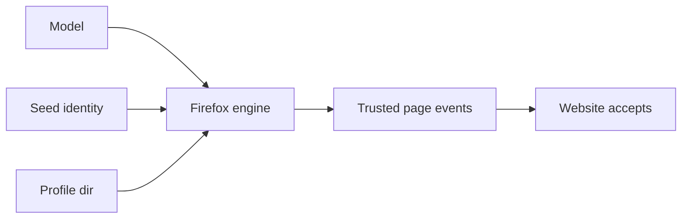
<sub>打分理由：浏览器Agent基础设施，适配检索/规划范式（core 7 / wide 7）</sub>

### 14. ⭐ 🧰 higgsfield-ai/higgsfield
[GitHub](https://github.com/higgsfield-ai/higgsfield) ★5,857 (+1729 本月) · Trending monthly · infra · Jupyter Notebook

**一句话**：用 GitHub 驱动分布式训练编排，打通 ZeRO-3/FSDP 与作业队列；作者称可训百亿到万亿参数。
**为什么值得你看**：适合看训练系统怎么把环境、排队、分布式收口成一层。

**核心架构**：它解决的痛点是：大模型训练不是只缺算力，而是环境版本、节点分配、实验排队、启动失败和 checkpoint 管理一起炸。Higgsfield 的关键设计是把“训练”组织成一个由 GitHub 和 GitHub Actions 驱动的作业系统：先在节点上装 Docker、部署密钥和二进制，再由自动生成的 deploy/run workflow 把代码送上机器；训练入口保持标准 PyTorch workflow，因此可接 `deepspeed`、`accelerate` 或自定义 sharding；同时它把节点分配、实验队列和监控收进同一套框架，并显式支持 ZeRO-3 和 FSDP 来阻断显存不够导致的大模型训练失败。最直接的支撑是文档里的训练示例：几十行代码就能定义 `Llama70b`、`AdamW`、数据加载和 `push_to_hub`，说明系统想压掉的是工程摩擦，不是改优化器。新意主要在系统组织层。

- 作者报告支持 ZeRO-3/FSDP 和队列管理
- 没看到大规模实测稳定性数据
- 复现依赖 SSH 节点与 GitHub 工作流
**为什么现在上榜**：最近 release：v0.0.4-rc（2024-03-23）。
**精读价值**：适合看训练编排思路，精读看部署链路。
**关联**：[[DeepSpeed]]、[[PyTorch FSDP]]
#training #distributed #orchestration · 难度：中等 · 建议：值得通读 (20 min)
前置：🔲 [[ZeRO]] · 🔲 [[FSDP]] · 🔲 [[bf16]] · 🔲 [[Adam]]

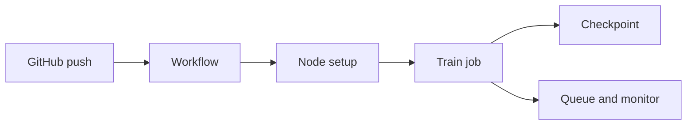
<sub>打分理由：GPU 编排训练框架，利于训练系统复现。（core 6 / wide 5）</sub>

## 🌐 全领域热点

### 15. 🌐 🧰 microsoft/ai-agents-for-beginners
[GitHub](https://github.com/microsoft/ai-agents-for-beginners) ★76,376 (+718 本周) · Trending weekly · tutorial · Jupyter Notebook

**一句话**：用 18 课教你搭 AI Agents，覆盖基础到代码样例；作者提供 50+ 语言翻译。
**为什么值得你看**：如果你要补 agent 基础或面试讲清概念，这个最快。

**核心架构**：它解决的是“知道 agent 很热，但不知道从哪搭起”的入门断层。这个项目的关键设计不是一个新 agent 框架，而是把学习路径拆成 18 课，每课围绕一个主题配代码样例、短视频和扩展资源，并统一用 Microsoft Agent Framework + Foundry Agent Service V2 跑通样例；多语言翻译通过 GitHub Action 自动维护，降低了课程分发和更新成本。最直接的证据是 README 明确列出课程结构、代码样例位置和支持的 provider，还给出 sparse checkout 来避免把 50+ 语言翻译全拉下来，说明它更像可维护的教学系统，而不是一次性文档。新意主要在教学/项目组织层，不在算法层。

- 强证据是完整课程+代码+多语言自动更新
- 没提供新方法或 benchmark
- 复现门槛低，主要是跟着 notebook 学
**为什么现在上榜**：原文未明确。
**精读价值**：看速览够了，除非你要系统补 agent 入门。
**关联**：[[ReAct]]、[[AutoGPT]]
#agent #getting-started #llm · 难度：入门 · 建议：看速览即可
前置：🔲 [[planning]] · 🔲 [[memory]] · 🔲 [[ReAct]] · 🔲 [[multi-agent]]

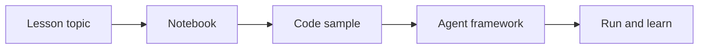
<sub>打分理由：入门 agent 教程，适合补基础但非研究产出（core 3 / wide 7）</sub>

### 16. 🌐 🧰 JuliusBrussee/caveman
[GitHub](https://github.com/JuliusBrussee/caveman) ★109,450 (+505 今日) · Trending daily · skill · Go

**一句话**：一套把代理口语压到 20% token 的 skill+proxy+middleware
**为什么值得你看**：面试讲 agent 成本/上下文压缩很顺手

**核心架构**：反直觉点是：coding agent 的“能力”不变，真正烧钱的是它写的解释性废话和读入的冗长日志。现有做法要么只改 prompt 语气，只省输出；要么只压输入，没法把外部工具结果和日志一起瘦身。Caveman 的关键改变是把压缩拆成三层：skill 负责改“说法”，proxy 负责在 provider 前压“读入”，middleware 负责在你自己的调用链里压工具结果，但原文、告警和可回溯内容都保留，失败时再取回原始上下文。最直接的证据是 README 里的示例：同一段 React 诊断从 63 tokens 变 20 tokens，正文还引用 Adobe 的 CAVEWOMAN 论文和 JetBrains 对 86 个真实任务的测试，后者报告“质量几乎不受影响”。新意主要在系统组织层：不是单点 prompt hack，而是把 token 预算控制做成可插拔运行时。

- 最强证据：63 tokens 变 20 tokens，诊断语义不变
- 没证明普适收益边界，代码/错误信息不被改写
- 复现低：npx 一条命令就能装，但质量评估依赖具体 agent
**为什么现在上榜**：最近有 v3.0.0 和 v3.1.0 release，且 stars 破 10 万，属于明显上榜期。
**精读价值**：值得看实现思路，不必精读机制细节
**关联**：[[ReAct]]、[[MCP]]
#agent #prompting #coding · 难度：入门 · 建议：看速览即可
前置：🔲 [[prompt injection]] · ◽ token budget · ◽ tool calling · ◽ agent

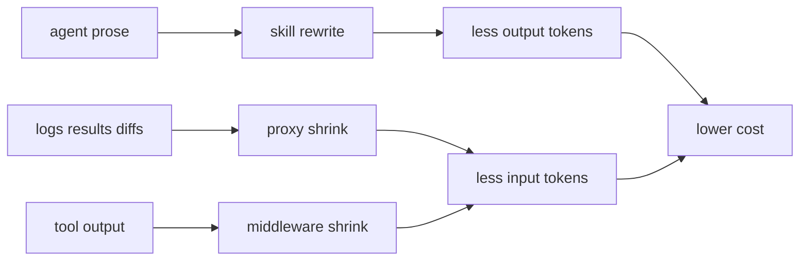
<sub>打分理由：面向coding agent的提示/代币节省技巧，较新（core 5 / wide 7）</sub>

### 17. 🌐 📄 OneStreamer: Unifying Perception, Memory, and Proactive Response in Streaming Video Interaction
arXiv [2610.01762](https://arxiv.org/abs/2610.01762) · HF 🔥 159 · Xiangyu Zeng, Yuandong Yang, Zhiqiu Zhang 等 · [PDF](https://arxiv.org/pdf/2610.01762) · [代码](https://github.com/MCG-NJU/OneStreamer) ★65

**一句话**：OneStreamer 用 1M 流式数据把记忆和响应统一，4B 模型拿到 8 个基准最优
**为什么值得你看**：适合你看 streaming video LLM 和 memory 设计

**核心架构**：反直觉点是：流式视频里，今天看见的片段未必现在有用，但以后却可能是回答关键；单纯把历史帧全塞进上下文又会挤掉当前观察，反而伤实时感知。现有 memory 方法多是“保留视觉 token”，解决的是可访问历史，不解决“可复用的事实记录”；而 proactive response 方法多管何时答，不管答之前怎么把证据沉淀成记忆。OneStreamer 的关键改法是把“记录”和“回应”并进同一个 proactive generation：PHCM 把已观察内容生成时间对齐的局部细节 caption 和事件摘要，作为可复用事实记忆，推理时用这些文本记录配合最近视觉窗口，不必回看历史视觉特征；PSTL 则避免 waiting state 标签淹没稀疏的响应决策，只保留代表性的状态变化/持续位置监督。最直接的证据是消融：保留生成 caption 能提升历史 QA，而且不伤实时感知；PSTL 只监督 27.5% 的状态 token 仍优于 dense supervision。新意主要在组件层加系统组织层：把生成文本当记忆接口，而不是把长视频硬扩窗。

- 最强证据：caption memory 提升历史 QA 且不降实时感知
- PSTL 只用 27.5% 状态 token 仍赢 dense supervision
- 条件边界：依赖流式标注和 evidence-aligned 数据合成
**精读价值**：值得精读，核心是记忆与响应的统一接口
**关联**：[[MemLong]]、[[Video-ChatGPT]]
#video #streaming #memory · 难度：硬核 · 建议：看速览即可
前置：🔲 [[long context]] · 🔲 [[memory]] · ◽ streaming video · 🔲 [[VLM]]

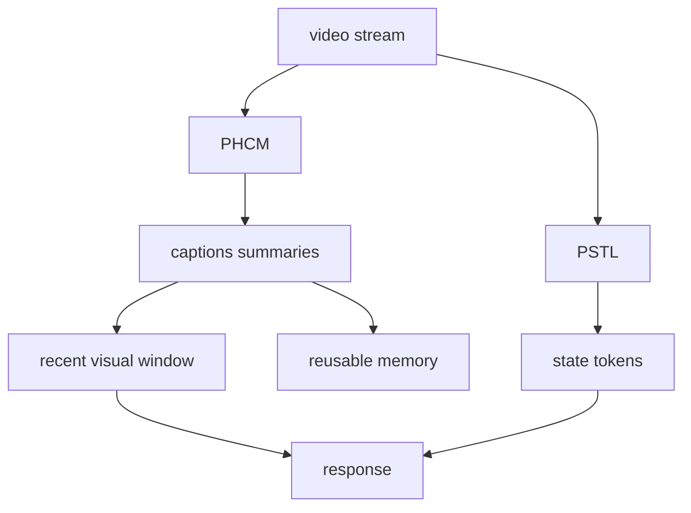
<sub>打分理由：流视频感知-记忆-响应联学习，贴多模态与长程证据（core 7 / wide 7）</sub>

### 18. 🌐 📄 DataMagic: Authoring Data Videos through Declarative Multi-Agent Orchestration
arXiv [2609.33403](https://arxiv.org/abs/2609.33403) · HF 🔥 10 · Yupeng Xie, Zhenyang Wang, Liangwei Wang 等 · [PDF](https://arxiv.org/pdf/2609.33403) · [代码](https://github.com/HKUSTDial/DataMagic) ★276

**一句话**：DataMagic 用 DVSpec+多智能体，把原始表格直接做成数据视频，109 例质量到 3.89
**为什么值得你看**：很适合看多智能体+声明式编排怎么落到可用系统

**核心架构**：反直觉点是：数据视频不是把图表“画出来”就完了，真正难的是把数字准确性、旁白叙事和动画时序同时对齐；纯 pixel generation 会幻觉数字，纯 authoring 又吃预制图。DataMagic 的关键改法是先把视频表示成 DVSpec：它把 chart、narration、animation 绑定到数据字段和叙事触发点上，阻断“图能看但数据不可追溯”“时间轴靠手工对齐”的失败；再用 Generate-then-Orchestrate，把多个角色 agent 先并行产出候选 scene，再在全局层按 insight value 和 coverage 选序，阻断局部最优拼接成的叙事断裂。最直接的证据是 109 个真实样本上，GPT-5 只拿 2.13/5，而 DataMagic 到 3.89，执行成功率超过 95%，用户研究还给出 79.7% 任务时间下降。新意主要在系统组织层：不是一个会生成视频的模型，而是一套可编辑、可审计的声明式编排系统。

- 最强证据：109 样本上质量 3.89，成功率超 95%
- 没证明通用视频生成，只覆盖数据视频场景
- 复现难度中等：要跑多 agent 和可编辑规范
**为什么现在上榜**：原文有明确开源代码，且刚发表，属于可关注的成熟系统。
**精读价值**：值得看系统设计，尤其是声明式状态如何做协同
**关联**：[[AutoGen]]、[[ReAct]]
#tooling #multimodal #data · 难度：中等 · 建议：看速览即可
前置：🔲 [[multi-agent]] · 🔲 [[planning]] · ◽ data provenance · ◽ visualization

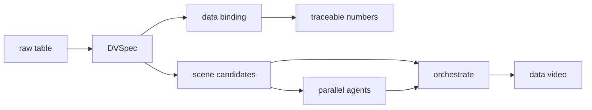
<sub>打分理由：数据视频自动化偏内容生产，非主线（core 2 / wide 7）</sub>

---
想精读哪一篇？在 Claude 里说：`精读 2026-10-03 第 N 条`，Jarvis 会按你的 known.md 只讲你不会的部分。